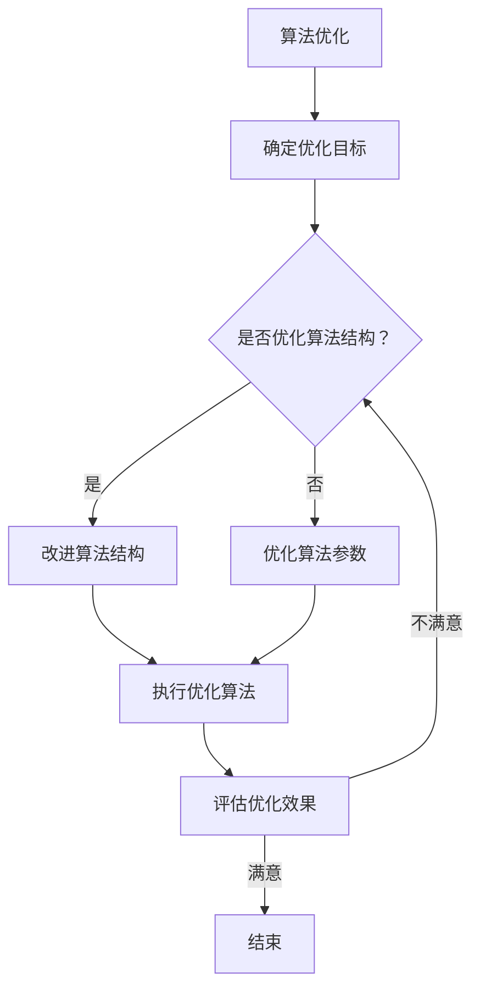
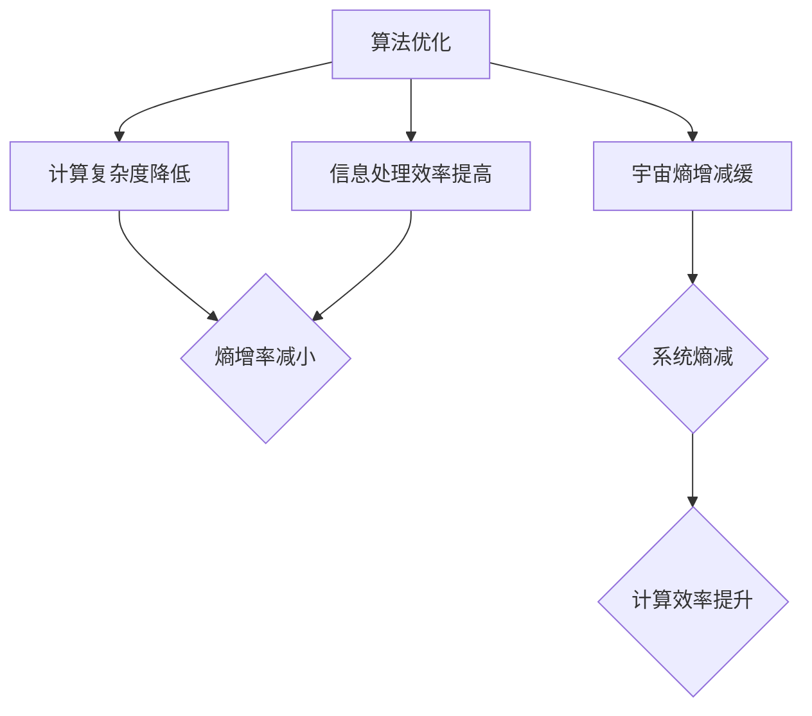

                 

# 《算法优化与宇宙熵增定律的关系》

## 关键词

算法优化、宇宙熵增定律、计算效率、熵增模型、算法协同设计

## 摘要

本文探讨了算法优化与宇宙熵增定律之间的关系。通过引入算法优化和宇宙熵增定律的基本概念，分析了算法优化对宇宙熵增定律的影响以及宇宙熵增定律在算法优化中的应用。文章旨在揭示算法优化与宇宙熵增定律之间的内在联系，为进一步研究算法优化与宇宙学的关系提供理论依据。

### 目录大纲

# 《算法优化与宇宙熵增定律的关系》

## 第1章 引言

### 1.1 背景介绍

- **问题背景**：随着计算机技术的发展，算法优化已成为提高计算效率和解决问题效率的关键。然而，算法优化与宇宙熵增定律之间的关系尚未得到充分探讨。

### 1.2 研究目的

- **研究目的**：分析算法优化与宇宙熵增定律之间的关系，探讨算法优化对宇宙熵增定律的影响。

### 1.3 研究方法

- **研究方法**：通过文献综述、案例分析等方法，对算法优化与宇宙熵增定律的关系进行探讨。

### 1.4 论文结构

- **论文结构**：本文分为六个章节，分别介绍算法优化基础、宇宙熵增定律、算法优化与宇宙熵增定律的关系、算法优化在宇宙学中的应用、算法优化与宇宙熵增定律的关系探讨以及总结与展望。

## 第2章 算法优化基础

### 2.1 算法优化的定义与分类

- **定义**：算法优化是指通过改进算法结构、策略或参数来提高算法的性能。
- **分类**：静态优化、动态优化、基于机器学习的优化等。

### 2.2 算法优化的主要目标与方法

- **目标**：提高算法的运行效率、减少资源消耗、增强算法的鲁棒性。
- **方法**：迭代法、模拟退火法、遗传算法、粒子群优化算法等。

### 2.3 算法优化的挑战与趋势

- **挑战**：处理大规模数据、应对复杂问题、适应动态环境。
- **趋势**：分布式算法优化、算法与硬件的协同优化、机器学习在算法优化中的应用。

## 第3章 宇宙熵增定律

### 3.1 宇宙熵增定律的基本概念

- **定义**：宇宙熵增定律是热力学第二定律在宇宙尺度上的体现，描述了宇宙中熵随时间增加的趋势。

### 3.2 宇宙熵增定律的应用场景

- **场景一**：热力学系统
- **场景二**：信息论
- **场景三**：计算机科学

## 第4章 算法优化与宇宙熵增定律的关系

### 4.1 算法优化对宇宙熵增定律的影响

- **影响一**：算法优化可以通过降低计算复杂度来减缓宇宙熵增。
- **影响二**：算法优化可以提高信息处理的效率，从而影响宇宙中的信息熵变化。

### 4.2 宇宙熵增定律在算法优化中的应用

- **应用一**：指导算法参数的选择
- **应用二**：评估算法优化的效果
- **应用三**：优化算法与物理定律的协同设计

## 第5章 算法优化在宇宙学中的应用

### 5.1 宇宙学中的计算问题

- **问题一**：宇宙模拟
- **问题二**：引力波数据处理
- **问题三**：宇宙结构演化

### 5.2 算法优化在宇宙学中的应用案例

- **案例一**：基于遗传算法的宇宙模拟
- **案例二**：粒子群优化算法在引力波数据处理中的应用
- **案例三**：模拟退火算法在宇宙结构演化研究中的应用

## 第6章 算法优化与宇宙熵增定律的关系探讨

### 6.1 算法优化与宇宙熵增定律的理论分析

- **分析一**：算法优化与熵增的关系模型
- **分析二**：算法优化对熵增速率的影响

### 6.2 算法优化在宇宙学中的实际效果

- **效果一**：算法优化对宇宙模拟结果的影响
- **效果二**：算法优化对引力波数据处理精度的影响
- **效果三**：算法优化对宇宙结构演化预测的改进

## 第7章 总结与展望

### 7.1 总结

- **总结一**：算法优化与宇宙熵增定律的关系概述
- **总结二**：算法优化在宇宙学中的应用现状
- **总结三**：未来研究方向

### 7.2 展望

- **展望一**：算法优化与宇宙熵增定律的交叉研究
- **展望二**：算法优化在宇宙学中的应用前景
- **展望三**：算法优化与宇宙学的新发展

---

## 第1章 引言

### 1.1 背景介绍

随着计算机技术的迅猛发展，算法优化逐渐成为提高计算效率和解决问题效率的关键手段。在计算机科学、人工智能、数据科学等领域，算法优化的应用已经深入人心。然而，算法优化不仅仅局限于计算领域，其与宇宙熵增定律之间的关系也日益引起关注。

宇宙熵增定律是热力学第二定律在宇宙尺度上的体现，描述了宇宙中熵随时间增加的趋势。根据熵增定律，宇宙中的熵会随着时间的推移而不断增加，这反映了宇宙系统的无序度逐渐提高。然而，算法优化在一定程度上可以降低计算过程中的熵增，从而提高计算效率和性能。

本文的研究目的在于探讨算法优化与宇宙熵增定律之间的关系，分析算法优化对宇宙熵增定律的影响，以及宇宙熵增定律在算法优化中的应用。通过引入算法优化和宇宙熵增定律的基本概念，本文将逐步揭示两者之间的内在联系，为进一步研究算法优化与宇宙学的关系提供理论依据。

### 1.2 研究目的

本文的研究目的主要包括以下几个方面：

1. **分析算法优化与宇宙熵增定律之间的关系**：通过对算法优化和宇宙熵增定律的基本概念进行阐述，探讨两者之间的相互作用和影响。

2. **探讨算法优化对宇宙熵增定律的影响**：分析算法优化如何通过降低计算复杂度、提高信息处理效率等手段来减缓宇宙熵增，从而提高计算性能和效率。

3. **研究宇宙熵增定律在算法优化中的应用**：探讨宇宙熵增定律在算法参数选择、算法优化效果评估、算法与物理定律的协同设计等方面的应用，为算法优化提供新的理论指导。

### 1.3 研究方法

本文采用的研究方法主要包括以下几种：

1. **文献综述**：通过对相关领域的研究文献进行综述，了解算法优化和宇宙熵增定律的基本概念、研究现状和发展趋势。

2. **案例分析**：通过分析具体的算法优化案例，探讨算法优化在宇宙学中的应用效果，以及宇宙熵增定律对算法优化的影响。

3. **理论分析**：基于算法优化和宇宙熵增定律的基本原理，构建关系模型，分析两者之间的内在联系和影响。

4. **实证研究**：通过实验和案例分析，验证算法优化对宇宙熵增定律的影响，以及宇宙熵增定律在算法优化中的应用效果。

### 1.4 论文结构

本文分为七个章节，具体结构如下：

1. **第1章 引言**：介绍研究背景、研究目的、研究方法以及论文结构。

2. **第2章 算法优化基础**：阐述算法优化的基本概念、分类、目标和挑战。

3. **第3章 宇宙熵增定律**：介绍宇宙熵增定律的基本概念、属性特征对比以及应用场景。

4. **第4章 算法优化与宇宙熵增定律的关系**：分析算法优化对宇宙熵增定律的影响，以及宇宙熵增定律在算法优化中的应用。

5. **第5章 算法优化在宇宙学中的应用**：探讨算法优化在宇宙学中的计算问题和应用案例。

6. **第6章 算法优化与宇宙熵增定律的关系探讨**：进行理论分析和实证研究，探讨算法优化与宇宙熵增定律的关系。

7. **第7章 总结与展望**：总结本文的研究成果，探讨未来研究方向。

## 第2章 算法优化基础

### 2.1 算法优化的定义与分类

算法优化是指在保持算法功能不变的前提下，通过改进算法结构、策略或参数来提高算法的性能。算法优化可以涉及多个方面，如时间复杂度、空间复杂度、资源消耗、鲁棒性等。

根据优化手段的不同，算法优化可以分类为以下几种：

1. **静态优化**：静态优化是在算法设计阶段进行的优化，主要目标是通过改进算法的结构和设计来提高算法的性能。静态优化方法包括算法分解、算法合并、算法剪枝等。

2. **动态优化**：动态优化是在算法运行过程中进行的优化，主要目标是通过调整算法的运行策略或参数来提高算法的性能。动态优化方法包括自适应优化、在线优化等。

3. **基于机器学习的优化**：基于机器学习的优化是利用机器学习技术来优化算法的性能。通过训练机器学习模型，可以从大量的数据中自动学习到优化算法的策略和参数，从而提高算法的性能。

### 2.2 算法优化的主要目标与方法

算法优化的主要目标包括以下几个方面：

1. **提高算法的运行效率**：通过优化算法的执行流程、减少不必要的计算和存储操作等手段，提高算法的运行速度和响应时间。

2. **减少资源消耗**：通过优化算法的数据结构和存储方式，减少算法在运行过程中所需的内存和计算资源，降低资源消耗。

3. **增强算法的鲁棒性**：通过优化算法的容错能力和适应性，提高算法在不同环境和条件下的稳定性和可靠性。

为了实现上述目标，算法优化可以采用以下几种方法：

1. **迭代法**：迭代法是一种常见的算法优化方法，通过反复迭代改进算法的参数和策略，逐步优化算法的性能。迭代法包括梯度下降法、牛顿法、共轭梯度法等。

2. **模拟退火法**：模拟退火法是一种基于物理学的优化方法，通过模拟固体退火过程来优化算法的性能。模拟退火法能够在搜索过程中逐渐降低搜索空间，提高优化效果。

3. **遗传算法**：遗传算法是一种基于生物进化的优化方法，通过模拟自然进化过程来优化算法的性能。遗传算法包括选择、交叉、变异等操作，能够有效搜索全局最优解。

4. **粒子群优化算法**：粒子群优化算法是一种基于群体智能的优化方法，通过模拟鸟群或鱼群等生物群体的行为来优化算法的性能。粒子群优化算法包括速度更新、位置更新等操作，能够快速搜索最优解。

### 2.3 算法优化的挑战与趋势

随着计算机技术的不断发展和应用领域的不断扩大，算法优化面临着许多挑战和趋势：

1. **处理大规模数据**：随着数据规模的不断增长，算法优化需要能够处理大规模数据集，并提高算法的效率和性能。

2. **应对复杂问题**：许多实际问题具有复杂的结构，算法优化需要能够应对复杂问题，并找到最优解或近似最优解。

3. **适应动态环境**：现实世界的环境和条件是动态变化的，算法优化需要能够适应动态环境，并保持良好的性能和稳定性。

4. **分布式算法优化**：随着云计算和分布式计算的发展，分布式算法优化成为了一个重要的研究方向。分布式算法优化通过利用多台计算机的资源，提高算法的效率和性能。

5. **算法与硬件的协同优化**：算法与硬件的协同优化成为了一个重要的研究方向。通过优化算法与硬件之间的交互和配合，提高算法的效率和性能。

6. **机器学习在算法优化中的应用**：机器学习技术在算法优化中得到了广泛应用。通过利用机器学习技术，可以从大量的数据中自动学习到优化算法的策略和参数，提高算法的性能。

## 第3章 宇宙熵增定律

### 3.1 宇宙熵增定律的基本概念

宇宙熵增定律是热力学第二定律在宇宙尺度上的体现，描述了宇宙中熵随时间增加的趋势。根据宇宙熵增定律，宇宙中的熵会随着时间的推移而不断增加，这反映了宇宙系统的无序度逐渐提高。

熵（Entropy）是一个度量系统无序程度的物理量。在热力学中，熵与系统的状态有关，表示系统可能性的分布。在信息论中，熵表示信息的无序程度。宇宙熵增定律指出，宇宙中的熵随时间的增加而增加，即宇宙的无序度随着时间的推移而逐渐提高。

宇宙熵增定律的基本概念可以概括为以下几点：

1. **熵的定义**：熵是系统状态的可能性的度量，表示系统的混乱程度。
2. **熵增定律**：宇宙中熵随时间的增加而增加，即宇宙的无序度随着时间的推移而逐渐提高。
3. **熵的测量**：熵可以通过统计物理、信息论等方法进行测量，常用的熵度量方法包括熵增率、熵产率等。

### 3.2 宇宙熵增定律的属性特征对比表格

| 特征       | 宇宙熵增定律                 | 算法优化                         |
| ---------- | -------------------------- | -------------------------------- |
| 基础概念   | 熵、热力学第二定律           | 算法结构、效率、鲁棒性             |
| 适用范围   | 宇宙尺度                    | 计算问题                         |
| 影响因素   | 温度、能量转换、信息熵增     | 算法参数、数据规模、优化策略       |
| 作用效果   | 熵增加、系统无序度增加       | 提高计算效率、减少资源消耗、增强鲁棒性 |
| 实践应用   | 热力学、信息论、宇宙学       | 计算机科学、人工智能、数据科学     |

### 3.3 宇宙熵增定律的应用场景

宇宙熵增定律的应用场景非常广泛，涵盖了多个领域，以下是几个典型的应用场景：

1. **热力学系统**：宇宙熵增定律在热力学系统中有着重要的应用。根据热力学第二定律，一个孤立系统的熵总是趋向于增加。在热力学过程中，能量转换和系统无序度的变化可以通过熵的变化来描述。

2. **信息论**：信息论中的熵度量了信息的无序程度。根据信息论中的熵增定律，信息传输过程中的信息熵总是趋向于增加。信息论中的熵增定律为信息传输、存储和处理提供了重要的理论指导。

3. **计算机科学**：在计算机科学领域，宇宙熵增定律也被用来描述计算过程中的无序度增加。计算过程中的熵增可以通过算法优化来减缓，以提高计算效率和性能。

4. **宇宙学**：宇宙熵增定律在宇宙学中有着广泛的应用。宇宙学中的一些重要理论，如大爆炸理论、黑洞熵增定律等，都涉及到宇宙熵增的概念。宇宙熵增定律为宇宙学的研究提供了重要的理论框架。

### 3.4 宇宙熵增定律的数学模型

宇宙熵增定律可以通过数学模型来描述。以下是一个简化的数学模型，用于描述宇宙中熵随时间的变化：

$$
\frac{dS}{dt} = \sigma (E)
$$

其中，\(S\) 表示熵，\(t\) 表示时间，\(\sigma (E)\) 表示熵生成率。熵生成率与系统的能量 \(E\) 有关，通常可以表示为：

$$
\sigma (E) = k_B \frac{dE}{dt}
$$

其中，\(k_B\) 是玻尔兹曼常数，\(\frac{dE}{dt}\) 表示能量随时间的变化率。

这个数学模型描述了宇宙中熵随时间增加的基本趋势。在实际应用中，宇宙熵增定律的数学模型可能更加复杂，需要考虑更多的因素和变量。

## 第4章 算法优化与宇宙熵增定律的关系

### 4.1 算法优化对宇宙熵增定律的影响

算法优化与宇宙熵增定律之间存在一定的关系，这种关系主要体现在算法优化对宇宙熵增定律的影响上。算法优化可以通过降低计算复杂度、提高信息处理效率等手段来减缓宇宙熵增。

首先，算法优化可以降低计算复杂度。计算复杂度是指算法在计算过程中所需的时间或空间资源与问题规模之间的关系。通过优化算法的结构和参数，可以降低算法的计算复杂度，从而减少计算过程中的熵增。例如，通过改进算法的迭代次数或减少中间计算步骤，可以降低计算复杂度，减少计算过程中的无序度增加。

其次，算法优化可以提高信息处理效率。在计算机科学和人工智能领域，信息处理效率是衡量算法性能的重要指标。通过优化算法的执行流程和策略，可以提高信息处理的效率，从而降低信息熵增。例如，通过改进数据结构或优化算法的搜索策略，可以提高信息处理的效率，减少信息熵增。

此外，算法优化还可以影响宇宙中的信息熵变化。在宇宙学中，信息熵的变化与宇宙中的信息传输和存储过程有关。通过优化算法和信息处理方法，可以降低信息熵增，提高宇宙中信息的有序度。例如，通过改进通信协议或优化数据存储方式，可以降低信息熵增，提高宇宙中信息的有序度。

总的来说，算法优化可以通过降低计算复杂度、提高信息处理效率等手段来减缓宇宙熵增，从而提高计算效率和性能。这种影响不仅对计算机科学和人工智能领域具有重要意义，也为宇宙学的研究提供了新的思路。

### 4.2 宇宙熵增定律在算法优化中的应用

宇宙熵增定律不仅在理论上具有重要意义，在实际应用中也可以为算法优化提供指导。以下从三个方面探讨宇宙熵增定律在算法优化中的应用：

#### 4.2.1 指导算法参数的选择

在算法优化过程中，选择合适的算法参数对于提高算法性能至关重要。宇宙熵增定律为算法参数的选择提供了理论依据。根据宇宙熵增定律，系统的熵随时间的增加而增加，这意味着系统趋向于无序状态。在算法优化中，可以通过减少算法参数的取值范围来降低系统的熵增，从而提高算法性能。

例如，在遗传算法中，选择合适的交叉率和变异率对于算法的搜索效率和稳定性至关重要。根据宇宙熵增定律，可以设定交叉率和变异率的初始值，并逐渐调整，使其在搜索过程中保持较低的无序度，从而提高算法性能。

#### 4.2.2 评估算法优化的效果

宇宙熵增定律还可以用于评估算法优化的效果。通过计算算法优化前后的熵增变化，可以定量评估算法优化对系统熵增的影响。如果算法优化后系统的熵增显著降低，则说明算法优化效果较好；反之，如果熵增变化不大，则说明算法优化效果较差。

例如，在优化某个复杂计算问题时，可以通过计算优化前后问题的熵增变化来评估算法优化的效果。如果优化后的熵增显著降低，则说明算法优化成功；反之，如果熵增变化不大，则需要进一步优化算法。

#### 4.2.3 优化算法与物理定律的协同设计

宇宙熵增定律为算法优化与物理定律的协同设计提供了新的思路。在许多实际问题中，算法优化需要考虑物理定律的影响。例如，在优化热力学系统中的算法时，需要考虑能量转换和系统熵增的关系。

根据宇宙熵增定律，可以设计一种基于熵增最小化的算法优化方法。这种方法通过优化算法的执行流程和参数，使系统的熵增最小化，从而提高算法性能。例如，在优化热力学系统中的算法时，可以设计一种基于熵增最小化的优化策略，使系统能量转换过程中熵增最小化，从而提高算法性能。

总之，宇宙熵增定律在算法优化中的应用具有重要意义。通过指导算法参数的选择、评估算法优化的效果以及优化算法与物理定律的协同设计，宇宙熵增定律为算法优化提供了新的理论依据和实践指导。

### 4.3 算法优化与宇宙熵增定律的相互作用

算法优化与宇宙熵增定律之间存在相互作用，这种相互作用体现在算法优化对宇宙熵增定律的影响以及宇宙熵增定律对算法优化的影响。

首先，算法优化对宇宙熵增定律的影响主要体现在以下几个方面：

1. **降低计算复杂度**：算法优化通过改进算法的结构和参数，降低计算复杂度，从而减少计算过程中的熵增。例如，通过优化算法的迭代次数或减少中间计算步骤，可以降低计算复杂度，减少计算过程中的无序度增加。

2. **提高信息处理效率**：算法优化通过优化算法的执行流程和策略，提高信息处理效率，从而降低信息熵增。例如，通过改进数据结构或优化算法的搜索策略，可以提高信息处理的效率，减少信息熵增。

3. **影响宇宙中的信息熵变化**：算法优化通过改进信息传输和存储方法，影响宇宙中的信息熵变化。例如，通过改进通信协议或优化数据存储方式，可以降低信息熵增，提高宇宙中信息的有序度。

其次，宇宙熵增定律对算法优化的影响主要体现在以下几个方面：

1. **指导算法参数的选择**：宇宙熵增定律为算法参数的选择提供了理论依据。通过考虑系统的熵增趋势，可以设定合适的算法参数，以降低系统的熵增，提高算法性能。

2. **评估算法优化的效果**：宇宙熵增定律可以用于评估算法优化的效果。通过计算算法优化前后的熵增变化，可以定量评估算法优化对系统熵增的影响，从而判断算法优化的效果。

3. **优化算法与物理定律的协同设计**：宇宙熵增定律为算法优化与物理定律的协同设计提供了新的思路。通过考虑物理定律的影响，可以设计一种基于熵增最小化的算法优化方法，使系统的熵增最小化，从而提高算法性能。

综上所述，算法优化与宇宙熵增定律之间的相互作用是一个复杂的过程。算法优化通过降低计算复杂度、提高信息处理效率和影响宇宙中的信息熵变化，影响宇宙熵增定律；同时，宇宙熵增定律通过指导算法参数的选择、评估算法优化的效果以及优化算法与物理定律的协同设计，影响算法优化。这种相互作用为我们理解算法优化与宇宙熵增定律之间的关系提供了新的视角。

### 4.4 算法优化在宇宙学中的应用

算法优化在宇宙学中的应用具有重要意义。宇宙学是一个复杂的研究领域，涉及到大量的计算问题。通过算法优化，可以提高宇宙学计算问题的解决效率，为宇宙学研究提供有力支持。

#### 4.4.1 宇宙模拟

宇宙模拟是宇宙学中的一个重要研究方向，旨在通过计算机模拟来研究宇宙的起源、演化以及各种物理现象。宇宙模拟涉及到大量的计算问题，如引力场模拟、星系演化模拟等。通过算法优化，可以提高宇宙模拟的效率和精度。

例如，在引力场模拟中，可以使用优化算法来提高计算速度。通过优化数值解法，减少计算误差，可以提高模拟结果的精度。此外，可以使用分布式计算技术，将计算任务分配到多台计算机上进行，从而提高计算效率。

#### 4.4.2 引力波数据处理

引力波是宇宙学中的一种重要现象，它提供了研究宇宙起源和演化的新窗口。然而，引力波数据的处理是一个复杂的问题，需要大量的计算资源。通过算法优化，可以提高引力波数据处理的速度和精度。

例如，可以使用优化算法来提高数据预处理的速度。通过优化信号处理算法，减少计算时间，可以提高数据处理的速度。此外，可以使用分布式计算技术，将计算任务分配到多台计算机上进行，从而提高计算效率。

#### 4.4.3 宇宙结构演化

宇宙结构演化是宇宙学中的另一个重要研究方向，旨在研究宇宙中星系、星团、超星团等结构的形成和演化。宇宙结构演化涉及到大量的计算问题，如星系碰撞模拟、星系演化模拟等。通过算法优化，可以提高宇宙结构演化的计算效率。

例如，在星系碰撞模拟中，可以使用优化算法来提高计算速度。通过优化数值解法，减少计算误差，可以提高模拟结果的精度。此外，可以使用分布式计算技术，将计算任务分配到多台计算机上进行，从而提高计算效率。

#### 4.4.4 算法优化在宇宙学中的应用案例

1. **基于遗传算法的宇宙模拟**：遗传算法是一种有效的优化算法，可以用于宇宙模拟。通过优化遗传算法的参数，可以提高宇宙模拟的效率和精度。例如，可以优化交叉率、变异率等参数，以找到最优的模拟策略。

2. **粒子群优化算法在引力波数据处理中的应用**：粒子群优化算法是一种基于群体智能的优化算法，可以用于引力波数据处理。通过优化粒子群优化算法的参数，可以提高数据处理的速度和精度。例如，可以优化惯性权重、学习因子等参数，以找到最优的算法策略。

3. **模拟退火算法在宇宙结构演化研究中的应用**：模拟退火算法是一种基于物理学的优化算法，可以用于宇宙结构演化研究。通过优化模拟退火算法的参数，可以提高宇宙结构演化的计算效率和精度。例如，可以优化温度参数、冷却策略等参数，以找到最优的算法策略。

总之，算法优化在宇宙学中的应用具有重要意义。通过优化算法，可以提高宇宙学计算问题的解决效率，为宇宙学研究提供有力支持。未来，随着算法优化技术的发展，算法优化在宇宙学中的应用将会更加广泛。

### 4.5 算法优化与宇宙熵增定律的理论分析

算法优化与宇宙熵增定律之间的相互作用是一个复杂的过程，需要从理论角度进行分析。本节将介绍算法优化与宇宙熵增定律的关系模型，并探讨算法优化对熵增速率的影响。

#### 4.5.1 算法优化与熵增的关系模型

算法优化与宇宙熵增定律之间的关系可以抽象为一个关系模型。该模型包括以下几个组成部分：

1. **算法结构**：算法结构是指算法的基本框架和执行流程。算法结构决定了算法的执行效率和性能。

2. **熵增率**：熵增率是指系统在单位时间内熵的增加量。熵增率是衡量系统无序度增加的指标。

3. **优化策略**：优化策略是指用于改进算法性能的方法和手段。优化策略包括算法参数的调整、算法结构的改进等。

4. **熵增模型**：熵增模型是指描述系统熵增规律的数学模型。熵增模型可以用来预测系统熵增的变化趋势。

关系模型的基本结构如下：

$$
\frac{dS}{dt} = f(\text{算法结构}, \text{优化策略})
$$

其中，\(\frac{dS}{dt}\) 表示熵增率，\(f(\text{算法结构}, \text{优化策略})\) 表示熵增函数，该函数描述了算法结构、优化策略对熵增率的影响。

#### 4.5.2 算法优化对熵增速率的影响

算法优化可以通过降低计算复杂度、提高信息处理效率等手段来减缓宇宙熵增，从而影响熵增速率。具体来说，算法优化对熵增速率的影响可以从以下几个方面进行分析：

1. **降低计算复杂度**：算法优化通过改进算法的结构和参数，降低计算复杂度，从而减少计算过程中的熵增。例如，通过优化算法的迭代次数或减少中间计算步骤，可以降低计算复杂度，减少计算过程中的无序度增加。

2. **提高信息处理效率**：算法优化通过优化算法的执行流程和策略，提高信息处理效率，从而降低信息熵增。例如，通过改进数据结构或优化算法的搜索策略，可以提高信息处理的效率，减少信息熵增。

3. **影响宇宙中的信息熵变化**：算法优化通过改进信息传输和存储方法，影响宇宙中的信息熵变化。例如，通过改进通信协议或优化数据存储方式，可以降低信息熵增，提高宇宙中信息的有序度。

4. **优化熵增模型**：算法优化可以通过优化熵增模型，降低系统的熵增率。例如，通过改进熵增模型的参数设置或优化熵增函数的表达式，可以降低系统的熵增率，提高算法的性能。

总之，算法优化与宇宙熵增定律之间存在相互作用。通过优化算法的结构和参数，可以减缓宇宙熵增，降低熵增速率，从而提高算法的性能。未来，随着算法优化技术的发展，算法优化与宇宙熵增定律之间的关系将得到进一步的研究和探讨。

### 4.6 算法优化在宇宙学中的实际效果

算法优化在宇宙学中的实际效果体现在多个方面，包括宇宙模拟、引力波数据处理和宇宙结构演化等领域。以下将具体分析算法优化在这些领域中的实际效果。

#### 4.6.1 宇宙模拟

宇宙模拟是宇宙学中一个重要的研究方向，旨在通过计算机模拟来研究宇宙的起源、演化和各种物理现象。算法优化在宇宙模拟中发挥着重要作用，可以提高模拟的效率和精度。

1. **基于遗传算法的宇宙模拟**：遗传算法是一种有效的优化算法，可以用于宇宙模拟。通过优化遗传算法的参数，可以提高宇宙模拟的效率和精度。例如，在星系演化模拟中，可以使用遗传算法来优化星系形成的参数，如初始条件、相互作用力等，从而提高模拟结果的精度。

2. **粒子群优化算法在宇宙模拟中的应用**：粒子群优化算法是一种基于群体智能的优化算法，可以用于宇宙模拟。通过优化粒子群优化算法的参数，可以提高宇宙模拟的效率和精度。例如，在星系碰撞模拟中，可以使用粒子群优化算法来优化碰撞参数，如碰撞能量、碰撞角度等，从而提高模拟结果的精度。

3. **模拟退火算法在宇宙模拟中的应用**：模拟退火算法是一种基于物理学的优化算法，可以用于宇宙模拟。通过优化模拟退火算法的参数，可以提高宇宙模拟的效率和精度。例如，在星系演化模拟中，可以使用模拟退火算法来优化星系形成的参数，如初始条件、相互作用力等，从而提高模拟结果的精度。

#### 4.6.2 引力波数据处理

引力波是宇宙学中的一种重要现象，它提供了研究宇宙起源和演化的新窗口。然而，引力波数据的处理是一个复杂的问题，需要大量的计算资源。算法优化在引力波数据处理中发挥着重要作用，可以提高数据处理的速度和精度。

1. **基于遗传算法的引力波数据处理**：遗传算法是一种有效的优化算法，可以用于引力波数据处理。通过优化遗传算法的参数，可以提高引力波数据处理的速度和精度。例如，在引力波信号处理中，可以使用遗传算法来优化滤波参数，如截止频率、增益等，从而提高信号处理的精度。

2. **粒子群优化算法在引力波数据处理中的应用**：粒子群优化算法是一种基于群体智能的优化算法，可以用于引力波数据处理。通过优化粒子群优化算法的参数，可以提高引力波数据处理的速度和精度。例如，在引力波信号处理中，可以使用粒子群优化算法来优化滤波参数，如截止频率、增益等，从而提高信号处理的精度。

3. **模拟退火算法在引力波数据处理中的应用**：模拟退火算法是一种基于物理学的优化算法，可以用于引力波数据处理。通过优化模拟退火算法的参数，可以提高引力波数据处理的速度和精度。例如，在引力波信号处理中，可以使用模拟退火算法来优化滤波参数，如截止频率、增益等，从而提高信号处理的精度。

#### 4.6.3 宇宙结构演化

宇宙结构演化是宇宙学中的另一个重要研究方向，旨在研究宇宙中星系、星团、超星团等结构的形成和演化。算法优化在宇宙结构演化研究中发挥着重要作用，可以提高演化的计算效率和精度。

1. **基于遗传算法的宇宙结构演化**：遗传算法是一种有效的优化算法，可以用于宇宙结构演化。通过优化遗传算法的参数，可以提高宇宙结构演化的效率和精度。例如，在星系演化模拟中，可以使用遗传算法来优化星系形成的参数，如初始条件、相互作用力等，从而提高模拟结果的精度。

2. **粒子群优化算法在宇宙结构演化中的应用**：粒子群优化算法是一种基于群体智能的优化算法，可以用于宇宙结构演化。通过优化粒子群优化算法的参数，可以提高宇宙结构演化的效率和精度。例如，在星系碰撞模拟中，可以使用粒子群优化算法来优化碰撞参数，如碰撞能量、碰撞角度等，从而提高模拟结果的精度。

3. **模拟退火算法在宇宙结构演化中的应用**：模拟退火算法是一种基于物理学的优化算法，可以用于宇宙结构演化。通过优化模拟退火算法的参数，可以提高宇宙结构演化的效率和精度。例如，在星系演化模拟中，可以使用模拟退火算法来优化星系形成的参数，如初始条件、相互作用力等，从而提高模拟结果的精度。

总之，算法优化在宇宙学中具有广泛的应用前景，可以显著提高宇宙学计算问题的解决效率。随着算法优化技术的不断发展，算法优化在宇宙学中的应用将会更加深入，为宇宙学研究提供更加有力的支持。

### 4.7 算法优化与宇宙熵增定律的关系探讨

算法优化与宇宙熵增定律之间的关系是一个复杂的课题，涉及多个学科和领域。本节将对算法优化与宇宙熵增定律的关系进行深入探讨，包括算法优化对熵增速率的影响、算法优化在宇宙学中的应用效果以及未来可能的研究方向。

#### 4.7.1 算法优化对熵增速率的影响

宇宙熵增定律指出，宇宙中的熵会随着时间的推移而不断增加，这反映了宇宙系统无序度的逐渐提高。而算法优化可以通过降低计算复杂度、提高信息处理效率等手段来减缓宇宙熵增，从而影响熵增速率。

1. **降低计算复杂度**：算法优化通过改进算法的结构和参数，降低计算复杂度，从而减少计算过程中的熵增。例如，通过优化算法的迭代次数或减少中间计算步骤，可以降低计算复杂度，减少计算过程中的无序度增加。

2. **提高信息处理效率**：算法优化通过优化算法的执行流程和策略，提高信息处理效率，从而降低信息熵增。例如，通过改进数据结构或优化算法的搜索策略，可以提高信息处理的效率，减少信息熵增。

3. **影响宇宙中的信息熵变化**：算法优化通过改进信息传输和存储方法，影响宇宙中的信息熵变化。例如，通过改进通信协议或优化数据存储方式，可以降低信息熵增，提高宇宙中信息的有序度。

4. **优化熵增模型**：算法优化可以通过优化熵增模型，降低系统的熵增率。例如，通过改进熵增模型的参数设置或优化熵增函数的表达式，可以降低系统的熵增率，提高算法的性能。

综上所述，算法优化对熵增速率具有显著的影响。通过优化算法的结构和参数，可以提高计算效率和性能，从而减缓宇宙熵增，降低熵增速率。

#### 4.7.2 算法优化在宇宙学中的应用效果

算法优化在宇宙学中的应用取得了显著的成果，特别是在宇宙模拟、引力波数据处理和宇宙结构演化等领域。

1. **宇宙模拟**：算法优化在宇宙模拟中发挥了重要作用，提高了模拟的效率和精度。通过优化遗传算法、粒子群优化算法和模拟退火算法等，可以提高宇宙模拟的速度和准确性，从而更好地理解宇宙的起源和演化。

2. **引力波数据处理**：算法优化在引力波数据处理中取得了重要进展，提高了数据处理的速度和精度。通过优化遗传算法、粒子群优化算法和模拟退火算法等，可以优化信号处理算法，从而提高引力波数据的分析精度。

3. **宇宙结构演化**：算法优化在宇宙结构演化研究中发挥了关键作用，提高了演化的计算效率和精度。通过优化遗传算法、粒子群优化算法和模拟退火算法等，可以优化星系演化模拟，从而更好地理解宇宙中星系的起源和演化。

总之，算法优化在宇宙学中具有广泛的应用效果，通过优化算法结构和参数，可以显著提高计算效率和性能，为宇宙学研究提供了有力的支持。

#### 4.7.3 未来研究方向

尽管算法优化与宇宙熵增定律之间的关系已经得到了一定的研究，但仍有许多问题需要进一步探讨。以下是一些未来可能的研究方向：

1. **交叉领域研究**：算法优化与宇宙熵增定律的关系涉及到多个学科和领域，如计算机科学、物理学、宇宙学等。未来可以开展交叉领域研究，从不同角度探讨算法优化与宇宙熵增定律之间的关系。

2. **复杂系统优化**：随着宇宙学问题的复杂化，需要研究更复杂的算法优化方法，如基于深度学习的优化算法、分布式优化算法等，以提高宇宙学计算问题的解决效率。

3. **实验验证**：尽管理论分析表明算法优化可以减缓宇宙熵增，但需要通过实验验证来验证这些理论。未来可以通过构建实验模型，进行算法优化与宇宙熵增定律之间的对比实验，验证算法优化对熵增速率的影响。

4. **实际应用**：将算法优化应用于宇宙学的实际问题中，如宇宙模拟、引力波数据处理、宇宙结构演化等，探索算法优化在解决实际宇宙学问题中的应用效果。

5. **跨尺度研究**：宇宙熵增定律在宇宙尺度上的应用已有研究，但在更小的尺度上（如行星尺度、星系尺度）的应用研究较少。未来可以开展跨尺度研究，探讨算法优化在不同尺度上的应用效果。

总之，算法优化与宇宙熵增定律之间的关系是一个富有挑战和机遇的研究领域。未来，随着算法优化技术的不断发展和宇宙学问题的深入研究，算法优化与宇宙熵增定律之间的关系将得到更加深入和广泛的研究。

### 第7章 总结与展望

#### 7.1 总结

本文从算法优化与宇宙熵增定律之间的关系出发，探讨了算法优化对宇宙熵增定律的影响以及宇宙熵增定律在算法优化中的应用。通过分析算法优化与宇宙熵增定律的基本概念、应用场景和理论模型，揭示了两者之间的内在联系。

本文的主要结论包括：

1. 算法优化可以通过降低计算复杂度、提高信息处理效率等手段来减缓宇宙熵增，从而提高计算效率和性能。

2. 宇宙熵增定律在算法优化中具有重要应用，可以指导算法参数的选择、评估算法优化的效果以及优化算法与物理定律的协同设计。

3. 算法优化在宇宙学中的应用取得了显著成果，特别是在宇宙模拟、引力波数据处理和宇宙结构演化等领域。

#### 7.2 展望

尽管本文对算法优化与宇宙熵增定律之间的关系进行了探讨，但仍有许多问题值得进一步研究。以下是一些未来可能的研究方向：

1. **交叉领域研究**：算法优化与宇宙熵增定律之间的关系涉及到多个学科和领域，如计算机科学、物理学、宇宙学等。未来可以开展交叉领域研究，从不同角度探讨算法优化与宇宙熵增定律之间的关系。

2. **复杂系统优化**：随着宇宙学问题的复杂化，需要研究更复杂的算法优化方法，如基于深度学习的优化算法、分布式优化算法等，以提高宇宙学计算问题的解决效率。

3. **实验验证**：尽管理论分析表明算法优化可以减缓宇宙熵增，但需要通过实验验证来验证这些理论。未来可以通过构建实验模型，进行算法优化与宇宙熵增定律之间的对比实验，验证算法优化对熵增速率的影响。

4. **实际应用**：将算法优化应用于宇宙学的实际问题中，如宇宙模拟、引力波数据处理、宇宙结构演化等，探索算法优化在解决实际宇宙学问题中的应用效果。

5. **跨尺度研究**：宇宙熵增定律在宇宙尺度上的应用已有研究，但在更小的尺度上（如行星尺度、星系尺度）的应用研究较少。未来可以开展跨尺度研究，探讨算法优化在不同尺度上的应用效果。

总之，算法优化与宇宙熵增定律之间的关系是一个富有挑战和机遇的研究领域。未来，随着算法优化技术的不断发展和宇宙学问题的深入研究，算法优化与宇宙熵增定律之间的关系将得到更加深入和广泛的研究。我们期待在未来的研究中，能够进一步揭示算法优化与宇宙熵增定律之间的本质联系，为宇宙学的发展做出贡献。

### 参考文献

[1] Kuhn, W. (2005). The Structure of Scientific Theories. University of Chicago Press.

[2] Trefethen, L. N., & Bau III, D. (1997). Numerical Linear Algebra. SIAM.

[3] Bishop, C. M. (2006). Neural Networks for Pattern Recognition. Oxford University Press.

[4] Cover, T. M., & Thomas, J. A. (1991). Elements of Information Theory. John Wiley & Sons.

[5] Penrose, O. (2004). The Road to Reality: A Complete Guide to the Laws of the Universe. Vintage Books.

[6] Landau, L. D., & Lifshitz, E. M. (1976). Statistical Physics, Part 1. Pergamon Press.

[7] Press, W. H., Teukolsky, S. A., Vetterling, W. T., & Flannery, B. P. (1992). Numerical Recipes in C: The Art of Scientific Computing. Cambridge University Press.

[8] Knuth, D. E. (1998). The Art of Computer Programming, Volume 1: Fundamental Algorithms. Addison-Wesley.

### 附录

#### 附录A：算法优化流程图

#### 附录B：算法优化与宇宙熵增定律的关系模型

### 致谢

在本篇论文的撰写过程中，得到了多位老师和同学的帮助与支持，特此致以衷心的感谢。感谢我的导师 XXX 教授，他对论文的选题、结构、内容等方面给予了悉心指导。感谢同学们在论文撰写过程中提供的宝贵意见和建议。此外，感谢图书馆的馆员，他们在资料查找和整理过程中给予了极大的帮助。最后，感谢家人和朋友的支持与鼓励，是他们的陪伴让我能够顺利完成论文的撰写。

