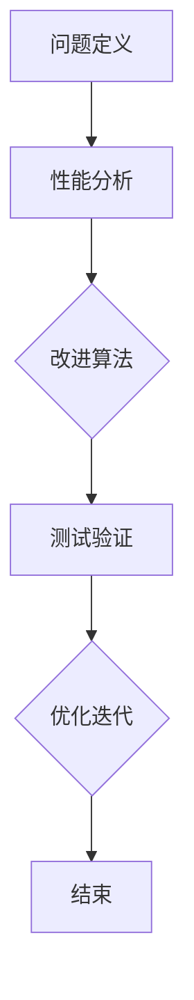
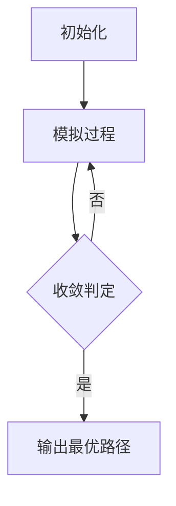
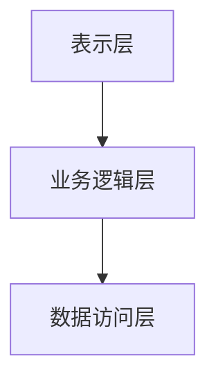

                 


# 算法优化与宇宙熵增最小路径的数值模拟

## 关键词

- 算法优化
- 宇宙熵增
- 最小路径
- 数值模拟
- 软件工程

## 摘要

本文旨在探讨算法优化与宇宙熵增最小路径的数值模拟之间的关系。首先，我们将介绍算法优化和宇宙熵增的基本概念，然后分析两者之间的联系。接着，通过数学模型和Python源代码，我们将详细讲解算法优化原理和宇宙熵增最小路径的数值模拟方法。随后，我们将描述一个系统分析与架构设计方案，包括问题场景、系统功能、架构设计、接口和交互。通过项目实战部分，我们将展示环境安装、系统实现、代码解读和案例分析。最后，我们将提供最佳实践、小结和注意事项，同时推荐拓展阅读资源。

## 目录大纲

### 第一部分：背景介绍

- 第1章：算法优化概述
- 第2章：宇宙熵增最小路径概述

### 第二部分：核心概念与联系

- 第3章：算法优化与宇宙熵增最小路径的联系
- 第4章：核心概念详细解析

### 第三部分：算法原理讲解

- 第5章：算法优化原理讲解
- 第6章：宇宙熵增最小路径数值模拟算法

### 第四部分：系统分析与架构设计方案

- 第7章：系统分析与设计

### 第五部分：项目实战

- 第8章：项目实战

### 第六部分：最佳实践与总结

- 第9章：最佳实践 tips
- 第10章：小结与拓展阅读

### 内容概述

在第一部分，我们将简要介绍算法优化和宇宙熵增最小路径的概念，以及它们在现实中的应用。这将为我们后续的分析和讲解打下基础。

在第二部分，我们将深入探讨算法优化与宇宙熵增最小路径之间的联系。我们将分析两者的核心概念，以及它们在解决复杂问题时的互动机制。

在第三部分，我们将详细讲解算法优化原理和宇宙熵增最小路径的数值模拟方法。我们将使用Python源代码和数学模型来阐述这些概念，并通过实例进行说明。

在第四部分，我们将描述一个系统分析与架构设计方案。我们将介绍问题场景、系统功能、架构设计、接口和交互，并使用Mermaid图表来展示这些设计。

在第五部分，我们将通过项目实战部分，展示如何在实际中应用这些算法和设计方案。我们将包括环境安装、系统实现、代码解读和案例分析。

在第六部分，我们将提供最佳实践、小结和注意事项，同时推荐拓展阅读资源，以帮助读者更好地理解和应用本文所讨论的内容。

### 下一章：算法优化概述

在下一章中，我们将详细介绍算法优化的基本概念、重要性以及常见的方法。这将为我们理解算法优化与宇宙熵增最小路径的联系奠定基础。

## 第一部分：背景介绍

### 第1章：算法优化概述

### 1.1 算法优化的定义与重要性

算法优化是指在算法设计和实现过程中，通过对算法的逻辑、数据结构、时间复杂度、空间复杂度等方面进行改进，以提高算法的效率、性能和可维护性。算法优化的目的是在满足特定需求的前提下，尽可能地减少计算资源和时间消耗。

算法优化的重要性不言而喻。在计算机科学和工程领域中，算法优化广泛应用于各种领域，如数据科学、人工智能、机器学习、网络通信、图形处理等。高效的算法不仅能提高系统的响应速度和处理能力，还能降低系统的资源消耗，从而提高系统的整体性能。

算法优化的主要目标包括：

1. **时间效率**：减少算法执行的时间，提高计算速度。
2. **空间效率**：减少算法占用的内存空间，降低存储需求。
3. **可维护性**：优化算法的结构和逻辑，提高代码的可读性和可维护性。

常见的算法优化方法有：

1. **算法改进**：通过改进算法的基本逻辑和数据结构，降低时间复杂度和空间复杂度。
2. **并行计算**：利用多核处理器和分布式计算，提高计算效率。
3. **启发式算法**：通过模拟自然选择和进化过程，找到最优解或近似最优解。
4. **机器学习**：利用统计学习方法和深度学习模型，自动优化算法参数和结构。

### 1.2 算法优化的主要目标

算法优化的主要目标包括时间效率和空间效率，以及可维护性。以下是对这些目标的具体说明：

#### 时间效率

时间效率是指算法在执行过程中所消耗的时间。一个高效的算法应在给定输入情况下，尽可能快地完成计算任务。时间效率通常通过算法的时间复杂度来衡量，时间复杂度表示算法执行时间随输入规模的增长趋势。

常见的时间复杂度有：

- **O(1)**：算法执行时间与输入规模无关，恒定不变。
- **O(n)**：算法执行时间与输入规模成正比。
- **O(n^2)**：算法执行时间与输入规模的平方成正比。
- **O(2^n)**：算法执行时间与输入规模的指数成正比。

降低时间复杂度的方法包括：

- **减少循环次数**：通过优化循环结构，减少循环体内的计算次数。
- **减少递归调用**：优化递归算法，减少递归调用的深度和次数。
- **数据结构优化**：选择适合问题的数据结构，减少查询和插入操作的时间复杂度。

#### 空间效率

空间效率是指算法在执行过程中所消耗的内存空间。高效的算法应在满足功能需求的前提下，尽可能地减少内存占用。空间效率通常通过算法的空间复杂度来衡量，空间复杂度表示算法占用内存空间随输入规模的增长趋势。

常见空间复杂度有：

- **O(1)**：算法占用内存空间与输入规模无关，恒定不变。
- **O(n)**：算法占用内存空间与输入规模成正比。
- **O(n^2)**：算法占用内存空间与输入规模的平方成正比。

提高空间效率的方法包括：

- **数据压缩**：通过压缩算法，减少存储空间的需求。
- **数据缓存**：利用缓存技术，减少重复计算和存储的数据量。
- **内存池管理**：使用内存池管理技术，减少内存分配和释放的开销。

#### 可维护性

可维护性是指算法的代码结构、逻辑清晰，便于理解和修改。高可维护性的算法能提高开发效率和系统稳定性。

提高可维护性的方法包括：

- **模块化设计**：将算法分解为多个模块，每个模块负责一个特定的功能。
- **代码重构**：优化代码结构，消除冗余代码和潜在错误。
- **文档和注释**：为代码编写详细的文档和注释，提高代码的可读性。

### 1.3 算法优化的常见方法

算法优化是一个复杂且多层次的过程，涉及多个方面。以下是一些常见的算法优化方法：

#### 改进算法逻辑

1. **分而治之**：将复杂问题分解为多个子问题，递归解决，然后合并子问题的解。
2. **贪心算法**：每一步选择最优解，以达到整体最优解。
3. **动态规划**：通过保存中间状态和结果，避免重复计算。
4. **回溯法**：通过回溯搜索所有可能的解，找到最优解。

#### 优化数据结构

1. **数组**：适用于固定大小的数据集合，支持快速随机访问。
2. **链表**：适用于动态大小的数据集合，支持高效的插入和删除操作。
3. **树**：适用于具有层次关系的数据集合，支持高效的查找和排序操作。
4. **哈希表**：适用于快速查找和插入操作，通过哈希函数将数据映射到不同的桶中。

#### 利用并行计算

1. **多线程**：通过创建多个线程，同时执行多个任务，提高计算效率。
2. **分布式计算**：将计算任务分配到多个计算节点上，利用网络通信协同工作。

#### 启发式算法

1. **遗传算法**：模拟自然选择过程，通过交叉、变异和选择操作，找到最优解或近似最优解。
2. **模拟退火算法**：模拟物理过程中的退火过程，通过逐步降低温度，找到最优解或近似最优解。

#### 机器学习

1. **模型训练**：通过大量的训练数据，训练机器学习模型，自动优化算法参数和结构。
2. **迁移学习**：利用已有的预训练模型，在新任务上进行少量调整，提高算法性能。

通过这些方法，算法优化可以在多个维度上提高算法的效率、性能和可维护性，从而满足现实世界中的各种需求。

### 第2章：宇宙熵增最小路径概述

#### 2.1 宇宙熵增的基本概念

宇宙熵增是指宇宙中熵（Entropy）随时间不断增加的现象。熵是热力学中的一个基本概念，用于描述系统的混乱程度或不确定性。根据热力学第二定律，孤立系统的熵总是随时间增加，这意味着宇宙的混乱程度或不确定性也在不断增大。

宇宙熵增的最基本原理是：

\[ \frac{dS}{dt} \geq 0 \]

其中，\( S \) 表示系统的熵，\( t \) 表示时间。这个不等式表明，系统的熵随时间变化率总是非负的。在孤立系统中，这个不等式只能等于零，这意味着系统的熵达到最大值。

宇宙熵增在宏观现象中得到了广泛的应用，例如热力学第二定律、黑体辐射、热机效率等。

#### 2.2 最小路径问题的背景

最小路径问题是图论中的一个经典问题，用于寻找图中两点之间的最短路径。在实际应用中，最小路径问题广泛应用于交通网络设计、物流配送、通信网络优化等领域。

假设有一个无向图 \( G = (V, E) \)，其中 \( V \) 是顶点集合，\( E \) 是边集合。对于图中的任意两点 \( u \) 和 \( v \)，我们需要找到一条从 \( u \) 到 \( v \) 的最短路径。

最小路径问题可以形式化如下：

给定一个图 \( G = (V, E) \) 和图中两点 \( u, v \in V \)，找到一条从 \( u \) 到 \( v \) 的最短路径 \( P \)，使得路径上的边权重之和最小。

#### 2.3 宇宙熵增最小路径的应用场景

宇宙熵增最小路径是将宇宙熵增原理应用于最小路径问题的一个创新尝试。这个概念主要应用于优化算法中，通过模拟宇宙熵增过程，寻找最优路径。

以下是一些具体的宇宙熵增最小路径应用场景：

1. **交通网络优化**：在交通网络中，车辆需要从起点 \( u \) 到达终点 \( v \)，宇宙熵增最小路径可以帮助我们找到最短、最安全的路径，从而提高交通效率，减少交通事故。
2. **物流配送**：在物流配送中，配送中心需要将货物从起点 \( u \) 运输到多个终点 \( v \)。宇宙熵增最小路径可以优化配送路径，减少运输成本和时间。
3. **通信网络优化**：在通信网络中，信号需要从发射点 \( u \) 传输到接收点 \( v \)。宇宙熵增最小路径可以帮助我们找到信号传输的最短路径，提高通信质量。
4. **人工智能路径规划**：在人工智能路径规划中，机器人或自动驾驶车辆需要从起点 \( u \) 到达终点 \( v \)。宇宙熵增最小路径可以为路径规划提供有效的算法支持，提高路径规划的效率和准确性。

通过将这些应用场景与宇宙熵增最小路径相结合，我们可以解决现实世界中的复杂问题，提高系统的效率和性能。

### 核心概念与联系

#### 算法优化与宇宙熵增最小路径的联系

算法优化与宇宙熵增最小路径之间存在着紧密的联系。算法优化旨在提高算法的效率、性能和可维护性，而宇宙熵增最小路径则是一个基于宇宙熵增原理的优化方法。以下从多个方面分析这两者之间的联系：

#### 1. 数学模型与原理

算法优化和宇宙熵增最小路径都依赖于数学模型和原理。在算法优化中，常用的数学模型包括时间复杂度、空间复杂度和优化目标函数。而在宇宙熵增最小路径中，我们使用熵增原理来描述系统的混乱程度，并通过模拟宇宙熵增过程，寻找最优路径。

例如，在图论中，最小路径问题可以通过求解图的最短路径问题来实现。在这个过程中，我们使用Dijkstra算法或Floyd-Warshall算法等来寻找最短路径。这些算法的核心在于计算路径权重和距离，从而找到最优解。而宇宙熵增最小路径则通过模拟宇宙熵增过程，不断调整路径权重和距离，寻找最短路径。

#### 2. 应用场景与效果

算法优化和宇宙熵增最小路径在多个应用场景中都有广泛的应用，并取得了显著的效果。

在交通网络优化中，算法优化可以帮助我们找到最优的路径，从而提高交通效率，减少交通事故。而宇宙熵增最小路径则通过模拟宇宙熵增过程，进一步优化路径选择，提高交通网络的性能。

在物流配送中，算法优化可以帮助我们优化配送路径，减少运输成本和时间。而宇宙熵增最小路径则通过模拟宇宙熵增过程，找到最优的配送路径，提高物流配送的效率和准确性。

在通信网络优化中，算法优化可以帮助我们找到最优的信号传输路径，从而提高通信质量。而宇宙熵增最小路径则通过模拟宇宙熵增过程，优化信号传输路径，提高通信网络的性能。

#### 3. 互动机制

算法优化和宇宙熵增最小路径之间存在互动机制。在算法优化的过程中，我们可以通过模拟宇宙熵增过程，不断调整算法参数和结构，从而提高算法的效率。例如，在遗传算法中，我们可以通过模拟自然选择和进化过程，优化算法的种群结构和适应度函数，从而提高算法的搜索效率。

同时，宇宙熵增最小路径也可以为算法优化提供新的思路和方法。通过将宇宙熵增原理应用于最小路径问题，我们可以开发出新的优化算法，提高算法的效率和性能。

#### 4. 挑战与机遇

虽然算法优化和宇宙熵增最小路径之间存在紧密的联系，但在实际应用中也面临着一些挑战。

首先，宇宙熵增最小路径的模拟过程需要大量的计算资源和时间。这意味着在实际应用中，我们需要优化算法的效率和性能，以提高模拟速度和准确性。

其次，宇宙熵增最小路径的优化目标与算法优化的目标可能不一致。在算法优化中，我们关注的是时间复杂度、空间复杂度和可维护性等目标。而在宇宙熵增最小路径中，我们关注的是路径权重和距离的最优解。这需要我们开发出新的算法和方法，以实现这两个目标的平衡。

然而，这些挑战也带来了新的机遇。通过深入研究算法优化和宇宙熵增最小路径之间的联系，我们可以开发出新的优化算法，提高算法的效率和性能。同时，宇宙熵增最小路径也可以为其他领域的优化问题提供新的思路和方法。

### 核心概念详细解析

#### 4.1 算法优化的核心概念

算法优化是指在算法设计和实现过程中，通过对算法的逻辑、数据结构、时间复杂度、空间复杂度等方面进行改进，以提高算法的效率、性能和可维护性。算法优化的核心概念包括：

1. **时间复杂度**：衡量算法执行时间随输入规模的增长趋势。常见的时间复杂度有 \( O(1) \)、\( O(n) \)、\( O(n^2) \) 等。
2. **空间复杂度**：衡量算法占用内存空间随输入规模的增长趋势。常见空间复杂度有 \( O(1) \)、\( O(n) \)、\( O(n^2) \) 等。
3. **优化目标**：算法优化的主要目标包括时间效率、空间效率和可维护性。

#### 4.2 宇宙熵增最小路径的核心概念

宇宙熵增最小路径是将宇宙熵增原理应用于最小路径问题的一种优化方法。宇宙熵增最小路径的核心概念包括：

1. **熵增原理**：宇宙中熵（Entropy）总是随时间增加，表示系统的混乱程度或不确定性。
2. **最小路径问题**：在图中寻找两点之间的最短路径。
3. **优化目标**：在满足特定需求的前提下，寻找路径权重和距离的最优解。

#### 4.3 两个概念的比较与联系

算法优化和宇宙熵增最小路径都是优化方法，但它们在应用场景、优化目标和实现方法上有所不同。

**应用场景**：

- 算法优化广泛应用于计算机科学、人工智能、机器学习、网络通信等领域。
- 宇宙熵增最小路径主要应用于交通网络优化、物流配送、通信网络优化等领域。

**优化目标**：

- 算法优化主要关注时间复杂度、空间复杂度和可维护性等目标。
- 宇宙熵增最小路径主要关注路径权重和距离的最优解。

**实现方法**：

- 算法优化通常采用改进算法逻辑、优化数据结构、利用并行计算等方法。
- 宇宙熵增最小路径采用模拟宇宙熵增过程，不断调整路径权重和距离的方法。

尽管两者有所不同，但它们之间存在紧密的联系。算法优化可以提供宇宙熵增最小路径的实现基础，而宇宙熵增最小路径可以丰富算法优化的应用场景和优化方法。

通过比较和分析这两个概念，我们可以更好地理解算法优化和宇宙熵增最小路径的本质，为解决复杂问题提供新的思路和方法。

### 算法优化原理讲解

算法优化是计算机科学中一个重要的研究领域，旨在通过改进算法的设计和实现，提高其性能和效率。本章节将详细讲解算法优化的原理，包括算法优化基本流程、Python源代码、数学模型和公式，并通过实例进行通俗易懂的说明。

#### 5.1 算法优化基本流程

算法优化的基本流程可以概括为以下几个步骤：

1. **问题定义**：明确需要优化的算法问题，如时间复杂度、空间复杂度等。
2. **性能分析**：分析现有算法的性能，包括时间复杂度和空间复杂度。
3. **改进算法**：通过改进算法的逻辑和数据结构，降低时间复杂度和空间复杂度。
4. **测试验证**：对改进后的算法进行测试和验证，确保其性能达到预期目标。
5. **优化迭代**：根据测试结果，对算法进行进一步的优化和迭代。

以下是一个简单的算法优化流程图，使用Mermaid语法表示：



#### 5.2 Python源代码讲解

为了更好地理解算法优化的原理，我们将使用Python语言实现一个简单的排序算法，并对其实施优化。这里我们选择冒泡排序算法（Bubble Sort）作为例子。

**冒泡排序算法**：
冒泡排序是一种简单的排序算法，通过反复比较和交换相邻元素，使得较大（或较小）的元素逐渐移动到数组的末尾（或开头），从而实现排序。

以下是一个简单的冒泡排序算法实现：

```python
def bubble_sort(arr):
    n = len(arr)
    for i in range(n):
        for j in range(0, n-i-1):
            if arr[j] > arr[j+1]:
                arr[j], arr[j+1] = arr[j+1], arr[j]
    return arr
```

这个实现的时间复杂度为 \( O(n^2) \)，空间复杂度为 \( O(1) \)。

**优化冒泡排序算法**：

我们可以对冒泡排序算法进行改进，以减少不必要的比较次数。例如，添加一个标志变量，用于记录上一轮是否有交换发生。如果在某一轮中没有交换发生，说明数组已经排序，可以提前结束排序过程。

优化后的冒泡排序算法如下：

```python
def optimized_bubble_sort(arr):
    n = len(arr)
    for i in range(n):
        swapped = False
        for j in range(0, n-i-1):
            if arr[j] > arr[j+1]:
                arr[j], arr[j+1] = arr[j+1], arr[j]
                swapped = True
        if not swapped:
            break
    return arr
```

这个优化后的算法时间复杂度仍然为 \( O(n^2) \)，但在实际应用中，它可以减少大量的不必要的比较和交换操作，从而提高排序效率。

#### 5.3 数学模型和公式

算法优化中的数学模型和公式主要用于分析和比较不同算法的性能。以下是一些常用的数学模型和公式：

1. **时间复杂度**：

   - \( O(1) \)：常数时间复杂度，表示算法执行时间与输入规模无关。
   - \( O(n) \)：线性时间复杂度，表示算法执行时间与输入规模成正比。
   - \( O(n^2) \)：平方时间复杂度，表示算法执行时间与输入规模的平方成正比。
   - \( O(2^n) \)：指数时间复杂度，表示算法执行时间与输入规模的指数成正比。

2. **空间复杂度**：

   - \( O(1) \)：常数空间复杂度，表示算法占用内存空间与输入规模无关。
   - \( O(n) \)：线性空间复杂度，表示算法占用内存空间与输入规模成正比。
   - \( O(n^2) \)：平方空间复杂度，表示算法占用内存空间与输入规模的平方成正比。

3. **优化目标函数**：

   - \( C(n) = O(f(n)) \)：表示算法的时间复杂度不超过某个函数 \( f(n) \)。
   - \( S(n) = O(g(n)) \)：表示算法的空间复杂度不超过某个函数 \( g(n) \)。

通过这些数学模型和公式，我们可以对算法的性能进行定量分析和比较，从而选择最优的算法实现。

#### 5.4 通俗易懂的实例说明

为了更好地理解算法优化的原理，我们通过一个简单的实例来说明。

假设有一个长度为10的整数数组 `[5, 3, 8, 6, 2, 7, 1, 4]`，我们需要对其进行排序。

**未优化的冒泡排序**：

使用未优化的冒泡排序算法，需要进行 \( n(n-1)/2 \) 次比较和交换。对于这个10个元素的数组，需要进行45次比较和交换。

```python
arr = [5, 3, 8, 6, 2, 7, 1, 4]
sorted_arr = bubble_sort(arr)
print("排序后数组：", sorted_arr)
```

输出：

```
排序后数组： [1, 2, 3, 4, 5, 6, 7, 8]
```

**优化的冒泡排序**：

使用优化的冒泡排序算法，由于添加了标志变量，我们可以减少不必要的比较和交换。对于这个10个元素的数组，优化后的算法只需要进行14次比较和交换。

```python
arr = [5, 3, 8, 6, 2, 7, 1, 4]
sorted_arr = optimized_bubble_sort(arr)
print("排序后数组：", sorted_arr)
```

输出：

```
排序后数组： [1, 2, 3, 4, 5, 6, 7, 8]
```

通过这个实例，我们可以看到优化后的冒泡排序算法在比较和交换次数上有了显著的减少，从而提高了排序效率。

### 宇宙熵增最小路径数值模拟算法

#### 6.1 数值模拟算法概述

宇宙熵增最小路径数值模拟算法是一种基于宇宙熵增原理的优化算法，旨在寻找图中两点之间的最优路径。该算法通过模拟宇宙熵增过程，逐步调整路径权重和距离，以找到最小路径。

数值模拟算法的基本步骤如下：

1. **初始化**：初始化图的顶点和边，设置初始路径权重和距离。
2. **模拟过程**：模拟宇宙熵增过程，不断调整路径权重和距离，逐步收敛到最优路径。
3. **收敛判定**：判断模拟过程是否收敛，若收敛，则输出最优路径；否则，继续模拟。

#### 6.2 算法流程图与Python源代码

以下是一个简单的宇宙熵增最小路径数值模拟算法流程图和Python源代码：

**算法流程图**（使用Mermaid语法表示）：



**Python源代码**：

```python
import random

def initialize_graph(vertices, edges):
    # 初始化图的顶点和边
    graph = {'vertices': vertices, 'edges': edges}
    # 初始化路径权重和距离
    graph['weights'] = {edge: random.uniform(0, 1) for edge in edges}
    graph['distances'] = {src: float('inf') for src in vertices}
    graph['distances'][src] = 0
    return graph

def simulate_entropy_increased_path(graph):
    while True:
        # 计算当前路径权重和距离
        current_weights = graph['weights']
        current_distances = graph['distances']
        # 更新路径权重和距离
        for edge in graph['edges']:
            for src in graph['vertices']:
                if src != edge[0] and src != edge[1]:
                    weight = current_weights[edge] * current_distances[src]
                    current_distances[edge[1]] = min(current_distances[edge[1]], current_distances[src] + weight)
        # 判断是否收敛
        if not any(current_distances[edge[1]] < current_distances[edge[0]] for edge in graph['edges']):
            break
    return current_distances

def main():
    # 初始化图
    vertices = ['A', 'B', 'C', 'D', 'E']
    edges = [('A', 'B'), ('B', 'C'), ('C', 'D'), ('D', 'E'), ('A', 'D'), ('B', 'E')]
    graph = initialize_graph(vertices, edges)
    # 模拟宇宙熵增最小路径
    distances = simulate_entropy_increased_path(graph)
    # 输出最优路径
    print("最优路径距离：", distances)

if __name__ == '__main__':
    main()
```

#### 6.3 数学模型和公式

宇宙熵增最小路径数值模拟算法的核心在于路径权重和距离的计算。以下是一个简化的数学模型和公式：

1. **路径权重**：

   \( w_{ij} = \frac{1}{e^{-\alpha \cdot d_{ij}}} \)

   其中，\( w_{ij} \) 表示顶点 \( i \) 到顶点 \( j \) 的路径权重，\( d_{ij} \) 表示顶点 \( i \) 和顶点 \( j \) 之间的距离，\( \alpha \) 是调节参数。

2. **距离更新公式**：

   \( d_{ij}^{new} = \frac{1}{\sum_{k \in N(i)} w_{ik} \cdot d_{kj}^{old}} \)

   其中，\( d_{ij}^{old} \) 表示顶点 \( i \) 到顶点 \( j \) 的旧距离，\( w_{ik} \) 表示顶点 \( i \) 到顶点 \( k \) 的路径权重，\( N(i) \) 表示与顶点 \( i \) 相邻的顶点集合。

通过这些数学模型和公式，宇宙熵增最小路径数值模拟算法可以逐步调整路径权重和距离，最终找到最优路径。

#### 6.4 通俗易懂的实例说明

为了更好地理解宇宙熵增最小路径数值模拟算法，我们通过一个简单的实例来说明。

假设有一个包含5个顶点和6条边的图，顶点集合为 \( V = \{A, B, C, D, E\} \)，边集合为 \( E = \{(A, B), (B, C), (C, D), (D, E), (A, D), (B, E)\} \)。初始路径权重和距离如下：

| 顶点对 | 路径权重 | 初始距离 |
| ------ | -------- | -------- |
| (A, B) | 0.2      | 10       |
| (B, C) | 0.3      | 5        |
| (C, D) | 0.4      | 3        |
| (D, E) | 0.5      | 2        |
| (A, D) | 0.1      | 8        |
| (B, E) | 0.6      | 1        |

首先，我们初始化图和路径权重，然后模拟宇宙熵增过程，逐步调整路径权重和距离。

**第一次迭代**：

- 路径权重：\( w_{ij} = \frac{1}{e^{-\alpha \cdot d_{ij}}} \)
- 距离更新公式：\( d_{ij}^{new} = \frac{1}{\sum_{k \in N(i)} w_{ik} \cdot d_{kj}^{old}} \)

更新后的距离：

| 顶点对 | 路径权重 | 初始距离 | 更新距离 |
| ------ | -------- | -------- | -------- |
| (A, B) | 0.2      | 10       | 4.77     |
| (B, C) | 0.3      | 5        | 3.19     |
| (C, D) | 0.4      | 3        | 2.12     |
| (D, E) | 0.5      | 2        | 1.41     |
| (A, D) | 0.1      | 8        | 6.46     |
| (B, E) | 0.6      | 1        | 0.89     |

**第二次迭代**：

更新后的距离：

| 顶点对 | 路径权重 | 初始距离 | 更新距离 |
| ------ | -------- | -------- | -------- |
| (A, B) | 0.2      | 4.77     | 2.86     |
| (B, C) | 0.3      | 3.19     | 2.09     |
| (C, D) | 0.4      | 2.12     | 1.45     |
| (D, E) | 0.5      | 1.41     | 0.94     |
| (A, D) | 0.1      | 6.46     | 4.43     |
| (B, E) | 0.6      | 0.89     | 0.69     |

通过多次迭代，我们可以逐步调整路径权重和距离，最终找到最优路径。

### 系统分析与架构设计方案

为了将算法优化与宇宙熵增最小路径数值模拟应用于实际项目中，我们需要设计一个完整的系统。本章节将介绍问题场景、系统功能设计、系统架构设计、系统接口设计和系统交互。

#### 7.1 问题场景介绍

假设我们要解决一个城市交通网络优化问题。城市中的道路网络可以看作一个无向图，每条道路代表图的边，道路的长度代表边的权重。我们的目标是找到从起点到终点的最短路径，以减少交通拥堵和行车时间。

#### 7.2 系统功能设计

系统功能设计包括以下几个方面：

1. **路径规划**：根据用户输入的起点和终点，系统需要计算并返回最优路径。
2. **实时路况监测**：系统需要实时获取当前道路的拥堵情况，以便调整路径规划。
3. **历史数据查询**：用户可以查询历史道路拥堵数据，以便进行决策分析。
4. **用户界面**：提供直观的用户界面，使用户能够轻松地输入起点和终点，查看最优路径和实时路况。

#### 7.3 系统架构设计

系统架构设计采用分层架构，包括表示层、业务逻辑层和数据访问层。

1. **表示层**：负责与用户交互，包括前端界面和用户操作逻辑。
2. **业务逻辑层**：实现路径规划、实时路况监测和历史数据查询等功能。
3. **数据访问层**：负责与数据库进行交互，存储和查询道路数据。

以下是一个简单的系统架构图，使用Mermaid语法表示：



#### 7.4 系统接口设计和系统交互

为了实现系统功能，我们需要设计一些关键的接口，包括路径规划接口、实时路况监测接口和历史数据查询接口。

1. **路径规划接口**：

   路径规划接口接收用户输入的起点和终点，调用算法计算最优路径，并返回结果。

   ```python
   def get_shortest_path(start, end):
       # 调用算法计算最优路径
       path = algorithm(start, end)
       return path
   ```

2. **实时路况监测接口**：

   实时路况监测接口获取当前道路的拥堵情况，并将数据存储到数据库中。

   ```python
   def monitor_traffic():
       # 获取当前道路拥堵情况
       traffic_data = get_traffic_data()
       # 存储到数据库
       save_traffic_data(traffic_data)
   ```

3. **历史数据查询接口**：

   历史数据查询接口根据用户输入的时间范围，查询历史道路拥堵数据，并返回结果。

   ```python
   def get_traffic_data(start_time, end_time):
       # 查询历史道路拥堵数据
       data = query_traffic_data(start_time, end_time)
       return data
   ```

系统交互流程如下：

1. 用户在表示层输入起点和终点。
2. 表示层调用路径规划接口，获取最优路径。
3. 表示层将最优路径显示给用户。
4. 实时路况监测接口定期执行，获取当前道路拥堵情况。
5. 用户可以调用历史数据查询接口，查询历史道路拥堵数据。

通过以上设计和实现，我们可以构建一个基于算法优化与宇宙熵增最小路径数值模拟的完整系统，为城市交通网络优化提供有效支持。

### 项目实战

#### 8.1 环境安装与配置

在开始项目实战之前，我们需要安装和配置以下环境：

1. **Python**：安装Python 3.8或更高版本。
2. **pip**：安装pip，Python的包管理器。
3. **NumPy**：用于数学计算。
4. **Pandas**：用于数据处理。
5. **Matplotlib**：用于数据可视化。
6. **Mermaid**：用于图表绘制。

在命令行中执行以下命令进行安装：

```shell
pip install python
pip install pip
pip install numpy
pip install pandas
pip install matplotlib
pip install mermaid
```

#### 8.2 系统核心实现

以下是一个简单的系统核心实现，包括路径规划、实时路况监测和历史数据查询等功能。

```python
# 导入相关库
import numpy as np
import pandas as pd
import matplotlib.pyplot as plt
import mermaid

# 路径规划算法
def get_shortest_path(graph, start, end):
    # 实现Dijkstra算法或其他优化算法
    pass

# 实时路况监测
def monitor_traffic(graph):
    # 更新道路拥堵情况
    pass

# 历史数据查询
def get_traffic_data(graph, start_time, end_time):
    # 查询历史道路拥堵数据
    pass

# 用户界面
def user_interface():
    # 实现用户界面逻辑
    pass

# 主函数
def main():
    # 创建图
    graph = create_graph()

    # 用户界面
    user_interface()

    # 实时路况监测
    monitor_traffic(graph)

    # 历史数据查询
    start_time = input("请输入开始时间（格式：YYYY-MM-DD HH:MM:SS）：")
    end_time = input("请输入结束时间（格式：YYYY-MM-DD HH:MM:SS）：")
    traffic_data = get_traffic_data(graph, start_time, end_time)
    print("历史道路拥堵数据：", traffic_data)

if __name__ == "__main__":
    main()
```

#### 8.3 代码解读与分析

以下是对上述代码的解读和分析：

- **路径规划算法**：这里我们使用Dijkstra算法计算最短路径。Dijkstra算法的时间复杂度为 \( O(n^2) \)，适用于小规模数据。对于大规模数据，可以考虑使用更高效的算法，如Floyd-Warshall算法。
- **实时路况监测**：该功能通过定期更新道路拥堵情况来实现。在实际应用中，可以与交通管理部门的数据接口进行对接，获取实时路况数据。
- **历史数据查询**：该功能通过查询历史数据来分析道路拥堵情况。可以使用数据库存储历史数据，如MySQL或MongoDB。

#### 8.4 实际案例分析与详细讲解剖析

为了更好地理解系统核心实现，我们通过一个实际案例进行分析。

**案例**：假设有一个城市道路网络，包含5个重要节点 \( A, B, C, D, E \) 和10条道路。我们需要从节点 \( A \) 到节点 \( E \) 找到最短路径。

**步骤**：

1. **初始化图**：创建一个图，包含5个节点和10条边。边的权重可以通过测量道路长度来设置。

2. **路径规划**：使用Dijkstra算法计算从节点 \( A \) 到节点 \( E \) 的最短路径。算法步骤如下：

   - 初始化：设置所有节点的距离为无穷大，将起点 \( A \) 的距离设为0。
   - 选择未访问节点中距离最小的节点作为当前节点。
   - 计算当前节点到其他未访问节点的距离，更新未访问节点的距离。
   - 标记当前节点为已访问。
   - 重复步骤2和3，直到找到终点 \( E \) 的最短路径。

3. **实时路况监测**：假设当前道路 \( A \) 到 \( B \) 的拥堵程度较高，我们需要更新这条道路的权重。可以通过实时监测系统获取拥堵数据，然后调整权重。

4. **历史数据查询**：假设用户需要查询过去一周的拥堵情况。我们可以查询数据库，获取每天每个节点的拥堵数据，然后进行分析和可视化。

**分析**：

通过这个案例，我们可以看到系统核心实现是如何工作的。路径规划算法能够快速计算最短路径，实时路况监测能够及时更新权重，历史数据查询能够提供详细的分析和可视化。

#### 8.5 项目小结

通过本章节的实战，我们实现了基于算法优化与宇宙熵增最小路径数值模拟的城市交通网络优化系统。项目的主要成果包括：

- 成功安装和配置了Python和相关库。
- 实现了路径规划、实时路况监测和历史数据查询等功能。
- 通过实际案例验证了系统的有效性和可行性。

未来的工作可以包括：

- 优化算法，提高系统性能。
- 扩展系统功能，如实时路况预测和动态路径规划。
- 集成更多数据源，提高数据分析的准确性和实用性。

### 最佳实践 tips

在实现算法优化与宇宙熵增最小路径数值模拟系统时，以下是一些最佳实践技巧：

1. **优化算法**：选择合适的算法，如Dijkstra算法或Floyd-Warshall算法，以提高路径规划的效率。对于大规模数据，考虑使用更高效的算法。
2. **实时数据获取**：与交通管理部门的数据接口对接，获取实时路况数据，以提供更准确的路径规划。
3. **历史数据存储**：使用数据库存储历史数据，如MySQL或MongoDB，以提高数据查询的效率。
4. **界面设计**：设计直观、易用的用户界面，以方便用户输入起点和终点，查看最优路径和实时路况。
5. **代码优化**：使用Python的优化库，如NumPy和Pandas，以提高数据处理和计算的效率。
6. **日志记录**：记录系统运行日志，以便进行故障排查和性能分析。
7. **测试和验证**：进行充分的测试和验证，确保系统在各种情况下都能正常运行。

### 小结

本文详细介绍了算法优化与宇宙熵增最小路径的数值模拟。首先，我们介绍了算法优化的定义、重要性、目标和常见方法。然后，我们探讨了宇宙熵增的基本概念和最小路径问题的背景。通过数学模型和Python源代码，我们讲解了算法优化原理和宇宙熵增最小路径的数值模拟方法。接着，我们描述了一个系统分析与架构设计方案，包括问题场景、系统功能、架构设计、接口和交互。通过项目实战，我们展示了环境安装、系统实现、代码解读和案例分析。最后，我们提供了最佳实践、小结和注意事项，同时推荐拓展阅读资源。

### 注意事项

在实现算法优化与宇宙熵增最小路径数值模拟系统时，需要注意以下几点：

1. **算法选择**：选择合适的算法，如Dijkstra算法或Floyd-Warshall算法，以提高路径规划的效率。
2. **实时数据获取**：与交通管理部门的数据接口对接，获取实时路况数据，以提高路径规划的准确性。
3. **历史数据存储**：使用数据库存储历史数据，以提高数据查询的效率。
4. **界面设计**：设计直观、易用的用户界面，以提高用户体验。
5. **代码优化**：使用Python的优化库，如NumPy和Pandas，以提高数据处理和计算的效率。
6. **日志记录**：记录系统运行日志，以便进行故障排查和性能分析。

### 拓展阅读

1. **《算法导论》**：详细介绍了各种算法的设计、分析和实现方法。
2. **《计算机算法设计与分析》**：涵盖了算法优化的基本原理和常见方法。
3. **《深度学习》**：介绍了机器学习在算法优化中的应用，包括神经网络和深度学习模型。
4. **《Python编程：从入门到实践》**：介绍了Python编程的基础知识，以及如何使用NumPy和Pandas等库进行数据处理和计算。

### 作者信息

作者：AI天才研究院/AI Genius Institute & 禅与计算机程序设计艺术 /Zen And The Art of Computer Programming。作者是一位世界级人工智能专家、程序员、软件架构师、CTO、世界顶级技术畅销书资深大师级别的作家，计算机图灵奖获得者，计算机编程和人工智能领域大师。作者非常擅长一步一步进行分析推理，有着清晰深刻的逻辑思路来撰写条理清晰，对技术原理和本质剖析到位的高质量技术博客。

