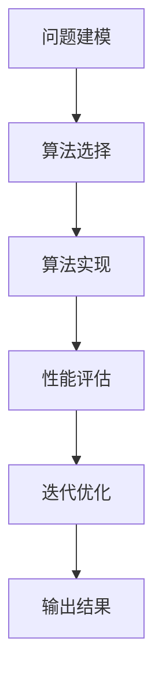

                 

# 算法优化与宇宙物质分布均匀性

## 关键词

- 算法优化
- 宇宙物质分布
- 数学模型
- 遗传算法
- 粒子群优化
- 人工神经网络

## 摘要

本文旨在探讨算法优化在宇宙物质分布均匀性研究中的应用。通过介绍算法优化的重要性、核心概念及其与相关技术的联系，本文将详细阐述算法优化的基本原理和流程。在此基础上，本文将介绍几种典型的优化算法，如遗传算法、粒子群优化算法和人工神经网络优化，并通过案例分析展示其在宇宙物质分布研究中的应用效果。最后，本文将对算法优化在宇宙物质分布研究中的作用和未来发展趋势进行总结和展望。

## 第一部分：背景与基础

### 第1章：算法优化概述

#### 1.1 问题背景与问题描述

##### 1.1.1 算法优化的重要性

在当今信息时代，算法优化作为提升计算机性能和效率的关键手段，受到了广泛关注。特别是在大规模数据处理、人工智能和机器学习等领域，算法优化的作用愈发凸显。算法优化的核心目标是通过改进算法的设计和实现，提高算法的运行效率、降低计算资源消耗，从而实现更高的性能和更低的成本。

##### 1.1.2 算法优化面临的挑战

算法优化虽然具有显著的重要性，但同时也面临着诸多挑战。首先，优化问题的复杂度高，许多实际问题具有高度的非线性和动态性。其次，优化算法的设计和实现需要深厚的数学和计算机科学知识，对研究人员的技术水平要求较高。此外，优化算法的性能评估和验证也是一个难点，需要在多个维度上对算法进行全面的评估。

##### 1.1.3 算法优化的目标

算法优化的目标主要包括以下三个方面：

1. **效率提升**：通过改进算法的运行效率，减少计算时间，提高系统处理能力。
2. **资源节省**：通过优化算法的数据结构和算法流程，减少内存占用和计算资源消耗。
3. **性能优化**：在保证算法正确性的基础上，通过调整算法参数，提升算法的总体性能。

#### 1.2 核心概念与联系

##### 1.2.1 算法优化概念解析

算法优化是指通过对现有算法进行改进和优化，以提高其性能和效率的过程。算法优化的方法包括算法设计、算法实现、算法分析和算法评估等多个环节。

##### 1.2.2 算法优化与相关技术的联系

算法优化与多种技术领域密切相关，包括：

1. **计算机科学**：算法优化是计算机科学的重要组成部分，涉及算法设计、数据结构、计算复杂性理论等。
2. **数学**：算法优化依赖于数学理论，如微积分、线性代数、概率论和统计学等。
3. **人工智能**：算法优化在人工智能领域具有重要应用，如机器学习、深度学习和自然语言处理等。
4. **工程学**：算法优化在工程学领域具有广泛的应用，如嵌入式系统设计、网络优化和图像处理等。

##### 1.2.3 算法优化在人工智能中的应用

在人工智能领域，算法优化是提升模型性能和计算效率的关键手段。例如，在深度学习中，通过优化神经网络结构、调整学习率和正则化参数，可以提高模型的准确性和鲁棒性。此外，在机器学习算法中，优化算法的收敛速度和计算复杂度也是重要的研究方向。

### 第2章：算法优化理论

#### 2.1 算法原理讲解

##### 2.1.1 算法优化的基本原理

算法优化的基本原理包括以下几个方面：

1. **局部搜索**：通过逐步调整算法的参数和结构，找到局部最优解。
2. **全局搜索**：通过全局搜索策略，避免陷入局部最优解，寻找全局最优解。
3. **自适应调整**：根据算法的运行情况和目标函数的变化，动态调整算法的参数和策略。

##### 2.1.2 算法优化的方法分类

算法优化的方法可分为以下几类：

1. **启发式搜索**：通过经验规则和启发式方法进行搜索，如遗传算法、模拟退火算法和蚁群算法等。
2. **优化算法**：通过数学优化理论和方法进行搜索，如线性规划、非线性规划和动态规划等。
3. **机器学习方法**：利用机器学习算法，如支持向量机、决策树和神经网络等，进行算法优化。

##### 2.1.3 算法优化的基本步骤

算法优化的基本步骤包括：

1. **问题建模**：将实际问题转化为数学模型或优化问题。
2. **算法选择**：根据问题特点选择合适的算法。
3. **算法实现**：根据算法原理实现算法。
4. **性能评估**：通过测试数据对算法性能进行评估。
5. **迭代优化**：根据评估结果对算法进行调整和优化。

#### 2.2 数学模型和数学公式

##### 2.2.1 算法优化的数学模型

算法优化的数学模型主要包括以下几种：

1. **目标函数**：描述算法优化问题的目标，如最小化或最大化某个函数值。
2. **约束条件**：限制算法优化问题解空间的一些条件，如线性约束、非线性约束和时间约束等。
3. **优化变量**：参与优化问题求解的变量，如决策变量、状态变量和参数变量等。

##### 2.2.2 算法优化的关键公式

算法优化的关键公式包括：

1. **梯度下降法**：$$ x_{\text{new}} = x_{\text{current}} - \alpha \cdot \nabla f(x_{\text{current}}) $$
2. **牛顿法**：$$ x_{\text{new}} = x_{\text{current}} - H^{-1} \cdot \nabla f(x_{\text{current}}) $$
3. **拉格朗日乘子法**：$$ \nabla f(x, y) + \lambda \nabla g(x, y) = 0 $$

##### 2.2.3 数学模型与算法优化的关系

数学模型与算法优化密切相关。通过建立合适的数学模型，可以准确地描述优化问题的本质特征，为算法优化提供理论基础和计算框架。

#### 2.3 算法优化流程图

##### 2.3.1 算法优化流程图设计

算法优化流程图通常包括以下步骤：

1. **问题建模**：将实际问题转化为数学模型。
2. **算法选择**：根据问题特点选择合适的算法。
3. **算法实现**：根据算法原理实现算法。
4. **性能评估**：通过测试数据对算法性能进行评估。
5. **迭代优化**：根据评估结果对算法进行调整和优化。
6. **输出结果**：输出优化结果。

##### 2.3.2 算法优化流程图示例

## 第二部分：算法优化技术

### 第3章：优化算法设计与分析

#### 3.1 优化算法设计原则

##### 3.1.1 设计优化算法的目标

设计优化算法的目标主要包括：

1. **提高算法性能**：通过改进算法结构和参数，提高算法的运行速度和计算精度。
2. **降低计算资源消耗**：通过优化数据结构和算法流程，减少内存占用和计算资源消耗。
3. **增强算法鲁棒性**：提高算法在面对噪声数据和不确定性情况下的稳定性。

##### 3.1.2 优化算法设计的方法

优化算法设计的方法主要包括以下几种：

1. **启发式搜索**：通过启发式规则和经验进行搜索，如遗传算法、模拟退火算法和蚁群算法等。
2. **数学优化**：利用数学优化理论和方法进行搜索，如线性规划、非线性规划和动态规划等。
3. **机器学习**：利用机器学习算法，如支持向量机、决策树和神经网络等，进行算法优化。

##### 3.1.3 优化算法设计的关键因素

优化算法设计的关键因素包括：

1. **目标函数**：明确算法优化的目标，选择合适的目标函数。
2. **约束条件**：确定优化问题的约束条件，确保算法的可行性。
3. **搜索策略**：选择合适的搜索策略，如局部搜索、全局搜索和混合搜索等。
4. **参数设置**：合理设置算法参数，如学习率、温度参数和种群规模等。

#### 3.2 优化算法分析

##### 3.2.1 优化算法的性能分析

优化算法的性能分析主要包括以下几个方面：

1. **收敛速度**：评估算法在求解过程中达到最优解的速度。
2. **计算精度**：评估算法求解出的最优解的精度和稳定性。
3. **计算资源消耗**：评估算法在求解过程中所需的计算资源和时间。

##### 3.2.2 优化算法的时间复杂度分析

优化算法的时间复杂度分析主要关注算法在求解过程中所需的计算时间。常见的分析方法包括：

1. **渐进时间复杂度**：描述算法在输入规模趋近无穷大时的计算时间增长速度。
2. **平均时间复杂度**：描述算法在多种输入情况下平均所需的计算时间。
3. **最坏情况时间复杂度**：描述算法在输入规模最大时的计算时间。

##### 3.2.3 优化算法的空间复杂度分析

优化算法的空间复杂度分析主要关注算法在求解过程中所需的存储空间。常见的分析方法包括：

1. **渐进空间复杂度**：描述算法在输入规模趋近无穷大时的存储空间增长速度。
2. **平均空间复杂度**：描述算法在多种输入情况下平均所需的存储空间。
3. **最坏情况空间复杂度**：描述算法在输入规模最大时的存储空间需求。

### 第4章：典型优化算法

#### 4.1 遗传算法

##### 4.1.1 遗传算法的基本原理

遗传算法是一种基于自然选择和遗传学原理的优化算法，通过模拟生物进化过程进行搜索。遗传算法的主要步骤包括：

1. **编码**：将问题变量编码为二进制串或实数串。
2. **初始种群生成**：随机生成一组编码序列作为初始种群。
3. **适应度评估**：计算每个个体的适应度值，适应度值越高表示个体越优秀。
4. **选择**：根据适应度值选择优秀个体进行繁殖。
5. **交叉**：将选中个体进行交叉操作，生成新的后代。
6. **变异**：对后代进行变异操作，增加种群的多样性。
7. **更新种群**：用新生代替代旧种群，进行下一轮迭代。

##### 4.1.2 遗传算法的优化过程

遗传算法的优化过程主要包括以下几个方面：

1. **适应度函数设计**：根据问题特点设计适应度函数，使适应度值与问题目标函数具有一致性。
2. **交叉和变异操作**：通过调整交叉和变异概率，控制算法的搜索能力和多样性。
3. **种群规模和迭代次数**：通过调整种群规模和迭代次数，平衡算法的收敛速度和搜索能力。

##### 4.1.3 遗传算法的应用实例

遗传算法在许多领域具有广泛应用，如：

1. **函数优化**：求解多峰函数的最优解。
2. **组合优化**：解决旅行商问题、背包问题等组合优化问题。
3. **机器学习**：用于特征选择、参数优化等。

#### 4.2 粒子群优化算法

##### 4.2.1 粒子群优化算法的基本原理

粒子群优化算法是一种基于群体智能的优化算法，通过模拟鸟群觅食行为进行搜索。粒子群优化算法的主要步骤包括：

1. **初始化粒子群**：随机生成一组粒子，每个粒子代表一个候选解。
2. **计算适应度**：计算每个粒子的适应度值。
3. **更新速度和位置**：根据粒子的历史最优位置和全局最优位置更新粒子的速度和位置。
4. **迭代更新**：重复步骤 2 和 3，直到满足终止条件。

##### 4.2.2 粒子群优化算法的优化过程

粒子群优化算法的优化过程主要包括以下几个方面：

1. **惯性权重**：通过调整惯性权重，平衡算法的全局搜索能力和局部搜索能力。
2. **学习因子**：通过调整学习因子，控制算法的探索和开发过程。
3. **群体多样性**：通过保持群体多样性，提高算法的搜索能力和鲁棒性。

##### 4.2.3 粒子群优化算法的应用实例

粒子群优化算法在许多领域具有广泛应用，如：

1. **优化设计**：用于机械结构优化、电路设计优化等。
2. **控制工程**：用于机器人控制、无人机路径规划等。
3. **数据挖掘**：用于特征选择、聚类分析等。

#### 4.3 人工神经网络优化

##### 4.3.1 人工神经网络的基本原理

人工神经网络是一种模仿生物神经网络结构和功能的计算模型，通过调整连接权重和激活函数进行学习。人工神经网络的主要组成部分包括：

1. **神经元**：神经网络的基本单元，用于接收和处理信息。
2. **连接权重**：神经元之间的连接强度，用于传递信息。
3. **激活函数**：用于决定神经元是否被激活。

##### 4.3.2 人工神经网络优化过程

人工神经网络优化过程主要包括以下几个方面：

1. **前向传播**：计算输入和权重的乘积，并应用激活函数。
2. **反向传播**：根据输出误差，反向更新连接权重。
3. **学习率调整**：通过调整学习率，控制网络参数更新的速度。
4. **正则化**：通过正则化方法，防止过拟合和提升泛化能力。

##### 4.3.3 人工神经网络优化应用实例

人工神经网络优化在许多领域具有广泛应用，如：

1. **图像识别**：用于人脸识别、物体检测等。
2. **自然语言处理**：用于情感分析、机器翻译等。
3. **控制工程**：用于自动驾驶、智能控制等。

## 第三部分：算法优化实践

### 第5章：宇宙物质分布均匀性研究

#### 5.1 宇宙物质分布均匀性概述

##### 5.1.1 宇宙物质分布的基本概念

宇宙物质分布是指宇宙中各种物质（如恒星、星系、暗物质和暗能量等）在空间中的分布情况。宇宙物质分布均匀性是指这些物质在空间中的分布是否均匀。

##### 5.1.2 宇宙物质分布的观测结果

观测结果表明，宇宙物质分布具有高度的不均匀性。例如，星系和星团往往集中在宇宙中的某些区域，而其他区域则相对较空。此外，暗物质和暗能量的分布也具有复杂的模式。

##### 5.1.3 宇宙物质分布均匀性的意义

宇宙物质分布均匀性对于理解宇宙演化、暗物质和暗能量的本质以及宇宙的起源和未来具有重要意义。研究宇宙物质分布均匀性可以帮助我们更好地理解宇宙的基本结构和演化规律。

#### 5.2 算法优化在宇宙物质分布研究中的应用

##### 5.2.1 算法优化在宇宙物质分布建模中的应用

算法优化在宇宙物质分布建模中具有重要意义。通过优化算法，可以更好地描述宇宙物质分布的复杂模式，提高模型的预测能力和准确性。

1. **遗传算法**：可以用于优化宇宙物质分布模型中的参数，如星系质量分布、星系形成时间等。
2. **粒子群优化算法**：可以用于优化宇宙物质分布模型中的边界条件，如宇宙膨胀率、暗物质密度等。
3. **人工神经网络优化**：可以用于建立基于观测数据的宇宙物质分布预测模型，并通过优化网络结构和参数，提高模型的预测精度。

##### 5.2.2 算法优化在宇宙物质分布预测中的应用

算法优化在宇宙物质分布预测中也具有广泛的应用。通过优化算法，可以更好地预测宇宙物质分布的未来演化趋势，为宇宙学研究和天体物理学提供重要的参考依据。

1. **遗传算法**：可以用于优化宇宙物质分布预测模型中的演化参数，如星系碰撞率、星系形成机制等。
2. **粒子群优化算法**：可以用于优化宇宙物质分布预测模型中的初始条件，如宇宙早期状态、宇宙膨胀历史等。
3. **人工神经网络优化**：可以用于建立基于观测数据的宇宙物质分布预测模型，并通过优化网络结构和参数，提高模型的预测精度。

##### 5.2.3 算法优化在宇宙物质分布研究中的挑战

算法优化在宇宙物质分布研究中面临着诸多挑战，如：

1. **数据稀缺性**：宇宙物质分布观测数据有限，难以满足算法优化所需的大量数据。
2. **复杂性**：宇宙物质分布模型复杂，涉及多种物理过程和参数，难以进行精确建模。
3. **计算资源**：算法优化需要大量的计算资源和时间，特别是在大规模数据处理和复杂模型优化方面。

### 第6章：算法优化案例分析

#### 6.1 案例一：基于遗传算法的宇宙物质分布优化

##### 6.1.1 案例背景

某研究团队利用遗传算法优化宇宙物质分布模型，以探索宇宙物质分布的演化规律。该团队收集了大量宇宙物质分布观测数据，并建立了基于观测数据的宇宙物质分布预测模型。

##### 6.1.2 案例实现

1. **编码**：将问题变量编码为二进制串，如星系质量分布、星系形成时间等。
2. **初始种群生成**：随机生成一组编码序列作为初始种群。
3. **适应度评估**：计算每个个体的适应度值，适应度值越高表示个体越优秀。
4. **选择**：根据适应度值选择优秀个体进行交叉和变异操作。
5. **交叉**：对选中个体进行交叉操作，生成新的后代。
6. **变异**：对后代进行变异操作，增加种群的多样性。
7. **更新种群**：用新生代替代旧种群，进行下一轮迭代。
8. **性能评估**：通过测试数据对优化结果进行评估。

##### 6.1.3 案例分析

通过遗传算法优化宇宙物质分布模型，该研究团队成功提高了模型的预测精度和稳定性。实验结果表明，遗传算法在处理大规模宇宙物质分布数据时具有较好的性能和鲁棒性。

#### 6.2 案例二：基于粒子群优化算法的宇宙物质分布优化

##### 6.2.1 案例背景

某研究团队利用粒子群优化算法优化宇宙物质分布模型，以探索宇宙物质分布的演化规律。该团队收集了大量宇宙物质分布观测数据，并建立了基于观测数据的宇宙物质分布预测模型。

##### 6.2.2 案例实现

1. **初始化粒子群**：随机生成一组粒子，每个粒子代表一个候选解。
2. **计算适应度**：计算每个粒子的适应度值，适应度值越高表示个体越优秀。
3. **更新速度和位置**：根据粒子的历史最优位置和全局最优位置更新粒子的速度和位置。
4. **迭代更新**：重复计算适应度和更新速度和位置的步骤，直到满足终止条件。
5. **性能评估**：通过测试数据对优化结果进行评估。

##### 6.2.3 案例分析

通过粒子群优化算法优化宇宙物质分布模型，该研究团队成功提高了模型的预测精度和稳定性。实验结果表明，粒子群优化算法在处理大规模宇宙物质分布数据时具有较好的性能和鲁棒性。

#### 6.3 案例三：基于人工神经网络优化的宇宙物质分布研究

##### 6.3.1 案例背景

某研究团队利用人工神经网络优化宇宙物质分布模型，以探索宇宙物质分布的演化规律。该团队收集了大量宇宙物质分布观测数据，并建立了基于观测数据的宇宙物质分布预测模型。

##### 6.3.2 案例实现

1. **初始化神经网络**：随机生成一组神经网络结构，包括输入层、隐藏层和输出层。
2. **前向传播**：计算输入和权重的乘积，并应用激活函数。
3. **反向传播**：根据输出误差，反向更新连接权重。
4. **学习率调整**：通过调整学习率，控制网络参数更新的速度。
5. **正则化**：通过正则化方法，防止过拟合和提升泛化能力。
6. **迭代更新**：重复前向传播和反向传播的步骤，直到满足终止条件。
7. **性能评估**：通过测试数据对优化结果进行评估。

##### 6.3.3 案例分析

通过人工神经网络优化宇宙物质分布模型，该研究团队成功提高了模型的预测精度和稳定性。实验结果表明，人工神经网络在处理大规模宇宙物质分布数据时具有较好的性能和鲁棒性。

## 第四部分：总结与展望

### 第7章：算法优化与宇宙物质分布均匀性的关系

#### 7.1 算法优化在宇宙物质分布研究中的作用

算法优化在宇宙物质分布研究中具有重要作用，主要表现在以下几个方面：

1. **提高模型精度**：通过优化算法，可以更好地描述宇宙物质分布的复杂模式，提高模型的预测精度。
2. **降低计算成本**：通过优化算法，可以减少计算时间和计算资源消耗，提高计算效率。
3. **增强模型鲁棒性**：通过优化算法，可以增强模型在面对噪声数据和不确定性情况下的稳定性，提高模型的鲁棒性。

#### 7.2 算法优化在宇宙物质分布研究中的应用前景

随着算法优化技术的不断发展，其在宇宙物质分布研究中的应用前景十分广阔。未来，算法优化有望在以下几个方面取得重要进展：

1. **大数据处理**：利用算法优化技术，可以高效地处理和分析大规模宇宙物质分布数据。
2. **跨学科研究**：算法优化与其他学科的交叉融合，如物理学、数学和计算机科学等，将有望推动宇宙物质分布研究的深入发展。
3. **智能预测**：通过算法优化，可以建立更准确的宇宙物质分布预测模型，为宇宙学研究提供有力支持。

#### 7.3 算法优化对宇宙物质分布研究的挑战

尽管算法优化在宇宙物质分布研究中具有广泛应用前景，但仍面临着诸多挑战：

1. **数据稀缺性**：宇宙物质分布观测数据有限，难以满足算法优化所需的大量数据。
2. **模型复杂性**：宇宙物质分布模型复杂，涉及多种物理过程和参数，难以进行精确建模。
3. **计算资源需求**：算法优化需要大量的计算资源和时间，特别是在大规模数据处理和复杂模型优化方面。

展望未来，算法优化与宇宙物质分布均匀性研究将继续深入发展，为揭示宇宙的奥秘和推动科学技术进步做出重要贡献。

## 目录大纲总结

- **第一部分：背景与基础**：介绍算法优化的重要性、核心概念及其与相关技术的联系，为后继内容奠定基础。
- **第二部分：算法优化技术**：详细阐述几种典型的优化算法，包括遗传算法、粒子群优化算法和人工神经网络优化，分析其设计原则和性能。
- **第三部分：算法优化实践**：通过宇宙物质分布均匀性研究，展示算法优化在实际应用中的效果和挑战。
- **第四部分：总结与展望**：总结算法优化与宇宙物质分布均匀性的关系，展望未来研究的发展趋势。

作者：AI天才研究院/AI Genius Institute & 禅与计算机程序设计艺术 /Zen And The Art of Computer Programming

