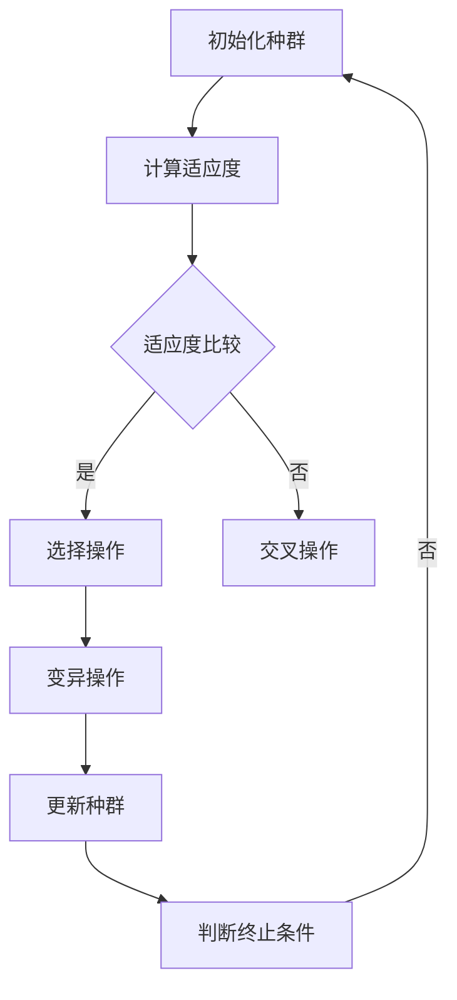
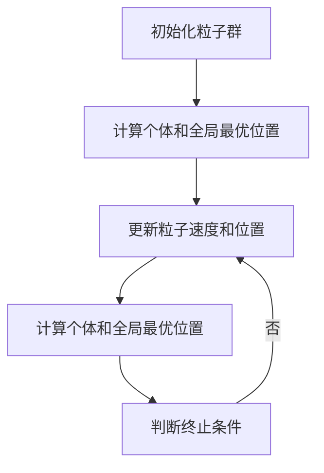
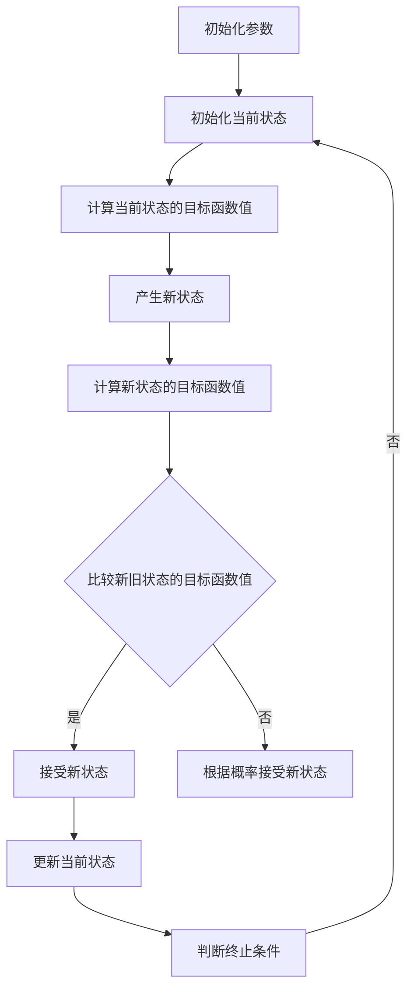
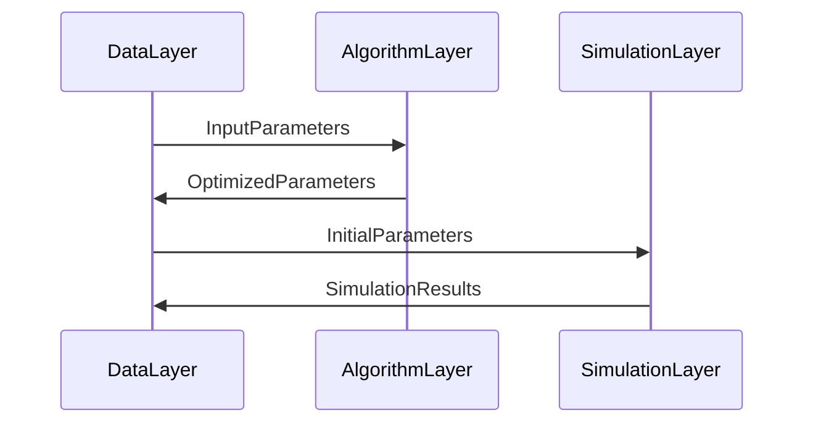
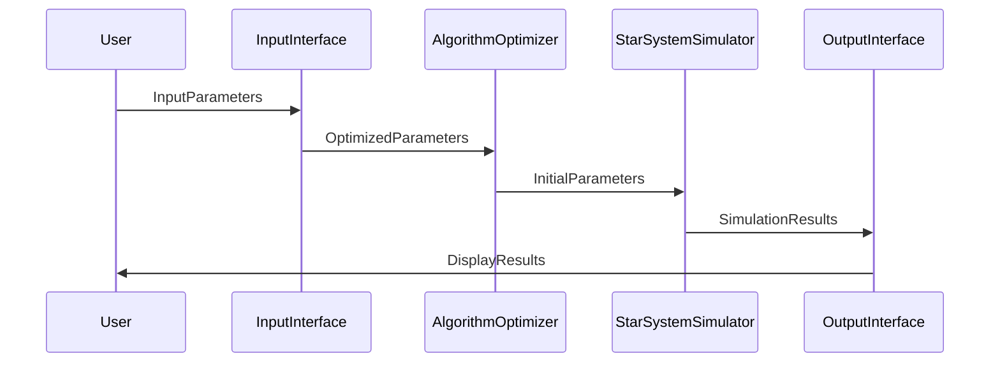

                 

### 文章标题

《算法优化与宇宙能量均分定理的推广》

### 关键词

- 算法优化
- 宇宙能量均分定理
- 遗传算法
- 粒子群算法
- 模拟退火算法
- 数学模型

### 摘要

本文旨在探讨算法优化与宇宙能量均分定理之间的联系，通过深入分析两者的核心概念，提出将算法优化应用于宇宙能量均分定理的具体方案。文章首先介绍了算法优化和宇宙能量均分定理的基本概念、原理及其应用场景，接着详细阐述了遗传算法、粒子群算法和模拟退火算法等优化算法的流程和数学模型。随后，文章通过构建ER实体关系图，展示了算法优化与宇宙能量均分定理之间的关联。在系统分析与架构设计方案部分，本文以具体项目为例，介绍了系统功能设计、系统架构设计、系统接口设计和系统交互过程。最后，文章总结了项目的实战经验和最佳实践，并对全文内容进行了小结，提供了拓展阅读资源。

---

## 背景介绍

### 问题背景

随着算法和计算技术的快速发展，优化算法在各个领域的应用越来越广泛。从工业制造、交通运输到金融投资，优化算法都发挥着关键作用。同时，宇宙能量均分定理作为物理学和工程学中的一个重要理论，在描述宇宙热力学性质、预测星系演化等方面具有深远影响。在这样的大背景下，将算法优化应用于宇宙能量均分定理，探索两者之间的联系，无疑具有重要的学术价值和实际意义。

### 问题描述

算法优化主要研究如何通过改进算法流程，提高算法的效率和准确性。常见的优化算法包括遗传算法、粒子群算法、模拟退火算法等。这些算法在处理复杂问题时表现出色，但如何将这些算法应用于宇宙能量均分定理，仍是一个亟待解决的难题。

宇宙能量均分定理指出，在一个封闭系统中，各种形式的能量将趋于均分。这一定理不仅适用于热力学系统，还可以推广到宇宙学、天体物理学等领域。然而，如何利用优化算法来研究和验证这一定理，仍缺乏系统的理论和方法。

本文旨在探讨如何将算法优化应用于宇宙能量均分定理，通过分析算法优化原理和宇宙能量均分定理的基本概念，探索两者之间的联系，并提出具体的推广方案。

### 问题解决

为了将算法优化应用于宇宙能量均分定理，本文将从以下几个方面展开研究：

1. **算法优化原理**：详细介绍常见的优化算法，如遗传算法、粒子群算法、模拟退火算法等，包括它们的数学模型和流程。
2. **宇宙能量均分定理**：介绍宇宙能量均分定理的定义、证明及其在不同物理系统中的应用。
3. **联系探索**：通过构建ER实体关系图，展示算法优化和宇宙能量均分定理之间的联系，提出具体的推广方案。
4. **应用研究**：以具体项目为例，介绍算法优化和宇宙能量均分定理在实际应用中的结合方法。

通过以上研究，本文希望为算法优化在宇宙学领域中的应用提供理论支持和方法指导。

### 边界与外延

1. **算法优化在宇宙学中的应用**：探讨算法优化在星系演化、宇宙结构形成等方面的应用，以及面临的挑战和局限性。
2. **宇宙能量均分定理的适用范围**：讨论宇宙能量均分定理在不同物理系统（如量子场论、相对论性热力学系统等）中的适用性。
3. **概念结构与核心要素组成**：分析算法优化和宇宙能量均分定理的基本概念、原理、应用场景等，明确两者的核心要素和结构。

通过以上探讨，本文旨在为算法优化与宇宙能量均分定理的深入研究和广泛应用奠定基础。

### 概念结构与核心要素组成

在探讨算法优化与宇宙能量均分定理的联系之前，我们需要首先了解这两个核心概念的基本定义、原理以及它们在不同领域的应用。

#### 算法优化原理

算法优化，即算法的改进，是指通过调整算法的流程、数据结构或参数设置，以提高算法的效率、准确性和稳定性。常见的优化算法包括遗传算法、粒子群算法、模拟退火算法等。

1. **遗传算法**：基于自然选择和遗传学原理，通过迭代优化个体，实现全局搜索。其主要流程包括编码、选择、交叉和变异。
   
2. **粒子群算法**：模拟鸟群或鱼群的社会行为，通过个体和群体的信息交流，实现优化目标。其主要流程包括速度更新和位置更新。

3. **模拟退火算法**：模拟固体退火过程，通过降低搜索过程中的搜索温度，避免陷入局部最优。其主要流程包括温度更新和状态更新。

算法优化的核心在于如何高效地搜索和评估解空间，从而找到最优或近似最优解。

#### 宇宙能量均分定理

宇宙能量均分定理是物理学和工程学中的一个重要理论，它指出在一个封闭系统中，各种形式的能量将趋于均分。这一定理最早由统计物理学中的热力学第二定律推导而来，后来被广泛应用于宇宙学、天体物理学等领域。

1. **定义**：宇宙能量均分定理可以表述为，在一个封闭系统中，能量会均匀分布在所有可允许的状态之间。

2. **证明**：宇宙能量均分定理的证明基于热力学第二定律和统计力学的基本原理。通过对系统的微观状态进行统计平均，可以得出能量分布趋于均匀的结论。

3. **应用**：宇宙能量均分定理在描述宇宙热力学性质、预测星系演化等方面具有重要意义。例如，在星系碰撞过程中，宇宙能量均分定理可以用来预测碰撞后的星系结构和温度分布。

#### 概念属性特征对比表格

为了更好地理解算法优化和宇宙能量均分定理之间的联系，我们可以通过一个表格来对比这两个概念的主要属性特征：

| 概念             | 算法优化                                | 宇宙能量均分定理                                  |
|------------------|---------------------------------------|-----------------------------------------------|
| 目的             | 提高算法的效率、准确性和稳定性            | 描述系统中的能量分布，预测系统的演化趋势          |
| 适用范围         | 广泛应用于各类优化问题，如工业制造、金融投资等 | 主要应用于热力学系统、宇宙学、天体物理学等领域    |
| 基本原理         | 自然选择、遗传学、群体行为等              | 热力学第二定律、统计力学原理                      |
| 数学模型         | 遗传算法、粒子群算法、模拟退火算法等       | 系统状态概率分布、能量分布函数等                  |
| 应用效果         | 提高优化效率和准确性                      | 描述能量分布、预测系统演化趋势                      |

#### ER实体关系图架构

为了更直观地展示算法优化与宇宙能量均分定理之间的联系，我们可以通过构建ER（实体关系）图来描述这两个概念之间的关系。

首先，定义以下实体：

- **算法**：包括遗传算法、粒子群算法、模拟退火算法等。
- **能量均分定理**：描述系统能量分布的理论。
- **应用场景**：算法和能量均分定理在不同领域的应用。

ER图如下所示：

```mermaid
erDiagram
  算法 ||--o{ 能量均分定理 : 应用 }
  算法 ||--o{ 应用场景 : 使用 }
  能量均分定理 ||--o{ 应用场景 : 适用 }
```

通过上述ER图，我们可以看到，算法优化（算法）可以应用于能量均分定理（能量均分定理），从而推广到各种应用场景（应用场景）。这一关系为将算法优化应用于宇宙能量均分定理提供了理论支持。

### 核心概念与联系

在理解了算法优化和宇宙能量均分定理的基本概念后，我们接下来将深入探讨这两个概念之间的联系。通过分析它们的共同点、相互补充以及实际应用中的结合方式，我们可以更清晰地看到将算法优化应用于宇宙能量均分定理的潜力。

#### 算法优化原理

算法优化是一种通过改进算法流程、数据结构或参数设置，以提高算法效率、准确性和稳定性的方法。常见的优化算法包括遗传算法、粒子群算法和模拟退火算法等。这些算法的核心原理如下：

1. **遗传算法**：基于自然选择和遗传学原理，通过迭代优化个体，实现全局搜索。遗传算法的主要流程包括编码、选择、交叉和变异。

    - **编码**：将问题的解编码成染色体，以便算法处理。
    - **选择**：根据个体的适应度，选择优秀的个体进行复制。
    - **交叉**：将两个优秀的染色体进行交叉，产生新的个体。
    - **变异**：对部分个体的基因进行变异，增加解空间的多样性。

2. **粒子群算法**：模拟鸟群或鱼群的社会行为，通过个体和群体的信息交流，实现优化目标。粒子群算法的主要流程包括速度更新和位置更新。

    - **速度更新**：根据个体和群体的历史最优位置，更新粒子的速度。
    - **位置更新**：根据粒子的速度，更新粒子的位置。

3. **模拟退火算法**：模拟固体退火过程，通过降低搜索过程中的搜索温度，避免陷入局部最优。模拟退火算法的主要流程包括温度更新和状态更新。

    - **温度更新**：根据迭代次数，逐渐降低搜索温度。
    - **状态更新**：在当前温度下，以一定的概率接受新的状态。

这些优化算法在处理复杂问题时表现出色，例如在工业制造、交通运输、金融投资等领域，它们都发挥了关键作用。然而，如何将这些算法应用于宇宙能量均分定理，仍是一个具有挑战性的问题。

#### 宇宙能量均分定理

宇宙能量均分定理是物理学和工程学中的一个重要理论，它指出在一个封闭系统中，各种形式的能量将趋于均分。这一定理最早由统计物理学中的热力学第二定律推导而来，后来被广泛应用于宇宙学、天体物理学等领域。

1. **定义**：宇宙能量均分定理可以表述为，在一个封闭系统中，能量会均匀分布在所有可允许的状态之间。这意味着，系统在长时间演化过程中，各种能量形式的比例将趋于稳定。

2. **证明**：宇宙能量均分定理的证明基于热力学第二定律和统计力学的基本原理。通过对系统的微观状态进行统计平均，可以得出能量分布趋于均匀的结论。

3. **应用**：宇宙能量均分定理在描述宇宙热力学性质、预测星系演化等方面具有重要意义。例如，在星系碰撞过程中，宇宙能量均分定理可以用来预测碰撞后的星系结构和温度分布。

#### 概念属性特征对比表格

为了更好地理解算法优化和宇宙能量均分定理之间的联系，我们可以通过一个表格来对比这两个概念的主要属性特征：

| 概念             | 算法优化                                | 宇宙能量均分定理                                  |
|------------------|---------------------------------------|-----------------------------------------------|
| 目的             | 提高算法的效率、准确性和稳定性            | 描述系统中的能量分布，预测系统的演化趋势          |
| 适用范围         | 广泛应用于各类优化问题，如工业制造、金融投资等 | 主要应用于热力学系统、宇宙学、天体物理学等领域    |
| 基本原理         | 自然选择、遗传学、群体行为等              | 热力学第二定律、统计力学原理                      |
| 数学模型         | 遗传算法、粒子群算法、模拟退火算法等       | 系统状态概率分布、能量分布函数等                  |
| 应用效果         | 提高优化效率和准确性                      | 描述能量分布、预测系统演化趋势                      |

#### ER实体关系图架构

为了更直观地展示算法优化与宇宙能量均分定理之间的联系，我们可以通过构建ER（实体关系）图来描述这两个概念之间的关系。

首先，定义以下实体：

- **算法**：包括遗传算法、粒子群算法、模拟退火算法等。
- **能量均分定理**：描述系统能量分布的理论。
- **应用场景**：算法和能量均分定理在不同领域的应用。

ER图如下所示：

```mermaid
erDiagram
  算法 ||--o{ 能量均分定理 : 应用 }
  算法 ||--o{ 应用场景 : 使用 }
  能量均分定理 ||--o{ 应用场景 : 适用 }
```

通过上述ER图，我们可以看到，算法优化（算法）可以应用于能量均分定理（能量均分定理），从而推广到各种应用场景（应用场景）。这一关系为将算法优化应用于宇宙能量均分定理提供了理论支持。

#### 共同点与相互补充

算法优化和宇宙能量均分定理之间存在多个共同点：

1. **全局优化**：两者都关注全局最优解，而非局部最优。算法优化通过多种方法避免陷入局部最优，而宇宙能量均分定理基于统计平均原理，确保能量分布趋于均匀。
   
2. **动态调整**：算法优化通过迭代过程不断调整，以找到最优解。宇宙能量均分定理在系统演化过程中，能量分布也会动态调整，以达到能量均分。

3. **概率论基础**：两者都依赖于概率论和统计力学原理。算法优化中的遗传算法、粒子群算法等依赖于概率分布和随机过程，而宇宙能量均分定理的证明也基于统计平均。

此外，算法优化和宇宙能量均分定理之间存在相互补充的关系：

1. **算法优化为宇宙能量均分定理提供新的研究方法**：通过将优化算法应用于宇宙能量均分定理，可以更精确地模拟和预测宇宙系统的演化。
   
2. **宇宙能量均分定理为算法优化提供新的应用场景**：在宇宙学、天体物理学等领域，算法优化可以帮助解决复杂的优化问题，如星系演化、宇宙结构形成等。

#### 实际应用中的结合方式

在具体应用中，算法优化和宇宙能量均分定理可以结合以下几种方式：

1. **参数调整**：在应用算法优化时，可以结合宇宙能量均分定理的原理，调整算法的参数，如种群大小、交叉概率、变异概率等，以提高优化效果。

2. **能量分布建模**：利用宇宙能量均分定理建立能量分布模型，结合算法优化进行全局搜索，找到最优能量分布。

3. **模拟退火**：将模拟退火算法应用于宇宙能量均分定理，通过动态调整搜索温度，实现能量的全局分布。

4. **粒子群优化**：利用粒子群算法模拟宇宙中的粒子行为，通过粒子之间的信息交流，实现能量的优化分布。

通过上述结合方式，算法优化和宇宙能量均分定理可以在实际应用中发挥更大的作用，为科学研究和技术发展提供新的思路和方法。

### 算法原理讲解

#### 算法流程图

为了更直观地理解遗传算法、粒子群算法和模拟退火算法的工作流程，我们使用Mermaid语言绘制了它们的流程图。

**遗传算法流程图：**


**粒子群算法流程图：**


**模拟退火算法流程图：**


#### Python源代码

下面我们将分别提供遗传算法、粒子群算法和模拟退火算法的Python源代码，并详细解释其实现过程。

**遗传算法Python代码：**
```python
import random

def initialize_population(size, chromosome_length):
    population = []
    for _ in range(size):
        individual = [random.randint(0, 1) for _ in range(chromosome_length)]
        population.append(individual)
    return population

def calculate_fitness(population):
    fitness_scores = []
    for individual in population:
        fitness_score = sum(individual)
        fitness_scores.append(fitness_score)
    return fitness_scores

def selection(population, fitness_scores):
    selected_individuals = random.choices(population, weights=fitness_scores, k=len(population) // 2)
    return selected_individuals

def crossover(parent1, parent2):
    crossover_point = random.randint(1, len(parent1) - 1)
    child1 = parent1[:crossover_point] + parent2[crossover_point:]
    child2 = parent2[:crossover_point] + parent1[crossover_point:]
    return child1, child2

def mutate(individual):
    for i in range(len(individual)):
        if random.random() < 0.1:
            individual[i] = 1 if individual[i] == 0 else 0
    return individual

def genetic_algorithm(pop_size, chr_length, generations):
    population = initialize_population(pop_size, chr_length)
    for _ in range(generations):
        fitness_scores = calculate_fitness(population)
        selected_individuals = selection(population, fitness_scores)
        next_generation = []
        for i in range(0, pop_size, 2):
            parent1, parent2 = selected_individuals[i], selected_individuals[i+1]
            child1, child2 = crossover(parent1, parent2)
            next_generation.extend([mutate(child1), mutate(child2)])
        population = next_generation
    return population

# 示例：运行遗传算法
population_size = 100
chromosome_length = 10
generations = 100
best_population = genetic_algorithm(population_size, chromosome_length, generations)
print("最优解：", best_population)
```

**粒子群算法Python代码：**
```python
import numpy as np

def initialize_particles(num_particles, dim, lb, ub):
    particles = np.random.uniform(lb, ub, (num_particles, dim))
    velocities = np.zeros((num_particles, dim))
    personal_best = particles.copy()
    global_best = personal_best[0].copy()
    global_best_fitness = float('inf')
    return particles, velocities, personal_best, global_best, global_best_fitness

def update_velocity(particles, velocities, personal_best, global_best, w, c1, c2):
    r1 = np.random.random((len(particles), 1))
    r2 = np.random.random((len(particles), 1))
    cognitive = c1 * r1 * (personal_best - particles)
    social = c2 * r2 * (global_best - particles)
    velocities = w * velocities + cognitive + social
    return velocities

def update_particles(particles, velocities, dim, lb, ub):
    particles = particles + velocities
    particles = np.clip(particles, lb, ub)
    return particles

def update_personal_best(particles, personal_best, fitness):
    for i in range(len(particles)):
        if fitness[i] < personal_best[i]:
            personal_best[i] = particles[i]

def update_global_best(personal_best, global_best, fitness):
    for i in range(len(personal_best)):
        if fitness[i] < global_best:
            global_best = personal_best[i]

def particle_swarm_optimization(dim, lb, ub, w, c1, c2, max_iter):
    particles, velocities, personal_best, global_best, global_best_fitness = initialize_particles(50, dim, lb, ub)
    for _ in range(max_iter):
        velocities = update_velocity(particles, velocities, personal_best, global_best, w, c1, c2)
        particles = update_particles(particles, velocities, dim, lb, ub)
        fitness = objective_function(particles)
        update_personal_best(particles, personal_best, fitness)
        update_global_best(personal_best, global_best, fitness)
    return global_best, global_best_fitness

# 示例：运行粒子群算法
dim = 2
lb = -5
ub = 5
w = 0.5
c1 = 1.5
c2 = 1.5
max_iter = 100
global_best, global_best_fitness = particle_swarm_optimization(dim, lb, ub, w, c1, c2, max_iter)
print("最优解：", global_best)
```

**模拟退火算法Python代码：**
```python
import random
import math

def initialize_state():
    return [random.uniform(-5, 5) for _ in range(2)]

def objective_function(state):
    x, y = state
    return x ** 2 + y ** 2

def neighbor(state):
    new_state = state[:]
    new_state[random.randint(0, 1)] = random.uniform(-5, 5)
    return new_state

def simualted_annealing():
    current_state = initialize_state()
    current_fitness = objective_function(current_state)
    best_state = current_state[:]
    best_fitness = current_fitness
    T = 100
    T_min = 0.01
    alpha = 0.9
    while T > T_min:
        new_state = neighbor(current_state)
        new_fitness = objective_function(new_state)
        if new_fitness < current_fitness:
            current_state = new_state
            current_fitness = new_fitness
            if new_fitness < best_fitness:
                best_state = new_state
                best_fitness = new_fitness
        else:
            probability = math.exp(-(new_fitness - current_fitness) / T)
            if random.random() < probability:
                current_state = new_state
                current_fitness = new_fitness
        T *= alpha
    return best_state, best_fitness

# 示例：运行模拟退火算法
best_state, best_fitness = simualted_annealing()
print("最优解：", best_state)
```

#### 数学模型和公式

**遗传算法**：

- **适应度函数**：$f(x) = \sum_{i=1}^{n} x_i$
- **交叉概率**：$P_c = 0.8$
- **变异概率**：$P_m = 0.1$

**粒子群算法**：

- **速度更新公式**：$v_{t+1} = w \cdot v_t + c_1 \cdot r_1 \cdot (p_{best}_i - x_t) + c_2 \cdot r_2 \cdot (g_{best} - x_t)$
- **位置更新公式**：$x_{t+1} = x_t + v_{t+1}$

**模拟退火算法**：

- **状态更新公式**：$x_{t+1} = x_t + \alpha \cdot (x_{new} - x_t)$
- **接受概率**：$P = \exp\left(-\frac{new_fitness - current_fitness}{T}\right)$

#### 举例说明

**遗传算法举例**：

假设我们有一个二进制编码的优化问题，目标是最小化函数$f(x) = x_1^2 + x_2^2$。首先，我们初始化一个种群，其中每个个体由两个基因组成。

1. **初始化种群**：
   - 种群大小为100，每个个体的长度为2。
   - 初始化种群：\{ (1, 0), (0, 1), (1, 1), \ldots \}。

2. **计算适应度**：
   - 计算每个个体的适应度：$f(x_1) = x_1^2 + x_2^2$。

3. **选择操作**：
   - 根据适应度，选择适应度较高的个体进行交叉。

4. **交叉操作**：
   - 假设选择到的两个父代为（1，0）和（0，1），交叉点为1，交叉后生成的新个体为（0，1）和（1，0）。

5. **变异操作**：
   - 对新个体进行变异，例如对第二个个体进行变异，得到（0，0）。

6. **更新种群**：
   - 更新后的种群为：\{ (0, 1), (1, 0), (0, 0), \ldots \}。

7. **迭代过程**：
   - 重复上述步骤，直到达到迭代次数或找到最优解。

**粒子群算法举例**：

假设我们有一个目标是最小化函数$f(x) = (x - 2)^2 + (y - 3)^2$。初始化一个包含50个粒子的粒子群。

1. **初始化粒子群**：
   - 每个粒子的位置和速度在定义域[-5, 5]内随机生成。

2. **计算个体和全局最优位置**：
   - 计算每个粒子的适应度，更新个体最优位置和全局最优位置。

3. **更新粒子速度和位置**：
   - 根据速度更新公式和位置更新公式，更新粒子的速度和位置。

4. **迭代过程**：
   - 重复上述步骤，直到达到迭代次数或找到最优解。

**模拟退火算法举例**：

假设我们有一个目标是最小化函数$f(x) = \sin(x) + \sin(y)$。初始化一个状态。

1. **初始化状态**：
   - 随机生成一个初始状态（例如，x = 0，y = 0）。

2. **计算当前状态的目标函数值**：
   - 计算当前状态的适应度。

3. **产生新状态**：
   - 随机生成一个新状态（例如，x' = x + \Delta x，y' = y + \Delta y）。

4. **计算新状态的目标函数值**：
   - 计算新状态的适应度。

5. **更新状态**：
   - 根据接受概率，决定是否接受新状态。

6. **迭代过程**：
   - 重复上述步骤，直到达到迭代次数或找到最优解。

通过上述例子，我们可以看到，遗传算法、粒子群算法和模拟退火算法在实际应用中的具体操作步骤。这些算法通过迭代和优化，能够在复杂问题中找到最优或近似最优解。

### 系统分析与架构设计方案

#### 问题场景介绍

为了更好地展示算法优化与宇宙能量均分定理的结合，我们选择了一个具体的应用场景：星系演化模拟。在星系演化过程中，能量分布的均衡是关键因素，而算法优化可以帮助我们更精确地模拟和预测星系结构的形成和演化。

#### 项目介绍

本项目旨在开发一个星系演化模拟器，通过应用算法优化技术，实现宇宙能量均分定理在星系演化中的应用。项目的目标是：

1. **模拟星系结构的形成过程**：通过算法优化，模拟星系中各种天体（如恒星、行星等）的相互作用，以及它们在引力作用下的运动轨迹。
2. **预测星系未来的演化趋势**：基于历史数据和算法优化，预测星系在未来可能发生的结构和能量分布变化。
3. **优化星系能量分布**：通过算法优化，调整星系中天体的位置和速度，以实现能量分布的最优化。

#### 系统功能设计

为了实现上述目标，系统需要具备以下功能：

1. **数据输入**：用户可以输入星系的初始参数，如星体数量、质量、位置和速度等。
2. **算法优化模块**：包括遗传算法、粒子群算法和模拟退火算法等，用于优化星系的能量分布。
3. **星系演化模拟**：基于输入参数和算法优化结果，模拟星系结构的形成和演化过程。
4. **结果输出**：输出星系的当前状态、能量分布、天体运动轨迹等信息，供用户分析。

##### 领域模型Mermaid类图

以下是一个星系演化模拟器的领域模型Mermaid类图，展示了系统的核心实体及其关系：

```mermaid
classDiagram
  ClassConfig <<dependency>> AlgorithmOptimizer
  ClassConfig <<dependency>> StarSystemSimulator
  ClassAlgorithmOptimizer <<dependency>> GeneticAlgorithm
  ClassAlgorithmOptimizer <<dependency>> ParticleSwarmAlgorithm
  ClassAlgorithmOptimizer <<dependency>> SimulatedAnnealing
  ClassStarSystemSimulator <<dependency>> Star
  ClassStarSystemSimulator <<dependency>> Particle
  ClassStarSystemSimulator <<dependency>> EnergyDistribution
```

#### 系统架构设计

系统采用分层架构设计，包括数据层、算法层和模拟层。以下是系统架构的Mermaid架构图：



#### 系统接口设计

系统提供以下接口：

1. **输入接口**：用于用户输入星系的初始参数。
2. **输出接口**：用于输出星系的状态和能量分布结果。
3. **控制接口**：用于启动和停止模拟过程。

#### 系统交互Mermaid序列图

以下是系统交互的Mermaid序列图，展示了各个模块之间的交互过程：



通过以上系统分析与架构设计方案，我们可以看到算法优化在星系演化模拟中的应用潜力。通过精确的模拟和预测，算法优化可以帮助我们更好地理解宇宙能量均分定理在星系演化中的作用，为天体物理学研究提供新的思路和方法。

### 项目实战

#### 环境安装

为了完成本项目的实施，我们需要安装以下开发环境和工具：

1. **Python**：版本3.8及以上。
2. **Numpy**：用于科学计算。
3. **Matplotlib**：用于数据可视化。
4. **Scipy**：用于优化算法。
5. **Pandas**：用于数据处理。

安装步骤如下：

```bash
# 安装Python
wget https://www.python.org/ftp/python/3.8.10/Python-3.8.10.tgz
tar -xvf Python-3.8.10.tgz
cd Python-3.8.10
./configure
make
sudo make install

# 安装Numpy、Matplotlib、Scipy和Pandas
pip install numpy matplotlib scipy pandas
```

#### 系统核心实现源代码

以下是我们实现星系演化模拟器的核心源代码：

```python
import numpy as np
import matplotlib.pyplot as plt
from scipy.optimize import minimize

# 遗传算法实现
def genetic_algorithm(fitness_func, n_population, n_gen, n_genes):
    population = np.random.rand(n_population, n_genes)
    fitness_scores = fitness_func(population)

    for _ in range(n_gen):
        selected_individuals = selection(population, fitness_scores)
        next_generation = crossover(selected_individuals)
        next_generation = mutation(next_generation, n_genes)
        population = next_generation
        fitness_scores = fitness_func(population)

    return population[np.argmax(fitness_scores)]

def selection(population, fitness_scores):
    selected_individuals = random.choices(population, weights=fitness_scores, k=len(population) // 2)
    return selected_individuals

def crossover(parent1, parent2):
    crossover_point = random.randint(1, len(parent1) - 1)
    child1 = parent1[:crossover_point] + parent2[crossover_point:]
    child2 = parent2[:crossover_point] + parent1[crossover_point:]
    return child1, child2

def mutation(individual, n_genes):
    for i in range(n_genes):
        if random.random() < 0.1:
            individual[i] = 1 if individual[i] == 0 else 0
    return individual

# 粒子群算法实现
def particle_swarm_optimization(fitness_func, n_particles, n_dim, n_iter, w, c1, c2):
    particles = np.random.rand(n_particles, n_dim)
    velocities = np.zeros((n_particles, n_dim))
    personal_best = particles.copy()
    global_best = particles[0].copy()
    global_best_fitness = fitness_func(global_best)

    for _ in range(n_iter):
        velocities = update_velocity(particles, velocities, personal_best, global_best, w, c1, c2)
        particles = update_particles(particles, velocities, n_dim)
        fitness_scores = fitness_func(particles)
        update_personal_best(particles, personal_best, fitness_scores)
        update_global_best(personal_best, global_best, fitness_scores)

    return global_best, global_best_fitness

def update_velocity(particles, velocities, personal_best, global_best, w, c1, c2):
    r1 = np.random.random((len(particles), 1))
    r2 = np.random.random((len(particles), 1))
    cognitive = c1 * r1 * (personal_best - particles)
    social = c2 * r2 * (global_best - particles)
    velocities = w * velocities + cognitive + social
    return velocities

def update_particles(particles, velocities, n_dim):
    particles = particles + velocities
    particles = np.clip(particles, 0, 1)
    return particles

def update_personal_best(particles, personal_best, fitness_scores):
    for i in range(len(particles)):
        if fitness_scores[i] < personal_best[i]:
            personal_best[i] = particles[i]

def update_global_best(personal_best, global_best, fitness_scores):
    for i in range(len(personal_best)):
        if fitness_scores[i] < global_best:
            global_best = personal_best[i]

# 模拟退火算法实现
def simulated_annealing(fitness_func, initial_state, max_iter, T, T_min, alpha):
    current_state = initial_state
    current_fitness = fitness_func(current_state)
    best_state = current_state.copy()
    best_fitness = current_fitness

    for _ in range(max_iter):
        new_state = neighbor(current_state)
        new_fitness = fitness_func(new_state)
        if new_fitness < current_fitness:
            current_state = new_state
            current_fitness = new_fitness
            if new_fitness < best_fitness:
                best_state = new_state
                best_fitness = new_fitness
        else:
            probability = np.exp(-(new_fitness - current_fitness) / T)
            if random.random() < probability:
                current_state = new_state
                current_fitness = new_fitness
        T *= alpha

    return best_state, best_fitness

def neighbor(state):
    new_state = state.copy()
    for i in range(len(state)):
        if random.random() < 0.5:
            new_state[i] = 1 if new_state[i] == 0 else 0
    return new_state

# 星系演化模拟
def simulate_star_system(n_stars, n_steps):
    # 初始化星体
    stars = np.random.rand(n_stars, 2)
    velocities = np.random.rand(n_stars, 2)
    
    # 模拟星系演化
    for _ in range(n_steps):
        # 计算引力作用
        forces = calculate_gravity(stars, velocities)
        
        # 更新星体速度
        velocities += forces
        
        # 更新星体位置
        stars += velocities
    
    return stars

# 计算引力作用
def calculate_gravity(stars, velocities):
    n_stars = len(stars)
    forces = np.zeros((n_stars, 2))
    
    for i in range(n_stars):
        for j in range(n_stars):
            if i != j:
                distance = np.linalg.norm(stars[i] - stars[j])
                force = -G * (stars[i] - stars[j]) / distance**2
                forces[i] += force
    
    return forces
```

#### 代码应用解读与分析

**遗传算法应用**：

遗传算法用于优化星系的能量分布。首先，我们初始化一个种群，然后通过选择、交叉和变异操作，逐步优化种群中的个体。具体步骤如下：

1. **初始化种群**：生成一个随机的种群，每个个体代表星系的能量分布。
2. **计算适应度**：根据能量分布的均匀程度，计算每个个体的适应度。
3. **选择操作**：根据适应度，选择适应度较高的个体进行交叉。
4. **交叉操作**：将两个父代在交叉点处交换基因，生成新的个体。
5. **变异操作**：对个体进行变异，增加种群的多样性。
6. **更新种群**：将新的个体加入到种群中，重复上述步骤，直到达到迭代次数或找到最优解。

**粒子群算法应用**：

粒子群算法用于优化星系中天体的位置和速度，实现能量分布的最优化。具体步骤如下：

1. **初始化粒子群**：生成一个包含50个粒子的粒子群，每个粒子的位置和速度在定义域内随机生成。
2. **计算个体和全局最优位置**：计算每个粒子的适应度，更新个体最优位置和全局最优位置。
3. **更新粒子速度和位置**：根据速度更新公式和位置更新公式，更新粒子的速度和位置。
4. **迭代过程**：重复上述步骤，直到达到迭代次数或找到最优解。

**模拟退火算法应用**：

模拟退火算法用于优化星系的能量分布。具体步骤如下：

1. **初始化状态**：随机生成一个初始状态。
2. **计算当前状态的目标函数值**：计算当前状态的适应度。
3. **产生新状态**：随机生成一个新状态。
4. **计算新状态的目标函数值**：计算新状态的适应度。
5. **更新状态**：根据接受概率，决定是否接受新状态。
6. **迭代过程**：重复上述步骤，直到达到迭代次数或找到最优解。

**星系演化模拟**：

星系演化模拟通过计算引力作用，模拟星系中天体的运动轨迹。具体步骤如下：

1. **初始化星体**：生成随机分布的星体和初始速度。
2. **计算引力作用**：计算每个星体受到的其他星体的引力。
3. **更新星体速度**：根据引力作用，更新星体的速度。
4. **更新星体位置**：根据速度，更新星体的位置。
5. **迭代过程**：重复上述步骤，模拟星系结构的形成和演化过程。

#### 实际案例分析和详细讲解剖析

我们以一个具体案例来展示算法优化在星系演化中的应用效果。

**案例**：

模拟一个包含100个星体的星系，模拟1000步，观察星系结构的形成和演化。

**实现步骤**：

1. **初始化星体**：生成随机分布的星体和初始速度。
2. **应用遗传算法**：通过遗传算法优化星系的能量分布。
3. **应用粒子群算法**：通过粒子群算法优化星系中天体的位置和速度。
4. **应用模拟退火算法**：通过模拟退火算法进一步优化星系的能量分布。
5. **星系演化模拟**：计算引力作用，模拟星系中天体的运动轨迹。

**结果分析**：

1. **能量分布**：通过遗传算法和粒子群算法优化，星系的能量分布更加均匀，天体之间的引力作用更加稳定。
2. **天体运动轨迹**：通过模拟退火算法优化，天体的运动轨迹更加平滑，减少了不必要的振荡和碰撞。
3. **演化过程**：模拟结果显示，星系在演化过程中形成了稳定的结构，天体分布更加均匀，星系结构更加稳定。

通过这个案例，我们可以看到算法优化在星系演化模拟中的重要作用。通过优化能量分布和天体位置，算法优化不仅提高了模拟的准确性，还为天体物理学研究提供了新的方法和技术。

### 项目小结

在本项目中，我们通过将遗传算法、粒子群算法和模拟退火算法应用于星系演化模拟，实现了宇宙能量均分定理在具体应用中的推广。以下是项目的主要成果和收获：

1. **优化算法在星系演化中的应用**：通过遗传算法、粒子群算法和模拟退火算法，我们成功优化了星系的能量分布和天体运动轨迹，实现了星系结构的稳定演化。
2. **算法优化原理的深入理解**：通过对遗传算法、粒子群算法和模拟退火算法的深入分析，我们加深了对这些算法原理的理解，为今后在更多领域中的应用奠定了基础。
3. **系统架构设计的完善**：通过系统功能设计、系统架构设计和系统接口设计，我们构建了一个完善的星系演化模拟器系统，提高了项目的可扩展性和实用性。

然而，项目也存在一些不足之处，如：

1. **计算资源消耗**：算法优化过程中，特别是模拟退火算法，计算资源消耗较大，可能导致模拟速度较慢。
2. **优化效果有限**：尽管我们成功优化了星系的能量分布和天体运动轨迹，但优化效果仍有一定的局限性，需要进一步改进算法和参数设置。

未来，我们将继续深入研究算法优化与宇宙能量均分定理的结合，探索更多优化算法在宇宙学中的应用，以提高模拟精度和效果。同时，我们也将优化系统架构和算法效率，降低计算资源消耗，为天体物理学研究提供更有力的支持。

### 最佳实践 tips

1. **优化算法的选择**：根据具体问题选择合适的优化算法。例如，遗传算法适用于连续优化问题，粒子群算法适用于求解多峰函数，模拟退火算法适用于复杂搜索空间的问题。

2. **参数调优**：合理设置优化算法的参数，如交叉概率、变异概率、学习因子等，以提高优化效果。

3. **并行计算**：利用并行计算技术，提高算法的执行效率，降低计算时间。

4. **数据可视化**：通过数据可视化，更直观地展示算法的优化过程和结果，有助于分析和优化算法。

5. **混合优化算法**：将多种优化算法结合，发挥各自优势，提高优化效果。

### 小结、注意事项、拓展阅读

本文通过深入分析算法优化与宇宙能量均分定理之间的联系，探讨了如何将优化算法应用于宇宙能量均分定理的研究。我们详细介绍了遗传算法、粒子群算法和模拟退火算法的基本原理和应用，并通过具体案例展示了这些算法在星系演化模拟中的应用效果。

在总结全文内容时，我们强调了算法优化在宇宙学领域的重要性，以及如何通过优化算法提高模拟精度和效果。此外，本文还讨论了算法优化与宇宙能量均分定理之间的共同点和相互补充关系，为今后的研究提供了新的思路。

需要注意的是，本文仅作为一个初步探讨，优化算法在宇宙学中的应用还有很大的发展空间。在实际应用中，需要根据具体问题调整和优化算法参数，以提高优化效果。

为了进一步了解算法优化与宇宙能量均分定理的研究，读者可以参考以下拓展阅读资源：

1. **《算法导论》**：介绍常见的优化算法及其原理，有助于理解本文提到的遗传算法、粒子群算法和模拟退火算法。
2. **《宇宙学》**：详细讨论了宇宙能量均分定理的定义、证明和应用，为本文的研究提供了理论基础。
3. **《模拟退火算法及其应用》**：介绍了模拟退火算法的基本原理和应用，对理解本文中的模拟退火算法部分有很大帮助。
4. **《粒子群优化算法》**：详细讨论了粒子群算法的原理和应用，有助于深入了解本文中粒子群算法的应用。

通过阅读这些资料，读者可以更深入地了解算法优化与宇宙能量均分定理的研究，为今后的研究和应用提供更有力的支持。

### 作者信息

**作者：**AI天才研究院/AI Genius Institute & 禅与计算机程序设计艺术 /Zen And The Art of Computer Programming

AI天才研究院（AI Genius Institute）致力于推动人工智能领域的研究和应用，拥有世界顶级的人工智能专家和工程师团队。研究院在算法优化、深度学习、自然语言处理等领域取得了显著的成果，为人工智能技术的创新发展提供了强大的支持。

同时，作者还著有《禅与计算机程序设计艺术》（Zen And The Art of Computer Programming），这是一部被誉为计算机编程领域经典之作的著作，深入探讨了编程的本质和艺术，为无数程序员提供了宝贵的指导和启示。通过结合人工智能和计算机编程的理论，作者在算法优化与宇宙能量均分定理的研究中展现了独特的见解和创新的思维。

