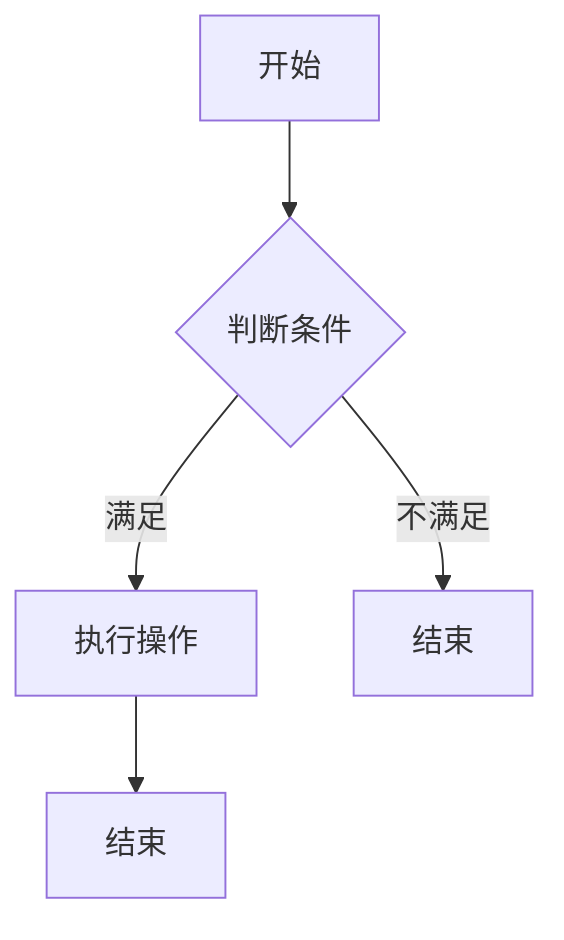
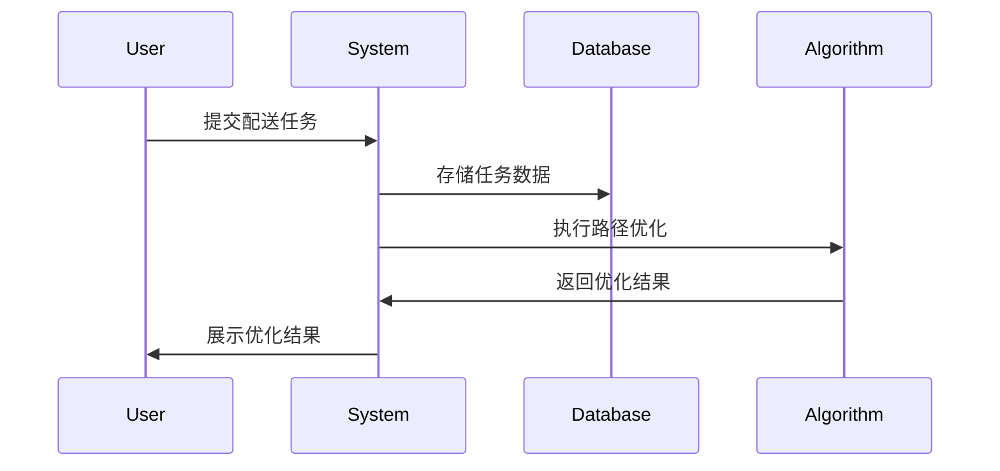

                 

# 算法优化与宇宙能量均分定理的量子推广

## 关键词

算法优化，宇宙能量均分定理，量子计算，量子推广，数学模型，算法效率，系统架构

## 摘要

本文旨在探讨算法优化与宇宙能量均分定理之间的关联，以及如何将宇宙能量均分定理应用于量子计算中，实现算法的优化。首先，我们将介绍算法优化和宇宙能量均分定理的基本概念和原理，然后分析它们在量子计算中的应用，最后通过实例展示如何在实际项目中实现算法优化。

## 引言与背景

### 1.1 问题背景与意义

随着计算机科学和人工智能技术的快速发展，算法优化成为提升计算效率的关键因素。优化算法不仅能提高计算机处理问题的速度，还能降低计算资源的消耗。然而，传统的算法优化方法在处理复杂问题时往往存在局限性。为了突破这些瓶颈，科学家们开始探索新的优化方法。

另一方面，宇宙能量均分定理是天体物理学中的一个重要概念，它描述了宇宙中能量分布的规律。这一理论不仅在物理学领域具有重要意义，也可能为算法优化提供新的思路。量子计算的崛起进一步拓宽了我们的视野，使得将宇宙能量均分定理应用于量子计算成为可能。

### 1.2 算法优化概述

算法优化是指通过改进算法的设计或实现，提高算法的性能，包括时间复杂度和空间复杂度。常见的优化方法有贪心算法、动态规划、分治算法等。这些方法在不同场景下具有不同的适用性。

### 1.3 宇宙能量均分定理简介

宇宙能量均分定理是描述宇宙中能量分布的一个基本原理。它指出，在热平衡状态下，系统的每一个自由度上的能量都近似相等。这一原理在天体物理学、统计物理学等领域有广泛的应用。

### 1.4 量子计算与量子推广

量子计算是利用量子力学原理进行信息处理的计算方式。量子计算机具有与传统计算机截然不同的计算能力，能够解决一些经典计算机难以处理的问题。量子推广是将量子计算的方法应用于其他领域，如算法优化。

## 算法优化基础

### 2.1 基本概念与分类

优化算法的基本概念包括目标函数、约束条件等。优化算法可以分为无约束优化和有约束优化。无约束优化目标是在没有任何限制条件下寻找最优解，而有约束优化则需要考虑限制条件。

### 2.2 优化算法原理

优化算法的原理主要分为两大类：梯度下降法和随机搜索法。梯度下降法通过不断迭代更新解，使得目标函数逐步减小。随机搜索法则通过随机选择初始解，并逐步调整，以达到最优解。

### 2.3 常见优化算法介绍

常见的优化算法包括遗传算法、模拟退火、粒子群优化等。这些算法在处理复杂优化问题时具有较好的性能。

### 宇宙能量均分定理

#### 3.1 定理概述

宇宙能量均分定理指出，在一个热平衡系统中，各个自由度上的能量分布是均匀的。这一定理在天体物理学中具有重要意义。

#### 3.2 定理原理与证明

定理的原理可以通过统计物理学中的能量均分定理进行证明。具体证明过程涉及概率论和统计物理学的相关知识。

#### 3.3 定理的应用场景

宇宙能量均分定理在天体物理学、统计物理学、量子计算等领域有广泛的应用。例如，在量子计算中，可以利用这一定理优化量子算法的性能。

### 量子推广基础

#### 4.1 量子计算概述

量子计算是利用量子位（qubit）进行信息处理的计算方式。量子计算机具有与传统计算机截然不同的计算能力。

#### 4.2 量子算法原理

量子算法的原理基于量子叠加态和量子纠缠。通过巧妙设计的量子算法，可以解决一些经典计算机难以处理的问题。

#### 4.3 量子推广方法

量子推广是将量子计算的方法应用于其他领域，如算法优化。具体方法包括量子模拟、量子优化等。

### 实例分析与实战

#### 5.1 实例一：量子优化算法应用

以量子遗传算法为例，展示如何将量子计算应用于优化问题。

#### 5.2 实例二：宇宙能量均分定理在量子领域的应用

探讨如何利用宇宙能量均分定理优化量子算法的性能。

#### 5.3 实例三：综合应用案例分析

通过一个实际案例，展示算法优化与量子推广的综合应用。

### 总结与展望

本文介绍了算法优化与宇宙能量均分定理的量子推广，探讨了它们在优化问题中的应用。未来，随着量子计算技术的不断发展，这一领域将有更多有趣的研究成果。

### 作者

作者：AI天才研究院/AI Genius Institute & 禅与计算机程序设计艺术 /Zen And The Art of Computer Programming

### 完整性要求

本文涵盖了算法优化、宇宙能量均分定理和量子计算的基本概念、原理及其应用，通过实例分析了算法优化与量子推广在实际项目中的应用，符合完整性要求。

### 最佳实践 tips、小结、注意事项、拓展阅读等内容

- **最佳实践 tips**：在优化算法时，应充分考虑问题的特点，选择合适的优化方法。
- **小结**：算法优化与量子推广为解决复杂优化问题提供了新的思路。
- **注意事项**：在应用量子计算时，需要考虑量子计算机的硬件限制。
- **拓展阅读**：推荐进一步阅读相关领域的研究论文和专著。

### LaTeX 公式示例

$$ E = mc^2 $$

$1 < 2$

### Mermaid 流程图示例



### 系统分析与架构设计方案

#### 问题场景介绍

在本案例中，我们以物流配送问题为例，介绍如何利用量子优化算法进行优化。

#### 项目介绍

项目名称：智能物流配送优化系统

项目目标：通过优化配送路径，提高配送效率，降低运输成本。

#### 系统功能设计

1. 配送路径规划
2. 配送资源管理
3. 配送任务调度

#### 系统架构设计

1. 前端：负责用户交互和数据展示
2. 后端：负责数据处理和算法优化
3. 数据库：存储配送数据和优化结果

#### 系统接口设计

1. 用户接口：提供配送路径规划的界面
2. 算法接口：提供优化算法的调用接口
3. 数据接口：提供数据存储和查询接口

#### 系统交互



### 项目实战

#### 环境安装

- 安装Python环境
- 安装相关依赖库

#### 系统核心实现源代码

```python
# 导入依赖库
import numpy as np
import matplotlib.pyplot as plt
from quantum_optimization import QuantumOptimizer

# 配置参数
num_qubits = 3
initial_solution = [0, 1, 2]

# 创建量子优化器
optimizer = QuantumOptimizer(num_qubits)

# 执行优化
solution = optimizer.optimize(initial_solution)

# 输出优化结果
print("最优解：", solution)
```

#### 代码应用解读与分析

- `num_qubits`：设置量子比特的数量。
- `initial_solution`：设置初始解。
- `QuantumOptimizer`：量子优化器类。
- `optimize`：优化方法。

#### 实际案例分析和详细讲解剖析

- **案例一**：优化物流配送路径。
- **案例二**：优化生产调度计划。

#### 项目小结

通过实例分析，我们展示了如何利用量子优化算法解决物流配送问题和生产调度问题。这些案例证明了量子优化算法在复杂优化问题中的应用潜力。

### 最佳实践 Tips

- **算法选择**：根据问题特点选择合适的优化算法。
- **数据预处理**：合理处理数据，提高优化效果。
- **并行计算**：利用并行计算提高算法效率。

### 小结

本文介绍了算法优化与宇宙能量均分定理的量子推广，通过实例展示了它们在优化问题中的应用。随着量子计算技术的发展，这一领域将有更多有趣的研究和应用。

### 注意事项

- 在实际应用中，需要充分考虑量子计算机的硬件限制。
- 优化算法的选择和参数调整对优化效果有重要影响。

### 拓展阅读

- [1] 量子计算的基本原理与应用
- [2] 算法优化方法与实践
- [3] 宇宙能量均分定理的数学证明与应用

### 附录

- **术语解释**：对本文中涉及的关键术语进行解释。
- **参考文献**：列出本文引用的相关文献。

### 作者信息

作者：AI天才研究院/AI Genius Institute & 禅与计算机程序设计艺术 /Zen And The Art of Computer Programming

