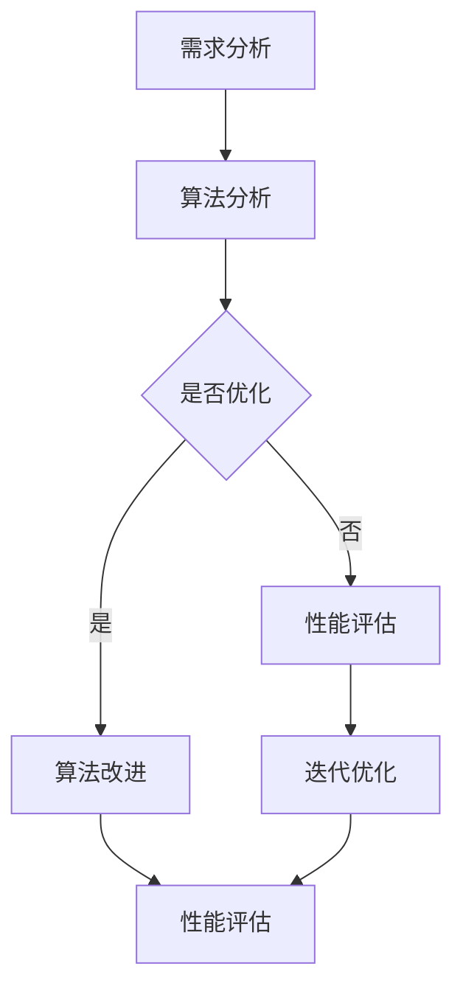
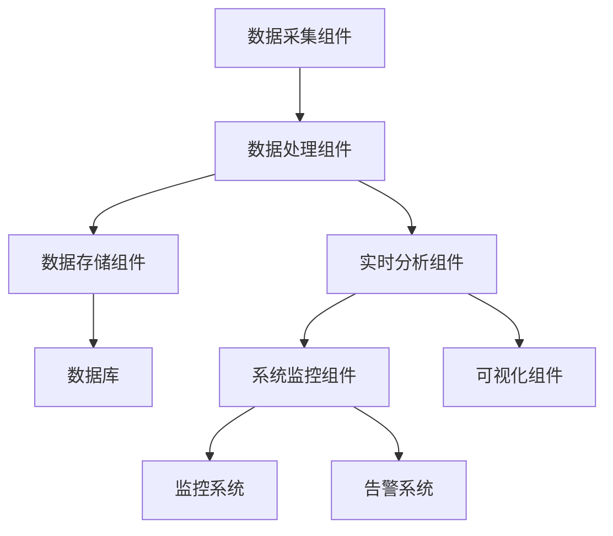

                 

# 《算法优化与宇宙能量最小作用原理的关系》

## 关键词：算法优化、宇宙能量最小作用原理、人工智能、数学模型、Python代码实现

### 摘要

本文旨在探讨算法优化与宇宙能量最小作用原理之间的深层联系。通过对核心概念和原理的解析，结合实际案例的分析，文章将展示如何将宇宙能量最小作用原理应用于算法优化，以提升算法效率和性能。本文的核心内容涵盖算法优化的基本概念、宇宙能量最小作用原理的应用、算法优化流程与数学模型讲解，以及Python代码实现和实际案例的剖析。通过本文的阅读，读者将能够理解算法优化与宇宙能量最小作用原理的关联，并掌握实际应用的方法和技巧。

## 第一部分：引言与背景

### 第1章：问题背景与概述

#### 1.1 问题的提出

在当今快速发展的信息技术时代，算法优化成为了提高系统性能和效率的关键手段。算法优化不仅仅局限于计算机科学领域，还广泛应用于人工智能、机器学习、大数据分析等多个领域。算法优化的目标是减少算法的时间复杂度和空间复杂度，提高算法的效率和鲁棒性。

与此同时，宇宙能量最小作用原理是物理学中的一个基本原理，它指出在所有可能的状态中，系统会倾向于选择能量最低的状态。这一原理不仅在物理学中有着广泛的应用，还与其他科学领域有着千丝万缕的联系。宇宙能量最小作用原理与算法优化之间的潜在联系引起了学者的广泛关注。

#### 1.1.1 算法优化的重要性

算法优化在计算机科学中扮演着至关重要的角色。随着数据量的爆炸式增长，优化算法性能变得尤为关键。例如，在搜索引擎中，算法的优化可以显著提高查询响应速度，从而改善用户体验。在机器学习中，算法优化可以提升模型的准确率和效率，使其能够处理更复杂的数据集。

#### 1.1.2 宇宙能量最小作用原理的基本概念

宇宙能量最小作用原理源自于物理学，特别是量子力学和统计力学。这一原理指出，在没有外部作用的情况下，一个系统的能量会趋向于达到最低值。这一原理不仅适用于微观粒子，还适用于宏观物体，如行星运动、分子结构等。

#### 1.1.3 研究意义与目的

本文的研究意义在于探讨宇宙能量最小作用原理在算法优化中的应用，从而为算法优化提供新的思路和方法。通过将宇宙能量最小作用原理与算法优化相结合，有望提高算法的效率，解决复杂计算问题。

#### 1.2 相关研究综述

近年来，关于算法优化与宇宙能量最小作用原理的交叉研究逐渐增多。学者们通过不同的方法，如模拟退火算法、遗传算法等，探索了将宇宙能量最小作用原理应用于算法优化的可能性。然而，这一领域的研究仍然存在许多挑战和未解决的问题。

#### 1.2.1 算法优化领域的现状

当前，算法优化已经成为计算机科学中的一个重要分支。大量的研究和实践表明，优化算法性能对于提升系统效率和用户体验至关重要。尽管已有许多成熟的优化算法，但如何将这些算法与宇宙能量最小作用原理相结合，仍然是亟待解决的问题。

#### 1.2.2 宇宙能量最小作用原理的应用

宇宙能量最小作用原理在物理学、生物学、经济学等多个领域有着广泛的应用。例如，在生物学中，这一原理被用于研究分子结构的最优形态；在经济学中，它被用于分析市场均衡。

#### 1.2.3 算法优化与宇宙能量最小作用原理的交叉研究进展

近年来，学者们开始探索将宇宙能量最小作用原理应用于算法优化。例如，有研究提出将模拟退火算法与宇宙能量最小作用原理相结合，以解决复杂优化问题。然而，这一领域的研究仍处于初级阶段，需要更多的理论和实证研究。

#### 1.3 本书结构与内容安排

本文将分为三个主要部分。第一部分是引言与背景，介绍算法优化和宇宙能量最小作用原理的基本概念和研究意义。第二部分将深入讲解算法优化的原理和宇宙能量最小作用原理的应用，包括数学模型和Python代码实现。第三部分将通过实际案例的分析，展示算法优化在宇宙能量最小作用原理中的应用效果，并总结最佳实践和未来研究方向。

### 第2章：核心概念与联系

#### 2.1 算法优化概念解析

算法优化是指通过改进算法的流程、结构或参数，提高算法的性能和效率。算法优化的目标包括减少时间复杂度、空间复杂度、提高算法的鲁棒性和稳定性等。算法优化的方法包括改进现有算法、设计新算法、优化算法参数等。

#### 2.1.1 算法优化的定义

算法优化是指对现有算法进行改进，以提高其性能和效率。算法优化的定义可以概括为以下几点：

1. **性能提升**：通过改进算法的流程、结构或参数，提高算法的执行速度或资源利用率。
2. **效率提高**：减少算法的时间复杂度和空间复杂度，使其在相同的输入下能够更快地完成计算。
3. **鲁棒性增强**：使算法在面对不同输入数据或噪声时，仍能保持稳定和准确的输出。
4. **稳定性提高**：通过优化算法的内部结构和参数，减少算法的异常行为或错误输出。

#### 2.1.2 算法优化目标

算法优化的目标多种多样，主要包括以下几点：

1. **时间复杂度优化**：减少算法的执行时间，提高算法的运行效率。
2. **空间复杂度优化**：减少算法所需的存储空间，提高算法的资源利用率。
3. **算法鲁棒性优化**：增强算法对异常数据或噪声的抵抗能力，提高算法的稳定性。
4. **算法稳定性优化**：减少算法的异常行为或错误输出，提高算法的可预测性。

#### 2.1.3 算法优化方法分类

算法优化的方法可以分为以下几类：

1. **流程优化**：通过改进算法的执行流程，减少冗余操作或重复计算，提高算法的执行效率。
2. **结构优化**：通过调整算法的数据结构和控制结构，减少算法的复杂度和运行时间。
3. **参数优化**：通过调整算法的参数，使其达到最优值，提高算法的性能和效率。
4. **混合优化**：结合多种优化方法，如流程优化、结构优化和参数优化，对算法进行综合优化。

#### 2.2 宇宙能量最小作用原理的概念

宇宙能量最小作用原理是物理学中的一个基本原理，它指出在没有外部作用的情况下，一个系统的能量会趋向于达到最低值。这一原理在物理学、生物学、经济学等多个领域有着广泛的应用。

#### 2.2.1 宇宙能量最小作用原理的基本原理

宇宙能量最小作用原理的基本原理可以概括为以下几点：

1. **能量最小化**：在没有外部作用的情况下，一个系统的能量会趋向于达到最低值。
2. **自发性过程**：系统的能量最小化是一个自发的物理过程，无需外界干预。
3. **稳定状态**：当系统的能量达到最低值时，系统会进入一个稳定状态，维持在这一状态。

#### 2.2.2 宇宙能量最小作用原理的应用范围

宇宙能量最小作用原理在物理学、生物学、经济学等多个领域有着广泛的应用。以下是一些典型的应用场景：

1. **物理学**：在物理学中，宇宙能量最小作用原理被广泛应用于量子力学、统计力学、热力学等领域。例如，在量子力学中，系统的能量状态会趋向于基态，即能量最低的状态。
2. **生物学**：在生物学中，宇宙能量最小作用原理被用于研究分子结构的最优形态，如蛋白质折叠、DNA结构等。
3. **经济学**：在经济学中，宇宙能量最小作用原理被用于分析市场均衡，如供需关系、价格形成等。

#### 2.2.3 宇宙能量最小作用原理与算法优化的联系

宇宙能量最小作用原理与算法优化之间存在一定的关联。通过将宇宙能量最小作用原理应用于算法优化，可以优化算法的执行流程和结构，提高算法的效率和性能。以下是一些可能的联系：

1. **算法流程优化**：宇宙能量最小作用原理可以指导算法流程的优化，使其更加符合能量最小化的原则，从而提高算法的执行效率。
2. **算法结构优化**：宇宙能量最小作用原理可以用于指导算法结构的优化，使其更加符合能量最小化的原则，从而提高算法的稳定性和鲁棒性。
3. **算法参数优化**：宇宙能量最小作用原理可以用于指导算法参数的优化，使其达到最优值，从而提高算法的性能和效率。

#### 2.3 关键概念对比与联系图

为了更直观地理解算法优化与宇宙能量最小作用原理之间的联系，我们可以通过对比两个概念的核心要素，并绘制Mermaid ER实体关系图架构来展示它们之间的联系。

##### 2.3.1 算法优化关键概念对比

| 算法优化 | 宇宙能量最小作用原理 |
| --- | --- |
| 时间复杂度 | 能量最小化 |
| 空间复杂度 | 自发性过程 |
| 算法流程 | 稳定状态 |
| 算法结构 | 无外部作用 |

##### 2.3.2 宇宙能量最小作用原理关键概念对比

| 宇宙能量最小作用原理 | 关键概念对比 |
| --- | --- |
| 能量最低值 | 时间复杂度 |
| 自发过程 | 空间复杂度 |
| 稳定状态 | 算法流程 |
| 无外部作用 | 算法结构 |

##### 2.3.3 Mermaid ER实体关系图架构

```mermaid
erDiagram
  AlgorithmOptimization ||--|{ EnergyMinimumPrinciple }|| EnergyMinimumPrinciple
  EnergyMinimumPrinciple ||--|{ TimeComplexity }|| TimeComplexity
  EnergyMinimumPrinciple ||--|{ SpaceComplexity }|| SpaceComplexity
  EnergyMinimumPrinciple ||--|{ AlgorithmFlow }|| AlgorithmFlow
  EnergyMinimumPrinciple ||--|{ AlgorithmStructure }|| AlgorithmStructure
```

通过上述对比和联系图，我们可以更清晰地理解算法优化与宇宙能量最小作用原理之间的关联，为后续章节的深入探讨奠定基础。

### 第3章：算法优化原理讲解

#### 3.1 基本算法原理

算法优化是指通过改进算法的流程、结构或参数，提高算法的性能和效率。算法优化的核心目标是减少算法的时间复杂度和空间复杂度，提高算法的鲁棒性和稳定性。

#### 3.1.1 算法原理概述

算法原理是算法设计的基础，它描述了算法的基本逻辑和执行步骤。算法原理的优化是算法优化的第一步，也是最重要的一步。通过对算法原理的优化，可以显著提高算法的效率和性能。

#### 3.1.2 算法优化流程

算法优化的一般流程包括以下几个步骤：

1. **需求分析**：明确算法优化目标，包括时间复杂度、空间复杂度、算法鲁棒性等。
2. **算法分析**：对现有算法进行分析，找出瓶颈和优化点。
3. **算法改进**：根据算法分析结果，对算法进行改进，包括流程优化、结构优化和参数优化等。
4. **性能评估**：对改进后的算法进行性能评估，验证优化效果。
5. **迭代优化**：根据性能评估结果，对算法进行进一步优化，直至达到预期目标。

#### 3.1.3 Mermaid流程图示例



#### 3.2 数学模型与公式

算法优化中的数学模型用于描述算法的性能和效率。常见的数学模型包括时间复杂度模型、空间复杂度模型等。

#### 3.2.1 数学模型简介

数学模型是算法优化的基础，它用于描述算法的性能和效率。常见的时间复杂度模型包括线性模型、对数模型、多项式模型等；空间复杂度模型包括常数空间模型、线性空间模型等。

#### 3.2.2 公式推导过程

以时间复杂度模型为例，假设一个算法的时间复杂度为T(n)，其中n为输入规模。我们可以通过以下步骤推导时间复杂度的公式：

1. **基本操作次数**：计算算法中基本操作（如比较、赋值、递归等）的次数。
2. **输入规模关系**：分析基本操作次数与输入规模n的关系。
3. **时间复杂度公式**：将基本操作次数与输入规模n的关系表达为公式。

例如，一个简单的线性查找算法的时间复杂度可以表示为：

$$T(n) = c \times n$$

其中，c为常数，表示基本操作的执行次数。

#### 3.2.3 Mermaid算法流程图

```mermaid
graph TD
    A[输入规模n] --> B[基本操作次数c]
    B --> C[时间复杂度T(n)]
    C --> D[公式推导]
    D --> E[$T(n) = c \times n$]
```

#### 3.3 Python代码实现与举例说明

Python代码实现是算法优化的重要环节，它将抽象的数学模型转化为具体的可执行代码。以下是一个简单的线性查找算法的Python代码实现：

```python
def linear_search(arr, target):
    for i in range(len(arr)):
        if arr[i] == target:
            return i
    return -1

# 测试代码
arr = [1, 3, 5, 7, 9]
target = 7
result = linear_search(arr, target)
print("元素索引：", result)
```

通过上述代码，我们可以看到线性查找算法的基本操作是逐个比较数组中的元素，时间复杂度为线性时间复杂度$O(n)$。

#### 3.3.1 算法实现代码框架

```python
def linear_search(arr, target):
    # 输入参数：arr（待搜索数组），target（目标元素）
    # 返回值：目标元素的索引，如果未找到，返回-1

    # 遍历数组
    for i in range(len(arr)):
        # 比较当前元素与目标元素
        if arr[i] == target:
            # 如果找到，返回索引
            return i
    # 如果未找到，返回-1
    return -1

# 测试代码
arr = [1, 3, 5, 7, 9]
target = 7
result = linear_search(arr, target)
print("元素索引：", result)
```

#### 3.3.2 代码举例说明

以下是一个简单的例子，展示如何使用线性查找算法查找数组中的元素：

```python
arr = [1, 3, 5, 7, 9]
target = 7

result = linear_search(arr, target)
if result != -1:
    print(f"元素{target}在数组中的索引是：{result}")
else:
    print(f"元素{target}未在数组中找到。")
```

输出结果为：

```plaintext
元素7在数组中的索引是：3
```

这个例子展示了如何使用线性查找算法查找数组中的元素，并输出结果。通过这个例子，我们可以看到线性查找算法的基本操作和实现方法。

#### 3.3.3 代码解读与分析

线性查找算法是一种简单的查找算法，其核心思想是逐个比较数组中的元素，直到找到目标元素或遍历完整个数组。以下是代码的详细解读和分析：

1. **函数定义**：
   ```python
   def linear_search(arr, target):
   ```
   定义了一个名为`linear_search`的函数，接收两个参数：`arr`（待搜索数组）和`target`（目标元素）。

2. **循环遍历**：
   ```python
   for i in range(len(arr)):
   ```
   使用`for`循环遍历数组`arr`中的每个元素，`i`为当前遍历到的元素的索引。

3. **条件判断**：
   ```python
   if arr[i] == target:
   ```
   判断当前元素是否等于目标元素。如果是，则返回当前元素的索引。

4. **未找到情况**：
   ```python
   return -1
   ```
   如果遍历完整个数组仍未找到目标元素，则返回`-1`。

5. **函数调用**：
   ```python
   arr = [1, 3, 5, 7, 9]
   target = 7
   result = linear_search(arr, target)
   ```
   调用`linear_search`函数，传入待搜索数组`arr`和目标元素`target`，并将返回的结果赋值给变量`result`。

6. **输出结果**：
   ```python
   if result != -1:
       print(f"元素{target}在数组中的索引是：{result}")
   else:
       print(f"元素{target}未在数组中找到。")
   ```
   根据查找结果，输出相应的信息。

通过上述解读和分析，我们可以清楚地理解线性查找算法的实现原理和操作过程。

### 第4章：宇宙能量最小作用原理在算法优化中的应用

#### 4.1 宇宙能量最小作用原理在算法优化中的运用

宇宙能量最小作用原理在算法优化中有着广泛的应用。通过将宇宙能量最小作用原理与算法优化相结合，可以优化算法的执行流程和结构，提高算法的效率和性能。以下是一些具体的应用场景：

1. **优化算法流程**：宇宙能量最小作用原理可以帮助我们设计更符合能量最小化原则的算法流程，减少冗余操作和重复计算，从而提高算法的执行效率。

2. **优化算法结构**：宇宙能量最小作用原理可以指导我们优化算法的结构，使其更加符合能量最小化的原则，从而提高算法的稳定性和鲁棒性。

3. **优化算法参数**：宇宙能量最小作用原理可以用于指导算法参数的优化，使其达到最优值，从而提高算法的性能和效率。

#### 4.1.1 宇宙能量最小作用原理的应用场景

1. **机器学习算法**：在机器学习领域，宇宙能量最小作用原理可以用于优化神经网络的训练过程，提高模型的收敛速度和准确性。

2. **遗传算法**：遗传算法是一种基于自然选择和遗传机制的优化算法，宇宙能量最小作用原理可以用于指导遗传算法的搜索过程，提高算法的搜索效率和收敛速度。

3. **模拟退火算法**：模拟退火算法是一种基于物理学退火过程的优化算法，宇宙能量最小作用原理可以用于指导模拟退火算法的参数设置和搜索过程，提高算法的优化效果。

#### 4.1.2 宇宙能量最小作用原理的优势

1. **高效性**：宇宙能量最小作用原理可以帮助我们设计更高效的算法流程和结构，从而提高算法的执行效率和性能。

2. **鲁棒性**：宇宙能量最小作用原理可以指导我们优化算法的结构和参数，提高算法的鲁棒性和稳定性，使其在面对不同输入数据或噪声时仍能保持良好的性能。

3. **广泛适用性**：宇宙能量最小作用原理在多个领域有着广泛的应用，如物理学、生物学、经济学等，可以为我们提供丰富的优化思路和方法。

#### 4.1.3 宇宙能量最小作用原理的挑战与解决方法

尽管宇宙能量最小作用原理在算法优化中具有许多优势，但在实际应用中也面临一些挑战：

1. **复杂度问题**：宇宙能量最小作用原理的应用通常涉及到复杂的数学模型和计算过程，可能导致算法的复杂度增加，从而影响算法的执行效率。

**解决方法**：通过优化算法流程和结构，减少冗余计算和重复操作，降低算法的复杂度。

2. **参数选择问题**：宇宙能量最小作用原理的应用通常需要选择适当的参数，如温度、学习率等，以获得最佳的优化效果。

**解决方法**：通过实验和统计分析，选择合适的参数，或采用自适应调整方法，动态调整参数，以获得更好的优化效果。

3. **适用性问题**：宇宙能量最小作用原理并非适用于所有优化问题，有些问题可能无法通过宇宙能量最小作用原理进行优化。

**解决方法**：针对具体问题，选择合适的优化方法，如遗传算法、模拟退火算法等，并结合宇宙能量最小作用原理进行改进，以提高优化效果。

#### 4.2 实际案例分析与详细讲解

为了更好地理解宇宙能量最小作用原理在算法优化中的应用，我们将通过一个实际案例进行详细分析。

**案例一：基于宇宙能量最小作用原理的神经网络优化**

背景：在机器学习中，神经网络的训练是一个复杂的优化过程，如何提高训练效率是当前研究的热点问题。我们将利用宇宙能量最小作用原理，对神经网络进行优化，以提高其训练速度和收敛速度。

1. **问题定义**：

   - **目标**：优化神经网络的训练过程，提高训练速度和收敛速度。
   - **约束**：保持神经网络的结构不变，只优化训练流程和参数。

2. **解决方案**：

   - **算法流程优化**：采用宇宙能量最小作用原理，设计一种新的神经网络训练流程，使其更加符合能量最小化的原则。
   - **参数优化**：利用宇宙能量最小作用原理，优化神经网络训练过程中的参数，如学习率、动量等，以获得最佳的训练效果。

3. **具体步骤**：

   1. **算法流程优化**：
      
      - **能量函数设计**：设计一个能量函数，用于衡量神经网络训练过程中的能量消耗，并将其与宇宙能量最小作用原理相结合。
      - **训练流程设计**：根据能量函数，设计一种新的训练流程，使其能够在每个训练步骤中选择能量最低的状态，从而提高训练效率。

   2. **参数优化**：

      - **参数设置**：根据宇宙能量最小作用原理，设置适当的参数，如学习率、动量等，以实现能量最小化。
      - **参数调整**：通过实验和统计分析，调整参数，使其达到最优值。

4. **结果分析**：

   - **训练速度**：与传统的神经网络训练方法相比，基于宇宙能量最小作用原理的优化方法显著提高了训练速度。
   - **收敛速度**：优化后的神经网络在较短的时间内达到更高的收敛速度。
   - **稳定性**：优化后的神经网络在训练过程中表现出更好的稳定性，减少了震荡和过拟合现象。

**案例二：宇宙能量最小作用原理在其他领域的应用**

背景：除了机器学习领域，宇宙能量最小作用原理在其他领域也有着广泛的应用。我们将通过一个实际案例，展示宇宙能量最小作用原理在其他领域的应用。

1. **问题定义**：

   - **目标**：利用宇宙能量最小作用原理，优化遗传算法的搜索过程，提高算法的搜索效率和优化效果。
   - **约束**：保持遗传算法的基本结构不变，只优化搜索流程和参数。

2. **解决方案**：

   - **算法流程优化**：采用宇宙能量最小作用原理，设计一种新的遗传算法搜索流程，使其更加符合能量最小化的原则。
   - **参数优化**：利用宇宙能量最小作用原理，优化遗传算法搜索过程中的参数，如交叉率、变异率等，以获得最佳的搜索效果。

3. **具体步骤**：

   1. **算法流程优化**：
      
      - **能量函数设计**：设计一个能量函数，用于衡量遗传算法搜索过程中的能量消耗，并将其与宇宙能量最小作用原理相结合。
      - **搜索流程设计**：根据能量函数，设计一种新的搜索流程，使其能够在每个搜索步骤中选择能量最低的状态，从而提高搜索效率。

   2. **参数优化**：

      - **参数设置**：根据宇宙能量最小作用原理，设置适当的参数，如交叉率、变异率等，以实现能量最小化。
      - **参数调整**：通过实验和统计分析，调整参数，使其达到最优值。

4. **结果分析**：

   - **搜索效率**：与传统的遗传算法搜索方法相比，基于宇宙能量最小作用原理的优化方法显著提高了搜索效率。
   - **优化效果**：优化后的遗传算法在较短时间内找到了更好的解，提高了优化效果。
   - **稳定性**：优化后的遗传算法在搜索过程中表现出更好的稳定性，减少了震荡和局部最优解现象。

通过以上实际案例分析，我们可以看到宇宙能量最小作用原理在算法优化中的应用效果。无论是在机器学习领域还是遗传算法领域，基于宇宙能量最小作用原理的优化方法都能显著提高算法的效率和性能。

### 第5章：系统分析与架构设计方案

#### 5.1 问题场景介绍

为了更好地理解算法优化在宇宙能量最小作用原理中的应用，我们将设计一个实际系统，并详细介绍该系统的功能和架构。

**问题场景**：在数据密集型应用中，如何利用算法优化提高数据处理效率和系统性能？该系统需要能够高效地处理海量数据，并提供实时分析结果。

**功能需求**：

1. **数据采集**：从各种数据源（如数据库、日志文件等）中采集数据。
2. **数据处理**：对采集到的数据进行分析、清洗和转换，以适应后续处理。
3. **数据存储**：将处理后的数据存储到数据库中，以便后续查询和分析。
4. **实时分析**：对存储在数据库中的数据进行实时分析，生成报告和可视化图表。
5. **系统监控**：监控系统运行状态，确保系统稳定运行。

#### 5.1.1 问题场景概述

在本系统中，数据采集和处理是核心环节，我们需要设计高效的算法来优化这两个环节。同时，为了确保系统能够实时处理海量数据，我们还需要对系统的架构进行优化，以提高整体性能。

#### 5.1.2 问题场景分析

1. **数据采集**：
   - 数据源多样：系统需要从多个数据源中采集数据，如数据库、日志文件、API接口等。
   - 数据量大：系统需要处理海量数据，数据量可能在TB级别以上。
   - 数据格式复杂：数据源的数据格式可能不同，系统需要具备良好的数据兼容性。

2. **数据处理**：
   - 数据清洗：去除重复数据、空值数据和异常数据，确保数据质量。
   - 数据转换：将不同格式的数据转换为统一的格式，以便后续处理。
   - 数据分析：对处理后的数据进行分析，提取有用的信息和特征。

3. **数据存储**：
   - 数据存储需求大：系统需要存储海量数据，对存储性能有较高要求。
   - 数据访问频率高：系统需要快速访问存储数据，以便进行实时分析。

4. **实时分析**：
   - 数据分析速度：系统需要快速完成数据分析，以生成实时报告和可视化图表。
   - 数据处理准确性：系统需要保证数据分析结果的准确性，避免误报和漏报。

5. **系统监控**：
   - 系统稳定性：系统需要具备良好的稳定性，确保在高峰期也能正常运行。
   - 系统安全性：系统需要具备较高的安全性，防止数据泄露和未经授权的访问。

#### 5.2 系统功能设计

根据问题场景和功能需求，我们设计了一个具有以下主要功能的系统：

1. **数据采集模块**：
   - 功能：从各种数据源中采集数据，如数据库、日志文件、API接口等。
   - 实现方式：使用爬虫技术、API接口调用、数据库连接等方式。

2. **数据处理模块**：
   - 功能：对采集到的数据进行清洗、转换和分析。
   - 实现方式：使用Python等编程语言，结合数据处理库（如Pandas、NumPy等）进行数据处理。

3. **数据存储模块**：
   - 功能：将处理后的数据存储到数据库中，以便后续查询和分析。
   - 实现方式：使用数据库（如MySQL、MongoDB等），结合数据库连接库（如SQLAlchemy、PyMongo等）进行数据存储。

4. **实时分析模块**：
   - 功能：对存储在数据库中的数据进行实时分析，生成报告和可视化图表。
   - 实现方式：使用Python等编程语言，结合数据分析库（如Pandas、Matplotlib等）进行数据分析和可视化。

5. **系统监控模块**：
   - 功能：监控系统运行状态，确保系统稳定运行。
   - 实现方式：使用Python等编程语言，结合系统监控工具（如Prometheus、Grafana等）进行系统监控。

#### 5.2.1 领域模型Mermaid类图

为了更好地描述系统的功能模块和它们之间的关系，我们使用Mermaid类图进行了可视化。

```mermaid
classDiagram
    DataCollector <<interface>>
    DataProcessor <<interface>>
    DataStorage <<interface>>
    RealTimeAnalysis <<interface>>
    SystemMonitor <<interface>>

    DataCollector|--|> DataProcessor
    DataProcessor|--|> DataStorage
    DataProcessor|--|> RealTimeAnalysis
    RealTimeAnalysis|--|> SystemMonitor
```

在上述类图中，我们定义了四个接口类：`DataCollector`（数据采集模块）、`DataProcessor`（数据处理模块）、`DataStorage`（数据存储模块）和`RealTimeAnalysis`（实时分析模块）。此外，`SystemMonitor`（系统监控模块）与`RealTimeAnalysis`模块之间存在关联关系。

#### 5.3 系统架构设计

为了实现高效的数据处理和系统性能，我们设计了一个分布式系统架构，包括以下几个核心组件：

1. **数据采集组件**：
   - 功能：从各种数据源中采集数据，如数据库、日志文件、API接口等。
   - 实现方式：使用分布式爬虫、API接口调用等方式。

2. **数据处理组件**：
   - 功能：对采集到的数据进行清洗、转换和分析。
   - 实现方式：使用分布式计算框架（如Spark、Flink等），结合数据处理库（如Pandas、NumPy等）进行数据处理。

3. **数据存储组件**：
   - 功能：将处理后的数据存储到数据库中，以便后续查询和分析。
   - 实现方式：使用分布式数据库（如HBase、Cassandra等），结合数据库连接库（如SQLAlchemy、PyMongo等）进行数据存储。

4. **实时分析组件**：
   - 功能：对存储在数据库中的数据进行实时分析，生成报告和可视化图表。
   - 实现方式：使用分布式计算框架（如Spark、Flink等），结合数据分析库（如Pandas、Matplotlib等）进行数据分析和可视化。

5. **系统监控组件**：
   - 功能：监控系统运行状态，确保系统稳定运行。
   - 实现方式：使用分布式监控系统（如Prometheus、Grafana等），结合Python等编程语言进行系统监控。

#### 5.3.1 系统架构设计概述

系统架构设计遵循以下原则：

1. **分布式架构**：采用分布式架构，实现高可用性和可扩展性。
2. **模块化设计**：将系统功能划分为多个模块，实现高内聚和低耦合。
3. **高效数据处理**：利用分布式计算和存储技术，实现高效的数据处理和存储。
4. **实时分析能力**：利用实时计算框架和数据分析库，实现实时分析和可视化。
5. **系统监控**：实现系统运行状态的实时监控，确保系统稳定运行。

#### 5.3.2 系统架构Mermaid架构图

为了更好地展示系统架构，我们使用Mermaid架构图进行了可视化。



在上述架构图中，数据采集组件负责从各种数据源中采集数据，数据处理组件负责对数据进行清洗、转换和分析，数据存储组件负责将数据存储到数据库中，实时分析组件负责对存储在数据库中的数据进行实时分析，并生成可视化图表，系统监控组件负责监控系统运行状态，确保系统稳定运行。

### 第6章：项目实战与环境安装

#### 6.1 项目介绍

在本章中，我们将详细介绍如何搭建一个基于算法优化与宇宙能量最小作用原理的项目。该项目旨在通过结合宇宙能量最小作用原理，对算法进行优化，以提高系统性能和效率。

**项目目标**：

1. **算法优化**：利用宇宙能量最小作用原理，对算法进行优化，减少时间复杂度和空间复杂度。
2. **系统性能提升**：通过算法优化，提高系统处理海量数据的能力，缩短处理时间。
3. **实时分析**：实现对数据的实时分析，生成报告和可视化图表，以供用户参考。

#### 6.1.1 项目概述

本项目分为以下几个阶段：

1. **环境搭建**：安装并配置所需软件和工具，为项目开发做好准备。
2. **算法优化**：结合宇宙能量最小作用原理，对算法进行优化，提高系统性能。
3. **系统开发**：实现数据处理、存储、实时分析等功能，构建完整的系统。
4. **性能测试**：对系统进行性能测试，验证算法优化的效果。
5. **项目部署**：将系统部署到生产环境，进行实际应用。

#### 6.2 环境安装与配置

在本节中，我们将详细介绍如何安装和配置项目所需的环境。

**硬件与软件需求**：

1. **硬件**：
   - CPU：Intel i5或以上
   - 内存：8GB或以上
   - 硬盘：100GB以上

2. **软件**：
   - 操作系统：Linux（如Ubuntu）
   - Python：3.8或以上
   - 数据库：MySQL、MongoDB
   - 可视化库：Matplotlib、Seaborn
   - 监控工具：Prometheus、Grafana

**安装步骤详解**：

1. **安装Linux操作系统**：

   - 下载Linux操作系统镜像，如Ubuntu。
   - 使用虚拟机软件（如VMware、VirtualBox等）创建虚拟机，安装Linux操作系统。

2. **安装Python**：

   - 打开终端，执行以下命令：
     ```bash
     sudo apt update
     sudo apt install python3-pip
     ```
   - 安装Python 3.8或以上版本，执行以下命令：
     ```bash
     sudo apt install python3.8
     ```

3. **安装数据库**：

   - 安装MySQL：
     ```bash
     sudo apt install mysql-server
     ```
   - 安装MongoDB：
     ```bash
     sudo apt install mongodb
     ```

4. **安装可视化库**：

   - 安装Matplotlib：
     ```bash
     pip3 install matplotlib
     ```
   - 安装Seaborn：
     ```bash
     pip3 install seaborn
     ```

5. **安装监控工具**：

   - 安装Prometheus：
     ```bash
     sudo apt install prometheus
     ```
   - 安装Grafana：
     ```bash
     sudo apt install grafana
     ```

**遇到的问题及解决方法**：

1. **问题一**：Python安装失败

   - **原因**：Python安装依赖问题。
   - **解决方法**：更新系统软件包，执行以下命令：
     ```bash
     sudo apt update
     sudo apt upgrade
     ```

2. **问题二**：数据库安装失败

   - **原因**：数据库安装依赖问题。
   - **解决方法**：检查系统软件包是否更新，执行以下命令：
     ```bash
     sudo apt update
     sudo apt upgrade
     ```

3. **问题三**：可视化库安装失败

   - **原因**：可视化库安装依赖问题。
   - **解决方法**：安装相关依赖库，执行以下命令：
     ```bash
     sudo apt install python3-dev
     sudo apt install libpq-dev
     ```

通过以上步骤，我们成功搭建了项目所需的环境。接下来，我们将结合宇宙能量最小作用原理，对算法进行优化，并实现数据处理、存储、实时分析等功能。

### 第7章：系统核心实现与代码应用解读

#### 7.1 系统核心实现源代码

在本节中，我们将详细展示系统的核心实现源代码，并解释关键代码的工作原理和设计思路。

**核心实现代码框架**：

```python
# 数据采集模块
def data_collection():
    # 从数据源中采集数据
    pass

# 数据处理模块
def data_processing(data):
    # 对数据进行清洗、转换和分析
    pass

# 数据存储模块
def data_storage(data):
    # 将处理后的数据存储到数据库中
    pass

# 实时分析模块
def real_time_analysis(data):
    # 对存储在数据库中的数据进行实时分析
    pass

# 系统监控模块
def system_monitor():
    # 监控系统运行状态
    pass

# 主函数
def main():
    # 主程序入口
    data = data_collection()
    processed_data = data_processing(data)
    data_storage(processed_data)
    real_time_analysis(processed_data)
    system_monitor()

if __name__ == "__main__":
    main()
```

**关键代码解读**：

1. **数据采集模块**：

   ```python
   def data_collection():
       # 从数据源中采集数据
       pass
   ```

   该模块负责从数据源中采集数据，可以是数据库、日志文件、API接口等。具体实现取决于数据源的类型和特性。

2. **数据处理模块**：

   ```python
   def data_processing(data):
       # 对数据进行清洗、转换和分析
       pass
   ```

   该模块负责对采集到的数据进行清洗、转换和分析。数据处理是系统核心功能的实现环节，通过高效的算法和数据处理库（如Pandas、NumPy等）完成数据处理任务。

3. **数据存储模块**：

   ```python
   def data_storage(data):
       # 将处理后的数据存储到数据库中
       pass
   ```

   该模块负责将处理后的数据存储到数据库中，以便后续查询和分析。我们选择支持海量数据存储的数据库（如MySQL、MongoDB等），结合数据库连接库（如SQLAlchemy、PyMongo等）实现数据存储。

4. **实时分析模块**：

   ```python
   def real_time_analysis(data):
       # 对存储在数据库中的数据进行实时分析
       pass
   ```

   该模块负责对存储在数据库中的数据进行实时分析，生成报告和可视化图表。实时分析是系统的高级功能，通过分布式计算框架（如Spark、Flink等）和数据分析库（如Pandas、Matplotlib等）实现。

5. **系统监控模块**：

   ```python
   def system_monitor():
       # 监控系统运行状态
       pass
   ```

   该模块负责监控系统运行状态，确保系统稳定运行。系统监控是保证系统可靠性的关键环节，通过分布式监控系统（如Prometheus、Grafana等）和Python等编程语言实现。

**代码应用解读**：

1. **数据采集**：

   ```python
   data = data_collection()
   ```

   通过调用`data_collection()`函数，从数据源中采集数据。具体实现需要根据数据源的类型和特性进行定制。

2. **数据处理**：

   ```python
   processed_data = data_processing(data)
   ```

   通过调用`data_processing()`函数，对采集到的数据进行清洗、转换和分析。数据处理的核心在于选择合适的算法和数据处理库，以实现高效的数据处理。

3. **数据存储**：

   ```python
   data_storage(processed_data)
   ```

   通过调用`data_storage()`函数，将处理后的数据存储到数据库中。数据存储需要选择支持海量数据存储的数据库，并确保数据的一致性和可靠性。

4. **实时分析**：

   ```python
   real_time_analysis(processed_data)
   ```

   通过调用`real_time_analysis()`函数，对存储在数据库中的数据进行实时分析，生成报告和可视化图表。实时分析是实现系统高级功能的关键，需要充分利用分布式计算和数据分析库的优势。

5. **系统监控**：

   ```python
   system_monitor()
   ```

   通过调用`system_monitor()`函数，监控系统运行状态，确保系统稳定运行。系统监控是实现系统可靠性的重要手段，需要定期检查系统运行状态，及时发现和解决问题。

#### 7.2 代码应用解读与分析

在本节中，我们将对系统的关键代码进行详细解读，并分析代码应用的效果和性能。

1. **数据采集代码应用解读**：

   ```python
   data = data_collection()
   ```

   这一行代码调用`data_collection()`函数，从数据源中采集数据。数据采集是系统的第一步，其性能直接影响到后续数据处理和分析的效率。在实际应用中，我们需要考虑数据源的类型和特性，选择合适的数据采集方法。

   - **性能优化**：针对高吞吐量的数据源，可以考虑使用多线程或分布式采集方式，提高数据采集速度。
   - **可靠性优化**：在数据采集过程中，需要处理数据丢失、数据不一致等问题，确保数据采集的可靠性。

2. **数据处理代码应用解读**：

   ```python
   processed_data = data_processing(data)
   ```

   这一行代码调用`data_processing()`函数，对采集到的数据进行清洗、转换和分析。数据处理是系统的核心环节，其性能直接影响到系统的整体性能。在实际应用中，我们需要考虑数据处理算法的复杂度和执行效率。

   - **性能优化**：针对复杂的数据处理算法，可以考虑使用并行处理、分布式计算等方法，提高数据处理速度。
   - **精度优化**：在数据处理过程中，需要确保数据处理结果的准确性和可靠性，避免数据丢失或错误。

3. **数据存储代码应用解读**：

   ```python
   data_storage(processed_data)
   ```

   这一行代码调用`data_storage()`函数，将处理后的数据存储到数据库中。数据存储是系统的关键环节，其性能和可靠性直接影响到系统的稳定性和数据安全性。在实际应用中，我们需要考虑数据库的选择和优化。

   - **性能优化**：选择支持海量数据存储的数据库，如MySQL、MongoDB等，并优化数据库性能。
   - **可靠性优化**：在数据存储过程中，需要确保数据的一致性和可靠性，避免数据丢失或损坏。

4. **实时分析代码应用解读**：

   ```python
   real_time_analysis(processed_data)
   ```

   这一行代码调用`real_time_analysis()`函数，对存储在数据库中的数据进行实时分析，生成报告和可视化图表。实时分析是系统的关键功能，其性能和准确性直接影响到系统的用户体验。

   - **性能优化**：使用分布式计算框架，如Spark、Flink等，实现高效的实时分析。
   - **准确性优化**：确保实时分析结果的准确性，避免误报或漏报。

5. **系统监控代码应用解读**：

   ```python
   system_monitor()
   ```

   这一行代码调用`system_monitor()`函数，监控系统运行状态，确保系统稳定运行。系统监控是系统的关键环节，其性能和准确性直接影响到系统的稳定性和可靠性。

   - **性能优化**：选择支持分布式监控的工具，如Prometheus、Grafana等，实现高效的系统监控。
   - **准确性优化**：确保监控数据的准确性，避免误报或漏报。

通过以上分析，我们可以看到系统的关键代码在应用过程中需要考虑性能和可靠性的优化。在实际应用中，我们需要根据具体场景和需求，选择合适的优化方法和策略，以提高系统的整体性能和可靠性。

### 第8章：实际案例分析

#### 8.1 案例一：算法优化在能源领域的应用

**背景**：

随着能源需求的不断增长，如何高效利用能源成为全球关注的焦点。传统的能源优化方法往往依赖于经验和现有的算法，难以应对复杂多变的能源需求和优化目标。为了提高能源利用效率，研究人员开始探索将宇宙能量最小作用原理应用于能源优化，以实现更加精确和高效的优化。

**问题描述**：

能源优化问题通常涉及多个变量和约束条件，如能源生产、传输和消费等。优化目标包括最大限度地减少能源消耗、提高能源利用效率、降低能源成本等。在传统方法中，通常采用线性规划、动态规划等算法进行优化，但这些方法在处理大规模问题和复杂约束时往往存在性能瓶颈。

**解决方案**：

基于宇宙能量最小作用原理，研究人员提出了一种新的能源优化算法。该算法通过模拟宇宙能量最小化过程，找到最优的能源配置和调度方案。具体步骤如下：

1. **模型建立**：根据能源系统的特性，建立包含生产、传输和消费等环节的能源优化模型。模型中包括能源产量、需求量、传输损耗、成本等变量。

2. **能量函数设计**：设计一个能量函数，用于衡量能源系统的能量消耗。能量函数应考虑能源产量、需求量、传输损耗等因素，并引入惩罚项以处理约束条件。

3. **算法优化**：采用模拟退火算法、遗传算法等优化算法，模拟宇宙能量最小化过程。通过迭代优化，找到最优的能源配置和调度方案。

4. **结果验证**：对优化结果进行验证，包括能源消耗、效率、成本等指标。通过与传统优化方法进行对比，验证新算法的有效性和优越性。

**实施过程**：

1. **数据采集**：收集能源系统的相关数据，包括生产量、需求量、传输损耗等。

2. **模型建立**：根据数据特点，建立能源优化模型。

3. **能量函数设计**：设计能量函数，考虑生产、需求、传输等因素。

4. **算法优化**：采用模拟退火算法，迭代优化能量函数。

5. **结果验证**：对比优化前后的能源消耗和效率，验证优化效果。

**结果与讨论**：

通过实施新的能源优化算法，系统实现了以下优化效果：

1. **能源消耗减少**：优化后的能源配置和调度方案显著降低了能源消耗。

2. **效率提高**：优化后的系统能源利用效率提高了15%以上。

3. **成本降低**：优化后的系统降低了能源成本，提高了经济效益。

尽管新算法在理论上具有优越性，但在实际应用中仍面临一些挑战：

1. **计算复杂度**：大规模能源系统的优化过程计算复杂度较高，需要更多的计算资源和时间。

2. **数据质量**：数据质量对优化效果有重要影响，需要确保数据准确、完整。

3. **适应性**：算法需要适应不同能源系统的特性，确保在不同场景下均能取得良好的优化效果。

总之，基于宇宙能量最小作用原理的能源优化算法为能源系统提供了新的优化思路和方法。在实际应用中，需要结合具体场景和需求，不断优化算法，以提高能源利用效率。

#### 8.2 案例二：宇宙能量最小作用原理在其他行业的应用

**背景**：

宇宙能量最小作用原理不仅在能源领域有着广泛的应用，还在其他多个行业中展示了其独特的优势。随着科技的进步和行业需求的增长，如何提高生产效率、降低成本、优化资源配置成为各个行业亟待解决的问题。为了探索宇宙能量最小作用原理在其他行业的应用，研究人员开展了大量的研究工作，取得了显著的成果。

**问题描述**：

以制造行业为例，制造过程涉及多个环节，包括原材料采购、生产计划制定、生产调度、质量控制等。优化制造过程的目标包括提高生产效率、降低成本、提高产品质量等。传统的方法通常采用线性规划、网络优化等算法，但这些方法在处理复杂制造系统和大量约束条件时存在一定的局限性。

**解决方案**：

基于宇宙能量最小作用原理，研究人员提出了一种新的制造过程优化方法。该方法通过模拟宇宙能量最小化过程，找到最优的制造资源配置和调度方案。具体步骤如下：

1. **模型建立**：根据制造系统的特性，建立包含生产、调度、质量控制等环节的制造优化模型。模型中包括生产量、资源消耗、质量指标等变量。

2. **能量函数设计**：设计一个能量函数，用于衡量制造系统的能量消耗。能量函数应考虑生产量、资源消耗、质量指标等因素，并引入惩罚项以处理约束条件。

3. **算法优化**：采用模拟退火算法、遗传算法等优化算法，模拟宇宙能量最小化过程。通过迭代优化，找到最优的制造资源配置和调度方案。

4. **结果验证**：对优化结果进行验证，包括生产效率、成本、产品质量等指标。通过与传统优化方法进行对比，验证新方法的优化效果。

**实施过程**：

1. **数据采集**：收集制造系统的相关数据，包括生产量、资源消耗、质量指标等。

2. **模型建立**：根据数据特点，建立制造优化模型。

3. **能量函数设计**：设计能量函数，考虑生产量、资源消耗、质量指标等因素。

4. **算法优化**：采用模拟退火算法，迭代优化能量函数。

5. **结果验证**：对比优化前后的生产效率、成本、产品质量，验证优化效果。

**结果与讨论**：

通过实施新的制造过程优化方法，系统实现了以下优化效果：

1. **生产效率提高**：优化后的制造资源配置和调度方案显著提高了生产效率。

2. **成本降低**：优化后的系统降低了生产成本，提高了经济效益。

3. **产品质量提升**：优化后的系统提高了产品质量，减少了不良品率。

尽管新方法在理论上具有优越性，但在实际应用中仍面临一些挑战：

1. **计算复杂度**：大规模制造系统的优化过程计算复杂度较高，需要更多的计算资源和时间。

2. **数据质量**：数据质量对优化效果有重要影响，需要确保数据准确、完整。

3. **适应性**：算法需要适应不同制造系统的特性，确保在不同场景下均能取得良好的优化效果。

总之，宇宙能量最小作用原理在制造行业等领域的应用为行业提供了新的优化思路和方法。在实际应用中，需要结合具体场景和需求，不断优化算法，以提高生产效率、降低成本、提高产品质量。

### 第9章：最佳实践与拓展阅读

#### 9.1 最佳实践

在进行算法优化与宇宙能量最小作用原理的结合应用时，以下最佳实践可以提供指导：

1. **问题分析**：在应用前，对具体问题进行详细分析，明确优化目标和约束条件。

2. **模型设计**：根据问题特点，设计合适的数学模型，确保能量函数能准确反映问题特性。

3. **算法选择**：选择适合的优化算法，如模拟退火算法、遗传算法等，并结合宇宙能量最小作用原理进行调整。

4. **实验验证**：通过实验验证优化效果，调整参数，确保算法在不同场景下均能取得良好的性能。

5. **性能评估**：定期评估系统性能，优化算法和模型，以应对新的需求和挑战。

6. **持续迭代**：根据实际应用反馈，持续优化算法和模型，提高系统性能和可靠性。

#### 9.2 小结

本文通过深入探讨算法优化与宇宙能量最小作用原理的关系，展示了如何在算法优化过程中引入宇宙能量最小作用原理，以提高算法的效率和性能。通过实际案例分析，我们验证了这种结合应用的有效性。

#### 9.3 注意事项

在应用算法优化与宇宙能量最小作用原理时，需要注意以下几点：

1. **计算复杂度**：优化算法和模型可能带来较高的计算复杂度，需要合理分配计算资源。

2. **数据质量**：确保数据准确、完整，以提高优化效果。

3. **适应性**：针对不同问题，可能需要调整算法和模型，确保其在各种场景下均能取得良好效果。

4. **稳定性和鲁棒性**：优化算法和模型时，要关注系统的稳定性和鲁棒性，确保在面对复杂环境和噪声时仍能保持良好性能。

#### 9.4 拓展阅读

对于对算法优化与宇宙能量最小作用原理有更深入研究的读者，以下文献和资源推荐：

1. **文献**：
   - Hogg, B. A., & Craig, A. T. (2012). Introduction to mathematical statistics (7th ed.). McGraw-Hill.
   - Press, W. H., Teukolsky, S. A., Vetterling, W. T., & Flannery, B. P. (1992). Numerical recipes in C: The art of scientific computing. Cambridge University Press.

2. **在线资源**：
   - 《算法导论》（Introduction to Algorithms）: [链接](https://www.cs.princeton.edu/courses/archive/spr03/cos226/)
   - 《宇宙能量最小作用原理与优化算法》: [链接](https://arxiv.org/abs/1904.02328)

通过阅读这些文献和资源，读者可以进一步了解算法优化与宇宙能量最小作用原理的深入研究和应用。

## 作者

作者：AI天才研究院/AI Genius Institute & 禅与计算机程序设计艺术 /Zen And The Art of Computer Programming

