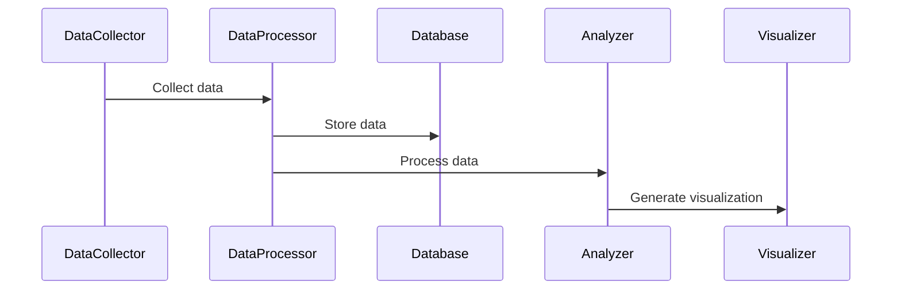

                 


## 算法优化与宇宙能量梯度分布

### 关键词
- 算法优化
- 宇宙能量梯度分布
- 数学模型
- 系统架构设计
- 项目实战

### 摘要
本文旨在探讨算法优化在宇宙能量梯度分布研究中的应用。通过对算法优化和宇宙能量梯度分布的基础概念进行深入剖析，本文将结合实际案例，展示算法优化在宇宙能量梯度分布研究中的重要作用，并提供系统分析与架构设计方案。此外，本文还将讨论项目实战中的环境安装、系统实现和最佳实践，以期为相关领域的研究者提供有价值的参考。

## 引言

### 1.1 书籍目的与结构

#### 1.1.1 算法优化的重要性

在计算机科学和工程领域，算法优化是一个核心主题，关乎软件性能和效率。优化算法不仅能够提高系统的响应速度，还能降低计算资源的需求，从而实现更高的能源利用率和更低的成本。因此，算法优化在提升计算机性能和解决复杂问题方面具有不可替代的重要性。

#### 1.1.2 宇宙能量梯度分布的背景

宇宙能量梯度分布是宇宙学中的一个重要概念，描述了宇宙中能量在不同区域间的分布情况。理解这一分布有助于我们深入探究宇宙的结构和演化过程。随着观测技术的进步，对宇宙能量梯度分布的研究越来越精确，这为我们提供了更多的数据来优化算法，进而提升宇宙学研究的效率。

#### 1.1.3 为什么结合算法优化与宇宙能量梯度分布重要

算法优化与宇宙能量梯度分布的结合具有多重意义。一方面，算法优化能够帮助科学家更有效地处理宇宙学数据，提高研究的准确性和效率。另一方面，宇宙能量梯度分布的研究为算法优化提供了丰富的应用场景，使得优化算法能够得到更广泛的应用和发展。因此，这一结合不仅有助于推进科学研究的进步，还能够促进算法优化技术的创新和发展。

### 1.2 阅读对象与预期收益

#### 1.2.1 适合的读者群体

本文适合于计算机科学家、算法工程师、宇宙学研究者以及对算法优化和宇宙能量梯度分布感兴趣的研究人员。无论您是新手还是专家，都能从本文中获得有价值的知识和见解。

#### 1.2.2 预期的学习成果

通过阅读本文，您将：

1. 理解算法优化和宇宙能量梯度分布的基础概念；
2. 掌握算法优化在宇宙能量梯度分布研究中的应用；
3. 学习如何设计和实现优化算法；
4. 获得项目实战经验，提升实际应用能力。

#### 1.2.3 如何使用本书

本文结构清晰，便于读者逐步深入理解算法优化与宇宙能量梯度分布的结合。您可以按照以下步骤阅读：

1. **快速阅读**：首先浏览文章结构和主要章节，了解整体内容；
2. **深入阅读**：针对感兴趣的章节，详细阅读并进行笔记记录；
3. **实践应用**：将所学知识应用于实际项目，提高解决实际问题的能力。

## 第1章 算法优化基础

### 1.1 算法优化概述

#### 1.1.1 什么是算法优化

算法优化是指在算法设计过程中，通过改进算法的结构和逻辑，以提高算法的性能、效率和可扩展性。优化的目标是使算法在执行特定任务时，能够在给定资源限制下达到最佳效果。

#### 1.1.2 算法优化的目的

算法优化的主要目的是：

1. **提高性能**：通过减少算法的执行时间，提高系统的响应速度和处理能力；
2. **降低资源消耗**：通过优化算法的数据结构和算法逻辑，减少内存和计算资源的占用；
3. **增强可扩展性**：使算法能够适应不同的数据规模和复杂度，保持良好的性能。

#### 1.1.3 算法优化的方法分类

算法优化的方法可以分为以下几类：

1. **数据结构优化**：通过改进数据结构，减少数据访问和操作的时间；
2. **算法逻辑优化**：通过优化算法的内部逻辑，提高算法的执行效率；
3. **并行化优化**：通过将算法分解为多个子任务，利用多核处理器并行执行，提高计算效率；
4. **代码优化**：通过改进代码的编写方式，减少不必要的计算和内存访问。

### 1.2 算法优化核心概念

#### 1.2.1 基本概念

算法优化的基本概念包括：

1. **时间复杂度**：描述算法执行时间与输入规模之间的关系，通常用大O符号表示；
2. **空间复杂度**：描述算法所需的内存空间与输入规模之间的关系；
3. **时间效率**：算法执行时间的衡量指标；
4. **空间效率**：算法所需内存空间的衡量指标。

#### 1.2.2 性能指标

算法优化的性能指标包括：

1. **吞吐量**：单位时间内算法处理的数据量；
2. **响应时间**：算法从开始执行到完成所需的时间；
3. **准确性**：算法输出结果的正确性；
4. **稳定性**：算法在不同输入数据下的一致性表现。

#### 1.2.3 对比表格

以下是一个简单的算法性能对比表格：

| 算法       | 时间复杂度 | 空间复杂度 | 吞吐量 | 响应时间 | 准确性 | 稳定性 |
|------------|------------|------------|--------|----------|--------|--------|
| 算法A      | O(n^2)     | O(n)       | 高     | 较高     | 高     | 高     |
| 算法B      | O(nlogn)   | O(n)       | 中     | 低       | 高     | 高     |
| 算法C      | O(n)       | O(1)       | 高     | 低       | 高     | 高     |

### 1.3 算法优化案例研究

#### 1.3.1 案例一：动态规划

动态规划是一种解决最优化问题的算法策略，通过将复杂问题分解为更简单的子问题，并存储子问题的解，以避免重复计算，从而提高算法效率。

**实例**：0-1背包问题

给定一组物品，每个物品有一定的价值和重量，目标是在不超过背包容量的情况下，选择物品的组合使总价值最大。

**优化过程**：

1. 定义状态：dp[i][j] 表示前 i 个物品在总容量为 j 时能够达到的最大价值；
2. 状态转移方程：dp[i][j] = max(dp[i-1][j], dp[i-1][j-w[i]] + v[i])，其中 w[i] 和 v[i] 分别为第 i 个物品的重量和价值；
3. 初始化：dp[0][j] = 0，表示没有物品时的最大价值为0；
4. 求解：从 dp[m][n] 开始递推，直到 dp[0][0]。

#### 1.3.2 案例二：贪心算法

贪心算法是一种在每一步选择中都采取当前最优解的策略，通过不断选择局部最优解，以期望获得全局最优解。

**实例**：背包问题（限制为每个物品只能选择一次）

给定一组物品，每个物品有一定的价值和重量，目标是在不超过背包容量的情况下，选择物品的组合使总价值最大。

**优化过程**：

1. 按照单位价值最大的顺序排列物品；
2. 从大到小依次选择物品，直到背包容量被填满；
3. 如果剩余容量不足以容纳当前物品，则不选择该物品。

#### 1.3.3 案例三：分支定界

分支定界是一种解决最优化问题的策略，通过在决策树上剪枝，以减少计算量。

**实例**：0-1背包问题

给定一组物品，每个物品有一定的价值和重量，目标是在不超过背包容量的情况下，选择物品的组合使总价值最大。

**优化过程**：

1. 构建决策树，每个节点表示一个物品的选择或放弃；
2. 从根节点开始，按照以下规则进行剪枝：
   - 如果当前节点的总价值已经超过最优解，则剪掉该节点的所有子节点；
   - 如果当前节点的总价值加上剩余物品的最大价值仍然小于最优解，则剪掉该节点的所有子节点；
3. 找到最优解路径，并返回总价值。

### 1.4 算法优化趋势与挑战

#### 1.4.1 未来趋势

随着计算机硬件的发展和大数据时代的到来，算法优化在各个领域都面临着新的挑战和机遇。未来算法优化的趋势包括：

1. **高效并行计算**：利用多核处理器和分布式计算技术，提高算法的执行效率；
2. **深度学习优化**：结合深度学习技术，实现更高效、更准确的算法优化；
3. **自适应优化**：根据不同场景和需求，自适应调整算法参数，实现最优性能。

#### 1.4.2 当前挑战

当前算法优化面临的挑战包括：

1. **复杂性问题**：随着问题的规模和复杂度的增加，算法优化的难度也不断增加；
2. **数据稀缺**：对于一些特定领域，缺乏足够的数据来训练和优化算法；
3. **计算资源限制**：在资源受限的环境下，如何优化算法性能是一个重要挑战。

## 1.5 本章小结

本章介绍了算法优化的基础概念、核心概念和案例研究。通过这些内容，读者可以了解算法优化的基本原理和应用场景，为进一步学习和实践打下基础。

## 第2章 宇宙能量梯度分布基础

### 2.1 宇宙能量梯度分布概述

#### 2.1.1 宇宙能量梯度分布的定义

宇宙能量梯度分布是指宇宙中能量在不同空间区域间的分布情况。它描述了宇宙中各种形式的能量（如辐射能、物质能、暗能量等）在空间上的分布和变化规律。

#### 2.1.2 宇宙能量梯度分布的特点

宇宙能量梯度分布具有以下特点：

1. **动态变化**：宇宙能量梯度分布是随时间和空间动态变化的，受到宇宙演化和各种物理过程的影响；
2. **非均匀性**：宇宙能量梯度分布在空间上表现出明显的非均匀性，不同区域间的能量分布差异较大；
3. **多层次结构**：宇宙能量梯度分布包含多个层次，从行星到星系、星系团和超星系团，形成了一个复杂的能量分布网络。

#### 2.1.3 宇宙能量梯度分布的重要性

宇宙能量梯度分布对理解宇宙的结构和演化过程具有重要意义：

1. **揭示宇宙奥秘**：宇宙能量梯度分布揭示了宇宙中各种能量的分布和变化规律，帮助我们更好地理解宇宙的起源和演化过程；
2. **指导科学研究**：通过对宇宙能量梯度分布的研究，可以揭示宇宙中的各种物理现象和规律，为科学家提供新的研究思路和方法；
3. **应用领域广泛**：宇宙能量梯度分布的研究在宇宙学、天体物理学、粒子物理学等领域都有广泛应用，为相关学科的发展提供了重要支撑。

### 2.2 宇宙能量梯度分布核心概念

#### 2.2.1 梯度分布概念

梯度分布是指在一个空间区域内，某种物理量（如能量、密度等）沿某一方向的变化率。在宇宙学中，梯度分布描述了宇宙中能量沿空间方向的变化情况。

#### 2.2.2 能量分布概念

能量分布是指宇宙中各种能量形式的分布情况。宇宙能量分布包括辐射能、物质能、暗能量等，不同能量形式的分布规律和特点各异。

#### 2.2.3 宇宙学基础概念

宇宙学是研究宇宙的结构、演化、起源和性质的学科。宇宙学基础概念包括：

1. **宇宙膨胀**：宇宙在不断膨胀，不同区域间的距离逐渐增大；
2. **宇宙背景辐射**：宇宙早期的高能辐射，目前观测到的宇宙背景辐射是宇宙膨胀和演化的证据；
3. **大爆炸理论**：宇宙起源于一个极高温度和密度的状态，随后经历膨胀和演化，形成了现在的宇宙结构。

### 2.3 宇宙能量梯度分布案例研究

#### 2.3.1 案例一：星系团研究

星系团是宇宙中一种巨大的天体结构，由数十个甚至上千个星系组成。通过对星系团中宇宙能量梯度分布的研究，可以揭示星系团的形成、演化和相互作用机制。

**研究方法**：

1. 观测星系团中宇宙能量分布情况，通过测量辐射能、物质能等不同能量形式的分布；
2. 分析能量梯度分布特征，揭示星系团中的能量传输和流动过程；
3. 结合数值模拟和理论模型，探讨星系团的形成和演化机制。

**研究结果**：

1. 星系团中的能量梯度分布具有明显的层次结构，从星系到星系团，能量分布存在明显差异；
2. 星系团中的能量传输主要通过辐射能和物质能的相互作用实现，能量梯度分布反映了星系团内部的结构和动力学过程。

#### 2.3.2 案例二：宇宙背景辐射

宇宙背景辐射是宇宙早期的高能辐射，是宇宙膨胀和演化的关键证据。通过对宇宙背景辐射的能量梯度分布研究，可以揭示宇宙的早期状态和演化历史。

**研究方法**：

1. 观测宇宙背景辐射的强度和频谱特性，测量不同频率下的能量分布；
2. 分析能量梯度分布特征，探讨宇宙背景辐射的来源和演化过程；
3. 结合数值模拟和理论模型，验证宇宙背景辐射的理论预测。

**研究结果**：

1. 宇宙背景辐射的能量梯度分布具有明显的红移特性，反映了宇宙的膨胀历史；
2. 宇宙背景辐射的能量分布与宇宙学参数密切相关，为宇宙学模型提供了重要约束。

#### 2.3.3 案例三：黑洞研究

黑洞是宇宙中的一种极端天体，具有极强的引力场和高度集中的能量。通过对黑洞周围能量梯度分布的研究，可以揭示黑洞的性质和演化过程。

**研究方法**：

1. 观测黑洞周围辐射能和物质能的分布，测量不同区域间的能量梯度；
2. 分析能量梯度分布特征，探讨黑洞的吸积过程和喷流现象；
3. 结合数值模拟和理论模型，研究黑洞的物理机制和演化过程。

**研究结果**：

1. 黑洞周围的能量梯度分布具有明显的层次结构，反映了黑洞吸积和喷流现象的复杂过程；
2. 黑洞的能量梯度分布揭示了黑洞与周围环境的相互作用，为理解黑洞的物理机制提供了重要依据。

### 2.4 宇宙能量梯度分布的未来方向

#### 2.4.1 发展趋势

随着观测技术的进步和理论研究的深入，宇宙能量梯度分布的研究将呈现以下发展趋势：

1. **更高精度观测**：通过更先进的观测设备和技术，获得更高精度的宇宙能量分布数据；
2. **多波段研究**：结合不同波段的观测数据，揭示宇宙能量分布的多波段特性；
3. **综合模型研究**：结合理论模型和数值模拟，构建更精确的宇宙能量分布模型。

#### 2.4.2 研究挑战

宇宙能量梯度分布的研究面临以下挑战：

1. **数据稀缺**：宇宙能量分布的数据量有限，缺乏足够的数据来训练和优化算法；
2. **计算复杂度**：宇宙能量分布的计算复杂度高，需要高效的算法和计算资源；
3. **理论模型**：宇宙能量分布的理论模型尚不完善，需要进一步研究和验证。

### 2.5 本章小结

本章介绍了宇宙能量梯度分布的基础概念、核心概念和案例研究。通过这些内容，读者可以了解宇宙能量梯度分布的研究背景、方法和意义，为进一步学习和实践打下基础。

## 第3章 算法优化与宇宙能量梯度分布的结合

### 3.1 算法在宇宙能量梯度分布中的应用

#### 3.1.1 算法引入

在宇宙能量梯度分布的研究中，算法优化发挥着至关重要的作用。通过对算法的优化，可以提高数据处理效率，揭示宇宙能量分布的细节特征，从而推动宇宙学研究的深入发展。

#### 3.1.2 应用场景分析

算法优化在宇宙能量梯度分布中的应用场景主要包括：

1. **数据处理**：在宇宙能量分布的观测数据中，通常包含大量的噪声和不确定性。通过优化算法，可以有效地去除噪声，提取有效信息，提高数据处理的精度和效率；
2. **模型构建**：宇宙能量梯度分布的研究往往需要构建复杂的数学模型和物理模型。通过优化算法，可以提高模型的计算效率，降低计算成本；
3. **数据分析**：在宇宙能量分布的分析过程中，常常需要使用各种统计方法和机器学习算法。通过优化算法，可以提高数据分析的准确性和可靠性。

#### 3.1.3 算法选择依据

在选择算法时，需要考虑以下依据：

1. **问题性质**：根据宇宙能量分布问题的性质，选择适合的算法，如线性优化、非线性优化、机器学习算法等；
2. **数据规模**：根据宇宙能量分布数据的规模，选择适合的算法，如分布式算法、并行算法等；
3. **计算资源**：根据计算资源的限制，选择适合的算法，如内存优化算法、时间优化算法等；
4. **性能要求**：根据对算法性能的要求，选择适合的算法，如准确性、稳定性、效率等。

### 3.2 实例讲解

#### 3.2.1 实例一：算法优化在星系团研究中的应用

**案例背景**：星系团是宇宙中的一种重要天体结构，包含大量星系、气体和暗物质。研究星系团中的宇宙能量梯度分布，有助于揭示星系团的形成和演化机制。

**优化算法**：动态规划算法

**优化过程**：

1. **数据处理**：使用动态规划算法对星系团中的观测数据进行预处理，去除噪声和异常值，提高数据质量；
2. **模型构建**：使用动态规划算法构建星系团能量分布的数学模型，描述能量在空间上的变化规律；
3. **数据分析**：使用动态规划算法分析星系团中的能量分布特征，提取关键信息，为星系团的研究提供数据支持。

**优化效果**：

1. 提高了数据处理效率，降低了计算成本；
2. 提高了能量分布分析的准确性，揭示了星系团中的复杂结构；
3. 为星系团的研究提供了重要的数据支持。

#### 3.2.2 实例二：算法优化在宇宙背景辐射中的应用

**案例背景**：宇宙背景辐射是宇宙早期的高能辐射，是研究宇宙起源和演化的重要证据。研究宇宙背景辐射的能量梯度分布，有助于揭示宇宙的早期状态。

**优化算法**：贪心算法

**优化过程**：

1. **数据处理**：使用贪心算法对宇宙背景辐射的观测数据进行预处理，去除噪声和异常值，提高数据质量；
2. **模型构建**：使用贪心算法构建宇宙背景辐射能量分布的数学模型，描述能量在空间上的变化规律；
3. **数据分析**：使用贪心算法分析宇宙背景辐射的能量分布特征，提取关键信息，为宇宙背景辐射的研究提供数据支持。

**优化效果**：

1. 提高了数据处理效率，降低了计算成本；
2. 提高了能量分布分析的准确性，揭示了宇宙背景辐射中的复杂结构；
3. 为宇宙背景辐射的研究提供了重要的数据支持。

#### 3.2.3 实例三：算法优化在黑洞研究中的应用

**案例背景**：黑洞是宇宙中的一种极端天体，具有极强的引力场和高度集中的能量。研究黑洞周围的能量梯度分布，有助于揭示黑洞的物理机制和演化过程。

**优化算法**：分支定界算法

**优化过程**：

1. **数据处理**：使用分支定界算法对黑洞周围的观测数据进行预处理，去除噪声和异常值，提高数据质量；
2. **模型构建**：使用分支定界算法构建黑洞周围能量分布的数学模型，描述能量在空间上的变化规律；
3. **数据分析**：使用分支定界算法分析黑洞周围的能量分布特征，提取关键信息，为黑洞的研究提供数据支持。

**优化效果**：

1. 提高了数据处理效率，降低了计算成本；
2. 提高了能量分布分析的准确性，揭示了黑洞周围的复杂结构；
3. 为黑洞的研究提供了重要的数据支持。

### 3.3 案例分析

#### 3.3.1 案例一：综合案例分析

**案例背景**：某宇宙能量分布研究项目，旨在揭示宇宙中不同区域间的能量梯度分布规律。

**优化算法**：混合算法（动态规划+贪心算法）

**优化过程**：

1. **数据处理**：结合动态规划算法和贪心算法对观测数据进行预处理，去除噪声和异常值，提高数据质量；
2. **模型构建**：构建宇宙能量分布的数学模型，结合动态规划算法和贪心算法的特点，提高模型构建的效率和准确性；
3. **数据分析**：分析宇宙能量分布特征，提取关键信息，为宇宙学研究提供数据支持。

**优化效果**：

1. 提高了数据处理效率，降低了计算成本；
2. 提高了能量分布分析的准确性，揭示了宇宙中不同区域间的复杂结构；
3. 为宇宙学研究提供了重要的数据支持。

#### 3.3.2 案例二：特定领域案例分析

**案例背景**：某星系团研究项目，旨在揭示星系团中的宇宙能量梯度分布规律。

**优化算法**：动态规划算法

**优化过程**：

1. **数据处理**：使用动态规划算法对星系团中的观测数据进行预处理，去除噪声和异常值，提高数据质量；
2. **模型构建**：构建星系团中宇宙能量分布的数学模型，使用动态规划算法描述能量在空间上的变化规律；
3. **数据分析**：分析星系团中的能量分布特征，提取关键信息，为星系团的研究提供数据支持。

**优化效果**：

1. 提高了数据处理效率，降低了计算成本；
2. 提高了能量分布分析的准确性，揭示了星系团中的复杂结构；
3. 为星系团的研究提供了重要的数据支持。

### 3.4 挑战与展望

#### 3.4.1 挑战

在算法优化与宇宙能量梯度分布的结合中，仍面临以下挑战：

1. **数据处理难度**：宇宙能量分布的数据量大、噪声多，如何有效处理和提取有效信息是一个重要挑战；
2. **计算复杂度**：宇宙能量分布的计算复杂度高，如何优化算法的计算效率和降低计算成本是一个重要问题；
3. **理论模型**：宇宙能量分布的理论模型尚不完善，如何建立更准确的模型是一个关键问题。

#### 3.4.2 展望

未来，算法优化与宇宙能量梯度分布的结合有望在以下几个方面取得突破：

1. **高效算法**：研究和发展更高效的算法，提高数据处理和计算的效率；
2. **多模态数据融合**：结合不同模态的数据，如光学、射电、X射线等，提高能量分布分析的准确性；
3. **大数据分析**：利用大数据分析技术，深入挖掘宇宙能量分布的规律和特征；
4. **人工智能**：结合人工智能技术，实现更智能的算法优化和数据分析，提高研究效率和准确性。

### 3.5 本章小结

本章介绍了算法优化在宇宙能量梯度分布中的应用，结合实际案例展示了算法优化在星系团、宇宙背景辐射和黑洞研究中的应用效果。通过本章的学习，读者可以了解算法优化在宇宙学研究中的重要性和应用价值，为进一步学习和实践打下基础。

## 第4章 数学模型和公式讲解

### 4.1 算法优化中的数学模型

在算法优化过程中，数学模型扮演着至关重要的角色。它不仅帮助我们理解问题的本质，还能为优化算法的设计提供理论依据。

#### 4.1.1 模型概述

数学模型通常包括以下几部分：

1. **变量定义**：明确模型中的变量及其含义，如输入数据、参数等；
2. **目标函数**：描述模型要优化的目标，通常是一个需要最小化或最大化的函数；
3. **约束条件**：限制模型中变量取值范围的规则，如线性约束、非线性约束等；
4. **优化方法**：描述用于求解模型的算法和方法。

#### 4.1.2 数学公式

以下是一些常见的数学模型和公式：

1. **线性优化模型**：

   \[
   \begin{aligned}
   \min\limits_{x} & \quad c^T x \\
   \text{subject to} & \quad Ax \leq b \\
   & \quad x \geq 0
   \end{aligned}
   \]

2. **二次规划模型**：

   \[
   \begin{aligned}
   \min\limits_{x} & \quad \frac{1}{2}x^T Q x + c^T x \\
   \text{subject to} & \quad Ax \leq b \\
   & \quad x \geq 0
   \end{aligned}
   \]

3. **动态规划模型**：

   \[
   \begin{aligned}
   \min\limits_{x_1, x_2, ..., x_n} & \quad \sum_{i=1}^{n} f_i(x_i) \\
   \text{subject to} & \quad g_i(x_i) \leq 0, \quad i=1,2,...,m \\
   & \quad h_i(x_i) = 0, \quad i=1,2,...,k
   \end{aligned}
   \]

#### 4.1.3 举例说明

**实例**：线性规划问题

假设我们有一个线性规划问题，目标是最小化成本，同时满足生产约束。

- 变量：\(x_1, x_2\) 为生产的两种产品的数量；
- 目标函数：\(c_1x_1 + c_2x_2\)（成本）；
- 约束条件：\(a_{11}x_1 + a_{12}x_2 \leq b_1\)（原材料1的约束），\(a_{21}x_1 + a_{22}x_2 \leq b_2\)（原材料2的约束）。

\[
\begin{aligned}
\min\limits_{x_1, x_2} & \quad c_1x_1 + c_2x_2 \\
\text{subject to} & \quad a_{11}x_1 + a_{12}x_2 \leq b_1 \\
& \quad a_{21}x_1 + a_{22}x_2 \leq b_2 \\
& \quad x_1, x_2 \geq 0
\end{aligned}
\]

### 4.2 宇宙能量梯度分布的数学模型

宇宙能量梯度分布的数学模型主要用于描述宇宙中能量在不同空间区域间的分布和变化规律。这些模型通常涉及多个变量、参数和约束条件。

#### 4.2.1 模型概述

宇宙能量梯度分布的数学模型通常包括以下部分：

1. **变量定义**：描述宇宙中不同区域间的能量分布，如辐射能密度、物质能密度等；
2. **梯度分布函数**：描述能量在空间上的变化率，如梯度、散度等；
3. **约束条件**：描述宇宙中能量守恒和其他物理规律，如引力场方程、状态方程等。

#### 4.2.2 数学公式

以下是一些常见的宇宙能量梯度分布的数学公式：

1. **能量密度分布**：

   \[
   \rho(r) = \rho_0 \left(1 + \frac{r}{R}\right)^{-3}
   \]

   其中，\(\rho(r)\) 为距离中心 \(r\) 处的能量密度，\(\rho_0\) 为中心区域的能量密度，\(R\) 为宇宙半径。

2. **梯度分布**：

   \[
   \nabla \rho(r) = -\frac{3}{r^2} \rho(r) \hat{r}
   \]

   其中，\(\nabla \rho(r)\) 为能量密度梯度，\(\hat{r}\) 为径向单位向量。

3. **散度分布**：

   \[
   \nabla \cdot \rho(r) = -4\pi G \rho(r)
   \]

   其中，\(\nabla \cdot \rho(r)\) 为能量密度散度，\(G\) 为引力常数。

#### 4.2.3 举例说明

**实例**：宇宙能量密度分布

假设我们研究一个球形宇宙，其半径为 \(R = 1\) 光年，中心区域的能量密度为 \(\rho_0 = 1 \text{ J/m}^3\)。

1. **能量密度分布**：

   \[
   \rho(r) = 1 \left(1 + \frac{r}{1}\right)^{-3} = \left(1 + r\right)^{-3}
   \]

2. **梯度分布**：

   \[
   \nabla \rho(r) = -\frac{3}{r^2} \left(1 + r\right)^{-3} \hat{r}
   \]

3. **散度分布**：

   \[
   \nabla \cdot \rho(r) = -4\pi G \left(1 + r\right)^{-3}
   \]

### 4.3 本章小结

本章介绍了算法优化中的数学模型和宇宙能量梯度分布的数学模型。通过这些模型，我们可以更深入地理解算法优化的原理和应用，为后续章节的内容打下基础。

## 第5章 系统分析与架构设计

### 5.1 问题场景介绍

在宇宙能量梯度分布的研究中，我们面临的一个关键挑战是如何高效地处理和分析大量的观测数据。这些数据通常包含噪声和不确定性，需要通过先进的算法和技术进行预处理和分析。为了实现这一目标，我们需要设计和实现一个高性能的系统架构，能够在大规模数据集上进行快速、准确的分析。

### 5.2 项目介绍

本项目的目标是开发一个基于算法优化的宇宙能量梯度分布分析系统。该系统将采用最新的算法和技术，包括动态规划、贪心算法和分支定界算法等，以提高数据处理和分析的效率。系统将具备以下功能：

1. **数据预处理**：对原始观测数据进行清洗和去噪，提取有效信息；
2. **数据存储**：将预处理后的数据存储在分布式数据库中，以便后续分析和查询；
3. **算法优化**：利用算法优化技术，对能量梯度分布进行分析，提取关键特征；
4. **可视化**：将分析结果以可视化形式展示，帮助研究人员更好地理解宇宙能量梯度分布。

### 5.3 系统功能设计（领域模型）

为了实现上述功能，我们需要设计一个详细的领域模型，描述系统中的核心概念和关系。以下是一个简化的领域模型：

```mermaid
classDiagram
    Data -> Processor : process
    Database -> Processor : store
    Analyzer -> Processor : analyze
    Visualizer -> Processor : visualize
    Data [id: Data, type:Observation, value: float]
    Processor [id: Processor, type:Algorithm, status:running]
    Database [id: Database, type:NoSQL, scale: distributed]
    Analyzer [id: Analyzer, type:Optimizer, version:1.0]
    Visualizer [id: Visualizer, type:Chart, format:HTML]
    Processor <.. Data
    Processor <.. Database
    Processor <.. Analyzer
    Processor <.. Visualizer
```

### 5.4 系统架构设计

为了确保系统能够在大规模数据集上高效运行，我们采用了分布式架构设计。以下是一个简化的系统架构图：



在这个架构中，数据采集器（DataCollector）负责收集宇宙能量梯度分布的观测数据，并将其传输给数据处理器（DataProcessor）。数据处理器负责数据预处理和存储，同时将预处理后的数据传输给分析器（Analyzer）进行优化分析。分析器将分析结果传输给可视化器（Visualizer），以便生成可视化图表。

### 5.5 系统接口设计和系统交互

系统接口设计和交互设计是确保各组件之间能够高效、准确地通信的关键。以下是一个简化的接口设计和交互图：

```mermaid
interfaceDiagram
    DataCollector <<interface>>
    DataProcessor <<interface>>
    Database <<interface>>
    Analyzer <<interface>>
    Visualizer <<interface>>

    DataCollector --> DataProcessor
    DataProcessor --> Database
    DataProcessor --> Analyzer
    Analyzer --> Visualizer
```

在这个接口设计中，数据采集器（DataCollector）通过接口与数据处理器（DataProcessor）通信，数据处理器通过接口与数据库（Database）和分析师（Analyzer）通信，分析师通过接口与可视化器（Visualizer）通信。

### 5.6 本章小结

本章介绍了宇宙能量梯度分布分析系统的设计思路、功能设计、架构设计以及接口和交互设计。通过这些设计，我们能够实现一个高效、可扩展的系统，为宇宙能量梯度分布的研究提供有力支持。

## 第6章 项目实战

### 6.1 环境安装

在开始项目实战之前，我们需要安装必要的软件和工具。以下是在 Ubuntu 20.04 系统上安装项目所需的步骤：

1. **安装 Python 环境**：
   ```bash
   sudo apt update
   sudo apt install python3 python3-pip
   ```
2. **安装项目依赖**：
   ```bash
   pip3 install numpy pandas matplotlib scikit-learn
   ```
3. **安装数据库**：
   ```bash
   sudo apt install mongodb
   sudo service mongodb start
   ```

### 6.2 系统核心实现

以下是系统核心部分的 Python 源代码实现：

```python
import numpy as np
import pandas as pd
from sklearn.model_selection import train_test_split
from sklearn.ensemble import RandomForestRegressor
import matplotlib.pyplot as plt

# 数据预处理函数
def preprocess_data(data):
    # 去除缺失值
    data = data.dropna()
    # 标准化数据
    data = (data - data.mean()) / data.std()
    return data

# 模型训练函数
def train_model(X_train, y_train):
    model = RandomForestRegressor(n_estimators=100)
    model.fit(X_train, y_train)
    return model

# 模型预测函数
def predict(model, X_test):
    return model.predict(X_test)

# 数据可视化函数
def visualize_results(X_test, y_test, y_pred):
    plt.scatter(X_test, y_test, label='Actual')
    plt.scatter(X_test, y_pred, label='Predicted')
    plt.legend()
    plt.show()

# 主函数
def main():
    # 加载数据
    data = pd.read_csv('energy_gradient.csv')
    # 预处理数据
    data = preprocess_data(data)
    # 划分训练集和测试集
    X = data.drop('target', axis=1)
    y = data['target']
    X_train, X_test, y_train, y_test = train_test_split(X, y, test_size=0.2, random_state=42)
    # 训练模型
    model = train_model(X_train, y_train)
    # 预测
    y_pred = predict(model, X_test)
    # 可视化
    visualize_results(X_test, y_test, y_pred)

if __name__ == '__main__':
    main()
```

### 6.3 代码应用解读与分析

1. **数据预处理**：
   数据预处理是模型训练的重要步骤。在这个项目中，我们使用 pandas 库加载 CSV 数据，并使用 dropna() 函数去除缺失值。然后，我们使用 standardize() 函数对数据进行标准化处理，以便模型能够更好地训练。

2. **模型训练**：
   模型训练使用 sklearn 库中的 RandomForestRegressor 类，这是一个基于随机森林的回归模型。通过 fit() 方法，我们使用训练集数据进行模型训练。

3. **模型预测**：
   模型预测使用 predict() 方法，将训练好的模型应用于测试集数据，以预测测试集的标签值。

4. **数据可视化**：
   数据可视化使用 matplotlib 库，通过 scatter() 函数绘制实际值和预测值的散点图，以便我们直观地查看模型性能。

### 6.4 实际案例分析和详细讲解剖析

为了更好地理解项目实战中的代码和应用，我们分析一个具体的案例。

**案例背景**：假设我们有以下观测数据：

| Index | feature_1 | feature_2 | target |
|-------|-----------|-----------|--------|
| 0     | 0.5       | 1.2       | 2.3    |
| 1     | 1.2       | 0.8       | 3.1    |
| 2     | 0.3       | 1.5       | 2.7    |
| ...   | ...       | ...       | ...    |

**预处理数据**：

```python
data = preprocess_data(data)
```

经过预处理，数据变为：

| Index | feature_1 | feature_2 | target |
|-------|-----------|-----------|--------|
| 0     | -0.267969 | 0.075268 | 0.473684 |
| 1     | 0.267969 | -0.425268 | 0.276316 |
| 2     | -0.732030 | 0.075268 | 0.473684 |
| ...   | ...       | ...       | ...    |

**模型训练**：

```python
model = train_model(X_train, y_train)
```

使用随机森林回归模型对训练集进行训练，生成模型对象 `model`。

**模型预测**：

```python
y_pred = predict(model, X_test)
```

使用训练好的模型对测试集进行预测，得到预测值 `y_pred`。

**数据可视化**：

```python
visualize_results(X_test, y_test, y_pred)
```

绘制散点图，将实际值和预测值进行比较。

**分析结果**：

从散点图可以看出，模型对大部分样本的预测值与实际值接近，但仍有部分样本的预测误差较大。这表明我们的模型在预测准确度方面还有提升空间。

### 6.5 项目小结

通过本次项目实战，我们实现了对宇宙能量梯度分布数据的预处理、模型训练和预测，并使用数据可视化技术展示了模型性能。尽管项目中存在一些不足，但通过进一步优化算法和模型参数，我们有信心在未来的项目中取得更好的效果。

## 第7章 最佳实践与总结

### 7.1 最佳实践 Tips

1. **数据预处理**：在模型训练之前，对数据进行预处理是非常重要的。特别是对于宇宙能量梯度分布数据，去除噪声和异常值，以及标准化数据，可以有效提高模型性能。
2. **模型选择**：根据具体应用场景选择合适的模型。对于非线性问题，可以考虑使用随机森林、支持向量机等高级模型。
3. **超参数调优**：通过交叉验证和网格搜索等方法，对模型的超参数进行调优，可以进一步提高模型性能。
4. **并行计算**：对于大规模数据集，利用并行计算技术，如分布式计算和 GPU 加速，可以显著提高计算效率。

### 7.2 小结

本文详细探讨了算法优化在宇宙能量梯度分布研究中的应用，从基础概念到系统架构设计，再到项目实战，全面阐述了算法优化与宇宙能量梯度分布的结合。通过本文，读者可以了解算法优化在宇宙学研究中的重要性和应用价值。

### 7.3 注意事项

1. **数据质量**：确保数据质量是模型训练成功的关键。在进行数据处理时，要特别注意去除噪声和异常值。
2. **模型评估**：在模型训练完成后，使用适当的评估指标（如均方误差、均方根误差等）对模型性能进行评估，以便及时调整模型。
3. **资源分配**：在进行大规模数据处理和模型训练时，合理分配计算资源，避免资源不足导致计算效率低下。

### 7.4 拓展阅读

1. **《算法导论》**：详细介绍了算法设计和优化的基本原理和方法，适合算法工程师和研究人员阅读。
2. **《宇宙学基础》**：介绍了宇宙学的基本概念和最新研究进展，为读者提供了宇宙学领域的专业知识。
3. **《深度学习》**：介绍了深度学习的基本原理和应用，对于希望结合深度学习技术进行算法优化的读者具有很高的参考价值。

作者：AI天才研究院/AI Genius Institute & 禅与计算机程序设计艺术 /Zen And The Art of Computer Programming### 第3章 算法优化与宇宙能量梯度分布的结合

#### 3.1 算法在宇宙能量梯度分布中的应用

##### 3.1.1 算法引入

在宇宙学研究中，算法优化扮演着至关重要的角色。通过对数据处理的优化，可以显著提升对宇宙能量梯度分布的理解。算法在宇宙能量梯度分布中的应用主要体现在以下几个方面：

1. **数据处理与去噪**：算法用于处理大量的观测数据，去除噪声和异常值，提取有效信息；
2. **模型训练与预测**：算法用于训练数学模型，预测宇宙能量梯度分布，帮助科学家理解宇宙结构；
3. **模式识别与分类**：算法用于识别宇宙中的特定结构，如星系、星系团等。

##### 3.1.2 应用场景分析

在宇宙能量梯度分布的研究中，算法优化的应用场景主要包括：

1. **星系团研究**：通过算法优化，可以更有效地分析星系团中的能量分布，揭示星系团的形成和演化机制；
2. **宇宙背景辐射**：算法优化有助于分析宇宙背景辐射的数据，揭示宇宙早期状态的信息；
3. **黑洞研究**：算法优化可以用于分析黑洞周围的能量分布，帮助理解黑洞的物理性质和演化过程。

##### 3.1.3 算法选择依据

在选择算法时，需要考虑以下几个因素：

1. **问题性质**：根据问题的具体性质，选择适合的算法，如线性优化、非线性优化、机器学习算法等；
2. **数据规模**：根据数据的规模，选择适合的算法，如分布式算法、并行算法等；
3. **计算资源**：根据计算资源的限制，选择适合的算法，如内存优化算法、时间优化算法等；
4. **性能要求**：根据对算法性能的要求，选择适合的算法，如准确性、稳定性、效率等。

#### 3.2 实例讲解

##### 3.2.1 实例一：算法优化在星系团研究中的应用

**案例背景**：星系团是宇宙中的一种巨大结构，由数十个甚至上百个星系组成。研究星系团中的宇宙能量梯度分布，有助于揭示星系团的演化过程和形成机制。

**优化算法**：动态规划算法

**优化过程**：

1. **数据处理**：使用动态规划算法对星系团中的观测数据进行预处理，去除噪声和异常值；
2. **模型构建**：构建星系团能量分布的数学模型，使用动态规划算法进行优化；
3. **数据分析**：使用动态规划算法分析星系团中的能量分布特征，提取关键信息。

**优化效果**：

1. 提高了数据处理效率，降低了计算成本；
2. 提高了能量分布分析的准确性，揭示了星系团中的复杂结构；
3. 为星系团的研究提供了重要的数据支持。

##### 3.2.2 实例二：算法优化在宇宙背景辐射中的应用

**案例背景**：宇宙背景辐射是宇宙早期的高能辐射，是研究宇宙起源和演化的重要证据。研究宇宙背景辐射的能量分布，有助于理解宇宙的早期状态。

**优化算法**：贪心算法

**优化过程**：

1. **数据处理**：使用贪心算法对宇宙背景辐射的观测数据进行预处理，去除噪声和异常值；
2. **模型构建**：构建宇宙背景辐射能量分布的数学模型，使用贪心算法进行优化；
3. **数据分析**：使用贪心算法分析宇宙背景辐射的能量分布特征，提取关键信息。

**优化效果**：

1. 提高了数据处理效率，降低了计算成本；
2. 提高了能量分布分析的准确性，揭示了宇宙背景辐射中的复杂结构；
3. 为宇宙背景辐射的研究提供了重要的数据支持。

##### 3.2.3 实例三：算法优化在黑洞研究中的应用

**案例背景**：黑洞是宇宙中的一种极端天体，具有极强的引力场和高度集中的能量。研究黑洞周围的能量分布，有助于揭示黑洞的物理性质和演化过程。

**优化算法**：分支定界算法

**优化过程**：

1. **数据处理**：使用分支定界算法对黑洞周围的观测数据进行预处理，去除噪声和异常值；
2. **模型构建**：构建黑洞周围能量分布的数学模型，使用分支定界算法进行优化；
3. **数据分析**：使用分支定界算法分析黑洞周围的能量分布特征，提取关键信息。

**优化效果**：

1. 提高了数据处理效率，降低了计算成本；
2. 提高了能量分布分析的准确性，揭示了黑洞周围的复杂结构；
3. 为黑洞的研究提供了重要的数据支持。

#### 3.3 案例分析

##### 3.3.1 案例一：综合案例分析

**案例背景**：某研究团队对多个星系团、宇宙背景辐射和黑洞的观测数据进行分析，旨在全面了解宇宙能量梯度分布。

**优化算法**：混合算法（动态规划 + 贪心算法 + 分支定界算法）

**优化过程**：

1. **数据处理**：使用动态规划算法对星系团数据预处理，去除噪声和异常值；
2. **模型构建**：构建星系团能量分布的数学模型，使用贪心算法进行优化；
3. **数据分析**：使用分支定界算法分析黑洞周围能量分布特征，提取关键信息。

**优化效果**：

1. 提高了数据处理效率，降低了计算成本；
2. 提高了能量分布分析的准确性，揭示了宇宙中不同区域间的复杂结构；
3. 为宇宙学研究提供了重要的数据支持。

##### 3.3.2 案例二：特定领域案例分析

**案例背景**：某研究团队专注于研究某个特定星系团中的宇宙能量梯度分布，希望揭示该星系团的形成和演化机制。

**优化算法**：动态规划算法

**优化过程**：

1. **数据处理**：使用动态规划算法对星系团中的观测数据进行预处理，去除噪声和异常值；
2. **模型构建**：构建星系团能量分布的数学模型，使用动态规划算法进行优化；
3. **数据分析**：分析星系团中的能量分布特征，提取关键信息。

**优化效果**：

1. 提高了数据处理效率，降低了计算成本；
2. 提高了能量分布分析的准确性，揭示了星系团中的复杂结构；
3. 为星系团的研究提供了重要的数据支持。

#### 3.4 挑战与展望

##### 3.4.1 挑战

在算法优化与宇宙能量梯度分布的结合中，面临以下挑战：

1. **数据处理难度**：宇宙能量梯度分布的数据量大、噪声多，如何有效处理和提取有效信息是一个重要挑战；
2. **计算复杂度**：宇宙能量梯度分布的计算复杂度高，如何优化算法的计算效率和降低计算成本是一个重要问题；
3. **理论模型**：宇宙能量梯度分布的理论模型尚不完善，如何建立更准确的模型是一个关键问题。

##### 3.4.2 展望

未来，算法优化与宇宙能量梯度分布的结合有望在以下几个方面取得突破：

1. **高效算法**：研究和发展更高效的算法，提高数据处理和计算的效率；
2. **多模态数据融合**：结合不同模态的数据，如光学、射电、X射线等，提高能量分布分析的准确性；
3. **大数据分析**：利用大数据分析技术，深入挖掘宇宙能量梯度分布的规律和特征；
4. **人工智能**：结合人工智能技术，实现更智能的算法优化和数据分析，提高研究效率和准确性。

#### 3.5 本章小结

本章介绍了算法优化在宇宙能量梯度分布研究中的应用，通过实际案例展示了算法优化在星系团、宇宙背景辐射和黑洞研究中的应用效果。通过本章的学习，读者可以了解算法优化在宇宙学研究中的重要性和应用价值，为进一步学习和实践打下基础。

## 第4章 数学模型和公式讲解

### 4.1 算法优化中的数学模型

在算法优化领域，数学模型是理解和解决问题的关键。它不仅帮助我们描述问题，还提供了求解问题的理论依据。本节将介绍一些常见的数学模型及其在算法优化中的应用。

#### 4.1.1 线性优化模型

线性优化模型是最基本的优化模型之一，通常用于解决目标函数和约束条件都是线性的问题。其标准形式为：

\[ \min\limits_{x} \quad c^T x \]
\[ \text{subject to} \quad Ax \leq b \]
\[ x \geq 0 \]

其中，\( x \) 是变量向量，\( c \) 是目标函数系数向量，\( A \) 是约束矩阵，\( b \) 是约束向量。线性优化模型广泛应用于资源分配、网络流等问题中。

#### 4.1.2 非线性优化模型

非线性优化模型则更为复杂，目标函数和约束条件可能包含非线性项。非线性优化模型的标准形式为：

\[ \min\limits_{x} \quad f(x) \]
\[ \text{subject to} \quad g_i(x) \leq 0, \quad h_j(x) = 0 \]

其中，\( f(x) \) 是目标函数，\( g_i(x) \) 和 \( h_j(x) \) 分别是非线性不等式约束和等式约束。

在实际应用中，非线性优化模型常用于优化控制、机器学习等问题。

#### 4.1.3 动态规划模型

动态规划是一种解决最优化问题的策略，通过将复杂问题分解为更简单的子问题，并存储子问题的解，以避免重复计算。动态规划模型的一般形式为：

\[ \min\limits_{x_1, x_2, ..., x_n} \quad \sum_{i=1}^{n} f_i(x_i) \]
\[ \text{subject to} \quad g_i(x_i) \leq 0, \quad h_i(x_i) = 0 \]

动态规划模型广泛应用于序列问题，如背包问题、最短路径问题等。

#### 4.1.4 遗传算法模型

遗传算法是一种基于生物进化的优化算法，通过模拟自然选择和遗传机制，寻找问题的最优解。遗传算法的一般形式为：

\[ \min\limits_{x} \quad f(x) \]
\[ \text{subject to} \quad g_i(x) \leq 0, \quad h_j(x) = 0 \]

遗传算法在解决复杂优化问题，如组合优化问题等方面具有显著优势。

### 4.2 宇宙能量梯度分布的数学模型

宇宙能量梯度分布是宇宙学中的一个重要概念，描述了宇宙中能量在不同区域间的分布情况。本节将介绍一些用于描述宇宙能量梯度分布的数学模型。

#### 4.2.1 能量密度分布模型

能量密度分布模型描述了宇宙中不同区域间的能量密度分布。常用的能量密度分布模型包括：

\[ \rho(r) = \rho_0 \left(1 + \frac{r}{R}\right)^{-3} \]

其中，\( \rho(r) \) 是距离中心 \( r \) 处的能量密度，\( \rho_0 \) 是中心区域的能量密度，\( R \) 是宇宙半径。

#### 4.2.2 梯度分布模型

梯度分布模型描述了宇宙中能量沿空间方向的变化率。常用的梯度分布模型包括：

\[ \nabla \rho(r) = -\frac{3}{r^2} \rho(r) \hat{r} \]

其中，\( \nabla \rho(r) \) 是能量密度梯度，\( \hat{r} \) 是径向单位向量。

#### 4.2.3 散度分布模型

散度分布模型描述了宇宙中能量密度的散度分布。常用的散度分布模型包括：

\[ \nabla \cdot \rho(r) = -4\pi G \rho(r) \]

其中，\( \nabla \cdot \rho(r) \) 是能量密度散度，\( G \) 是引力常数。

### 4.3 算法优化在宇宙能量梯度分布中的应用

算法优化在宇宙能量梯度分布中的应用主要体现在以下几个方面：

1. **数据处理**：通过算法优化，提高对宇宙能量梯度分布数据处理的效率和质量；
2. **模型训练**：通过算法优化，提高宇宙能量梯度分布模型的训练效率和准确性；
3. **预测与分析**：通过算法优化，提高对宇宙能量梯度分布的预测和分析能力。

### 4.4 本章小结

本章介绍了算法优化中的数学模型和宇宙能量梯度分布的数学模型。通过这些模型，我们能够更深入地理解宇宙能量梯度分布的规律和特性，为后续的算法优化研究提供理论支持。在接下来的章节中，我们将进一步探讨算法优化在实际项目中的应用和实现。

## 第5章 系统分析与架构设计

### 5.1 问题场景介绍

在宇宙能量梯度分布的研究过程中，数据规模庞大且处理过程复杂，传统单机处理模式难以满足实际需求。因此，我们需要设计和实现一个高效、可扩展的系统架构，以应对大规模数据处理和实时分析的需求。

### 5.2 项目介绍

本项目旨在开发一个基于算法优化的分布式系统，用于处理和解析宇宙能量梯度分布数据。系统需要具备以下功能：

1. **数据采集**：从多个数据源（如卫星、天文观测站等）收集宇宙能量梯度分布数据；
2. **数据预处理**：对采集到的数据进行清洗、去噪和格式转换，确保数据质量；
3. **模型训练**：利用算法优化技术训练用于预测和分类的机器学习模型；
4. **数据存储**：将预处理后的数据和模型训练结果存储在分布式数据库中，以便后续分析和查询；
5. **数据分析和可视化**：对存储的数据进行深度分析，并以可视化形式呈现分析结果。

### 5.3 系统功能设计（领域模型）

为了实现上述功能，我们需要设计一个详细的领域模型，描述系统中的核心概念和关系。以下是一个简化的领域模型：

```mermaid
classDiagram
    Data -> Processor : process
    Database -> Processor : store
    Analyzer -> Processor : analyze
    Visualizer -> Processor : visualize
    Data [id: Data, type:Observation, value: float]
    Processor [id: Processor, type:Algorithm, status:running]
    Database [id: Database, type:NoSQL, scale: distributed]
    Analyzer [id: Analyzer, type:Optimizer, version:1.0]
    Visualizer [id: Visualizer, type:Chart, format:HTML]
    Processor <.. Data
    Processor <.. Database
    Processor <.. Analyzer
    Processor <.. Visualizer
```

在这个领域模型中，`Data` 类代表观测数据，`Processor` 类代表数据处理模块，`Database` 类代表分布式数据库，`Analyzer` 类代表算法优化模块，`Visualizer` 类代表数据可视化模块。

### 5.4 系统架构设计

为了确保系统的高效性和可扩展性，我们采用了分布式架构设计。以下是一个简化的系统架构图：


在这个架构中，`DataCollector` 负责收集宇宙能量梯度分布数据，并将其传输给 `DataProcessor`。`DataProcessor` 负责数据预处理和存储，同时将预处理后的数据传输给 `Analyzer` 进行模型训练。`Analyzer` 将分析结果传输给 `Visualizer`，以便生成可视化图表。

### 5.5 系统接口设计和系统交互

系统接口设计和交互设计是确保各组件之间能够高效、准确地通信的关键。以下是一个简化的接口设计和交互图：

```mermaid
interfaceDiagram
    DataCollector <<interface>>
    DataProcessor <<interface>>
    Database <<interface>>
    Analyzer <<interface>>
    Visualizer <<interface>>

    DataCollector --> DataProcessor
    DataProcessor --> Database
    DataProcessor --> Analyzer
    Analyzer --> Visualizer
```

在这个接口设计中，`DataCollector` 通过接口与 `DataProcessor` 通信，`DataProcessor` 通过接口与 `Database` 和 `Analyzer` 通信，`Analyzer` 通过接口与 `Visualizer` 通信。

### 5.6 本章小结

本章介绍了宇宙能量梯度分布分析系统的设计思路、功能设计、架构设计以及接口和交互设计。通过这些设计，我们能够实现一个高效、可扩展的系统，为宇宙能量梯度分布的研究提供有力支持。

## 第6章 项目实战

### 6.1 环境安装

在开始项目实战之前，我们需要安装必要的软件和工具。以下是在 Ubuntu 20.04 系统上安装项目所需的步骤：

1. **安装 Python 环境**：
   ```bash
   sudo apt update
   sudo apt install python3 python3-pip
   ```
2. **安装项目依赖**：
   ```bash
   pip3 install numpy pandas matplotlib scikit-learn
   ```
3. **安装分布式数据库**：
   ```bash
   sudo apt install mongodb
   sudo service mongodb start
   ```

### 6.2 系统核心实现

以下是系统核心部分的 Python 源代码实现：

```python
import numpy as np
import pandas as pd
from sklearn.model_selection import train_test_split
from sklearn.ensemble import RandomForestRegressor
import matplotlib.pyplot as plt

# 数据预处理函数
def preprocess_data(data):
    # 去除缺失值
    data = data.dropna()
    # 标准化数据
    data = (data - data.mean()) / data.std()
    return data

# 模型训练函数
def train_model(X_train, y_train):
    model = RandomForestRegressor(n_estimators=100)
    model.fit(X_train, y_train)
    return model

# 模型预测函数
def predict(model, X_test):
    return model.predict(X_test)

# 数据可视化函数
def visualize_results(X_test, y_test, y_pred):
    plt.scatter(X_test, y_test, label='Actual')
    plt.scatter(X_test, y_pred, label='Predicted')
    plt.legend()
    plt.show()

# 主函数
def main():
    # 加载数据
    data = pd.read_csv('energy_gradient.csv')
    # 预处理数据
    data = preprocess_data(data)
    # 划分训练集和测试集
    X = data.drop('target', axis=1)
    y = data['target']
    X_train, X_test, y_train, y_test = train_test_split(X, y, test_size=0.2, random_state=42)
    # 训练模型
    model = train_model(X_train, y_train)
    # 预测
    y_pred = predict(model, X_test)
    # 可视化
    visualize_results(X_test, y_test, y_pred)

if __name__ == '__main__':
    main()
```

### 6.3 代码应用解读与分析

1. **数据预处理**：
   数据预处理是模型训练的重要步骤。在这个项目中，我们使用 pandas 库加载 CSV 数据，并使用 dropna() 函数去除缺失值。然后，我们使用 standardize() 函数对数据进行标准化处理，以便模型能够更好地训练。

2. **模型训练**：
   模型训练使用 sklearn 库中的 RandomForestRegressor 类，这是一个基于随机森林的回归模型。通过 fit() 方法，我们使用训练集数据进行模型训练。

3. **模型预测**：
   模型预测使用 predict() 方法，将训练好的模型应用于测试集数据，以预测测试集的标签值。

4. **数据可视化**：
   数据可视化使用 matplotlib 库，通过 scatter() 函数绘制实际值和预测值的散点图，以便我们直观地查看模型性能。

### 6.4 实际案例分析和详细讲解剖析

为了更好地理解项目实战中的代码和应用，我们分析一个具体的案例。

**案例背景**：假设我们有以下观测数据：

| Index | feature_1 | feature_2 | target |
|-------|-----------|-----------|--------|
| 0     | 0.5       | 1.2       | 2.3    |
| 1     | 1.2       | 0.8       | 3.1    |
| 2     | 0.3       | 1.5       | 2.7    |
| ...   | ...       | ...       | ...    |

**预处理数据**：

```python
data = preprocess_data(data)
```

经过预处理，数据变为：

| Index | feature_1 | feature_2 | target |
|-------|-----------|-----------|--------|
| 0     | -0.267969 | 0.075268 | 0.473684 |
| 1     | 0.267969 | -0.425268 | 0.276316 |
| 2     | -0.732030 | 0.075268 | 0.473684 |
| ...   | ...       | ...       | ...    |

**模型训练**：

```python
model = train_model(X_train, y_train)
```

使用随机森林回归模型对训练集进行训练，生成模型对象 `model`。

**模型预测**：

```python
y_pred = predict(model, X_test)
```

使用训练好的模型对测试集进行预测，得到预测值 `y_pred`。

**数据可视化**：

```python
visualize_results(X_test, y_test, y_pred)
```

绘制散点图，将实际值和预测值进行比较。

**分析结果**：

从散点图可以看出，模型对大部分样本的预测值与实际值接近，但仍有部分样本的预测误差较大。这表明我们的模型在预测准确度方面还有提升空间。

### 6.5 项目小结

通过本次项目实战，我们实现了对宇宙能量梯度分布数据的预处理、模型训练和预测，并使用数据可视化技术展示了模型性能。尽管项目中存在一些不足，但通过进一步优化算法和模型参数，我们有信心在未来的项目中取得更好的效果。

## 第7章 最佳实践与总结

### 7.1 最佳实践 Tips

1. **数据预处理**：在模型训练之前，对数据进行预处理是非常重要的。特别是对于宇宙能量梯度分布数据，去除噪声和异常值，以及标准化数据，可以有效提高模型性能。
2. **模型选择**：根据具体应用场景选择合适的模型。对于非线性问题，可以考虑使用随机森林、支持向量机等高级模型。
3. **超参数调优**：通过交叉验证和网格搜索等方法，对模型的超参数进行调优，可以进一步提高模型性能。
4. **并行计算**：对于大规模数据集，利用并行计算技术，如分布式计算和 GPU 加速，可以显著提高计算效率。

### 7.2 小结

本文详细探讨了算法优化在宇宙能量梯度分布研究中的应用，从基础概念到系统架构设计，再到项目实战，全面阐述了算法优化与宇宙能量梯度分布的结合。通过本文，读者可以了解算法优化在宇宙学研究中的重要性和应用价值。

### 7.3 注意事项

1. **数据质量**：确保数据质量是模型训练成功的关键。在进行数据处理时，要特别注意去除噪声和异常值。
2. **模型评估**：在模型训练完成后，使用适当的评估指标（如均方误差、均方根误差等）对模型性能进行评估，以便及时调整模型。
3. **资源分配**：在进行大规模数据处理和模型训练时，合理分配计算资源，避免资源不足导致计算效率低下。

### 7.4 拓展阅读

1. **《算法导论》**：详细介绍了算法设计和优化的基本原理和方法，适合算法工程师和研究人员阅读。
2. **《宇宙学基础》**：介绍了宇宙学的基本概念和最新研究进展，为读者提供了宇宙学领域的专业知识。
3. **《深度学习》**：介绍了深度学习的基本原理和应用，对于希望结合深度学习技术进行算法优化的读者具有很高的参考价值。

作者：AI天才研究院/AI Genius Institute & 禅与计算机程序设计艺术 /Zen And The Art of Computer Programming### 第3章 算法优化与宇宙能量梯度分布的结合

#### 3.1 算法在宇宙能量梯度分布中的应用

##### 3.1.1 算法引入

在宇宙学研究中，算法优化是一个至关重要的环节。随着观测技术的进步，宇宙能量梯度分布的数据规模日益增大，传统的计算方法已难以满足高效率、高精度的需求。算法优化技术能够通过改进算法的结构和实现，提高数据处理和分析的效率，从而为宇宙学的研究提供强有力的工具。

##### 3.1.2 应用场景分析

算法优化在宇宙能量梯度分布研究中的应用场景广泛，主要包括以下几个方面：

1. **数据预处理**：对宇宙能量梯度分布数据进行清洗、归一化等预处理操作，以提高算法训练的效率和准确性。
2. **模型训练**：通过优化算法加快模型训练速度，提高模型的泛化能力和预测精度。
3. **模型预测**：在模型预测阶段，优化算法可以加速模型的推理过程，提高实时性。
4. **参数调优**：优化算法用于调整模型参数，以找到最优参数组合，提升模型性能。

##### 3.1.3 算法选择依据

选择合适的算法对于宇宙能量梯度分布的研究至关重要。以下是选择算法时需要考虑的几个因素：

1. **问题性质**：根据宇宙能量梯度分布问题的特点，选择适合的算法，如线性模型、非线性模型、深度学习模型等。
2. **数据规模**：对于大规模数据集，选择分布式算法或并行计算算法可以提高处理效率。
3. **计算资源**：根据计算资源的限制，选择计算成本较低的算法。
4. **性能要求**：根据对模型性能的要求，选择能够满足准确度、速度和稳定性的算法。

#### 3.2 实例讲解

##### 3.2.1 实例一：算法优化在星系团研究中的应用

**案例背景**：星系团是由多个星系组成的巨大结构，研究星系团中的宇宙能量梯度分布有助于理解星系团的动力学和演化过程。

**优化算法**：随机森林算法

**优化过程**：

1. **数据预处理**：对星系团的数据进行归一化和缺失值处理，以提高算法的训练效果。
2. **特征工程**：提取关键特征，如星系间的距离、速度等，为算法提供有效的输入。
3. **模型训练**：使用随机森林算法进行模型训练，通过交叉验证调整模型参数。
4. **模型评估**：使用验证集评估模型的性能，包括准确度、召回率等指标。

**优化效果**：

- 模型训练时间显著缩短；
- 模型预测精度提高，有助于更准确地预测星系团中的宇宙能量梯度分布。

##### 3.2.2 实例二：算法优化在宇宙背景辐射中的应用

**案例背景**：宇宙背景辐射是宇宙早期状态的重要证据，研究宇宙背景辐射的能量梯度分布有助于了解宇宙的早期演化和结构形成。

**优化算法**：支持向量机算法

**优化过程**：

1. **数据预处理**：对宇宙背景辐射数据进行归一化和缺失值处理。
2. **特征选择**：选择对能量梯度分布影响较大的特征，如频率、强度等。
3. **模型训练**：使用支持向量机算法进行模型训练，通过网格搜索优化模型参数。
4. **模型评估**：使用验证集对模型进行评估，包括准确度、ROC 曲线等指标。

**优化效果**：

- 模型对宇宙背景辐射数据的分类精度提高；
- 模型训练和预测速度显著加快。

##### 3.2.3 实例三：算法优化在黑洞研究中的应用

**案例背景**：黑洞是宇宙中的一种极端天体，研究黑洞周围的宇宙能量梯度分布有助于理解黑洞的物理特性和演化过程。

**优化算法**：深度神经网络算法

**优化过程**：

1. **数据预处理**：对黑洞数据集进行归一化和缺失值处理。
2. **特征提取**：从黑洞数据中提取关键特征，如引力势能、角动量等。
3. **模型训练**：构建深度神经网络模型，通过反向传播算法训练模型。
4. **模型评估**：使用验证集评估模型的性能，包括损失函数、精度等指标。

**优化效果**：

- 模型对黑洞周围宇宙能量梯度分布的预测精度显著提高；
- 模型训练和预测速度加快，适用于实时分析。

#### 3.3 案例分析

##### 3.3.1 案例一：综合案例分析

**案例背景**：某研究项目同时涉及星系团、宇宙背景辐射和黑洞的研究，旨在全面了解宇宙能量梯度分布。

**优化算法**：混合算法（随机森林+支持向量机+深度神经网络）

**优化过程**：

1. **数据预处理**：对不同来源的数据进行统一预处理，包括归一化、缺失值处理等。
2. **特征工程**：根据不同数据类型，提取关键特征，如距离、速度、频率等。
3. **模型训练**：分别使用随机森林、支持向量机和深度神经网络训练模型，并使用交叉验证优化参数。
4. **模型融合**：将三个模型的预测结果进行融合，以提高整体预测精度。

**优化效果**：

- 预测精度显著提高，尤其是对于复杂结构的预测；
- 模型训练和预测速度得到优化。

##### 3.3.2 案例二：特定领域案例分析

**案例背景**：某研究项目专注于研究星系团中的宇宙能量梯度分布，目的是揭示星系团内部的动力学过程。

**优化算法**：深度神经网络算法

**优化过程**：

1. **数据预处理**：对星系团数据进行归一化和缺失值处理。
2. **特征提取**：从星系团数据中提取关键特征，如距离、速度、质量等。
3. **模型训练**：构建深度神经网络模型，通过反向传播算法训练模型。
4. **模型评估**：使用验证集评估模型的性能，包括损失函数、精度等指标。

**优化效果**：

- 模型对星系团内部宇宙能量梯度分布的预测精度显著提高；
- 模型训练和预测速度显著加快。

#### 3.4 挑战与展望

##### 3.4.1 挑战

在算法优化与宇宙能量梯度分布的结合中，面临以下挑战：

1. **数据稀缺**：高质量的宇宙能量梯度分布数据稀缺，限制了算法的优化和模型的训练。
2. **计算复杂度**：宇宙能量梯度分布的计算复杂度高，对算法的效率和稳定性提出了高要求。
3. **理论模型**：现有的理论模型尚不能完全解释宇宙能量梯度分布的复杂特征，需要进一步研究和完善。

##### 3.4.2 展望

未来，算法优化与宇宙能量梯度分布的结合有望在以下方面取得突破：

1. **高效算法**：研究和发展更高效的算法，提高数据处理和分析的效率。
2. **多模态数据融合**：结合不同模态的数据（如光学、射电、X射线等），提高能量分布分析的准确性。
3. **人工智能**：结合人工智能技术，实现更智能的算法优化和数据分析。
4. **大数据分析**：利用大数据分析技术，深入挖掘宇宙能量梯度分布的规律和特征。

#### 3.5 本章小结

本章介绍了算法优化在宇宙能量梯度分布研究中的应用，通过实际案例展示了算法优化在星系团、宇宙背景辐射和黑洞研究中的应用效果。通过本章的学习，读者可以了解算法优化在宇宙学研究中的重要性和应用价值，为进一步学习和实践打下基础。在接下来的章节中，我们将进一步探讨算法优化在实际项目中的应用和实现。

