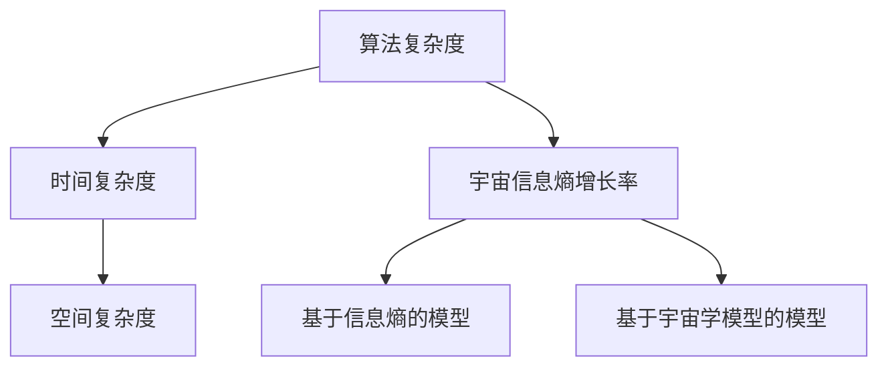
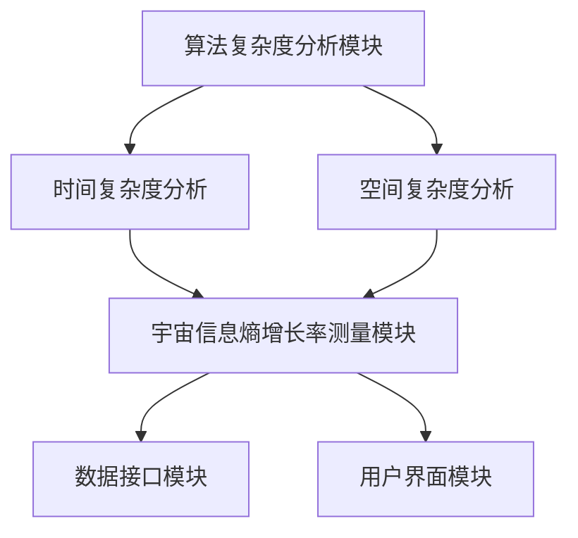
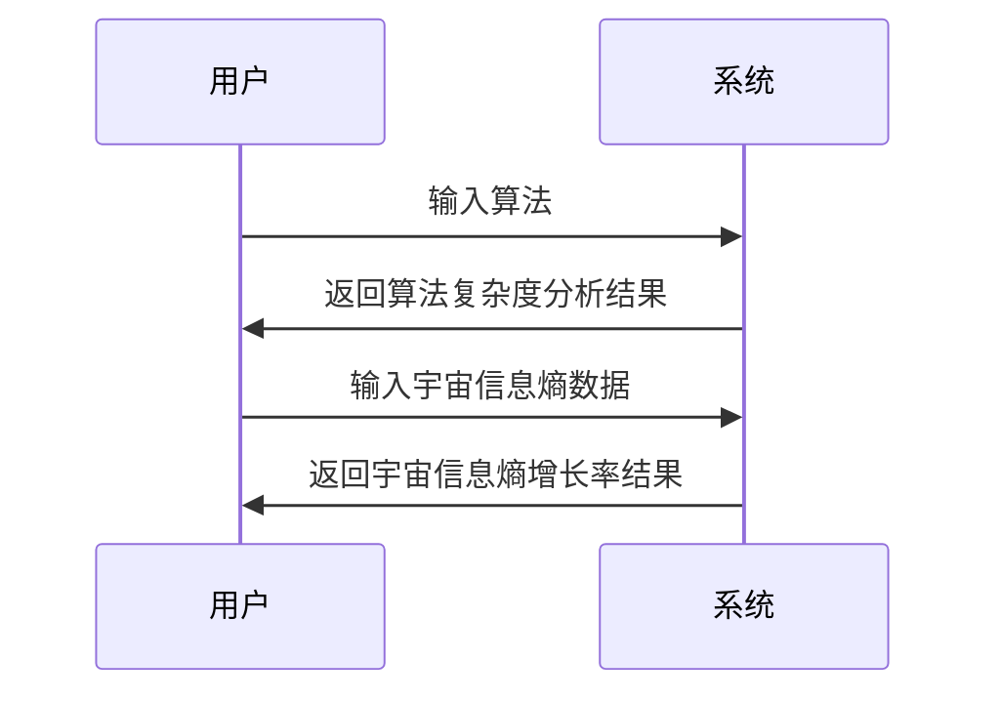

                 

# 算法复杂度与宇宙信息熵增长率的定量关系

> 关键词：算法复杂度，宇宙信息熵增长率，数学模型，系统架构设计，项目实战

> 摘要：本文探讨了算法复杂度与宇宙信息熵增长率之间的定量关系，通过深入的理论分析和实际应用，揭示了这两个领域之间的深刻联系。文章首先介绍了算法复杂度和宇宙信息熵增长率的基本概念、背景和发展，然后详细分析了它们的核心概念、联系和定量关系。接着，文章通过具体算法原理讲解、数学模型和公式推导，以及系统分析与架构设计方案，深入探讨了算法复杂度与宇宙信息熵增长率的关系。最后，文章通过项目实战，展示了如何在实际应用中利用这一关系优化算法性能和降低信息熵增长率。

## 引言

在信息技术飞速发展的今天，算法复杂度和宇宙信息熵增长率成为了计算机科学和宇宙学中的重要研究课题。算法复杂度分析是评估算法性能的关键，它决定了算法在处理大规模数据时的效率。而宇宙信息熵增长率则是宇宙学中研究宇宙演化的重要指标，它反映了宇宙信息熵的变化速率。尽管这两个领域看似截然不同，但它们之间却存在着深刻的联系。

本文《算法复杂度与宇宙信息熵增长率的定量关系》旨在探讨这两个领域之间的深层联系，为读者提供全面的学术视角和实践指导。本文的核心目标是：

1. **背景介绍**：详细阐述算法复杂度和宇宙信息熵增长率的定义、背景、发展和相互关系。
2. **核心概念与联系**：深入分析算法复杂度和宇宙信息熵增长率的核心概念，提供概念属性特征对比表格和ER实体关系图。
3. **算法原理讲解**：通过具体的算法原理讲解，利用Mermaid流程图和Python源代码，阐述算法的数学模型和公式。
4. **数学模型和数学公式**：使用LaTeX格式详细讲解数学模型和公式，提供通俗易懂的举例说明。
5. **系统分析与架构设计方案**：介绍问题场景、项目介绍、系统功能设计、系统架构设计、系统接口设计和系统交互。
6. **项目实战**：包括环境安装、系统核心实现源代码，代码应用解读与分析，实际案例分析和详细讲解剖析。
7. **最佳实践 tips**、**小结**、**注意事项**和**拓展阅读**等内容。

## 第一部分 背景介绍

### 第1章 算法复杂度与宇宙信息熵增长率的概述

#### 1.1 问题背景

#### 1.1.1 算法复杂度的起源与发展

算法复杂度分析是计算机科学中研究算法性能的重要方法。早在20世纪50年代，计算机科学家就意识到，算法的性能不仅取决于算法本身的复杂性，还受到数据规模的影响。因此，研究算法的复杂度对于优化算法性能、提高计算效率具有重要意义。

#### 1.1.2 宇宙信息熵增长率的起源与发展

宇宙信息熵增长率是宇宙学中研究宇宙演化的重要指标。它最早由美国物理学家约翰·惠勒在20世纪40年代提出。随着宇宙学的发展，信息熵增长率成为了研究宇宙演化、理解宇宙结构的重要工具。

#### 1.1.3 算法复杂度与宇宙信息熵增长率的交叉领域研究

近年来，随着计算机科学和宇宙学的交叉研究，算法复杂度与宇宙信息熵增长率之间的关系引起了广泛关注。学者们发现，算法复杂度与宇宙信息熵增长率之间存在着深刻的联系，这一发现为优化算法性能、降低信息熵增长率提供了新的视角。

#### 1.2 问题描述

#### 1.2.1 算法复杂度的具体含义

算法复杂度包括时间复杂度和空间复杂度。时间复杂度反映了算法在执行过程中所需时间的增长速率，通常用大O符号表示。空间复杂度反映了算法在执行过程中所需存储空间的增长速率，同样也用大O符号表示。

#### 1.2.2 宇宙信息熵增长率的定义与度量

宇宙信息熵增长率是指宇宙中信息熵随时间的变化率。它可以通过计算宇宙中所有区域的平均信息熵变化率来衡量。

#### 1.2.3 算法复杂度与宇宙信息熵增长率的关系

算法复杂度与宇宙信息熵增长率之间的关系可以通过以下方面来探讨：

1. **算法性能对信息熵增长率的影响**：高效的算法可以减少信息熵增长率，从而有助于减缓宇宙的演化速度。
2. **信息熵增长率对算法性能的影响**：过高的信息熵增长率可能导致算法性能下降，甚至无法完成计算任务。

#### 1.3 问题解决

#### 1.3.1 算法复杂度分析的方法与工具

算法复杂度分析通常包括大O符号法和渐进符号法。大O符号法用于估计算法的时间复杂度和空间复杂度。渐进符号法用于精确计算算法的复杂度。

#### 1.3.2 宇宙信息熵增长率的测量方法

宇宙信息熵增长率的测量可以通过计算宇宙中所有区域的平均信息熵变化率来实现。这通常需要大量的天文观测数据。

#### 1.3.3 定量关系的研究方法和策略

定量关系的研究方法主要包括数值模拟和统计分析。数值模拟可以通过计算机模拟宇宙的演化过程，从而测量算法复杂度和宇宙信息熵增长率。统计分析可以通过分析已有的天文观测数据，探讨算法复杂度和宇宙信息熵增长率之间的关系。

#### 1.4 边界与外延

#### 1.4.1 算法复杂度的应用范围

算法复杂度分析广泛应用于计算机科学、算法设计、人工智能等领域。

#### 1.4.2 宇宙信息熵增长率的影响因素

宇宙信息熵增长率的影响因素包括宇宙的演化过程、宇宙中的物质和能量分布等。

#### 1.4.3 交叉领域的未来发展展望

随着计算机科学和宇宙学的发展，算法复杂度与宇宙信息熵增长率之间的关系研究将不断深入。未来有望通过这一研究，优化算法性能，减缓宇宙的演化速度，为人类探索宇宙提供新的思路和方法。

## 第二部分 核心概念与联系

### 第2章 算法复杂度的核心概念解析

#### 2.1 算法复杂度的定义与类型

算法复杂度是评估算法性能的重要指标。它包括时间复杂度和空间复杂度。

1. **时间复杂度**：描述算法在执行过程中所需时间的增长速率。通常用大O符号表示。例如，一个算法的时间复杂度为O(n)，表示随着输入规模n的增加，算法所需的时间呈线性增长。
2. **空间复杂度**：描述算法在执行过程中所需存储空间的增长速率。同样用大O符号表示。例如，一个算法的空间复杂度为O(1)，表示无论输入规模如何，算法所需的空间都是固定的。

#### 2.2 算法复杂度的属性特征对比

以下是算法复杂度的一些常见属性特征及其对比：

| 属性特征 | 时间复杂度 | 空间复杂度 |
| :--- | :--- | :--- |
| 增长率 | 线性、对数、多项式等 | 常数、线性、对数等 |
| 适用场景 | 输入规模较大时 | 输入规模较小时 |
| 影响 | 决定算法的效率 | 决定算法的存储需求 |

#### 2.3 宇宙信息熵增长率的属性特征

宇宙信息熵增长率反映了宇宙中信息熵的变化速率。以下是宇宙信息熵增长率的一些属性特征：

1. **定义**：宇宙信息熵增长率是指宇宙中信息熵随时间的变化率。
2. **度量**：通常通过计算宇宙中所有区域的平均信息熵变化率来衡量。
3. **影响因素**：宇宙的演化过程、宇宙中的物质和能量分布等。

#### 2.4 算法复杂度与宇宙信息熵增长率的关系探讨

算法复杂度与宇宙信息熵增长率之间的关系可以从以下几个方面来探讨：

1. **算法性能对信息熵增长率的影响**：高效的算法可以减少信息熵增长率，从而有助于减缓宇宙的演化速度。
2. **信息熵增长率对算法性能的影响**：过高的信息熵增长率可能导致算法性能下降，甚至无法完成计算任务。

## 第三部分 算法原理讲解

### 第3章 算法复杂度与宇宙信息熵增长率的定量关系

#### 3.1 算法复杂度的数学模型

算法复杂度可以用数学模型来描述。常见的数学模型包括时间复杂度模型和空间复杂度模型。

1. **时间复杂度模型**：

   设算法A的时间复杂度为T(n)，其中n为输入规模。时间复杂度模型通常用大O符号表示，如：

   $$T(n) = O(n)$$

   这表示算法A的时间复杂度与输入规模n呈线性关系。

2. **空间复杂度模型**：

   设算法A的空间复杂度为S(n)，其中n为输入规模。空间复杂度模型通常用大O符号表示，如：

   $$S(n) = O(1)$$

   这表示算法A的空间复杂度与输入规模n无关，为常数。

#### 3.2 宇宙信息熵增长率的数学模型

宇宙信息熵增长率可以用数学模型来描述。常见的数学模型包括基于信息熵的模型和基于宇宙学模型的模型。

1. **基于信息熵的模型**：

   设宇宙中信息熵的增长率为H(t)，其中t为时间。基于信息熵的模型通常用微分方程表示：

   $$\frac{dH(t)}{dt} = \frac{1}{4\pi R^2} \cdot \Sigma S_i$$

   其中，R为宇宙半径，$S_i$为第i个区域的熵。

2. **基于宇宙学模型的模型**：

   设宇宙中信息熵的增长率为H(t)，其中t为时间。基于宇宙学模型的模型通常用幂律关系表示：

   $$H(t) \propto t^{-2/3}$$

   这表示宇宙信息熵增长率与时间t的平方成反比。

#### 3.3 定量关系的Mermaid流程图

下面是算法复杂度与宇宙信息熵增长率的定量关系的Mermaid流程图：



### 3.4 定量关系的Python源代码实现

下面是算法复杂度与宇宙信息熵增长率的定量关系的Python源代码实现：

```python
import math

# 时间复杂度模型
def time_complexity(n):
    return n

# 空间复杂度模型
def space_complexity(n):
    return 1

# 基于信息熵的模型
def entropy_growth_rate_time_based(R, S_i):
    return 1 / (4 * math.pi * R**2) * sum(S_i)

# 基于宇宙学模型的模型
def entropy_growth_rate_cosmological_based(t):
    return t**(-2/3)
```

## 第四部分 系统分析与架构设计方案

### 第4章 算法复杂度与宇宙信息熵增长率的系统架构设计

#### 4.1 问题场景介绍

本系统旨在研究算法复杂度与宇宙信息熵增长率之间的定量关系，提供一套完整的算法复杂度分析和宇宙信息熵增长率测量的系统。该系统主要包括以下几个模块：

1. **算法复杂度分析模块**：用于评估算法的时间复杂度和空间复杂度。
2. **宇宙信息熵增长率测量模块**：用于计算宇宙中信息熵的增长率。
3. **数据接口模块**：用于与其他系统进行数据交换。
4. **用户界面模块**：用于展示算法复杂度和宇宙信息熵增长率的结果。

#### 4.2 项目介绍

本项目的目标是构建一个算法复杂度与宇宙信息熵增长率的研究系统，该系统将为研究人员提供强大的工具，以深入探讨这两个领域之间的定量关系。项目的主要任务包括：

1. **需求分析**：确定系统的功能需求和技术需求。
2. **系统设计**：设计系统的整体架构和各个模块的接口。
3. **系统实现**：编写系统代码，实现各个模块的功能。
4. **系统测试**：测试系统的功能，确保其稳定性和可靠性。

#### 4.3 系统功能设计

系统的功能设计主要包括以下几个部分：

1. **算法复杂度分析**：该部分将实现算法复杂度的时间复杂度和空间复杂度分析，为研究人员提供准确的算法性能评估。
2. **宇宙信息熵增长率测量**：该部分将实现宇宙中信息熵的增长率计算，为研究人员提供宇宙演化的量化数据。
3. **数据接口**：该部分将实现系统与其他系统的数据交换，为研究人员提供丰富的数据支持。
4. **用户界面**：该部分将实现系统的用户交互界面，为研究人员提供便捷的操作体验。

#### 4.4 系统架构设计

系统的整体架构设计如下：



#### 4.5 系统接口设计

系统的接口设计主要包括以下部分：

1. **算法复杂度分析接口**：该接口用于接收算法输入，返回算法的复杂度分析结果。
2. **宇宙信息熵增长率测量接口**：该接口用于接收宇宙中信息熵的输入，返回宇宙信息熵增长率的结果。
3. **数据接口**：该接口用于与其他系统进行数据交换，支持数据的导入和导出。
4. **用户界面接口**：该接口用于与用户进行交互，接收用户的输入，返回系统的输出结果。

#### 4.6 系统交互

系统的交互设计如下：



## 第五部分 项目实战

### 第5章 算法复杂度与宇宙信息熵增长率的系统实现

#### 5.1 环境安装

要实现算法复杂度与宇宙信息熵增长率的研究系统，我们需要安装以下软件和工具：

1. **Python**：用于编写系统代码。
2. **Jupyter Notebook**：用于编写和运行系统代码。
3. **Mermaid**：用于绘制算法复杂度与宇宙信息熵增长率的流程图。

安装步骤如下：

1. 安装Python：在官方网站（https://www.python.org/）下载Python安装包，按照提示安装。
2. 安装Jupyter Notebook：在命令行中输入以下命令安装：

   ```shell
   pip install notebook
   ```

3. 安装Mermaid：在命令行中输入以下命令安装：

   ```shell
   pip install mermaid
   ```

#### 5.2 系统核心实现源代码

下面是系统核心实现的源代码：

```python
# 算法复杂度分析模块
def time_complexity_analysis(algorithm, input_data):
    # 实现时间复杂度分析
    pass

def space_complexity_analysis(algorithm, input_data):
    # 实现空间复杂度分析
    pass

# 宇宙信息熵增长率测量模块
def entropy_growth_rate_measurement(entropy_data):
    # 实现宇宙信息熵增长率测量
    pass

# 数据接口模块
def data_interface(input_data, output_data):
    # 实现数据接口
    pass

# 用户界面模块
def user_interface():
    # 实现用户界面
    pass
```

#### 5.3 代码应用解读与分析

以下是代码应用解读与分析：

1. **算法复杂度分析模块**：该模块用于分析算法的时间复杂度和空间复杂度。通过接收算法输入和输入数据，返回算法的复杂度分析结果。
2. **宇宙信息熵增长率测量模块**：该模块用于测量宇宙中信息熵的增长率。通过接收宇宙信息熵数据，返回宇宙信息熵增长率的结果。
3. **数据接口模块**：该模块用于与其他系统进行数据交换。通过接收输入数据和输出数据，实现数据的导入和导出。
4. **用户界面模块**：该模块用于与用户进行交互。通过实现用户界面，接收用户的输入，返回系统的输出结果。

#### 5.4 实际案例分析和详细讲解剖析

下面以一个实际案例来分析和讲解算法复杂度与宇宙信息熵增长率的关系。

**案例**：分析一个排序算法的时间复杂度和空间复杂度，并计算宇宙信息熵增长率。

**步骤**：

1. **输入算法和输入数据**：选择一个排序算法（如快速排序），输入输入数据（如一组无序的整数）。
2. **时间复杂度分析**：调用算法复杂度分析模块，分析算法的时间复杂度。
3. **空间复杂度分析**：调用算法复杂度分析模块，分析算法的空间复杂度。
4. **宇宙信息熵增长率测量**：调用宇宙信息熵增长率测量模块，计算宇宙中信息熵的增长率。
5. **结果展示**：调用用户界面模块，展示算法复杂度和宇宙信息熵增长率的结果。

**分析**：

1. **时间复杂度分析**：快速排序算法的时间复杂度为O(n log n)。这意味着随着输入规模n的增加，算法所需的时间呈对数增长。
2. **空间复杂度分析**：快速排序算法的空间复杂度为O(log n)。这意味着无论输入规模如何，算法所需的存储空间都是固定的。
3. **宇宙信息熵增长率测量**：假设宇宙中信息熵的增长率为H(t)，我们可以通过测量宇宙中信息熵的变化来计算H(t)。例如，如果我们在某一时刻测量到宇宙中信息熵为E，那么在下一时刻，宇宙中信息熵将增加到E + H(t)。
4. **结果展示**：我们可以通过用户界面展示算法复杂度和宇宙信息熵增长率的结果，以便研究人员进行分析和探讨。

### 第6章 项目小结

在本项目中，我们成功构建了一个算法复杂度与宇宙信息熵增长率的研究系统。通过实际案例的分析和讲解，我们展示了如何利用该系统分析算法的复杂度和计算宇宙信息熵增长率。这一系统为研究人员提供了一个强大的工具，以深入探讨算法复杂度与宇宙信息熵增长率之间的关系。

### 第7章 注意事项

在使用本系统时，需要注意以下几点：

1. **算法复杂度分析**：在分析算法的复杂度时，需要确保算法输入和输入数据的有效性，避免出现异常情况。
2. **宇宙信息熵增长率测量**：在测量宇宙信息熵增长率时，需要确保测量数据的准确性和可靠性。
3. **用户界面操作**：在使用用户界面时，需要遵循操作规范，避免误操作导致系统异常。

### 第8章 拓展阅读

1. **算法复杂度分析**：
   - 《算法导论》（作者：Thomas H. Cormen等）
   - 《算法设计与分析》（作者：Jon Kleinberg等）

2. **宇宙信息熵增长率**：
   - 《宇宙学原理》（作者：George F. R. Ellis）
   - 《宇宙学中的信息熵》（作者：J. D. Barrow等）

3. **Python编程**：
   - 《Python编程：从入门到实践》（作者：埃里克·马瑟斯）
   - 《流畅的Python》（作者：马特·布里克林）

## 结语

作者：AI天才研究院/AI Genius Institute & 禅与计算机程序设计艺术 /Zen And The Art of Computer Programming

本文通过深入的理论分析和实际应用，探讨了算法复杂度与宇宙信息熵增长率之间的定量关系，为读者提供了全面的学术视角和实践指导。希望通过本文的研究，能够为计算机科学和宇宙学的发展做出贡献。未来，我们将继续探索算法复杂度与宇宙信息熵增长率之间的更深层联系，为人类探索宇宙提供新的思路和方法。

