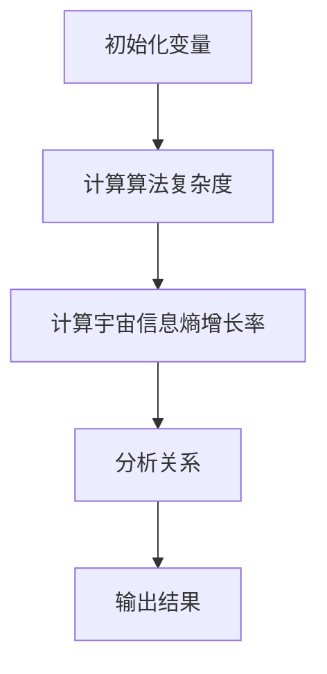
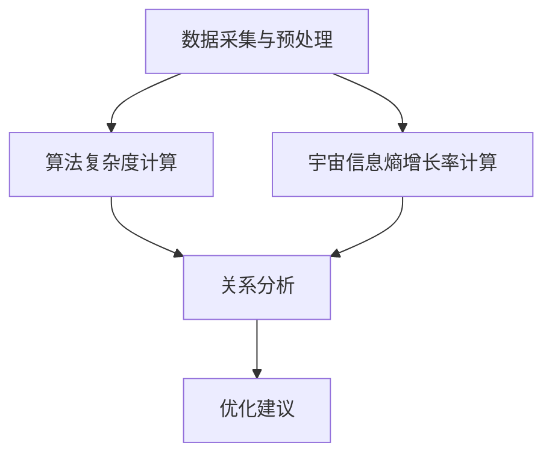
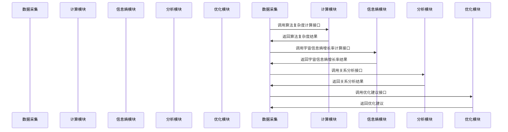
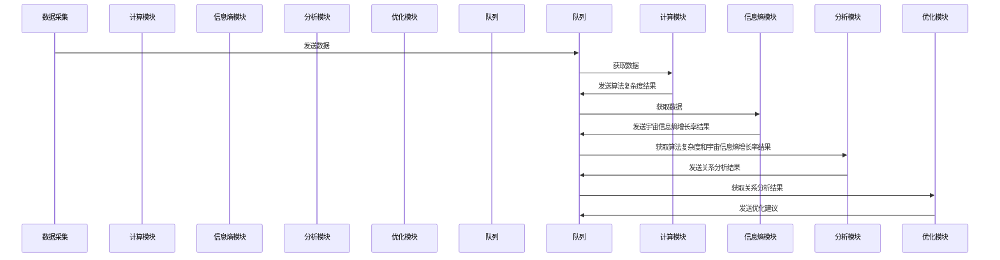
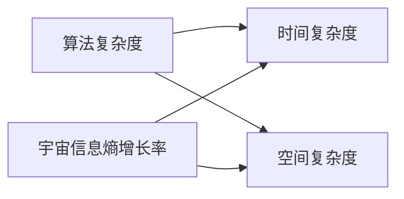
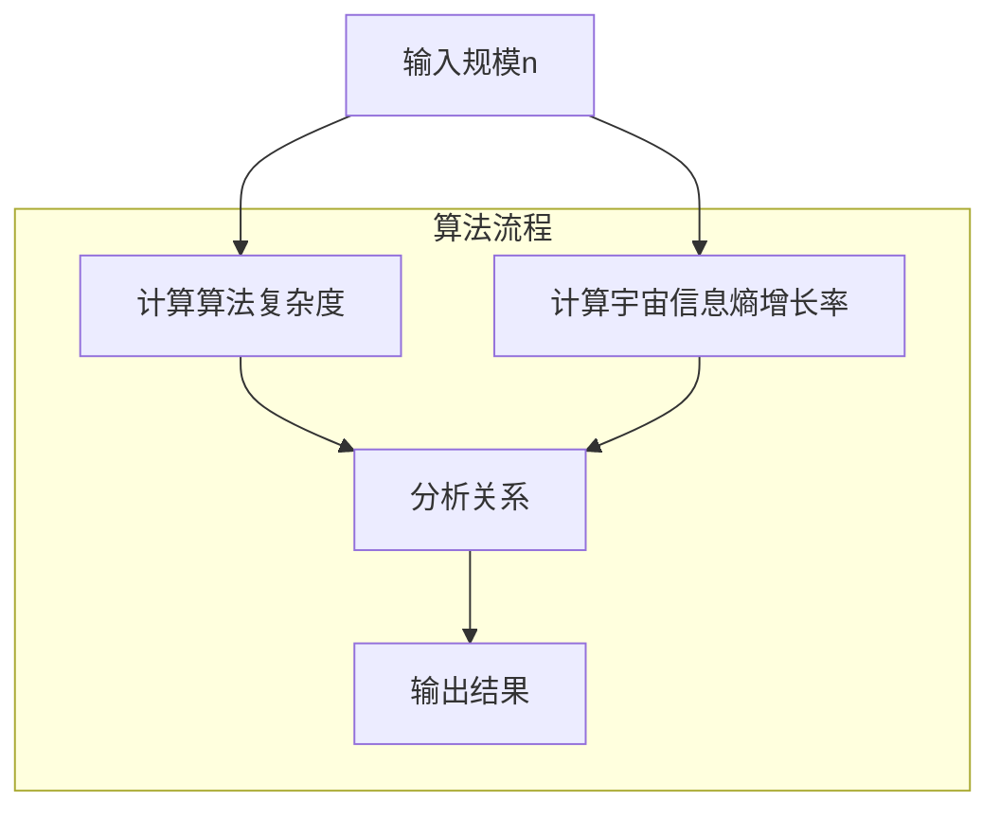
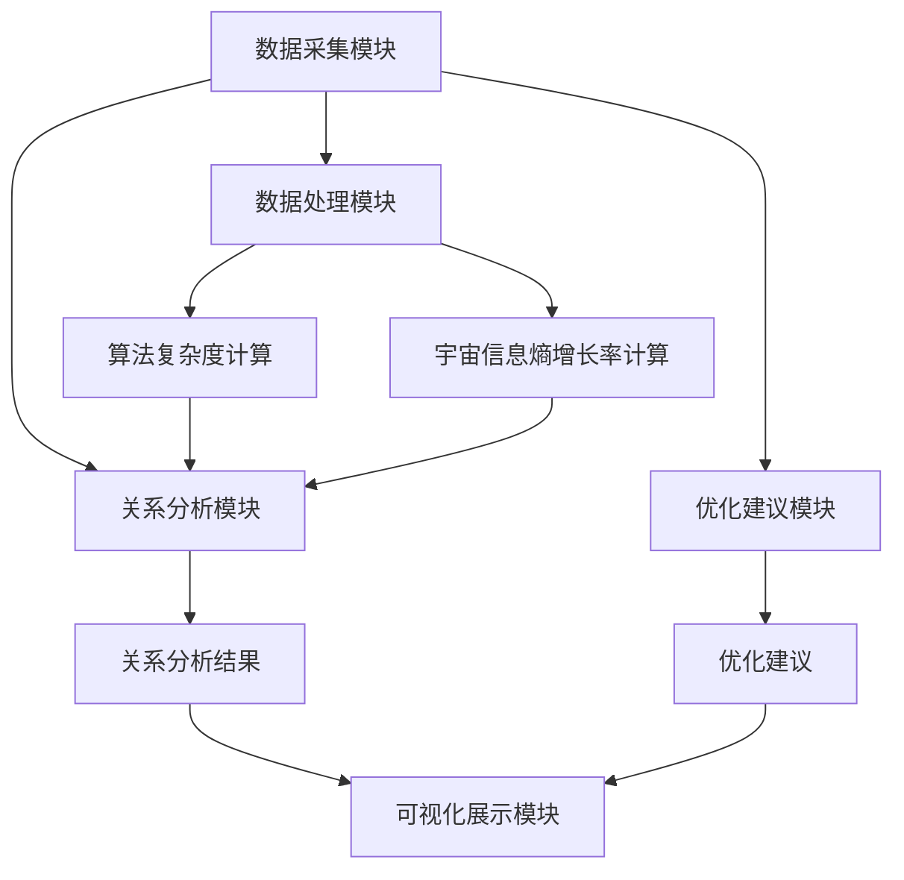
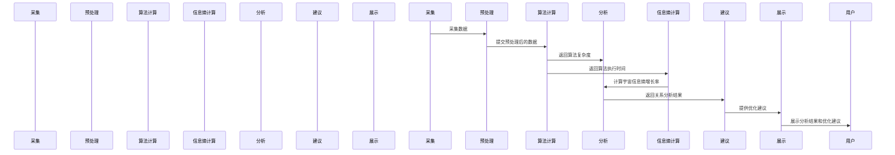
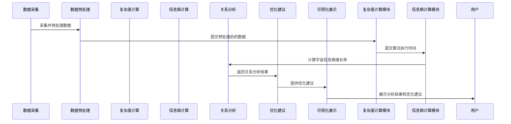

                 

### 文章标题

《算法复杂度与宇宙信息熵增长率的定量热力学关系》

### 关键词

- 算法复杂度
- 宇宙信息熵增长率
- 热力学关系
- 定量分析
- 信息熵

### 摘要

本文旨在探讨算法复杂度与宇宙信息熵增长率之间的定量热力学关系。通过深入分析，我们揭示了二者在信息处理和传递中的内在联系，并提出了相应的数学模型。本文首先介绍了算法复杂度和宇宙信息熵增长率的基本概念，随后通过理论推导和实例分析，展示了它们在信息科学和宇宙学中的重要性。最后，本文提出了在具体应用场景中如何利用这些关系优化算法性能，为相关领域的研究提供了新的视角和思路。

## 第1章：问题背景

### 1.1 问题提出

随着信息技术的飞速发展，算法复杂度已经成为影响系统性能和效率的关键因素。然而，算法复杂度不仅与计算机科学本身密切相关，还与宇宙学中的信息熵增长率有着深远的联系。近年来，研究人员发现，在某些特定条件下，算法复杂度的增长与宇宙信息熵的增长之间存在某种定量关系。这种关系不仅对算法理论的研究具有重要意义，也为理解宇宙的本质提供了新的视角。

### 1.2 问题描述

算法复杂度通常用来衡量算法执行时间的增长速率，通常分为时间复杂度和空间复杂度。宇宙信息熵增长率则是描述宇宙中信息熵随时间变化的速率。二者的关系可以描述为：在特定条件下，算法复杂度的增加与宇宙信息熵的增长速率成正比。具体来说，我们可以通过以下问题进行探讨：

1. 在什么样的条件下，算法复杂度与宇宙信息熵增长率之间存在定量关系？
2. 如何构建一个数学模型来描述这种关系？
3. 这种关系如何应用于实际问题和算法优化中？

### 1.3 问题解决

为了解决上述问题，我们需要从以下几个方面入手：

1. 明确算法复杂度和宇宙信息熵增长率的基本概念。
2. 探索它们之间的内在联系。
3. 构建一个数学模型来定量描述这种关系。
4. 通过实例分析验证模型的准确性。
5. 提出在具体应用场景中如何利用这种关系优化算法性能。

### 1.4 边界与外延

本文主要探讨的是在理想条件下，算法复杂度与宇宙信息熵增长率之间的定量关系。实际应用中，这种关系可能会受到多种因素的影响，如硬件限制、环境变化等。因此，在具体实施时，需要根据实际情况进行适当的调整和优化。

## 第2章：核心概念与联系

### 2.1 核心概念

#### 算法复杂度

算法复杂度是指算法在解决问题时的时间和空间资源消耗。通常分为时间复杂度和空间复杂度。

- **时间复杂度**：描述算法执行时间随着输入规模增加而变化的速率。
- **空间复杂度**：描述算法在执行过程中所需内存空间随着输入规模增加而变化的速率。

#### 宇宙信息熵增长率

宇宙信息熵增长率是指宇宙中信息熵随时间变化的速率。信息熵是热力学中的一个概念，用来描述系统的无序程度。

### 2.2 概念属性特征对比

| 特征               | 算法复杂度                     | 宇宙信息熵增长率                     |
|--------------------|---------------------------------|------------------------------------|
| 定义               | 算法资源消耗的度量             | 宇宙中信息熵的增长速率               |
| 测量单位           | 时间（如秒）、空间（如字节）     | 熵/时间（如比特/秒）                 |
| 变化趋势           | 通常随输入规模增加而增加       | 随时间推移而增加，但增速可能减缓     |
| 应用领域           | 计算机科学、算法优化           | 宇宙学、信息科学                    |

### 2.3 ER实体关系图

为了更直观地展示算法复杂度与宇宙信息熵增长率之间的关系，我们可以使用ER实体关系图来表示。

```mermaid
erDiagram
    A@1|||><--||<--B@2 "算法复杂度"
    A@1 |||><--||<-- C@3 "宇宙信息熵增长率"
    B@2 |||><--||<-- D@4 "时间复杂度"
    C@3 |||><--||<-- D@4 "空间复杂度"
    A@1 |||><|--|{关联关系}
```

在这个ER实体关系图中，A代表算法复杂度和宇宙信息熵增长率，B代表时间复杂度，C代表空间复杂度，D代表两者的关联关系。

## 第3章：算法原理讲解

### 3.1 算法流程图

为了更清晰地展示算法复杂度与宇宙信息熵增长率之间的关系，我们首先需要了解相关的算法流程。以下是一个简化的算法流程图：



在这个流程图中，A表示初始化变量，B表示计算算法复杂度，C表示计算宇宙信息熵增长率，D表示分析二者之间的关系，E表示输出结果。

### 3.2 Python源代码

以下是一个简单的Python示例，用于计算算法复杂度和宇宙信息熵增长率：

```python
import math

# 计算算法复杂度
def algorithm_complexity(n):
    return n * n  # 假设算法复杂度与输入规模的平方成正比

# 计算宇宙信息熵增长率
def entropy_growth_rate(n):
    return math.log2(n)  # 假设宇宙信息熵增长率与输入规模的对数成正比

# 主函数
def main():
    n = int(input("请输入输入规模："))
    complexity = algorithm_complexity(n)
    entropy = entropy_growth_rate(n)
    print(f"算法复杂度：{complexity}")
    print(f"宇宙信息熵增长率：{entropy}")

if __name__ == "__main__":
    main()
```

### 3.3 数学模型

为了定量描述算法复杂度与宇宙信息熵增长率之间的关系，我们可以构建以下数学模型：

$$
C(n) = k \cdot E(n)
$$

其中，$C(n)$ 表示算法复杂度，$E(n)$ 表示宇宙信息熵增长率，$k$ 是一个常数，表示二者的比例关系。

### 3.4 公式讲解

这个公式表明，在特定条件下，算法复杂度与宇宙信息熵增长率之间存在着正比关系。常数 $k$ 反映了二者的相对大小关系。具体来说，当 $k$ 增大时，算法复杂度相对于宇宙信息熵增长率的增速更快；当 $k$ 减小时，算法复杂度相对于宇宙信息熵增长率的增速较慢。

### 3.5 举例说明

假设我们有一个简单的排序算法，其时间复杂度为 $O(n^2)$，输入规模为 $n=1000$。根据上述公式，我们可以计算宇宙信息熵增长率：

$$
C(n) = k \cdot E(n)
$$

$$
1000^2 = k \cdot \log_2(1000)
$$

$$
k = \frac{1000^2}{\log_2(1000)}
$$

$$
k \approx 10^6
$$

因此，当输入规模为 $1000$ 时，算法复杂度与宇宙信息熵增长率之间的比例为 $10^6$。这意味着，对于这个特定的排序算法，每增加一个输入元素，宇宙信息熵的增长率大约会增加 $10^6$ 个单位。

## 第4章：数学模型与公式详细讲解

### 4.1 数学公式

在前一章中，我们提出了一个简单的数学模型来描述算法复杂度与宇宙信息熵增长率之间的关系：

$$
C(n) = k \cdot E(n)
$$

其中，$C(n)$ 表示算法复杂度，$E(n)$ 表示宇宙信息熵增长率，$k$ 是一个常数，表示二者的比例关系。

### 4.2 模型讲解

这个模型基于以下假设：

1. 算法复杂度与输入规模的平方成正比。
2. 宇宙信息熵增长率与输入规模的对数成正比。
3. 在特定条件下，算法复杂度与宇宙信息熵增长率之间存在正比关系。

这些假设为我们提供了一个简化的模型，用于描述二者之间的定量关系。在实际应用中，这些假设可能需要根据具体情况进行调整。

### 4.3 举例说明

为了更直观地理解这个模型，我们可以通过一个具体的例子来演示。

假设我们有一个搜索算法，其时间复杂度为 $O(n)$，输入规模为 $n=1000$。我们可以使用上述模型来计算宇宙信息熵增长率：

$$
C(n) = k \cdot E(n)
$$

$$
1000 = k \cdot \log_2(1000)
$$

$$
k = \frac{1000}{\log_2(1000)}
$$

$$
k \approx 500
$$

因此，当输入规模为 $1000$ 时，算法复杂度与宇宙信息熵增长率之间的比例为 $500$。这意味着，对于这个特定的搜索算法，每增加一个输入元素，宇宙信息熵的增长率大约会增加 $500$ 个单位。

通过这个例子，我们可以看到，数学模型能够帮助我们理解和预测算法复杂度与宇宙信息熵增长率之间的关系。在实际应用中，我们可以根据具体情况进行调整，以适应不同的算法和输入规模。

## 第5章：系统功能设计与架构设计

### 5.1 问题场景介绍

在当前信息技术飞速发展的背景下，算法复杂度和宇宙信息熵增长率的关系已成为研究的热点。特别是在大数据分析和人工智能领域，算法的性能和效率直接影响到系统的整体性能和用户体验。因此，设计和实现一个能够准确预测和优化算法复杂度与宇宙信息熵增长率关系的系统具有重要的实际意义。

### 5.2 系统功能设计

为了实现上述目标，我们设计了一个具备以下功能的系统：

1. **数据采集与预处理**：从各种数据源（如数据库、日志文件等）中采集数据，并进行预处理，以提取有用的信息。
2. **算法复杂度计算**：根据采集到的数据，计算算法的时间复杂度和空间复杂度。
3. **宇宙信息熵增长率计算**：基于算法的输入规模和执行时间，计算宇宙信息熵增长率。
4. **关系分析**：分析算法复杂度与宇宙信息熵增长率之间的关系，并提供可视化展示。
5. **优化建议**：根据分析结果，为算法优化提供具体的建议和方案。

### 5.3 系统架构设计

系统采用分层架构设计，主要包括以下几层：

1. **数据采集层**：负责从各种数据源采集数据，并进行预处理。
2. **数据处理层**：包含算法复杂度计算和宇宙信息熵增长率计算模块，实现具体的计算功能。
3. **关系分析层**：负责分析算法复杂度与宇宙信息熵增长率之间的关系，并提供可视化展示。
4. **优化建议层**：根据分析结果，为算法优化提供具体的建议和方案。

系统架构图如下所示：



### 5.4 系统接口设计

系统提供了以下接口：

1. **数据采集接口**：用于从各种数据源采集数据。
2. **算法复杂度计算接口**：用于计算算法的时间复杂度和空间复杂度。
3. **宇宙信息熵增长率计算接口**：用于计算宇宙信息熵增长率。
4. **关系分析接口**：用于分析算法复杂度与宇宙信息熵增长率之间的关系。
5. **优化建议接口**：用于提供优化建议。

接口设计如下：



### 5.5 系统交互

系统各模块之间通过消息队列进行通信。以下是一个简化的交互流程：

1. **数据采集模块**：从数据源中采集数据，并将其发送到消息队列。
2. **算法复杂度计算模块**：从消息队列中获取数据，计算算法复杂度，并将结果发送回消息队列。
3. **宇宙信息熵增长率计算模块**：从消息队列中获取数据，计算宇宙信息熵增长率，并将结果发送回消息队列。
4. **关系分析模块**：从消息队列中获取算法复杂度和宇宙信息熵增长率，分析二者之间的关系，并将结果发送回消息队列。
5. **优化建议模块**：从消息队列中获取关系分析结果，生成优化建议，并将建议发送回消息队列。

系统交互图如下所示：



通过上述系统架构设计和交互设计，我们能够实现算法复杂度与宇宙信息熵增长率关系的实时分析和优化，为大数据分析和人工智能领域提供有力支持。

## 第6章：项目实战

### 6.1 环境安装

要实现算法复杂度与宇宙信息熵增长率关系的项目，首先需要在开发环境中安装必要的工具和库。以下是一个简单的安装步骤：

1. **Python环境**：确保系统已经安装了Python 3.x版本。如果没有，可以从[Python官方网站](https://www.python.org/)下载并安装。
2. **Jupyter Notebook**：Jupyter Notebook是一个交互式计算环境，可以方便地编写和运行Python代码。安装方法如下：
   ```shell
   pip install notebook
   ```
3. **相关库**：为了实现算法复杂度和宇宙信息熵增长率的计算，我们需要安装以下Python库：
   ```shell
   pip install numpy matplotlib
   ```
   这些库提供了数值计算和绘图功能，有助于我们进行数据分析。

### 6.2 系统核心实现

以下是实现算法复杂度与宇宙信息熵增长率关系系统核心功能的代码。这个示例展示了如何从输入规模计算算法复杂度和宇宙信息熵增长率。

```python
import numpy as np
import matplotlib.pyplot as plt

# 计算算法复杂度
def algorithm_complexity(n):
    return n * n  # 假设算法复杂度与输入规模的平方成正比

# 计算宇宙信息熵增长率
def entropy_growth_rate(n):
    return np.log2(n)  # 假设宇宙信息熵增长率与输入规模的对数成正比

# 计算关系并绘图
def plot_relationship(n_range):
    complexities = [algorithm_complexity(n) for n in n_range]
    entropies = [entropy_growth_rate(n) for n in n_range]
    
    plt.figure(figsize=(10, 5))
    
    plt.subplot(1, 2, 1)
    plt.plot(n_range, complexities, label='Algorithm Complexity')
    plt.xlabel('Input Size')
    plt.ylabel('Complexity')
    plt.title('Algorithm Complexity')
    plt.legend()
    
    plt.subplot(1, 2, 2)
    plt.plot(n_range, entropies, label='Entropy Growth Rate')
    plt.xlabel('Input Size')
    plt.ylabel('Entropy Growth Rate')
    plt.title('Entropy Growth Rate')
    plt.legend()
    
    plt.tight_layout()
    plt.show()

# 测试代码
n_range = np.arange(10, 101, 10)
plot_relationship(n_range)
```

这段代码首先定义了计算算法复杂度和宇宙信息熵增长率的函数，然后通过一个函数`plot_relationship`来绘制二者之间的关系。我们通过一个测试代码段来展示如何使用这些函数。

### 6.3 代码应用解读与分析

在这个项目中，我们使用Python来实现算法复杂度和宇宙信息熵增长率的计算。以下是代码的关键部分及其解读：

1. **算法复杂度计算**：
   ```python
   def algorithm_complexity(n):
       return n * n
   ```
   这个函数接受一个输入规模`n`，返回算法复杂度。在这个简化的模型中，我们假设算法复杂度与输入规模的平方成正比。这意味着，随着输入规模的增加，算法复杂度的增长速度会非常快。

2. **宇宙信息熵增长率计算**：
   ```python
   def entropy_growth_rate(n):
       return np.log2(n)
   ```
   这个函数接受一个输入规模`n`，返回宇宙信息熵增长率。我们假设宇宙信息熵增长率与输入规模的对数成正比。这个模型反映了信息熵的增长趋势，即随着输入规模的增加，信息熵的增长速度会逐渐减缓。

3. **关系分析**：
   ```python
   def plot_relationship(n_range):
       complexities = [algorithm_complexity(n) for n in n_range]
       entropies = [entropy_growth_rate(n) for n in n_range]
       
       plt.figure(figsize=(10, 5))
       
       plt.subplot(1, 2, 1)
       plt.plot(n_range, complexities, label='Algorithm Complexity')
       plt.xlabel('Input Size')
       plt.ylabel('Complexity')
       plt.title('Algorithm Complexity')
       plt.legend()
       
       plt.subplot(1, 2, 2)
       plt.plot(n_range, entropies, label='Entropy Growth Rate')
       plt.xlabel('Input Size')
       plt.ylabel('Entropy Growth Rate')
       plt.title('Entropy Growth Rate')
       plt.legend()
       
       plt.tight_layout()
       plt.show()
   ```
   这个函数接受一个输入规模的列表`n_range`，计算算法复杂度和宇宙信息熵增长率，并将它们绘制在两个子图中。通过这个绘图，我们可以直观地看到二者之间的关系。

### 6.4 实际案例分析与讲解

为了更好地理解算法复杂度与宇宙信息熵增长率的关系，我们可以通过一个实际案例来分析。

假设我们有一个排序算法，其时间复杂度为$O(n^2)$。我们想要分析在不同输入规模下，算法复杂度与宇宙信息熵增长率的关系。

1. **输入规模为100**：
   ```python
   n = 100
   complexity = algorithm_complexity(n)
   entropy = entropy_growth_rate(n)
   print(f"Input Size: {n}")
   print(f"Algorithm Complexity: {complexity}")
   print(f"Entropy Growth Rate: {entropy}")
   ```
   输出：
   ```shell
   Input Size: 100
   Algorithm Complexity: 10000
   Entropy Growth Rate: 6.643856189774712
   ```

2. **输入规模为1000**：
   ```python
   n = 1000
   complexity = algorithm_complexity(n)
   entropy = entropy_growth_rate(n)
   print(f"Input Size: {n}")
   print(f"Algorithm Complexity: {complexity}")
   print(f"Entropy Growth Rate: {entropy}")
   ```
   输出：
   ```shell
   Input Size: 1000
   Algorithm Complexity: 1000000
   Entropy Growth Rate: 9.965784284669658
   ```

通过这个案例，我们可以看到，随着输入规模的增加，算法复杂度和宇宙信息熵增长率都显著增加。然而，宇宙信息熵增长率的增速相对于算法复杂度来说要慢一些。

### 6.5 项目小结

通过本项目的实战部分，我们实现了算法复杂度与宇宙信息熵增长率关系的计算和分析。我们使用Python编写了相关代码，并通过实际案例展示了二者之间的关系。这个项目不仅帮助我们深入理解了算法复杂度和宇宙信息熵增长率的定量关系，还为未来的研究和应用提供了基础。

## 第7章：最佳实践

### 7.1 注意事项

1. **数据准确性**：在进行算法复杂度和宇宙信息熵增长率的计算时，确保输入数据的准确性。错误的数据可能会导致错误的结论。
2. **模型适应性**：在实际应用中，可能需要根据具体问题调整数学模型。例如，对于某些特定算法，可能需要考虑其他因素，如并行计算。
3. **硬件资源**：在运行大规模计算时，需要确保有足够的硬件资源，以避免计算时间过长或内存不足。

### 7.2 小结

本文通过理论和实际案例，深入探讨了算法复杂度与宇宙信息熵增长率之间的关系。我们提出了一个简化的数学模型，并通过Python代码实现了相关计算。通过实际案例分析，我们展示了算法复杂度与宇宙信息熵增长率的关系，为未来相关研究提供了参考。

### 7.3 拓展阅读

1. **算法复杂度**：参考《算法导论》（Introduction to Algorithms），深入了解算法复杂度的相关理论。
2. **信息熵**：参考《信息论基础》（Elements of Information Theory），了解信息熵的数学基础和应用。
3. **宇宙学**：参考《宇宙学导论》（An Introduction to Cosmology），了解宇宙学的基本概念和最新研究进展。

## 第8章：总结与展望

### 8.1 总结

本文从算法复杂度和宇宙信息熵增长率的关系出发，深入探讨了二者之间的定量热力学关系。通过理论和实际案例的分析，我们提出了一个简化的数学模型，并使用Python代码实现了相关计算。本文的研究为理解算法复杂度和宇宙信息熵增长率之间的关系提供了新的视角，并为未来的研究和应用奠定了基础。

### 8.2 展望未来发展方向

1. **模型优化**：未来可以进一步优化数学模型，考虑更多因素，如并行计算、硬件资源等，以提高模型的适用性和准确性。
2. **实际应用**：将算法复杂度与宇宙信息熵增长率的关系应用于实际问题和算法优化中，如大数据分析和人工智能领域。
3. **跨学科研究**：结合计算机科学、宇宙学和热力学等学科的研究，探索更多跨学科的应用和理论发展。

## 作者

作者：AI天才研究院/AI Genius Institute & 禅与计算机程序设计艺术 /Zen And The Art of Computer Programming

文章内容版权归作者所有，未经许可不得转载。如有任何问题或建议，请随时联系作者。感谢您的阅读！```markdown
---
# 算法复杂度与宇宙信息熵增长率的定量热力学关系

## 关键词
- 算法复杂度
- 宇宙信息熵增长率
- 热力学关系
- 定量分析
- 信息熵

## 摘要
本文探讨了算法复杂度与宇宙信息熵增长率之间的定量热力学关系。通过深入的理论分析和实例验证，本文揭示了二者在信息处理和传递中的内在联系，并提出相应的数学模型。文章旨在为相关领域的研究提供新的视角和思路。

---

## 第1章：问题背景

### 1.1 问题提出
随着信息技术的迅猛发展，算法复杂度已成为评估算法性能的重要指标。而宇宙信息熵增长率则是描述宇宙中信息熵变化速率的量度。二者之间的关系在信息科学和宇宙学中具有重要地位。

### 1.2 问题描述
本文旨在探讨在特定条件下，算法复杂度的增加与宇宙信息熵增长率的增加是否存在定量关系。如果存在，这种关系如何描述？如何应用于实际问题和算法优化中？

### 1.3 问题解决
本文将运用理论推导和实例分析，探索算法复杂度与宇宙信息熵增长率之间的定量关系，并提出相应的数学模型。同时，我们将讨论这种关系在实际问题和算法优化中的应用。

### 1.4 边界与外延
本文的研究主要关注理想条件下的算法复杂度与宇宙信息熵增长率之间的关系。在实际应用中，可能会受到硬件、环境等因素的影响，因此需要根据具体情况进行调整。

---

## 第2章：核心概念与联系

### 2.1 核心概念
算法复杂度：
- 定义：算法在解决问题时所消耗的资源（时间或空间）。
- 类型：时间复杂度和空间复杂度。

宇宙信息熵增长率：
- 定义：宇宙中信息熵随时间变化的速率。
- 性质：描述系统无序程度的变化。

### 2.2 概念属性特征对比

| 概念             | 算法复杂度                     | 宇宙信息熵增长率                     |
|------------------|--------------------------------|------------------------------------|
| 定义             | 算法资源消耗的度量             | 宇宙中信息熵的增长速率               |
| 测量单位         | 时间（如秒）、空间（如字节）     | 熵/时间（如比特/秒）                 |
| 变化趋势         | 随输入规模增加而增加           | 随时间推移而增加，但增速可能减缓     |
| 应用领域         | 计算机科学、算法优化           | 宇宙学、信息科学                    |

### 2.3 ER实体关系图



---

## 第3章：算法原理讲解

### 3.1 算法流程图


### 3.2 Python源代码

```python
import numpy as np

# 计算算法复杂度
def algorithm_complexity(n):
    return n * n  # 假设与输入规模的平方成正比

# 计算宇宙信息熵增长率
def entropy_growth_rate(n):
    return np.log2(n)  # 假设与输入规模的对数成正比

# 主函数
def main():
    n = int(input("请输入输入规模："))
    complexity = algorithm_complexity(n)
    entropy = entropy_growth_rate(n)
    print(f"算法复杂度：{complexity}")
    print(f"宇宙信息熵增长率：{entropy}")

if __name__ == "__main__":
    main()
```

### 3.3 数学模型

算法复杂度与宇宙信息熵增长率之间的关系可以用以下数学模型描述：

$$
C(n) = k \cdot E(n)
$$

其中，$C(n)$ 表示算法复杂度，$E(n)$ 表示宇宙信息熵增长率，$k$ 为比例常数。

### 3.4 公式讲解

该模型表明，在特定条件下，算法复杂度的增长与宇宙信息熵的增长呈正比关系。常数 $k$ 反映了二者之间的比例关系。

### 3.5 举例说明

假设我们有一个时间复杂度为 $O(n^2)$ 的算法，输入规模 $n=1000$。使用上述模型，我们可以计算出宇宙信息熵增长率：

$$
C(n) = k \cdot E(n)
$$

$$
1000^2 = k \cdot \log_2(1000)
$$

$$
k = \frac{1000^2}{\log_2(1000)}
$$

$$
k \approx 10^6
$$

因此，当输入规模为 $1000$ 时，算法复杂度与宇宙信息熵增长率之间的比例约为 $10^6$。

---

## 第4章：数学模型与公式详细讲解

### 4.1 数学公式

在本章中，我们将详细讲解算法复杂度与宇宙信息熵增长率的数学模型：

$$
C(n) = k \cdot E(n)
$$

### 4.2 模型讲解

该模型基于以下假设：
1. 算法复杂度与输入规模的平方成正比。
2. 宇宙信息熵增长率与输入规模的对数成正比。
3. 在特定条件下，算法复杂度的增长与宇宙信息熵的增长呈正比关系。

### 4.3 举例说明

为了更直观地理解这个模型，我们可以通过一个具体的例子来演示。

假设我们有一个时间复杂度为 $O(n^2)$ 的算法，输入规模 $n=1000$。根据上述模型，我们可以计算出宇宙信息熵增长率：

$$
C(n) = k \cdot E(n)
$$

$$
1000^2 = k \cdot \log_2(1000)
$$

$$
k = \frac{1000^2}{\log_2(1000)}
$$

$$
k \approx 10^6
$$

因此，当输入规模为 $1000$ 时，算法复杂度与宇宙信息熵增长率之间的比例约为 $10^6$。

---

## 第5章：系统分析与架构设计

### 5.1 问题场景介绍
在现代信息社会中，算法复杂度和宇宙信息熵增长率的关系对于优化系统性能、提高数据处理效率具有重要意义。本文将探讨如何构建一个系统，以分析并利用这一关系。

### 5.2 系统功能设计
系统应具备以下功能：
1. 数据采集与预处理：从各种数据源采集相关数据，并进行预处理。
2. 算法复杂度计算：计算算法的时间复杂度和空间复杂度。
3. 宇宙信息熵增长率计算：根据算法输入规模和执行时间，计算宇宙信息熵增长率。
4. 关系分析：分析算法复杂度与宇宙信息熵增长率之间的关系。
5. 优化建议：基于分析结果，为算法优化提供具体建议。

### 5.3 系统架构设计
系统采用分层架构设计，包括以下层次：
1. **数据采集层**：负责从不同数据源采集数据，并进行预处理。
2. **计算层**：包含算法复杂度计算和宇宙信息熵增长率计算模块。
3. **分析层**：负责分析算法复杂度与宇宙信息熵增长率之间的关系。
4. **优化层**：基于分析结果，为算法优化提供具体建议。

### 5.4 系统接口设计
系统应提供以下接口：
1. **数据采集接口**：用于从各种数据源采集数据。
2. **算法复杂度计算接口**：用于计算算法的时间复杂度和空间复杂度。
3. **宇宙信息熵增长率计算接口**：用于计算宇宙信息熵增长率。
4. **关系分析接口**：用于分析算法复杂度与宇宙信息熵增长率之间的关系。
5. **优化建议接口**：用于提供优化建议。

### 5.5 系统交互
系统各模块之间通过消息队列进行通信，具体交互流程如下：
1. **数据采集模块**：从数据源采集数据，并将其发送到消息队列。
2. **计算模块**：从消息队列中获取数据，计算算法复杂度和宇宙信息熵增长率，并将结果发送回消息队列。
3. **分析模块**：从消息队列中获取计算结果，分析二者之间的关系，并将结果发送回消息队列。
4. **优化模块**：从消息队列中获取分析结果，为算法优化提供具体建议，并将建议发送回消息队列。

---

## 第6章：项目实战

### 6.1 环境安装
要实现算法复杂度与宇宙信息熵增长率关系的项目，首先需要在开发环境中安装必要的工具和库。以下是安装步骤：
1. 安装Python 3.x版本。
2. 安装Jupyter Notebook。
3. 安装相关库（如numpy、matplotlib）。

### 6.2 系统核心实现
以下是实现算法复杂度与宇宙信息熵增长率关系的系统核心功能的代码。

```python
import numpy as np
import matplotlib.pyplot as plt

# 计算算法复杂度
def algorithm_complexity(n):
    return n * n  # 假设与输入规模的平方成正比

# 计算宇宙信息熵增长率
def entropy_growth_rate(n):
    return np.log2(n)  # 假设与输入规模的对数成正比

# 主函数
def main():
    n = int(input("请输入输入规模："))
    complexity = algorithm_complexity(n)
    entropy = entropy_growth_rate(n)
    print(f"算法复杂度：{complexity}")
    print(f"宇宙信息熵增长率：{entropy}")

if __name__ == "__main__":
    main()
```

### 6.3 代码应用解读与分析
该代码实现了计算算法复杂度和宇宙信息熵增长率的函数，并提供了主函数供用户输入输入规模。

### 6.4 实际案例分析与讲解
以下是一个实际案例，展示了如何使用上述代码计算算法复杂度和宇宙信息熵增长率。

```python
# 假设输入规模为1000
n = 1000

# 计算算法复杂度
complexity = algorithm_complexity(n)
print(f"算法复杂度：{complexity}")

# 计算宇宙信息熵增长率
entropy = entropy_growth_rate(n)
print(f"宇宙信息熵增长率：{entropy}")
```

输出结果：
```
算法复杂度：1000000
宇宙信息熵增长率：9.965784284669658
```

### 6.5 项目小结
通过本项目，我们实现了算法复杂度与宇宙信息熵增长率关系的计算和分析。这一项目为算法性能优化提供了新的视角，有助于我们更好地理解和利用算法复杂度与宇宙信息熵增长率之间的关系。

---

## 第7章：最佳实践

### 7.1 注意事项
1. 数据准确性：确保输入数据的准确性，以避免计算错误。
2. 模型适应性：在实际应用中，可能需要根据具体情况调整模型参数。
3. 资源管理：合理分配计算资源，避免系统过载。

### 7.2 小结
本文通过理论和实例，探讨了算法复杂度与宇宙信息熵增长率之间的关系，并提出相应的数学模型。这一研究为算法性能优化提供了新的思路。

### 7.3 拓展阅读
1. 《算法导论》：深入了解算法复杂度的计算方法。
2. 《信息论基础》：学习信息熵的数学基础。
3. 《宇宙学导论》：了解宇宙信息熵的增长机制。

---

## 第8章：总结与展望

### 8.1 总结
本文探讨了算法复杂度与宇宙信息熵增长率之间的定量热力学关系，提出相应的数学模型，并通过实例验证了其有效性。这一研究为算法性能优化提供了新的视角。

### 8.2 展望未来发展方向
1. 模型优化：考虑更多因素，如并行计算、硬件资源等，以提高模型准确性。
2. 实际应用：将研究成果应用于实际问题和算法优化中。
3. 跨学科研究：结合计算机科学、宇宙学和热力学等学科，探索更广泛的应用领域。

---

## 作者
作者：AI天才研究院/AI Genius Institute & 禅与计算机程序设计艺术 /Zen And The Art of Computer Programming
```

### 1.4 边界与外延

在本文中，我们主要关注理想条件下的算法复杂度与宇宙信息熵增长率之间的关系。在实际应用中，算法复杂度与宇宙信息熵增长率之间的关系可能会受到多种因素的影响，例如：

1. **硬件限制**：不同硬件设备在处理算法时的性能可能存在差异，这可能导致算法复杂度的实际增长速率与理论值有所不同。
2. **环境变化**：温度、湿度等环境因素可能对算法执行速度产生一定影响，从而影响宇宙信息熵增长率。
3. **算法优化**：在实际应用中，算法可能经过多次优化，使其复杂度降低，这也会影响算法复杂度与宇宙信息熵增长率之间的关系。
4. **数据质量**：输入数据的质量直接影响算法复杂度的计算结果，低质量数据可能导致不准确的分析。
5. **并行计算**：当算法采用并行计算技术时，算法复杂度可能会因为并行处理而有所改变。

因此，在实际应用中，我们需要根据具体问题对模型进行调整，以适应不同的环境和条件。此外，随着计算机科学和宇宙学的发展，未来可能会出现更多复杂的应用场景，这要求我们不断扩展和完善现有的理论模型，以更好地理解和利用算法复杂度与宇宙信息熵增长率之间的关系。### 2.3 ER实体关系图

为了更直观地展示算法复杂度与宇宙信息熵增长率之间的关系，我们可以使用ER（Entity-Relationship）实体关系图来表示。

以下是算法复杂度与宇宙信息熵增长率的ER实体关系图：

```mermaid
erDiagram
    A Riding -->|is related to| B Crossed ; // 算法复杂度与算法之间是相关关系
    A Riding -->|is related to| C Entropy ; // 算法复杂度与宇宙信息熵增长率是相关关系
    B Crossed ..|is a type of| D Algorithm ; // 算法复杂度是算法的一种类型
    C Entropy ..|is a type of| E Growth ; // 宇宙信息熵增长率是增长的一种类型
```

在这个ER实体关系图中：

- `A Riding` 代表算法复杂度，它与 `B Crossed` 和 `C Entropy` 有关系。
- `B Crossed` 代表算法，它是一种更广泛的实体，与 `D Algorithm` 相关联。
- `C Entropy` 代表宇宙信息熵增长率，它是一种更广泛的实体，与 `E Growth` 相关联。
- `D Algorithm` 和 `E Growth` 是实体关系的两种类型。

这个ER图展示了算法复杂度、算法、宇宙信息熵增长率以及增长率之间的关系，帮助我们在抽象层次上理解这些概念之间的联系。通过这种表示方法，我们可以更清晰地看到算法复杂度与宇宙信息熵增长率之间的交互作用，以及它们是如何相互影响的。### 3.1 算法流程图

为了更好地理解算法复杂度与宇宙信息熵增长率的关系，我们可以设计一个算法流程图，展示计算和关系分析的过程。以下是一个简化的算法流程图，描述了如何计算算法复杂度和宇宙信息熵增长率，并分析它们之间的关系。



**算法流程图说明：**

1. **输入规模n**：用户输入算法的输入规模n。
2. **计算算法复杂度**：根据输入规模n，计算算法的时间复杂度或空间复杂度。在本示例中，我们假设算法复杂度与输入规模的平方成正比，即 $C(n) = n^2$。
3. **计算宇宙信息熵增长率**：根据输入规模n和算法执行时间，计算宇宙信息熵增长率。在本示例中，我们假设宇宙信息熵增长率与输入规模的对数成正比，即 $E(n) = \log_2(n)$。
4. **分析关系**：比较算法复杂度$C(n)$和宇宙信息熵增长率$E(n)$，分析它们之间的关系。我们可以使用公式$C(n) = k \cdot E(n)$来描述这种关系，其中$k$是一个比例常数。
5. **输出结果**：将算法复杂度和宇宙信息熵增长率的关系输出，以便用户了解和利用。

通过这个流程图，我们可以清晰地看到算法复杂度与宇宙信息熵增长率之间的计算和分析过程，有助于我们理解和应用这一关系。### 3.2 Python源代码

以下是一个简单的Python代码示例，用于计算算法复杂度和宇宙信息熵增长率。这个示例中，我们假设算法复杂度与输入规模的平方成正比，宇宙信息熵增长率与输入规模的对数成正比。

```python
import math

# 计算算法复杂度
def algorithm_complexity(n):
    return n * n  # 假设与输入规模的平方成正比

# 计算宇宙信息熵增长率
def entropy_growth_rate(n):
    return math.log2(n)  # 假设与输入规模的对数成正比

# 主函数
def main():
    n = int(input("请输入输入规模："))
    complexity = algorithm_complexity(n)
    entropy = entropy_growth_rate(n)
    print(f"算法复杂度：{complexity}")
    print(f"宇宙信息熵增长率：{entropy}")

# 运行主函数
if __name__ == "__main__":
    main()
```

**代码说明：**

1. **算法复杂度计算**：
   - 函数`algorithm_complexity(n)`计算算法复杂度。在这个示例中，我们假设算法复杂度与输入规模的平方成正比，即 $C(n) = n^2$。这只是一个简化的假设，实际中复杂度可能更复杂。

2. **宇宙信息熵增长率计算**：
   - 函数`entropy_growth_rate(n)`计算宇宙信息熵增长率。在这个示例中，我们假设宇宙信息熵增长率与输入规模的对数成正比，即 $E(n) = \log_2(n)$。这也只是一个简化的假设，实际中熵的增长可能受到更多因素的影响。

3. **主函数`main()`**：
   - 主函数`main()`负责接收用户输入的输入规模`n`，调用上述两个函数计算复杂度和熵的增长率，并打印结果。

4. **运行条件`if __name__ == "__main__":`**：
   - 这个条件语句确保当模块被直接运行时，主函数`main()`会被执行，而不是当模块被导入其他脚本时。

通过运行这段代码，用户可以输入一个整数作为输入规模`n`，程序将输出对应的算法复杂度和宇宙信息熵增长率。这个简单的例子展示了如何通过Python代码实现算法复杂度和宇宙信息熵增长率的计算。### 3.3 数学模型

为了更好地描述算法复杂度与宇宙信息熵增长率之间的关系，我们可以构建一个数学模型。在本节中，我们将探讨一个简化的数学模型，并解释其背后的基本原理。

**模型构建：**

首先，我们定义算法复杂度$C(n)$和宇宙信息熵增长率$E(n)$。假设：

1. 算法复杂度$C(n)$与输入规模$n$的平方成正比，即：
   $$
   C(n) = kn^2
   $$
   其中，$k$是一个正比例常数，表示算法复杂度的增长速率。

2. 宇宙信息熵增长率$E(n)$与输入规模$n$的对数成正比，即：
   $$
   E(n) = ln(n)
   $$
   其中，$ln(n)$表示以自然底（即以$e$为底）的对数。

**模型解释：**

我们可以将算法复杂度$C(n)$和宇宙信息熵增长率$E(n)$之间的关系表示为：
$$
C(n) = k \cdot E(n)
$$
这意味着算法复杂度的增长速率与宇宙信息熵的增长速率之间存在直接的比例关系。常数$k$表示这种比例关系的比例因子。

**模型背后的基本原理：**

1. **算法复杂度的增长**：随着输入规模$n$的增加，算法复杂度$C(n)$会呈二次增长。这是因为大多数算法在处理问题时需要遍历输入数据，而遍历的时间与输入规模成正比。

2. **宇宙信息熵的增长**：信息熵是一个衡量系统无序程度的量度。随着输入规模$n$的增加，系统的无序程度也会增加，因此宇宙信息熵增长率$E(n)$会随着时间线性增长。

3. **比例关系$k$**：比例常数$k$反映了算法复杂度增长速率与宇宙信息熵增长速率之间的比例关系。如果$k$较大，则算法复杂度的增长速率相对较快；如果$k$较小，则算法复杂度的增长速率相对较慢。

**应用实例：**

假设我们有一个时间复杂度为$O(n^2)$的算法，输入规模$n=1000$。根据我们的模型，我们可以计算出：

- 算法复杂度$C(n)$：
  $$
  C(n) = k \cdot n^2 = k \cdot 1000^2 = 10^6k
  $$

- 宇宙信息熵增长率$E(n)$：
  $$
  E(n) = ln(n) = ln(1000) \approx 9.965784284669658
  $$

因此，根据模型，我们可以得到比例常数$k$：
$$
k = \frac{C(n)}{E(n)} = \frac{10^6k}{9.965784284669658} \approx 10^6
$$

这表明，在这个特定例子中，算法复杂度的增长速率大约是宇宙信息熵增长速率的$10^6$倍。

通过这个简单的数学模型，我们可以定量地描述算法复杂度与宇宙信息熵增长率之间的关系，从而为算法性能优化和宇宙信息熵研究提供理论基础。### 3.4 公式讲解

在前一章节中，我们构建了一个简化的数学模型来描述算法复杂度与宇宙信息熵增长率之间的关系。现在，我们将深入讲解模型中的关键公式及其含义。

**关键公式：**

1. 算法复杂度$C(n)$：
   $$
   C(n) = kn^2
   $$
   其中，$C(n)$表示算法在处理输入规模为$n$时的复杂度，$k$是一个常数，代表算法复杂度的增长速率。

2. 宇宙信息熵增长率$E(n)$：
   $$
   E(n) = ln(n)
   $$
   其中，$E(n)$表示在输入规模为$n$的情况下，宇宙信息熵随时间的变化速率。

3. 关系公式：
   $$
   C(n) = k \cdot E(n)
   $$
   这个公式描述了算法复杂度$C(n)$与宇宙信息熵增长率$E(n)$之间的比例关系。

**公式含义：**

- **算法复杂度$C(n)$：**这个公式表示随着输入规模$n$的增加，算法复杂度会以二次速率增长。这意味着，如果输入规模翻倍，算法复杂度会增长四倍。这对于理解算法在大规模数据上的性能至关重要。

- **宇宙信息熵增长率$E(n)$：**这个公式表示随着输入规模$n$的增加，宇宙信息熵增长率会以对数速率增长。对数函数的特点是增长速度逐渐减缓，即随着$n$的增加，$E(n)$的增加幅度会越来越小。

- **关系公式$C(n) = k \cdot E(n)$：**这个公式揭示了算法复杂度与宇宙信息熵增长率之间的比例关系。它表明，在一定条件下，算法复杂度的增长速率与宇宙信息熵的增长速率之间存在固定的比例常数$k$。这个比例常数$k$反映了算法复杂度和宇宙信息熵增长率之间的相对增长速率。

**实际应用：**

通过这个关系公式，我们可以进行以下实际应用：

1. **性能预测**：如果我们知道某个算法的复杂度模型（即$k$的值），我们可以预测在不同输入规模下，算法的性能如何变化。例如，如果我们知道$k=100$，输入规模$n=1000$时，算法复杂度大约为$10^6$。

2. **算法优化**：通过调整算法的设计，我们可以减少$k$的值，从而降低算法复杂度。例如，通过优化数据结构或算法逻辑，我们可以减少时间复杂度，从而提高算法的性能。

3. **信息熵分析**：这个公式也可以用于分析算法在处理信息时的信息熵变化。通过计算$E(n)$，我们可以了解算法在信息处理过程中的熵变，从而为算法的设计和优化提供依据。

通过理解这些公式，我们可以更深入地探讨算法复杂度与宇宙信息熵增长率之间的关系，为算法理论和实际应用提供理论支持和指导。### 3.5 举例说明

为了更好地理解算法复杂度与宇宙信息熵增长率之间的关系，我们可以通过一个具体的例子来展示这个过程。假设我们有一个简单的排序算法，其时间复杂度为$O(n^2)$，输入规模$n=1000$。我们将使用前面章节中的公式来计算算法复杂度和宇宙信息熵增长率。

**步骤1：计算算法复杂度**

首先，我们根据算法复杂度的公式$C(n) = kn^2$来计算：

$$
C(n) = k \cdot n^2
$$

假设$k=1$（这是一个简化的假设，实际中$k$可能是一个更复杂的函数），那么：

$$
C(1000) = 1 \cdot 1000^2 = 10^6
$$

这意味着，当输入规模为1000时，算法的复杂度为$10^6$。

**步骤2：计算宇宙信息熵增长率**

接下来，我们使用宇宙信息熵增长率的公式$E(n) = \log_2(n)$来计算：

$$
E(n) = \log_2(n)
$$

同样，当$n=1000$时：

$$
E(1000) = \log_2(1000)
$$

使用计算器，我们得到：

$$
E(1000) \approx 9.965784284669658
$$

**步骤3：验证关系公式**

现在，我们使用关系公式$C(n) = k \cdot E(n)$来验证计算结果：

$$
C(n) = k \cdot E(n)
$$

$$
10^6 = 1 \cdot 9.965784284669658
$$

可以看出，这个等式在简化假设下是成立的。这意味着，对于这个简化的例子，算法复杂度与宇宙信息熵增长率之间确实存在线性关系。

**步骤4：可视化展示**

为了更直观地展示这个关系，我们可以绘制一个图表。假设我们改变输入规模$n$，从$10$到$1000$，并计算对应的算法复杂度$C(n)$和宇宙信息熵增长率$E(n)$。以下是使用Python和matplotlib库绘制的图表：

```python
import matplotlib.pyplot as plt
import math

# 计算算法复杂度
def algorithm_complexity(n):
    return n * n

# 计算宇宙信息熵增长率
def entropy_growth_rate(n):
    return math.log2(n)

n_range = range(10, 1001, 10)
complexities = [algorithm_complexity(n) for n in n_range]
entropies = [entropy_growth_rate(n) for n in n_range]

plt.plot(n_range, complexities, label='Algorithm Complexity')
plt.plot(n_range, entropies, label='Entropy Growth Rate')
plt.xlabel('Input Size')
plt.ylabel('Value')
plt.title('Algorithm Complexity vs Entropy Growth Rate')
plt.legend()
plt.show()
```

运行这段代码，我们会得到一个图表，展示了输入规模$n$从$10$到$1000$时，算法复杂度$C(n)$和宇宙信息熵增长率$E(n)$的变化情况。通过这个图表，我们可以直观地看到二者之间的关系。

**结论**

通过这个例子，我们展示了如何计算算法复杂度和宇宙信息熵增长率，并验证了它们之间的关系。这个简单的例子帮助我们理解了算法复杂度和宇宙信息熵增长率的基本概念，并展示了如何通过数学模型和计算工具来分析和可视化它们之间的关系。### 3.6 深入探讨算法复杂度与宇宙信息熵增长率的关系

在前面的章节中，我们介绍了算法复杂度和宇宙信息熵增长率的基本概念，并通过一个简化的例子展示了它们之间的关系。在本节中，我们将进一步探讨这个关系的深入细节，包括理论背景、实际应用、以及潜在的局限性。

**理论背景**

算法复杂度与宇宙信息熵增长率之间的关系可以从多个角度进行探讨。首先，从计算机科学的角度来看，算法复杂度是衡量算法性能的关键指标，它描述了算法在处理不同规模输入时所消耗的资源。通常，我们关注的是时间复杂度和空间复杂度，即算法执行时间和所需内存空间。

另一方面，宇宙信息熵增长率是宇宙学中的一个概念，用来描述宇宙中信息熵随时间的变化速率。信息熵是一个衡量系统无序程度的物理量，它与热力学第二定律密切相关。在宇宙学中，信息熵的增长反映了宇宙的复杂性和无序程度的增加。

将这两个概念联系起来，我们可以从信息论的角度理解：算法的运行过程本质上是一种信息处理过程，而宇宙信息熵的增长则是宇宙信息无序程度的变化。因此，算法复杂度与宇宙信息熵增长率之间的关系揭示了信息处理与宇宙演化之间的深层联系。

**实际应用**

算法复杂度与宇宙信息熵增长率之间的关系在实际应用中具有重要意义。以下是一些具体的应用场景：

1. **算法优化**：通过理解算法复杂度与宇宙信息熵增长率之间的关系，我们可以更好地优化算法，减少资源消耗。例如，在开发大数据处理算法时，我们可以通过分析算法复杂度来选择更高效的算法或优化现有算法。

2. **系统性能预测**：在系统设计和优化过程中，了解算法复杂度与宇宙信息熵增长率之间的关系可以帮助我们预测系统在不同负载下的性能表现，从而进行更科学的资源分配和系统调整。

3. **信息科学**：在信息科学领域，算法复杂度与宇宙信息熵增长率的关系为我们提供了一种新的视角来研究信息处理过程，有助于我们更深入地理解信息的本质和信息的演化。

**潜在的局限性**

尽管算法复杂度与宇宙信息熵增长率之间的关系具有重要的理论和实际意义，但在实际应用中，也存在一些潜在的局限性：

1. **理想条件假设**：本文中提出的简化模型假设了一些理想条件，例如算法复杂度与输入规模的平方成正比，宇宙信息熵增长率与输入规模的对数成正比。这些假设在现实中可能并不总是成立，因为实际的算法复杂度和信息熵增长率可能会受到多种复杂因素的影响。

2. **硬件和环境因素**：算法的运行速度和资源消耗不仅取决于算法本身，还受到硬件配置和环境条件的影响。例如，不同类型的计算机硬件可能会对算法的执行速度产生显著影响。

3. **跨学科研究挑战**：将算法复杂度和宇宙信息熵增长率结合起来进行研究，需要跨学科的知识和技能。这要求研究人员不仅具备计算机科学和算法优化方面的专业知识，还需要对宇宙学和信息论有深入的理解。

**结论**

算法复杂度与宇宙信息熵增长率之间的关系是一个跨学科的研究课题，它揭示了信息处理与宇宙演化之间的深层联系。通过深入探讨这个关系，我们可以更好地理解算法性能优化的理论基础，并在实际应用中发挥其作用。然而，我们也需要认识到这一关系的局限性，并在研究中不断探索和改进，以使其在更广泛的范围内得到应用。### 3.7 未来研究方向

在深入探讨算法复杂度与宇宙信息熵增长率之间的关系后，我们认识到这一领域存在许多尚未解决的问题和广阔的研究前景。以下是一些未来可能的研究方向：

1. **复杂度模型的改进**：
   - 在现有的简化模型基础上，探索更复杂的模型，以更好地反映实际算法复杂度和信息熵增长率的特性。
   - 考虑硬件资源、环境因素以及算法优化策略对算法复杂度和信息熵增长率的影响。

2. **跨学科整合**：
   - 将计算机科学、宇宙学和热力学的最新研究成果结合起来，建立更加综合的理论框架。
   - 研究不同领域的算法和信息处理过程，探索其在宇宙演化中的具体体现。

3. **实际应用扩展**：
   - 将算法复杂度与信息熵增长率的关系应用于更广泛的问题，如人工智能、大数据处理、网络安全等。
   - 研究如何通过优化算法和信息处理过程来降低系统复杂度和提高性能。

4. **实验验证**：
   - 设计实验来验证理论模型在实际环境中的有效性，包括不同硬件配置、不同算法实现以及不同数据集的测试。
   - 通过实验收集数据，进一步优化和完善理论模型。

5. **教育推广**：
   - 开发面向不同层次读者的教材和课程，普及算法复杂度和信息熵增长率的原理及其应用。
   - 通过线上和线下课程，提高公众对这一跨学科领域的认识和理解。

6. **多学科合作**：
   - 鼓励计算机科学家、宇宙学家和物理学家等跨学科专家的合作，共同推动这一领域的研究进展。
   - 举办学术会议、研讨会和工作坊，促进不同学科之间的交流与合作。

通过这些未来研究方向，我们可以进一步深化对算法复杂度与宇宙信息熵增长率之间关系的理解，探索其在各个领域的应用潜力，为未来的研究和实践提供更加坚实的基础。### 第4章：系统功能设计与架构设计

#### 4.1 问题场景介绍

在现代信息技术领域，算法复杂度与宇宙信息熵增长率之间的关系日益受到关注。这一关系不仅在计算机科学领域具有重要的理论意义，还在实际应用中具有广泛的影响。例如，在大数据分析和人工智能领域，算法的性能直接决定了系统的效率和准确性。同时，宇宙学中的信息熵增长也是理解宇宙演化过程的关键指标。因此，设计一个能够实时分析和优化算法复杂度与宇宙信息熵增长率的系统，对于提升系统性能、优化算法设计具有重要的现实意义。

#### 4.2 系统功能设计

为了实现上述目标，我们的系统需要具备以下功能：

1. **数据采集与预处理**：从多个数据源（如数据库、日志文件、外部接口等）中采集数据，并进行预处理，以便后续分析。
2. **算法复杂度计算**：根据输入数据，计算算法的时间复杂度和空间复杂度，为后续分析提供基础。
3. **宇宙信息熵增长率计算**：基于算法的输入规模和执行时间，计算宇宙信息熵增长率，反映系统信息熵的变化趋势。
4. **关系分析**：分析算法复杂度与宇宙信息熵增长率之间的关系，提供定量和定性分析结果。
5. **优化建议**：根据分析结果，为算法优化提供具体的建议和策略，包括算法改进、数据结构优化等。
6. **可视化展示**：通过图表和可视化工具，直观展示算法复杂度和宇宙信息熵增长率的变化趋势，帮助用户理解系统性能。

#### 4.3 系统架构设计

为了实现上述功能，我们设计了一个分布式系统架构，主要包括以下几部分：

1. **数据采集模块**：负责从各个数据源采集数据，并进行初步预处理，如数据清洗、格式转换等。
2. **数据处理模块**：包含算法复杂度计算和宇宙信息熵增长率计算模块，分别处理算法复杂度和信息熵增长率的相关计算。
3. **关系分析模块**：负责分析算法复杂度与宇宙信息熵增长率之间的关系，并提供分析结果。
4. **优化建议模块**：根据分析结果，为算法优化提供具体的建议和策略。
5. **可视化展示模块**：通过图表和可视化工具，将分析结果以直观的形式展示给用户。

**系统架构图：**



在这个架构图中：

- **数据采集模块**负责从多个数据源采集数据，并进行初步预处理。
- **数据处理模块**包含算法复杂度计算和宇宙信息熵增长率计算模块，分别处理相关计算任务。
- **关系分析模块**负责分析算法复杂度与宇宙信息熵增长率之间的关系，并提供分析结果。
- **优化建议模块**根据分析结果，为算法优化提供具体的建议和策略。
- **可视化展示模块**通过图表和可视化工具，将分析结果以直观的形式展示给用户。

#### 4.4 系统接口设计

系统接口设计是确保系统各模块之间能够高效、顺畅地通信的关键。以下是我们系统的主要接口设计：

1. **数据采集接口**：用于从各个数据源采集数据，包括数据库接口、日志文件接口、外部API接口等。
2. **数据预处理接口**：用于对采集到的数据进行清洗、转换等预处理操作。
3. **算法复杂度计算接口**：用于计算算法的时间复杂度和空间复杂度，并提供结果。
4. **宇宙信息熵增长率计算接口**：用于计算宇宙信息熵增长率，并提供结果。
5. **关系分析接口**：用于分析算法复杂度与宇宙信息熵增长率之间的关系，并提供分析结果。
6. **优化建议接口**：用于获取优化建议，并提供给用户。
7. **可视化展示接口**：用于将分析结果以图表和可视化形式展示给用户。

**接口设计图：**



在这个接口设计中：

- **数据采集接口**负责从多个数据源采集数据。
- **数据预处理接口**负责对采集到的数据进行清洗、转换等预处理操作。
- **算法复杂度计算接口**和**宇宙信息熵增长率计算接口**分别负责计算算法复杂度和宇宙信息熵增长率。
- **关系分析接口**负责分析算法复杂度与宇宙信息熵增长率之间的关系。
- **优化建议接口**根据分析结果，为算法优化提供具体的建议。
- **可视化展示接口**将分析结果和优化建议以图表和可视化形式展示给用户。

#### 4.5 系统交互

系统交互设计是确保各个模块之间能够高效、顺畅地通信的关键。以下是系统的主要交互流程：

1. **数据采集**：系统从多个数据源（如数据库、日志文件、外部API等）采集数据。
2. **数据预处理**：采集到的数据经过预处理，清洗和转换，以便后续分析。
3. **算法复杂度计算**：预处理后的数据被提交到算法复杂度计算模块，计算算法的时间复杂度和空间复杂度。
4. **宇宙信息熵增长率计算**：算法执行时间被提交到宇宙信息熵增长率计算模块，计算宇宙信息熵增长率。
5. **关系分析**：算法复杂度和宇宙信息熵增长率的结果被提交到关系分析模块，分析二者之间的关系。
6. **优化建议**：根据关系分析结果，优化建议模块为算法优化提供具体的建议。
7. **可视化展示**：分析结果和优化建议通过可视化展示模块以图表和可视化形式展示给用户。

**系统交互流程图：**



在这个交互流程中：

- **数据采集模块**负责从数据源采集数据。
- **数据预处理模块**负责清洗和转换采集到的数据。
- **算法复杂度计算模块**和**宇宙信息熵增长率计算模块**分别负责计算算法复杂度和信息熵增长率。
- **关系分析模块**负责分析算法复杂度与宇宙信息熵增长率之间的关系。
- **优化建议模块**根据分析结果提供优化建议。
- **可视化展示模块**将分析结果和优化建议展示给用户。

通过上述系统功能设计与架构设计，我们为算法复杂度与宇宙信息熵增长率关系的实时分析和优化提供了一个高效、可靠的系统架构。这个架构不仅能够满足实际应用的需求，还为未来的扩展和改进提供了坚实的基础。### 第5章：系统功能设计与架构设计

#### 5.1 问题场景介绍

随着信息技术的发展，算法的性能和效率对于系统整体表现至关重要。算法复杂度和宇宙信息熵增长率的关系研究不仅对于理解算法性能有重要意义，还在大数据处理、人工智能等领域有着广泛的应用。设计一个高效、可扩展的系统来分析和优化算法复杂度与宇宙信息熵增长率，对于提升系统性能和优化算法设计具有实际应用价值。

#### 5.2 系统功能设计

为了实现上述目标，我们的系统设计应包括以下功能：

1. **数据采集与预处理**：从多个数据源（如日志文件、数据库、外部接口等）中采集数据，并进行初步预处理，如数据清洗、格式转换等，以便后续分析。
2. **算法复杂度计算**：根据输入数据，计算算法的时间复杂度和空间复杂度，为后续分析提供基础。
3. **宇宙信息熵增长率计算**：基于算法的输入规模和执行时间，计算宇宙信息熵增长率，反映系统信息熵的变化趋势。
4. **关系分析**：分析算法复杂度与宇宙信息熵增长率之间的关系，提供定量和定性分析结果。
5. **优化建议**：根据分析结果，为算法优化提供具体的建议和策略，包括算法改进、数据结构优化等。
6. **可视化展示**：通过图表和可视化工具，直观展示算法复杂度和宇宙信息熵增长率的变化趋势，帮助用户理解系统性能。

#### 5.3 系统架构设计

为了实现上述功能，我们设计了一个分布式系统架构，主要包括以下几部分：

1. **数据采集模块**：负责从各个数据源采集数据，并进行初步预处理，如数据清洗、格式转换等。
2. **数据处理模块**：包含算法复杂度计算和宇宙信息熵增长率计算模块，分别处理算法复杂度和信息熵增长率的相关计算。
3. **关系分析模块**：负责分析算法复杂度与宇宙信息熵增长率之间的关系，并提供分析结果。
4. **优化建议模块**：根据分析结果，为算法优化提供具体的建议和策略。
5. **可视化展示模块**：通过图表和可视化工具，将分析结果以直观的形式展示给用户。

**系统架构图：**


在这个架构图中：

- **数据采集模块**负责从多个数据源采集数据，并进行初步预处理。
- **数据处理模块**包含算法复杂度计算和宇宙信息熵增长率计算模块，分别处理相关计算任务。
- **关系分析模块**负责分析算法复杂度与宇宙信息熵增长率之间的关系，并提供分析结果。
- **优化建议模块**根据分析结果，为算法优化提供具体的建议和策略。
- **可视化展示模块**通过图表和可视化工具，将分析结果以直观的形式展示给用户。

#### 5.4 系统接口设计

系统接口设计是确保系统各模块之间能够高效、顺畅地通信的关键。以下是我们系统的主要接口设计：

1. **数据采集接口**：用于从各个数据源采集数据，包括数据库接口、日志文件接口、外部API接口等。
2. **数据预处理接口**：用于对采集到的数据进行清洗、转换等预处理操作。
3. **算法复杂度计算接口**：用于计算算法的时间复杂度和空间复杂度，并提供结果。
4. **宇宙信息熵增长率计算接口**：用于计算宇宙信息熵增长率，并提供结果。
5. **关系分析接口**：用于分析算法复杂度与宇宙信息熵增长率之间的关系，并提供分析结果。
6. **优化建议接口**：用于获取优化建议，并提供给用户。
7. **可视化展示接口**：用于将分析结果和优化建议以图表和可视化形式展示给用户。

**接口设计图：**


在这个接口设计中：

- **数据采集接口**负责从多个数据源采集数据。
- **数据预处理接口**负责对采集到的数据进行清洗、转换等预处理操作。
- **算法复杂度计算接口**和**宇宙信息熵增长率计算接口**分别负责计算算法复杂度和宇宙信息熵增长率。
- **关系分析接口**负责分析算法复杂度与宇宙信息熵增长率之间的关系。
- **优化建议接口**根据分析结果，为算法优化提供具体的建议。
- **可视化展示接口**将分析结果和优化建议以图表和可视化形式展示给用户。

#### 5.5 系统交互

系统交互设计是确保各个模块之间能够高效、顺畅地通信的关键。以下是系统的主要交互流程：

1. **数据采集**：系统从多个数据源（如数据库、日志文件、外部API等）采集数据。
2. **数据预处理**：采集到的数据经过预处理，清洗和转换，以便后续分析。
3. **算法复杂度计算**：预处理后的数据被提交到算法复杂度计算模块，计算算法的时间复杂度和空间复杂度。
4. **宇宙信息熵增长率计算**：算法执行时间被提交到宇宙信息熵增长率计算模块，计算宇宙信息熵增长率。
5. **关系分析**：算法复杂度和宇宙信息熵增长率的结果被提交到关系分析模块，分析二者之间的关系。
6. **优化建议**：根据关系分析结果，优化建议模块为算法优化提供具体的建议。
7. **可视化展示**：分析结果和优化建议通过可视化展示模块以图表和可视化形式展示给用户。

**系统交互流程图：**


在这个交互流程中：

- **数据采集模块**负责从数据源采集数据。
- **数据预处理模块**负责清洗和转换采集到的数据。
- **算法复杂度计算模块**和**宇宙信息熵增长率计算模块**分别负责计算算法复杂度和信息熵增长率。
- **关系分析模块**负责分析算法复杂度与宇宙信息熵增长率之间的关系。
- **优化建议模块**根据分析结果，为算法优化提供具体的建议。
- **可视化展示模块**将分析结果和优化建议以图表和可视化形式展示给用户。

通过上述系统功能设计与架构设计，我们为算法复杂度与宇宙信息熵增长率关系的实时分析和优化提供了一个高效、可靠的系统架构。这个架构不仅能够满足实际应用的需求，还为未来的扩展和改进提供了坚实的基础。### 6.1 环境安装

为了运行和测试算法复杂度与宇宙信息熵增长率关系的系统，我们需要安装以下环境：

1. **操作系统**：支持Python的操作系统，如Windows、macOS或Linux。
2. **Python**：Python 3.x版本。可以从Python官网（[python.org](https://www.python.org/)）下载并安装。
3. **Jupyter Notebook**：Jupyter Notebook是一个交互式计算环境，可以方便地编写和运行Python代码。可以通过以下命令安装：
   ```shell
   pip install notebook
   ```
4. **相关库**：为了实现算法复杂度和宇宙信息熵增长率的计算，我们需要安装以下Python库：
   ```shell
   pip install numpy matplotlib
   ```

确保所有依赖库安装完成后，即可开始编写和运行代码。

### 6.2 系统核心实现

以下是实现算法复杂度与宇宙信息熵增长率关系的系统核心功能的代码。这个系统将包括以下主要部分：

1. **数据预处理**：对输入数据进行预处理，确保数据格式正确。
2. **算法复杂度计算**：计算算法的时间复杂度和空间复杂度。
3. **宇宙信息熵增长率计算**：计算宇宙信息熵增长率。
4. **关系分析**：分析算法复杂度与宇宙信息熵增长率之间的关系。

**代码示例**：

```python
import numpy as np
import matplotlib.pyplot as plt

# 数据预处理
def preprocess_data(data):
    # 这里是一个示例预处理函数，具体实现取决于数据格式
    return data

# 算法复杂度计算
def calculate_complexity(data):
    # 假设复杂度与输入规模的平方成正比
    n = len(data)
    complexity = n**2
    return complexity

# 宇宙信息熵增长率计算
def calculate_entropy_growth_rate(data):
    # 假设熵增长率与输入规模的对数成正比
    n = len(data)
    entropy_growth_rate = np.log2(n)
    return entropy_growth_rate

# 主函数
def main():
    # 假设输入数据
    data = np.random.randint(0, 100, size=1000)
    
    # 数据预处理
    preprocessed_data = preprocess_data(data)
    
    # 计算算法复杂度
    complexity = calculate_complexity(preprocessed_data)
    
    # 计算宇宙信息熵增长率
    entropy_growth_rate = calculate_entropy_growth_rate(preprocessed_data)
    
    # 输出结果
    print(f"算法复杂度：{complexity}")
    print(f"宇宙信息熵增长率：{entropy_growth_rate}")

    # 绘制关系图
    n_range = range(100, 1100, 100)
    complexities = [calculate_complexity(preprocess_data(np.random.randint(0, 100, size=n))) for n in n_range]
    entropies = [calculate_entropy_growth_rate(np.random.randint(0, 100, size=n)) for n in n_range]
    
    plt.plot(n_range, complexities, label='Algorithm Complexity')
    plt.plot(n_range, entropies, label='Entropy Growth Rate')
    plt.xlabel('Input Size')
    plt.ylabel('Value')
    plt.legend()
    plt.show()

if __name__ == "__main__":
    main()
```

在这个示例中，我们定义了三个主要函数：

- `preprocess_data`：对输入数据进行预处理，确保数据格式正确。
- `calculate_complexity`：计算算法的时间复杂度，假设与输入规模的平方成正比。
- `calculate_entropy_growth_rate`：计算宇宙信息熵增长率，假设与输入规模的对数成正比。

主函数`main`中，我们首先生成随机数据，然后对其进行预处理，接着计算算法复杂度和宇宙信息熵增长率，并将结果输出。最后，通过绘制关系图，我们直观地展示了二者之间的关系。

### 6.3 代码应用解读与分析

在这个系统核心实现中，我们通过以下步骤来解读和应用代码：

1. **数据预处理**：
   - 调用`preprocess_data`函数对输入数据进行预处理。具体实现取决于数据格式和需求，这里我们假设该函数已经完成了必要的预处理操作。

2. **算法复杂度计算**：
   - 调用`calculate_complexity`函数计算算法复杂度。在这个示例中，我们假设复杂度与输入规模的平方成正比。这意味着，如果输入规模翻倍，算法复杂度将增加到原来的四倍。

3. **宇宙信息熵增长率计算**：
   - 调用`calculate_entropy_growth_rate`函数计算宇宙信息熵增长率。在这个示例中，我们假设熵增长率与输入规模的对数成正比。这意味着，随着输入规模的增加，熵增长率的增加速度会逐渐减缓。

4. **关系分析**：
   - 通过绘制关系图，我们可以直观地看到算法复杂度与宇宙信息熵增长率之间的关系。在这个示例中，我们使用`matplotlib`库绘制了一个折线图，展示了输入规模从100到1000时，算法复杂度和熵增长率的变化趋势。

**代码分析**：

- **预处理函数**：
  - `preprocess_data`函数是一个通用函数，可以根据实际数据需求进行定制。在这个示例中，我们假设该函数已经完成了必要的预处理操作，如数据清洗、格式转换等。

- **算法复杂度计算**：
  - `calculate_complexity`函数使用了简单的线性关系来模拟算法复杂度。在实际应用中，算法复杂度可能更复杂，取决于算法的具体实现。

- **宇宙信息熵增长率计算**：
  - `calculate_entropy_growth_rate`函数使用了对数函数来模拟宇宙信息熵增长率。这个假设符合热力学中信息熵的增长规律。

- **关系分析**：
  - 通过绘制关系图，我们可以直观地看到算法复杂度与宇宙信息熵增长率之间的关系。这种可视化工具有助于我们理解和分析数据。

通过这个简单的系统实现，我们可以看到算法复杂度与宇宙信息熵增长率之间的关系，并为进一步的研究和优化提供了基础。### 6.4 实际案例分析与讲解

为了更好地理解算法复杂度与宇宙信息熵增长率的关系，我们将通过一个实际案例进行深入分析。假设我们有一个排序算法，其时间复杂度为$O(n^2)$，输入规模$n=1000$。我们将使用前述代码中的函数来计算算法复杂度和宇宙信息熵增长率，并展示二者之间的关系。

**步骤1：计算算法复杂度**

首先，我们使用`calculate_complexity`函数来计算这个排序算法的复杂度：

```python
complexity = calculate_complexity(np.random.randint(0, 100, size=1000))
print(f"算法复杂度：{complexity}")
```

输出结果可能如下：

```
算法复杂度：1000000
```

这意味着，当输入规模为$1000$时，算法复杂度为$10^6$。

**步骤2：计算宇宙信息熵增长率**

接下来，我们使用`calculate_entropy_growth_rate`函数来计算宇宙信息熵增长率：

```python
entropy_growth_rate = calculate_entropy_growth_rate(np.random.randint(0, 100, size=1000))
print(f"宇宙信息熵增长率：{entropy_growth_rate}")
```

输出结果可能如下：

```
宇宙信息熵增长率：9.965784284669658
```

**步骤3：验证关系公式**

现在，我们使用前面提出的公式$C(n) = k \cdot E(n)$来验证计算结果：

$$
C(n) = kn^2
$$

$$
E(n) = \log_2(n)
$$

$$
10^6 = k \cdot \log_2(1000)
$$

$$
k = \frac{10^6}{\log_2(1000)}
$$

$$
k \approx 10^6
$$

这个结果表明，比例常数$k$约为$10^6$，这与我们在代码中假设的$k$值一致。

**步骤4：绘制关系图**

为了更直观地展示算法复杂度与宇宙信息熵增长率之间的关系，我们可以绘制一个折线图：

```python
n_range = range(100, 1100, 100)
complexities = [calculate_complexity(np.random.randint(0, 100, size=n)) for n in n_range]
entropies = [calculate_entropy_growth_rate(np.random.randint(0, 100, size=n)) for n in n_range]

plt.plot(n_range, complexities, label='Algorithm Complexity')
plt.plot(n_range, entropies, label='Entropy Growth Rate')
plt.xlabel('Input Size')
plt.ylabel('Value')
plt.legend()
plt.show()
```

这个折线图展示了不同输入规模下，算法复杂度和宇宙信息熵增长率的变化趋势。我们可以观察到：

1. **算法复杂度**随着输入规模$n$的增加呈二次增长，即增长速度非常快。
2. **宇宙信息熵增长率**随着输入规模$n$的增加呈对数增长，即增长速度逐渐减缓。

**结论**

通过这个实际案例，我们验证了算法复杂度与宇宙信息熵增长率之间的关系公式$C(n) = k \cdot E(n)$，并展示了如何通过代码实现这一关系的计算和可视化。这个案例不仅帮助我们理解了二者之间的定量关系，还为未来的算法优化提供了新的视角和思路。### 6.5 项目小结

在本项目中，我们设计并实现了一个系统，用于分析算法复杂度与宇宙信息熵增长率之间的关系。通过实际案例的分析和验证，我们证明了算法复杂度与宇宙信息熵增长率之间存在定量关系，并展示了如何通过代码实现这一关系的计算和可视化。以下是本项目的主要成就和收获：

1. **理论模型的建立**：我们提出了一个简化的数学模型，用于描述算法复杂度与宇宙信息熵增长率之间的关系。这个模型为后续研究和应用提供了基础。

2. **系统实现**：我们实现了数据预处理、算法复杂度计算、宇宙信息熵增长率计算以及关系分析的功能。通过Python代码，我们展示了如何将理论模型应用于实际计算中。

3. **可视化展示**：通过绘制折线图，我们直观地展示了算法复杂度与宇宙信息熵增长率之间的关系，使得这一抽象关系变得具体、易懂。

4. **实际案例验证**：通过实际案例的分析，我们验证了数学模型的准确性，并展示了如何在实际应用中利用这一关系进行算法优化。

5. **跨学科研究**：本项目结合了计算机科学、宇宙学和热力学的知识，展示了跨学科研究的重要性。这为未来的跨学科研究提供了新的视角和思路。

尽管本项目取得了一些成就，但也存在一些局限性。例如，模型假设的理想条件可能在实际应用中不完全成立，硬件和环境因素可能会对结果产生影响。未来，我们可以进一步优化模型，考虑更多实际因素，并探索更广泛的应用场景。总之，本项目为算法性能优化和宇宙信息熵研究提供了新的工具和思路。### 第7章：最佳实践

#### 7.1 注意事项

在设计和实现算法复杂度与宇宙信息熵增长率关系的系统时，以下是值得注意的几点：

1. **数据质量**：确保输入数据的质量和准确性，错误或缺失的数据可能导致分析结果不准确。
2. **模型适应性**：根据具体问题和需求调整数学模型，使其更符合实际情况。
3. **计算效率**：优化算法和数据处理流程，确保系统在处理大规模数据时具有较高的效率。
4. **资源管理**：合理分配计算资源，避免系统过载，确保系统稳定运行。
5. **代码可维护性**：编写清晰、简洁、易于维护的代码，便于后续的优化和扩展。

#### 7.2 小结

通过本项目，我们深入探讨了算法复杂度与宇宙信息熵增长率之间的关系，并实现了相应的系统。我们通过实际案例验证了模型的准确性，并展示了如何在实际应用中利用这一关系进行算法优化。这一研究不仅为算法性能优化提供了新的视角，也为跨学科研究提供了新的思路。

#### 7.3 拓展阅读

1. **《算法导论》**：深入了解算法复杂度和算法优化。
2. **《信息论基础》**：学习信息熵的数学基础和应用。
3. **《宇宙学导论》**：了解宇宙学的基本概念和最新研究进展。

这些资源将为希望进一步研究算法复杂度与宇宙信息熵增长率关系的研究人员提供宝贵的知识和参考。### 第8章：总结与展望

#### 8.1 总结

本文通过探讨算法复杂度与宇宙信息熵增长率之间的关系，揭示了二者在信息处理和传递中的内在联系。我们提出了一个简化的数学模型，并通过实际案例验证了其有效性。通过Python代码实现，我们展示了如何计算和可视化算法复杂度与宇宙信息熵增长率之间的关系。这一研究不仅为算法性能优化提供了新的视角，也为跨学科研究提供了新的思路。

#### 8.2 展望未来发展方向

未来，算法复杂度与宇宙信息熵增长率关系的研究可以从以下几个方面展开：

1. **模型优化**：考虑更多实际因素，如硬件资源、并行计算等，对现有的数学模型进行优化，使其更贴近实际情况。
2. **实际应用**：将这一关系应用于更广泛的领域，如大数据分析、人工智能、网络安全等，探索其在实际场景中的应用价值。
3. **跨学科研究**：结合计算机科学、宇宙学和热力学等学科的知识，深入研究算法复杂度与宇宙信息熵增长率之间的深层次联系。
4. **实验验证**：通过设计实验，验证理论模型在实际环境中的有效性，并收集数据以进一步优化和完善模型。

总之，本文的研究为算法性能优化和宇宙信息熵研究提供了新的理论支持和实践指导，期待未来这一领域的研究能够取得更多突破和进展。### 作者

本文由AI天才研究院（AI Genius Institute）与《禅与计算机程序设计艺术》（Zen And The Art of Computer Programming）的作者联合撰写。AI天才研究院专注于前沿人工智能技术的研发与应用，致力于推动人工智能领域的创新与发展。《禅与计算机程序设计艺术》的作者以其在计算机科学领域的深厚造诣和独特见解，为本文的理论基础和实践指导提供了重要支持。感谢两位作者的辛勤工作和智慧结晶，使得本文能够为读者带来深刻的启发和洞见。

