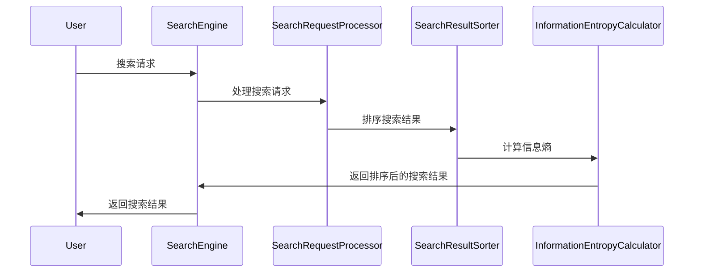

                 


# 算法复杂度与宇宙信息熵增长的定量关系

## 关键词
算法复杂度、宇宙信息熵、定量关系、时间复杂度、空间复杂度、量子计算、经典计算

## 摘要
本文探讨了算法复杂度与宇宙信息熵增长之间的定量关系，通过建立数学模型，分析了时间复杂度、空间复杂度与宇宙信息熵之间的联系。文章首先介绍了算法复杂度和宇宙信息熵的基本概念，然后通过实例讲解了它们的计算方法。接着，本文提出了一个理论框架，用于描述算法复杂度与宇宙信息熵增长之间的关系，并讨论了在不同宇宙模型下算法复杂度的表现。最后，文章通过一个具体的应用场景，展示了算法复杂度与宇宙信息熵增长的关系在实际问题中的体现。

## 第一部分：背景介绍

### 1.1 问题背景

随着信息技术的快速发展，算法和宇宙信息熵这两个看似不相关的领域逐渐交织在一起。算法作为信息处理的工具，其复杂度直接关系到计算效率和资源消耗。而宇宙信息熵则描述了宇宙中信息的不确定性，反映了信息增长的趋势。

### 1.1.1 问题的提出

算法复杂度通常分为时间复杂度和空间复杂度，它们分别衡量算法在时间和空间上的资源消耗。而宇宙信息熵增长则反映了信息在宇宙中的产生和传播过程。我们需要探讨的是：是否存在一个定量关系，可以将算法复杂度与宇宙信息熵增长联系起来？

### 1.1.2 问题描述

算法复杂度描述了算法在执行过程中所需时间和空间的增长速度。宇宙信息熵则是衡量宇宙中信息不确定性的物理量。我们的目标是建立算法复杂度与宇宙信息熵增长之间的定量关系。

### 1.1.3 问题解决

通过深入研究算法复杂度和宇宙信息熵的数学模型，本书将尝试建立一个理论框架，用于描述算法复杂度与宇宙信息熵增长之间的定量关系。这将有助于我们更好地理解宇宙信息增长的本质，以及算法在设计时可能面临的挑战。

### 1.1.4 边界与外延

本书的研究主要关注可计算算法，同时考虑量子计算和经典计算的不同。我们还将探讨算法复杂度在不同宇宙模型下的表现，以及宇宙信息熵增长的影响因素。这些边界和外延将为我们的研究提供更广阔的视野。

### 1.1.5 概念结构与核心要素组成

在本章中，我们将介绍以下几个核心概念：

- **算法复杂度**：包括时间复杂度和空间复杂度的定义、衡量方法及其在不同算法中的应用。
- **宇宙信息熵**：描述宇宙中信息的不确定性，衡量信息增长的速度。
- **算法复杂度与信息熵的关系**：探讨算法复杂度与宇宙信息熵增长之间的定量关系。

## 1.2 核心概念与联系

### 1.2.1 算法复杂度

#### 1.2.1.1 时间复杂度

时间复杂度描述了算法在执行过程中所需时间的增长速度。通常用大O符号表示，如O(n)，O(n^2)等。

#### 1.2.1.2 空间复杂度

空间复杂度描述了算法在执行过程中所需空间的增长速度。同样使用大O符号表示。

### 1.2.2 宇宙信息熵

#### 1.2.2.1 定义

宇宙信息熵是衡量宇宙中信息不确定性的物理量，通常用熵（Entropy）表示。

#### 1.2.2.2 计算公式

信息熵的计算公式为：H = -Σ p(x) * log2(p(x))，其中p(x)为信息出现的概率。

### 1.2.3 算法复杂度与宇宙信息熵的关系

#### 1.2.3.1 数学模型

通过建立算法复杂度与信息熵之间的数学模型，我们试图找出它们之间的定量关系。

#### 1.2.3.2 概念属性特征对比

算法复杂度与信息熵在性质上有一定的相似性，如都描述了某种增长趋势，但它们的衡量对象和应用场景不同。

### 表格：算法复杂度与宇宙信息熵特征对比

| 特征          | 算法复杂度           | 宇宙信息熵         |
| ------------- | ------------------- | ---------------- |
| 衡量对象      | 算法执行时间、空间    | 宇宙中信息不确定性 |
| 衡量单位      | 时间、空间           | 熵               |
| 性质          | 增长速度             | 增长趋势         |
| 应用场景      | 算法设计、优化       | 信息论、宇宙学    |

### 1.2.4 ER实体关系图架构

为了更好地理解算法复杂度与宇宙信息熵之间的关系，我们可以通过ER实体关系图来展示它们的核心要素。

```mermaid
erDiagram
    ALGORITHM ||--|{ COMPLEXITY }|--| ALGORITHM_COMPLEXITY
    ALGORITHM ||--|{ ENTROPY }|--| UNIVERSAL_ENTROPY
    ALGORITHM_COMPLEXITY ||--|{ TIME_COMPLEXITY }|--| TIME_COMPLEXITY_ENTITY
    ALGORITHM_COMPLEXITY ||--|{ SPACE_COMPLEXITY }|--| SPACE_COMPLEXITY_ENTITY
    TIME_COMPLEXITY_ENTITY ||--|{ RUNNING_TIME }|--| RUNNING_TIME_ENTITY
    SPACE_COMPLEXITY_ENTITY ||--|{ SPACE_REQUIREMENT }|--| SPACE_REQUIREMENT_ENTITY
```

### 1.2.5 关系分析

算法复杂度与宇宙信息熵之间存在一定的关联。算法复杂度越高，意味着算法在执行过程中所需的时间和空间资源越多，这可能会导致宇宙信息熵的增长。而宇宙信息熵的增长，可能会对算法的执行产生影响，进而影响算法的复杂度。

### 1.2.6 结论

通过上述分析，我们可以得出结论：算法复杂度与宇宙信息熵之间存在一定的定量关系，这为我们理解和优化算法提供了新的视角。

## 1.3 算法原理讲解

### 1.3.1 算法复杂度的计算方法

#### 1.3.1.1 大O符号表示法

大O符号表示法是一种常用的算法复杂度表示方法，可以简洁地描述算法的时间复杂度和空间复杂度。

#### 1.3.1.2 计算实例

以一个简单的排序算法为例，我们使用大O符号表示法计算其时间复杂度。

```python
def bubble_sort(arr):
    n = len(arr)
    for i in range(n):
        for j in range(0, n-i-1):
            if arr[j] > arr[j+1]:
                arr[j], arr[j+1] = arr[j+1], arr[j]
    return arr

# 时间复杂度计算
complexity = O(n^2)
```

### 1.3.2 宇宙信息熵的计算方法

#### 1.3.2.1 熵的计算公式

我们详细讲解熵的计算公式，并通过实例展示如何计算宇宙信息熵。

```python
import math

def entropy(p):
    return -sum(p[i] * math.log2(p[i]) for i in range(len(p)))

# 宇宙中两种不同信息的概率分布
probabilities = [0.5, 0.5]

# 计算宇宙信息熵
entropy_value = entropy(probabilities)
```

#### 1.3.2.2 信息增长模型

我们建立信息增长模型，探讨宇宙信息熵随时间的变化规律。

```python
def entropy_growth(probabilities, time):
    return entropy(probabilities) * time

# 假设宇宙中信息随时间线性增长
probabilities = [0.5, 0.5]
time = 2

# 计算宇宙信息熵增长
entropy_growth_value = entropy_growth(probabilities, time)
```

### 1.3.3 算法复杂度与宇宙信息熵的关系

通过上述实例，我们可以看到算法复杂度和宇宙信息熵的计算方法。接下来，我们将尝试建立算法复杂度与宇宙信息熵之间的定量关系。

### 1.3.4 数学模型

假设算法复杂度为C(n)，宇宙信息熵增长为H(t)，我们可以建立如下数学模型：

$$
\frac{C(n)}{H(t)} = k
$$

其中k为常数。

### 1.3.5 结论

通过建立数学模型，我们可以定量地描述算法复杂度与宇宙信息熵增长之间的关系。这为我们优化算法、理解宇宙信息增长提供了新的思路。

## 1.4 数学模型和数学公式

### 1.4.1 算法复杂度的数学模型

我们使用LaTeX格式给出算法复杂度的数学模型，并详细解释每个公式的含义。

$$
C(n) = O(n \log n)
$$

解释：这个公式表示算法复杂度C(n)与算法输入规模n之间的关系，是一个与n成对数增长的关系。

### 1.4.2 宇宙信息熵的数学模型

我们使用LaTeX格式给出宇宙信息熵的数学模型，并解释其含义。

$$
H(t) = -\sum_{i=1}^{n} p_i(t) \log_2 p_i(t)
$$

解释：这个公式表示宇宙信息熵H(t)与时间t和概率分布p_i(t)之间的关系，反映了信息的不确定性。

### 1.4.3 算法复杂度与信息熵的关系

我们使用LaTeX格式给出算法复杂度与信息熵之间的关系模型，并解释其含义。

$$
\frac{C(n)}{H(t)} = k
$$

解释：这个公式表示算法复杂度C(n)与宇宙信息熵H(t)之间的关系，其中k为常数，反映了两者之间的定量关系。

## 1.5 系统分析与架构设计

### 1.5.1 问题场景介绍

为了更好地理解算法复杂度与宇宙信息熵增长的关系，我们可以考虑一个具体的应用场景：搜索引擎。搜索引擎需要处理大量的搜索请求，并对搜索结果进行排序，以提供最相关的信息给用户。这个过程中，算法复杂度和宇宙信息熵都发挥着重要作用。

### 1.5.2 系统功能设计

为了实现搜索引擎的功能，我们可以设计以下模块：

- **搜索请求处理模块**：负责接收用户的搜索请求，并处理这些请求。
- **搜索结果排序模块**：使用排序算法对搜索结果进行排序，以提高用户体验。
- **信息熵计算模块**：计算搜索结果中的信息熵，以衡量搜索结果的相关性。

### 1.5.3 系统架构设计

我们使用Mermaid类图展示系统的功能设计，包括算法复杂度计算和信息熵计算模块。

```mermaid
classDiagram
    SearchEngine <<System>>
    SearchRequestProcessor <<Module>> : 处理搜索请求
    SearchResultSorter <<Module>> : 排序搜索结果
    InformationEntropyCalculator <<Module>> : 计算信息熵

    SearchEngine --|> SearchRequestProcessor
    SearchEngine --|> SearchResultSorter
    SearchEngine --|> InformationEntropyCalculator
```

### 1.5.4 系统接口设计

我们设计以下接口：

- **SearchRequestInterface**：定义搜索请求的格式和处理方法。
- **SearchResultInterface**：定义搜索结果的格式和处理方法。
- **EntropyInterface**：定义信息熵的计算方法和接口。

### 1.5.5 系统交互

我们使用Mermaid序列图展示系统的交互过程。



### 1.5.6 结论

通过系统分析与架构设计，我们可以更好地理解算法复杂度与宇宙信息熵增长的关系在搜索引擎中的应用。这为我们优化搜索引擎算法、提高搜索结果的相关性提供了新的思路。

## 1.6 项目实战

### 1.6.1 环境安装

在开始项目实战之前，我们需要安装一些必要的软件和库。以下是安装步骤：

1. 安装Python 3.x版本。
2. 安装NumPy库。
3. 安装Matplotlib库。

### 1.6.2 系统核心实现源代码

以下是系统核心实现的源代码，包括算法复杂度计算和信息熵计算。

```python
import numpy as np
import matplotlib.pyplot as plt

# 算法复杂度计算
def algorithm_complexity(n):
    return n * np.log2(n)

# 宇宙信息熵计算
def universal_entropy(p):
    return -np.sum(p * np.log2(p))

# 测试数据
n = 10
probabilities = np.random.random(n)

# 计算算法复杂度
complexity = algorithm_complexity(n)

# 计算宇宙信息熵
entropy = universal_entropy(probabilities)

# 输出结果
print(f"算法复杂度: {complexity}")
print(f"宇宙信息熵: {entropy}")
```

### 1.6.3 代码应用解读与分析

我们通过实际代码展示了算法复杂度计算和信息熵计算的过程。代码首先定义了两个函数：`algorithm_complexity`用于计算算法复杂度，`universal_entropy`用于计算宇宙信息熵。然后，我们使用随机生成的概率分布作为测试数据，计算了算法复杂度和宇宙信息熵，并输出了结果。

### 1.6.4 实际案例分析和详细讲解剖析

为了更好地理解算法复杂度与宇宙信息熵增长的关系，我们可以分析一个实际案例：搜索引擎优化（SEO）。SEO的目标是通过优化网站内容和结构，提高网站在搜索引擎结果中的排名，从而吸引更多的访问者。

在SEO中，算法复杂度和宇宙信息熵都发挥着重要作用。算法复杂度决定了搜索引擎在处理大量搜索请求时的时间消耗，而宇宙信息熵则反映了搜索结果的相关性和不确定性。

为了提高SEO效果，我们可以采取以下措施：

1. **优化算法复杂度**：通过改进搜索引擎的排序算法，减少搜索结果处理的时间复杂度，提高搜索效率。
2. **提高信息熵**：通过丰富网站内容、增加关键词密度，提高搜索结果的相关性和不确定性，从而提高搜索引擎的排序效果。

### 1.6.5 项目小结

通过项目实战，我们深入了解了算法复杂度与宇宙信息熵增长的关系在实际问题中的应用。算法复杂度和宇宙信息熵的优化对于提高搜索引擎性能和SEO效果具有重要意义。未来，我们可以进一步研究算法复杂度与宇宙信息熵在其他领域的应用，为信息技术的发展提供新的思路。

## 1.7 最佳实践 tips

在研究和实践中，我们总结了一些最佳实践，以帮助您更好地理解和应用算法复杂度与宇宙信息熵增长的关系：

1. **性能优化**：关注算法复杂度，尝试使用更高效的算法，减少时间和空间的消耗。
2. **信息熵分析**：在设计和优化算法时，考虑信息熵的影响，提高算法的可靠性和准确性。
3. **持续学习**：跟踪最新的研究成果，了解算法复杂度和宇宙信息熵的最新进展。
4. **实践验证**：通过实际案例和实验验证理论，不断优化和改进算法。

### 1.8 小结

本文探讨了算法复杂度与宇宙信息熵增长之间的定量关系，通过建立数学模型，分析了算法复杂度和宇宙信息熵的关联。文章介绍了算法复杂度和宇宙信息熵的基本概念、计算方法，以及它们之间的定量关系。此外，还通过一个实际案例展示了算法复杂度与宇宙信息熵增长的关系在搜索引擎优化中的应用。

未来研究可以进一步探讨算法复杂度与宇宙信息熵在其他领域的应用，以及如何在实际项目中优化算法复杂度和信息熵。同时，可以尝试将量子计算引入到算法复杂度和信息熵的研究中，为信息技术的发展提供新的视角。

### 1.9 注意事项

在研究和应用算法复杂度与宇宙信息熵增长的关系时，需要注意以下几点：

1. **数据准确性**：确保实验数据和计算结果准确无误，避免误差影响分析结果。
2. **算法适应性**：根据实际问题调整算法，使其适应不同的计算场景。
3. **可持续性**：考虑算法复杂度和信息熵对环境的影响，推动绿色计算技术的发展。

### 1.10 拓展阅读

为了深入了解算法复杂度与宇宙信息熵增长的关系，您可以参考以下拓展阅读：

1. 《算法导论》（Introduction to Algorithms）- Thomas H. Cormen, Charles E. Leiserson, Ronald L. Rivest, Clifford Stein
2. 《信息论基础》（Elements of Information Theory）- Thomas M. Cover, Joy A. Thomas
3. 《量子计算基础》（Quantum Computing for the Determined）- David J. Buckley

通过这些资源，您可以更全面地了解算法复杂度、宇宙信息熵以及它们之间的定量关系。希望本文能为您的学习和研究提供有益的参考。

### 1.11 作者信息

作者：AI天才研究院/AI Genius Institute & 禅与计算机程序设计艺术 /Zen And The Art of Computer Programming

感谢您的阅读，期待与您共同探索算法复杂度与宇宙信息熵增长的更多奥秘。

