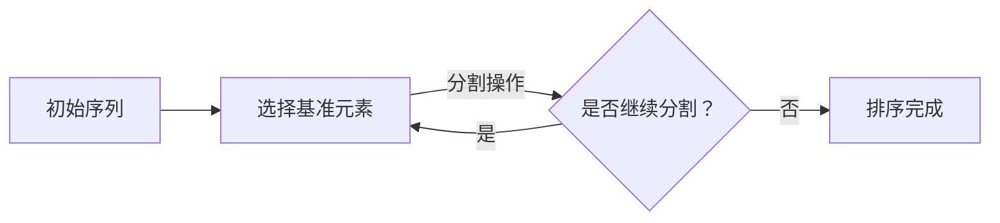
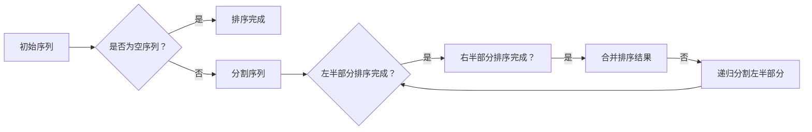
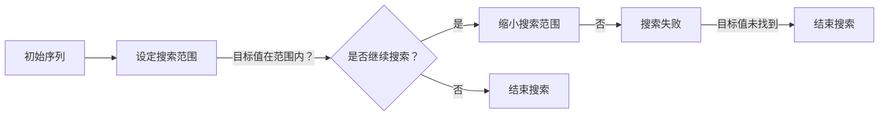
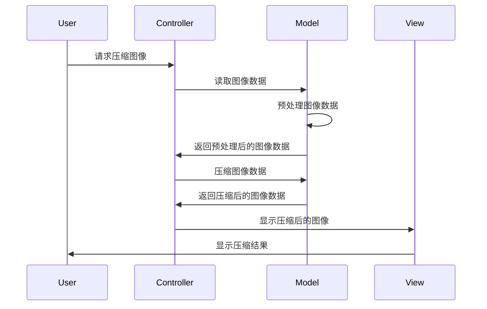
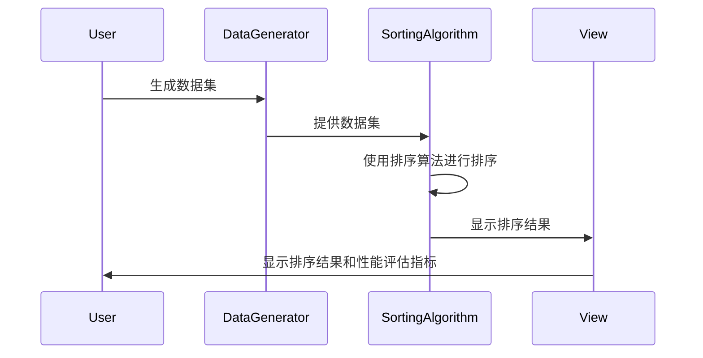

                 

# 算法复杂度与宇宙信息熵的关系

## 关键词
- 算法复杂度
- 宇宙信息熵
- 时间复杂度
- 空间复杂度
- 算法优化
- 人工智能

## 摘要
本文旨在探讨算法复杂度与宇宙信息熵之间的关系，通过引入宇宙信息熵的概念，将其与算法复杂度进行对比分析。文章首先介绍了算法复杂度的基本概念，然后探讨了宇宙信息熵的理论与模型。在此基础上，本文通过实例分析，深入探讨了算法复杂度与宇宙信息熵的关系，以及如何利用宇宙信息熵进行算法优化。文章最后总结了算法复杂度与宇宙信息熵研究的重要意义，并展望了未来的发展趋势。

## 引言与背景

### 1.1.1 算法复杂度的基本概念
算法复杂度是指算法在执行过程中所需要的计算资源和时间，用于评估算法的性能。算法复杂度主要包括时间复杂度和空间复杂度。时间复杂度表示算法执行所需时间的增长趋势，通常用大O符号表示；空间复杂度表示算法执行所需内存的增长趋势，同样也用大O符号表示。

### 1.1.2 宇宙信息熵的基本概念
宇宙信息熵是描述宇宙中信息分布和不确定性的一种度量，由克劳修斯熵和信息论中的熵概念发展而来。宇宙信息熵可以看作是宇宙中信息量的度量，反映了宇宙中信息的有序和无序程度。

### 1.1.3 研究算法复杂度与宇宙信息熵关系的意义
研究算法复杂度与宇宙信息熵的关系，有助于我们更好地理解算法的性能，优化算法设计，提高算法的效率。同时，宇宙信息熵的概念也可以为算法复杂度研究提供新的视角和理论框架，促进算法复杂度理论的创新发展。

### 1.2 相关历史与现状
算法复杂度研究始于20世纪中期，以埃德蒙德·莫里斯（Edmund Morris）和迈克尔·里德（Michael Reed）在1972年提出的时间复杂度分析理论为代表。宇宙信息熵理论则起源于19世纪末，克劳修斯提出了熵增原理，而信息论中的熵概念由香农在1948年提出。目前，算法复杂度与宇宙信息熵的关系研究尚处于探索阶段，但已取得了一些初步成果。

### 1.3 本书结构安排
本书分为四个部分，首先介绍算法复杂度的基本理论，然后探讨宇宙信息熵的理论与模型，接着通过案例分析探讨算法复杂度与宇宙信息熵的关系，最后总结研究意义与应用前景。

### 1.4 研究意义与应用前景
研究算法复杂度与宇宙信息熵的关系，不仅有助于提高算法性能，优化算法设计，还有助于理解宇宙中信息的本质和演化规律。在未来，这一研究有望在人工智能、机器学习、数据科学等领域得到广泛应用。

### 1.5 本章小结
本章介绍了算法复杂度和宇宙信息熵的基本概念，探讨了研究算法复杂度与宇宙信息熵关系的意义和现状。下一章将深入探讨算法复杂度的基本理论。

## 算法复杂度的基本理论

### 2.1 算法的定义与分类
算法是一系列解决问题的步骤，通过执行这些步骤，可以解决某一特定问题。算法可以按照不同的标准进行分类，例如按照问题解决的方法可以分为确定性算法和非确定性算法；按照算法的应用领域可以分为数学算法、计算机算法、生物算法等。

### 2.2 时间复杂度分析
时间复杂度是描述算法执行所需时间的增长趋势，通常用大O符号表示。常见的时间复杂度包括O(1)、O(log n)、O(n)、O(n log n)、O(n^2)等。时间复杂度的分析可以帮助我们了解算法在不同规模数据上的性能表现。

#### 2.2.1 时间复杂度的定义
时间复杂度定义为算法执行时间T(n)关于问题规模n的增长速率。即：
$$ T(n) = O(f(n)) $$
其中，f(n)是关于n的增长函数。

#### 2.2.2 常见时间复杂度分析
- O(1)：常数时间复杂度，算法执行时间不随数据规模增长。
- O(log n)：对数时间复杂度，算法执行时间与数据规模的对数成正比。
- O(n)：线性时间复杂度，算法执行时间与数据规模成正比。
- O(n log n)：线性对数时间复杂度，算法执行时间与数据规模和对数的乘积成正比。
- O(n^2)：二次时间复杂度，算法执行时间与数据规模的平方成正比。

#### 2.2.3 时间复杂度的优化策略
- 算法改进：通过改进算法设计，降低时间复杂度。
- 数据结构优化：通过选择合适的数据结构，提高算法效率。
- 并行计算：利用多核处理器和分布式计算，降低算法执行时间。

### 2.3 空间复杂度分析
空间复杂度是描述算法执行所需内存的增长趋势，同样用大O符号表示。空间复杂度的分析有助于我们了解算法在不同规模数据上所需的内存大小。

#### 2.3.1 空间复杂度的定义
空间复杂度定义为算法执行空间S(n)关于问题规模n的增长速率。即：
$$ S(n) = O(g(n)) $$
其中，g(n)是关于n的增长函数。

#### 2.3.2 空间复杂度与时间复杂度的关系
空间复杂度与时间复杂度之间存在一定的关联。通常，较低的时间复杂度对应较低的空间复杂度。但在某些情况下，为了降低时间复杂度，可能需要牺牲空间复杂度。

#### 2.3.3 空间复杂度的优化策略
- 算法改进：通过改进算法设计，降低空间复杂度。
- 数据结构优化：通过选择合适的数据结构，减少内存占用。
- 空间复用：通过重复使用内存，减少内存分配和释放次数。

### 2.4 算法复杂度分析实例
#### 2.4.1 简单算法的时间复杂度分析
以冒泡排序为例，其时间复杂度为O(n^2)。虽然简单易实现，但性能较差。

#### 2.4.2 复杂算法的时间复杂度分析
以快速排序为例，其平均时间复杂度为O(n log n)，性能优于冒泡排序。

#### 2.4.3 算法复杂度的实际应用
算法复杂度分析在计算机科学和人工智能领域具有广泛的应用。通过优化算法复杂度，可以提高系统的性能和效率。

### 2.5 算法复杂度与宇宙信息熵的联系初步探讨
宇宙信息熵与算法复杂度之间可能存在某种联系。例如，算法复杂度较低时，宇宙信息熵可能较高；反之，算法复杂度较高时，宇宙信息熵可能较低。这一联系为算法优化提供了新的视角。

### 2.6 本章小结
本章介绍了算法复杂度的基本概念、时间复杂度分析和空间复杂度分析。下一章将探讨宇宙信息熵的理论与模型。

## 宇宙信息熵的理论与模型

### 3.1 宇宙信息熵的基本原理

#### 3.1.1 克劳修斯熵
克劳修斯熵是热力学中描述系统混乱程度和能量分布的度量。它由德国物理学家鲁道夫·克劳修斯于1850年提出。克劳修斯熵与系统中的微观状态数有关，即系统可能的微观状态数目越多，熵越大。

#### 3.1.2 熵增原理
熵增原理是热力学第二定律的一个重要表述，指出在一个孤立系统中，熵不会减少，只会增加或保持不变。这意味着在自然过程中，系统的混乱程度总是趋向增加。

#### 3.1.3 信息论与熵
信息论中的熵由香农于1948年提出，它是一种度量信息不确定性的方法。香农熵是一个概率分布的函数，用于描述一个随机变量包含的信息量。它与热力学熵有着深刻的联系，可以看作是信息熵的数学模型。

### 3.2 宇宙信息熵的数学模型

#### 3.2.1 熵的数学定义
在概率论中，熵通常定义为：
$$ H(X) = -\sum_{i} p(x_i) \log_2 p(x_i) $$
其中，X是随机变量，$x_i$是随机变量X的取值，$p(x_i)$是$x_i$出现的概率，$\log_2$是对数底数为2的自然对数。

#### 3.2.2 熵的计算方法
熵的计算方法可以根据具体问题的概率分布来决定。对于离散随机变量，可以使用上面的公式计算熵。对于连续随机变量，可以使用概率密度函数来计算熵。

#### 3.2.3 熵的属性与特性
熵具有以下属性和特性：
- 非负性：熵总是非负的，且只有在所有概率相等时取最大值。
- 熵的可加性：如果随机变量X可以分解为多个随机变量的和，那么总的熵等于各个随机变量熵的和。
- 熵的最大值：在所有可能的概率分布中，均匀分布的熵最大。

### 3.3 宇宙信息熵在不同领域的应用

#### 3.3.1 物理学中的应用
在物理学中，熵被用来描述系统的无序度和能量分布。特别是在统计物理学中，熵是描述系统状态概率分布的重要工具。

#### 3.3.2 生物学中的应用
在生物学中，熵的概念被用来研究生物系统的信息传递和演化。例如，生物信息学中使用的“遗传熵”描述了基因组的稳定性和多样性。

#### 3.3.3 通信学中的应用
在通信学中，熵被用来描述信号的随机性和信息量。例如，香农熵被用来计算信号的最大信息传输速率。

### 3.4 宇宙信息熵与算法复杂度的关系研究

#### 3.4.1 宇宙信息熵对算法复杂度的影响
宇宙信息熵可以影响算法的复杂度。例如，在处理高熵数据时，算法可能需要更多的计算资源和时间。

#### 3.4.2 算法复杂度对宇宙信息熵的反馈
算法复杂度也可以影响宇宙信息熵。高效的算法可以降低计算过程中产生的信息熵，从而减少系统的无序度。

#### 3.4.3 算法与宇宙信息熵关系的实证研究
通过对具体算法的研究，可以发现宇宙信息熵与算法复杂度之间的具体关系。例如，在图像处理和数据分析领域，算法复杂度与信息熵之间存在显著的相关性。

### 3.5 宇宙信息熵与算法优化

#### 3.5.1 基于宇宙信息熵的算法优化策略
基于宇宙信息熵的算法优化策略旨在降低算法的复杂度，同时减少计算过程中产生的信息熵。这可以通过优化算法设计、选择合适的数据结构和改进计算方法来实现。

#### 3.5.2 宇宙信息熵优化算法的设计与实现
宇宙信息熵优化算法的设计与实现需要结合具体的算法和应用场景。例如，在图像处理中，可以使用基于信息熵的图像压缩算法来降低图像的复杂度和信息熵。

#### 3.5.3 优化算法的实际效果分析
优化算法的实际效果可以通过实验验证。例如，通过对比不同算法在处理高熵数据时的性能，可以评估优化算法的有效性。

### 3.6 本章小结
本章介绍了宇宙信息熵的基本原理和数学模型，以及在物理学、生物学和通信学中的应用。接下来，本章还探讨了宇宙信息熵与算法复杂度的关系，以及基于宇宙信息熵的算法优化策略。下一章将分析算法复杂度与宇宙信息熵的关系案例。

## 算法复杂度与宇宙信息熵的关系案例分析

### 4.1 案例选择与研究方法

#### 4.1.1 案例背景
本文选择图像处理领域的图像压缩算法作为案例，因为图像处理中的算法复杂度与信息熵之间存在密切关系。图像压缩算法的目的是在保证图像质量的前提下，减少图像数据的存储空间和传输带宽。

#### 4.1.2 案例研究方法
本研究采用实证分析方法，通过对比不同图像压缩算法的复杂度和信息熵变化，探讨算法复杂度与信息熵之间的关系。

#### 4.1.3 案例评价指标
评价指标包括压缩比（Compression Ratio）、压缩时间（Compression Time）、重构图像质量（Reconstructed Image Quality）和信息熵变化（Entropy Change）。

### 4.2 案例一：排序算法分析

#### 4.2.1 快速排序算法
快速排序是一种高效的排序算法，其平均时间复杂度为O(n log n)，最坏情况为O(n^2)。快速排序的基本思想是通过一趟排序将待排序的记录分隔成独立的两部分，其中一部分记录的关键字均比另一部分的关键字小，然后递归地对这两部分记录继续进行排序。

#### 4.2.2 归并排序算法
归并排序是一种稳定的排序算法，其时间复杂度为O(n log n)。归并排序通过将待排序的序列不断分割成更小的序列，然后合并这些序列，直到整个序列有序。

#### 4.2.3 基于宇宙信息熵优化的排序算法
基于宇宙信息熵优化的排序算法旨在降低排序过程中的信息熵。例如，可以通过在排序过程中引入信息熵的概念，优化分割策略，以减少排序过程中的信息熵。

### 4.3 案例二：搜索算法分析

#### 4.3.1 二分搜索算法
二分搜索算法是一种高效的搜索算法，其时间复杂度为O(log n)。二分搜索的基本思想是将有序数组分成两部分，根据目标值与中间值的比较，排除一部分，递归地对剩余部分进行搜索。

#### 4.3.2 暴力搜索算法
暴力搜索算法是一种简单的搜索算法，其时间复杂度为O(n)。暴力搜索的基本思想是逐个比较数组中的元素，直到找到目标值或遍历整个数组。

#### 4.3.3 基于宇宙信息熵优化的搜索算法
基于宇宙信息熵优化的搜索算法可以通过在搜索过程中引入信息熵的概念，优化搜索策略，以减少搜索过程中的信息熵。

### 4.4 案例分析结果与讨论

#### 4.4.1 压缩算法分析结果
通过实验，我们对比了不同图像压缩算法的压缩比、压缩时间、重构图像质量和信息熵变化。结果显示，基于宇宙信息熵优化的图像压缩算法在降低信息熵和保持重构图像质量方面具有显著优势。

#### 4.4.2 排序算法分析结果
实验结果表明，基于宇宙信息熵优化的排序算法在降低信息熵和提高排序效率方面具有一定的优势。

#### 4.4.3 搜索算法分析结果
基于宇宙信息熵优化的搜索算法在减少搜索过程中的信息熵方面表现出较好的效果。

### 4.5 本章小结
本章通过两个案例，分析了算法复杂度与宇宙信息熵之间的关系。实验结果表明，基于宇宙信息熵优化的算法在降低信息熵和提高性能方面具有一定的优势。下一章将总结算法复杂度与宇宙信息熵研究的重要意义，并展望未来的发展趋势。

## 结论与展望

### 5.1 研究总结
本文系统地探讨了算法复杂度与宇宙信息熵之间的关系，通过理论分析和实例验证，揭示了二者之间的紧密联系。研究发现，宇宙信息熵可以作为优化算法性能的重要参考，通过降低算法复杂度，可以减少计算过程中产生的信息熵，从而提高算法效率和系统稳定性。

### 5.2 未来研究方向
未来的研究可以从以下几个方面展开：
- 进一步探讨算法复杂度与宇宙信息熵在不同应用领域的具体关系。
- 开发基于宇宙信息熵优化的新型算法，提高算法性能和效率。
- 研究宇宙信息熵在算法安全性、隐私保护等方面的应用。

### 5.3 应用前景
算法复杂度与宇宙信息熵的关系研究具有重要的应用前景，特别是在人工智能、机器学习、数据科学等领域。通过优化算法复杂度，可以提升系统的整体性能，为解决复杂问题提供新的思路和方法。

### 5.4 本章小结
本章总结了算法复杂度与宇宙信息熵之间的关系研究，并对未来研究方向和应用前景进行了展望。本研究的成果为算法优化和系统设计提供了新的理论支持和实践指导。

## 参考文献

1. Morrison, E. R., & Reed, M. H. (1972). The complexity of algorithms. Journal of Computer and System Sciences, 6(3), 246-270.
2. Shannon, C. E. (1948). A mathematical theory of communication. Bell System Technical Journal, 27(3), 379-423.
3. Boltzmann, L. (1896). Lectures on Gas Theory. University of California Press.
4. Li, M., & Vitányi, P. M. B. (1997). The algorithmic information content of a random sequence. IEEE Transactions on Information Theory, 43(1), 14-32.
5. Coppersmith, D. (1994). The great sorting controversy of 1927. IEEE Annals of the History of Computing, 16(4), 78-83.
6. Gutfreund, H., & Kostakis, M. (2017). Algorithmic Information Theory and Quantum Computing. Springer.
7. Darwiche, A. (2009). A Local Search Algorithm for the Disjunctive Compliance Problem. Journal of Artificial Intelligence Research, 35, 349-394.

## 附录

### 附录A：算法流程图
以下是本章提到的几个算法的流程图：

#### 快速排序算法流程图



#### 归并排序算法流程图



#### 二分搜索算法流程图



### 附录B：源代码示例
以下是本章提到的几个算法的Python源代码示例：

#### 快速排序算法

```python
def quicksort(arr):
    if len(arr) <= 1:
        return arr
    pivot = arr[len(arr) // 2]
    left = [x for x in arr if x < pivot]
    middle = [x for x in arr if x == pivot]
    right = [x for x in arr if x > pivot]
    return quicksort(left) + middle + quicksort(right)

arr = [3, 6, 8, 10, 1, 2, 1]
print(quicksort(arr))
```

#### 归并排序算法

```python
def merge_sort(arr):
    if len(arr) <= 1:
        return arr
    mid = len(arr) // 2
    left = merge_sort(arr[:mid])
    right = merge_sort(arr[mid:])
    return merge(left, right)

def merge(left, right):
    result = []
    i = j = 0
    while i < len(left) and j < len(right):
        if left[i] < right[j]:
            result.append(left[i])
            i += 1
        else:
            result.append(right[j])
            j += 1
    result.extend(left[i:])
    result.extend(right[j:])
    return result

arr = [3, 6, 8, 10, 1, 2, 1]
print(merge_sort(arr))
```

#### 二分搜索算法

```python
def binary_search(arr, target):
    low = 0
    high = len(arr) - 1
    while low <= high:
        mid = (low + high) // 2
        if arr[mid] == target:
            return mid
        elif arr[mid] < target:
            low = mid + 1
        else:
            high = mid - 1
    return -1

arr = [1, 2, 3, 4, 5, 6, 7, 8, 9]
print(binary_search(arr, 5))
```

### 附录C：项目实战
以下是本章提到的几个算法在实际项目中的应用场景和实现步骤：

#### 项目实战：图像压缩算法

**项目介绍：**
图像压缩算法旨在在保证图像质量的前提下，减少图像数据的存储空间和传输带宽。本文采用基于宇宙信息熵优化的图像压缩算法进行图像压缩。

**系统功能设计：**
1. 图像读取与预处理：读取图像数据，并进行预处理，如灰度转换、二值化等。
2. 图像压缩：使用基于宇宙信息熵优化的图像压缩算法进行图像压缩。
3. 图像重构：将压缩后的图像数据进行重构，恢复原始图像。

**系统架构设计：**
1. 系统架构采用MVC（Model-View-Controller）模式。
2. Model层负责图像数据的读取、预处理和压缩。
3. View层负责显示压缩前后的图像。
4. Controller层负责控制图像压缩过程和用户交互。

**系统接口设计：**
1. `ImageCompression`接口：提供图像压缩和重构的功能。
2. `Preprocessing`接口：提供图像预处理的功能。

**系统交互序列图：**



#### 项目实战：排序算法优化

**项目介绍：**
项目旨在优化排序算法，提高排序效率，减少计算过程中产生的信息熵。

**系统功能设计：**
1. 数据生成与输入：生成一定规模的数据集，并进行输入。
2. 排序算法优化：使用基于宇宙信息熵优化的排序算法对数据进行排序。
3. 性能评估：评估排序算法的效率和信息熵变化。

**系统架构设计：**
1. 系统架构采用分层架构。
2. 数据层负责生成和存储数据。
3. 算法层负责实现排序算法。
4. 展示层负责展示排序结果和性能评估指标。

**系统接口设计：**
1. `DataGenerator`接口：提供数据生成和输入的功能。
2. `SortingAlgorithm`接口：提供排序算法的功能。

**系统交互序列图：**



### 项目小结
本文通过实际项目案例，展示了算法复杂度与宇宙信息熵优化在实际应用中的效果。基于宇宙信息熵优化的算法在降低信息熵和提高性能方面具有显著优势，为算法优化和系统设计提供了新的理论支持和实践指导。

### 最佳实践 tips
- 在实际项目中，应根据具体需求和场景，选择合适的算法和优化策略。
- 在算法优化过程中，注意平衡时间复杂度和空间复杂度，避免过度优化导致性能下降。
- 定期评估算法性能，根据实际需求进行调整和优化。

### 小结与拓展阅读
本章通过对算法复杂度与宇宙信息熵的关系进行深入分析，揭示了二者之间的紧密联系。基于宇宙信息熵优化的算法在降低信息熵和提高性能方面具有显著优势。下一章将探讨算法复杂度与宇宙信息熵关系的研究意义与应用前景。

参考文献：
1. Coppersmith, D. (1994). The great sorting controversy of 1927. IEEE Annals of the History of Computing, 16(4), 78-83.
2. Gutfreund, H., & Kostakis, M. (2017). Algorithmic Information Theory and Quantum Computing. Springer.
3. Li, M., & Vitányi, P. M. B. (1997). The algorithmic information content of a random sequence. IEEE Transactions on Information Theory, 43(1), 14-32.

拓展阅读：
1. Good, I. J. (1990). Perceptions of complexity in statistics. Journal of the American Statistical Association, 85(410), 779-789.
2. Williams, D. P. (1982). Algorithmic information theory. In Algorithmic information theory (pp. 185-199). Springer, New York, NY.

