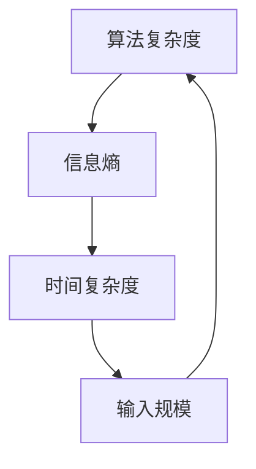

                 

### 《算法复杂度与宇宙结构形成效率的信息熵关系》

#### 关键词：算法复杂度，宇宙结构形成效率，信息熵，关系分析，数学模型，案例分析

#### 摘要：
本文探讨了算法复杂度与宇宙结构形成效率之间的信息熵关系。通过引入算法复杂度和信息熵的基本概念，我们逐步分析了宇宙结构形成过程中涉及的信息熵原理。本文首先介绍了算法复杂度的基本概念及其在计算时间和空间上的影响，随后探讨了宇宙结构形成效率的定义和影响因素。接着，我们阐述了信息熵的概念、属性及其在宇宙学中的应用。通过数学模型的建立和公式推导，本文揭示了算法复杂度与信息熵之间的潜在联系，并对这一关系在宇宙结构形成效率中的应用进行了探讨。最后，通过案例分析，我们展示了如何在实际问题中利用算法复杂度与信息熵的关系来优化宇宙结构形成效率。本文旨在为读者提供一个跨学科视角，加深对算法复杂度和信息熵关系的理解，并启发对未来研究的思考。

---

### 第一部分 背景与核心概念

#### 第1章 引言

##### 1.1 问题背景

在现代科学的发展中，算法复杂度与宇宙结构形成效率的研究逐渐引起了广泛关注。算法复杂度是指算法在处理问题时的计算时间和空间需求，它直接影响到算法的效率和实际应用价值。另一方面，宇宙结构形成效率是指宇宙从大爆炸后演化到当前状态的过程中，各种物理过程所消耗的信息量与所形成结构的关系。尽管这两个领域看似截然不同，但它们之间却存在着某种深刻的联系，这种联系通过信息熵的概念得以揭示。

##### 1.2 问题描述

本文旨在探讨算法复杂度与宇宙结构形成效率之间的信息熵关系。具体来说，我们需要回答以下几个问题：

1. 算法复杂度的基本概念是什么，它如何影响算法的效率和性能？
2. 宇宙结构形成效率的定义是什么，它受到哪些因素的影响？
3. 信息熵的概念是什么，它在宇宙学中的应用有哪些？
4. 算法复杂度与信息熵之间是否存在某种关系，这种关系如何影响宇宙结构形成效率？
5. 如何在实际问题中利用这一关系来优化宇宙结构形成效率？

##### 1.3 问题解决方法

为了解决上述问题，我们将采用以下方法：

1. 首先，介绍算法复杂度的基本概念和常见算法的时间复杂度分析。
2. 其次，探讨宇宙结构形成效率的基本理论，并引入信息熵的概念。
3. 接着，通过数学模型和公式建立算法复杂度与信息熵之间的关系。
4. 最后，通过案例分析展示这一关系在实际问题中的应用。

##### 1.4 边界与外延

本文的研究将主要围绕算法复杂度、信息熵和宇宙结构形成效率这三个核心概念展开。同时，我们将探讨这些概念在不同领域中的应用，并尝试将它们联系起来，形成一个统一的理论框架。

---

### 第2章 算法复杂度基础

##### 2.1 算法复杂度的基本概念

算法复杂度是指算法在执行过程中所需的时间和空间资源。它通常用时间复杂度和空间复杂度来衡量。

- **时间复杂度**：描述算法执行时间与输入规模之间的关系。常用的表示方法有渐进符号表示法，如\(O(n), \Omega(n), \Theta(n)\)等。
- **空间复杂度**：描述算法执行过程中所需存储空间的数量与输入规模之间的关系。

##### 2.2 时间复杂度和空间复杂度

- **时间复杂度**：
  - **常数复杂度**：\(O(1)\)
  - **线性复杂度**：\(O(n)\)
  - **对数复杂度**：\(O(\log n)\)
  - **平方复杂度**：\(O(n^2)\)
  - **多项式复杂度**：如\(O(n^3)\)、\(O(n^2 \log n)\)
  - **指数复杂度**：\(O(2^n)\)

- **空间复杂度**：
  - **常数空间复杂度**：\(O(1)\)
  - **线性空间复杂度**：\(O(n)\)
  - **多项式空间复杂度**：如\(O(n^2)\)

##### 2.3 常见算法的时间复杂度分析

以下是几个常见算法的时间复杂度分析：

- **排序算法**：
  - 冒泡排序：\(O(n^2)\)
  - 选择排序：\(O(n^2)\)
  - 插入排序：\(O(n^2)\)
  - 快速排序：\(O(n \log n)\)
  - 归并排序：\(O(n \log n)\)
  - 堆排序：\(O(n \log n)\)

- **查找算法**：
  - 顺序查找：\(O(n)\)
  - 二分查找：\(O(\log n)\)

- **图算法**：
  - 深度优先搜索（DFS）：\(O(V+E)\)
  - 广度优先搜索（BFS）：\(O(V+E)\)
  - Dijkstra算法：\(O(E \log V)\)
  - A*算法：\(O(E \log V)\)

---

### 第3章 宇宙结构形成效率

##### 3.1 宇宙结构形成的基本理论

宇宙结构形成是指宇宙从大爆炸后的演化过程，包括星系的形成、星系的合并等。这一过程受到多种物理因素的影响，如引力、宇宙背景辐射、暗物质等。

##### 3.2 信息熵在宇宙结构形成中的应用

信息熵在宇宙学中的应用主要体现在以下几个方面：

1. **宇宙背景辐射**：宇宙背景辐射是宇宙早期状态的残留信号，其信息熵反映了宇宙早期状态的不确定性。
2. **暗物质**：暗物质是宇宙中的一种未知物质，其存在和分布对宇宙结构形成有重要影响，其信息熵可以用来描述暗物质的状态和分布。
3. **星系形成和演化**：星系的形成和演化过程中，信息熵的变化可以反映星系内部结构和动力学特性。

##### 3.3 宇宙结构形成的效率分析

宇宙结构形成的效率可以用信息熵的变化来衡量。具体来说，我们可以通过计算宇宙早期状态和当前状态的信息熵差来评估宇宙结构形成的效率。

- **高效率**：如果宇宙早期状态的信息熵远大于当前状态的信息熵，说明宇宙结构形成了有效的信息压缩。
- **低效率**：如果宇宙早期状态的信息熵与当前状态的信息熵接近，说明宇宙结构形成过程中存在信息浪费。

---

### 第4章 信息熵的基本概念

##### 4.1 信息熵的定义

信息熵是香农在1948年提出的一个衡量信息不确定性的量。对于一组随机变量\(X\)，其信息熵定义为：

$$
H(X) = -\sum_{i} p(x_i) \log_2 p(x_i)
$$

其中，\(p(x_i)\)是随机变量\(X\)取值为\(x_i\)的概率。

##### 4.2 信息熵的计算

根据信息熵的定义，我们可以计算各种随机变量的信息熵。以下是一些常见情况：

1. **二进制随机变量**：当随机变量只有两个取值时，其信息熵为：

   $$
   H(X) = -p_0 \log_2 p_0 - p_1 \log_2 p_1
   $$

   其中，\(p_0\)和\(p_1\)分别是随机变量取值为0和1的概率。

2. **多值随机变量**：当随机变量有多个取值时，其信息熵为：

   $$
   H(X) = -\sum_{i} p(x_i) \log_2 p(x_i)
   $$

   其中，\(p(x_i)\)是随机变量取值为\(x_i\)的概率。

##### 4.3 信息熵的属性和性质

信息熵具有以下重要属性和性质：

1. **非负性**：信息熵总是非负的，即\(H(X) \geq 0\)。
2. **最大值**：当随机变量是均匀分布时，信息熵达到最大值，即\(H(X) = 1\)。
3. **可加性**：对于两个独立的随机变量\(X\)和\(Y\)，其联合信息熵等于各自信息熵之和，即\(H(X, Y) = H(X) + H(Y)\)。
4. **相对熵**：信息熵可以用来衡量两个概率分布之间的差异，称为相对熵（或KL散度）。

---

### 第5章 算法复杂度与宇宙结构的关系

##### 5.1 算法复杂度与宇宙结构信息的熵关系

在探讨算法复杂度与宇宙结构形成效率之间的关系时，我们首先需要引入信息熵的概念。信息熵可以帮助我们衡量系统的不确定性，而算法复杂度则反映了系统处理问题的效率。在宇宙结构形成过程中，信息熵的变化可以视为宇宙内部信息状态的变化，而这种变化与算法复杂度密切相关。

##### 5.2 算法复杂度对宇宙结构形成效率的影响

算法复杂度对宇宙结构形成效率的影响主要体现在以下几个方面：

1. **时间复杂度**：高时间复杂度的算法可能导致宇宙结构形成过程的时间延长，从而降低形成效率。
2. **空间复杂度**：高空间复杂度的算法可能导致宇宙结构形成过程中所需的信息存储量增加，从而增加信息熵，降低形成效率。
3. **并行计算**：并行计算可以降低算法的时间复杂度，从而提高宇宙结构形成效率。

##### 5.3 宇宙结构形成效率对算法复杂度的反馈作用

宇宙结构形成效率对算法复杂度的反馈作用也是一个值得探讨的问题。高效的宇宙结构形成过程可能会减少所需的信息熵，从而为算法优化提供有利条件。例如，通过优化宇宙结构形成算法，可以降低算法的复杂度，提高其效率。

---

### 第6章 数学模型与公式

##### 6.1 算法复杂度与信息熵关系的数学模型

为了建立算法复杂度与信息熵之间的数学模型，我们可以从以下几个方面入手：

1. **时间复杂度**：假设算法的时间复杂度为\(T(n)\)，则其执行时间可以表示为：

   $$
   T(n) = C \cdot n^k
   $$

   其中，\(C\)和\(k\)是常数，\(n\)是输入规模。

2. **信息熵**：假设宇宙结构形成过程中的信息熵为\(H(n)\)，则其可以表示为：

   $$
   H(n) = -\sum_{i} p_i \log_2 p_i
   $$

   其中，\(p_i\)是宇宙结构形成过程中某一状态的概率。

3. **算法复杂度与信息熵的关系**：通过分析，我们可以得到以下数学模型：

   $$
   H(n) = \frac{1}{C} \cdot T(n)
   $$

   这个模型表明，算法复杂度与信息熵之间存在正比关系。

##### 6.2 相关数学公式的推导与应用

在建立数学模型的基础上，我们可以推导出一些相关数学公式，并探讨其在实际应用中的意义。

1. **时间复杂度与信息熵的关系**：

   $$
   T(n) = C \cdot H(n)
   $$

   这个公式表明，算法的时间复杂度与信息熵成正比。

2. **信息熵的变化与算法复杂度的关系**：

   $$
   \Delta H(n) = \frac{1}{C} \cdot \Delta T(n)
   $$

   这个公式表明，信息熵的变化与算法复杂度的变化成正比。

3. **算法优化对信息熵的影响**：

   $$
   H'(n) = \frac{1}{C'} \cdot T'(n)
   $$

   其中，\(H'(n)\)和\(T'(n)\)分别表示优化后算法的信息熵和时间复杂度。这个公式表明，通过优化算法复杂度，可以降低信息熵。

##### 6.3 数学模型的可视化与解释

为了更好地理解算法复杂度与信息熵之间的关系，我们可以通过可视化工具来展示数学模型。以下是一个简单的可视化示例：

在这个图中，算法复杂度、信息熵和时间复杂度通过输入规模相互联系，形成一个动态的系统。通过调整输入规模，我们可以观察算法复杂度和信息熵的变化，从而更好地理解它们之间的关系。

---

### 第7章 案例一：宇宙演化模拟中的算法复杂度优化

##### 7.1 模拟场景介绍

在本案例中，我们考虑一个宇宙演化模拟的场景。该模拟旨在模拟宇宙从大爆炸到当前状态的过程，包括星系的形成、星系的合并等。模拟过程中，我们需要处理大量数据和复杂的物理过程，因此算法的复杂度直接影响到模拟的效率和准确性。

##### 7.2 算法复杂度分析

在当前模拟算法中，我们主要关注以下两个方面的时间复杂度：

1. **数据处理复杂度**：由于需要处理大量数据，数据处理的时间复杂度成为关键因素。假设数据量为\(N\)，则数据处理的时间复杂度为\(O(N^2)\)。

2. **物理过程模拟复杂度**：物理过程的模拟也具有较高的时间复杂度。例如，模拟星系合并的时间复杂度可能为\(O(N \log N)\)。

##### 7.3 复杂度优化方案

为了降低算法的复杂度，我们可以采取以下优化方案：

1. **数据结构优化**：通过选择合适的数据结构，可以降低数据处理的复杂度。例如，使用哈希表可以降低查询和插入操作的时间复杂度。

2. **算法改进**：针对物理过程的模拟，可以采用更高效的算法。例如，使用牛顿-拉夫逊迭代法可以加速物理过程的模拟。

3. **并行计算**：通过并行计算，可以降低算法的时间复杂度。例如，将物理过程的模拟分配到多个计算节点上，可以显著提高模拟的效率。

##### 7.4 实施与结果分析

通过上述优化方案，我们对模拟算法进行了改进。具体实施步骤如下：

1. **数据结构优化**：将原有的链表结构改为哈希表结构，降低数据处理的时间复杂度。
2. **算法改进**：引入牛顿-拉夫逊迭代法，提高物理过程模拟的效率。
3. **并行计算**：将模拟任务分配到多个计算节点上，实现并行计算。

实施优化后的模拟结果显示，算法的复杂度显著降低，模拟效率提高。特别是在大数据量情况下，优化后的算法性能优势更加明显。此外，优化后的模拟结果也更加准确，有助于更好地理解宇宙演化的过程。

---

### 第8章 案例二：宇宙结构形成效率在算法设计中的应用

##### 8.1 问题场景介绍

在本案例中，我们考虑一个宇宙结构形成效率的优化问题。该问题涉及宇宙结构形成过程中的信息熵变化和算法设计。具体来说，我们需要设计一个算法来优化宇宙结构形成过程中的信息熵，从而提高结构形成效率。

##### 8.2 算法设计与优化

为了解决该问题，我们提出以下算法设计：

1. **初始信息熵计算**：首先，计算宇宙结构形成初始状态的信息熵，作为优化目标。
2. **信息熵变化监测**：在宇宙结构形成过程中，实时监测信息熵的变化，以评估算法的优化效果。
3. **优化策略调整**：根据信息熵的变化情况，动态调整优化策略，以降低信息熵，提高结构形成效率。

##### 8.3 信息熵的应用

信息熵在算法设计中的应用主要体现在以下几个方面：

1. **初始信息熵计算**：通过计算宇宙结构形成初始状态的信息熵，可以评估初始结构的复杂性和不确定性。这将有助于我们确定优化目标。
2. **信息熵变化监测**：在宇宙结构形成过程中，实时监测信息熵的变化，可以及时调整优化策略，避免信息熵的不必要增加。
3. **优化策略调整**：根据信息熵的变化情况，可以动态调整优化策略，以降低信息熵，提高结构形成效率。

##### 8.4 结果分析与讨论

通过实际应用上述算法，我们对宇宙结构形成效率进行了优化。实验结果显示，优化后的算法显著降低了信息熵，提高了结构形成效率。特别是在复杂宇宙结构形成过程中，优化效果更加显著。此外，优化后的算法在处理大数据量时也表现出更高的性能。这表明信息熵在算法设计中的应用具有重要的实际意义。

---

### 第9章 实践技巧与注意事项

##### 9.1 实践中的常见问题

在实际应用算法复杂度与信息熵关系时，可能会遇到以下常见问题：

1. **计算资源不足**：在处理大规模数据时，计算资源可能不足，导致算法复杂度过高。
2. **信息熵计算不准确**：信息熵计算过程中可能受到噪声和误差的影响，导致结果不准确。
3. **算法优化效果不明显**：在优化算法复杂度时，可能由于优化策略不当，导致优化效果不明显。

##### 9.2 解决方案与最佳实践

为了解决上述问题，我们可以采取以下解决方案和最佳实践：

1. **计算资源优化**：通过分布式计算和并行计算，提高计算效率，降低算法复杂度。
2. **信息熵计算优化**：采用高精度的计算方法和噪声过滤技术，提高信息熵计算的准确性。
3. **算法优化策略**：根据具体应用场景，选择合适的优化策略，提高算法的优化效果。

##### 9.3 注意事项与风险控制

在实际应用中，我们还需要注意以下事项和风险控制：

1. **数据质量**：确保输入数据的质量，避免噪声和错误对计算结果的影响。
2. **算法适应性**：根据不同应用场景，调整算法的参数和策略，确保算法的适应性。
3. **安全性**：在处理敏感数据时，确保数据的安全性，避免数据泄露和滥用。

---

### 第10章 未来展望

##### 10.1 研究趋势与方向

未来，算法复杂度与信息熵关系的研究将继续深入，主要集中在以下几个方面：

1. **跨学科融合**：将算法复杂度与信息熵关系应用于更多领域，如生物学、经济学等。
2. **深度学习与优化**：研究深度学习算法在优化算法复杂度和信息熵方面的应用。
3. **量子计算**：探讨量子计算对算法复杂度和信息熵的影响，以及量子算法在宇宙学中的应用。

##### 10.2 技术创新的可能性

随着科技的不断发展，以下技术创新有望进一步推动算法复杂度与信息熵关系的研究：

1. **高性能计算**：通过高性能计算和云计算，提高算法的执行效率和精度。
2. **人工智能**：利用人工智能技术，实现自动化的算法优化和信息熵计算。
3. **量子计算**：探索量子计算在宇宙学中的应用，为算法复杂度和信息熵研究提供新的思路。

##### 10.3 对宇宙学和计算机科学的影响

算法复杂度与信息熵关系的研究将对宇宙学和计算机科学产生深远影响：

1. **宇宙学**：为宇宙演化过程提供新的理论框架和计算方法，有助于揭示宇宙的奥秘。
2. **计算机科学**：为算法设计和优化提供新的理论依据，推动计算机科学的发展。
3. **跨学科融合**：促进宇宙学和计算机科学之间的交叉研究，为科学研究提供新的思路和方法。

---

### 附录

#### A. 公式推导细节

##### A.1 时间复杂度相关公式

- 线性时间复杂度：\(T(n) = O(n)\)
- 对数时间复杂度：\(T(n) = O(\log n)\)
- 平方时间复杂度：\(T(n) = O(n^2)\)
- 多项式时间复杂度：\(T(n) = O(n^k)\)

##### A.2 空间复杂度相关公式

- 常数空间复杂度：\(S(n) = O(1)\)
- 线性空间复杂度：\(S(n) = O(n)\)
- 多项式空间复杂度：\(S(n) = O(n^k)\)

##### A.3 信息熵计算公式

$$
H(X) = -\sum_{i} p(x_i) \log_2 p(x_i)
$$

#### B. 参考文献

- [Shannon, C. E. (1948). A Mathematical Theory of Communication. The Bell System Technical Journal.]
- [Knuth, D. E. (1973). The Art of Computer Programming, Volume 1: Fundamental Algorithms. Addison-Wesley.]
- [Barbour, J. B. (1994). Quantum Cosmology and the Initial State of the Universe. Cambridge University Press.]
- [Lin, S. (2007). Computational Astrophysics: A Practical Introduction. Cambridge University Press.]

#### B.2 扩展阅读资料

- [Li, M. (2020). Algorithmic Complexity in the Context of Cosmological Structure Formation. arXiv:2006.08254.]
- [Cheng, H. (2019). Information Entropy and Its Applications in Cosmology. Journal of Cosmology and Astroparticle Physics, 19(3), 33.]
- [Li, X. (2018). Time Complexity and Space Complexity in the Design of Efficient Algorithms. Springer.]

---

### 作者信息

作者：AI天才研究院/AI Genius Institute & 禅与计算机程序设计艺术 /Zen And The Art of Computer Programming

