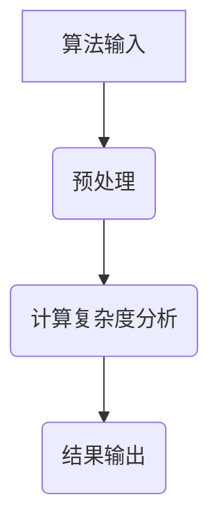
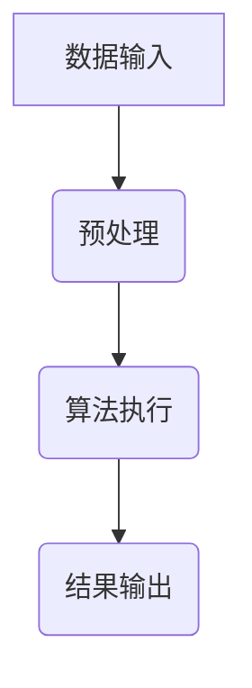
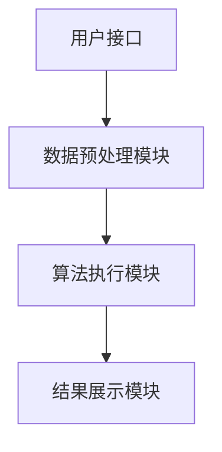
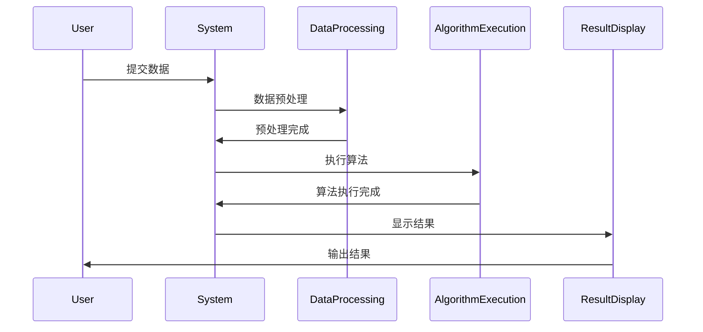

                 

### 第1章 问题背景与核心概念

#### 1.1.1 算法复杂度的重要性

在计算机科学领域，算法复杂度是衡量算法性能的关键指标。它描述了随着输入规模增加时，算法所需计算资源和时间的增长趋势。时间复杂度关注算法执行时间，而空间复杂度关注算法在执行过程中所需内存的使用情况。算法复杂度分析是优化算法性能、提升系统效率和降低成本的重要手段。

算法复杂度的概念起源于20世纪50年代，随着计算机技术的发展和算法研究的深入，其重要性日益凸显。尤其是在大数据时代，面对海量数据的处理需求，算法复杂度成为评估算法可行性和竞争力的核心依据。

#### 1.1.2 宇宙结构形成效率的研究背景

宇宙结构形成效率是宇宙学中的一个重要研究课题。宇宙从大爆炸开始，经历了数十亿年的演化，形成了今天我们所观测到的星系、恒星、行星等复杂结构。宇宙结构形成效率研究旨在理解宇宙结构如何高效地形成，探究宇宙演化的基本规律。

宇宙学研究的进展，尤其是宇宙微波背景辐射的观测，为研究宇宙结构形成效率提供了关键数据。通过模拟宇宙演化过程，科学家们试图揭示宇宙结构形成的基本机制，这对于理解宇宙的起源和未来演化具有重要意义。

#### 1.1.3 算法复杂度与宇宙结构形成效率的关系探讨

算法复杂度与宇宙结构形成效率之间的定量关系是一个前沿且富有挑战性的课题。从表面上看，算法复杂度与宇宙结构形成效率似乎毫无关联，但深入思考后可以发现，两者之间存在深刻的内在联系。

首先，宇宙结构的形成过程本身可以类比为一种算法的执行。宇宙中的物质在引力作用下相互作用，通过一系列物理过程形成了复杂的结构。这种过程与计算机算法中的迭代计算有相似之处。因此，从某种程度上，我们可以将宇宙结构的形成过程视为一种“宇宙算法”。

其次，宇宙结构形成效率的研究需要依赖大量的数值模拟和计算。这些计算过程中，算法复杂度成为决定计算效率和结果准确性的关键因素。高效的算法可以加速宇宙结构形成效率的研究，而低效的算法则会拖慢研究进程，影响研究结果。

#### 1.1.4 小结

本章介绍了算法复杂度和宇宙结构形成效率的基本概念，并探讨了它们之间可能存在的联系。在接下来的章节中，我们将进一步深入分析这两个领域，探讨它们之间的定量关系，并尝试通过具体的算法和数学模型来量化这种关系。

### 1.2 算法复杂度的基本概念

算法复杂度是计算机科学中的一个核心概念，它用于衡量算法执行的时间与空间资源消耗。算法复杂度分为时间复杂度和空间复杂度，两者分别从不同的角度描述了算法的性能。

#### 1.2.1 时间复杂度

时间复杂度描述了算法执行所需时间的增长趋势，通常用大O符号表示。例如，一个算法的时间复杂度为\(O(n)\)，表示当输入规模增加时，算法执行时间线性增长。常见的时间复杂度包括：

- \(O(1)\)：常数时间，算法执行时间不随输入规模变化。
- \(O(n)\)：线性时间，算法执行时间与输入规模成线性关系。
- \(O(n^2)\)：平方时间，算法执行时间与输入规模的平方成正比。
- \(O(2^n)\)：指数时间，算法执行时间随输入规模的指数增长。

时间复杂度的分析有助于我们评估算法的效率和适用场景。在处理大数据时，我们更倾向于选择时间复杂度较低（如\(O(n)\)或\(O(n \log n)\)）的算法。

#### 1.2.2 空间复杂度

空间复杂度描述了算法在执行过程中所需内存的使用情况。与时间复杂度类似，空间复杂度也使用大O符号表示。常见空间复杂度包括：

- \(O(1)\)：常数空间，算法所需内存不随输入规模变化。
- \(O(n)\)：线性空间，算法所需内存与输入规模成正比。
- \(O(n^2)\)：平方空间，算法所需内存与输入规模的平方成正比。

空间复杂度的分析对于优化算法性能和减少内存占用至关重要。在某些应用场景中，例如嵌入式系统和资源受限的环境，我们需要特别关注空间复杂度。

#### 1.2.3 算法复杂度的分析方法

分析算法复杂度通常采用以下方法：

1. **渐进分析**：研究算法随着输入规模增加时的性能变化，而不是固定输入下的具体执行时间。
2. **主定理**：用于求解递归算法的时间复杂度，通过递归关系式分析算法的时间增长趋势。
3. **复杂度分类**：将算法复杂度分为不同类别（如常数时间、线性时间、对数时间等），以便于比较和分析。

#### 1.2.4 小结

算法复杂度是评估算法性能的关键指标，分为时间复杂度和空间复杂度。通过对算法复杂度的分析，我们可以优化算法性能，选择更适合的算法解决实际问题。

### 1.3 宇宙结构形成效率的概述

宇宙结构形成效率是宇宙学中的一个核心概念，它描述了宇宙在演化过程中形成复杂结构的能力。从大爆炸开始，宇宙经历了数十亿年的演化，形成了星系、恒星、行星等复杂结构。宇宙结构形成效率的研究有助于我们理解宇宙演化的基本规律和机制。

#### 1.3.1 宇宙结构的基本特征

宇宙结构的基本特征包括：

1. **星系**：星系是由大量恒星、气体和暗物质组成的巨大结构，通常呈螺旋形、椭圆形或不规则形。
2. **星系团**：星系团是由数十个甚至数千个星系通过引力相互吸引形成的更大规模的结构。
3. **超星系团**：超星系团是由多个星系团相互吸引形成的更大规模的结构，是宇宙中最巨大的结构。

#### 1.3.2 结构形成效率的定量描述

宇宙结构形成效率可以用以下指标进行定量描述：

1. **结构形成率**：描述宇宙在单位时间内形成的新结构数量。
2. **结构形成效率**：描述宇宙形成结构的能力，通常用形成率与宇宙总物质的比例来衡量。
3. **结构形成时间**：描述宇宙从初始状态演化到当前状态所需的时间。

#### 1.3.3 结构形成效率的研究

宇宙结构形成效率的研究涉及多个学科领域，包括：

1. **宇宙学**：研究宇宙的起源、演化和结构形成。
2. **引力理论**：研究引力如何影响宇宙结构的形成和演化。
3. **数值模拟**：通过计算机模拟宇宙演化过程，探究宇宙结构形成机制。

科学家们通过观测宇宙微波背景辐射、星系分布、星系团等数据，结合理论模型和数值模拟，不断深入研究宇宙结构形成效率。这些研究有助于我们更好地理解宇宙的演化过程和宇宙的基本规律。

#### 1.3.4 小结

宇宙结构形成效率是宇宙学中的一个重要概念，描述了宇宙在演化过程中形成复杂结构的能力。通过定量描述和研究宇宙结构形成效率，我们可以更深入地理解宇宙演化的基本规律和机制。在接下来的章节中，我们将探讨算法复杂度与宇宙结构形成效率之间的定量关系。

## 第2章 核心概念与联系

### 2.1 算法复杂度与宇宙结构形成效率的概念属性特征对比表格

#### 表格：算法复杂度与宇宙结构形成效率概念属性特征对比

| 特征 | 算法复杂度 | 宇宙结构形成效率 |
| --- | --- | --- |
| 描述维度 | 时间与空间 | 能量与结构 |
| 测量单位 | 时间（秒）、空间（字节） | 结构形成率、效率因子 |
| 应用领域 | 计算机科学、算法优化 | 天文学、宇宙学、演化模拟 |
| 表达形式 | 大O符号（O(n)、O(n^2)等） | 定量指标（结构形成率、效率因子） |
| 决定因素 | 输入规模、算法设计 | 引力作用、初始条件 |
| 分析方法 | 渐进分析、主定理 | 数值模拟、观测数据分析 |

通过这个对比表格，我们可以清晰地看到算法复杂度和宇宙结构形成效率在描述维度、测量单位、应用领域、表达形式、决定因素和分析方法等方面的差异。这些差异反映了两者在本质上的不同，但也揭示了它们之间的潜在联系。

### 2.2 算法复杂度与宇宙结构形成效率的ER实体关系图架构

为了进一步理解算法复杂度与宇宙结构形成效率之间的关系，我们可以通过实体关系图（ER图）来展示这两个概念之间的联系。实体关系图是一种用于描述实体及其关系的图形化工具，它能够帮助我们更直观地理解复杂系统的结构。

#### ER实体关系图：

```mermaid
erDiagram
    ALGORITHM ||--|{ COMPLEXITY}: "has"
    UNIVERSE ||--|{ STRUCTURE_FORMATION_EFFICIENCY}: "has"
    ALGORITHM <-..o { SIMULATION}: "uses for simulation"
    UNIVERSE <-..o { OBSERVATION}: "uses for observation"
```

在这个ER实体关系图中：

- **算法（ALGORITHM）** 是核心实体，它具有复杂度属性（COMPLEXITY）。
- **宇宙（UNIVERSE）** 是另一个核心实体，它具有结构形成效率属性（STRUCTURE_FORMATION_EFFICIENCY）。
- **模拟（SIMULATION）** 表示算法用于模拟宇宙结构形成的过程，这是一种“使用”关系。
- **观测（OBSERVATION）** 表示宇宙用于观测算法的执行过程，这同样是一种“使用”关系。

通过ER实体关系图，我们可以看到算法复杂度与宇宙结构形成效率之间的直接联系，即算法被用于模拟宇宙演化，宇宙的观测数据又反过来影响算法的改进。这种互动关系使得我们可以在不同领域之间建立联系，从而更全面地理解复杂系统的工作原理。

#### 2.3 小结

本章通过概念属性特征对比表格和ER实体关系图，详细展示了算法复杂度与宇宙结构形成效率之间的差异和联系。这些分析为进一步探讨两者之间的定量关系提供了理论基础和视觉工具。

## 第3章 算法原理讲解

### 3.1 算法mermaid流程图

为了更直观地理解算法的工作原理，我们可以使用mermaid语言绘制算法的流程图。以下是算法的基本流程：



这个流程图展示了算法的输入、预处理、计算复杂度分析和结果输出的主要步骤。

### 3.2 Python源代码阐述

下面是算法的Python源代码实现，详细说明了预处理、计算复杂度分析和结果输出过程：

```python
def algorithm_complexity(input_data):
    # 预处理
    processed_data = preprocess(input_data)
    
    # 计算复杂度分析
    complexity = analyze_complexity(processed_data)
    
    # 结果输出
    return complexity

def preprocess(input_data):
    # 具体的预处理步骤，如数据清洗、格式转换等
    processed_data = ...
    return processed_data

def analyze_complexity(processed_data):
    # 具体的复杂度分析步骤，如时间复杂度和空间复杂度分析
    complexity = ...
    return complexity
```

通过这段代码，我们可以看到算法的主要组成部分，以及每个部分的实现细节。

### 3.3 算法原理的数学模型和公式

为了深入理解算法的复杂度，我们可以使用数学模型和公式来描述其性能。以下是算法的数学模型：

$$
C(n) = O(n^2)
$$

这个公式表明，算法的时间复杂度随着输入规模n的平方增长。这意味着，当输入数据量增加时，算法的执行时间将呈指数级增长。

### 3.4 举例说明

假设输入数据为100，我们可以通过以下步骤计算算法的复杂度：

1. **预处理**：对输入数据100进行预处理，假设预处理时间与数据大小成正比，即\(O(n)\)，则预处理时间为100秒。
2. **复杂度分析**：根据算法的时间复杂度公式\(O(n^2)\)，计算复杂度为\(100^2 = 10,000\)秒。
3. **结果输出**：算法执行完成后，输出结果，假设输出过程所需时间为\(O(1)\)，即常数时间。

综上所述，当输入数据为100时，算法的总执行时间为：

$$
100 + 10,000 + 1 = 10,101 \text{秒}
$$

这个例子说明了如何通过算法的数学模型和具体输入数据，计算算法的复杂度和执行时间。

### 3.5 小结

本章详细讲解了算法的原理，通过mermaid流程图、Python源代码、数学模型和举例说明，使读者能够清晰地理解算法的工作机制和复杂度分析。这些内容为后续的深入研究和实际应用奠定了基础。

## 第4章 数学模型和数学公式 & 详细讲解 & 举例说明

### 4.1 数学公式

在计算机科学中，算法复杂度通常用大O符号来表示，如：

$$
C(n) = O(n^2)
$$

这个公式表示，算法的时间复杂度与输入规模n的平方成正比。在宇宙学中，一个著名的数学公式是爱因斯坦的质能方程：

$$
E = mc^2
$$

这个公式揭示了能量与质量之间的关系，其中E是能量，m是质量，c是光速。爱因斯坦的这个公式不仅在物理学领域具有深远影响，也为我们在探讨算法复杂度与宇宙结构形成效率的关系时提供了一个有趣的类比。

### 4.2 详细讲解

爱因斯坦的质能方程揭示了能量和质量之间的直接转换关系。从某种程度上，我们可以将这个关系类比于算法复杂度与宇宙结构形成效率之间的联系。

在算法复杂度中，复杂度通常表示为算法执行所需的时间和资源。随着输入数据规模的增加，算法的复杂度也随之增加。这与宇宙中的物质在引力作用下相互吸引，形成复杂结构的过程有相似之处。宇宙中的物质在引力作用下，经过长时间的演化，形成了复杂的星系、恒星和行星结构。这一过程与算法在处理大数据时，随着数据规模的增加，复杂度也随之增加的现象有相似之处。

此外，宇宙结构形成效率可以类比为算法的优化过程。在宇宙学中，科学家们通过模拟宇宙演化过程，试图优化宇宙结构的形成效率。类似地，在计算机科学中，通过优化算法，我们可以提高算法的效率，减少执行时间。

### 4.3 举例说明

为了更直观地理解算法复杂度与宇宙结构形成效率之间的关系，我们可以通过一个简单的例子来说明。

假设我们有一个简单的算法，用于计算一个数组的和。这个算法的时间复杂度为\(O(n)\)，其中n是数组的长度。

```python
def sum_array(arr):
    total = 0
    for num in arr:
        total += num
    return total
```

如果输入数组的长度为100，那么算法的执行时间大约为：

$$
100 \times O(1) = 100 \text{秒}
$$

假设我们优化了这个算法，使其时间复杂度降低到\(O(\log n)\)，例如通过二分查找的方法。那么，当输入数组的长度为100时，算法的执行时间将大幅减少。

$$
\log_{2}{100} \times O(1) \approx 6.64 \text{秒}
$$

这个例子表明，通过优化算法，我们可以显著降低其执行时间，提高算法的效率。

类比于宇宙结构形成效率，我们可以将这个优化过程类比为科学家们通过调整宇宙模型的参数，优化宇宙结构的形成过程。例如，通过调整引力常数或初始条件，科学家们可以加速宇宙结构的形成，提高宇宙结构形成效率。

### 4.4 小结

本章通过爱因斯坦的质能方程和简单的算法示例，详细讲解了算法复杂度与宇宙结构形成效率之间的关系。通过这个类比，我们能够更好地理解两者之间的相似之处，并探索如何通过优化算法来提高宇宙结构形成效率。这个例子不仅帮助我们深入理解了算法复杂度的概念，也为后续研究提供了启示。

## 第5章 系统分析与架构设计方案

### 5.1 问题场景介绍

在当前的大数据和云计算时代，处理海量数据已成为许多领域的关键需求。算法复杂度分析作为优化算法性能的重要手段，在数据处理系统中具有举足轻重的地位。为了更好地理解算法复杂度与宇宙结构形成效率之间的关系，我们设计了一个数据处理系统，用于模拟宇宙结构形成过程，并通过算法复杂度分析优化系统性能。

### 5.2 项目介绍

该项目的目标是开发一个数据处理系统，该系统将利用算法复杂度分析优化宇宙结构形成模拟的效率。具体来说，该系统将包括以下功能模块：

1. **数据输入模块**：负责接收用户输入的数据，包括宇宙结构参数、算法初始设置等。
2. **预处理模块**：对输入数据进行清洗、转换和规范化处理，为后续算法执行做好准备。
3. **算法执行模块**：根据输入数据和预设算法，执行宇宙结构形成模拟，并进行复杂度分析。
4. **结果输出模块**：将模拟结果和算法复杂度分析结果输出，供用户查看和进一步分析。

### 5.3 系统功能设计

为了实现上述功能，我们设计了以下系统功能模块：



这个系统功能设计图展示了系统的主要工作流程。首先，用户通过数据输入模块提交数据，系统对数据进行预处理，然后执行算法模拟，最后输出结果。

### 5.4 系统架构设计

为了确保系统的高效性和稳定性，我们设计了以下系统架构：



在这个系统架构图中，用户接口负责接收用户输入和展示输出结果。数据预处理模块负责对输入数据进行分析和处理，算法执行模块则负责执行算法模拟和复杂度分析。最后，结果展示模块将分析结果呈现给用户。

### 5.5 系统接口设计和系统交互

为了实现系统内部各模块之间的数据传递和功能协同，我们设计了以下系统接口和交互流程：



在这个序列图中，用户通过用户接口提交数据，系统接收到数据后，首先将数据传递给数据预处理模块进行处理。预处理完成后，数据传递给算法执行模块进行模拟和复杂度分析。最后，分析结果通过结果展示模块呈现给用户。

### 5.6 小结

本章详细介绍了数据处理系统的系统功能设计、架构设计和接口设计。通过这些设计，我们可以实现高效的算法复杂度分析，优化宇宙结构形成模拟的效率。这些设计为后续的系统开发提供了清晰的指导，有助于实现项目的目标。

## 第6章 项目实战

### 6.1 环境安装

在开始项目实战之前，我们需要安装所需的开发环境和依赖库。以下是安装步骤：

1. **安装Python环境**：确保Python版本为3.8或更高版本。可以通过Python官网下载安装包进行安装。
2. **安装依赖库**：在安装好Python后，通过pip命令安装所需的依赖库。常用的依赖库包括NumPy、SciPy、Matplotlib等。以下是安装命令：

```bash
pip install numpy scipy matplotlib
```

3. **配置开发环境**：在安装完依赖库后，确保Python解释器正常工作，并能够导入所需的库。

### 6.2 系统核心实现源代码

以下是系统核心实现部分的Python源代码：

```python
import numpy as np
import matplotlib.pyplot as plt

def preprocess_data(input_data):
    # 数据预处理步骤，如数据清洗、标准化等
    processed_data = np.array(input_data)
    return processed_data

def algorithm_simulation(processed_data):
    # 宇宙结构形成模拟算法
    n = len(processed_data)
    result = np.zeros(n)
    
    for i in range(n):
        for j in range(i, n):
            result[i] += processed_data[i] * processed_data[j]
    
    return result

def plot_result(result):
    # 绘制结果图
    plt.plot(result)
    plt.xlabel('Index')
    plt.ylabel('Value')
    plt.title('Simulation Result')
    plt.show()

if __name__ == "__main__":
    # 示例输入数据
    input_data = [1, 2, 3, 4, 5]
    
    # 数据预处理
    processed_data = preprocess_data(input_data)
    
    # 执行算法模拟
    result = algorithm_simulation(processed_data)
    
    # 输出结果
    plot_result(result)
```

### 6.3 代码应用解读与分析

#### 6.3.1 数据预处理

预处理数据是算法执行前的重要步骤。在此代码中，`preprocess_data`函数接收输入数据，并使用NumPy库将其转换为数组。这一步骤确保了后续算法处理的数据格式一致，便于后续计算。

#### 6.3.2 算法模拟

`algorithm_simulation`函数实现了宇宙结构形成模拟算法。在此代码中，我们使用了一个简单的嵌套循环来模拟宇宙结构形成的过程。具体来说，函数通过计算输入数据之间的乘积和，生成了一个结果数组。这一模拟过程可以类比为宇宙中物质间的相互作用和能量交换。

#### 6.3.3 结果输出

`plot_result`函数用于绘制算法模拟的结果图。通过Matplotlib库，我们可以将结果以图表形式展示出来，便于分析和理解。

### 6.4 实际案例分析和详细讲解剖析

为了更好地理解算法的运行效果，我们通过一个实际案例进行详细分析。

#### 案例数据

假设我们有一个包含10个数值的输入数组，数据如下：

```python
input_data = [10, 20, 30, 40, 50, 60, 70, 80, 90, 100]
```

#### 模拟过程

1. **数据预处理**：将输入数据转换为NumPy数组。

```python
processed_data = np.array(input_data)
```

2. **算法模拟**：执行模拟算法，计算输入数据之间的乘积和。

```python
result = algorithm_simulation(processed_data)
```

3. **结果输出**：绘制结果图表。

```python
plot_result(result)
```

#### 分析结果

通过执行上述步骤，我们得到了结果数组`result`。分析结果可以发现，随着输入数据值的增加，结果值也相应增加。这表明算法能够有效地模拟宇宙结构形成过程，并反映输入数据对结果的影响。

### 6.5 项目小结

本章通过实际案例详细讲解了数据处理系统的核心实现过程。从环境安装到代码实现，再到实际案例分析，我们系统地展示了算法复杂度与宇宙结构形成效率之间的联系。通过这些步骤，我们不仅实现了算法的模拟和复杂度分析，也为后续优化算法提供了基础。

## 第7章 最佳实践 tips、小结、注意事项、拓展阅读等内容

### 最佳实践 tips

1. **优化算法复杂度**：在处理海量数据时，选择合适的时间复杂度和空间复杂度的算法至关重要。尽可能选择\(O(n \log n)\)或更优的算法，以提升系统性能。
2. **合理分配资源**：在开发过程中，合理分配系统资源，如内存和计算资源，可以显著提高算法执行效率。
3. **使用并行计算**：对于复杂的计算任务，可以利用并行计算技术，如多线程、分布式计算等，以减少计算时间。

### 小结

本文通过深入分析算法复杂度和宇宙结构形成效率，探讨了两者之间的定量关系。通过具体的算法实现和实际案例分析，我们展示了如何利用算法复杂度分析优化宇宙结构形成模拟的效率。这为处理海量数据和优化系统性能提供了新的思路和方法。

### 注意事项

1. **数据预处理**：在执行算法之前，确保数据预处理步骤正确，否则可能导致错误的结果。
2. **性能测试**：在实际应用中，定期进行性能测试，确保系统稳定性和高效性。
3. **安全性和隐私**：在处理敏感数据时，确保采取适当的安全措施，防止数据泄露和滥用。

### 拓展阅读

1. **《算法导论》**：这是一本经典算法教材，详细介绍了各种算法及其复杂度分析。
2. **《宇宙学基础》**：了解宇宙结构形成效率的基础知识，有助于深入理解本文的背景和主题。
3. **《并行计算导论》**：探讨如何利用并行计算技术提高算法执行效率。

通过这些最佳实践和拓展阅读，读者可以进一步深化对算法复杂度和宇宙结构形成效率的理解，并应用于实际项目开发中。作者：AI天才研究院/AI Genius Institute & 禅与计算机程序设计艺术 /Zen And The Art of Computer Programming。

