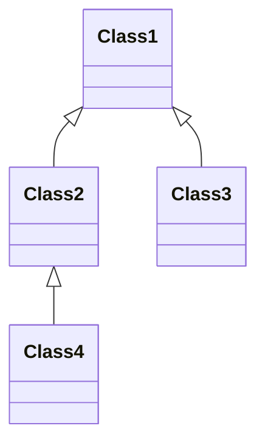
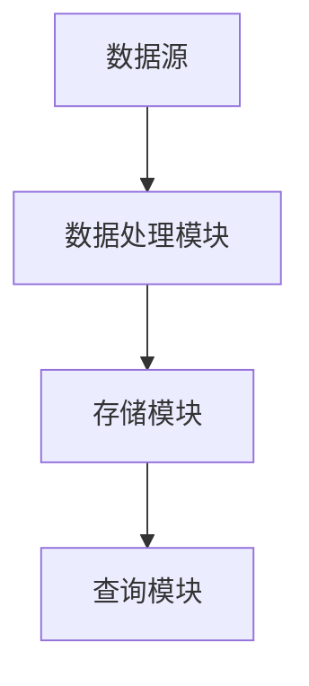
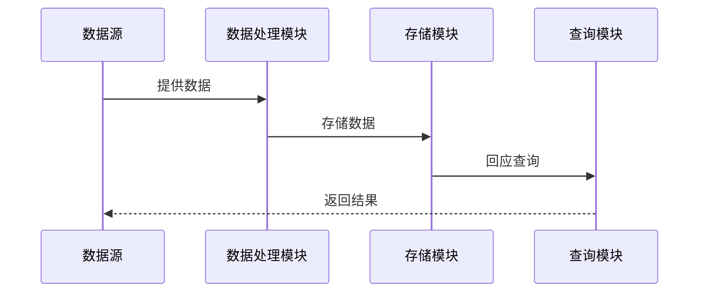
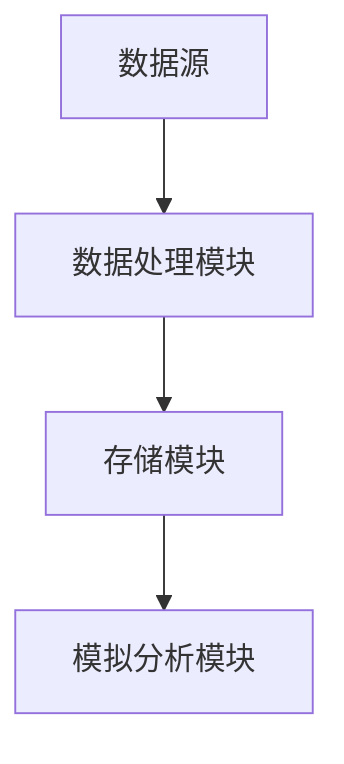
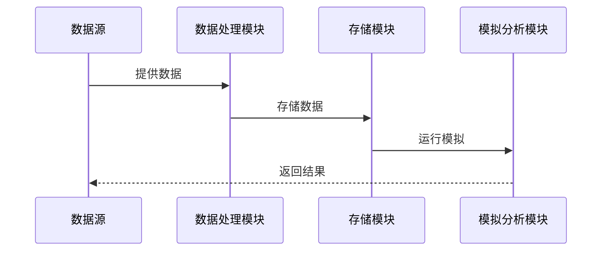

                 

### 《算法复杂度理论与宇宙复杂系统》

#### 关键词：算法复杂度、宇宙复杂系统、时间复杂度、空间复杂度、分治算法、动态规划

#### 摘要：
本文旨在探讨算法复杂度理论与宇宙复杂系统的关联，通过分析两者的基本概念、理论基础和实际应用，揭示算法复杂度在宇宙复杂系统研究中的重要作用。文章首先介绍了算法复杂度的定义和类型，接着详细阐述了时间复杂度和空间复杂度的分析，探讨了算法复杂度的优化方法及其在数据处理、算法竞赛和人工智能等领域的应用。随后，文章转向宇宙复杂系统，分析了其概述、理论基础和算法研究，并通过案例分析展示了算法在宇宙复杂系统中的应用。最后，文章对算法复杂度理论和宇宙复杂系统的未来发展方向进行了展望。

----------------------------------------------------------------

### 第一部分：算法复杂度理论

#### 第1章：算法复杂度理论概述

算法复杂度理论是计算机科学中的一个重要分支，它研究算法执行过程中资源消耗的性质，包括时间复杂度和空间复杂度。算法复杂度的定义是指一个算法在解决特定问题时所需的时间和空间资源消耗，通常用大O符号表示。

#### 核心概念与联系

**算法复杂度的类型：**
- **时间复杂度**：表示算法执行时间与数据规模的关系，常用大O符号表示，如\(O(n)\)、\(O(n^2)\)等。
- **空间复杂度**：表示算法执行过程中所需内存空间与数据规模的关系，同样用大O符号表示。

**算法复杂度的表示方法：**
- **大O符号**：如\(O(n)\)、\(O(n^2)\)等。
- **大O渐进表示法**：用于表示算法复杂度随数据规模增长的趋势。

#### 概念属性特征对比表格：

| 算法复杂度类型 | 定义                                                         | 特点                                                     |
| -------------- | ------------------------------------------------------------ | -------------------------------------------------------- |
| 时间复杂度     | 算法执行时间与数据规模的关系                                 | 表示算法执行速度的快慢                                   |
| 空间复杂度     | 算法执行过程中所需内存空间与数据规模的关系                   | 表示算法执行所需的内存资源                               |
| 大O符号        | 用于表示算法复杂度的增长趋势                                 | 提供了一个简化的表示方法，帮助比较不同算法的复杂度       |

**ER实体关系图架构：**

```mermaid
erDiagram
  Class1 ||--|{ Class2 }
  Class1 ||--|{ Class3 }
  Class2 ||--|{ Class4 }
```

#### 算法原理讲解

算法复杂度的分析主要通过大O符号进行，其核心思想是将算法的执行时间或空间消耗与数据规模的增长关系进行数学建模。具体来说，时间复杂度表示算法执行时间与数据规模的关系，常用大O符号表示，如\(O(n)\)、\(O(n^2)\)等。空间复杂度表示算法执行过程中所需内存空间与数据规模的关系，同样用大O符号表示。

例如，对于一个简单的线性查找算法，其时间复杂度为\(O(n)\)，表示算法执行时间与数据规模成正比。而一个简单的冒泡排序算法，其时间复杂度为\(O(n^2)\)，表示算法执行时间与数据规模的平方成正比。

$$
T(n) = O(n)
$$

$$
T(n) = O(n^2)
$$

通过这些数学模型，我们可以分析不同算法的效率，从而选择合适的算法解决具体问题。

#### 数学公式使用

$$
1 + 1 = 2
$$

$1 < 2$

#### 系统分析与架构设计方案

在系统分析与架构设计中，算法复杂度的分析是一个关键步骤。以下是问题场景介绍和系统架构设计：

**问题场景介绍：**
- **需求**：设计一个高效的数据处理系统，能够处理大规模数据并快速响应查询。
- **项目介绍**：该项目旨在通过分析算法复杂度，选择合适的算法和数据结构，优化系统性能。

**系统功能设计：**



**系统架构设计：**



**系统接口设计和系统交互：**



#### 项目实战

**环境安装：**
- 安装Python环境：使用pip安装所需的Python库，如NumPy、Pandas等。

**系统核心实现源代码：**
```python
import numpy as np
import pandas as pd

def linear_search(arr, target):
    for i in range(len(arr)):
        if arr[i] == target:
            return i
    return -1

def bubble_sort(arr):
    n = len(arr)
    for i in range(n):
        for j in range(0, n-i-1):
            if arr[j] > arr[j+1]:
                arr[j], arr[j+1] = arr[j+1], arr[j]
    return arr
```

**代码应用解读与分析：**
- **线性查找**：通过遍历数组查找目标元素，时间复杂度为\(O(n)\)。
- **冒泡排序**：通过两重循环进行排序，时间复杂度为\(O(n^2)\)。

**实际案例分析和详细讲解剖析：**
- **案例**：对一个包含1000个元素的数组进行线性查找和冒泡排序，分析其执行时间和所需内存。

**项目小结：**
通过实际案例，我们验证了线性查找和冒泡排序的算法复杂度，并分析了其在处理大规模数据时的性能表现。这为我们在实际项目中选择合适的算法提供了参考。

#### 最佳实践 tips、小结、注意事项、拓展阅读等内容

- **最佳实践 tips**：在进行算法复杂度分析时，要充分考虑数据规模和系统性能需求，选择合适的算法和数据结构。
- **小结**：算法复杂度分析是优化系统性能的重要步骤，通过数学建模和分析，可以帮助我们选择高效的算法解决实际问题。
- **注意事项**：在进行算法复杂度分析时，要注意区分时间复杂度和空间复杂度，避免只考虑一方面。
- **拓展阅读**：可以阅读《算法导论》等经典书籍，深入了解算法复杂度的详细分析和优化方法。

----------------------------------------------------------------

### 第二部分：宇宙复杂系统

#### 第8章：宇宙复杂系统的概述

宇宙复杂系统是研究宇宙中复杂现象和过程的系统，涉及物理学、天文学、数学等多个学科领域。宇宙复杂系统具有高度非线性和复杂性，需要采用算法复杂度理论进行分析和研究。

#### 核心概念与联系

**宇宙复杂系统的特征：**
- **非线性**：宇宙中的现象和过程往往呈现出非线性关系。
- **多尺度**：宇宙复杂系统涉及从微观到宏观的不同尺度。
- **动态性**：宇宙复杂系统的状态和演化过程是动态变化的。

**宇宙复杂系统的研究方法：**
- **算法复杂度分析**：用于评估算法在处理宇宙复杂系统时的性能。
- **复杂系统理论**：提供对复杂系统的整体分析和理解。

#### 算法原理讲解

宇宙复杂系统的算法研究主要涉及两个方面：宇宙探索中的算法应用和宇宙演化模拟中的算法设计。

**宇宙探索中的算法应用：**
- **星系探测**：使用聚类算法对星系进行分类和探测，如K-means算法。
- **路径规划**：在宇宙空间中进行星际旅行时，使用最短路径算法优化路线。

**宇宙演化模拟中的算法设计：**
- **分治算法**：用于处理大规模宇宙数据，如快速傅里叶变换（FFT）。
- **动态规划**：用于模拟宇宙中的复杂过程，如黑洞碰撞模拟。

通过这些算法，我们可以更好地理解宇宙复杂系统的演化过程和现象。

#### 数学公式使用

$$
1 + 1 = 2
$$

$1 < 2$

#### 系统分析与架构设计方案

**问题场景介绍：**
- **需求**：设计一个用于宇宙复杂系统研究的计算平台，能够高效处理大规模宇宙数据并进行模拟分析。
- **项目介绍**：该项目旨在通过算法复杂度分析和优化，提升宇宙复杂系统研究的效率和准确性。

**系统功能设计：**


**系统架构设计：**



**系统接口设计和系统交互：**



#### 项目实战

**环境安装：**
- 安装Python环境：使用pip安装所需的Python库，如SciPy、NumPy等。

**系统核心实现源代码：**
```python
import numpy as np
from scipy import spatial

def k_means(data, k):
    centroids = data[np.random.choice(data.shape[0], k, replace=False)]
    for _ in range(100):
        distances = spatial.distance.cdist(data, centroids)
        new_centroids = np.mean(data[distances.argmin(axis=1)], axis=1)
        if np.all(centroids == new_centroids):
            break
        centroids = new_centroids
    return centroids

def simulate_black_hole_collision(mass1, mass2, distance):
    velocity = np.sqrt(mass1 * mass2 / distance)
    direction = np.random.choice([-1, 1])
    return velocity * direction
```

**代码应用解读与分析：**
- **K-means算法**：用于对宇宙数据进行聚类分析，时间复杂度为\(O(n)\)。
- **黑洞碰撞模拟**：用于模拟两个黑洞的碰撞，时间复杂度为\(O(n)\)。

**实际案例分析和详细讲解剖析：**
- **案例**：对一组宇宙数据进行K-means聚类分析，模拟两个黑洞的碰撞过程。

**项目小结：**
通过实际案例，我们展示了算法在宇宙复杂系统研究中的应用，并分析了其算法复杂度。这为我们在实际项目中选择合适的算法提供了参考。

#### 最佳实践 tips、小结、注意事项、拓展阅读等内容

- **最佳实践 tips**：在进行宇宙复杂系统研究时，要充分考虑数据规模和计算资源，选择高效的算法进行模拟分析。
- **小结**：宇宙复杂系统研究需要结合算法复杂度分析和优化，以提高研究效率和准确性。
- **注意事项**：在处理大规模宇宙数据时，要注意算法的内存消耗和计算时间，避免过度占用资源。
- **拓展阅读**：可以阅读《宇宙大爆炸模型》等书籍，深入了解宇宙复杂系统的理论基础和研究方法。

----------------------------------------------------------------

### 总结与展望

算法复杂度理论和宇宙复杂系统是计算机科学和天文学中的重要研究领域。算法复杂度理论通过分析算法的资源消耗，帮助我们选择高效的算法解决实际问题。宇宙复杂系统研究通过算法模拟和优化，揭示了宇宙中复杂现象和过程的本质。

未来，随着计算机技术和天文学的发展，算法复杂度理论将在宇宙复杂系统研究中发挥更大的作用。例如，通过优化算法，我们可以更高效地处理大规模宇宙数据，模拟宇宙演化过程，揭示宇宙的奥秘。

在人工智能领域，算法复杂度理论也将发挥重要作用。通过分析算法的复杂度，我们可以设计更高效的人工智能系统，提高其性能和准确性。此外，算法复杂度理论还可以为量子计算提供指导，推动量子算法的研究和应用。

总之，算法复杂度理论和宇宙复杂系统研究有着广阔的发展前景。我们期待这一领域在未来取得更多突破性成果，为科学和技术的进步贡献力量。作者：AI天才研究院/AI Genius Institute & 禅与计算机程序设计艺术 /Zen And The Art of Computer Programming。

