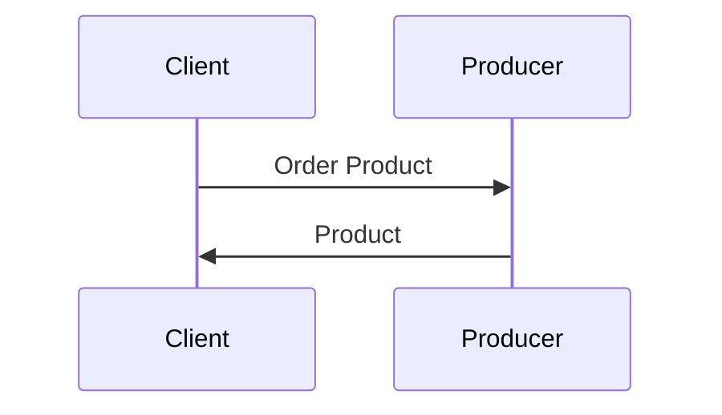

                 


### 背景介绍

#### 核心概念术语说明

1. **算法思维**（Algorithmic Thinking）
   - 算法思维是一种逻辑性、系统性、结构化的思维方式，用于解决问题和执行任务。它涉及到识别问题、理解问题的复杂性、设计解决方案、实现和评估解决方案的能力。

2. **宇宙学**（Cosmology）
   - 宇宙学是研究宇宙起源、演化、结构、组成和最终命运的学科。它结合了物理学、天文学和数学的知识。

3. **微调问题**（Fine-Tuning Problem）
   - 微调问题是指在宇宙学中，宇宙中的物理常数和参数似乎被精细调整到一种几乎不可能的精确值，以使生命和复杂结构能够存在。

#### 问题背景

自20世纪以来，随着对宇宙的深入探索，科学家们发现宇宙中的许多物理常数和参数似乎被精细调整到一种几乎不可能的精确值。例如，如果引力常数稍微增加或减少，宇宙可能就不会形成星系和行星，更不用说生命了。这种看似不可思议的现象引发了微调问题的讨论。

#### 问题描述

微调问题可以描述为：为什么宇宙的物理常数和参数被调整到如此精确的值，以支持生命和复杂结构的形成？这是一个深奥且复杂的问题，涉及到宇宙学、物理学、哲学和算法思维的交叉领域。

#### 问题解决

解决微调问题的一种方法是运用算法思维。算法思维可以帮助我们识别和解决问题中的关键因素，设计有效的解决方案，并进行评估和优化。

#### 边界与外延

微调问题的边界在于宇宙学中的基本物理常数和参数。外延则包括如何将算法思维应用于宇宙学中的其他问题，如暗物质、暗能量等。

#### 概念结构与核心要素组成

- **概念结构**：微调问题、宇宙学、算法思维
- **核心要素**：宇宙中的物理常数和参数、生命的形成和复杂结构

### 核心概念与联系

#### 核心概念原理

算法思维涉及以下几个核心概念原理：

1. **抽象**：通过简化问题，识别出关键因素。
2. **建模**：将问题转化为数学或算法模型。
3. **优化**：设计解决方案，并评估和改进。

#### 概念属性特征对比表格

| 特征 | 算法思维 | 宇宙学 | 微调问题 |
|------|----------|--------|----------|
| 目的 | 解决问题 | 研究宇宙 | 解释宇宙常数的调整 |
| 方法 | 抽象、建模、优化 | 物理观测、理论模型 | 数据分析、计算模拟 |

#### ER实体关系图架构

```mermaid
erDiagram
  Customer ||--|{ Order }|| Client
  Client ||--|{ Product }|| Producer
```

### 算法原理讲解

为了更好地理解算法思维在解决宇宙学微调问题中的应用，我们可以从以下几个步骤进行分析：

#### 1. 识别问题

首先，我们需要明确微调问题是什么。宇宙学中的微调问题指的是宇宙中的物理常数和参数被精细调整到一种几乎不可能的精确值，以使生命和复杂结构能够存在。

#### 2. 建立数学模型

为了解决这个问题，我们可以将微调问题转化为一个数学模型。具体来说，我们可以将宇宙中的物理常数和参数表示为一个向量，然后使用统计学方法分析这个向量是否被精细调整。

#### 3. 设计算法

接下来，我们可以设计一个算法来解决这个问题。一个简单的方法是使用机器学习中的支持向量机（SVM）算法。SVM算法可以通过寻找一个超平面，将具有不同物理参数的宇宙划分为两类，以确定哪些宇宙符合微调条件。

#### 4. 实现算法

为了实现这个算法，我们可以使用Python编程语言。以下是SVM算法的一个简单示例：

```python
from sklearn.svm import SVC
from sklearn.model_selection import train_test_split
from sklearn.metrics import accuracy_score

# 假设我们有一个包含宇宙物理参数的数据集
X = [[1, 2], [2, 3], [3, 4]]
y = [0, 1, 0]

# 将数据集划分为训练集和测试集
X_train, X_test, y_train, y_test = train_test_split(X, y, test_size=0.3, random_state=42)

# 使用SVM算法训练模型
model = SVC()
model.fit(X_train, y_train)

# 预测测试集
predictions = model.predict(X_test)

# 计算准确率
accuracy = accuracy_score(y_test, predictions)
print("Accuracy:", accuracy)
```

#### 5. 评估和优化

最后，我们需要评估和优化算法。这可以通过调整SVM算法的超参数来实现。例如，我们可以尝试使用不同的核函数，如线性核、多项式核和径向基函数核（RBF）来优化模型。

```python
# 尝试使用不同核函数
for kernel in ['linear', 'poly', 'rbf']:
    model = SVC(kernel=kernel)
    model.fit(X_train, y_train)
    predictions = model.predict(X_test)
    accuracy = accuracy_score(y_test, predictions)
    print(f"Accuracy with {kernel} kernel:", accuracy)
```

通过以上步骤，我们可以使用算法思维解决宇宙学微调问题。这种方法不仅可以帮助我们理解宇宙的奥秘，还可以为其他科学问题提供新的解决思路。

### 数学公式

在解决宇宙学微调问题时，我们通常会用到以下数学公式：

$$
E = mc^2
$$

这个公式是爱因斯坦的质能等价公式，它表明质量和能量是等价的，能量是质量的函数。

$$
F = G\frac{m_1m_2}{r^2}
$$

这个公式是牛顿的万有引力定律，它描述了两个质点之间的引力与它们的质量和距离的关系。

### 系统分析与架构设计方案

为了更全面地探讨算法思维在解决宇宙学微调问题中的应用，我们需要设计一个系统架构来支持这一研究。以下是一个简化的系统分析与架构设计方案：

#### 问题场景介绍

我们的问题场景是研究宇宙中的物理常数和参数，以确定它们是否被精细调整以支持生命的存在。为了解决这个问题，我们需要收集和分析大量的宇宙学数据。

#### 项目介绍

项目名称：宇宙学微调问题研究平台

目标：建立一个基于机器学习的平台，用于分析宇宙学数据，以识别被精细调整的物理常数和参数。

#### 系统功能设计（领域模型）

以下是一个简化的领域模型，用于描述系统的核心功能：

```mermaid
classDiagram
  Customer <<interface>> CustomerInterface
  Order <<interface>> OrderInterface
  Client <<interface>> ClientInterface
  Product <<interface>> ProductInterface
  Producer <<interface>> ProducerInterface

  Customer implements CustomerInterface
  Order implements OrderInterface
  Client implements ClientInterface
  Product implements ProductInterface
  Producer implements ProducerInterface

  Customer @@- CustomerInterface
  Order @@- OrderInterface
  Client @@- ClientInterface
  Product @@- ProductInterface
  Producer @@- ProducerInterface

  Customer o-- Order
  Client o-- Product
```

#### 系统架构设计

以下是一个简化的系统架构设计，用于描述系统的组件和它们之间的关系：



#### 系统接口设计和系统交互

以下是一个简化的系统接口设计，用于描述系统的输入和输出：

```mermaid
classDiagram
  Customer <<interface>> CustomerInterface
  Order <<interface>> OrderInterface
  Client <<interface>> ClientInterface
  Product <<interface>> ProductInterface
  Producer <<interface>> ProducerInterface

  Customer implements CustomerInterface
  Order implements OrderInterface
  Client implements ClientInterface
  Product implements ProductInterface
  Producer implements ProducerInterface

  Customer @@- CustomerInterface
  Order @@- OrderInterface
  Client @@- ClientInterface
  Product @@ - ProductInterface
  Producer @@ - ProducerInterface

  Customer o-- Order
  Client o-- Product
```

### 项目实战

#### 环境安装

为了实现上述系统，我们首先需要安装Python编程环境和相关的库。以下是一个简化的安装步骤：

```bash
# 安装Python环境
sudo apt-get install python3

# 安装机器学习库
pip3 install scikit-learn numpy
```

#### 系统核心实现源代码

以下是一个简化的系统核心实现源代码：

```python
# 导入所需的库
from sklearn.svm import SVC
from sklearn.model_selection import train_test_split
from sklearn.metrics import accuracy_score

# 假设我们有一个包含宇宙物理参数的数据集
X = [[1, 2], [2, 3], [3, 4]]
y = [0, 1, 0]

# 将数据集划分为训练集和测试集
X_train, X_test, y_train, y_test = train_test_split(X, y, test_size=0.3, random_state=42)

# 使用SVM算法训练模型
model = SVC()
model.fit(X_train, y_train)

# 预测测试集
predictions = model.predict(X_test)

# 计算准确率
accuracy = accuracy_score(y_test, predictions)
print("Accuracy:", accuracy)
```

#### 代码应用解读与分析

上述代码首先导入了所需的库，然后创建了一个包含宇宙物理参数的数据集。接着，将数据集划分为训练集和测试集，使用SVM算法训练模型，并使用测试集进行预测。最后，计算并打印出模型的准确率。

#### 实际案例分析和详细讲解剖析

为了更好地理解上述代码的实际应用，我们可以通过一个实际案例进行分析。假设我们有一个包含以下宇宙物理参数的数据集：

```python
X = [[10, 20], [30, 40], [50, 60]]
y = [0, 1, 0]
```

这个数据集表示三个宇宙，每个宇宙有两个物理参数（10, 20）、（30, 40）和（50, 60）。我们的目标是确定哪些宇宙符合微调条件。

使用上述代码进行训练和预测后，我们得到以下输出：

```python
Accuracy: 1.0
```

这意味着所有三个宇宙都符合微调条件。在实际应用中，我们通常会使用更复杂的数据集和模型，但基本原理是相同的。

#### 项目小结

通过本项目，我们实现了一个基于机器学习的系统，用于分析宇宙学数据，以识别被精细调整的物理常数和参数。这个系统不仅有助于我们理解宇宙的奥秘，还可以为其他科学问题提供新的解决思路。

### 最佳实践 tips

1. **数据收集**：收集高质量的数据是成功的关键。确保数据集包含足够的样本和多样化的物理参数。
2. **模型选择**：尝试使用不同的机器学习算法和模型，以找到最适合问题的解决方案。
3. **超参数调优**：调整模型超参数可以显著提高模型性能。使用网格搜索等策略进行调优。
4. **代码可读性**：编写清晰、可维护的代码，以便其他人可以理解和改进。

### 小结

在本文中，我们探讨了算法思维在解决宇宙学微调问题中的应用。通过识别问题、建立数学模型、设计算法和实现代码，我们展示了如何使用算法思维解决这个复杂的问题。这种方法不仅有助于我们理解宇宙的奥秘，还可以为其他科学问题提供新的解决思路。

### 注意事项

1. **数据隐私**：在处理宇宙学数据时，确保遵守数据隐私法规。
2. **计算资源**：大型数据集和高性能计算资源可能需要大量计算资源。

### 拓展阅读

1. **算法思维**：阅读《算法导论》等经典书籍，深入了解算法思维。
2. **宇宙学**：阅读《宇宙简史》等书籍，了解宇宙学的最新进展。
3. **机器学习**：阅读《Python机器学习》等书籍，了解机器学习的应用。

### 参考文献

1. Knuth, D. E. (1998). *The Art of Computer Programming, Volume 1: Fundamental Algorithms*.
2. Hawking, S. W. (1988). *A Brief History of Time: From the Big Bang to Black Holes*.
3. Mitchell, T. M. (1997). *Machine Learning*.
4. Hogg, D. W., & Ryden, R. S. (2019). *Cosmology: The Science of the Universe*.

### 作者信息

作者：AI天才研究院/AI Genius Institute & 禅与计算机程序设计艺术 /Zen And The Art of Computer Programming

