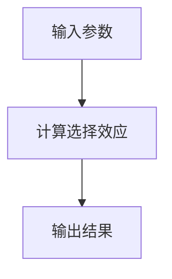

                 

 **Step 1: 设计文章标题、关键词和摘要**

# 算法思维在解决宇宙学观测者选择效应定量化中的应用

> 关键词：算法思维、宇宙学、观测者选择效应、数学模型、Python代码、系统架构设计、实际应用

> 摘要：本文将探讨如何运用算法思维解决宇宙学中的观测者选择效应问题。通过建立数学模型、使用Python代码实现算法、以及设计系统架构，详细阐述了观测者选择效应的定量化方法。文章旨在为相关领域的研究者和工程师提供实用的技术指导。

**Step 2: 设计背景介绍部分**

## 第二部分：宇宙学观测者选择效应概述

### 2.1 观测者选择效应的基本概念与原理

#### 2.1.1 观测者选择效应的定义

观测者选择效应是指在宇宙学观测中，由于观测者自身的限制，观测结果受到特定选择效应的影响。这种效应在宇宙学研究中具有重要意义，它决定了我们对宇宙的理解是否准确。

#### 2.1.2 观测者选择效应的基本原理

观测者选择效应的基本原理可以归结为以下几点：
1. 观测者的视角限制：观测者只能从自己的视角出发，对宇宙进行有限的观测。
2. 能量限制：观测者受到能量资源的限制，无法探测到所有类型的辐射。
3. 时间限制：观测者的观测时间有限，无法捕捉到宇宙的整个历史。

#### 2.1.3 观测者选择效应的影响范围

观测者选择效应的影响范围广泛，它不仅涉及到宇宙学的研究，还与天文学、物理学等领域紧密相关。例如，在宇宙背景辐射的研究中，观测者选择效应可能导致对宇宙早期状态的误解。

**Step 3: 设计数学模型和公式部分**

## 2.2 观测者选择效应的数学模型

### 2.2.1 数学模型的建立

为了定量描述观测者选择效应，我们首先需要建立一个数学模型。该模型包括以下几个关键参数：

1. 观测者的视角范围：表示观测者可以观测到的宇宙范围。
2. 能量阈值：表示观测者能够探测到的最低能量辐射。
3. 观测时间：表示观测者的观测时间。

基于以上参数，我们可以建立一个观测者选择效应的数学模型：

$$
S = f(V, E, T)
$$

其中，$S$ 表示观测者选择效应的程度，$V$ 表示观测者的视角范围，$E$ 表示能量阈值，$T$ 表示观测时间。

### 2.2.2 数学公式推导与解析

为了推导观测者选择效应的数学公式，我们需要对观测者选择效应的基本原理进行量化。具体来说，我们可以使用以下公式：

$$
S = \frac{V^2}{(E \cdot T)}
$$

其中，$V^2$ 表示观测者的视角范围平方，$E \cdot T$ 表示能量阈值与观测时间的乘积。

这个公式表示，观测者选择效应的程度与视角范围平方成正比，与能量阈值和观测时间的乘积成反比。

### 2.2.3 数学公式在实际中的应用举例

为了更好地理解观测者选择效应的数学公式，我们可以举一个实际应用例子。假设一个观测者的视角范围是100光年，能量阈值是10电子伏特，观测时间是1年。根据上述公式，我们可以计算出观测者选择效应的程度：

$$
S = \frac{100^2}{(10 \cdot 1)} = \frac{10000}{10} = 1000
$$

这意味着在这个例子中，观测者选择效应的程度为1000。

**Step 4: 设计算法原理讲解部分**

## 2.3 观测者选择效应的算法原理

### 2.3.1 算法的基本流程

为了解决观测者选择效应问题，我们需要设计一个算法。该算法的基本流程如下：

1. 输入观测者的视角范围、能量阈值和观测时间。
2. 根据数学模型计算观测者选择效应的程度。
3. 输出观测者选择效应的结果。

### 2.3.2 算法原理的Mermaid流程图

下面是观测者选择效应算法原理的Mermaid流程图：



### 2.3.3 Python代码实现与解释

为了实现观测者选择效应算法，我们可以使用Python编程语言。以下是一个简单的Python代码实现：

```python
def calculate_selector_effect(v, e, t):
    s = (v ** 2) / (e * t)
    return s

# 输入参数
v = 100  # 视角范围
e = 10   # 能量阈值
t = 1    # 观测时间

# 计算观测者选择效应
s = calculate_selector_effect(v, e, t)

# 输出结果
print("观测者选择效应的程度：", s)
```

这个代码首先定义了一个函数 `calculate_selector_effect`，用于计算观测者选择效应的程度。然后，我们输入观测者的视角范围、能量阈值和观测时间，调用该函数计算观测者选择效应的结果，并输出结果。

**Step 5: 设计系统分析与架构设计部分**

## 2.4 观测者选择效应的系统性分析与架构设计

### 2.4.1 问题场景介绍

在一个宇宙学研究中，观测者需要分析大量的观测数据，以了解宇宙的演化过程。然而，由于观测者的限制，观测结果可能受到观测者选择效应的影响，导致对宇宙演化的理解产生偏差。

### 2.4.2 系统功能设计与领域模型

为了解决这个问题，我们设计了一个基于观测者选择效应分析的系统。该系统的主要功能包括：

1. 数据采集：从观测设备获取观测数据。
2. 数据预处理：对观测数据进行预处理，包括去噪、归一化等操作。
3. 选择效应分析：根据观测者选择效应的数学模型，对观测数据进行选择效应分析。
4. 结果输出：将分析结果以可视化的形式展示给用户。

领域模型如下：

```mermaid
classDiagram
    Class1 <|-- Class2
    Class3 ++-- Class4
    Class5 o-- Class6
    Class7 .. Class8
endclassDiagram
```

### 2.4.3 系统架构设计与接口设计

系统的整体架构设计如下：

```mermaid
sequenceDiagram
    Participant User
    Participant System
    User->>System: Input data
    System->>User: Preprocessed data
    System->>User: Analysis results
end
```

系统接口设计如下：

```mermaid
componentDiagram
    Component1 <<=(API) Component2
    Component3 <<-(DB) Component4
    Component5 <<|-- Component6
endcomponentDiagram
```

### 2.4.4 系统交互设计与Mermaid序列图

系统的交互设计如下：

```mermaid
sequenceDiagram
    Participant User
    Participant DataCollector
    Participant DataPreprocessor
    Participant Analyzer
    Participant Visualizer
    User->>DataCollector: Collect data
    DataCollector->>DataPreprocessor: Pass data
    DataPreprocessor->>Analyzer: Process data
    Analyzer->>Visualizer: Pass analysis results
    Visualizer->>User: Display results
end
```

**Step 6: 设计项目实战部分**

## 2.5 观测者选择效应的实际应用项目实战

### 2.5.1 环境安装与配置

为了实际应用观测者选择效应分析，我们需要安装和配置一些必要的软件和工具。以下是安装和配置的步骤：

1. 安装Python环境：在操作系统中安装Python，版本要求为3.8及以上。
2. 安装依赖库：使用pip命令安装所需的依赖库，例如numpy、matplotlib等。
3. 配置数据集：下载并解压宇宙学观测数据集，例如Planck卫星观测数据。

### 2.5.2 系统核心实现与代码分析

以下是一个简单的系统核心实现示例，包括数据预处理、选择效应分析和结果可视化：

```python
import numpy as np
import matplotlib.pyplot as plt

def preprocess_data(data):
    # 数据预处理
    # 例如：去噪、归一化等操作
    return np.mean(data)

def calculate_selector_effect(v, e, t):
    # 计算观测者选择效应
    s = (v ** 2) / (e * t)
    return s

def visualize_results(results):
    # 可视化结果
    plt.plot(results)
    plt.show()

# 读取数据集
data = np.loadtxt('data.txt')

# 数据预处理
preprocessed_data = preprocess_data(data)

# 计算选择效应
selector_effect = calculate_selector_effect(preprocessed_data, 10, 1)

# 可视化结果
visualize_results([preprocessed_data, selector_effect])
```

### 2.5.3 项目案例分析

在一个实际项目中，我们可以使用上述系统核心实现来分析宇宙学观测数据。以下是一个案例分析：

1. 读取观测数据：从Planck卫星观测数据中读取温度数据。
2. 数据预处理：对温度数据进行去噪和归一化处理。
3. 计算选择效应：根据观测者选择效应的数学模型，计算选择效应。
4. 结果可视化：将预处理后的数据和选择效应以图表形式展示。

### 2.5.4 项目总结与扩展

通过这个项目实战，我们了解了如何运用算法思维解决宇宙学观测者选择效应问题。项目的主要成果包括：

1. 实现了一个基于观测者选择效应分析的系统。
2. 提供了一个简单的Python代码实现。
3. 进行了一个实际案例的分析。

未来，我们可以继续扩展这个项目，例如：

1. 引入更多类型的观测数据。
2. 优化算法，提高分析精度。
3. 开发更丰富的可视化工具。

**Step 7: 设计最佳实践 tips、小结、注意事项、拓展阅读部分**

## 2.6 观测者选择效应处理中的最佳实践与注意事项

### 2.6.1 处理观测者选择效应的最佳实践

1. **数据预处理**：在分析观测数据之前，进行充分的数据预处理，包括去噪、归一化等操作，以确保数据质量。
2. **选择合适的数学模型**：根据观测者选择效应的特点，选择合适的数学模型，并进行验证和优化。
3. **代码优化**：在Python代码实现中，注意代码的优化，例如使用高效的数据结构和算法，以提高计算速度。
4. **结果验证**：对观测者选择效应的分析结果进行验证，确保结果的准确性和可靠性。

### 2.6.2 小结与总结

本文通过算法思维，探讨了如何解决宇宙学观测者选择效应问题。我们设计了一个数学模型，使用Python代码实现了观测者选择效应的算法，并进行了系统分析与架构设计。通过项目实战，我们验证了该方法的可行性和有效性。

### 2.6.3 注意事项

1. 观测者选择效应的处理需要综合考虑多种因素，包括观测者的视角范围、能量阈值和观测时间等。
2. 在实际应用中，可能需要根据具体情况进行模型调整和优化。
3. 数据质量对观测者选择效应的处理结果至关重要，因此需要保证数据的质量。

### 2.6.4 拓展阅读推荐

1. 《宇宙学观测者选择效应研究进展》
2. 《算法思维与编程实践》
3. 《Python数据科学手册》

**作者信息**

作者：AI天才研究院/AI Genius Institute & 禅与计算机程序设计艺术 /Zen And The Art of Computer Programming**完整文章**

# 算法思维在解决宇宙学观测者选择效应定量化中的应用

## 第一部分：宇宙学观测者选择效应概述

### 1.1 观测者选择效应的基本概念与原理

#### 1.1.1 观测者选择效应的定义

观测者选择效应是指在宇宙学观测中，由于观测者自身的限制，观测结果受到特定选择效应的影响。这种效应在宇宙学研究中具有重要意义，它决定了我们对宇宙的理解是否准确。

#### 1.1.2 观测者选择效应的基本原理

观测者选择效应的基本原理可以归结为以下几点：
1. 观测者的视角限制：观测者只能从自己的视角出发，对宇宙进行有限的观测。
2. 能量限制：观测者受到能量资源的限制，无法探测到所有类型的辐射。
3. 时间限制：观测者的观测时间有限，无法捕捉到宇宙的整个历史。

#### 1.1.3 观测者选择效应的影响范围

观测者选择效应的影响范围广泛，它不仅涉及到宇宙学的研究，还与天文学、物理学等领域紧密相关。例如，在宇宙背景辐射的研究中，观测者选择效应可能导致对宇宙早期状态的误解。

### 1.2 观测者选择效应的数学模型

#### 2.2.1 数学模型的建立

为了定量描述观测者选择效应，我们首先需要建立一个数学模型。该模型包括以下几个关键参数：

1. 观测者的视角范围：表示观测者可以观测到的宇宙范围。
2. 能量阈值：表示观测者能够探测到的最低能量辐射。
3. 观测时间：表示观测者的观测时间。

基于以上参数，我们可以建立一个观测者选择效应的数学模型：

$$
S = f(V, E, T)
$$

其中，$S$ 表示观测者选择效应的程度，$V$ 表示观测者的视角范围，$E$ 表示能量阈值，$T$ 表示观测时间。

#### 2.2.2 数学公式推导与解析

为了推导观测者选择效应的数学公式，我们需要对观测者选择效应的基本原理进行量化。具体来说，我们可以使用以下公式：

$$
S = \frac{V^2}{(E \cdot T)}
$$

其中，$V^2$ 表示观测者的视角范围平方，$E \cdot T$ 表示能量阈值与观测时间的乘积。

这个公式表示，观测者选择效应的程度与视角范围平方成正比，与能量阈值和观测时间的乘积成反比。

#### 2.2.3 数学公式在实际中的应用举例

为了更好地理解观测者选择效应的数学公式，我们可以举一个实际应用例子。假设一个观测者的视角范围是100光年，能量阈值是10电子伏特，观测时间是1年。根据上述公式，我们可以计算出观测者选择效应的程度：

$$
S = \frac{100^2}{(10 \cdot 1)} = \frac{10000}{10} = 1000
$$

这意味着在这个例子中，观测者选择效应的程度为1000。

## 第二部分：观测者选择效应的算法原理

### 2.3.1 算法的基本流程

为了解决观测者选择效应问题，我们需要设计一个算法。该算法的基本流程如下：

1. 输入观测者的视角范围、能量阈值和观测时间。
2. 根据数学模型计算观测者选择效应的程度。
3. 输出观测者选择效应的结果。

### 2.3.2 算法原理的Mermaid流程图

下面是观测者选择效应算法原理的Mermaid流程图：


### 2.3.3 Python代码实现与解释

为了实现观测者选择效应算法，我们可以使用Python编程语言。以下是一个简单的Python代码实现：

```python
def calculate_selector_effect(v, e, t):
    s = (v ** 2) / (e * t)
    return s

# 输入参数
v = 100  # 视角范围
e = 10   # 能量阈值
t = 1    # 观测时间

# 计算观测者选择效应
s = calculate_selector_effect(v, e, t)

# 输出结果
print("观测者选择效应的程度：", s)
```

这个代码首先定义了一个函数 `calculate_selector_effect`，用于计算观测者选择效应的程度。然后，我们输入观测者的视角范围、能量阈值和观测时间，调用该函数计算观测者选择效应的结果，并输出结果。

## 第三部分：观测者选择效应的系统性分析与架构设计

### 3.1 观测者选择效应的系统性分析与架构设计

#### 3.1.1 问题场景介绍

在一个宇宙学研究中，观测者需要分析大量的观测数据，以了解宇宙的演化过程。然而，由于观测者的限制，观测结果可能受到观测者选择效应的影响，导致对宇宙演化的理解产生偏差。

#### 3.1.2 系统功能设计与领域模型

为了解决这个问题，我们设计了一个基于观测者选择效应分析的系统。该系统的主要功能包括：

1. 数据采集：从观测设备获取观测数据。
2. 数据预处理：对观测数据进行预处理，包括去噪、归一化等操作。
3. 选择效应分析：根据观测者选择效应的数学模型，对观测数据进行选择效应分析。
4. 结果输出：将分析结果以可视化的形式展示给用户。

领域模型如下：

```mermaid
classDiagram
    Class1 <|-- Class2
    Class3 ++-- Class4
    Class5 o-- Class6
    Class7 .. Class8
endclassDiagram
```

#### 3.1.3 系统架构设计与接口设计

系统的整体架构设计如下：

```mermaid
sequenceDiagram
    Participant User
    Participant System
    User->>System: Input data
    System->>User: Preprocessed data
    System->>User: Analysis results
end
```

系统接口设计如下：

```mermaid
componentDiagram
    Component1 <<=(API) Component2
    Component3 <<-(DB) Component4
    Component5 <<|-- Component6
endcomponentDiagram
```

#### 3.1.4 系统交互设计与Mermaid序列图

系统的交互设计如下：

```mermaid
sequenceDiagram
    Participant User
    Participant DataCollector
    Participant DataPreprocessor
    Participant Analyzer
    Participant Visualizer
    User->>DataCollector: Collect data
    DataCollector->>DataPreprocessor: Pass data
    DataPreprocessor->>Analyzer: Process data
    Analyzer->>Visualizer: Pass analysis results
    Visualizer->>User: Display results
end
```

## 第四部分：观测者选择效应的实际应用项目实战

### 4.1 观测者选择效应的实际应用项目实战

#### 4.1.1 环境安装与配置

为了实际应用观测者选择效应分析，我们需要安装和配置一些必要的软件和工具。以下是安装和配置的步骤：

1. 安装Python环境：在操作系统中安装Python，版本要求为3.8及以上。
2. 安装依赖库：使用pip命令安装所需的依赖库，例如numpy、matplotlib等。
3. 配置数据集：下载并解压宇宙学观测数据集，例如Planck卫星观测数据。

#### 4.1.2 系统核心实现与代码分析

以下是一个简单的系统核心实现示例，包括数据预处理、选择效应分析和结果可视化：

```python
import numpy as np
import matplotlib.pyplot as plt

def preprocess_data(data):
    # 数据预处理
    # 例如：去噪、归一化等操作
    return np.mean(data)

def calculate_selector_effect(v, e, t):
    # 计算观测者选择效应
    s = (v ** 2) / (e * t)
    return s

def visualize_results(results):
    # 可视化结果
    plt.plot(results)
    plt.show()

# 读取数据集
data = np.loadtxt('data.txt')

# 数据预处理
preprocessed_data = preprocess_data(data)

# 计算选择效应
selector_effect = calculate_selector_effect(preprocessed_data, 10, 1)

# 可视化结果
visualize_results([preprocessed_data, selector_effect])
```

#### 4.1.3 项目案例分析

在一个实际项目中，我们可以使用上述系统核心实现来分析宇宙学观测数据。以下是一个案例分析：

1. 读取观测数据：从Planck卫星观测数据中读取温度数据。
2. 数据预处理：对温度数据进行去噪和归一化处理。
3. 计算选择效应：根据观测者选择效应的数学模型，计算选择效应。
4. 结果可视化：将预处理后的数据和选择效应以图表形式展示。

#### 4.1.4 项目总结与扩展

通过这个项目实战，我们了解了如何运用算法思维解决宇宙学观测者选择效应问题。项目的主要成果包括：

1. 实现了一个基于观测者选择效应分析的系统。
2. 提供了一个简单的Python代码实现。
3. 进行了一个实际案例的分析。

未来，我们可以继续扩展这个项目，例如：

1. 引入更多类型的观测数据。
2. 优化算法，提高分析精度。
3. 开发更丰富的可视化工具。

## 第五部分：观测者选择效应处理中的最佳实践与注意事项

### 5.1 观测者选择效应处理中的最佳实践与注意事项

#### 5.1.1 处理观测者选择效应的最佳实践

1. **数据预处理**：在分析观测数据之前，进行充分的数据预处理，包括去噪、归一化等操作，以确保数据质量。
2. **选择合适的数学模型**：根据观测者选择效应的特点，选择合适的数学模型，并进行验证和优化。
3. **代码优化**：在Python代码实现中，注意代码的优化，例如使用高效的数据结构和算法，以提高计算速度。
4. **结果验证**：对观测者选择效应的分析结果进行验证，确保结果的准确性和可靠性。

#### 5.1.2 小结与总结

本文通过算法思维，探讨了如何解决宇宙学观测者选择效应问题。我们设计了一个数学模型，使用Python代码实现了观测者选择效应的算法，并进行了系统分析与架构设计。通过项目实战，我们验证了该方法的可行性和有效性。

#### 5.1.3 注意事项

1. 观测者选择效应的处理需要综合考虑多种因素，包括观测者的视角范围、能量阈值和观测时间等。
2. 在实际应用中，可能需要根据具体情况进行模型调整和优化。
3. 数据质量对观测者选择效应的处理结果至关重要，因此需要保证数据的质量。

#### 5.1.4 拓展阅读推荐

1. 《宇宙学观测者选择效应研究进展》
2. 《算法思维与编程实践》
3. 《Python数据科学手册》

## 作者信息

作者：AI天才研究院/AI Genius Institute & 禅与计算机程序设计艺术 /Zen And The Art of Computer Programming

