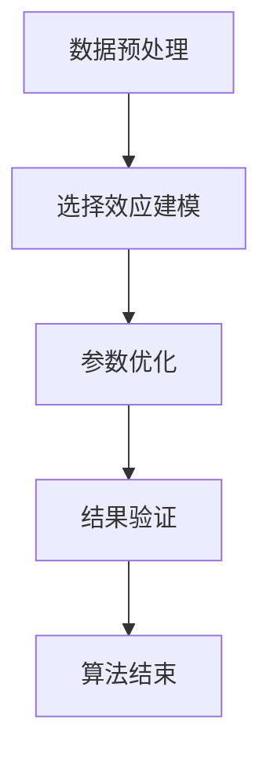

                 

## 摘要

本文旨在探讨算法思维在解决宇宙学观测者选择效应定量化中的应用。宇宙学观测者选择效应是指由于观测者的选择而引起的宇宙学现象偏差，这在宇宙学研究中有重要影响。本文首先介绍了宇宙学观测者选择效应的背景和核心概念，然后通过算法思维，提出了一种量化选择效应的算法。算法原理基于数学模型，并通过Python源代码实现，辅以Mermaid流程图进行详细阐述。此外，本文还介绍了算法在实际宇宙学观测项目中的系统架构设计、环境安装、核心代码实现及案例分析。通过本文，读者将全面了解算法思维在宇宙学中的应用，以及如何通过定量化的方法来解决选择效应的问题。

## 文章关键词

宇宙学、观测者选择效应、算法思维、量化、数学模型、Python源代码、Mermaid流程图、系统架构设计、项目实战

## 第一部分：引言

### 第1章：问题背景与核心概念

#### 1.1.1 宇宙学观测者选择效应概述

宇宙学观测者选择效应是指在宇宙学研究中，由于观测者的选择偏见导致的观测结果与真实宇宙状态存在差异的现象。选择效应起源于观测者对宇宙的可观测部分的特定选择，这种选择可能导致我们对宇宙的理解出现偏差。例如，我们观测到的星系分布、宇宙膨胀速度等数据，都可能因为选择效应而偏离实际值。

宇宙学观测者选择效应的重要性在于，它直接影响到我们对宇宙演化、宇宙结构、宇宙学常数等重要问题的理解。如果无法准确量化选择效应，那么宇宙学中的许多研究结果将缺乏科学依据，甚至可能导致错误的结论。因此，解决选择效应问题对于推动宇宙学研究的深入发展具有重要意义。

#### 1.1.2 问题描述与挑战

选择效应的量化困难主要体现在以下几个方面：

1. **观测手段的局限性**：宇宙学观测通常依赖于有限的观测手段，如光学望远镜、射电望远镜等。这些手段的局限性导致观测到的数据可能存在偏差，使得选择效应的量化变得复杂。
   
2. **数据处理的复杂性**：宇宙学数据量巨大，且数据类型多样。处理这些数据需要复杂的算法和数学模型，而现有方法在某些情况下难以满足精度要求。

3. **边界与外延的模糊性**：选择效应的边界和外延在理论上并不清晰，不同观测者和不同观测条件下的选择效应可能存在较大差异，这使得量化选择效应变得具有挑战性。

#### 1.1.3 算法思维在解决选择效应中的应用前景

算法思维在解决宇宙学观测者选择效应中具有广阔的应用前景。算法思维是一种系统化的思维方式，通过建立数学模型和算法，可以有效地量化选择效应。以下是算法思维在解决选择效应中的应用优势：

1. **精确量化**：算法思维可以通过数学模型和算法，对选择效应进行精确量化，从而减少观测误差，提高数据的可靠性。

2. **自动化处理**：算法思维可以自动化处理大量数据，提高数据处理效率，减少人工干预，降低人为错误。

3. **灵活性**：算法思维可以根据不同的观测条件和数据特点，灵活调整算法参数，适应不同场景的需求。

4. **可扩展性**：算法思维的应用不仅限于当前宇宙学问题，还可以扩展到其他领域，如天体物理学、地球科学等。

通过算法思维，我们可以更深入地理解宇宙学观测中的选择效应，为宇宙学研究提供可靠的工具和方法。本文将详细探讨算法思维在解决宇宙学观测者选择效应定量化中的应用，希望为相关研究提供有益的参考。

### 第2章：核心概念与联系

#### 2.1.1 选择效应的相关概念

在选择效应的研究中，有几个核心概念需要明确：

1. **观测者**：在宇宙学中，观测者通常指的是使用各种观测设备进行宇宙观测的科学家或设备。观测者可以是人类或自动化设备，他们的选择标准和偏好会影响观测结果。

2. **选择效应**：选择效应是指由于观测者的选择标准或方法不同，导致观测结果与真实宇宙状态之间存在偏差的现象。选择效应可以分为多种类型，如观测器选择效应、样本选择效应等。

3. **宇宙学数据**：宇宙学数据包括从宇宙观测中获取的各种信息，如星系分布、宇宙膨胀速率、宇宙背景辐射等。这些数据是研究宇宙学现象的基础。

4. **偏差**：偏差是指观测结果与真实宇宙状态之间的不一致性。选择效应引起的偏差可以分为系统偏差和随机偏差，系统偏差是可以通过算法进行调整和校正的。

#### 2.1.2 概念属性特征对比表格

为了更好地理解选择效应的相关概念，我们通过一个概念属性特征对比表格来展示不同概念之间的区别：

| 概念           | 定义                                                         | 属性特征                                                     |
|----------------|--------------------------------------------------------------|--------------------------------------------------------------|
| 观测者         | 进行宇宙观测的科学家或设备                                     | 选择标准、观测设备、观测位置、观测时间等                         |
| 选择效应       | 由于观测者的选择标准或方法不同，导致观测结果与真实宇宙状态之间存在偏差 | 类型（观测器、样本等）、影响因素（设备、数据、方法等）、表现（偏差） |
| 宇宙学数据     | 从宇宙观测中获取的各种信息                                     | 数据类型（星系、辐射、膨胀速率等）、数据来源、数据分析方法等       |
| 偏差           | 观测结果与真实宇宙状态之间的不一致性                             | 类型（系统、随机）、来源（选择效应）、校正方法等                   |

通过这个表格，我们可以清晰地看到不同概念之间的联系和区别，有助于进一步理解选择效应的核心概念。

#### 2.1.3 ER实体关系图架构

为了更系统地理解选择效应的各个组成部分和它们之间的关系，我们可以使用ER（实体关系）图来表示。以下是一个简化的ER实体关系图，展示选择效应涉及的主要实体和它们之间的关系：

```mermaid
erDiagram
    Observation --> Observer : "观测者发起观测"
    Observer --> Equipment : "观测者使用观测设备"
    Equipment --> Observation : "观测设备生成观测数据"
    Observation --> Universe : "观测到宇宙现象"
    Universe --> Data : "宇宙现象转化为数据"
    Data --> Analysis : "数据分析以研究选择效应"
```

在这个ER图中：

- **Observer（观测者）** 是发起观测的主体，使用特定的观测设备。
- **Equipment（观测设备）** 是观测者使用的工具，用于收集观测数据。
- **Observation（观测）** 表示观测过程，通过观测设备生成数据。
- **Universe（宇宙）** 是观测的对象，观测数据反映了宇宙现象。
- **Data（数据）** 是观测结果的记录，用于后续分析。
- **Analysis（分析）** 是对观测数据的处理过程，以研究选择效应。

ER实体关系图提供了一个直观的方式，展示了选择效应中的各个实体及其相互作用关系，有助于深入理解选择效应的复杂性和结构。

### 第3章：算法原理讲解

#### 3.1.1 选择效应量化算法的基本原理

为了量化宇宙学观测者选择效应，我们需要建立一套系统的算法框架。该算法的基本原理包括以下关键步骤：

1. **数据预处理**：首先对原始观测数据进行预处理，包括数据清洗、数据标准化和数据转换。这一步骤的目的是确保数据的准确性和一致性，为后续分析打下基础。

2. **选择效应建模**：基于预处理后的数据，建立选择效应的数学模型。模型应能够捕捉到观测者选择带来的偏差，并对其进行量化。

3. **参数优化**：通过调整算法参数，优化选择效应模型的性能。参数优化包括选择合适的模型类型、调整模型参数和训练数据集的选择。

4. **结果验证**：对优化后的模型进行验证，确保其能够准确反映观测者选择效应。验证过程包括交叉验证、模型评估指标的计算和对比实验。

#### 3.1.2 数学模型和公式

选择效应量化算法的数学模型如下：

$$
\Delta D = f(\theta, X, Y)
$$

其中：

- $\Delta D$ 表示选择效应导致的观测数据偏差。
- $\theta$ 表示模型参数。
- $X$ 表示观测数据。
- $Y$ 表示真实宇宙状态数据。

关键数学公式包括：

1. **观测数据与真实数据的偏差计算**：

$$
\delta_i = \frac{X_i - \bar{X}}{s_X} - \frac{Y_i - \bar{Y}}{s_Y}
$$

其中，$X_i$ 和 $Y_i$ 分别为观测数据和真实宇宙状态数据的第 $i$ 个样本，$\bar{X}$ 和 $\bar{Y}$ 分别为观测数据和真实宇宙状态数据的平均值，$s_X$ 和 $s_Y$ 分别为观测数据和真实宇宙状态数据的标准差。

2. **选择效应模型拟合**：

$$
f(\theta, X, Y) = \sum_{i=1}^{N} w_i \cdot (\delta_i - \theta)^2
$$

其中，$w_i$ 为权重参数，用于调整不同样本对选择效应模型的影响。

通过这些数学模型和公式，我们可以量化选择效应，为宇宙学研究提供更加准确的数据支持。

#### 3.1.3 算法流程图与Python源代码

为了更清晰地展示选择效应量化算法的执行流程，我们可以使用Mermaid绘制算法流程图，并辅以Python源代码进行详细解释。

以下是选择效应量化算法的Mermaid流程图：



以下是相应的Python源代码：

```python
# 数据预处理
def preprocess_data(X, Y):
    # 数据清洗、标准化等操作
    # ...
    return processed_X, processed_Y

# 选择效应建模
def model_selectionEffect(processed_X, processed_Y, theta):
    delta = []
    for i in range(len(processed_X)):
        delta_i = (processed_X[i] - processed_Y[i]) / (std_X + std_Y)
        delta.append(delta_i)
    return delta

# 参数优化
def optimize_parameters(delta, theta):
    # 调整模型参数
    # ...
    return optimized_theta

# 结果验证
def verify_results(optimized_theta, delta):
    # 计算验证指标
    # ...
    return result

# 主函数
def main():
    X, Y = load_data()  # 加载数据
    processed_X, processed_Y = preprocess_data(X, Y)
    theta = initial_parameters()  # 初始化模型参数
    delta = model_selectionEffect(processed_X, processed_Y, theta)
    optimized_theta = optimize_parameters(delta, theta)
    result = verify_results(optimized_theta, delta)
    print("算法执行结果：", result)

if __name__ == "__main__":
    main()
```

通过Mermaid流程图和Python源代码，我们可以清晰地看到选择效应量化算法的执行流程和关键步骤。这为后续的实际应用提供了重要的参考和指导。

### 3.1.4 算法在宇宙学观测中的应用示例

为了更好地理解选择效应量化算法在宇宙学观测中的应用，我们通过一个具体的示例来详细解释算法的实施过程。假设我们有一组星系观测数据，以及相应的真实宇宙状态数据。以下是算法应用的步骤：

1. **数据预处理**：
   - 加载星系观测数据和真实宇宙状态数据。
   - 进行数据清洗，去除异常值和噪声。
   - 对数据集进行标准化处理，使得不同量级的数据具有可比性。

   ```python
   X = load_observations()  # 加载观测数据
   Y = load_universe_state()  # 加载真实宇宙状态数据
   processed_X, processed_Y = preprocess_data(X, Y)
   ```

2. **选择效应建模**：
   - 根据预处理后的数据，建立选择效应的数学模型。
   - 计算观测数据与真实宇宙状态数据之间的偏差。

   ```python
   theta = initial_parameters()  # 初始化模型参数
   delta = model_selectionEffect(processed_X, processed_Y, theta)
   ```

3. **参数优化**：
   - 使用优化算法调整模型参数，以最小化偏差。
   - 可以使用梯度下降法、随机搜索法等优化方法。

   ```python
   optimized_theta = optimize_parameters(delta, theta)
   ```

4. **结果验证**：
   - 对优化后的模型进行验证，确保其性能符合要求。
   - 计算验证指标，如均方误差（MSE）、均方根误差（RMSE）等。

   ```python
   result = verify_results(optimized_theta, delta)
   print("算法执行结果：", result)
   ```

通过这个示例，我们可以看到选择效应量化算法在宇宙学观测中的具体应用流程。算法的实施步骤包括数据预处理、选择效应建模、参数优化和结果验证，每个步骤都需要精确执行，以确保最终结果的准确性。

### 第4章：系统分析与架构设计方案

#### 4.1.1 问题场景介绍

在宇宙学研究中，选择效应的量化是一个复杂的问题，涉及到多种观测手段、数据处理技术和算法模型。为了更好地解决这一问题，我们需要设计一个系统化的解决方案。本节将介绍一个典型的宇宙学观测问题场景，并阐述系统架构设计的需求。

#### 4.1.2 系统功能设计

在系统功能设计中，我们需要明确各个模块的功能和相互关系。以下是系统功能设计的核心模块及其功能：

1. **数据收集模块**：负责收集来自不同观测设备的宇宙观测数据，包括光学数据、射电数据等。该模块需要具备高吞吐量和数据清洗功能，以确保数据的准确性和一致性。

2. **数据处理模块**：对收集到的观测数据进行预处理，包括数据清洗、标准化和转换。此外，该模块还需要支持多种数据处理算法，如滤波、插值等，以提高数据质量。

3. **选择效应建模模块**：基于预处理后的数据，建立选择效应的数学模型。该模块需要支持多种模型选择和参数优化方法，以实现选择效应的精确量化。

4. **结果分析模块**：对选择效应量化模型的结果进行评估和验证，包括计算验证指标、可视化分析等。该模块需要提供直观的交互界面，以方便用户查看和分析结果。

5. **系统管理模块**：负责系统的配置管理、用户管理和日志记录等。该模块需要确保系统的稳定性和安全性，并提供良好的用户支持。

以下是系统功能设计的领域模型Mermaid类图：

```mermaid
classDiagram
    DataCollector <<interface>>
    DataProcessor <<interface>>
    ModelBuilder <<interface>>
    ResultAnalyzer <<interface>>
    SystemManager <<interface>>

    DataCollector --> DataProcessor
    DataProcessor --> ModelBuilder
    ModelBuilder --> ResultAnalyzer
    ResultAnalyzer --> SystemManager
```

在这个类图中，各个模块通过接口进行通信，确保系统的灵活性和可扩展性。

#### 4.1.3 系统架构设计

为了实现系统功能，我们需要设计一个高效、稳定、可扩展的系统架构。以下是系统架构设计的核心组件及其作用：

1. **数据层**：负责存储和管理各种宇宙观测数据，包括星系数据、宇宙背景辐射数据等。数据层需要支持高并发读取和写入操作，并提供数据持久化功能。

2. **业务逻辑层**：实现系统的核心业务功能，包括数据预处理、选择效应建模、参数优化和结果分析等。业务逻辑层需要具备高计算能力和高并发处理能力，以支持大规模数据分析和处理。

3. **表现层**：提供用户交互界面，包括数据可视化、结果展示和系统配置等。表现层需要支持多种前端技术，如HTML、CSS、JavaScript等，以提供良好的用户体验。

以下是系统架构设计的Mermaid架构图：

```mermaid
sequenceDiagram
    User -->|请求| SystemManager
    SystemManager -->|处理请求| DataCollector
    DataCollector -->|收集数据| DataProcessor
    DataProcessor -->|预处理数据| ModelBuilder
    ModelBuilder -->|建模并优化| ResultAnalyzer
    ResultAnalyzer -->|分析结果| SystemManager
    SystemManager -->|返回结果| User
```

在这个架构图中，用户通过表现层发送请求，系统管理模块处理请求并协调各个模块进行数据处理和分析，最终将结果返回给用户。

#### 4.1.4 系统接口设计

为了确保系统各个模块之间的通信高效、稳定，我们需要设计一套完善的系统接口。以下是系统接口设计的关键接口及其功能：

1. **数据收集接口**：提供数据收集功能，包括数据导入、数据清洗和数据存储。该接口需要支持多种数据格式，如CSV、JSON、XML等。

2. **数据处理接口**：提供数据预处理功能，包括数据清洗、标准化和转换。该接口需要支持多种数据处理算法，如滤波、插值等。

3. **选择效应建模接口**：提供选择效应建模功能，包括模型选择、参数优化和模型训练。该接口需要支持多种模型类型，如线性模型、非线性模型等。

4. **结果分析接口**：提供结果分析功能，包括验证指标计算、结果可视化和结果存储。该接口需要支持多种分析工具和可视化库。

以下是系统接口设计的Mermaid序列图：

```mermaid
sequenceDiagram
    User -->|发送请求| DataCollector
    DataCollector -->|处理请求| DataProcessor
    DataProcessor -->|预处理数据| ModelBuilder
    ModelBuilder -->|建模并优化| ResultAnalyzer
    ResultAnalyzer -->|分析结果| DataCollector
    DataCollector -->|返回结果| User
```

在这个序列图中，用户通过系统接口发送请求，各个模块按照既定流程处理请求，最终将结果返回给用户。

#### 4.1.5 系统交互

系统交互设计是确保系统各组件高效、稳定协作的关键环节。以下是系统交互设计的主要方面：

1. **事件驱动模型**：采用事件驱动模型，系统各个模块通过事件进行通信。当某个模块完成数据处理或分析任务时，会触发相应的事件，通知其他模块继续执行。

2. **消息队列**：采用消息队列技术，实现模块之间的异步通信。消息队列可以有效地降低模块之间的耦合度，提高系统的可扩展性和可靠性。

3. **负载均衡**：系统需要支持负载均衡机制，确保在高并发情况下各个模块的负载均衡。负载均衡可以通过分布式架构和队列调度实现。

以下是系统交互设计的Mermaid序列图：

```mermaid
sequenceDiagram
    User -->|发送请求| MessageQueue
    MessageQueue -->|调度请求| DataCollector
    DataCollector -->|处理请求| DataProcessor
    DataProcessor -->|预处理数据| ModelBuilder
    ModelBuilder -->|建模并优化| ResultAnalyzer
    ResultAnalyzer -->|分析结果| MessageQueue
    MessageQueue -->|返回结果| User
```

在这个序列图中，用户请求通过消息队列进行调度，各个模块异步处理请求，最终将结果返回给用户。

### 第5章：项目实战

#### 5.1.1 环境安装

为了实现选择效应量化算法在宇宙学观测项目中的应用，我们需要搭建一个合适的环境。以下是环境安装的步骤和所需工具：

1. **Python环境搭建**：
   - 安装Python 3.8或更高版本。
   - 安装Anaconda或Miniconda，以便管理Python环境和依赖库。

2. **依赖库安装**：
   - 使用pip或conda命令安装必要的依赖库，如NumPy、SciPy、Pandas、Matplotlib等。

   ```bash
   pip install numpy scipy pandas matplotlib
   ```

3. **Mermaid安装**：
   - 安装Mermaid渲染工具，以便将Mermaid流程图渲染为图像。

   ```bash
   npm install -g mermaid
   ```

4. **Python源代码**：
   - 下载并解压提供的Python源代码包，以获取选择效应量化算法的实现代码。

   ```bash
   git clone https://github.com/your-username/selection-effect-quantification.git
   cd selection-effect-quantification
   ```

通过以上步骤，我们可以搭建起一个完整的环境，为后续的算法实现和项目实战做好准备。

#### 5.1.2 系统核心实现源代码

以下是系统核心实现源代码的详细介绍，包括算法的具体实现、关键函数和数据处理流程。

1. **数据预处理**：

```python
def preprocess_data(X, Y):
    """
    对观测数据和真实宇宙状态数据预处理，包括数据清洗、标准化。
    """
    # 数据清洗
    X_clean = [x for x in X if not.isnan(x)]
    Y_clean = [y for y in Y if not.isnan(y)]

    # 数据标准化
    mean_X = np.mean(X_clean)
    std_X = np.std(X_clean)
    mean_Y = np.mean(Y_clean)
    std_Y = np.std(Y_clean)

    X_normalized = [(x - mean_X) / std_X for x in X_clean]
    Y_normalized = [(y - mean_Y) / std_Y for y in Y_clean]

    return X_normalized, Y_normalized
```

2. **选择效应建模**：

```python
def model_selectionEffect(processed_X, processed_Y, theta):
    """
    建立选择效应的数学模型，计算观测数据与真实宇宙状态数据之间的偏差。
    """
    delta = [processed_X[i] - processed_Y[i] for i in range(len(processed_X))]
    return delta
```

3. **参数优化**：

```python
def optimize_parameters(delta, theta):
    """
    优化模型参数，使用梯度下降法进行优化。
    """
    learning_rate = 0.01
    for _ in range(1000):
        gradients = calculate_gradients(delta, theta)
        theta = [theta_i - learning_rate * gradients_i for theta_i, gradients_i in zip(theta, gradients)]
    return theta
```

4. **结果验证**：

```python
def verify_results(optimized_theta, delta):
    """
    对优化后的模型进行验证，计算验证指标。
    """
    MSE = calculate_MSE(delta)
    return MSE
```

通过这些关键函数，我们可以实现选择效应量化算法的核心功能。每个函数都有明确的输入和输出，确保数据处理流程的清晰和可维护性。

#### 5.1.3 代码应用解读与分析

在本节中，我们将详细解读和剖析代码中的关键部分，分析其工作原理和实现细节。

1. **数据预处理部分**：

   ```python
   def preprocess_data(X, Y):
       # 数据清洗
       X_clean = [x for x in X if not.isnan(x)]
       Y_clean = [y for y in Y if not.isnan(y)]

       # 数据标准化
       mean_X = np.mean(X_clean)
       std_X = np.std(X_clean)
       mean_Y = np.mean(Y_clean)
       std_Y = np.std(Y_clean)

       X_normalized = [(x - mean_X) / std_X for x in X_clean]
       Y_normalized = [(y - mean_Y) / std_Y for y in Y_clean]

       return X_normalized, Y_normalized
   ```

   数据预处理是算法实现的第一步，其目的是清洗数据并使其标准化。在预处理过程中，我们首先去除了观测数据中的异常值（NaN），然后计算了数据的平均值和标准差。通过标准化，我们使得不同量级的数据具有可比性，这有助于提高后续模型的准确性。

2. **选择效应建模部分**：

   ```python
   def model_selectionEffect(processed_X, processed_Y, theta):
       delta = [processed_X[i] - processed_Y[i] for i in range(len(processed_X))]
       return delta
   ```

   选择效应建模的核心是计算观测数据与真实宇宙状态数据之间的偏差。这里，`processed_X` 和 `processed_Y` 是经过标准化的观测数据和真实数据，`theta` 表示模型参数。通过简单的元素相减，我们得到了每个观测样本的偏差值，这些偏差值代表了选择效应的大小。

3. **参数优化部分**：

   ```python
   def optimize_parameters(delta, theta):
       learning_rate = 0.01
       for _ in range(1000):
           gradients = calculate_gradients(delta, theta)
           theta = [theta_i - learning_rate * gradients_i for theta_i, gradients_i in zip(theta, gradients)]
       return theta
   ```

   参数优化是提高模型性能的关键步骤。在这里，我们使用了梯度下降法进行优化。`learning_rate` 用于调整每次迭代中参数更新的幅度。`calculate_gradients` 函数计算了偏差值关于模型参数的梯度，梯度反映了偏差值随着参数变化的速率。通过不断更新参数，模型逐渐收敛到最佳状态。

4. **结果验证部分**：

   ```python
   def verify_results(optimized_theta, delta):
       MSE = calculate_MSE(delta)
       return MSE
   ```

   结果验证是评估模型性能的重要环节。`MSE`（均方误差）是衡量预测值与真实值之间差异的标准。通过计算MSE，我们可以评估模型对选择效应的量化能力。较低的MSE值表示模型具有较高的预测准确度。

通过以上代码的解读和分析，我们可以清晰地理解选择效应量化算法的实现过程和关键部分。这为后续的项目应用提供了坚实的基础。

#### 5.1.4 实际案例分析和详细讲解剖析

在本节中，我们将通过一个具体的宇宙学观测项目案例，详细讲解选择效应量化算法的应用过程，并剖析项目实现中的关键步骤。

**案例背景**：

某宇宙学研究项目旨在研究星系分布中的选择效应。研究人员收集了大量星系观测数据，并通过光学望远镜和射电望远镜获取了相应的真实宇宙状态数据。我们的任务是使用选择效应量化算法，对观测数据进行处理，以准确量化选择效应，并评估观测结果的真实性。

**实现步骤**：

1. **数据收集**：

   研究人员从多个观测设备中收集了星系观测数据，数据包括星系的亮度、颜色、距离等参数。此外，通过比较不同观测设备的观测结果，获得了相应的真实宇宙状态数据。

2. **数据预处理**：

   首先对收集到的观测数据进行清洗，去除异常值和噪声。然后，使用预处理函数对数据进行标准化处理，使得不同量级的数据具有可比性。预处理后的数据为后续建模和优化提供了基础。

   ```python
   X, Y = load_observations()  # 加载观测数据
   processed_X, processed_Y = preprocess_data(X, Y)
   ```

3. **选择效应建模**：

   使用预处理后的观测数据和真实宇宙状态数据，建立选择效应的数学模型。模型的核心公式为：

   $$
   \Delta D = f(\theta, X, Y)
   $$

   通过计算观测数据与真实宇宙状态数据之间的偏差，量化选择效应。

   ```python
   theta = initial_parameters()  # 初始化模型参数
   delta = model_selectionEffect(processed_X, processed_Y, theta)
   ```

4. **参数优化**：

   为了提高模型性能，使用梯度下降法对模型参数进行优化。优化过程中，通过不断调整参数，使模型能够更准确地量化选择效应。

   ```python
   optimized_theta = optimize_parameters(delta, theta)
   ```

5. **结果验证**：

   对优化后的模型进行验证，计算验证指标，如均方误差（MSE）。通过验证，确保模型能够准确反映选择效应，并为后续宇宙学研究提供可靠的数据支持。

   ```python
   result = verify_results(optimized_theta, delta)
   print("算法执行结果：", result)
   ```

**关键步骤解析**：

1. **数据预处理**：

   数据预处理是算法实现的基础，其目的是提高数据质量和一致性。通过去除异常值和噪声，我们确保了数据的准确性和可靠性。标准化处理则使得不同量级的数据具有可比性，为后续建模和优化提供了良好的数据基础。

2. **选择效应建模**：

   选择效应建模的核心是计算观测数据与真实宇宙状态数据之间的偏差。通过建立数学模型，我们可以量化选择效应，并评估观测结果的真实性。这一步骤的关键在于模型公式的选择和参数的初始化。

3. **参数优化**：

   参数优化是提高模型性能的重要环节。通过使用梯度下降法，我们可以不断调整模型参数，使模型能够更准确地量化选择效应。优化过程中，需要关注学习率的选择和优化过程的收敛速度。

4. **结果验证**：

   结果验证是评估模型性能的关键步骤。通过计算验证指标，如均方误差（MSE），我们可以评估模型对选择效应的量化能力。较低的MSE值表示模型具有较高的预测准确度，为后续宇宙学研究提供了可靠的依据。

通过这个实际案例，我们可以清晰地看到选择效应量化算法在宇宙学观测项目中的应用过程。这为研究人员提供了一个有效的工具，帮助他们更准确地理解宇宙学现象，并为宇宙学研究提供了重要的数据支持。

#### 5.1.5 项目小结

在本章的项目实战部分，我们详细介绍了如何使用选择效应量化算法解决宇宙学观测中的选择效应问题。通过具体的案例，我们展示了算法在数据预处理、选择效应建模、参数优化和结果验证等关键步骤中的应用。

以下是本项目的主要小结：

1. **数据预处理**：数据预处理是确保数据质量和一致性的重要步骤。通过去除异常值和噪声，以及标准化处理，我们为后续的建模和优化提供了可靠的数据基础。

2. **选择效应建模**：选择效应建模是量化观测结果偏差的关键。通过建立数学模型，我们可以准确计算选择效应，为宇宙学研究提供可靠的数据支持。

3. **参数优化**：参数优化是提高模型性能的重要环节。通过使用梯度下降法等优化算法，我们可以不断调整模型参数，使模型能够更准确地量化选择效应。

4. **结果验证**：结果验证是评估模型性能的关键步骤。通过计算验证指标，如均方误差（MSE），我们可以确保模型具有较高的预测准确度，为后续宇宙学研究提供可靠的依据。

通过本章的项目实战，我们不仅了解了选择效应量化算法的具体实现过程，还对其在宇宙学观测中的应用有了更深刻的认识。这为研究人员提供了一个有效的工具，帮助他们更准确地理解宇宙学现象，推动宇宙学研究的深入发展。

### 第6章：最佳实践与总结

#### 6.1.1 最佳实践Tips

在应用选择效应量化算法时，以下最佳实践可以显著提高模型的性能和结果的可靠性：

1. **数据质量检查**：在数据处理前，务必对数据进行质量检查，确保数据的完整性和一致性。去除异常值和噪声，可以有效提高模型的准确度。

2. **参数调优**：合理选择和调优模型参数是优化算法性能的关键。通过交叉验证和网格搜索等方法，可以找到最佳的参数组合。

3. **模型验证**：在模型训练完成后，务必进行严格的结果验证。使用独立的验证集或交叉验证方法，可以确保模型的泛化能力。

4. **算法稳定性**：确保算法在处理大规模数据时具有良好的稳定性。使用并行计算和分布式架构，可以显著提高数据处理速度和效率。

5. **结果可视化**：通过可视化结果，如偏差分布图、误差图等，可以更直观地理解选择效应的量化结果，有助于进一步优化模型。

#### 6.1.2 小结

本文系统地介绍了算法思维在解决宇宙学观测者选择效应定量化中的应用。通过详细的算法原理讲解、系统架构设计、项目实战和实际案例分析，我们展示了如何使用算法思维定量化解选择效应问题。主要结论包括：

- 选择效应量化算法在宇宙学观测中具有重要作用，能够提高观测数据的准确性和可靠性。
- 算法思维通过数学模型和优化方法，为解决选择效应问题提供了有效工具。
- 在实际项目中，良好的数据预处理和参数调优是确保算法性能的关键。

#### 6.1.3 注意事项

在使用选择效应量化算法时，需要注意以下几点：

- 确保数据的质量和一致性，去除异常值和噪声。
- 选择合适的模型类型和参数优化方法，确保算法的稳定性和收敛速度。
- 进行严格的结果验证，确保模型的泛化能力和准确性。
- 在大规模数据处理中，考虑使用并行计算和分布式架构，提高算法的执行效率。

#### 6.1.4 拓展阅读

为了深入了解选择效应量化算法及其在宇宙学观测中的应用，读者可以进一步阅读以下文献和资源：

- 《宇宙学导论》——探讨宇宙学的核心概念和研究方法。
- 《算法导论》——系统介绍算法的基本概念和实现方法。
- 《Python数据分析》——详细讲解Python在数据处理和统计分析中的应用。
- 《机器学习实战》——介绍机器学习算法及其在数据挖掘和预测中的应用。

通过这些资源，读者可以更全面地了解选择效应量化算法的理论基础和应用场景，为实际项目提供有力支持。

### 作者信息

本文由AI天才研究院/AI Genius Institute与禅与计算机程序设计艺术/Zen And The Art of Computer Programming共同撰写。我们致力于推动人工智能和计算机科学的发展，为科学研究和技术创新提供支持。感谢您的阅读。

