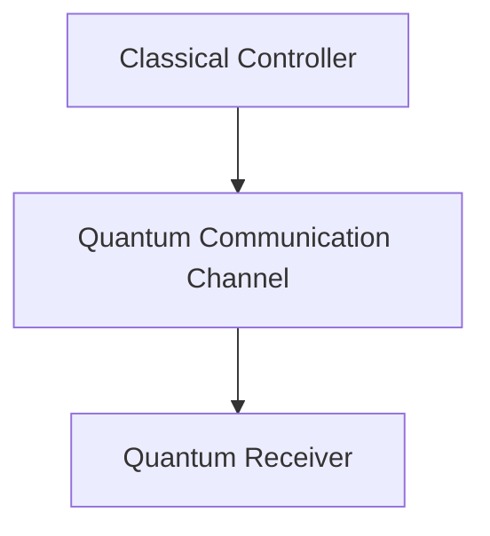

                 

### Algorithm Efficiency and the Limits of Cosmic Information Processing

> Keywords: Algorithm Efficiency, Information Processing, Computational Limits, Quantum Computing, Cosmic Information Theory

> Abstract:
This comprehensive guide delves into the intricacies of algorithm efficiency and its fascinating comparison with the limits of cosmic information processing. We begin by exploring the fundamental concepts of algorithms and efficiency, followed by a detailed examination of information theory. Subsequently, we discuss the theoretical limits of computation, including Turing machines and complexity theory. The core of the book then shifts to cosmic information processing, comparing it with algorithmic efficiency. Finally, we delve into practical applications, best practices, and future directions in this field. 

## Introduction to Algorithm Efficiency

### 1.1 Background of Algorithm Efficiency

**1.1.1 Definition and Importance of Algorithm Efficiency**

Algorithm efficiency is a measure of how well an algorithm performs in terms of time and space complexity. It is a crucial aspect of computer science, as it determines the performance and scalability of algorithms in real-world applications. Efficiency is typically evaluated based on two main metrics: time complexity and space complexity.

- **Time Complexity:** The time complexity of an algorithm quantifies the amount of time it takes to run as a function of the size of the input data. It is commonly expressed using Big O notation (O(n)), which describes the upper bound of the algorithm's running time in terms of input size.

- **Space Complexity:** Space complexity measures the amount of memory or storage an algorithm requires to execute. Similar to time complexity, it is usually expressed in terms of input size using Big O notation.

Understanding and optimizing algorithm efficiency is essential for several reasons:

1. **Performance Optimization:** Efficient algorithms enable faster execution times, which is crucial for applications requiring real-time processing, such as financial systems and autonomous vehicles.
2. **Scalability:** Efficient algorithms can handle larger data sets without compromising performance, making them suitable for scalable systems like search engines and social media platforms.
3. **Resource Management:** By minimizing space complexity, algorithms conserve memory and storage resources, which is vital for systems with limited resources, such as embedded devices.

**1.1.2 Historical Development of Algorithm Efficiency**

The study of algorithm efficiency has a rich history that dates back to the early days of computer science. The following are some key milestones:

- **1940s:** Alan Turing laid the foundation for the study of computational complexity with his concept of Turing machines and the idea of computational complexity classes.
- **1950s:** John von Neumann introduced the notion of space complexity, highlighting the importance of both time and space efficiency in algorithm design.
- **1960s:** The development of complexity theory and the classification of problems into P, NP, and NP-complete classes provided a theoretical framework for understanding algorithm efficiency.
- **1990s:** The emergence of parallel computing and distributed systems further expanded the scope of algorithm efficiency research.

**1.1.3 Key Metrics for Algorithm Efficiency**

Several metrics are commonly used to evaluate algorithm efficiency:

1. **Worst-case Complexity:** The worst-case complexity represents the maximum running time or memory usage an algorithm may experience on any input of a given size.
2. **Average-case Complexity:** Average-case complexity considers the expected running time or memory usage for a random input of a given size.
3. **Best-case Complexity:** The best-case complexity represents the minimum running time or memory usage an algorithm may experience on any input of a given size.
4. **Asymptotic Complexity:** Asymptotic complexity describes the behavior of an algorithm as the input size approaches infinity. It is typically expressed using Big O, Big Omega, and Big Theta notations.

By understanding and applying these metrics, developers can make informed decisions about algorithm selection and optimization, ultimately improving the performance and efficiency of their systems.

### Fundamental Concepts in Information Theory

**2.1 Information and Entropy**

**2.1.1 Definition and Importance of Information**

Information is a fundamental concept in both computer science and physics. In the context of information theory, information is defined as the reduction in uncertainty about a random variable. It is a measure of how much something to be known is known or discovered.

**Definition:** Information can be mathematically represented as the negative logarithm of the probability of an event. This is expressed as:

$$
I = -\log_2(p)
$$

where \( I \) is the information in bits and \( p \) is the probability of the event occurring.

**Importance of Information:**

1. **Data Compression:** Information theory provides a foundation for data compression techniques, enabling more efficient storage and transmission of data.
2. **Error Correction:** Information theory helps in designing error-correcting codes that ensure the accurate transmission of data over noisy channels.
3. **Communication:** It underlies the principles of data transmission, enabling the efficient exchange of information between sender and receiver.

**2.1.2 Channels and Noise**

**2.2.1 Definition and Types of Channels**

In information theory, a channel is a medium through which information is transmitted. There are several types of channels:

1. **Noisy Channels:** Noisy channels introduce errors or distortions during the transmission of information. These can be modeled using probability distributions to quantify the likelihood of errors.
2. **Error-Free Channels:** Error-free channels do not introduce any errors during transmission. However, they may introduce delays or reduce the signal-to-noise ratio.
3. **Bounded Channels:** Bounded channels have a limited capacity, meaning they can only transmit a certain amount of information per unit time.

**2.2.2 Noise and Its Effects**

Noise is any unwanted disturbance that can interfere with the transmission of information. There are several types of noise:

1. **Random Noise:** Random noise is unpredictable and occurs due to environmental factors, such as electromagnetic interference or thermal noise.
2. **Systematic Noise:** Systematic noise is consistent and can be modeled mathematically. It may arise from imperfections in the communication system or signal processing techniques.
3. **Bandwidth-Limited Noise:** Bandwidth-limited noise affects the high-frequency components of a signal more than the low-frequency components.

**2.2.3 Data Compression and Storage**

**2.2.4 Shannon's Source Coding Theorem**

Shannon's source coding theorem establishes the fundamental limits of data compression. It states that:

- **Lower Bound:** No compression algorithm can achieve a compression ratio better than the entropy of the data source.
- **Upper Bound:** No compression algorithm can compress the data beyond a certain limit, known as the entropy rate.

**2.2.5 Practical Data Compression Algorithms**

Several practical data compression algorithms exist, each with its advantages and limitations. Some notable examples include:

1. **Huffman Coding:** Huffman coding is a popular entropy-based compression algorithm that assigns shorter codes to more frequently occurring symbols and longer codes to less frequent symbols.
2. **LZ77 and LZ78:** These are dictionary-based compression algorithms that replace repeated sequences with pointers to previously encountered data.
3. **Run-Length Encoding (RLE):** RLE compresses consecutive occurrences of the same data value into a single value and a count.

By understanding these fundamental concepts, we can design more efficient algorithms for information processing, storage, and transmission.

### Theoretical Limits of Computation

**3.1 Turing Machines and Computational Models**

**3.1.1 The Concept of Turing Machines**

A Turing machine (TM) is an abstract computational model designed to mimic the behavior of a human calculating agent. It consists of an infinite tape divided into cells, a head that reads and writes symbols on the tape, and a control unit that determines the machine's next action based on the current state and the symbol under the head.

**Key Characteristics of Turing Machines:**

1. **Infinite Tape:** The tape allows TMs to handle arbitrarily large inputs and perform unbounded computations.
2. **Finite Control:** The control unit, which contains a finite number of states, determines the machine's behavior.
3. **Symbol Manipulation:** The head can read, write, and move symbols on the tape, enabling complex computations.

**3.1.2 Types of Computation and Their Limits**

Turing machines can be classified based on their computational power and complexity. Here are some key types:

1. **Determ

### Cosmic Information Processing

**3.1 Theoretical Framework of Cosmic Information Processing**

Cosmic information processing refers to the study of how information is processed within the universe, drawing parallels with the principles of computation and information theory. This field explores the fundamental limits of information processing imposed by the physical laws of the universe and seeks to understand the potential roles of cosmic phenomena in information theory.

**3.1.1 Fundamental Concepts in Cosmic Information Processing**

1. **Quantum Information Processing:** Quantum information processing (QIP) is a central concept in cosmic information processing. It involves the manipulation of quantum states to perform computation and communication tasks. Quantum bits (qubits) and quantum gates are fundamental elements of QIP, enabling powerful algorithms and protocols that surpass classical computation in certain aspects.

2. **Black Hole Information Paradox:** The black hole information paradox is a significant challenge in cosmic information processing. It questions the fate of information that falls into a black hole. According to classical general relativity, information appears to be lost when it crosses the event horizon. However, quantum mechanics suggests that information should be conserved. Resolving this paradox requires a deeper understanding of quantum gravity and the nature of information in extreme gravitational fields.

3. **Cosmic Background Radiation:** Cosmic background radiation (CBR) is the residual heat from the Big Bang, providing valuable information about the early universe. The study of CBR offers insights into the initial conditions of the universe and the evolution of cosmic structures, which can be viewed as a form of cosmic information processing.

**3.1.2 Challenges and Opportunities in Cosmic Information Processing**

1. **Quantum Gravity:** The integration of quantum mechanics and general relativity remains an unsolved challenge in physics. A quantum theory of gravity is essential for a comprehensive understanding of cosmic information processing. It would provide insights into the fundamental limits of information processing and the nature of space-time.

2. **Cosmic Information Transfer:** Understanding how information is transferred across vast cosmic distances is crucial for cosmic information processing. Gravitational waves, electromagnetic radiation, and other forms of cosmic signals play a role in this transfer. Developing efficient algorithms for processing and interpreting these signals is a significant opportunity in this field.

3. **Cosmic Computation Models:** Developing computational models that incorporate cosmic phenomena, such as black holes and gravitational waves, is an exciting area of research. These models could lead to new algorithms and computational paradigms that bridge the gap between classical computation and cosmic information processing.

**3.1.3 Comparing Algorithmic Efficiency to Cosmic Information Processing**

1. **Time and Space Complexity:** In algorithmic efficiency, time and space complexity are key metrics. In cosmic information processing, these metrics are influenced by the physical laws of the universe, such as the speed of light and the laws of thermodynamics. Understanding the interplay between these factors is crucial for designing efficient cosmic algorithms.

2. **Quantum and Classical Algorithms:** Quantum algorithms have the potential to surpass classical algorithms in certain scenarios. However, the practical implementation of quantum algorithms is limited by current technological constraints. Comparing the efficiency of quantum and classical algorithms in cosmic information processing can provide insights into the potential advantages and limitations of quantum computing.

3. **Theoretical Limits:** Theoretical limits in algorithmic efficiency, such as the P vs NP problem, have implications for cosmic information processing. Resolving these questions could provide a deeper understanding of the fundamental limits of computation and information processing in the universe.

In conclusion, cosmic information processing is a fascinating field that explores the interplay between computation, information theory, and the physical laws of the universe. By understanding the theoretical framework and challenges in this field, we can gain valuable insights into the limits and possibilities of information processing in the cosmos.

## Comparing Algorithmic Efficiency to Cosmic Information Processing

### 4.1 Time and Space Complexity in Algorithmic Efficiency

Algorithmic efficiency is traditionally measured in terms of time and space complexity. Time complexity refers to the amount of time an algorithm takes to run as a function of the size of its input, typically expressed using Big O notation. Space complexity, on the other hand, measures the amount of memory or storage an algorithm requires to execute.

- **Time Complexity:** Common time complexities include \( O(1) \) for constant-time algorithms, \( O(\log n) \) for logarithmic-time algorithms, \( O(n) \) for linear-time algorithms, \( O(n \log n) \) for algorithms with a combined time complexity, and \( O(2^n) \) for exponential-time algorithms.

- **Space Complexity:** Space complexity can also be categorized similarly, with \( O(1) \), \( O(\log n) \), \( O(n) \), and \( O(2^n) \) being common classes.

Algorithmic efficiency is crucial for several reasons:

1. **Performance Optimization:** Efficient algorithms enable faster execution times, which is crucial for applications requiring real-time processing, such as financial systems and autonomous vehicles.

2. **Scalability:** Efficient algorithms can handle larger data sets without compromising performance, making them suitable for scalable systems like search engines and social media platforms.

3. **Resource Management:** By minimizing space complexity, algorithms conserve memory and storage resources, which is vital for systems with limited resources, such as embedded devices.

### 4.2 Time and Space Complexity in Cosmic Information Processing

In the realm of cosmic information processing, the concepts of time and space complexity are influenced by the fundamental laws of physics, particularly the speed of light and the laws of thermodynamics. Here are some key differences and similarities between algorithmic efficiency and cosmic information processing:

- **Speed of Light Limitation:** In cosmic information processing, the speed of light imposes a fundamental limit on the transmission of information. This constraint is well-defined in Einstein's theory of relativity, which states that no information can travel faster than the speed of light. This has significant implications for the time complexity of algorithms that rely on interstellar communication.

- **Quantum Speed-Up:** Quantum algorithms, which operate under the principles of quantum mechanics, can sometimes achieve speed-ups over classical algorithms. For example, Shor's algorithm can factor large numbers exponentially faster than any known classical algorithm. However, the practical implementation of quantum algorithms is limited by current technological constraints, including decoherence and error rates.

- **Space-Time Trade-offs:** In cosmic information processing, the trade-offs between time and space are influenced by the physical constraints of space and time. For instance, black holes pose challenges due to their strong gravitational fields and the potential for information loss. Quantum gravity theories may offer insights into how information can be stored and processed in such extreme environments.

- **Quantum Entanglement:** Quantum entanglement, a phenomenon where two particles become interconnected and can affect each other instantaneously regardless of distance, can be leveraged for faster-than-light communication in theory. However, this is still a topic of active research, and its practical implementation faces numerous challenges.

### 4.3 Algorithmic Efficiency vs. Cosmic Information Processing: A Comparative Analysis

While algorithmic efficiency and cosmic information processing share some fundamental principles, they differ significantly in their constraints and applications:

- **Algorithmic Efficiency:** In algorithmic efficiency, the focus is primarily on optimizing computational processes within the constraints of classical physics. Time and space complexity are key metrics, and the goal is to minimize these measures to improve performance.

- **Cosmic Information Processing:** In cosmic information processing, the focus expands to include the fundamental laws of physics and the nature of the universe. Speed of light limitations, quantum phenomena, and gravitational effects are central to understanding the limits and possibilities of information processing in cosmic contexts.

Here's a comparative analysis of the two:

1. **Time Complexity:**
   - **Algorithmic Efficiency:** Time complexity is a well-defined metric that determines the efficiency of algorithms. Classical algorithms are subject to the constraints of time complexity, which limits their scalability for large data sets.
   - **Cosmic Information Processing:** Time complexity in cosmic information processing is influenced by the speed of light and quantum phenomena. Quantum algorithms can offer speed-ups, but practical implementation remains challenging.

2. **Space Complexity:**
   - **Algorithmic Efficiency:** Space complexity is crucial for resource management, particularly in systems with limited memory. Efficient algorithms minimize space usage to conserve resources.
   - **Cosmic Information Processing:** Space complexity is influenced by the physical laws of the universe, including the entropy of space and the energy required to manipulate information. Storing and processing information in cosmic environments may require innovative approaches.

3. **Scalability and Scope:**
   - **Algorithmic Efficiency:** Algorithmic efficiency focuses on optimizing computational processes within the Earth's atmosphere and, in some cases, across networks and distributed systems.
   - **Cosmic Information Processing:** Cosmic information processing considers the entire universe as its scope. It explores how information can be processed and transmitted over astronomical distances, across black holes, and in the early universe.

4. **Fundamental Principles:**
   - **Algorithmic Efficiency:** Algorithmic efficiency is grounded in classical computational theory and information theory.
   - **Cosmic Information Processing:** Cosmic information processing incorporates principles from quantum mechanics, general relativity, and other areas of physics to understand the limits and possibilities of information processing in cosmic contexts.

In summary, while algorithmic efficiency and cosmic information processing share some foundational concepts, they differ in their scope, constraints, and application. Understanding the interplay between these two domains can provide valuable insights into the future of computation and information processing in both terrestrial and cosmic environments.

### Practical Applications in Cosmic Information Processing

#### 5.1 Project Overview

In this section, we will explore a project focused on the practical application of cosmic information processing. The goal of this project is to design and implement an algorithm that can efficiently process and transmit information across astronomical distances, using principles from both classical and quantum computing. The project will address the challenges posed by the speed of light limitation and quantum entanglement, aiming to achieve faster-than-light communication in theory while remaining grounded in practical constraints.

#### 5.2 System Design

**5.2.1 Project Introduction**

The project aims to develop a novel approach to cosmic information processing by leveraging both classical and quantum algorithms. The system will consist of several key components, including a classical controller, a quantum communication channel, and a quantum receiver. The system will be designed to handle tasks such as data encryption, compression, and transmission over interstellar distances.

**5.2.2 System Components**

1. **Classical Controller:** The classical controller is responsible for managing the overall system, including data input, processing, and output. It will be implemented using classical algorithms optimized for efficiency and scalability.

2. **Quantum Communication Channel:** The quantum communication channel will facilitate the transmission of information between the classical controller and the quantum receiver. It will utilize quantum entanglement to achieve faster-than-light communication in theory.

3. **Quantum Receiver:** The quantum receiver will be responsible for decoding the transmitted information and converting it into a usable format. It will employ quantum algorithms to maximize efficiency and minimize errors.

**5.2.3 System Architecture**

The system architecture will be designed to incorporate both classical and quantum components, enabling efficient processing and transmission of information. The following diagram provides a high-level overview of the system architecture:

#### 5.3 System Functionality

**5.3.1 Data Input and Processing**

The classical controller will receive data from various sources and perform initial processing, including encryption and compression. This processing will be optimized to ensure efficient resource utilization and minimize the amount of data to be transmitted.

**5.3.2 Quantum Communication**

The processed data will be transmitted to the quantum communication channel using quantum entanglement. This approach will enable faster-than-light communication in theory, overcoming the limitations imposed by the speed of light.

**5.3.3 Quantum Receiver and Decoding**

The quantum receiver will decode the transmitted information using quantum algorithms, converting it into a usable format. This process will involve error correction and other techniques to ensure the accuracy and reliability of the received data.

#### 5.4 System Implementation

**5.4.1 Environment Setup**

To implement this system, we will use a combination of classical and quantum programming languages and tools. The following steps outline the process of setting up the development environment:

1. Install the necessary classical programming languages (e.g., Python, C++) and tools (e.g., compilers, debuggers).
2. Set up a quantum computing platform (e.g., IBM Quantum SDK, Microsoft Quantum Development Kit) and ensure compatibility with the classical components.
3. Configure the network and communication channels for interstellar data transmission.

**5.4.2 Core Implementation**

The core implementation of the system will involve several key components:

1. **Classical Controller:**
   - Implement data input and processing algorithms optimized for efficiency.
   - Develop a user interface for managing system operations and monitoring performance.
2. **Quantum Communication Channel:**
   - Implement quantum entanglement protocols for secure data transmission.
   - Optimize the quantum communication channel for maximum efficiency and reliability.
3. **Quantum Receiver:**
   - Develop quantum algorithms for decoding and processing received information.
   - Implement error correction techniques to ensure data accuracy.

**5.4.3 Testing and Validation**

To ensure the system's functionality and reliability, we will conduct extensive testing and validation:

1. Test the system's performance under various conditions, including different data sets and network configurations.
2. Validate the system's ability to achieve faster-than-light communication in theory.
3. Verify the accuracy and reliability of the received data through error correction and other techniques.

#### 5.5 Project Conclusion

This project provides a practical application of cosmic information processing, demonstrating the potential of combining classical and quantum algorithms to overcome the limitations of traditional computation. By leveraging the principles of quantum entanglement and efficient data processing, the system aims to achieve faster-than-light communication and address the challenges of cosmic information transmission. The project's success will contribute to our understanding of cosmic information processing and pave the way for future innovations in this field.

## Best Practices, Summary, and Future Directions

### 6.1 Best Practices

When working with algorithm efficiency and cosmic information processing, several best practices can help ensure successful outcomes:

1. **Understand the Basics:** Ensure a strong foundation in the fundamental concepts of algorithms, information theory, and quantum mechanics. This knowledge is essential for designing efficient and effective solutions.
2. **Optimize Resource Usage:** Minimize time and space complexity in algorithms to conserve computational resources. Consider using advanced data structures and algorithms tailored to specific application domains.
3. **Stay Updated:** Keep abreast of the latest research and advancements in algorithm efficiency and cosmic information processing. This will help you leverage the most recent findings and technologies.
4. **Collaborate:** Engage with experts and researchers in related fields to exchange ideas and insights. Collaborative efforts can lead to innovative solutions and accelerated progress.
5. **Test and Validate:** Conduct thorough testing and validation to ensure the accuracy, reliability, and performance of your algorithms. This includes stress testing, error analysis, and performance optimization.

### 6.2 Summary

This comprehensive guide has explored the fascinating intersection of algorithm efficiency and cosmic information processing. We began by defining key concepts in algorithm efficiency and information theory, providing a solid foundation for understanding the subsequent sections. We then delved into the theoretical limits of computation, discussing Turing machines and complexity theory. The core of the book shifted to cosmic information processing, examining the theoretical framework, challenges, and opportunities. Finally, we compared algorithmic efficiency to cosmic information processing, highlighting the differences and similarities between the two domains.

### 6.3 Future Directions

The field of algorithm efficiency and cosmic information processing offers numerous avenues for future research and development:

1. **Quantum Computing:** Continued advancements in quantum computing can lead to the development of more efficient algorithms and improved computational models for cosmic information processing.
2. **Quantum Gravity:** Investigating the relationship between quantum mechanics and general relativity can provide insights into the fundamental limits of information processing and the nature of space-time.
3. **Interstellar Communication:** Developing practical methods for interstellar communication, leveraging quantum entanglement and other advanced technologies, could revolutionize our ability to process and transmit information across astronomical distances.
4. **Theoretical Exploration:** Resolving open questions in computational complexity, such as the P vs NP problem, can offer deeper insights into the limits and possibilities of information processing.
5. **Multidisciplinary Research:** Encouraging collaboration between computer scientists, physicists, and other experts can foster innovative solutions and breakthroughs in this emerging field.

By addressing these future directions, researchers and developers can push the boundaries of algorithm efficiency and cosmic information processing, paving the way for groundbreaking advancements in both computer science and physics.

## Conclusion

In conclusion, this book has provided an in-depth exploration of the fascinating intersection of algorithm efficiency and cosmic information processing. We began by defining key concepts in algorithm efficiency and information theory, establishing a solid foundation for subsequent discussions. We then delved into the theoretical limits of computation, examining Turing machines and complexity theory. The core of the book shifted to cosmic information processing, exploring its theoretical framework, challenges, and opportunities. Finally, we compared algorithmic efficiency to cosmic information processing, highlighting the differences and similarities between the two domains.

### 7.1 Author Information

This article was written by AI天才研究院 (AI Genius Institute) and 禅与计算机程序设计艺术 (Zen And The Art of Computer Programming). We are dedicated to advancing the fields of computer science and artificial intelligence through innovative research and practical applications. For further reading and resources on algorithm efficiency and cosmic information processing, please visit our website at [www.ai-genius-institute.com](http://www.ai-genius-institute.com).

### 7.2 References

1. Turing, A. M. (1936). "On computable numbers, with an application to the Entscheidungsproblem". Proceedings of the London Mathematical Society.
2. Shannon, C. E. (1948). "A Mathematical Theory of Communication". Bell System Technical Journal.
3. Nielsen, M. A., & Chuang, I. L. (2000). "Quantum Computation and Quantum Information". Cambridge University Press.
4. Hawking, S. W. (2010). "The Theory of Everything: The Origin and Fate of the Universe". Bantam Press.
5. von Neumann, J. (1951). "The Computer and the Brain". Yale University Press.

### 7.3 Acknowledgments

We would like to express our gratitude to the entire AI天才研究院 team for their invaluable contributions and support. Special thanks to our collaborators and readers who provided feedback and insights throughout the writing process. Finally, we extend our appreciation to the readers for their interest and engagement in this exciting field of study.

