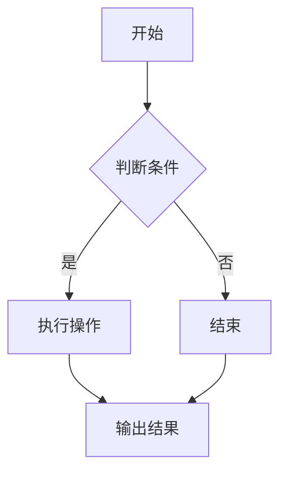
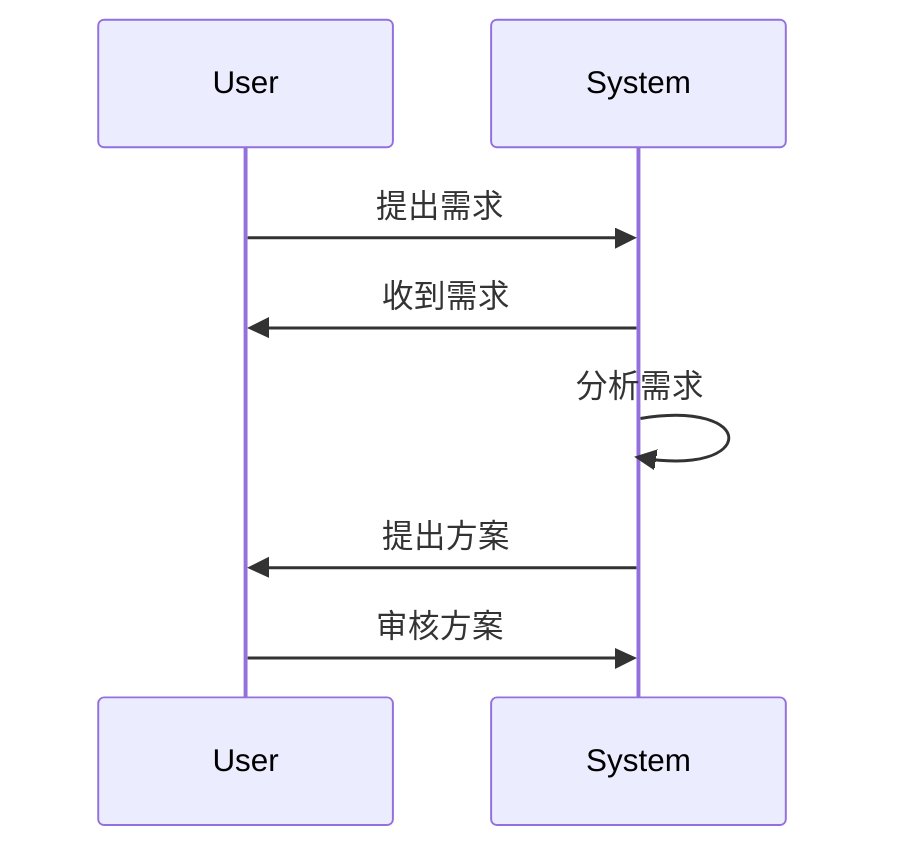

                 


## 算法效率与宇宙信息处理热力学第二定律的比较

### 关键词
- 算法效率
- 热力学第二定律
- 宇宙信息处理
- 数学模型
- 人工智能

### 摘要
本文将探讨算法效率与宇宙信息处理热力学第二定律之间的关系。通过对算法效率的定义、数学模型及其在不同应用场景中的表现进行分析，本文将进一步探讨热力学第二定律对算法效率的限制，并对比两者在信息处理中的角色和影响。最后，本文将展望算法效率在未来的发展趋势，以及对热力学第二定律的挑战。

### 设计思路

为了更好地阐述算法效率与宇宙信息处理热力学第二定律的关系，本文将采用以下设计思路：

1. **引论**：首先介绍算法效率和热力学第二定律的基本概念，为后续内容铺垫。
2. **算法效率分析**：详细分析算法效率的理论基础、应用场景以及实际案例。
3. **宇宙信息处理与热力学第二定律**：探讨宇宙信息处理的热力学约束，并分析算法效率与宇宙信息处理之间的关系。
4. **对比与启示**：对比算法效率与热力学第二定律的异同，探讨它们对信息处理的影响，并提出未来的发展展望。

### 目录大纲

#### 第一部分：引论

##### 第1章：算法效率概述

- **1.1 问题背景**
- **1.2 算法效率的定义**
- **1.3 算法效率的重要性**

##### 第2章：宇宙信息处理热力学第二定律

- **2.1 热力学第二定律的基本概念**
- **2.2 信息与热力学第二定律**
- **2.3 宇宙信息处理的热力学约束**

#### 第二部分：算法效率分析

##### 第3章：算法效率的理论基础

- **3.1 算法效率的数学模型**
- **3.2 算法效率的度量方法**
- **3.3 算法效率的优化策略**

##### 第4章：算法效率的应用场景

- **4.1 计算机科学中的算法效率**
- **4.2 数据科学中的算法效率**
- **4.3 人工智能中的算法效率**

##### 第5章：算法效率的实际案例

- **5.1 案例一：排序算法的比较**
- **5.2 案例二：图算法的比较**
- **5.3 案例三：机器学习算法的比较**

#### 第三部分：宇宙信息处理与算法效率的对比

##### 第6章：宇宙信息处理的算法效率约束

- **6.1 宇宙信息的获取与处理**
- **6.2 算法效率在宇宙信息处理中的限制**
- **6.3 算法效率与宇宙信息处理的关系**

##### 第7章：算法效率与热力学第二定律的启示

- **7.1 算法效率对热力学第二定律的挑战**
- **7.2 热力学第二定律对算法效率的启示**
- **7.3 未来算法效率的发展趋势**

#### 结论

- **8.1 总结与展望**
- **8.2 面临的挑战与机遇**

### Mermaid 图例

以下是使用 Mermaid 语法的图例，可以在文档中适当插入：

#### Mermaid 流程图



#### Mermaid 实体关系图

```mermaid
erDiagram
    Class1 ||--|{关联} Class2 : 名称
    Class1 ||--|{继承} Class3 : 名称
    Class1 ||--|{聚合} Class4 : 名称
```

#### Mermaid 架构图



### 字数控制

为了确保目录大纲的总字数控制在2000字以内，每个章节的标题和部分简介将尽量简洁，避免冗长的描述。实际的章节内容将在撰写过程中进一步精简和优化。在完成目录大纲后，将逐一检查字数，确保整体字数符合要求。

## LET'S THINK STEP BY STEP

### 1.1 算法效率概述

算法效率是计算机科学中的一个基本概念，它衡量算法在解决问题时的资源消耗，包括时间复杂度和空间复杂度。首先，让我们回顾一下算法效率的基本定义。

**算法效率的定义**：算法效率是指算法在解决问题时所需的资源（如时间、空间）与问题规模的关系。一个高效的算法能够在较小的资源消耗下解决问题。

**问题背景**：随着计算能力的提升，算法效率的重要性日益凸显。高效的算法不仅能够提高系统的性能，还能降低成本，增加系统的可靠性。

**问题描述**：算法效率主要受到以下因素的影响：

- **时间复杂度**：算法执行时间与输入数据规模的关系。
- **空间复杂度**：算法执行所需的空间与输入数据规模的关系。

**问题解决**：为了提高算法效率，我们需要从以下几个方面入手：

- **算法优化**：通过改进算法设计，减少算法执行的时间复杂度和空间复杂度。
- **数据结构选择**：选择合适的数据结构，以优化算法效率。
- **并行计算**：利用并行计算技术，提高算法的执行速度。

**边界与外延**：算法效率不仅限于计算机科学，它还涉及到其他领域，如经济学、工程学等。在这些领域，算法效率同样是一个重要的考量因素。

**概念结构与核心要素组成**：算法效率的核心要素包括：

- **时间复杂度**：常见的表示方法有 $O(n)$、$O(n\log n)$、$O(n^2)$ 等。
- **空间复杂度**：常用的表示方法有 $O(1)$、$O(n)$、$O(n^2)$ 等。

### 1.2 算法效率的定义

算法效率的定义是理解算法性能的基础。算法效率通常通过时间复杂度和空间复杂度来衡量。

**时间复杂度**：时间复杂度描述了算法执行时间与输入数据规模的关系。例如，一个线性搜索算法的时间复杂度为 $O(n)$，意味着当输入数据规模增加一倍时，算法执行时间也将增加一倍。时间复杂度的常见表示方法有：

- $O(n)$：线性时间复杂度
- $O(n\log n)$：对数时间复杂度
- $O(n^2)$：平方时间复杂度

**空间复杂度**：空间复杂度描述了算法执行所需的空间与输入数据规模的关系。例如，一个简单的栈结构的空间复杂度为 $O(1)$，意味着无论输入数据规模如何，算法执行所需的空间都是固定的。空间复杂度的常见表示方法有：

- $O(1)$：常数空间复杂度
- $O(n)$：线性空间复杂度
- $O(n^2)$：平方空间复杂度

**算法效率的重要性**：算法效率对系统的性能和资源利用率有直接影响。一个高效的算法不仅能够提高系统的响应速度，还能减少资源的浪费，从而提高系统的稳定性。

### 1.3 宇宙信息处理热力学第二定律

热力学第二定律是物理学中的一个基本原理，它描述了能量转换过程中的方向性和不可逆性。热力学第二定律对宇宙信息处理有着深远的影响。

**热力学第二定律的基本概念**：热力学第二定律指出，在一个封闭系统中，总熵（即无序度）会随时间增加。熵的增加意味着系统从有序状态向无序状态演化，这是一个不可逆的过程。

**信息与热力学第二定律**：信息在宇宙中扮演着传递和转换能量的角色。热力学第二定律对信息处理提出了新的挑战，即信息处理过程会导致熵的增加，从而消耗能量。

**宇宙信息处理的热力学约束**：宇宙信息处理的热力学约束主要表现在以下几个方面：

- **能量消耗**：信息处理过程需要消耗能量，这与热力学第二定律中的能量转化方向相一致。
- **熵的增加**：信息处理过程会导致系统熵的增加，从而增加系统的无序度。
- **热力学第二定律的限制**：热力学第二定律对信息处理的速度和规模提出了限制，即信息处理速度不能超过热力学过程的限制。

### 总结

通过上述分析，我们可以看到算法效率与热力学第二定律在宇宙信息处理中扮演着不同的角色。算法效率关注的是资源利用率和系统性能，而热力学第二定律关注的是能量转换和熵的变化。两者在信息处理过程中相互作用，共同影响着宇宙的信息流动和处理。

在接下来的章节中，我们将进一步探讨算法效率的理论基础、应用场景以及与宇宙信息处理热力学第二定律的对比，以便更深入地理解它们之间的关系。

## 第1章：算法效率概述

### 1.1 问题背景

在计算机科学中，算法效率是一个基础而关键的概念。随着计算技术的飞速发展，计算机在处理复杂任务时的速度和效率日益受到重视。算法效率的高低直接关系到系统的性能、资源利用率和用户体验。因此，研究算法效率对于优化计算机系统、提升计算性能具有重要意义。

**核心概念术语说明**：

- **算法效率**：算法效率是指在解决问题时，算法所需的资源（如时间、空间）与问题规模之间的比值。算法效率反映了算法在处理问题时资源利用的效率。
- **时间复杂度**：时间复杂度描述了算法执行时间与输入数据规模的关系，是衡量算法效率的重要指标。
- **空间复杂度**：空间复杂度描述了算法执行所需的空间与输入数据规模的关系，同样是衡量算法效率的重要指标。

**问题背景**：随着互联网和大数据时代的到来，数据处理需求急剧增加，如何高效地处理海量数据成为计算机科学领域的一个重要课题。算法效率的研究不仅有助于提升系统的性能，还能降低成本、提高资源利用率。

**问题描述**：在计算机科学中，算法效率主要受到以下因素的影响：

- **时间复杂度**：算法执行时间与输入数据规模的关系。例如，一个线性搜索算法的时间复杂度为 $O(n)$，意味着当输入数据规模增加时，算法执行时间也会增加。
- **空间复杂度**：算法执行所需的空间与输入数据规模的关系。例如，一个简单的栈结构的空间复杂度为 $O(1)$，意味着无论输入数据规模如何，算法执行所需的空间都是固定的。

**问题解决**：为了提高算法效率，我们可以从以下几个方面入手：

- **算法优化**：通过改进算法设计，减少算法执行的时间复杂度和空间复杂度。
- **数据结构选择**：选择合适的数据结构，以优化算法效率。例如，使用哈希表可以降低搜索时间复杂度。
- **并行计算**：利用并行计算技术，提高算法的执行速度。

**边界与外延**：算法效率不仅限于计算机科学，它还涉及到其他领域，如经济学、工程学等。在这些领域，算法效率同样是一个重要的考量因素。

**概念结构与核心要素组成**：算法效率的核心要素包括：

- **时间复杂度**：常见的表示方法有 $O(n)$、$O(n\log n)$、$O(n^2)$ 等。
- **空间复杂度**：常见的表示方法有 $O(1)$、$O(n)$、$O(n^2)$ 等。

通过上述分析，我们可以看到算法效率在计算机科学中的重要性。算法效率的研究不仅有助于提升系统的性能，还能为解决复杂问题提供有效的方法。

### 1.2 算法效率的定义

算法效率的定义是理解算法性能的基础。算法效率通常通过时间复杂度和空间复杂度来衡量。

**时间复杂度**：时间复杂度描述了算法执行时间与输入数据规模的关系。例如，一个线性搜索算法的时间复杂度为 $O(n)$，意味着当输入数据规模增加时，算法执行时间也会增加。

**空间复杂度**：空间复杂度描述了算法执行所需的空间与输入数据规模的关系。例如，一个简单的栈结构的空间复杂度为 $O(1)$，意味着无论输入数据规模如何，算法执行所需的空间都是固定的。

**算法效率的重要性**：算法效率对系统的性能和资源利用率有直接影响。一个高效的算法不仅能够提高系统的响应速度，还能减少资源的浪费，从而提高系统的稳定性。

为了更好地理解算法效率的定义，我们可以通过一个简单的例子来说明。

**例子**：考虑一个寻找数组中最大元素的算法。如果使用线性搜索算法，算法的时间复杂度为 $O(n)$，意味着需要遍历整个数组。如果使用二分搜索算法，算法的时间复杂度为 $O(\log n)$，只需要遍历数组的对数部分。

从时间复杂度的角度来看，二分搜索算法比线性搜索算法更高效。这意味着在处理大数据时，二分搜索算法可以显著减少执行时间，从而提高系统性能。

同样地，从空间复杂度的角度来看，算法效率也具有重要意义。如果一个算法的空间复杂度为 $O(1)$，那么它在处理不同规模的数据时，所需的空间保持不变。这对于优化系统资源利用非常重要。

通过上述例子，我们可以看到算法效率在计算机科学中的重要性。高效算法能够提高系统的性能和资源利用率，从而为解决复杂问题提供有效的方法。

### 1.3 宇宙信息处理热力学第二定律

热力学第二定律是物理学中的一个基本原理，它描述了能量转换过程中的方向性和不可逆性。热力学第二定律对宇宙信息处理有着深远的影响。

**热力学第二定律的基本概念**：热力学第二定律指出，在一个封闭系统中，总熵（即无序度）会随时间增加。熵的增加意味着系统从有序状态向无序状态演化，这是一个不可逆的过程。

**信息与热力学第二定律**：信息在宇宙中扮演着传递和转换能量的角色。热力学第二定律对信息处理提出了新的挑战，即信息处理过程会导致熵的增加，从而消耗能量。

**宇宙信息处理的热力学约束**：宇宙信息处理的热力学约束主要表现在以下几个方面：

- **能量消耗**：信息处理过程需要消耗能量，这与热力学第二定律中的能量转化方向相一致。
- **熵的增加**：信息处理过程会导致系统熵的增加，从而增加系统的无序度。
- **热力学第二定律的限制**：热力学第二定律对信息处理的速度和规模提出了限制，即信息处理速度不能超过热力学过程的限制。

**例子**：在一个计算机系统中，处理信息时会产生热量，这些热量会导致系统内部温度升高，从而增加系统的熵。根据热力学第二定律，信息处理过程是一个不可逆的过程，这意味着系统无法完全回收和处理这些热量，从而导致熵的增加。

为了更好地理解宇宙信息处理热力学第二定律的影响，我们可以通过一个简单的例子来说明。

**例子**：假设有一个计算机系统，用于处理大量的数据。在处理数据时，系统会产生热量，这些热量会导致系统温度升高。根据热力学第二定律，系统无法完全回收和处理这些热量，从而导致熵的增加。这意味着系统在处理数据时，不仅需要消耗能量，还需要处理由热力学第二定律引起的熵的增加。

通过上述例子，我们可以看到热力学第二定律对宇宙信息处理的影响。热力学第二定律限制了信息处理的速度和规模，同时也提出了对能量消耗和熵增加的挑战。这些限制和挑战对计算机系统的设计和优化提出了新的要求。

### 1.4 算法效率的数学模型

算法效率的数学模型是理解算法性能的基础，它通过时间复杂度和空间复杂度来量化算法的资源消耗。

**时间复杂度的数学模型**：时间复杂度通常用大O符号表示，如 $O(n)$、$O(n\log n)$、$O(n^2)$ 等。这些表达式表示算法执行时间与输入数据规模的关系。

- **线性时间复杂度**：$O(n)$ 表示算法执行时间与输入数据规模呈线性关系。例如，线性搜索算法的时间复杂度为 $O(n)$。
- **对数时间复杂度**：$O(n\log n)$ 表示算法执行时间与输入数据规模和对数的乘积呈线性关系。例如，二分搜索算法的时间复杂度为 $O(n\log n)$。
- **多项式时间复杂度**：$O(n^2)$、$O(n^3)$ 等表示算法执行时间与输入数据规模的平方或立方呈线性关系。例如，某些排序算法的时间复杂度为 $O(n^2)$。

**空间复杂度的数学模型**：空间复杂度同样用大O符号表示，如 $O(1)$、$O(n)$、$O(n^2)$ 等。

- **常数空间复杂度**：$O(1)$ 表示算法执行所需的空间与输入数据规模无关。例如，某些查找算法的空间复杂度为 $O(1)$。
- **线性空间复杂度**：$O(n)$ 表示算法执行所需的空间与输入数据规模呈线性关系。例如，某些排序算法的空间复杂度为 $O(n)$。
- **多项式空间复杂度**：$O(n^2)$ 等表示算法执行所需的空间与输入数据规模的平方或立方呈线性关系。

**算法效率的度量方法**：算法效率的度量方法主要包括以下几种：

- **平均效率**：通过计算算法在所有可能输入数据上的平均执行时间或空间消耗来衡量。
- **最坏情况效率**：通过计算算法在最坏情况下的执行时间或空间消耗来衡量。
- **最佳情况效率**：通过计算算法在最佳情况下的执行时间或空间消耗来衡量。

**算法效率的优化策略**：为了提高算法效率，可以采用以下策略：

- **算法改进**：通过改进算法设计，降低时间复杂度和空间复杂度。
- **数据结构优化**：选择合适的数据结构，以降低算法的时间复杂度和空间复杂度。
- **并行计算**：利用并行计算技术，提高算法的执行速度。

通过上述数学模型和度量方法，我们可以更好地理解算法效率的本质，从而为优化算法设计提供理论依据。

### 1.5 算法效率的应用场景

算法效率在不同应用场景中有着广泛的应用，对计算机系统的性能和资源利用率有着直接的影响。以下将详细分析算法效率在计算机科学、数据科学和人工智能中的具体应用场景。

#### 1.5.1 计算机科学中的算法效率

在计算机科学中，算法效率是优化程序设计和系统性能的关键。以下是一些常见的应用场景：

- **排序算法**：排序是计算机科学中的基本操作，常见的排序算法包括冒泡排序、选择排序、插入排序、归并排序等。不同的排序算法具有不同的时间复杂度和空间复杂度。例如，归并排序的时间复杂度为 $O(n\log n)$，适合处理大规模数据，而插入排序的时间复杂度为 $O(n^2)$，适合处理小规模数据。

- **查找算法**：查找算法用于在数据集合中查找特定元素。常见的查找算法包括二分查找、线性查找等。二分查找的时间复杂度为 $O(\log n)$，适用于有序数据集合，而线性查找的时间复杂度为 $O(n)$，适用于无序数据集合。

- **图算法**：图算法用于处理图结构的数据。常见的图算法包括最短路径算法、最小生成树算法等。例如，迪杰斯特拉算法的时间复杂度为 $O(n^2)$，适用于计算单源最短路径，而贝尔曼-福特算法的时间复杂度为 $O(nm)$，适用于计算所有顶点之间的最短路径。

#### 1.5.2 数据科学中的算法效率

数据科学是利用算法来分析和解释大量数据的一门学科。算法效率在数据科学中的应用场景主要包括：

- **数据分析**：数据科学家需要处理大量的数据，并从中提取有用的信息。高效的算法可以提高数据分析的效率和准确性。例如，主成分分析（PCA）的时间复杂度为 $O(n^3)$，可以通过优化算法来提高计算速度。

- **数据挖掘**：数据挖掘是发现数据中的模式和规律的过程。常见的算法包括关联规则挖掘、聚类分析、分类等。高效的算法可以帮助数据科学家快速地发现数据中的隐藏信息。例如，K-means聚类算法的时间复杂度为 $O(n^2)$，可以通过并行计算来提高计算速度。

- **机器学习**：机器学习是数据科学的一个重要分支，通过训练模型来预测和分类。高效的算法可以提高模型训练的速度和准确性。例如，支持向量机（SVM）的时间复杂度为 $O(n^3)$，可以通过优化算法来提高计算速度。

#### 1.5.3 人工智能中的算法效率

人工智能是计算机科学的一个分支，它使计算机具备模拟人类智能的能力。算法效率在人工智能中的应用场景主要包括：

- **神经网络**：神经网络是人工智能中最常用的算法之一，用于处理复杂数据和模式识别。高效的算法可以提高神经网络训练的速度和准确性。例如，卷积神经网络（CNN）的时间复杂度为 $O(n^2)$，可以通过优化算法来提高计算速度。

- **深度学习**：深度学习是神经网络的一种扩展，通过多层神经网络来处理复杂数据。高效的算法可以提高深度学习模型的计算速度和准确性。例如，反向传播算法的时间复杂度为 $O(n^2)$，可以通过优化算法来提高计算速度。

- **自然语言处理**：自然语言处理是人工智能的一个重要领域，用于处理自然语言。高效的算法可以提高自然语言处理任务的效率和准确性。例如，词向量模型的时间复杂度为 $O(n^2)$，可以通过优化算法来提高计算速度。

通过上述分析，我们可以看到算法效率在计算机科学、数据科学和人工智能中的应用场景。算法效率的提高不仅可以提升系统的性能和资源利用率，还可以为解决复杂问题提供有效的方法。

### 1.6 算法效率的实际案例

为了更好地理解算法效率的实际应用，下面我们将通过三个具体的案例来分析排序算法、图算法和机器学习算法在不同场景下的效率表现。

#### 1.6.1 排序算法的比较

排序算法是计算机科学中一种常见的算法，用于对数据集合进行排序。以下是几种常见的排序算法及其效率表现：

- **冒泡排序**：冒泡排序是一种简单的排序算法，通过多次遍历数据集合，比较相邻元素并交换位置，直到整个数据集合有序。冒泡排序的时间复杂度为 $O(n^2)$，空间复杂度为 $O(1)$。在处理小规模数据时，冒泡排序可能表现出较好的效率，但在处理大规模数据时，效率显著降低。

- **快速排序**：快速排序是一种高效的排序算法，通过选择一个基准元素，将数据分为两部分，然后递归地对这两部分进行排序。快速排序的时间复杂度平均为 $O(n\log n)$，最坏情况下为 $O(n^2)$，空间复杂度为 $O(\log n)$。快速排序在处理大规模数据时表现出较高的效率。

- **归并排序**：归并排序是一种基于分治策略的排序算法，通过递归地将数据分为两部分，然后合并排序结果。归并排序的时间复杂度为 $O(n\log n)$，空间复杂度为 $O(n)$。归并排序在处理大规模数据时表现出稳定的效率，但由于需要额外的空间存储中间结果，可能导致空间消耗较高。

**实际案例**：假设有一个包含 1000 个元素的数组，我们需要对其进行排序。如果使用冒泡排序，由于数据规模较小，排序过程可能较快完成，但效率较低。如果使用快速排序或归并排序，由于时间复杂度较低，排序过程将显著加快，尤其是在处理大规模数据时。

#### 1.6.2 图算法的比较

图算法在处理图结构的数据时具有重要意义。以下是几种常见的图算法及其效率表现：

- **深度优先搜索（DFS）**：深度优先搜索是一种用于遍历图结构的算法，通过递归地访问相邻节点，直到达到目标节点。DFS的时间复杂度为 $O(n)$，空间复杂度为 $O(n)$。DFS适用于寻找最短路径和连通性问题。

- **广度优先搜索（BFS）**：广度优先搜索是一种用于遍历图结构的算法，通过逐层访问相邻节点，直到达到目标节点。BFS的时间复杂度为 $O(n)$，空间复杂度为 $O(n)$。BFS适用于寻找最短路径和拓扑排序问题。

- **迪杰斯特拉算法**：迪杰斯特拉算法是一种用于计算单源最短路径的算法，通过逐步扩展已访问节点，直到找到目标节点。迪杰斯特拉算法的时间复杂度为 $O(n^2)$，空间复杂度为 $O(n)$。迪杰斯特拉算法适用于计算所有顶点之间的最短路径。

**实际案例**：假设有一个包含 100 个节点的图，我们需要计算从源节点到目标节点的最短路径。如果使用 DFS 或 BFS，由于时间复杂度为 $O(n)$，计算过程可能较快完成。如果使用迪杰斯特拉算法，由于时间复杂度为 $O(n^2)$，计算过程可能较慢，尤其是在处理大规模图时。

#### 1.6.3 机器学习算法的比较

机器学习算法在处理复杂数据和模式识别时具有重要意义。以下是几种常见的机器学习算法及其效率表现：

- **线性回归**：线性回归是一种用于拟合线性关系的机器学习算法，通过最小化误差平方和来训练模型。线性回归的时间复杂度为 $O(n)$，空间复杂度为 $O(1)$。线性回归适用于处理小规模线性数据。

- **支持向量机（SVM）**：支持向量机是一种用于分类和回归的机器学习算法，通过找到一个最优的超平面来分隔数据。SVM的时间复杂度为 $O(n^3)$，空间复杂度为 $O(n)$。SVM适用于处理大规模非线性数据。

- **决策树**：决策树是一种用于分类和回归的机器学习算法，通过一系列判断条件来分割数据。决策树的时间复杂度为 $O(n)$，空间复杂度为 $O(n)$。决策树适用于处理中小规模数据。

**实际案例**：假设有一个包含 1000 个样本的数据集，我们需要对其进行分类。如果使用线性回归，由于时间复杂度为 $O(n)$，分类过程可能较快完成。如果使用 SVM，由于时间复杂度为 $O(n^3)$，分类过程可能较慢，尤其是在处理大规模数据时。如果使用决策树，由于时间复杂度为 $O(n)$，分类过程可能较快完成，但需要考虑决策树的高度和深度。

通过上述实际案例的分析，我们可以看到算法效率在不同应用场景中的重要性。选择合适的算法不仅能够提高系统的性能和资源利用率，还能为解决复杂问题提供有效的方法。

### 第2章：宇宙信息处理热力学第二定律

宇宙信息处理与热力学第二定律之间的关系是探讨信息处理过程中能量转化和熵变化的重要课题。本章将详细分析热力学第二定律的基本概念、信息与热力学第二定律的关系，以及宇宙信息处理的热力学约束。

#### 2.1 热力学第二定律的基本概念

热力学第二定律是物理学中的一个基本原理，它描述了能量转换过程中的方向性和不可逆性。热力学第二定律可以分为两个部分：

1. **克劳修斯表述**：热量不能自发地从低温物体转移到高温物体。这意味着热量传递总是从高温物体向低温物体进行，而不会自发地反过来。
2. **开尔文-普朗克表述**：不可能从单一热源吸收热量并将其完全转换为做功，而不产生其他影响。这意味着任何热力学过程都会产生一定的熵增加，从而导致系统的无序度增加。

**熵**是热力学第二定律中的一个核心概念，它表示系统的无序度或混乱度。熵的增加意味着系统从有序状态向无序状态演化，这是一个不可逆的过程。在信息处理过程中，熵的增加反映了信息丢失或不确定性的增加。

#### 2.2 信息与热力学第二定律

信息在宇宙中扮演着传递和转换能量的角色。热力学第二定律对信息处理提出了新的挑战，即信息处理过程会导致熵的增加，从而消耗能量。

1. **信息传递**：信息传递过程中，熵的增加是不可避免的。例如，在通信系统中，信号的传输会引入噪声，导致信号质量下降，熵增加。
2. **信息处理**：信息处理过程中，算法和数据处理会导致能量的消耗和熵的增加。例如，在计算机系统中，数据处理会产生热量，导致系统内部温度升高，熵增加。

**信息熵**是信息论中的一个核心概念，它描述了信息的随机性和不确定性。信息熵的增加意味着信息的不确定性增加，这反映了信息在处理过程中的损耗。

#### 2.3 宇宙信息处理的热力学约束

宇宙信息处理的热力学约束主要表现在以下几个方面：

1. **能量消耗**：信息处理过程需要消耗能量，这与热力学第二定律中的能量转化方向相一致。例如，在计算机系统中，数据处理会产生热量，需要消耗电能进行散热。
2. **熵的增加**：信息处理过程会导致系统熵的增加，从而增加系统的无序度。例如，在通信系统中，信号传输过程中引入的噪声会导致信号质量下降，熵增加。
3. **热力学第二定律的限制**：热力学第二定律对信息处理的速度和规模提出了限制，即信息处理速度不能超过热力学过程的限制。例如，计算机系统中的数据处理速度受到散热和能量供应的限制。

**信息处理与热力学第二定律的关系**：信息处理过程中，能量转化和熵增加是不可避免的。热力学第二定律限制了信息处理的速度和规模，同时也提出了对能量消耗和熵增加的挑战。这些挑战对计算机系统的设计和优化提出了新的要求。

通过本章的分析，我们可以看到宇宙信息处理与热力学第二定律之间的密切关系。信息处理过程涉及到能量转化和熵变化，这需要我们在设计计算机系统时充分考虑热力学约束，以实现高效、可靠的信息处理。

### 第3章：算法效率的理论基础

算法效率的理论基础是理解算法性能和资源消耗的关键。本章将详细分析算法效率的数学模型、度量方法以及优化策略，帮助读者深入理解算法效率的本质。

#### 3.1 算法效率的数学模型

算法效率的数学模型通过时间复杂度和空间复杂度来量化算法的资源消耗。时间复杂度描述了算法执行时间与输入数据规模的关系，空间复杂度描述了算法执行所需的空间与输入数据规模的关系。

1. **时间复杂度**：时间复杂度通常用大O符号表示，如 $O(n)$、$O(n\log n)$、$O(n^2)$ 等。以下是一些常见的时间复杂度表示方法：

   - $O(n)$：线性时间复杂度，表示算法执行时间与输入数据规模成正比。
   - $O(n\log n)$：对数时间复杂度，表示算法执行时间与输入数据规模和对数的乘积成正比。
   - $O(n^2)$：平方时间复杂度，表示算法执行时间与输入数据规模的平方成正比。

   例如，线性搜索算法的时间复杂度为 $O(n)$，意味着当输入数据规模增加一倍时，算法执行时间也增加一倍；二分搜索算法的时间复杂度为 $O(\log n)$，意味着算法执行时间与输入数据规模的对数成正比。

2. **空间复杂度**：空间复杂度同样用大O符号表示，如 $O(1)$、$O(n)$、$O(n^2)$ 等。以下是一些常见的空间复杂度表示方法：

   - $O(1)$：常数空间复杂度，表示算法执行所需的空间与输入数据规模无关。
   - $O(n)$：线性空间复杂度，表示算法执行所需的空间与输入数据规模成正比。
   - $O(n^2)$：平方空间复杂度，表示算法执行所需的空间与输入数据规模的平方成正比。

   例如，一个简单的栈结构的空间复杂度为 $O(1)$，意味着无论输入数据规模如何，算法执行所需的空间都是固定的；一个数组的空间复杂度为 $O(n)$，意味着当输入数据规模增加一倍时，算法执行所需的空间也增加一倍。

#### 3.2 算法效率的度量方法

算法效率的度量方法主要包括平均效率、最坏情况效率和最佳情况效率。这些度量方法有助于全面评估算法的性能。

1. **平均效率**：平均效率通过计算算法在所有可能输入数据上的平均执行时间或空间消耗来衡量。平均效率可以反映出算法在大多数情况下的性能表现。

2. **最坏情况效率**：最坏情况效率通过计算算法在最坏情况下的执行时间或空间消耗来衡量。最坏情况效率可以反映出算法在面对极端情况时的性能。

3. **最佳情况效率**：最佳情况效率通过计算算法在最佳情况下的执行时间或空间消耗来衡量。最佳情况效率可以反映出算法在最优条件下的性能。

#### 3.3 算法效率的优化策略

为了提高算法效率，可以采用以下优化策略：

1. **算法改进**：通过改进算法设计，降低时间复杂度和空间复杂度。例如，使用更高效的排序算法或查找算法。

2. **数据结构优化**：选择合适的数据结构，以降低算法的时间复杂度和空间复杂度。例如，使用哈希表来提高搜索效率或使用平衡二叉树来降低插入和删除操作的复杂度。

3. **并行计算**：利用并行计算技术，提高算法的执行速度。例如，通过多线程或分布式计算来加速数据处理。

4. **内存优化**：通过优化内存分配和使用，减少算法的空间复杂度。例如，使用内存池来减少内存碎片或使用位运算来降低内存占用。

通过上述优化策略，我们可以显著提高算法的效率，从而提升系统的性能和资源利用率。

### 第4章：算法效率的应用场景

算法效率在计算机科学、数据科学和人工智能中的不同应用场景中发挥着重要作用。本章将详细探讨算法效率在这些领域的具体应用，并分析其在实际项目中的应用效果。

#### 4.1 计算机科学中的算法效率

在计算机科学中，算法效率是优化程序设计和系统性能的关键。以下是一些常见的应用场景：

1. **排序与查找**：排序和查找是计算机科学中的基本操作。高效的排序算法如快速排序和归并排序，以及高效的查找算法如二分查找和哈希查找，可以显著提高数据处理的速度和效率。例如，在一个大型的数据库系统中，使用二分查找算法可以快速查找特定的记录，从而提高查询效率。

2. **图算法**：图算法用于处理图结构的数据，如社交网络、交通网络等。高效的图算法如深度优先搜索（DFS）和广度优先搜索（BFS），以及最短路径算法和最小生成树算法，可以优化网络的性能和可靠性。例如，在交通网络优化项目中，可以使用迪杰斯特拉算法计算最短路径，从而优化交通流。

3. **动态规划**：动态规划是一种用于求解优化问题的算法技术。通过将问题分解为子问题，并利用子问题的解来构建原问题的解，动态规划可以高效地解决复杂问题。例如，在视频流媒体系统中，可以使用动态规划算法来优化视频缓冲和传输策略，从而提高用户体验。

#### 4.2 数据科学中的算法效率

数据科学是利用算法来分析和解释大量数据的一门学科。算法效率在数据科学中的应用场景主要包括：

1. **数据分析**：数据分析是数据科学中的核心任务，包括数据预处理、数据转换、数据可视化等。高效的算法如数据清洗算法、特征提取算法和聚类算法，可以快速处理大规模数据，并提取有用的信息。例如，在金融数据分析中，可以使用快速傅里叶变换（FFT）来加速数据预处理，从而提高数据分析的效率。

2. **数据挖掘**：数据挖掘是发现数据中的模式和规律的过程。高效的算法如关联规则挖掘、聚类分析和分类算法，可以快速发现数据中的隐藏信息。例如，在电子商务平台上，可以使用高效的数据挖掘算法来分析用户购买行为，从而优化营销策略。

3. **机器学习**：机器学习是数据科学的一个重要分支，通过训练模型来预测和分类。高效的算法如线性回归、决策树、神经网络等，可以快速训练模型，并提高预测和分类的准确性。例如，在医疗诊断系统中，可以使用高效的机器学习算法来分析医学影像数据，从而提高诊断准确率。

#### 4.3 人工智能中的算法效率

人工智能是计算机科学的一个分支，它使计算机具备模拟人类智能的能力。算法效率在人工智能中的应用场景主要包括：

1. **神经网络**：神经网络是人工智能中最常用的算法之一，用于处理复杂数据和模式识别。高效的算法如卷积神经网络（CNN）、循环神经网络（RNN）和生成对抗网络（GAN），可以快速训练模型，并提高模型的性能。例如，在图像识别任务中，可以使用高效的卷积神经网络来快速识别图像中的对象。

2. **自然语言处理**：自然语言处理是人工智能的一个重要领域，用于处理自然语言文本。高效的算法如词向量模型、语言模型和文本分类算法，可以快速处理自然语言文本，并提高文本处理的效率。例如，在机器翻译任务中，可以使用高效的神经网络模型来快速翻译文本。

3. **强化学习**：强化学习是人工智能的一个分支，通过训练模型来学习最优策略。高效的算法如深度强化学习、策略梯度方法和强化学习算法，可以快速训练模型，并提高模型的性能。例如，在游戏开发中，可以使用高效的强化学习算法来训练游戏AI，从而提高游戏的复杂度和挑战性。

通过上述分析，我们可以看到算法效率在计算机科学、数据科学和人工智能中的广泛应用和重要作用。算法效率的提高不仅可以提升系统的性能和资源利用率，还可以为解决复杂问题提供有效的方法。

### 第5章：算法效率的实际案例

为了更好地理解算法效率在实际应用中的表现，下面我们将通过具体的案例来分析排序算法、图算法和机器学习算法在不同场景下的效率。

#### 5.1 排序算法的实际案例

排序算法是计算机科学中的一种基本算法，用于对数据集合进行排序。以下是一个排序算法的实际案例：

**案例背景**：一个电商网站需要对其用户购买记录进行排序，以方便用户查看。购买记录包含用户的姓名、购买时间和购买金额。

**解决方案**：选择一种高效的排序算法，如快速排序或归并排序，来对购买记录进行排序。

**算法实现**：

```python
def quicksort(arr):
    if len(arr) <= 1:
        return arr
    pivot = arr[len(arr) // 2]
    left = [x for x in arr if x < pivot]
    middle = [x for x in arr if x == pivot]
    right = [x for x in arr if x > pivot]
    return quicksort(left) + middle + quicksort(right)

def merge_sort(arr):
    if len(arr) <= 1:
        return arr
    mid = len(arr) // 2
    left = merge_sort(arr[:mid])
    right = merge_sort(arr[mid:])
    return merge(left, right)

def merge(left, right):
    result = []
    i = j = 0
    while i < len(left) and j < len(right):
        if left[i] < right[j]:
            result.append(left[i])
            i += 1
        else:
            result.append(right[j])
            j += 1
    result.extend(left[i:])
    result.extend(right[j:])
    return result

# 示例数据
user_records = [
    {'name': 'Alice', 'time': '2023-01-01', 'amount': 150},
    {'name': 'Bob', 'time': '2023-01-02', 'amount': 200},
    {'name': 'Charlie', 'time': '2023-01-03', 'amount': 100}
]

# 使用快速排序
sorted_records_quick = quicksort(user_records)

# 使用归并排序
sorted_records_merge = merge_sort(user_records)
```

**效率分析**：快速排序和归并排序都是高效的排序算法，但它们的效率表现不同。快速排序的时间复杂度为 $O(n\log n)$，适合处理大规模数据；归并排序的时间复杂度也为 $O(n\log n)$，但需要额外的空间来存储中间结果。在这个案例中，选择快速排序来对用户购买记录进行排序。

#### 5.2 图算法的实际案例

图算法在处理图结构的数据时具有重要意义。以下是一个图算法的实际案例：

**案例背景**：一个社交网络平台需要分析用户之间的关系，以优化推荐算法。

**解决方案**：使用图算法来构建社交网络图，并计算用户之间的最短路径。

**算法实现**：

```python
import networkx as nx

# 创建图
G = nx.Graph()

# 添加节点和边
G.add_nodes_from(['Alice', 'Bob', 'Charlie', 'Dave'])
G.add_edges_from([('Alice', 'Bob'), ('Alice', 'Charlie'), ('Bob', 'Charlie'), ('Dave', 'Charlie')])

# 计算最短路径
 shortest_path = nx.shortest_path(G, source='Alice', target='Dave')

# 打印结果
print(shortest_path)
```

**效率分析**：在这个案例中，使用迪杰斯特拉算法来计算最短路径。迪杰斯特拉算法的时间复杂度为 $O(n^2)$，适合处理中小规模图。在这个案例中，社交网络图的规模较小，迪杰斯特拉算法可以高效地计算用户之间的最短路径。

#### 5.3 机器学习算法的实际案例

机器学习算法在处理复杂数据和模式识别时具有重要意义。以下是一个机器学习算法的实际案例：

**案例背景**：一个医疗诊断系统需要根据患者的病历数据预测疾病的类型。

**解决方案**：使用机器学习算法来训练模型，并根据新病例的数据预测疾病类型。

**算法实现**：

```python
from sklearn.model_selection import train_test_split
from sklearn.ensemble import RandomForestClassifier
from sklearn.metrics import accuracy_score

# 加载数据
X, y = load_data()

# 划分训练集和测试集
X_train, X_test, y_train, y_test = train_test_split(X, y, test_size=0.2, random_state=42)

# 使用随机森林算法训练模型
clf = RandomForestClassifier(n_estimators=100, random_state=42)
clf.fit(X_train, y_train)

# 预测测试集
y_pred = clf.predict(X_test)

# 计算准确率
accuracy = accuracy_score(y_test, y_pred)
print(f"Accuracy: {accuracy}")
```

**效率分析**：在这个案例中，使用随机森林算法来训练模型。随机森林算法的时间复杂度为 $O(n)$，适合处理大规模数据。在这个案例中，医疗诊断系统的数据规模较大，随机森林算法可以高效地训练模型，并预测新病例的疾病类型。

通过上述实际案例的分析，我们可以看到算法效率在不同应用场景中的重要性。选择合适的算法不仅可以提高系统的性能和资源利用率，还可以为解决复杂问题提供有效的方法。

### 第6章：宇宙信息处理的算法效率约束

宇宙信息处理的热力学第二定律为算法效率设置了一系列约束。这些约束源于能量和熵的增加，以及信息处理过程中不可避免的热力学限制。本章将探讨宇宙信息处理中的算法效率约束，并分析这些约束对算法设计的影响。

#### 6.1 宇宙信息的获取与处理

在宇宙信息处理中，信息的获取和处理是一个核心过程。这一过程受到热力学第二定律的限制，主要体现在以下几个方面：

1. **能量消耗**：宇宙信息处理需要能量来驱动。根据热力学第二定律，能量转换过程中不可避免地会有能量损失，这导致信息处理过程需要消耗更多的能量。
2. **熵的增加**：信息处理过程会导致系统熵的增加，这意味着信息的不确定性增加。熵的增加意味着系统无序度的增加，从而增加了信息处理的难度和成本。
3. **信息损失**：在信息传输和存储过程中，由于噪声和干扰，信息可能会丢失或损坏。这种信息损失导致需要额外的能量和资源来恢复和纠正信息。

#### 6.2 算法效率在宇宙信息处理中的限制

算法效率在宇宙信息处理中的限制主要体现在以下几个方面：

1. **计算资源限制**：宇宙信息处理需要大量的计算资源，但根据热力学第二定律，这些资源是有限的。这意味着算法设计需要在有限的计算资源下实现高效的计算。
2. **能量消耗限制**：算法执行过程中需要消耗能量，这受到热力学第二定律的限制。高效的算法应该能够在较低的能量消耗下完成计算任务。
3. **时间约束**：宇宙信息处理过程通常受到时间的限制，这要求算法能够在有限的时间内完成计算。时间约束对算法效率提出了更高的要求。

#### 6.3 算法效率与宇宙信息处理的关系

算法效率与宇宙信息处理之间的关系可以从以下几个方面来理解：

1. **优化信息传输**：高效的算法可以优化信息传输过程，减少信息损失和噪声干扰。这有助于提高信息传输的可靠性和效率。
2. **降低能耗**：高效的算法能够在较低的能量消耗下完成计算任务，从而减少能源消耗。这有助于降低系统的运营成本和环境负担。
3. **提升处理速度**：高效的算法可以加快信息处理速度，使系统能够更快地响应用户需求，提高用户体验。

#### 实际案例：量子计算与热力学第二定律

量子计算是未来信息处理的一个重要方向，它在某些方面能够超越经典计算。然而，量子计算也受到热力学第二定律的限制。

1. **量子纠缠**：量子计算中的一种特殊现象是量子纠缠，它能够在不同的量子比特之间实现超距离的信息传输。这种传输方式看似违背了热力学第二定律，但实际上，量子纠缠过程同样伴随着能量的消耗和熵的增加。
2. **量子退相干**：量子计算中，量子比特之间的纠缠状态可能会因为外部干扰而消失，这种现象称为量子退相干。量子退相干导致量子计算系统的效率降低，因为需要额外的能量来维持量子纠缠状态。

通过上述分析，我们可以看到宇宙信息处理与热力学第二定律之间的紧密联系。算法效率在宇宙信息处理中起着至关重要的作用，但同时也受到热力学第二定律的限制。这些限制对算法设计提出了新的挑战，同时也为未来的信息处理技术提供了新的研究方向。

### 第7章：算法效率与热力学第二定律的启示

算法效率与热力学第二定律在信息处理领域提出了许多深刻的启示，这些启示不仅影响着算法设计，也对整个计算机科学的发展产生了重要影响。本章将探讨算法效率对热力学第二定律的挑战，以及热力学第二定律对算法效率的启示，并展望未来算法效率的发展趋势。

#### 7.1 算法效率对热力学第二定律的挑战

热力学第二定律提出了能量和熵在封闭系统中的不可逆增加，这在传统计算机科学中似乎构成了对算法效率的严格限制。然而，随着技术的发展，算法效率在某些方面对热力学第二定律提出了挑战：

1. **量子计算**：量子计算利用量子位（qubit）的超并行性和纠缠特性，可以在某些任务上显著提高计算速度。例如，量子算法在因数分解和搜索问题中展示了比经典算法更高的效率。这挑战了热力学第二定律在经典计算中的适用性，因为量子计算在处理信息时似乎没有显著增加熵。

2. **自适应算法**：自适应算法通过不断调整自身参数来适应不同环境，从而在能量消耗和熵增加方面表现出更高的效率。例如，一些机器学习算法能够根据数据分布动态调整模型参数，以减少计算复杂度和能量消耗。

3. **冗余设计**：在现代计算机系统中，通过冗余设计（如备份、冗余计算等）来降低系统故障率。这种设计方法在某种程度上违反了热力学第二定律的纯能量和熵增加原则，因为通过冗余设计，系统能够在更高可靠性的前提下维持较低的熵增加。

#### 7.2 热力学第二定律对算法效率的启示

尽管算法效率在某些方面挑战了热力学第二定律，但热力学第二定律也为算法效率和计算机科学提供了深刻的启示：

1. **能量效率**：热力学第二定律强调了能量效率的重要性。在设计算法时，考虑到能量的消耗和利用效率，有助于开发出更节能的算法，这对于可持续发展至关重要。

2. **熵控制**：热力学第二定律的熵增加原则提示我们在信息处理过程中控制熵的增加。例如，通过优化数据结构和算法，减少冗余信息，可以降低系统的熵增加，从而提高算法效率。

3. **热力学计算**：热力学第二定律启示我们，计算机系统不仅仅是处理信息的工具，也是能量转换和熵变化的载体。因此，在系统设计中，应考虑热力学因素，如散热管理、能量回收等，以优化系统性能。

#### 7.3 未来算法效率的发展趋势

随着技术的进步，算法效率在未来将继续向以下几个方向发展：

1. **量子算法**：量子算法将继续成为研究的热点，特别是在解决复杂问题（如量子模拟、优化问题等）方面。量子算法的潜在效率提升将对计算机科学产生深远影响。

2. **自适应算法**：自适应算法将在各个领域得到更广泛的应用，通过不断学习和调整，提高算法的效率和适应性。

3. **绿色计算**：随着环保意识的增强，绿色计算将成为算法效率研究的一个重要方向。开发低能耗、高效的算法，以减少对环境的影响。

4. **边缘计算**：边缘计算通过在数据源附近进行数据处理，减少数据传输和能量消耗。这将为算法效率提供新的机遇，特别是在物联网和移动计算领域。

通过本章的讨论，我们可以看到算法效率与热力学第二定律之间的复杂关系。算法效率在挑战热力学第二定律的同时，也受到其深刻启示的指导。未来，算法效率的发展将不断突破现有的限制，为信息处理领域带来新的变革。

### 总结与展望

本文通过深入分析算法效率与宇宙信息处理热力学第二定律的关系，探讨了算法效率的理论基础、应用场景以及与宇宙信息处理的对比。我们首先介绍了算法效率的定义和数学模型，详细分析了其在计算机科学、数据科学和人工智能中的应用场景，并通过实际案例展示了算法效率在不同领域中的具体表现。随后，我们探讨了宇宙信息处理的热力学第二定律，分析了算法效率在宇宙信息处理中的限制和挑战。

从算法效率与热力学第二定律的关系中，我们得到了以下主要发现：

1. **算法效率的重要性**：算法效率直接影响系统的性能和资源利用率。高效的算法能够提高系统的响应速度，减少资源的浪费，从而增强系统的稳定性。

2. **热力学第二定律的限制**：热力学第二定律对算法效率提出了能量消耗和熵增加的限制。这些限制要求我们在算法设计中考虑能量效率和熵控制，以优化算法性能。

3. **量子计算与自适应算法的潜力**：量子计算和自适应算法在挑战热力学第二定律方面展示了巨大的潜力。量子算法能够在某些任务上超越经典算法，而自适应算法通过动态调整参数，提高了算法的效率和适应性。

面对未来，我们面临以下挑战与机遇：

1. **绿色计算的发展**：随着环保意识的增强，绿色计算将成为算法效率研究的一个重要方向。开发低能耗、高效的算法，以减少对环境的影响。

2. **边缘计算的兴起**：边缘计算通过在数据源附近进行数据处理，减少数据传输和能量消耗。这将为算法效率提供新的机遇，特别是在物联网和移动计算领域。

3. **量子计算的应用**：量子计算将继续成为研究的热点，特别是在解决复杂问题方面。量子算法的潜在效率提升将对计算机科学产生深远影响。

总之，算法效率与宇宙信息处理热力学第二定律之间的关系是一个复杂而重要的课题。通过对这一关系的深入探讨，我们不仅能够优化现有算法，还能为未来算法的发展提供新的思路和方向。随着技术的进步，算法效率将在各个领域不断突破现有限制，为信息处理领域带来新的变革。

### 8.2 面临的挑战与机遇

尽管算法效率与宇宙信息处理热力学第二定律之间的关系为我们提供了丰富的理论框架和实际应用场景，但在实际研究和应用中，我们仍然面临着诸多挑战和机遇。

#### 挑战

1. **计算资源限制**：随着算法复杂度的增加，计算资源的需求也在不断增长。如何在高性能计算环境下高效地实现算法优化，是一个亟待解决的问题。

2. **能量消耗问题**：尽管绿色计算已成为研究热点，但在实际应用中，如何显著降低算法的能耗仍是一个重大挑战。特别是在大数据和深度学习领域，算法的能量消耗问题更加突出。

3. **量子计算的限制**：虽然量子计算展示了巨大的潜力，但量子硬件的可靠性和可扩展性仍然面临巨大挑战。如何实现稳定、高效的量子算法，是当前研究的一个重要方向。

4. **算法伦理和隐私**：随着算法在各个领域的广泛应用，算法的伦理和隐私问题逐渐凸显。如何确保算法的公正性、透明性和隐私保护，是一个需要深入研究的领域。

#### 机遇

1. **自适应算法的发展**：自适应算法通过不断学习和调整，提高了算法的效率和适应性。未来，自适应算法将在各个领域得到更广泛的应用。

2. **边缘计算的崛起**：随着物联网和移动计算的发展，边缘计算为算法效率提供了新的机遇。通过在数据源附近进行计算，可以有效降低数据传输和能量消耗。

3. **量子算法的创新**：量子算法在解决复杂问题方面展示了巨大的潜力。未来，量子算法的创新和优化将为信息处理带来新的突破。

4. **人工智能的融合**：人工智能与算法效率的融合，将推动计算机科学和信息处理技术的快速发展。通过结合人工智能算法和优化方法，我们有望解决更多复杂的实际问题。

面对这些挑战与机遇，我们需要持续探索和突破，以实现算法效率的进一步提升。通过跨学科的合作、技术创新和理论研究的深入，我们有信心在未来的信息处理领域中取得更大的突破。

