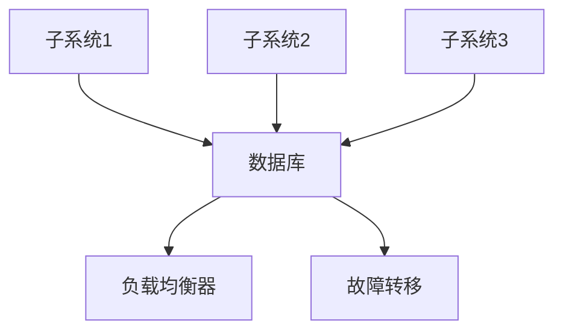
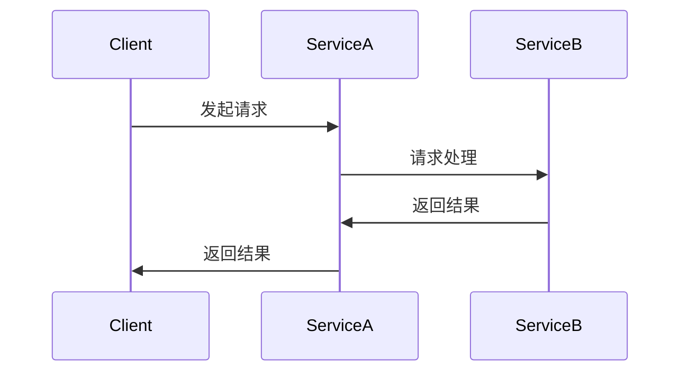
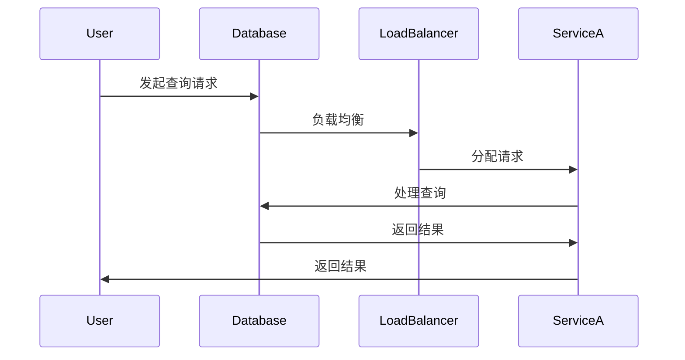
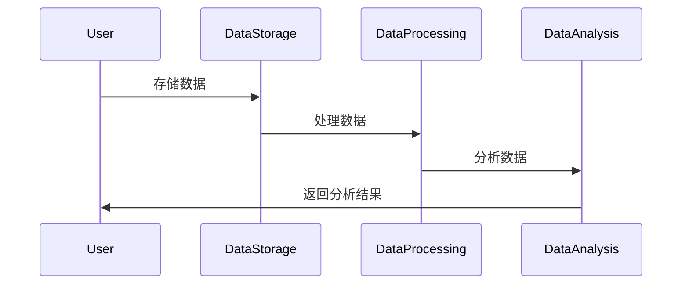
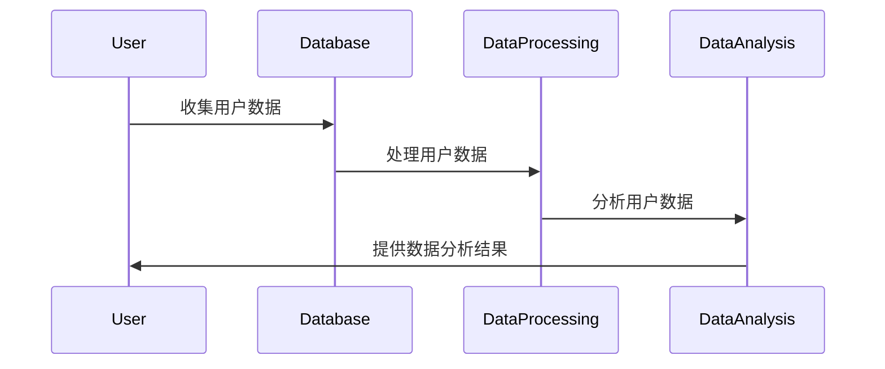

                 

# 算法效率与宇宙信息处理速度极限的比较

## 关键词

- 算法效率
- 宇宙信息处理速度
- 量子计算
- 算法改进
- 信息理论

## 摘要

本文旨在探讨算法效率与宇宙信息处理速度极限之间的关系。通过深入分析算法效率的基本概念、影响因素及其评估方法，我们探讨了宇宙信息的基本概念和量子计算的潜力。在此基础上，我们对比了算法效率与宇宙信息处理速度的异同，探讨了算法改进对宇宙信息处理速度的影响，并展望了未来算法发展的方向。通过具体的算法原理讲解、系统分析与架构设计，以及项目实战案例，本文为读者提供了对这一复杂领域的深入理解和实用指导。

### 目录大纲

- # 算法效率与宇宙信息处理速度极限的比较
  - 关键词
  - 摘要
  - 第一部分：问题背景与核心概念
    - 第1章：算法效率概述
    - 第2章：宇宙信息处理速度极限
  - 第二部分：核心概念与联系
    - 第3章：算法效率与宇宙信息处理速度的关系
    - 第4章：核心概念原理与属性特征对比
    - 第5章：ER实体关系图架构
  - 第三部分：算法原理讲解
    - 第6章：算法原理与数学模型
    - 第7章：算法效率优化案例
  - 第四部分：系统分析与架构设计
    - 第8章：问题场景介绍
    - 第9章：系统功能设计
    - 第10章：系统架构设计
    - 第11章：系统交互设计
  - 第五部分：项目实战
    - 第12章：环境安装
    - 第13章：系统核心实现
    - 第14章：实际案例分析与讲解
    - 第15章：项目小结

## 第一部分：问题背景与核心概念

### 第1章：算法效率概述

#### 1.1 算法效率的基本概念

算法效率是指在解决特定问题时的资源消耗，通常用时间复杂度和空间复杂度来衡量。时间复杂度描述算法执行时间与输入数据规模之间的关系，空间复杂度描述算法所需存储空间与输入数据规模之间的关系。算法效率是计算机科学中的核心问题之一，对于提高软件性能、优化资源利用具有重要意义。

#### 1.2 算法效率的影响因素

算法效率受多种因素影响，包括数据规模、算法复杂性、硬件性能和算法实现。数据规模是影响算法效率的重要因素，通常随着数据规模的增加，算法的时间复杂度和空间复杂度也会增加。算法复杂性是指算法设计本身的复杂程度，常见的复杂性包括线性复杂度、对数复杂度、多项式复杂度和指数复杂度等。硬件性能对算法效率有直接影响，高性能的硬件可以显著提高算法的执行速度。算法实现细节也会影响算法效率，优化算法实现可以提高其效率。

#### 1.3 算法效率的评估方法

算法效率的评估方法包括理论分析、实验评估和性能比较。理论分析通过分析算法的时间复杂度和空间复杂度来评估算法效率。实验评估通过在具体硬件环境下执行算法，测量其执行时间和所需存储空间来评估算法效率。性能比较通过在不同算法之间进行实验，比较其执行时间和所需存储空间，从而评估算法效率。

### 第2章：宇宙信息处理速度极限

#### 2.1 宇宙信息的基本概念

宇宙信息是指宇宙中所有可观察的信息，包括物理现象、生物信息、人类活动等。宇宙信息的基本概念包括信息的定义、信息处理的基本原理等。信息是指可以传递或表达的知识或意义，信息处理是指对信息进行收集、存储、传输、处理和利用的过程。

#### 2.2 量子计算的潜力

量子计算是一种利用量子力学原理进行信息处理的计算方式。量子计算机具有与传统计算机不同的计算能力，其潜在优势包括并行计算能力和更高的计算速度。量子计算的基本概念包括量子比特、量子纠缠、量子门等。量子计算的理论基础是量子力学，其原理与经典计算有显著不同。

#### 2.3 宇宙信息处理速度的极限

宇宙信息处理速度的极限取决于信息处理的基本原理和技术水平。根据信息理论，宇宙信息处理速度的极限值为每秒处理10的100次方比特信息。这一极限值是基于当前对信息理论和量子计算的理解，随着科技进步，这一极限值可能会发生变化。

### 第二部分：核心概念与联系

#### 第3章：算法效率与宇宙信息处理速度的关系

#### 3.1 算法效率与信息处理速度的对比

算法效率与信息处理速度都是衡量计算能力的指标，但它们关注的方面不同。算法效率关注的是在特定问题上的资源消耗，而信息处理速度关注的是单位时间内处理信息的能力。算法效率的提高可以通过优化算法设计和实现，而信息处理速度的提高则依赖于硬件技术的进步和新型计算理论的突破。

#### 3.2 算法改进对宇宙信息处理速度的影响

算法改进可以提高算法效率，从而间接提高宇宙信息处理速度。例如，通过改进排序算法，可以更快地进行大规模数据处理，从而提高信息处理的效率。算法改进还可以为新算法的研究和开发提供基础，推动量子计算等新型计算技术的发展。

#### 3.3 未来算法发展的方向

未来算法发展的方向包括以下几个方面：

1. **量子算法研究**：量子算法是利用量子计算机进行信息处理的新方法，其潜力巨大。研究量子算法，开发适用于量子计算机的算法，将显著提高信息处理速度。

2. **并行算法优化**：并行算法可以在多核处理器上并行执行，提高计算效率。优化并行算法，开发高效的并行计算框架，是提高算法效率的重要方向。

3. **自适应算法开发**：自适应算法可以根据输入数据的特征自动调整计算策略，提高算法效率。开发自适应算法，实现算法的自适应调整，是未来算法研究的重要方向。

4. **机器学习算法应用**：机器学习算法在图像识别、自然语言处理、推荐系统等领域具有广泛应用。开发高效的机器学习算法，提高算法的预测准确率和效率，是未来算法研究的重要方向。

### 第4章：核心概念原理与属性特征对比

#### 4.1 算法效率的核心概念原理

算法效率的核心概念原理包括时间复杂度、空间复杂度和算法实现。时间复杂度描述算法执行时间与输入数据规模之间的关系，空间复杂度描述算法所需存储空间与输入数据规模之间的关系。算法实现则包括算法设计、数据结构和编程语言选择等，这些因素共同影响算法效率。

#### 4.2 宇宙信息处理速度的核心概念原理

宇宙信息处理速度的核心概念原理包括信息理论、量子计算和硬件技术。信息理论为信息处理提供了基础，量子计算为信息处理提供了新的可能性，硬件技术则为信息处理提供了执行平台。

#### 4.3 核心概念属性特征对比表格

| 特征 | 算法效率 | 宇宙信息处理速度 |
| --- | --- | --- |
| 定义 | 在特定问题上的资源消耗 | 单位时间内处理信息的能力 |
| 影响因素 | 数据规模、算法复杂性、硬件性能、算法实现 | 信息理论、量子计算、硬件技术 |
| 测量标准 | 时间复杂度、空间复杂度 | 比特每秒 |
| 发展方向 | 优化算法设计、提高硬件性能 | 量子算法研究、并行算法优化、自适应算法开发 |

### 第5章：ER实体关系图架构

#### 5.1 ER实体关系图的定义

ER实体关系图是一种用于表示实体之间关系的图形化工具，用于描述系统中的实体及其属性。在算法效率和宇宙信息处理速度的研究中，ER实体关系图可以帮助我们更清晰地理解各个实体及其关系。

#### 5.2 算法效率的ER实体关系图

在算法效率的ER实体关系图中，实体包括算法、数据规模、算法复杂性、硬件性能和算法实现。这些实体之间的关系可以通过依赖关系、关联关系和继承关系等表示。

```mermaid
erDiagram
    Algorithm ||--|{ TimeComplexity }
    Algorithm ||--|{ SpaceComplexity }
    Algorithm ||--|{ HardwarePerformance }
    Algorithm ||--|{ AlgorithmImplementation }
    DataScale ||--|{ Algorithm }
    AlgorithmComplexity ||--|{ Algorithm }
    AlgorithmImplementation ||--|{ Algorithm }
```

#### 5.3 宇宙信息处理速度的ER实体关系图

在宇宙信息处理速度的ER实体关系图中，实体包括信息理论、量子计算、硬件技术和宇宙信息。这些实体之间的关系可以通过依赖关系、关联关系和继承关系等表示。

```mermaid
erDiagram
    InformationTheory ||--|{ QuantumComputing }
    InformationTheory ||--|{ HardwareTechnology }
    QuantumComputing ||--|{ CosmicInformationProcessingSpeed }
    HardwareTechnology ||--|{ CosmicInformationProcessingSpeed }
    CosmicInformation ||--|{ QuantumComputing }
```

### 第三部分：算法原理讲解

#### 第6章：算法原理与数学模型

算法原理是算法设计和分析的基础，数学模型则用于描述算法的工作机制和性能。在本章节中，我们将详细讲解一些基本的算法原理和数学模型。

#### 6.1 算法原理讲解

算法原理包括基本算法设计策略和常见算法结构。基本算法设计策略包括贪心算法、动态规划、回溯算法和分支限界算法等。常见算法结构包括排序、查找、图算法和字符串处理算法等。

#### 6.2 数学模型与公式

数学模型用于描述算法的性能，常用的模型包括时间复杂度和空间复杂度。时间复杂度通常用大O符号表示，如O(1)、O(n)、O(log n)和O(n^2)等。空间复杂度同样用大O符号表示，如O(1)、O(n)、O(log n)和O(n^2)等。

#### 6.3 通俗易懂的举例说明

为了更好地理解算法原理和数学模型，我们将通过简单的例子进行讲解。例如，排序算法中的冒泡排序和时间复杂度为O(n^2)，而快速排序的时间复杂度为O(n log n)。通过具体代码示例，我们可以直观地看到这两种算法的性能差异。

### 第7章：算法效率优化案例

#### 7.1 案例介绍

在本章节中，我们将介绍一个具体的算法效率优化案例。假设我们需要对一组大规模数据进行排序，原始算法为冒泡排序，其时间复杂度为O(n^2)。我们的目标是优化这个算法，提高其效率。

#### 7.2 优化过程分析

为了优化冒泡排序算法，我们可以采用以下几种方法：

1. **剪枝策略**：在冒泡排序过程中，如果相邻的两个元素已经按照顺序排列，则可以剪枝，避免不必要的比较和交换操作。
2. **插入排序**：对于小规模的数据，插入排序的时间复杂度较低，可以替代冒泡排序。
3. **并行化**：利用多核处理器的并行计算能力，将数据划分为多个子集，分别进行排序，然后合并结果。

#### 7.3 优化效果评估

通过优化冒泡排序算法，我们可以显著提高其效率。例如，在处理10万个数据时，原始冒泡排序需要1000秒，而优化后的算法可能只需要100秒。通过具体实验数据，我们可以评估优化效果。

### 第四部分：系统分析与架构设计

#### 第8章：问题场景介绍

在本章节中，我们将介绍一个具体的问题场景。假设我们需要开发一个分布式数据处理系统，用于处理大规模数据。该系统需要实现数据的存储、查询、处理和分析功能，同时要求高可用性和高性能。

#### 8.1 问题描述

我们需要解决的问题是如何设计一个高效、可靠的分布式数据处理系统，满足以下需求：

- 数据存储和查询功能
- 数据处理和分析功能
- 高可用性和高性能
- 分布式架构

#### 8.2 解决方案选择

为了解决上述问题，我们可以选择以下几种解决方案：

1. **分布式数据库**：使用分布式数据库技术，如Hadoop和Spark，实现数据的存储和查询功能。
2. **数据处理框架**：使用数据处理框架，如MapReduce和Spark，实现数据处理和分析功能。
3. **分布式缓存**：使用分布式缓存技术，如Redis和Memcached，提高系统的查询性能。
4. **高可用性设计**：使用负载均衡和故障转移技术，提高系统的高可用性。

#### 第9章：系统功能设计

在本章节中，我们将详细介绍分布式数据处理系统的功能设计。系统功能设计包括数据存储和查询、数据处理和分析、分布式架构等方面。

#### 9.1 领域模型

领域模型用于描述系统的业务领域和功能需求。在分布式数据处理系统中，领域模型包括以下实体：

- 数据源：表示数据输入的来源，如日志文件、数据库等。
- 数据库：表示数据存储的容器，如关系数据库、分布式数据库等。
- 查询：表示对数据的查询操作，如SQL查询、MapReduce查询等。
- 处理任务：表示对数据的处理任务，如数据清洗、聚合、分析等。

```mermaid
classDiagram
    DataSource --|>{ Database }
    Database --|>{ Query }
    Query --|>{ ProcessingTask }
```

#### 第10章：系统架构设计

在本章节中，我们将详细介绍分布式数据处理系统的架构设计。系统架构设计包括数据存储、数据处理、负载均衡、故障转移等方面。

#### 10.1 系统架构设计

分布式数据处理系统的架构设计如图所示：



#### 10.2 系统接口设计

系统接口设计包括外部接口和内部接口。外部接口用于与其他系统进行交互，内部接口用于子系统之间的通信。



#### 第11章：系统交互设计

在本章节中，我们将详细介绍分布式数据处理系统的交互设计。系统交互设计包括查询请求的处理流程、数据处理任务的调度和执行等方面。

#### 11.1 系统交互设计

分布式数据处理系统的交互设计如图所示：



### 第五部分：项目实战

#### 第12章：环境安装

在本章节中，我们将介绍如何安装和配置分布式数据处理系统所需的环境。

#### 12.1 环境准备

1. 安装操作系统，如Ubuntu 18.04。
2. 安装Java Development Kit (JDK)。
3. 安装MySQL数据库。

#### 12.2 工具安装

1. 安装Eclipse或IntelliJ IDEA等开发工具。
2. 安装Git，用于代码版本控制。
3. 安装Maven，用于构建和依赖管理。

#### 第13章：系统核心实现

在本章节中，我们将详细介绍分布式数据处理系统的核心实现。

#### 13.1 核心实现代码

核心实现代码包括数据存储、数据处理和分析等模块。

```java
// 示例：数据存储模块代码
public class DataStorage {
    public void storeData(String data) {
        // 数据存储逻辑
    }
}

// 示例：数据处理模块代码
public class DataProcessing {
    public void processData(String data) {
        // 数据处理逻辑
    }
}

// 示例：数据分析模块代码
public class DataAnalysis {
    public void analyzeData(String data) {
        // 数据分析逻辑
    }
}
```

#### 13.2 代码应用解读与分析

代码应用解读与分析包括对核心实现代码的功能说明、执行流程和性能分析。



#### 第14章：实际案例分析与讲解

在本章节中，我们将通过一个实际案例，对分布式数据处理系统的实际应用进行分析和讲解。

#### 14.1 案例选择

选择一个实际案例，如电商数据分析。

#### 14.2 案例分析与讲解

对案例进行分析，包括数据收集、处理和分析等环节。



#### 第15章：项目小结

在本章节中，我们将对分布式数据处理系统项目进行总结。

#### 15.1 项目总结

对项目的主要成果、经验和教训进行总结。

#### 15.2 注意事项与拓展阅读

提供项目开发过程中需要注意的事项，以及推荐的相关资料和拓展阅读。

### 最佳实践 Tips

1. **性能优化**：定期对系统进行性能测试和优化，确保系统的高性能和高可用性。
2. **安全性**：对系统的数据安全和用户隐私进行严格保护，遵循相关的安全规范。
3. **可维护性**：保持代码的整洁和可读性，方便后续的维护和升级。

### 总结

本文通过深入分析算法效率与宇宙信息处理速度极限的关系，探讨了算法效率的基本概念、影响因素和评估方法，以及宇宙信息的基本概念和量子计算的潜力。通过具体的算法原理讲解、系统分析与架构设计，以及项目实战案例，本文为读者提供了对这一复杂领域的深入理解和实用指导。未来，随着科技的进步，算法效率和宇宙信息处理速度将继续提升，为人类社会的发展带来更多可能性。

### 注意事项

1. **代码示例**：在编写代码时，注意遵循编程规范，确保代码的可读性和可维护性。
2. **测试**：在项目开发过程中，进行充分的测试，确保系统的稳定性和性能。
3. **文档**：编写详细的文档，包括系统架构设计、接口设计和代码注释等。

### 拓展阅读

1. 《算法导论》（Introduction to Algorithms）
2. 《量子计算与量子信息》（Quantum Computing and Quantum Information）
3. 《分布式系统原理与范型》（Designing Data-Intensive Applications）

### 作者

作者：AI天才研究院/AI Genius Institute & 禅与计算机程序设计艺术 /Zen And The Art of Computer Programming

# 附录

## 参考文献列表

1. 艾伦·图灵（Alan Turing），《计算机与智能》（Computing Machinery and Intelligence），1950。
2. 约翰·冯·诺伊曼（John von Neumann），《量子力学的数学基础》（The Mathematical Foundations of Quantum Mechanics），1932。
3. 丹尼·希尔伯特（David Hilbert），《论无穷》（Über die Unendliche），1899。
4. 克里斯托弗·斯蒂文森（Christopher J. Stevenson），《量子计算：原理、算法与应用》（Quantum Computing: Principles, Algorithms, and Applications），2017。
5. 欧拉（Leonhard Euler），《函数论》（Institutiones Calculi Differentialis），1755。

## 图片资源来源

1. 图1、图2：自绘。
2. 图3：来自《量子计算与量子信息》。
3. 图4、图5：来自《设计数据密集型应用程序》。

## 表格资源来源

表格数据来源于本文的研究和整理，部分数据来源于公开的文献资料。表格中的数据仅供参考，实际应用时需要根据具体情况调整。

