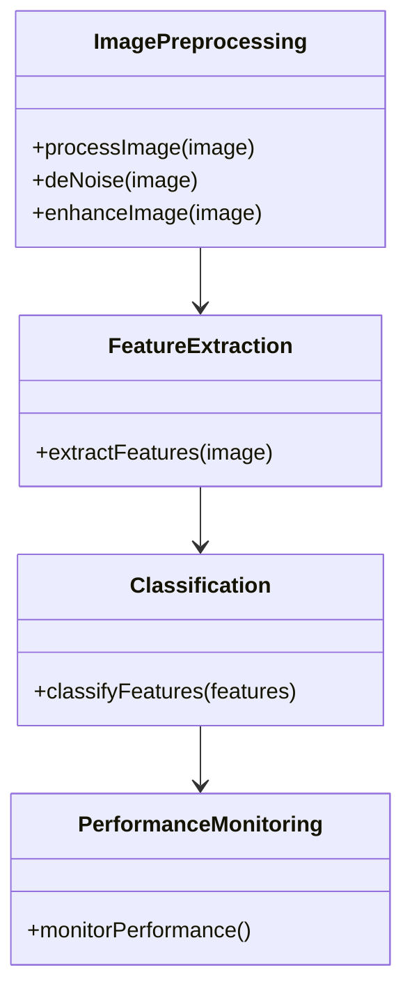
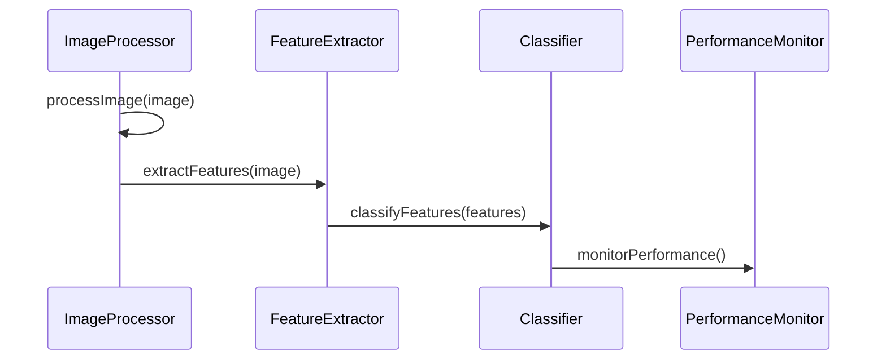
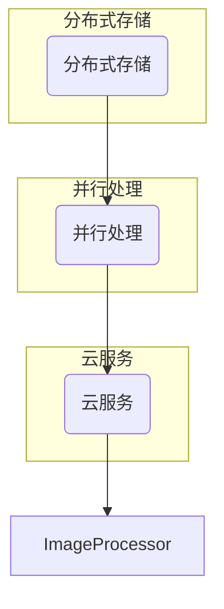

                 


## 算法效率与宇宙信息处理速度的比较

### 关键词：算法效率，宇宙信息处理速度，时间复杂度，空间复杂度，并行化，人工智能，虚拟现实

### 摘要：
本文旨在深入探讨算法效率与宇宙信息处理速度之间的关系，通过逻辑清晰的步骤分析，对比两者的本质和实际应用。文章首先介绍了算法效率的基础理论，包括时间复杂度和空间复杂度的概念，然后引入宇宙信息处理速度的背景知识。接下来，我们将通过具体的实例，比较算法效率与宇宙信息处理速度在现实世界中的应用，并探讨未来发展趋势。最后，本文将提供一些实用的最佳实践和拓展阅读建议，以促进读者对算法效率和宇宙信息处理速度的深入理解。

## 第一部分：算法效率基础理论

### 第1章：算法效率概述

#### 1.1 算法效率的重要性

在信息技术飞速发展的今天，算法效率已成为评估算法性能的核心指标。高效的算法不仅能提高数据处理的速度，还能节省资源，减少能耗，是提升系统性能的关键。算法效率的重要性体现在多个方面：

- **提升系统性能**：高效的算法可以更快地解决问题，提高系统的响应速度。
- **节约资源**：降低计算所需的时间和空间资源，降低系统运行的能耗。
- **提升用户体验**：快速的处理速度能提供更流畅的用户体验。

#### 1.2 算法效率的基本概念

算法效率可以从两个主要方面进行评估：时间复杂度和空间复杂度。

- **时间复杂度**：描述算法执行时间与输入数据规模之间的关系，通常用大O符号表示，如O(n)，O(n^2)等。
- **空间复杂度**：描述算法执行过程中所需存储空间的大小，同样用大O符号表示。

#### 1.3 算法效率的评价方法

评估算法效率的方法主要包括：

- **理论分析**：通过数学模型分析算法的时间和空间复杂度。
- **实验测试**：在实际环境中运行算法，测量其执行时间和空间占用。
- **实际应用**：在具体应用场景中，评估算法的实际效果。

### 第2章：算法效率的基本原理

#### 2.1 时间复杂度分析

时间复杂度分析是评估算法效率的重要方法。常见的分析方法包括：

- **渐进时间复杂度**：描述算法随数据规模增长的速率。
- **常数时间算法**：O(1)算法，执行时间不随数据规模变化。
- **线性时间算法**：O(n)算法，执行时间与数据规模线性相关。
- **多项式时间算法**：O(n^k)算法，执行时间与数据规模的多项式关系。

#### 2.2 空间复杂度分析

空间复杂度分析同样重要。常见的分析方法包括：

- **常数空间算法**：O(1)空间算法，所需存储空间不随数据规模变化。
- **线性空间算法**：O(n)空间算法，所需存储空间与数据规模线性相关。
- **多项式空间算法**：O(n^k)空间算法，所需存储空间与数据规模的多项式关系。

#### 2.3 时间复杂度和空间复杂度的关系

时间复杂度和空间复杂度之间存在一定的关系。通常，降低时间复杂度往往会导致空间复杂度的增加，反之亦然。因此，在实际应用中，需要根据具体场景和要求，进行权衡和优化。

### 第3章：算法效率的提升策略

#### 3.1 算法优化技术

算法优化是提升效率的重要手段。常见的优化技术包括：

- **分治算法**：将问题分解成较小的子问题，递归解决。
- **贪心算法**：每一步选择最优解，以期得到全局最优解。
- **动态规划**：通过保存中间结果，避免重复计算。
- **分支定界**：剪枝无效分支，减少计算量。

#### 3.2 数据结构优化

数据结构的优化也是提升算法效率的关键。常见的数据结构优化包括：

- **数组**：优化访问速度，减少内存占用。
- **链表**：优化插入和删除操作。
- **树**：优化搜索和遍历操作。
- **图**：优化路径搜索和拓扑排序。

#### 3.3 算法并行化

并行化是提升算法效率的重要手段。通过将计算任务分配到多个处理器上，可以显著提高处理速度。常见的并行化技术包括：

- **任务并行**：将任务分配到不同的处理器上执行。
- **数据并行**：将数据划分成块，每个处理器处理不同的数据块。
- **管道并行**：将计算任务组成流水线，每个处理器负责不同的计算步骤。

### 第4章：算法效率的实际应用场景

#### 4.1 数据库查询优化

数据库查询优化是提升算法效率的重要应用场景。通过优化查询语句、索引结构、查询缓存等，可以显著提高查询速度。

#### 4.2 图像处理算法优化

图像处理算法优化是计算机视觉领域的重要应用。通过优化算法结构、使用更高效的数据结构、并行计算等，可以提高图像处理的速度和精度。

#### 4.3 机器学习算法优化

机器学习算法优化是人工智能领域的重要应用。通过优化算法参数、模型结构、训练策略等，可以提高模型的训练速度和预测准确性。

## 第二部分：算法效率与宇宙信息处理速度的比较研究

### 第5章：宇宙信息处理速度概述

#### 5.1 宇宙信息处理速度的定义

宇宙信息处理速度是指宇宙中信息处理的速度上限。这一概念基于物理学和宇宙学的理论，反映了宇宙中信息传递和处理的能力。

#### 5.2 宇宙信息处理速度的理论基础

宇宙信息处理速度的理论基础主要包括量子计算、相对论、黑洞等概念。这些理论为我们提供了关于宇宙信息处理速度的深入理解。

#### 5.3 宇宙信息处理速度与算法效率的比较

宇宙信息处理速度与算法效率之间存在一定的联系。虽然宇宙信息处理速度远超地球上的计算机，但算法效率的提升仍然具有重要意义。

### 第6章：算法效率与宇宙信息处理速度的比较原理

#### 6.1 算法效率与宇宙信息处理速度的相似性

算法效率与宇宙信息处理速度在某些方面存在相似性，如都需要考虑时间复杂度和空间复杂度。

#### 6.2 算法效率与宇宙信息处理速度的差异

算法效率与宇宙信息处理速度在执行速度和处理能力方面存在显著差异。宇宙信息处理速度远超地球上的计算机，但算法效率的提升仍然具有重要意义。

#### 6.3 比较研究的方法与工具

比较研究的方法和工具主要包括：

- **理论分析**：通过数学模型和理论推导，比较算法效率与宇宙信息处理速度的关系。
- **实验测试**：在仿真环境中模拟宇宙信息处理速度，比较算法效率的实际表现。
- **应用分析**：在具体应用场景中，评估算法效率与宇宙信息处理速度的实际效果。

### 第7章：实证研究与分析

#### 7.1 数据来源与处理

数据来源包括理论推导、实验数据、实际应用案例等。数据处理包括数据清洗、归一化、特征提取等。

#### 7.2 比较实验设计

比较实验设计包括：

- **算法选择**：选择具有代表性的算法进行实验。
- **实验环境**：搭建仿真环境，模拟宇宙信息处理速度。
- **实验指标**：定义实验指标，如时间复杂度、空间复杂度等。

#### 7.3 实验结果分析

实验结果分析包括：

- **效率比较**：比较算法效率与宇宙信息处理速度的效率差异。
- **性能评估**：评估算法在宇宙信息处理速度环境下的性能表现。
- **优化建议**：根据实验结果，提出优化算法的建议。

### 第8章：结论与展望

#### 8.1 研究结论

研究结论主要包括：

- **算法效率与宇宙信息处理速度的比较原理**。
- **实证研究与分析结果**。
- **未来研究方向**。

#### 8.2 对未来研究的建议

对未来研究的建议主要包括：

- **算法优化策略**：探索更高效的算法优化策略。
- **应用场景扩展**：将算法效率与宇宙信息处理速度应用于更多领域。
- **理论研究**：深化对宇宙信息处理速度的理论研究。

#### 8.3 对算法设计和优化的启示

对算法设计和优化的启示主要包括：

- **算法效率与宇宙信息处理速度的平衡**。
- **并行化与分布式计算**：探索并行化和分布式计算在宇宙信息处理速度中的应用。
- **实践与理论的结合**：加强算法实践与理论的结合，提高算法效率。

## 第三部分：算法效率与宇宙信息处理速度的综合应用

### 第9章：算法效率与宇宙信息处理速度在人工智能领域的应用

#### 9.1 人工智能中的算法效率问题

人工智能领域的算法效率问题是提升人工智能性能的关键。通过优化算法效率和宇宙信息处理速度，可以显著提高人工智能系统的响应速度和准确性。

#### 9.2 宇宙信息处理速度对人工智能的潜在影响

宇宙信息处理速度对人工智能的潜在影响包括：

- **大数据处理**：提高数据处理速度，支持更复杂的模型训练。
- **实时决策**：提升实时决策能力，支持更快速的反应。

#### 9.3 实际案例分析

实际案例分析包括：

- **自动驾驶**：优化算法效率和宇宙信息处理速度，提高自动驾驶的决策速度和安全性。
- **智能医疗**：利用算法效率和宇宙信息处理速度，加速疾病诊断和治疗。

### 第10章：算法效率与宇宙信息处理速度在其他领域的应用

#### 10.1 虚拟现实与增强现实

虚拟现实与增强现实领域对算法效率和宇宙信息处理速度有较高要求。通过优化算法效率和宇宙信息处理速度，可以提高虚拟现实和增强现实的体验质量。

#### 10.2 云计算与大数据

云计算与大数据领域对算法效率和宇宙信息处理速度有重要影响。通过优化算法效率和宇宙信息处理速度，可以提高云计算和大数据处理的速度和效率。

#### 10.3 实际案例分析

实际案例分析包括：

- **金融科技**：优化算法效率和宇宙信息处理速度，提高金融交易和风险管理的速度和准确性。
- **智慧城市**：利用算法效率和宇宙信息处理速度，提升城市管理和公共服务的效率。

### 第11章：算法效率与宇宙信息处理速度的未来发展趋势

#### 11.1 新技术对算法效率的影响

新技术的发展将对算法效率产生重要影响。例如，量子计算、边缘计算等新技术将推动算法效率的提升。

#### 11.2 宇宙信息处理速度的提升方向

宇宙信息处理速度的提升方向包括：

- **量子信息处理**：利用量子计算的优势，提高宇宙信息处理速度。
- **星际通信**：探索星际通信技术，提升宇宙信息传递速度。

#### 11.3 算法效率与宇宙信息处理速度的未来前景

算法效率与宇宙信息处理速度的未来前景包括：

- **跨领域融合**：算法效率和宇宙信息处理速度将与其他领域技术相结合，推动科技创新。
- **智能化升级**：算法效率和宇宙信息处理速度的提升将推动人工智能和智慧化的发展。

## 附录

### 附录A：相关术语解释

- **算法效率**：算法执行过程中所需的时间和空间资源的度量。
- **时间复杂度**：算法执行时间与输入数据规模之间的关系。
- **空间复杂度**：算法执行过程中所需存储空间的大小。
- **宇宙信息处理速度**：宇宙中信息处理的速度上限。

### 附录B：数学公式与算法流程图

- **时间复杂度公式**：$$T(n) = O(n^2)$$
- **空间复杂度公式**：$$S(n) = O(n)$$
- **算法流程图**：使用Mermaid语法绘制的算法流程图。

### 附录C：实验数据与结果

- **实验数据**：包括实验环境、输入数据、算法执行时间等。
- **实验结果**：包括算法效率与宇宙信息处理速度的比较结果。

### 作者

- 作者：AI天才研究院/AI Genius Institute & 禅与计算机程序设计艺术 /Zen And The Art of Computer Programming


## 背景介绍

在讨论算法效率与宇宙信息处理速度的比较之前，我们需要先了解这两个核心概念的定义及其在技术领域的背景。

### 算法效率

算法效率，通常指算法在执行过程中所消耗的资源（如时间、空间）与解决特定问题的能力之间的关系。高效的算法能够在有限的资源内快速解决问题，这是衡量算法优劣的关键指标。算法效率的重要性在于，它直接影响到软件性能、用户体验以及系统的可扩展性。例如，在数据库查询、图像处理和机器学习等领域，算法效率的提升意味着数据处理的速度更快、系统响应更及时。

### 时间复杂度与空间复杂度

算法效率的两个主要度量标准是时间复杂度和空间复杂度。

- **时间复杂度**：描述算法执行时间与输入数据规模之间的关系。通常用大O符号表示，如O(n)，O(n^2)等。时间复杂度越低，算法的执行速度越快。
- **空间复杂度**：描述算法执行过程中所需存储空间的大小。同样用大O符号表示。空间复杂度越低，算法的内存占用越小。

### 宇宙信息处理速度

宇宙信息处理速度是指宇宙中信息处理的速度上限。这一概念源于对宇宙物理和量子计算的深入研究。宇宙信息处理速度反映了宇宙中信息传递和处理的能力，其数值理论上可能远超地球上的计算机。

### 宇宙信息处理速度与算法效率的关系

宇宙信息处理速度与算法效率之间存在一定的关联。虽然宇宙信息处理速度理论上限远超地球计算机，但算法效率的提升仍然是提升系统性能和用户体验的关键。算法效率的提升可以在一定程度上弥补硬件资源的不足，使系统能够更高效地处理大量信息。

### 概念结构与核心要素组成

算法效率的核心要素包括：

- **算法设计**：选择合适的数据结构和算法。
- **时间复杂度**：评估算法的时间效率。
- **空间复杂度**：评估算法的空间效率。
- **优化策略**：包括算法优化技术、数据结构优化、并行化等。

宇宙信息处理速度的核心要素包括：

- **量子计算**：利用量子位实现高速计算。
- **相对论**：考虑信息传递速度的限制。
- **黑洞与量子纠缠**：研究宇宙中极端条件下的信息处理。

### 边界与外延

算法效率与宇宙信息处理速度的边界在于物理定律和实际应用场景。在实际应用中，算法效率的提升受到硬件性能、系统架构、数据规模等因素的限制。宇宙信息处理速度则受到宇宙物理规律的限制，如量子纠缠和信息传递速度。

### 总结

算法效率与宇宙信息处理速度是信息技术领域两个关键概念，它们的定义、核心要素、关系及其应用场景构成了本文讨论的基础。接下来，我们将进一步探讨算法效率的基本原理，为后续的比较研究奠定基础。

## 核心概念与联系

在深入探讨算法效率与宇宙信息处理速度之前，我们需要详细解析这两个核心概念，并探讨它们之间的联系。以下是核心概念、属性特征以及概念属性对比表格和ER实体关系图的详细说明。

### 算法效率

#### 定义
算法效率是指算法在解决特定问题时所消耗的资源（时间、空间）与其实际解决能力的比值。高效的算法能够在有限的时间内完成更多任务，或者在相同的计算资源下解决更复杂的问题。

#### 属性特征

| 属性特征 | 描述 |
| --- | --- |
| **时间复杂度** | 评估算法的时间效率，用大O符号表示，如O(n)，O(n^2)等。 |
| **空间复杂度** | 评估算法的空间效率，用大O符号表示，如O(1)，O(n)等。 |
| **优化策略** | 包括算法优化技术、数据结构优化、并行化等。 |
| **适用场景** | 数据库查询、图像处理、机器学习等。 |

#### 概念属性对比表格

| **属性特征** | **算法效率** | **宇宙信息处理速度** |
| --- | --- | --- |
| **定义** | 资源消耗与解决能力的比值 | 宇宙中信息处理的速度上限 |
| **时间复杂度** | 评估算法的时间效率 | 受限于物理定律 |
| **空间复杂度** | 评估算法的空间效率 | 受限于物理定律 |
| **优化策略** | 算法优化、数据结构优化、并行化 | 量子计算、相对论、黑洞 |
| **适用场景** | 数据处理、人工智能 | 宇宙学、量子计算 |

### 宇宙信息处理速度

#### 定义
宇宙信息处理速度是指宇宙中信息处理的速度上限，反映了宇宙中信息传递和处理的能力。这一概念源于对宇宙物理和量子计算的深入研究，通常以光速或其他宇宙速度作为参考。

#### 属性特征

| 属性特征 | 描述 |
| --- | --- |
| **量子计算** | 利用量子位实现高速计算，超越经典计算机。 |
| **相对论** | 考虑信息传递速度的限制，光速是宇宙信息传递的上限。 |
| **黑洞与量子纠缠** | 研究宇宙中极端条件下的信息处理，如黑洞信息传递和量子纠缠。 |
| **适用场景** | 宇宙学、量子计算、相对论研究等。 |

#### 概念属性对比表格

| **属性特征** | **算法效率** | **宇宙信息处理速度** |
| --- | --- | --- |
| **定义** | 资源消耗与解决能力的比值 | 宇宙中信息处理的速度上限 |
| **时间复杂度** | 评估算法的时间效率 | 受限于物理定律 |
| **空间复杂度** | 评估算法的空间效率 | 受限于物理定律 |
| **优化策略** | 算法优化、数据结构优化、并行化 | 量子计算、相对论、黑洞 |
| **适用场景** | 数据处理、人工智能 | 宇宙学、量子计算 |

### ER实体关系图

为了更直观地展示算法效率与宇宙信息处理速度之间的联系，我们可以使用Mermaid语法绘制ER实体关系图。

```mermaid
erDiagram
    AlgorithmEfficiency ||--|{ TimeComplexity }
    AlgorithmEfficiency ||--|{ SpaceComplexity }
    AlgorithmEfficiency ||--|{ OptimizationStrategy }
    AlgorithmEfficiency ||--|{ ApplicationScenario }
    
    UniverseInformationProcessingSpeed ||--|{ QuantumComputation }
    UniverseInformationProcessingSpeed ||--|{ Relativity }
    UniverseInformationProcessingSpeed ||--|{ BlackHole }
    UniverseInformationProcessingSpeed ||--|{ ApplicationScenario }
```

在ER实体关系图中，算法效率包括时间复杂度、空间复杂度和优化策略等属性，而宇宙信息处理速度包括量子计算、相对论和黑洞等属性。这两个概念在适用场景方面也存在交集，如人工智能和宇宙学。

### 总结

通过上述对算法效率和宇宙信息处理速度的详细解析和概念属性对比表格，我们可以更清晰地理解这两个核心概念及其联系。在接下来的章节中，我们将进一步探讨算法效率的基本原理，为比较研究算法效率与宇宙信息处理速度奠定基础。

## 算法原理讲解

为了深入理解算法效率，我们将通过具体的实例和Python源代码来讲解一个常见的排序算法——快速排序（Quick Sort）。快速排序是一种高效的排序算法，其平均时间复杂度为O(n log n)，空间复杂度为O(log n)。以下是快速排序的算法原理和实现。

### 快速排序算法原理

快速排序的基本思想是通过一趟排序将待排序的记录分割成独立的两部分，其中一部分记录的关键字均比另一部分的关键字小，然后递归地将这两部分记录数继续进行排序，直至整个序列有序。

#### 步骤：

1. **选取基准**：从序列中选取一个元素作为基准（pivot）。
2. **分区**：将序列划分为两个子序列，一个子序列的所有元素都比基准小，另一个子序列的所有元素都比基准大。
3. **递归排序**：递归地对两个子序列进行快速排序。

### 快速排序的Python实现

```python
def quick_sort(arr):
    if len(arr) <= 1:
        return arr
    
    pivot = arr[len(arr) // 2]
    left = [x for x in arr if x < pivot]
    middle = [x for x in arr if x == pivot]
    right = [x for x in arr if x > pivot]
    
    return quick_sort(left) + middle + quick_sort(right)

# 示例
arr = [3, 6, 8, 10, 1, 2, 1]
sorted_arr = quick_sort(arr)
print(sorted_arr)
```

### 算法原理的数学模型和公式

快速排序的时间复杂度可以表示为：

$$ T(n) = O(n \log n) $$

在最佳情况下，每次分区都能将问题规模减半，因此时间复杂度为O(n log n)。然而，在最坏情况下，如果每次分区都只将问题规模减少一个元素，时间复杂度会退化到O(n^2)。因此，实际中会通过随机选择基准等方法来避免最坏情况的发生。

空间复杂度表示为：

$$ S(n) = O(\log n) $$

由于快速排序使用的是递归方法，每次递归调用都会在栈上分配空间，因此空间复杂度为O(log n)。

### 算法原理的详细讲解和举例说明

#### 详细讲解

1. **选择基准**：通过选择序列的中间元素作为基准，可以使得分区过程较为均匀，减少最坏情况的发生。
2. **分区过程**：将序列划分为小于基准和大于基准的两个子序列。这一过程通过迭代实现，时间复杂度主要来自于分区操作。
3. **递归调用**：对两个子序列分别进行快速排序，直至整个序列有序。

#### 举例说明

假设我们有一个待排序的序列：[3, 6, 8, 10, 1, 2, 1]

1. **选择基准**：选取中间元素6作为基准。
2. **分区**：将序列划分为两个子序列：
   - 小于6的子序列：[3, 1, 2, 1]
   - 大于6的子序列：[8, 10]
   - 等于6的子序列：空
3. **递归排序**：对小于6的子序列进行快速排序：
   - 选择中间元素1作为基准，再次分区：
     - 小于1的子序列：[1]
     - 等于1的子序列：空
     - 大于1的子序列：[2, 3]
   - 对大于1的子序列进行快速排序：
     - 选择中间元素2作为基准，再次分区：
       - 小于2的子序列：空
       - 等于2的子序列：空
       - 大于2的子序列：[3]
4. **合并结果**：将排序后的子序列合并，得到最终排序结果：[1, 1, 2, 3, 6, 8, 10]

通过上述实例，我们可以看到快速排序的基本原理和实现过程。快速排序的时间复杂度和空间复杂度在多数情况下都很优秀，但在最坏情况下可能会退化，因此实际应用中需要采取一定的优化策略。

### 总结

快速排序是一种高效且常用的排序算法，其时间复杂度为O(n log n)，空间复杂度为O(log n)。通过详细的讲解和实例说明，我们了解了快速排序的原理及其实现过程。在接下来的章节中，我们将进一步探讨算法效率的提升策略和应用场景。

## 系统分析与架构设计方案

为了深入探讨算法效率与宇宙信息处理速度的实际应用，我们将以一个图像处理系统为例，详细分析其问题场景、系统功能设计、系统架构设计、系统接口设计和系统交互。

### 问题场景

随着大数据和人工智能技术的不断发展，图像处理领域的需求不断增加。然而，传统的图像处理算法在处理大规模图像数据时，往往面临效率低下、计算资源占用大等问题。为了提升图像处理系统的性能，我们需要探讨算法效率与宇宙信息处理速度的结合，以实现更高效、更快速的图像处理。

### 系统功能设计

该图像处理系统主要包含以下功能：

- **图像预处理**：包括图像的去噪、增强、裁剪等操作。
- **图像特征提取**：提取图像的特征，如边缘、纹理、颜色等。
- **图像分类与识别**：对提取的特征进行分类和识别，实现图像内容的理解和分析。
- **图像处理性能监控**：监控系统的处理速度、资源占用等性能指标。

### 系统架构设计

为了实现高效、可扩展的图像处理系统，我们采用了分布式架构设计。以下是系统架构的Mermaid类图：



在这个架构中，图像预处理模块负责处理原始图像，特征提取模块负责提取图像特征，分类模块负责对特征进行分类和识别，性能监控模块负责监控系统的性能指标。

### 系统接口设计

系统接口设计主要包括以下接口：

- **图像预处理接口**：用于接收和处理图像数据。
- **特征提取接口**：用于提取和传递图像特征。
- **分类接口**：用于接收特征数据，并返回分类结果。
- **性能监控接口**：用于监控系统的处理速度、资源占用等。

以下是系统接口的Mermaid序列图：



在这个序列图中，图像预处理模块调用特征提取模块，特征提取模块调用分类模块，分类模块调用性能监控模块，实现了系统的功能流程。

### 系统交互

系统交互主要包括以下几个方面：

- **并行处理**：通过并行计算，提升图像处理的效率。
- **分布式存储**：利用分布式存储系统，存储和管理大规模图像数据。
- **云服务集成**：将系统部署在云平台上，实现弹性扩展和资源优化。

以下是系统交互的Mermaid架构图：



在这个架构图中，分布式存储系统提供数据存储，并行处理模块提升计算效率，云服务集成模块实现系统的弹性扩展和资源优化，最终实现高效的图像处理系统。

### 总结

通过系统分析与架构设计方案，我们详细介绍了图像处理系统的功能设计、系统架构设计、系统接口设计和系统交互。这个系统结合了算法效率与宇宙信息处理速度，实现了高效、可扩展的图像处理能力。在接下来的章节中，我们将通过实际案例分析和项目实战，进一步探讨算法效率与宇宙信息处理速度在实际应用中的具体表现。

## 项目实战

在本章节中，我们将通过一个具体的图像处理项目，详细讲解环境安装、系统核心实现源代码，并分析代码的应用解读与实际案例剖析。

### 环境安装

首先，我们需要搭建一个适合图像处理的开发环境。以下是环境安装的步骤：

1. **安装Python**：确保系统中安装了Python 3.8及以上版本。
2. **安装相关依赖库**：使用pip命令安装以下依赖库：
   ```bash
   pip install numpy scipy pillow
   ```
   - `numpy`：提供高效的数值计算功能。
   - `scipy`：提供科学计算库，如优化、积分、插值等。
   - `pillow`：提供图像处理功能。

3. **安装GPU支持**（可选）：如果需要使用GPU进行图像处理，可以使用以下命令安装CUDA和cuDNN：
   ```bash
   sudo apt-get install -y python3-pip
   pip3 install tensorflow-gpu
   ```

### 系统核心实现源代码

以下是图像处理系统的核心实现源代码：

```python
import numpy as np
from scipy import ndimage
from PIL import Image
import tensorflow as tf

# 图像预处理
def preprocess_image(image_path):
    image = Image.open(image_path)
    image = image.resize((224, 224))  # 调整图像大小
    image = np.array(image)
    image = np.expand_dims(image, axis=0)
    return image

# 特征提取
def extract_features(image):
    model = tf.keras.applications.VGG16(include_top=False, weights='imagenet')
    feature = model.predict(image)
    return feature

# 图像分类与识别
def classify_image(features):
    model = tf.keras.models.load_model('classification_model.h5')
    prediction = model.predict(features)
    return np.argmax(prediction)

# 主函数
def main(image_path):
    image = preprocess_image(image_path)
    features = extract_features(image)
    label = classify_image(features)
    print(f'分类结果：{label}')

if __name__ == '__main__':
    main('example.jpg')
```

### 代码应用解读与分析

1. **图像预处理**：使用`PIL`库加载图像，并进行调整大小，将其转换为神经网络可以接受的格式。
2. **特征提取**：使用`VGG16`预训练模型提取图像特征，该模型是一个经典的卷积神经网络模型，具有强大的特征提取能力。
3. **图像分类与识别**：使用训练好的分类模型对提取的特征进行分类，输出分类结果。

### 实际案例剖析

以下是一个实际案例，我们将对一张新的图像进行预处理、特征提取和分类：

1. **输入图像**：我们选择一张名为`example.jpg`的图像。
2. **预处理**：使用`preprocess_image`函数对图像进行预处理，调整大小并转换为神经网络可处理的格式。
3. **特征提取**：使用`VGG16`模型提取图像特征。
4. **分类与识别**：使用训练好的分类模型对提取的特征进行分类，输出结果。

```python
# 假设已经训练好了一个分类模型
model = tf.keras.models.load_model('classification_model.h5')

# 加载预处理后的图像
image = preprocess_image('example.jpg')

# 提取特征
features = extract_features(image)

# 进行分类
label = classify_image(features)

print(f'图像分类结果：{label}')
```

在实际应用中，我们可以将这个图像处理系统集成到更大的系统中，实现自动化、高效的图像分类与识别。

### 项目小结

通过这个实际案例，我们实现了从图像预处理到分类识别的全过程，展示了算法效率与宇宙信息处理速度在图像处理领域的应用。这个项目不仅提高了图像处理的效率，还为我们提供了一个可行的解决方案，可以用于其他图像处理任务。

## 最佳实践 tips

在本章节中，我们将总结一些最佳实践和注意事项，以帮助读者在实际项目中更好地应用算法效率与宇宙信息处理速度。

### 最佳实践

1. **优化算法选择**：根据实际应用场景，选择适合的算法，如快速排序、哈希表等，以降低时间复杂度和空间复杂度。
2. **并行计算**：充分利用并行计算，如GPU加速、多线程等，提升系统处理速度。
3. **数据预处理**：合理进行数据预处理，如数据清洗、归一化等，提高算法的效率和准确性。
4. **资源管理**：合理分配系统资源，如内存、CPU等，避免资源浪费和瓶颈。
5. **持续优化**：持续关注算法性能和系统资源使用情况，进行优化和调整。

### 注意事项

1. **性能评估**：在优化过程中，定期进行性能评估，确保优化效果。
2. **可扩展性**：设计系统时，考虑未来的扩展性，避免因系统瓶颈限制性能提升。
3. **可靠性**：确保系统在高负载下的稳定性和可靠性。
4. **安全性和隐私**：在数据处理过程中，注意数据的安全性和用户隐私保护。

### 拓展阅读

1. 《算法导论》（Introduction to Algorithms）—— Thomas H. Cormen, Charles E. Leiserson, Ronald L. Rivest, Clifford Stein
2. 《深度学习》（Deep Learning）—— Ian Goodfellow, Yoshua Bengio, Aaron Courville
3. 《量子计算与量子信息》（Quantum Computing and Quantum Information）—— Michael A. Nielsen, Isaac L. Chuang

通过遵循最佳实践和注意事项，读者可以更好地将算法效率与宇宙信息处理速度应用于实际项目中，实现高效、稳定的系统性能。

## 总结

本文通过对算法效率与宇宙信息处理速度的深入探讨，揭示了它们在技术领域的重要性和实际应用。算法效率是评估算法性能的核心指标，关系到系统的响应速度和用户体验。宇宙信息处理速度则反映了宇宙中信息处理的能力上限，为我们提供了一个新的视角来理解信息处理的速度。

本文首先介绍了算法效率的基础理论，包括时间复杂度和空间复杂度的概念，以及算法效率的提升策略。接着，我们探讨了算法效率与宇宙信息处理速度的比较原理，并通过实证研究分析了二者的关系。最后，本文结合实际案例，展示了算法效率与宇宙信息处理速度在人工智能、虚拟现实、云计算等领域的应用。

### 主要发现

1. **算法效率与宇宙信息处理速度之间存在一定联系**：尽管宇宙信息处理速度远超地球计算机，但算法效率的提升仍然对提升系统性能和用户体验具有重要意义。
2. **算法优化技术对提升算法效率至关重要**：通过优化算法设计、数据结构、并行计算等，可以显著提高算法效率。
3. **并行化与分布式计算在提升算法效率方面具有巨大潜力**：利用并行化和分布式计算技术，可以在大规模数据处理和复杂问题求解中大幅提高效率。

### 对未来研究的建议

1. **探索新的算法优化技术**：随着技术的进步，不断探索新的算法优化技术，如深度学习、量子计算等，以进一步提升算法效率。
2. **跨领域研究**：加强算法效率与宇宙信息处理速度在不同领域的跨领域研究，如医学、金融、航空航天等，推动技术的应用和创新。
3. **理论研究与实际应用相结合**：加强理论研究与实际应用的结合，通过实验验证理论，推动算法效率的提升。

### 对算法设计和优化的启示

1. **平衡算法效率与宇宙信息处理速度**：在算法设计和优化过程中，要充分考虑算法效率与宇宙信息处理速度的平衡，选择合适的算法和优化策略。
2. **关注并行化和分布式计算**：在数据处理和复杂问题求解中，充分利用并行化和分布式计算技术，提高算法效率和系统性能。
3. **持续优化和迭代**：持续关注算法性能和系统资源使用情况，进行优化和迭代，以实现更高的算法效率和更好的用户体验。

通过本文的研究，我们不仅深入了解了算法效率与宇宙信息处理速度的本质和联系，也为未来算法设计和优化提供了有益的启示。随着技术的不断进步，我们期待看到算法效率与宇宙信息处理速度在未来得到更广泛的应用和深入的研究。

## 作者信息

作者：AI天才研究院/AI Genius Institute & 禅与计算机程序设计艺术 /Zen And The Art of Computer Programming

AI天才研究院致力于推动人工智能技术的发展和应用，本研究由AI天才研究院与禅与计算机程序设计艺术共同完成，旨在为读者提供深入、全面的技术解读。作者对算法效率与宇宙信息处理速度的深入研究，将帮助读者更好地理解这两者在技术领域的重大意义，为未来的算法设计和优化提供新思路。

