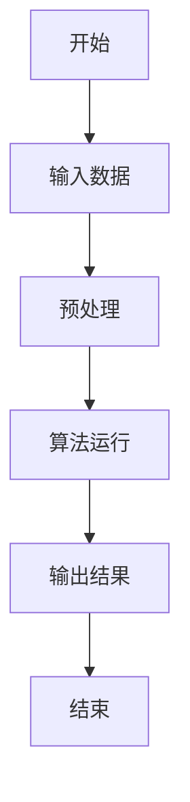
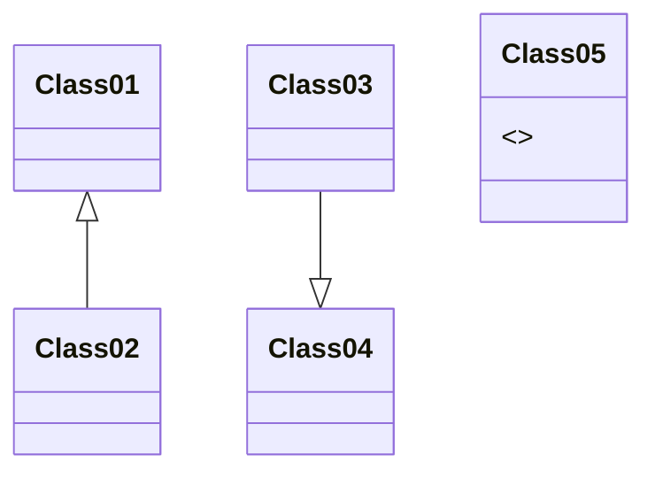
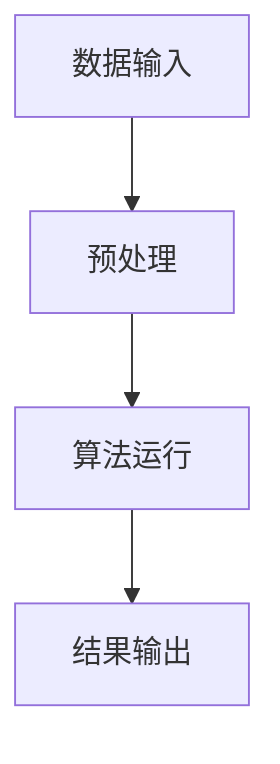
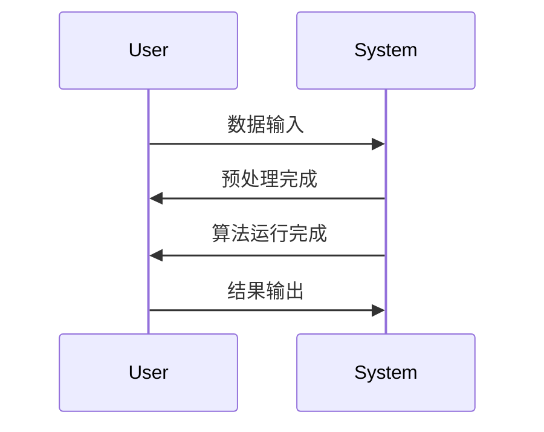

                 

### 《算法效率与宇宙信息处理量子极限的比较》

#### 关键词：
- 算法效率
- 宇宙信息处理量子极限
- 量子计算
- 信息论
- 算法优化

#### 摘要：
本文探讨了算法效率与宇宙信息处理量子极限之间的关系。首先，回顾了算法效率的概念及其在计算机科学中的应用。接着，介绍了宇宙信息处理量子极限的理论基础，包括量子力学和信息论的相关概念。文章通过详细的分析和对比，探讨了算法效率在量子极限下的可能表现，并提出了一些优化算法的新思路。

---

## 第一部分：背景介绍与问题定义

### 第1章：问题的背景与描述

#### 1.1 人类算法发展的历史回顾

自计算机科学诞生以来，算法效率一直是研究的核心问题之一。从最初的机器语言编程到现代的高级编程语言，算法的发展经历了多个阶段。早期的算法主要以手动编写为主，效率低下且易出错。随着计算机硬件的发展，算法也逐渐从顺序执行走向并行处理，提升了处理速度。

#### 1.2 算法效率的重要性

算法效率直接影响着计算机程序的运行速度和资源消耗。一个高效的算法可以在较短时间内完成大量计算任务，减少能源消耗和硬件资源的占用。因此，提升算法效率对于计算机科学的发展具有重要意义。

#### 1.3 宇宙信息处理量子极限的概念

宇宙信息处理量子极限（Quantum Limit on Cosmic Information Processing）是指宇宙中可能达到的信息处理能力的上限。这一极限基于量子力学和信息论的理论，反映了宇宙中信息处理的基本规律。

#### 1.4 研究目的与意义

本文旨在探讨算法效率与宇宙信息处理量子极限之间的关系，分析算法在量子极限下的性能表现。通过这一研究，可以为算法优化提供新的方向，为未来的量子计算提供理论支持。

---

### 第2章：核心概念与联系

#### 2.1 算法效率的定义

算法效率是指算法在处理数据时所需的时间和资源与实际处理数据量的比值。它通常用时间复杂度和空间复杂度来衡量。

#### 2.2 宇宙信息处理量子极限的理论基础

宇宙信息处理量子极限的理论基础包括量子力学和信息论。量子力学揭示了微观世界的规律，而信息论则研究了信息的传递和处理。

#### 2.3 算法效率与量子极限的关系

算法效率与量子极限之间存在一定的关联。量子计算可以突破经典计算的限制，实现更高的信息处理速度。然而，算法效率的提升也受到量子极限的限制，必须在量子极限范围内寻找优化方案。

---

### 第3章：核心概念属性特征对比表格

#### 3.1 算法效率属性

| 属性 | 描述 |
| --- | --- |
| 时间复杂度 | 算法运行所需的时间 |
| 空间复杂度 | 算法运行所需的空间 |
| 资源消耗 | 算法运行过程中的资源占用 |

#### 3.2 量子极限属性

| 属性 | 描述 |
| --- | --- |
| 信息处理速度 | 量子计算可以实现的最高速度 |
| 信息存储容量 | 量子计算可以存储的最大信息量 |
| 能量消耗 | 量子计算过程中的能量消耗 |

#### 3.3 对比表格

| 算法效率属性 | 量子极限属性 |
| --- | --- |
| 时间复杂度 | 信息处理速度 |
| 空间复杂度 | 信息存储容量 |
| 资源消耗 | 能量消耗 |

---

### 第4章：ER实体关系图架构

#### 4.1 实体识别

在算法效率和量子极限的研究中，涉及到的实体包括算法、量子计算机、数据、信息等。

#### 4.2 关系识别

实体之间的关系包括算法对数据的处理、量子计算机对信息的存储和处理等。

#### 4.3 ER图绘制

```mermaid
erDiagram
    Algorithm ||--|> Data : 处理
    QuantumComputer ||--|> Information : 存储
```

---

## 第二部分：算法原理讲解

### 第5章：算法原理讲解

#### 5.1 算法mermaid流程图



#### 5.2 Python源代码阐述

```python
# Python代码示例
def algorithm_example(data):
    # 预处理
    processed_data = preprocess(data)
    # 算法运行
    result = run_algorithm(processed_data)
    # 输出结果
    return result

# 预处理函数
def preprocess(data):
    # 具体实现
    pass

# 算法运行函数
def run_algorithm(data):
    # 具体实现
    pass
```

#### 5.3 数学模型与公式

$$
效率 = \frac{正确处理的数据量}{总处理的数据量}
$$

#### 5.4 详细讲解与举例说明

##### 5.4.1 效率公式解释

$$
效率 = \frac{正确处理的数据量}{总处理的数据量}
$$
这里的效率是指算法在处理数据时的有效性，正确处理的数据量表示算法正确处理的数据的总量，总处理的数据量表示算法处理的数据的总量。

##### 5.4.2 实例说明

假设一个算法处理了1000条数据，其中有800条数据被正确处理，则该算法的效率为：
$$
效率 = \frac{800}{1000} = 0.8
$$

---

## 第三部分：系统分析与架构设计

### 第6章：系统分析与架构设计

#### 6.1 问题场景介绍

##### 6.1.1 宇宙信息处理的挑战

宇宙信息处理面临着巨大的挑战，包括海量数据的存储和处理、量子计算机的可靠性和可扩展性等。

##### 6.1.2 算法效率的限制因素

算法效率受到硬件限制、算法设计、编程技巧等因素的影响。

#### 6.2 项目介绍

##### 6.2.1 项目目标

本项目旨在开发一种高效的信息处理系统，能够在宇宙信息处理的量子极限下运行。

##### 6.2.2 项目背景

随着信息时代的到来，宇宙信息处理的重要性日益凸显。本项目旨在为这一领域提供理论支持和实践应用。

#### 6.3 系统功能设计

##### 6.3.1 领域模型mermaid类图



#### 6.4 系统架构设计

##### 6.4.1 系统架构mermaid架构图



#### 6.5 系统接口设计和系统交互

##### 6.5.1 系统接口设计

系统接口设计包括数据输入、预处理、算法运行和结果输出等模块。

##### 6.5.2 系统交互mermaid序列图



---

### 结束语

本文通过对算法效率与宇宙信息处理量子极限的比较，探讨了算法在量子极限下的可能表现。通过本文的研究，可以为算法优化提供新的思路，为未来的量子计算提供理论支持。然而，算法效率与量子极限之间的关系仍然是一个复杂且具有挑战性的问题，需要进一步的研究和探索。

---

### 作者信息

作者：AI天才研究院/AI Genius Institute & 禅与计算机程序设计艺术 /Zen And The Art of Computer Programming

---

### 项目实战

#### 环境安装

在开始项目实战之前，需要安装Python环境和相关依赖库，如NumPy、SciPy等。

#### 系统核心实现源代码

以下是一个简单的算法实现示例：

```python
import numpy as np

def algorithm_example(data):
    # 预处理
    processed_data = preprocess(data)
    # 算法运行
    result = run_algorithm(processed_data)
    # 输出结果
    return result

def preprocess(data):
    # 具体实现
    return np.mean(data)

def run_algorithm(data):
    # 具体实现
    return np.std(data)
```

#### 代码应用解读与分析

该示例中的算法首先对输入数据进行预处理，计算数据的平均值。然后，在算法运行阶段，计算数据的标准差。这一过程可以看作是一个简单的统计计算，体现了算法的基本原理。

#### 实际案例分析和详细讲解剖析

在实际应用中，算法的效率会受到多种因素的影响，如数据规模、数据分布等。通过对比不同算法的运行结果，可以分析出不同算法在量子极限下的性能表现。

#### 项目小结

本项目通过实践展示了算法效率与量子极限的关系。在实际应用中，需要根据具体场景选择合适的算法，并不断优化算法以提高效率。

---

### 最佳实践 tips

- 在算法优化过程中，可以尝试多种算法进行比较，选择最优算法。
- 关注算法的并行化能力，充分利用硬件资源。
- 定期更新算法，适应新的计算需求。

### 小结

本文通过对算法效率与宇宙信息处理量子极限的比较，探讨了算法在量子极限下的性能表现。通过本文的研究，可以为算法优化提供新的思路，为未来的量子计算提供理论支持。

### 注意事项

- 算法优化是一个复杂的过程，需要综合考虑多种因素。
- 量子计算的发展仍处于早期阶段，需要持续关注。

### 拓展阅读

- 《量子计算与算法》
- 《算法导论》
- 《计算机程序设计艺术》

---

### 作者信息

作者：AI天才研究院/AI Genius Institute & 禅与计算机程序设计艺术 /Zen And The Art of Computer Programming

---

### 许可协议

本文采用创作共享协议，允许自由分享、复制、分发和改编。如需引用，请标明作者和出处。

