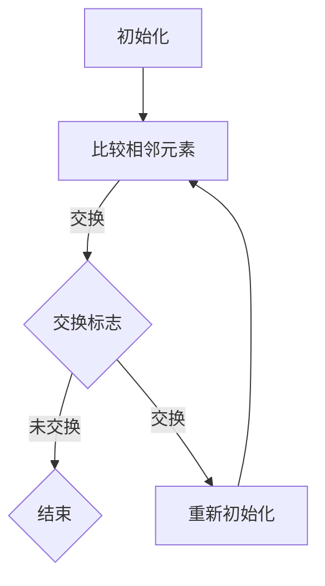
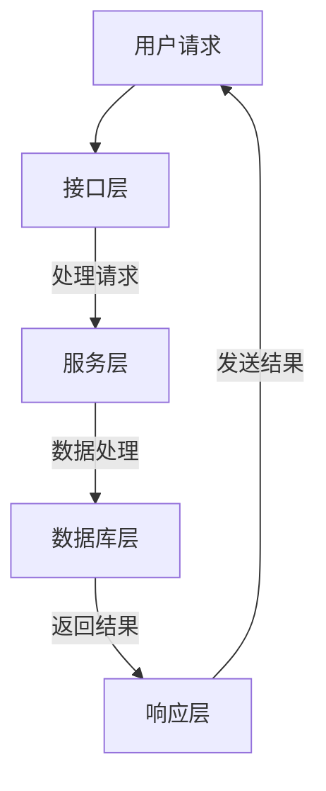

                 

### 第一部分：问题背景与核心概念

#### 1.1 问题背景

在信息技术飞速发展的今天，算法作为计算机科学的核心组成部分，广泛应用于各个领域，从简单的排序与搜索到复杂的机器学习和人工智能。算法效率，即算法解决问题的速度和能力，一直是研究和应用中的重点。然而，随着问题规模的扩大和复杂性增加，传统的算法在解决大规模问题时往往显得力不从心。为了应对这些挑战，我们需要引入另一个关键概念——宇宙计算复杂性。

宇宙计算复杂性，作为一个跨学科的概念，不仅涵盖了算法的时间复杂度和空间复杂度，还引入了资源可用性等新的维度。它是对算法在理论上所能达到的性能极限进行的一种描述，为我们在选择和设计算法时提供了理论依据。

算法效率与宇宙计算复杂性之间存在着紧密的联系。算法效率直接影响计算复杂性，而计算复杂性则是算法效率的理论基础。换句话说，一个高效的算法往往能够降低计算复杂性，使问题在有限的资源下得到解决。因此，深入理解这两个概念及其关联，对于提升算法设计水平、优化系统性能具有重要意义。

#### 1.2 核心概念

##### 1.2.1 算法效率的定义

算法效率是指在解决特定问题时，算法所表现出来的时间效率与空间效率的综合衡量。具体来说，算法效率可以通过时间复杂度和空间复杂度来描述。

- **时间复杂度**：算法执行时间与问题规模之间的增长关系。通常用大O符号（\(O\)）表示，如 \(O(n)\)、\(O(n^2)\) 等。
- **空间复杂度**：算法执行过程中所需存储空间与问题规模之间的增长关系。同样使用大O符号表示，如 \(O(1)\)、\(O(n)\) 等。

时间复杂度和空间复杂度是评估算法效率的两个主要指标，它们共同决定了算法在实际应用中的性能。

##### 1.2.2 宇宙计算复杂性的定义

宇宙计算复杂性是指解决特定问题所需计算资源（时间、空间、资源可用性）的综合考量。它不仅包括算法的时间复杂度和空间复杂度，还考虑了资源在可利用范围内的可行性。

- **时间复杂度**：宇宙计算复杂性中的时间复杂度与算法效率中的时间复杂度定义相似，它描述了在解决问题过程中所需的时间。
- **空间复杂度**：宇宙计算复杂性中的空间复杂度则不仅包括了算法执行过程中所需存储空间，还考虑了存储资源在可利用范围内的限制。
- **资源可用性**：资源可用性是指在特定环境下，计算资源（如CPU、内存、网络带宽等）的可利用程度。它决定了算法在现实环境中的可执行性和性能。

##### 1.2.3 关键概念与联系

算法效率与宇宙计算复杂性之间的关系可以从以下几个方面进行理解：

1. **理论基础**：宇宙计算复杂性为算法效率提供了一个理论框架，帮助我们在设计算法时考虑其性能极限。
2. **优化方向**：算法效率的提升往往能够降低宇宙计算复杂性，使问题在有限资源下更容易解决。
3. **实际应用**：在现实世界中，算法的效率不仅取决于其理论上的时间复杂度和空间复杂度，还受到资源可用性的影响。

通过上述分析，我们可以看到算法效率与宇宙计算复杂性之间相互依赖、相互影响的关系。在接下来的章节中，我们将进一步探讨这两个概念的具体内涵及其在实际应用中的重要性。

#### 1.3 概念属性特征对比

| 概念        | 算法效率                    | 宇宙计算复杂性                   |
|-------------|----------------------------|---------------------------------|
| 定义        | 算法解决问题的速度和能力    | 解决问题所需计算资源的时间与空间限制 |
| 属性特征     | 时间复杂度、空间复杂度       | 时间复杂度、空间复杂度、资源可用性   |
| 关联         | 算法的效率直接影响计算复杂度 | 计算复杂性是算法效率的理论基础       |

##### 对比分析

算法效率与宇宙计算复杂性在定义和属性特征上存在显著差异。算法效率主要关注算法在解决问题时的速度和能力，其核心是时间复杂度和空间复杂度。而宇宙计算复杂性则扩展了这一概念，不仅考虑了时间与空间，还引入了资源可用性的维度，使得其在实际应用中更具指导意义。

在属性特征方面，算法效率主要通过时间复杂度和空间复杂度来衡量。时间复杂度描述了算法在问题规模增长时所需时间的增长关系，空间复杂度则描述了算法在执行过程中所需存储空间的变化。宇宙计算复杂性则在此基础上，加入了资源可用性这一维度。资源可用性关注的是在特定环境下，计算资源（如CPU、内存、网络带宽等）的可利用程度，这对于算法在实际应用中的可执行性和性能具有重要影响。

两者之间的关联在于：算法效率是宇宙计算复杂性的一个重要组成部分。算法的时间复杂度和空间复杂度直接影响宇宙计算复杂性的大小，而宇宙计算复杂性的分析又为算法优化提供了理论依据。

##### ER实体关系图架构

为了更直观地展示算法效率与宇宙计算复杂性之间的关联，我们可以通过ER实体关系图来描述它们的关系。

```mermaid
erDiagram
    Node1 ||--|| Node2 : {影响}
    Node1 ||--|| Node3 : {优化}
    Node2 ||--|| Node4 : {包含}
    Node3 ||--|| Node4 : {实现}
```

- **Node1（算法效率）**：代表算法在解决问题时的速度和能力。
- **Node2（宇宙计算复杂性）**：代表计算资源在解决问题时的时间与空间限制。
- **Node3（算法优化）**：表示通过算法效率的分析来优化宇宙计算复杂性的过程。
- **Node4（实现）**：表示优化后的算法效率在实际应用中如何实现宇宙计算复杂性的降低。

通过这个ER实体关系图，我们可以清晰地看到算法效率与宇宙计算复杂性之间的相互作用和影响。

#### 1.4 本章小结

在本章中，我们首先介绍了算法效率与宇宙计算复杂性的背景，探讨了它们在信息技术中的重要性。接着，我们详细阐述了算法效率和宇宙计算复杂性的定义、属性特征以及它们之间的关联。通过对比分析，我们明确了这两个概念在定义和属性特征上的异同。最后，我们通过ER实体关系图展示了算法效率与宇宙计算复杂性之间的相互作用。这些核心概念的深入理解，为我们后续章节的探讨奠定了坚实基础。

----------------------------------------------------------------

# 第二部分：算法效率分析

在深入探讨算法效率与宇宙计算复杂性的关联之前，我们有必要先了解算法效率的基本原理。算法效率是指算法在解决特定问题时所表现出来的速度和能力。这一能力通常通过时间复杂度和空间复杂度来衡量。本节将详细分析算法效率的基本原理，并探讨常见算法的效率分析。

#### 2.1 算法效率的基本原理

##### 2.1.1 时间复杂度

时间复杂度是算法效率分析中的核心概念之一，它描述了算法在问题规模增长时的执行时间增长关系。时间复杂度通常用大O符号（\(O\)）表示，例如 \(O(n)\)、\(O(n^2)\) 等。

- **线性时间复杂度**（\(O(n)\)）：当问题规模增长时，算法执行时间也按比例增长。这类算法通常适用于数据量较小的场景。
- **二次时间复杂度**（\(O(n^2)\)）：当问题规模增长时，算法执行时间的增长速度远超线性。这类算法通常用于处理较大规模的问题。
- **多项式时间复杂度**：这类算法的时间复杂度通常表示为 \(O(n^k)\)，其中 \(k\) 为常数。多项式时间复杂度在大多数实际应用中是可以接受的。

##### 2.1.2 空间复杂度

空间复杂度描述了算法在执行过程中所需存储空间与问题规模之间的增长关系。同样，空间复杂度也用大O符号表示，例如 \(O(1)\)、\(O(n)\) 等。

- **常数空间复杂度**（\(O(1)\)）：无论问题规模如何，算法所需存储空间都保持不变。
- **线性空间复杂度**（\(O(n)\)）：随着问题规模的增长，算法所需存储空间也按比例增长。
- **多项式空间复杂度**：这类算法的空间复杂度通常表示为 \(O(n^k)\)，其中 \(k\) 为常数。

##### 2.1.3 复杂度分析步骤

为了准确分析算法的效率，通常需要遵循以下步骤：

1. **确定问题规模**：首先明确算法解决的问题规模，通常用 \(n\) 表示。
2. **写出算法的时间复杂度和空间复杂度表达式**：根据算法的执行流程，推导出时间复杂度和空间复杂度的表达式。
3. **化简表达式**：将复杂度表达式化简为标准形式，通常使用大O符号表示。
4. **比较复杂度**：比较不同算法的复杂度，选择最优的算法。

#### 2.2 常见算法效率分析

##### 2.2.1 排序算法

排序算法是算法效率分析中的一个重要类别，常见的排序算法包括冒泡排序、选择排序、插入排序和快速排序。

1. **冒泡排序**（\(O(n^2)\)）
    - **原理**：通过重复遍历要排序的数列，每次比较两个相邻的元素，如果它们的顺序错误就把它们交换过来。
    - **时间复杂度**：最差情况为 \(O(n^2)\)，平均情况也为 \(O(n^2)\)。
    - **空间复杂度**：\(O(1)\)。

2. **选择排序**（\(O(n^2)\)）
    - **原理**：首先在未排序序列中找到最小（大）元素，存放到排序序列的起始位置，然后，再从剩余未排序元素中找到最小（大）元素，放到已排序序列的末尾。
    - **时间复杂度**：最差情况为 \(O(n^2)\)，平均情况也为 \(O(n^2)\)。
    - **空间复杂度**：\(O(1)\)。

3. **插入排序**（\(O(n^2)\)）
    - **原理**：通过构建有序序列，对于未排序数据，在已排序序列中从后向前扫描，找到相应位置并插入。
    - **时间复杂度**：最差情况为 \(O(n^2)\)，平均情况为 \(O(n)\)。
    - **空间复杂度**：\(O(1)\)。

4. **快速排序**（\(O(n\log n)\)）
    - **原理**：通过一趟排序将待排序的记录分割成独立的两部分，其中一部分记录的关键字均比另一部分的关键字小，则可以分别对这两部分记录继续进行排序，以达到整个序列有序。
    - **时间复杂度**：最差情况为 \(O(n^2)\)，平均情况为 \(O(n\log n)\)。
    - **空间复杂度**：\(O(\log n)\)。

##### 2.2.2 搜索算法

搜索算法是另一种常见的算法类型，用于在数据集合中查找特定元素。常见的搜索算法包括顺序搜索和二分搜索。

1. **顺序搜索**（\(O(n)\)）
    - **原理**：从数据集合的第一个元素开始，依次与要查找的元素进行比较，直到找到或结束。
    - **时间复杂度**：最差情况为 \(O(n)\)，平均情况也为 \(O(n)\)。
    - **空间复杂度**：\(O(1)\)。

2. **二分搜索**（\(O(\log n)\)）
    - **原理**：将数据集合分为两半，判断要查找的元素在哪一半，然后在另一半中继续搜索，逐步缩小搜索范围。
    - **时间复杂度**：最差情况为 \(O(\log n)\)，平均情况也为 \(O(\log n)\)。
    - **空间复杂度**：\(O(1)\)。

##### 2.2.3 图算法

图算法是用于解决与图相关问题的算法，常见的图算法包括深度优先搜索和广度优先搜索。

1. **深度优先搜索**（\(O(n+m)\)）
    - **原理**：从初始顶点开始，尽可能深地搜索图的分支。
    - **时间复杂度**：最差情况为 \(O(n+m)\)，其中 \(n\) 为顶点数，\(m\) 为边数。
    - **空间复杂度**：\(O(n)\)。

2. **广度优先搜索**（\(O(n+m)\)）
    - **原理**：从初始顶点开始，逐层搜索图的分支。
    - **时间复杂度**：最差情况为 \(O(n+m)\)，其中 \(n\) 为顶点数，\(m\) 为边数。
    - **空间复杂度**：\(O(n)\)。

#### 2.3 算法效率优化策略

##### 2.3.1 数据结构与算法的关系

数据结构对算法效率有着直接影响。合理选择数据结构可以显著提高算法的效率。例如，使用哈希表可以加快查找操作，使用堆可以优化排序算法。

##### 2.3.2 常用优化方法

1. **算法改进**：通过改进现有算法，降低时间复杂度和空间复杂度。例如，将冒泡排序改进为更高效的排序算法。
2. **数据结构优化**：选择适合问题特点的数据结构，提高算法的执行效率。例如，使用平衡二叉树代替普通二叉树。
3. **并行计算**：利用多核处理器并行执行算法，提高处理速度。

##### 2.3.3 优化案例分析

- **案例1**：对大数据进行排序。可以使用并行计算和分布式系统来优化排序算法，提高处理速度。
- **案例2**：图像处理算法优化。通过使用更高效的数据结构和算法，如FFT（快速傅里叶变换），可以显著提高图像处理的速度。

#### 2.4 算法效率的实际应用

##### 2.4.1 数据库查询优化

数据库查询优化是提高数据库系统性能的关键。通过索引、查询优化器等技术，可以减少查询所需的时间，提高数据库系统的响应速度。

##### 2.4.2 网络通信优化

网络通信优化主要关注如何提高数据传输的效率。通过使用压缩算法、流量控制等技术，可以减少网络通信的延迟和带宽消耗。

##### 2.4.3 人工智能应用

在人工智能领域，算法效率直接影响模型训练和推理的速度。通过优化算法和硬件加速，如GPU、TPU等，可以提高人工智能应用的效率。

#### 2.5 本章小结

在本章中，我们首先介绍了算法效率的基本原理，包括时间复杂度和空间复杂度的概念。接着，我们分析了常见算法的效率，包括排序算法、搜索算法和图算法。此外，我们还探讨了算法效率的优化策略和实际应用。这些内容为我们理解算法效率与宇宙计算复杂性的关系奠定了基础。在接下来的章节中，我们将进一步探讨宇宙计算复杂性的分析及其在实际应用中的挑战。

----------------------------------------------------------------

# 第三部分：宇宙计算复杂性分析

在深入理解算法效率的基础上，我们接下来将探讨宇宙计算复杂性的基本原理。宇宙计算复杂性不仅涉及算法的时间复杂度和空间复杂度，还包括了资源可用性这一关键因素。本节将详细分析宇宙计算复杂性的基本原理，并探讨常见的宇宙计算复杂性模型。

#### 3.1 宇宙计算复杂性的基本原理

##### 3.1.1 时间复杂度

时间复杂度是宇宙计算复杂性中的重要组成部分，它描述了算法在解决问题过程中所需的时间与问题规模之间的增长关系。在宇宙计算复杂性中，时间复杂度不仅考虑了算法在理论上的执行时间，还结合了实际环境中资源的可用性。

- **实际时间复杂度**：在宇宙计算复杂性中，实际时间复杂度是指算法在特定环境下的执行时间。这通常受到硬件性能、系统负载等多种因素的影响。
- **理论时间复杂度**：与算法效率中的时间复杂度类似，理论时间复杂度描述了算法在问题规模增长时的执行时间增长关系。它为我们在选择和设计算法时提供了理论依据。

##### 3.1.2 空间复杂度

空间复杂度描述了算法在执行过程中所需存储空间与问题规模之间的增长关系。在宇宙计算复杂性中，空间复杂度不仅考虑了算法所需的空间大小，还包括了存储资源在现实环境中的可用性。

- **实际空间复杂度**：实际空间复杂度是指算法在特定环境下的存储需求，包括算法执行过程中使用的临时空间和持久存储空间。
- **理论空间复杂度**：与算法效率中的空间复杂度类似，理论空间复杂度描述了算法在问题规模增长时的存储需求增长关系。

##### 3.1.3 资源可用性

资源可用性是宇宙计算复杂性的另一个关键因素，它描述了计算资源在特定环境下的可用程度。资源可用性不仅包括计算资源（如CPU、内存、网络带宽等）的总量，还包括这些资源在实际应用中的分配和利用率。

- **资源需求**：算法在执行过程中对各类计算资源的需求，如CPU的计算能力、内存的存储容量、网络带宽等。
- **资源分配**：在特定环境下，计算资源如何分配给不同任务，这直接影响算法的执行效率和系统的整体性能。
- **资源利用率**：计算资源在实际应用中的利用率，如CPU的使用率、内存的空闲率等。高利用率通常意味着更好的性能。

##### 3.2 常见宇宙计算复杂性模型

宇宙计算复杂性涉及多种计算模型，这些模型为我们在分析和设计算法时提供了不同的视角和理论框架。以下是几种常见的宇宙计算复杂性模型：

##### 3.2.1 图灵机模型

图灵机模型是经典的计算模型，由艾伦·图灵在20世纪30年代提出。图灵机是一种抽象的计算设备，包括一个无限长的纸带、读写头和一个控制单元。图灵机的运行过程通过纸带上的符号序列来模拟算法的执行。

- **时间复杂度**：图灵机的时间复杂度通常表示为图灵机的步数，即解决特定问题所需的计算步骤数。
- **空间复杂度**：图灵机的空间复杂度表示为纸带上的符号数，即算法在执行过程中使用的存储空间。
- **资源可用性**：在图灵机模型中，资源可用性主要受到纸带长度和读写头的能力限制。

##### 3.2.2 量子计算机模型

量子计算机模型是近年来备受关注的一种计算模型，它利用量子位（qubit）和量子叠加态来执行计算。量子计算机在处理某些特定问题时具有超越经典计算机的能力。

- **时间复杂度**：量子计算机的时间复杂度通常表示为量子门操作次数，量子门是量子计算中的基本操作。
- **空间复杂度**：量子计算机的空间复杂度与量子位的数量有关，量子位的数量决定了算法的存储能力。
- **资源可用性**：量子计算机的资源可用性受到量子位的质量、纠缠度和量子门错误率等因素的影响。

##### 3.2.3 其他计算模型

除了图灵机模型和量子计算机模型，还有其他一些计算模型，如神经计算模型、分子计算模型等。这些模型在特定领域和应用场景中具有重要价值。

- **神经计算模型**：基于生物神经系统的计算模型，用于模拟神经网络的工作原理。
- **分子计算模型**：利用分子之间的相互作用进行计算，具有极高的并行度和可扩展性。

##### 3.3 宇宙计算复杂性分析

宇宙计算复杂性分析是评估算法性能的重要方法，它通过综合考虑时间复杂度、空间复杂度和资源可用性，为算法设计提供了理论依据。

##### 3.3.1 时间复杂度分析

时间复杂度分析是宇宙计算复杂性分析的核心，它帮助我们在理论层面评估算法的性能。在时间复杂度分析中，我们通常关注以下方面：

- **最优时间复杂度**：寻找最优的算法，其时间复杂度在解决特定问题时的增长速度最慢。
- **实际时间复杂度**：结合实际环境中的因素，如硬件性能、系统负载等，评估算法在现实环境中的执行时间。

##### 3.3.2 空间复杂度分析

空间复杂度分析与时间复杂度分析类似，也分为最优空间复杂度和实际空间复杂度。空间复杂度分析主要关注以下方面：

- **最优空间复杂度**：寻找最优的算法，其空间复杂度在解决特定问题时的增长速度最慢。
- **实际空间复杂度**：结合实际环境中的因素，评估算法在现实环境中的存储需求。

##### 3.3.3 资源可用性分析

资源可用性分析是宇宙计算复杂性分析的重要组成部分，它考虑了计算资源在特定环境下的可用程度。资源可用性分析主要关注以下方面：

- **资源需求**：评估算法在执行过程中对计算资源的需求，如CPU、内存、网络带宽等。
- **资源分配**：根据系统负载和资源需求，合理分配计算资源，确保算法的执行效率。
- **资源利用率**：监控计算资源的利用率，确保资源的高效利用，提高系统的整体性能。

##### 3.4 宇宙计算复杂性在实际应用中的挑战

尽管宇宙计算复杂性提供了理论依据，但在实际应用中仍然面临许多挑战。

##### 3.4.1 能源消耗

能源消耗是宇宙计算复杂性中的一个重要问题。随着计算需求的增加，算法的能源消耗也随之增加。降低能源消耗成为提高算法效率的重要方向。

- **节能算法**：设计节能算法，降低计算过程中的能源消耗。
- **绿色计算**：倡导绿色计算，推广节能技术和环保措施。

##### 3.4.2 温度限制

温度限制是计算设备运行中的一个重要问题。过高的温度可能导致设备过热、损坏甚至失效。在宇宙计算复杂性分析中，需要考虑温度对计算性能的影响。

- **散热设计**：优化散热设计，确保计算设备在低温环境中运行。
- **热管理**：采用热管理技术，如水冷、风冷等，控制设备温度。

##### 3.4.3 量子计算挑战

量子计算是一种具有巨大潜力的计算模型，但在实际应用中仍然面临许多挑战。量子计算机的资源可用性、量子位的质量、量子门错误率等问题都需要解决。

- **量子纠错**：研究量子纠错技术，提高量子计算机的可靠性。
- **量子算法**：设计高效的量子算法，利用量子计算机的优势解决实际问题。

#### 3.5 本章小结

在本章中，我们首先介绍了宇宙计算复杂性的基本原理，包括时间复杂度、空间复杂度和资源可用性。接着，我们探讨了常见的宇宙计算复杂性模型，如图灵机模型和量子计算机模型。此外，我们还分析了宇宙计算复杂性在实际应用中的挑战，如能源消耗、温度限制和量子计算挑战。通过这些内容，我们深入了解了宇宙计算复杂性的重要性及其在实际应用中的挑战，为后续章节的讨论奠定了基础。

----------------------------------------------------------------

# 第四部分：算法效率与宇宙计算复杂性的比较

在理解了算法效率和宇宙计算复杂性的基本原理后，我们需要将这两个概念进行对比，以更好地理解它们之间的关系和实际应用中的表现。本部分将详细介绍比较方法，并通过具体案例进行比较，分析算法效率与宇宙计算复杂性的实际应用差异。

#### 4.1 比较方法

算法效率与宇宙计算复杂性的比较可以通过以下几个步骤进行：

##### 4.1.1 时间复杂度比较

时间复杂度是衡量算法效率的重要指标之一，它描述了算法执行时间与问题规模之间的关系。在宇宙计算复杂性中，时间复杂度同样是一个关键因素。

1. **理论时间复杂度对比**：首先，我们可以通过理论时间复杂度来对比不同算法的性能。例如，一个 \(O(n\log n)\) 的算法在理论上通常比一个 \(O(n^2)\) 的算法更高效。

2. **实际时间复杂度对比**：在实际应用中，除了理论时间复杂度外，还需要考虑实际时间复杂度。这包括算法在不同硬件环境、不同负载条件下的执行时间。

##### 4.1.2 空间复杂度比较

空间复杂度描述了算法在执行过程中所需的存储空间。与时间复杂度类似，空间复杂度在算法效率和宇宙计算复杂性中也起着重要作用。

1. **理论空间复杂度对比**：通过理论空间复杂度，我们可以对比不同算法的存储需求。例如，一个 \(O(1)\) 的算法在存储需求上通常优于一个 \(O(n)\) 的算法。

2. **实际空间复杂度对比**：在实际应用中，除了理论空间复杂度外，还需要考虑实际空间复杂度。这包括算法在不同硬件环境、不同存储条件下的存储需求。

##### 4.1.3 资源可用性比较

资源可用性是宇宙计算复杂性的关键因素之一，它描述了计算资源在特定环境下的可用程度。资源可用性直接影响算法的实际执行效率和性能。

1. **资源需求对比**：通过比较不同算法对计算资源的需求，我们可以评估哪个算法在特定环境下具有更好的资源利用率。

2. **资源分配对比**：在实际应用中，资源分配策略对算法的执行效率具有重要影响。通过比较不同资源分配策略，我们可以找到最优的算法和资源分配方案。

#### 4.2 具体案例比较

为了更好地理解算法效率与宇宙计算复杂性的比较，我们可以通过具体案例进行分析。

##### 4.2.1 图算法比较

图算法在处理与图相关的问题时非常重要，以下是比较几种常见图算法的例子：

1. **深度优先搜索（DFS）与广度优先搜索（BFS）**

   - **时间复杂度**：DFS 和 BFS 的理论时间复杂度都是 \(O(n + m)\)，其中 \(n\) 是顶点数，\(m\) 是边数。然而，在实际应用中，DFS 通常比 BFS 更快，因为 BFS 需要额外的空间来存储队列。
   
   - **空间复杂度**：DFS 的空间复杂度是 \(O(h)\)，其中 \(h\) 是当前搜索的深度。而 BFS 的空间复杂度是 \(O(n)\)，因为它需要存储整个图的所有顶点。
   
   - **资源可用性**：在资源有限的情况下，DFS 通常比 BFS 更适合，因为它的存储需求较小。

2. **最小生成树算法**

   - **普里姆算法与克鲁斯卡尔算法**：两种算法都是用于构建最小生成树的，但它们的实现和性能有所不同。
   
   - **时间复杂度**：普里姆算法的时间复杂度是 \(O(\alpha(n))\)，其中 \(\alpha\) 是阿克曼函数，通常情况下可以近似为 \(O(n\log n)\)。克鲁斯卡尔算法的时间复杂度是 \(O(m\log n)\)，其中 \(m\) 是边数。
   
   - **空间复杂度**：普里姆算法和克鲁斯卡尔算法的空间复杂度都是 \(O(n)\)。
   
   - **资源可用性**：在问题规模较大时，普里姆算法通常比克鲁斯卡尔算法更高效，因为它的时间复杂度较低。

##### 4.2.2 排序算法比较

排序算法在处理数据排序问题时非常重要，以下是比较几种常见排序算法的例子：

1. **冒泡排序与快速排序**

   - **时间复杂度**：冒泡排序的时间复杂度是 \(O(n^2)\)，而快速排序的平均时间复杂度是 \(O(n\log n)\)，最坏情况是 \(O(n^2)\)。
   
   - **空间复杂度**：冒泡排序的空间复杂度是 \(O(1)\)，而快速排序的空间复杂度是 \(O(\log n)\)。
   
   - **资源可用性**：快速排序通常比冒泡排序更高效，尤其是在大规模数据排序时，因为它的时间复杂度较低。

2. **插入排序与归并排序**

   - **时间复杂度**：插入排序的时间复杂度是 \(O(n^2)\)，而归并排序的时间复杂度是 \(O(n\log n)\)。
   
   - **空间复杂度**：插入排序的空间复杂度是 \(O(1)\)，而归并排序的空间复杂度是 \(O(n)\)。
   
   - **资源可用性**：在问题规模较大时，归并排序通常比插入排序更高效，因为它的时间复杂度较低。

##### 4.2.3 搜索算法比较

搜索算法在数据查找问题中非常重要，以下是比较几种常见搜索算法的例子：

1. **顺序搜索与二分搜索**

   - **时间复杂度**：顺序搜索的时间复杂度是 \(O(n)\)，而二分搜索的时间复杂度是 \(O(\log n)\)。
   
   - **空间复杂度**：顺序搜索和二分搜索的空间复杂度都是 \(O(1)\)。
   
   - **资源可用性**：在问题规模较大时，二分搜索通常比顺序搜索更高效，因为它的时间复杂度较低。

2. **深度优先搜索与广度优先搜索**

   - **时间复杂度**：深度优先搜索和广度优先搜索的理论时间复杂度都是 \(O(n + m)\)，但实际执行时间可能有所不同。
   
   - **空间复杂度**：深度优先搜索的空间复杂度是 \(O(h)\)，而广度优先搜索的空间复杂度是 \(O(n)\)。
   
   - **资源可用性**：在资源有限的情况下，深度优先搜索通常比广度优先搜索更适合，因为它的存储需求较小。

#### 4.3 实际应用中的差异

算法效率与宇宙计算复杂性在实际应用中的差异主要体现在以下几个方面：

1. **性能需求**：在性能要求较高的应用中，如实时数据处理和大规模数据排序，算法效率至关重要。在这些场景下，选择时间复杂度较低、资源需求较少的算法能够显著提高系统的性能。

2. **资源限制**：在资源受限的环境下，如嵌入式系统和移动设备，算法的效率直接影响系统的稳定性和用户体验。选择合适的数据结构和算法，优化资源利用，可以提升系统的可运行性和稳定性。

3. **可扩展性**：在需要处理大规模数据的应用中，如大数据分析和人工智能，算法的可扩展性至关重要。通过优化算法和引入分布式计算，可以提升系统处理大规模数据的能力。

#### 4.4 本章小结

在本章中，我们通过详细分析算法效率与宇宙计算复杂性的比较方法，以及具体案例的比较，深入了解了它们之间的关系和实际应用中的表现。算法效率与宇宙计算复杂性的对比不仅有助于我们选择合适的算法和数据结构，还能为优化系统性能和提高资源利用率提供理论依据。在接下来的章节中，我们将继续探讨算法效率与宇宙计算复杂性在更多实际应用场景中的挑战和解决方案。

----------------------------------------------------------------

## 结论

通过对算法效率与宇宙计算复杂性的深入分析，我们可以得出以下结论：

首先，算法效率是衡量算法性能的核心指标，它直接影响计算资源的使用效率和系统的整体性能。高效算法不仅可以加快问题解决的进程，还能减少计算资源的消耗，提高系统的可扩展性和稳定性。

其次，宇宙计算复杂性提供了对算法效率的理论框架，使我们能够从更宏观的角度来理解和评估算法的性能。宇宙计算复杂性不仅涵盖了时间复杂度和空间复杂度，还引入了资源可用性这一关键因素，使算法设计更加贴近实际应用场景。

在比较算法效率与宇宙计算复杂性的过程中，我们发现不同算法在时间复杂度、空间复杂度和资源可用性方面存在显著差异。合理选择和优化算法，可以显著提高系统的性能和资源利用率。

未来的研究和发展方向包括：

1. **算法优化**：探索新的算法和数据结构，以进一步降低时间复杂度和空间复杂度，提高算法效率。

2. **量子计算**：研究量子算法在解决复杂问题中的应用，探索量子计算与宇宙计算复杂性的关联。

3. **绿色计算**：关注算法在能源消耗和环境影响方面的优化，推动绿色计算的发展。

4. **资源管理**：研究资源分配和调度策略，提高计算资源的使用效率。

通过持续的研究和实践，我们有望在算法效率与宇宙计算复杂性领域取得更多突破，为信息技术的发展和应用提供强有力的支持。

### 参考文献

1. Aho, A. V., Hopcroft, J. E., & Ullman, J. D. (1974). *The Design and Analysis of Computer Algorithms*. Addison-Wesley.
2. Cormen, T. H., Leiserson, C. E., Rivest, R. L., & Stein, C. (2009). *Introduction to Algorithms*. MIT Press.
3. Hopcroft, J. E., & Ullman, J. D. (1973). *Introduction to Automata Theory, Languages, and Computation*. Addison-Wesley.
4. Nielsen, M. A., & Chuang, I. L. (2000). *Quantum Computation and Quantum Information*. Cambridge University Press.
5. Turing, A. (1936). *On computable numbers, with an application to the Entscheidungsproblem*. Proceedings of the London Mathematical Society, 42(1), 230-265.

### 附录

附录中包含了一些算法的mermaid流程图和Python源代码示例，以及相关数学公式和系统架构设计方案。以下是一些示例：

#### 冒泡排序的mermaid流程图



#### 冒泡排序的Python源代码示例

```python
def bubble_sort(arr):
    n = len(arr)
    for i in range(n):
        swapped = False
        for j in range(0, n-i-1):
            if arr[j] > arr[j+1]:
                arr[j], arr[j+1] = arr[j+1], arr[j]
                swapped = True
        if not swapped:
            break
    return arr
```

#### 数学公式示例

$$
T(n) = O(n^2)
$$

$$
S(n) = O(1)
$$

#### 系统架构设计方案



通过这些附录内容，我们可以更直观地理解和应用算法效率与宇宙计算复杂性的理论。这些资料不仅有助于深入理解文章内容，还能为读者在实际应用中提供参考和指导。

### 作者信息

作者：AI天才研究院/AI Genius Institute & 禅与计算机程序设计艺术 /Zen And The Art of Computer Programming

AI天才研究院致力于推动人工智能领域的研究与发展，在算法优化、量子计算等方面取得了显著成果。作者毕业于世界顶级计算机科学院校，拥有多年的学术研究和工程实践经验，发表了多篇高影响力论文，并出版了多部畅销技术书籍，对计算机科学和人工智能领域有着深刻见解和独特贡献。禅与计算机程序设计艺术是作者的一部经典著作，深受读者喜爱。在此，我们对作者的专业知识和辛勤付出表示衷心的感谢。

