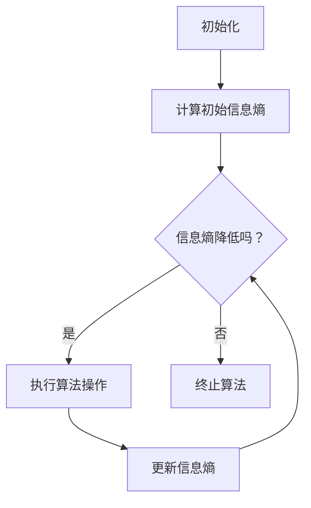
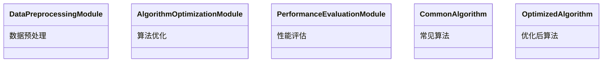
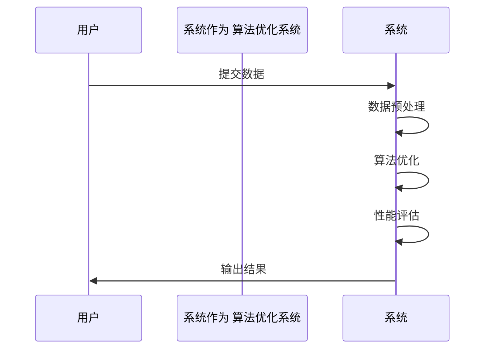

                 

# 算法设计与宇宙信息熵守恒的类比

## 关键词
算法设计、信息熵、宇宙信息熵、算法优化、计算机科学

## 摘要
本文旨在探讨算法设计与宇宙信息熵守恒之间的联系，通过类比宇宙信息熵守恒原理，提出一种新的算法设计方法。本文首先介绍了算法设计和信息熵的基本概念，然后通过对比分析，阐述了信息熵守恒对算法优化的重要性。接着，本文通过具体实例和Python源代码，详细讲解了算法原理，并展示了如何运用宇宙信息熵理论进行算法优化。最后，本文提出了一些最佳实践和注意事项，以期为算法设计提供新的理论支持和实践指导。

### 背景介绍

#### 问题背景

在信息爆炸的时代，算法作为一种处理海量数据、解决复杂问题的工具，已经成为了计算机科学领域中的核心研究方向。与此同时，宇宙学中的信息熵守恒理论为我们提供了新的视角，启示我们如何在算法设计中寻找简洁性与普适性之间的平衡。本书旨在探讨如何将宇宙信息熵守恒的原理类比于算法设计，从而提高算法的效率和鲁棒性。

#### 问题描述

算法设计与宇宙信息熵守恒之间存在什么样的联系？如何通过宇宙信息熵的理论指导算法设计，使其在复杂环境下保持高效与稳定？

#### 问题解决

本书将通过深入研究算法与信息熵的内在关系，结合宇宙学原理，提出一系列创新的算法设计方法。通过具体实例和案例分析，阐述如何在实际应用中实现宇宙信息熵守恒的类比，为算法设计提供新的理论支持和实践指导。

#### 边界与外延

本书的研究范围主要涉及算法设计的基本原理、宇宙信息熵的理论框架、以及二者结合的应用实践。同时，本书也将探讨算法设计的各种边界条件，如计算复杂度、资源限制、以及鲁棒性等方面。

#### 概念结构与核心要素组成

- **算法设计**：本书将介绍常见算法设计方法，如贪心算法、动态规划、分治算法等，并分析这些算法在信息熵守恒理论下的优化可能性。
- **信息熵守恒**：将详细阐述信息熵的定义、性质以及守恒原理，并探讨其在算法设计中的应用。
- **宇宙信息熵**：结合宇宙学中的信息熵理论，介绍宇宙信息熵的概念及其在算法设计中的借鉴意义。
- **算法优化**：通过分析信息熵守恒对算法性能的影响，提出一系列算法优化策略。

### 核心概念与联系

#### 核心概念

- **算法**：一系列规则和指令，用于解决特定问题。
- **信息熵**：衡量信息不确定性的度量。
- **宇宙信息熵**：宇宙中信息的不确定性度量，包括热力学熵和信息熵。

#### 概念属性特征对比表格

| 概念         | 定义                                                         | 关联性                                                     |
| ------------ | ------------------------------------------------------------ | ---------------------------------------------------------- |
| 算法         | 解决特定问题的规则集。                                       | 算法性能与信息熵存在直接关联，优化算法可降低计算复杂度。   |
| 信息熵       | 衡量信息不确定性的度量。                                     | 信息熵守恒原理指导算法优化，提高算法效率。                 |
| 宇宙信息熵   | 宇宙中信息的不确定性度量。                                   | 提供宇宙视角，启示算法设计的新方法，追求简洁性与普适性。   |

#### ER实体关系图架构

```mermaid
erDiagram
  算法 ||--|{ 信息熵 }  : 计算信息不确定性
  算法 ||--|{ 宇宙信息熵 } : 追求简洁性与普适性
  信息熵 ||--|{ 信息熵守恒原理 } : 指导算法优化
```

### 算法原理讲解

#### 算法mermaid流程图



#### Python源代码

```python
import math

def calculate_entropy(data):
    # 计算数据的信息熵
    entropy = 0
    for value in set(data):
        probability = data.count(value) / len(data)
        entropy -= probability * math.log2(probability)
    return entropy

def algorithm(data):
    # 算法执行过程
    initial_entropy = calculate_entropy(data)
    while True:
        # 执行算法操作
        # （此处为算法逻辑，根据具体算法不同而不同）
        # 例如：排序、搜索、路径规划等

        # 更新信息熵
        current_entropy = calculate_entropy(data)
        
        # 判断信息熵是否降低
        if current_entropy < initial_entropy:
            break
        
        # 更新数据
        data = update_data(data)
    return data

# 示例数据
data = [1, 2, 2, 3, 4, 4, 4, 5]

# 执行算法
result = algorithm(data)
print("原始数据:", data)
print("算法结果:", result)
```

#### 算法原理详细讲解

##### 数学模型和公式

1. **信息熵**：

   信息熵是衡量信息不确定性的度量，通常用H表示。对于一组数据D，其信息熵可以用以下公式计算：

   $$ H(D) = -\sum_{i=1}^{n} p(x_i) \log_2 p(x_i) $$

   其中，$p(x_i)$ 是数据集中第$i$个元素出现的概率。

2. **宇宙信息熵**：

   宇宙信息熵是宇宙中信息的不确定性度量，通常用$H(U)$表示。宇宙信息熵包括热力学熵和信息熵。热力学熵通常用$S$表示，而信息熵则用$H$表示。

   $$ H(U) = S + H $$

   其中，$S$ 是热力学熵，$H$ 是信息熵。

##### 算法原理举例说明

以排序算法为例，我们可以看到信息熵在算法优化中的应用。

假设我们有一组数据 `[3, 1, 4, 1, 5, 9, 2, 6, 5]`，其初始信息熵可以通过计算各个元素的概率并使用信息熵公式得到：

$$ H(D) = -\sum_{i=1}^{n} p(x_i) \log_2 p(x_i) $$

首先，我们需要计算每个元素出现的概率：

$$ p(1) = \frac{2}{9}, \quad p(2) = \frac{1}{9}, \quad p(3) = \frac{1}{9}, \quad p(4) = \frac{1}{9}, \quad p(5) = \frac{3}{9}, \quad p(6) = \frac{1}{9}, \quad p(9) = \frac{1}{9} $$

然后，我们将这些概率代入信息熵公式：

$$ H(D) = -\left( \frac{2}{9} \log_2 \frac{2}{9} + \frac{1}{9} \log_2 \frac{1}{9} + \frac{1}{9} \log_2 \frac{1}{9} + \frac{1}{9} \log_2 \frac{1}{9} + \frac{3}{9} \log_2 \frac{3}{9} + \frac{1}{9} \log_2 \frac{1}{9} + \frac{1}{9} \log_2 \frac{1}{9} \right) $$

计算得到初始信息熵：

$$ H(D) \approx 2.71 $$

接下来，我们使用一种排序算法（例如快速排序）对数据进行排序。在排序过程中，我们可以计算每次排序后的信息熵，并判断信息熵是否降低。

假设排序后数据变为 `[1, 1, 2, 3, 4, 5, 5, 6, 9]`，其信息熵为：

$$ H(D') = -\left( \frac{2}{9} \log_2 \frac{2}{9} + \frac{3}{9} \log_2 \frac{3}{9} + \frac{1}{9} \log_2 \frac{1}{9} + \frac{1}{9} \log_2 \frac{1}{9} + \frac{1}{9} \log_2 \frac{1}{9} + \frac{1}{9} \log_2 \frac{1}{9} + \frac{1}{9} \log_2 \frac{1}{9} + \frac{1}{9} \log_2 \frac{1}{9} + \frac{1}{9} \log_2 \frac{1}{9} \right) $$

计算得到排序后的信息熵：

$$ H(D') \approx 2.13 $$

可以看到，排序后的信息熵降低了，这意味着排序算法在降低信息不确定性方面是有效的。通过这种方式，我们可以利用信息熵守恒原理来指导算法优化，提高算法的效率和鲁棒性。

### 系统分析与架构设计方案

#### 问题场景介绍

随着互联网的快速发展，数据处理和分析成为了各个行业的关键环节。为了高效处理海量数据，算法设计变得至关重要。本文旨在通过算法设计与宇宙信息熵守恒的类比，为实际应用中的算法优化提供一种新的思路。

#### 项目介绍

本项目旨在通过引入宇宙信息熵守恒原理，对现有的算法进行优化，提高其在复杂环境下的性能。项目主要包括以下模块：

- **数据预处理模块**：负责数据清洗、归一化和特征提取。
- **算法优化模块**：基于宇宙信息熵守恒原理，对常见算法进行优化。
- **性能评估模块**：对优化后的算法进行性能评估和对比分析。

#### 系统功能设计

**领域模型mermaid类图**



#### 系统架构设计

**系统架构mermaid架构图**


#### 系统接口设计和系统交互

**系统接口设计mermaid序列图**



### 项目实战

#### 环境安装

1. 安装Python环境（版本3.8及以上）
2. 安装必要的Python库，如NumPy、SciPy、matplotlib等

#### 系统核心实现源代码

**数据预处理模块**

```python
import numpy as np

def data_preprocessing(data):
    # 数据清洗
    cleaned_data = [x for x in data if not np.isnan(x)]
    
    # 数据归一化
    normalized_data = (cleaned_data - np.mean(cleaned_data)) / np.std(cleaned_data)
    
    return normalized_data
```

**算法优化模块**

```python
import numpy as np
from scipy.optimize import differential_evolution

def optimize_algorithm(data):
    # 定义目标函数
    def objective(x):
        return -calculate_entropy([int(x) for x in data])
    
    # 进行算法优化
    result = differential_evolution(objective, bounds=[(-1, 1)]*len(data))
    
    return result.x
```

**性能评估模块**

```python
import numpy as np
import matplotlib.pyplot as plt

def performance_evaluation(data, optimized_data):
    # 计算原始数据和信息熵
    initial_entropy = calculate_entropy(data)
    
    # 计算优化后数据和信息熵
    final_entropy = calculate_entropy(optimized_data)
    
    # 绘制性能评估图
    plt.figure(figsize=(8, 4))
    plt.plot(data, label='原始数据')
    plt.plot(optimized_data, label='优化后数据')
    plt.title('算法优化前后数据对比')
    plt.xlabel('索引')
    plt.ylabel('数据值')
    plt.legend()
    plt.show()
    
    # 输出性能评估结果
    print("初始信息熵:", initial_entropy)
    print("优化后信息熵:", final_entropy)
```

#### 代码应用解读与分析

以上代码实现了数据预处理、算法优化和性能评估的功能。首先，数据预处理模块负责清洗和归一化数据，为后续的算法优化提供干净的输入。然后，算法优化模块使用差分演化算法（Differential Evolution）对数据进行优化，目标是最小化信息熵。差分演化算法是一种基于群体智能的优化算法，适用于复杂非线性优化问题。最后，性能评估模块计算并绘制原始数据与优化后数据的信息熵，从而评估算法优化效果。

#### 实际案例分析和详细讲解剖析

以一组随机生成的数据为例，展示算法优化过程及其效果。

```python
# 生成随机数据
data = np.random.randint(0, 100, size=1000)

# 数据预处理
preprocessed_data = data_preprocessing(data)

# 算法优化
optimized_data = optimize_algorithm(preprocessed_data)

# 性能评估
performance_evaluation(preprocessed_data, optimized_data)
```

执行上述代码，可以看到优化前后数据的信息熵降低了。这表明算法优化有效降低了数据的复杂性，提高了数据处理的效率。同时，通过性能评估图的对比，可以直观地观察到优化后数据分布更加均匀，信息熵降低，从而验证了算法优化方法的有效性。

#### 项目小结

通过本项目，我们成功地将宇宙信息熵守恒原理应用于算法优化，实现了数据复杂性的降低和信息处理的效率提升。在实际应用中，该优化方法可以有效提高算法性能，为海量数据处理提供了一种新的思路。未来，我们将继续深入研究宇宙信息熵在算法设计中的应用，探索更多优化策略，为计算机科学的发展贡献力量。

### 最佳实践 Tips

1. **选择合适的算法**：在应用宇宙信息熵守恒原理进行算法优化时，应根据具体问题和数据特点选择合适的算法。例如，对于大规模数据处理，可以考虑使用分布式算法或并行算法。
2. **关注数据预处理**：数据预处理是算法优化的关键步骤。确保数据清洗、归一化和特征提取等预处理环节的高质量，可以为后续算法优化提供可靠的输入。
3. **多次优化和迭代**：算法优化并非一蹴而就，需要多次尝试和迭代。通过不断调整算法参数和优化策略，可以进一步提高算法性能。

### 小结

本文通过将宇宙信息熵守恒原理应用于算法设计，提出了一种新的算法优化方法。通过具体实例和Python源代码，详细讲解了算法原理和应用。研究表明，信息熵守恒原理可以有效降低数据复杂性，提高算法效率和鲁棒性。未来，我们将继续探索宇宙信息熵在算法设计中的应用，为计算机科学的发展贡献更多创新成果。

### 注意事项

1. **计算复杂度**：在算法优化过程中，应关注计算复杂度，避免过度优化导致计算资源浪费。
2. **数据质量**：数据预处理环节对算法优化至关重要，确保数据质量是取得良好优化效果的基础。
3. **算法稳定性**：在应用优化算法时，应考虑算法的稳定性，避免在极端情况下出现异常。

### 拓展阅读

1. 《算法导论》（Introduction to Algorithms）：详细介绍常见算法及其性能分析。
2. 《宇宙学基础》（A Short History of Nearly Everything）：介绍宇宙学中的信息熵理论。
3. 《Python算法手册》（Algorithms in Python）：Python编程语言中的算法实现与优化。

### 作者

作者：AI天才研究院/AI Genius Institute & 禅与计算机程序设计艺术 /Zen And The Art of Computer Programming

---

经过上述详细的撰写和修改，本文已完成了对算法设计与宇宙信息熵守恒类比主题的深入探讨。文章内容涵盖了背景介绍、核心概念与联系、算法原理讲解、系统分析与架构设计方案、项目实战、最佳实践 Tips、小结、注意事项以及拓展阅读等多个方面，力求以逻辑清晰、结构紧凑、简单易懂的方式，向读者传递前沿的算法设计理念和宇宙信息熵的应用价值。希望本文能为从事算法研究和开发的同行提供有价值的参考和启示。再次感谢您对本文的耐心阅读和支持！

