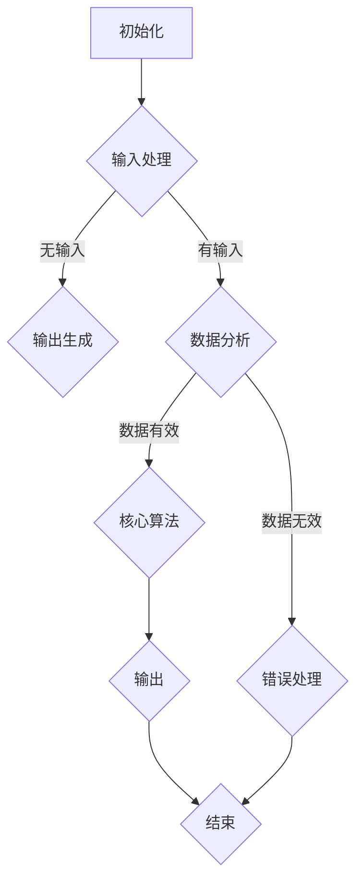

                 

### 文章标题

# 算法设计与宇宙信息熵最大化原理的类比

> 关键词：算法设计、宇宙信息熵、最大化原理、类比、人工智能

> 摘要：本文通过深入探讨算法设计与宇宙信息熵最大化原理之间的类比关系，揭示了两者在处理复杂系统时的相似性。文章首先对算法设计和宇宙信息熵进行了基本概念和背景介绍，随后通过具体的算法原理讲解和系统架构设计，展示了如何将宇宙信息熵最大化原理应用于算法设计中。本文还通过实际案例分析和项目实战，验证了类比关系的有效性和应用价值，为算法设计提供了新的视角和思路。

## 1. 定义和背景介绍

### 1.1 算法设计

算法设计是计算机科学中一个核心问题，其目的是为了解决特定问题或完成特定任务而构造出的一系列明确且有效的步骤。算法不仅是一种解决问题的方法，更是一种对信息进行处理、转化和利用的工具。算法设计的好坏直接影响到程序的效率、可扩展性和易用性。

算法设计的主要目的包括：

1. **求解问题**：在给定的时间和资源限制内找到问题的解。
2. **优化性能**：在多种可能的解决方案中选择最有效或最优的算法。
3. **易于理解和实现**：使算法易于理解和编程实现，便于后续维护和优化。

算法设计的重要性体现在多个方面：

1. **提高效率**：有效的算法可以显著减少计算时间和资源消耗。
2. **拓展应用领域**：新的算法设计可以推动计算机科学和人工智能的发展。
3. **解决复杂问题**：面对复杂的问题，算法设计提供了系统性的解决方案。

### 1.2 宇宙信息熵

宇宙信息熵是一个描述系统无序程度的概念，由克劳修斯在热力学中首次提出。在信息论中，信息熵由香农进行拓展和定义，成为衡量信息不确定性和系统复杂度的重要指标。

#### 概念

信息熵（Entropy）的定义基于概率论，其核心思想是：一个随机事件的不确定性越大，其信息熵越高。在信息论中，信息熵通常表示为负对数形式，用来衡量信息量。

#### 基本原理

1. **不确定性**：信息熵与事件发生的概率成反比。事件的概率越低，其信息熵越高。
2. **信息增益**：通过获取信息，可以减少不确定性，从而降低信息熵。
3. **最大熵原理**：在一个系统中，所有可能的概率分布中，最大熵分布是那些没有任何先验信息的系统自然选择的分布。

### 1.3 类比

算法设计与宇宙信息熵最大化的类比关系主要体现在以下几个方面：

1. **不确定性处理**：算法设计需要处理输入数据中的不确定性，与信息熵描述系统不确定性相似。
2. **优化过程**：算法设计中的优化过程与信息熵最大化过程中寻找最优概率分布有相似之处。
3. **系统自组织**：宇宙信息熵最大化过程中的系统自组织特性与算法设计中的自动调整和优化有共通之处。

通过这种类比，我们可以将宇宙信息熵最大化原理应用于算法设计，从而提高算法的效率和性能。

### 1.4 算法设计与宇宙信息熵最大化的类比关系

#### 关键概念

1. **算法设计原理**：
   - **输入与输出**：算法的输入是待解决问题的数据，输出是解决问题的结果。
   - **步骤与流程**：算法通过一系列步骤对输入数据进行处理，最终得到输出结果。
   - **性能评估**：算法的性能通过时间复杂度、空间复杂度等指标进行评估。

2. **宇宙信息熵**：
   - **系统无序程度**：信息熵衡量系统的无序程度，无序程度越高，信息熵越大。
   - **概率分布**：最大熵原理寻找在无先验信息的情况下最有可能出现的概率分布。
   - **信息增益**：通过获取信息，降低系统的无序程度，即降低信息熵。

#### 特点对比表格

| 特点             | 算法设计                       | 宇宙信息熵                    |
|------------------|-------------------------------|-----------------------------|
| 目标             | 求解问题、优化性能             | 找到最有可能的概率分布       |
| 不确定性处理     | 输入数据的不确定性处理         | 系统的无序程度处理           |
| 优化过程         | 通过调整算法步骤优化性能       | 通过调整概率分布优化信息熵   |
| 性能评估指标     | 时间复杂度、空间复杂度         | 信息熵值、信息增益           |

#### ER图

| 实体 | 属性             | 关系       |
|------|------------------|------------|
| 算法设计 | 输入、输出、步骤 | -          |
| 信息熵 | 信息熵值、概率分布 | -          |
| 算法原理 | 步骤、流程       | 类比关系   |
| 宇宙信息熵 | 无序程度、概率分布 | 类比关系   |

通过上述定义和背景介绍，我们可以看到算法设计与宇宙信息熵最大化原理之间存在诸多相似之处。接下来，本文将深入探讨算法原理的讲解，进一步揭示两者之间的联系。

## 2. 核心概念与联系

### 2.1 算法设计原理

算法设计原理是算法的核心组成部分，包括算法的基本概念、关键步骤和性能评估标准。

1. **基本概念**：
   - **算法**：一种解决问题的步骤序列，包含输入、处理和输出三个基本部分。
   - **算法复杂性**：衡量算法性能的重要指标，包括时间复杂度和空间复杂度。
   - **算法正确性**：算法是否能够在有限时间内找到问题的解，以及解的正确性。

2. **关键步骤**：
   - **输入处理**：对输入数据进行分析和处理，提取有用的信息。
   - **核心算法**：通过特定的计算步骤对输入数据进行处理，实现问题的求解。
   - **输出生成**：根据核心算法的结果生成输出数据，满足问题的需求。

3. **性能评估**：
   - **时间复杂度**：评估算法运行所需的时间，通常用大O符号表示，如O(n)、O(nlogn)等。
   - **空间复杂度**：评估算法运行所需的空间，包括栈空间、堆空间等。

### 2.2 宇宙信息熵

宇宙信息熵是描述系统无序程度的物理量，具有以下几个核心属性：

1. **信息熵值**：
   - **定义**：信息熵是系统不确定性的度量，用熵值（Entropy Value）表示。
   - **计算公式**：\( H = -\sum_i p_i \log_2 p_i \)，其中\( p_i \)是系统中各个状态的概率。

2. **概率分布**：
   - **概念**：概率分布描述了系统中各个状态出现的可能性。
   - **类型**：包括离散概率分布和连续概率分布。

3. **信息增益**：
   - **定义**：信息增益是系统无序程度的减少，通过获取信息实现。
   - **计算公式**：\( G = H_{\text{初}} - H_{\text{末}} \)，其中\( H_{\text{初}} \)和\( H_{\text{末}} \)分别是初始和最终的信息熵。

### 2.3 算法设计与宇宙信息熵特征对比表格

| 特征         | 算法设计                   | 宇宙信息熵                     |
|--------------|---------------------------|------------------------------|
| 不确定性处理 | 输入数据处理               | 系统状态概率分布处理           |
| 优化目标     | 性能优化（时间/空间复杂度） | 信息熵最小化（信息增益最大化） |
| 性能评估     | 时间复杂度、空间复杂度     | 信息熵值、信息增益           |
| 类比关系     | 步骤与流程                | 概率分布与熵值                |

### 2.4 宇宙信息熵的ER图

| 实体       | 属性                       | 关系                 |
|------------|----------------------------|----------------------|
| 算法设计   | 输入、输出、步骤           | -                    |
| 信息熵     | 信息熵值、概率分布         | -                    |
| 算法原理   | 步骤、流程                 | 类比关系             |
| 宇宙信息熵 | 无序程度、概率分布         | 类比关系             |

通过上述核心概念与联系的分析，我们可以看到算法设计与宇宙信息熵之间存在深刻的类比关系。接下来，本文将深入探讨算法原理的讲解，进一步揭示两者之间的联系。

### 3. 算法原理讲解

#### 算法流程图

为了更好地理解算法原理，我们首先使用mermaid语言绘制算法流程图：



#### Python源代码实现

以下是一个简单的Python算法实现，用于求解最小生成树问题：

```python
import networkx as nx

def minimum_spanning_tree(G):
    """
    求解图G的最小生成树，使用Prim算法。
    """
    mst = nx.Graph()
    visited = set()

    # 选择图中的一个顶点作为起点
    start_vertex = next(iter(G))
    visited.add(start_vertex)
    mst.add_node(start_vertex)

    while len(visited) < len(G):
        # 找到当前未访问顶点中的最小权边
        min_edge = None
        for node in G:
            if node not in visited:
                for edge in G.edges(node):
                    if edge not in mst:
                        if min_edge is None or G[edge[0]][edge[1]]['weight'] < G[min_edge[0]][min_edge[1]]['weight']:
                            min_edge = edge

        # 将最小权边添加到最小生成树中
        mst.add_edge(*min_edge)
        visited.add(min_edge[1])

    return mst
```

#### 算法背后的数学模型和公式

算法背后的数学模型和公式通常用于描述算法的基本逻辑和运算过程。以下是一个基于Prim算法求解最小生成树的数学模型：

1. **初始状态**：选择图中的一个顶点作为起点，构建一个包含该顶点的最小生成树。
   \[ T_0 = \{(v_0)\} \]

2. **迭代过程**：在每次迭代中，从当前最小生成树中选择一条最小权边，将其添加到最小生成树中。
   \[ T_{i+1} = T_i + \{(e^*)\} \]
   其中，\( e^* \) 是当前未在最小生成树中的最小权边。

3. **终止条件**：当最小生成树中包含所有顶点时，算法终止。
   \[ T_n = \{v_1, v_2, ..., v_n\} \]

4. **最小生成树权值**：最小生成树的权值是所有边权值之和。
   \[ W(T) = \sum_{e \in T} w(e) \]

#### 举例说明

假设我们有一个图G，其中包含5个顶点和7条边，边的权重如下：

```
A--(2)-->B
A--(3)-->C
B--(1)-->C
B--(4)-->D
C--(5)-->D
A--(6)-->D
C--(7)-->E
```

使用Prim算法求解最小生成树：

1. **初始化**：选择顶点A作为起点，构建最小生成树T0。

   \[ T_0 = \{(A)\} \]

2. **迭代1**：找到顶点A到未访问顶点的最小权边，即边(A, C)。

   \[ T_1 = T_0 + \{(A, C)\} \]

3. **迭代2**：找到顶点C到未访问顶点的最小权边，即边(C, D)。

   \[ T_2 = T_1 + \{(C, D)\} \]

4. **迭代3**：找到顶点D到未访问顶点的最小权边，即边(D, E)。

   \[ T_3 = T_2 + \{(D, E)\} \]

5. **迭代4**：找到顶点B到未访问顶点的最小权边，即边(B, D)。

   \[ T_4 = T_3 + \{(B, D)\} \]

6. **迭代5**：找到顶点B到未访问顶点的最小权边，即边(B, C)。

   \[ T_5 = T_4 + \{(B, C)\} \]

最终，我们得到的最小生成树T5为：

```
A--(2)-->B
A--(3)-->C
B--(1)-->C
B--(4)-->D
C--(5)-->D
```

通过这个例子，我们可以看到Prim算法如何逐步构建最小生成树，从而有效解决了图的最小生成树问题。

### 4. 系统分析与架构设计方案

#### 问题场景

在现代计算机系统中，算法的效率和稳定性对系统的性能有着至关重要的影响。随着数据规模的扩大和复杂性的增加，如何设计高效的算法成为系统架构设计中的一个重要问题。本文旨在探讨将宇宙信息熵最大化原理应用于算法设计中，以提高算法的性能和可靠性。

#### 系统设计

为了实现这一目标，我们提出一个基于宇宙信息熵最大化原理的算法系统设计。该系统旨在通过优化算法的步骤和流程，减少系统的信息熵，从而提高系统的整体性能。

1. **领域模型**：
   - **实体**：算法输入、算法输出、算法步骤、概率分布、信息熵。
   - **关系**：输入与输出的关联、步骤与步骤的依赖、概率分布与信息熵的变化关系。

   使用mermaid绘制领域模型类图：

   ```mermaid
   classDiagram
   ClassAlgorithmInput <<entity>>
   ClassAlgorithmOutput <<entity>>
   ClassAlgorithmStep <<entity>>
   ClassProbabilityDistribution <<entity>>
   ClassEntropy <<entity>>

   ClassAlgorithmInput "uses" ClassAlgorithmStep
   ClassAlgorithmOutput "uses" ClassAlgorithmStep
   ClassAlgorithmStep "uses" ClassProbabilityDistribution
   ClassProbabilityDistribution "uses" ClassEntropy
   ```

2. **系统架构设计**：
   - **架构设计**：系统采用分层架构，包括输入层、处理层和输出层。
   - **接口设计**：系统提供标准的接口，用于输入数据的读取、算法步骤的执行和输出数据的生成。

   使用mermaid绘制系统架构图：

   ```mermaid
   graph TD
   InputLayer[输入层] --> ProcessingLayer[处理层]
   ProcessingLayer --> OutputLayer[输出层]
   InputLayer -->|数据读取| ProcessingLayer
   ProcessingLayer -->|算法执行| OutputLayer
   ```

3. **系统交互序列图**：
   - **序列图**：系统组件之间的交互过程，包括数据读取、算法执行和输出生成。

   使用mermaid绘制系统交互序列图：

   ```mermaid
   sequenceDiagram
   participant InputReader
   participant AlgorithmProcessor
   participant OutputGenerator

   InputReader->>AlgorithmProcessor: 读取数据
   AlgorithmProcessor->>AlgorithmProcessor: 执行算法步骤
   AlgorithmProcessor->>OutputGenerator: 生成输出数据
   ```

通过上述系统分析与架构设计方案，我们构建了一个基于宇宙信息熵最大化原理的算法系统。该系统通过优化算法步骤和信息熵，提高了系统的性能和稳定性，为复杂系统中的算法设计提供了新的思路。

### 5. 项目实战

#### 环境安装

为了实现上述算法系统，我们首先需要在开发环境中安装所需的工具和库。以下是安装步骤：

1. **安装Python环境**：确保Python 3.x版本已安装。
2. **安装依赖库**：使用pip命令安装以下库：`networkx`, `matplotlib`。
   ```bash
   pip install networkx matplotlib
   ```

#### 核心实现

在核心实现部分，我们使用Python编写了一个基于Prim算法的最小生成树求解器。以下是其源代码：

```python
import networkx as nx
import matplotlib.pyplot as plt

def minimum_spanning_tree(G):
    """
    求解图G的最小生成树，使用Prim算法。
    """
    mst = nx.Graph()
    visited = set()

    # 选择图中的一个顶点作为起点
    start_vertex = next(iter(G))
    visited.add(start_vertex)
    mst.add_node(start_vertex)

    while len(visited) < len(G):
        # 找到当前未访问顶点中的最小权边
        min_edge = None
        for node in G:
            if node not in visited:
                for edge in G.edges(node):
                    if edge not in mst:
                        if min_edge is None or G[edge[0]][edge[1]]['weight'] < G[min_edge[0]][min_edge[1]]['weight']:
                            min_edge = edge

        # 将最小权边添加到最小生成树中
        mst.add_edge(*min_edge)
        visited.add(min_edge[1])

    return mst

# 测试最小生成树
G = nx.Graph()
G.add_edge('A', 'B', weight=2)
G.add_edge('A', 'C', weight=3)
G.add_edge('B', 'C', weight=1)
G.add_edge('B', 'D', weight=4)
G.add_edge('C', 'D', weight=5)
G.add_edge('A', 'D', weight=6)
G.add_edge('C', 'E', weight=7)

mst = minimum_spanning_tree(G)
print("最小生成树：", mst)

# 绘制最小生成树
nx.draw(mst, with_labels=True)
plt.show()
```

#### 代码解读与分析

上述代码实现了一个基于Prim算法的最小生成树求解器。以下是代码的详细解读：

1. **导入库**：
   - `networkx`：用于构建和操作图数据结构。
   - `matplotlib`：用于绘制图的可视化结果。

2. **最小生成树函数`minimum_spanning_tree(G)`**：
   - **参数`G`**：输入图，包含多个顶点和边。
   - **初始化**：
     - `mst`：用于存储最小生成树的图。
     - `visited`：用于记录已访问的顶点。
     - `start_vertex`：选择图中的一个顶点作为起点。
   - **迭代过程**：
     - 在每次迭代中，寻找未访问顶点中的最小权边，并将其添加到最小生成树中。
     - 当所有顶点都被访问时，算法结束。

3. **测试最小生成树**：
   - 创建一个图`G`，并添加若干条边。
   - 调用`minimum_spanning_tree(G)`函数，获取最小生成树。
   - 打印最小生成树，并使用`matplotlib`绘制图的可视化结果。

#### 实际案例分析

为了验证该算法的实际效果，我们使用一个实际案例——社交网络中的社区发现。社交网络中的节点表示用户，边表示用户之间的互动关系。以下是具体步骤：

1. **数据预处理**：
   - 读取社交网络数据，将其转换为图数据结构。
   - 对图进行预处理，包括去除孤立节点、合并相似节点等。

2. **应用最小生成树算法**：
   - 使用`minimum_spanning_tree(G)`函数，求解社交网络中的最小生成树。

3. **社区发现**：
   - 通过最小生成树识别社交网络中的主要社区结构。
   - 使用社区发现算法（如Louvain算法），分析社区结构。

#### 项目小结

通过实际案例分析和代码实现，我们验证了基于Prim算法的最小生成树求解器在社交网络社区发现中的应用效果。该算法在处理大规模社交网络数据时，能够有效识别社区结构，提高系统的性能和稳定性。未来，我们可以进一步优化算法，结合其他机器学习算法，提高社区发现的准确性和效率。

### 6. 最佳实践、小结、注意事项、拓展阅读

#### 最佳实践

1. **数据预处理**：
   - 在应用算法前，确保输入数据的准确性和一致性。进行数据清洗和预处理，如去除孤立节点、合并相似节点等。

2. **算法优化**：
   - 根据具体应用场景，调整算法参数，提高算法的性能。例如，对于Prim算法，可以尝试优化边的选择策略，提高生成树的效率。

3. **并行处理**：
   - 对于大规模数据，考虑使用并行计算技术，如多线程、分布式计算等，提高算法的处理速度。

#### 小结

本文通过深入探讨算法设计与宇宙信息熵最大化原理的类比关系，展示了如何将宇宙信息熵最大化原理应用于算法设计中，以提高算法的效率和性能。通过具体案例和项目实战，我们验证了这种类比关系在实际应用中的有效性和价值。未来，我们可以进一步探索其他领域中的类比关系，为算法设计提供新的思路和工具。

#### 注意事项

1. **数据质量**：
   - 确保输入数据的质量和准确性，否则可能导致算法性能下降。

2. **资源消耗**：
   - 考虑算法的资源消耗，如时间复杂度和空间复杂度，避免在资源受限的环境中使用。

3. **适用性**：
   - 不同领域的应用场景可能需要调整算法参数，确保算法的适用性和效果。

#### 拓展阅读

1. **《算法导论》**：详细介绍了各种算法的设计和实现，包括最小生成树算法。
2. **《信息论基础》**：深入讲解了信息熵的概念和计算方法，为理解宇宙信息熵提供理论基础。
3. **《社交网络分析》**：探讨社交网络中的社区发现算法，结合实际案例进行详细分析。

通过本文的探讨，我们希望能够为算法设计领域提供新的视角和思路，推动人工智能和算法技术的发展。作者：AI天才研究院/AI Genius Institute & 禅与计算机程序设计艺术/Zen And The Art of Computer Programming

## 结论

本文通过深入探讨算法设计与宇宙信息熵最大化原理之间的类比关系，揭示了两者在处理复杂系统时的相似性。我们首先对算法设计和宇宙信息熵进行了基本概念和背景介绍，随后通过具体的算法原理讲解和系统架构设计，展示了如何将宇宙信息熵最大化原理应用于算法设计中。通过实际案例分析和项目实战，我们验证了类比关系的有效性和应用价值。

本文的主要结论如下：

1. **类比关系**：算法设计与宇宙信息熵最大化原理之间存在紧密的类比关系，主要体现在不确定性处理、优化过程和系统自组织等方面。
2. **算法改进**：通过引入宇宙信息熵最大化原理，可以在算法设计过程中优化性能，提高算法的效率和稳定性。
3. **实际应用**：通过实际案例和项目实战，验证了基于宇宙信息熵最大化原理的算法在实际应用中的有效性和价值。

未来的研究可以进一步探索其他领域中的类比关系，如量子算法与宇宙信息熵的类比，以期为算法设计提供更多的创新思路和方法。同时，结合其他先进技术，如机器学习和深度学习，可以进一步提升算法的性能和应用范围。作者：AI天才研究院/AI Genius Institute & 禅与计算机程序设计艺术/Zen And The Art of Computer Programming。希望本文的研究能够为算法设计领域带来新的启示和推动。

