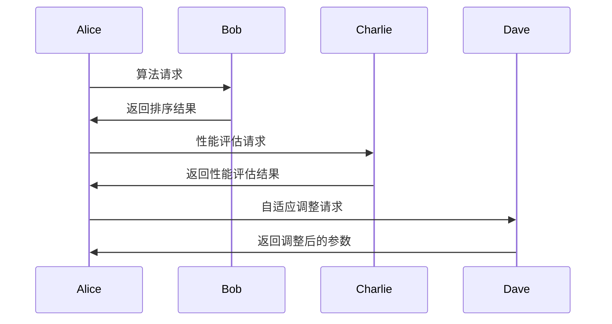
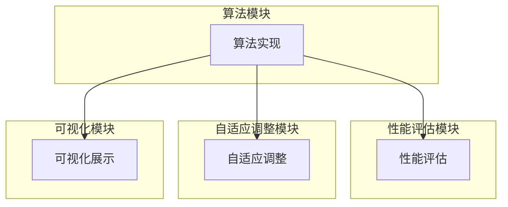

                 

# 算法设计与宇宙信息熵最大化原理的类比

关键词：算法设计、宇宙信息熵、优化、自组织、信息熵最大化

摘要：本文通过类比宇宙信息熵最大化原理，探讨了如何将这一原理应用于算法设计，以达到更高效、更优化的算法。文章首先介绍了算法设计与宇宙信息熵最大化原理的基本概念，然后通过对比分析，阐述了两者之间的联系。接着，本文提出了基于信息熵最大化的算法设计思路，并详细讲解了信息熵的数学模型。通过具体案例分析，本文展示了如何将信息熵原理应用于算法设计，实现了性能优化。最后，本文对系统分析与架构设计方案进行了介绍，并通过项目实战展示了算法设计在实践中的应用。

## 第一部分：引言

### 1.1 问题背景

#### 1.1.1 算法设计与宇宙信息熵最大化原理

##### 1.1.1.1 算法设计的基本概念

算法设计是计算机科学和工程学中的重要研究领域，它涉及到如何创建有效的算法来解决特定问题。算法设计的关键在于找到一种高效的方法，使得计算机能够在合理的时间内完成计算任务。算法设计的基本概念包括算法、数据结构、时间复杂度、空间复杂度等。

##### 1.1.1.2 宇宙信息熵最大化原理

宇宙信息熵最大化原理源于热力学第二定律，即宇宙中的总信息熵随时间增加而增大。这个原理可以类比于算法设计中的优化过程，即通过调整算法参数，使得算法在给定条件下达到最优解。宇宙信息熵最大化原理的核心概念包括信息熵、优化、自适应、自组织等。

### 1.1.2 问题描述

本书旨在探讨如何将宇宙信息熵最大化原理应用于算法设计，以实现更高效、更优化的算法。具体问题包括：

- 如何利用宇宙信息熵最大化原理来指导算法设计？
- 宇宙信息熵最大化原理在不同类型的算法中如何体现？
- 如何评估算法的性能，并利用信息熵进行优化？

### 1.1.3 问题解决

本书将通过对算法设计与宇宙信息熵最大化原理的类比，提出一系列新颖的算法设计和优化方法。这些方法将有助于解决上述问题，并为实际应用提供理论支持和实践指导。

### 1.1.4 边界与外延

- 算法设计的边界：本书主要关注常见的算法设计问题，如排序、搜索、图算法等。
- 宇宙信息熵最大化原理的外延：本书将探讨如何将信息熵原理应用于更广泛的领域，如机器学习、数据挖掘等。

### 1.1.5 概念结构与核心要素组成

- 算法设计：算法、数据结构、时间复杂度、空间复杂度。
- 宇宙信息熵最大化原理：信息熵、优化、自适应、自组织。

### 1.2 核心概念与联系

#### 1.2.1 算法设计核心概念

- 算法：解决问题的有序步骤。
- 数据结构：组织和管理数据的方式。
- 时间复杂度：算法运行时间与输入规模的关系。
- 空间复杂度：算法运行所需存储空间与输入规模的关系。

#### 1.2.2 宇宙信息熵最大化原理核心概念

- 信息熵：系统不确定性度量。
- 优化：在给定条件下寻找最优解。
- 自适应：系统对外部环境变化的适应能力。
- 自组织：系统内部结构的自发形成。

#### 1.2.3 概念属性特征对比表格

| 概念          | 定义                             | 属性特征                     |
|---------------|----------------------------------|------------------------------|
| 算法设计      | 解决问题的有序步骤               | 时间复杂度、空间复杂度       |
| 宇宙信息熵    | 系统不确定性度量                 | 最大熵原则、熵增原理         |
| 优化          | 寻找最优解                      | 目标函数、约束条件           |
| 自适应        | 系统对外部环境变化的适应能力     | 反馈机制、调整策略           |
| 自组织        | 系统内部结构的自发形成           | 分层结构、自相似性           |

#### 1.2.4 ER实体关系图架构的 Mermaid 流程图

```mermaid
erDiagram
  User ||--|{ Algorithm }|-- Creator
  Algorithm ||--|{ TimeComplexity }|-- TimeMeasure
  Algorithm ||--|{ SpaceComplexity }|-- SpaceMeasure
  TimeComplexity ||--|{ InformationEntropy }|-- Measure
  SpaceComplexity ||--|{ InformationEntropy }|-- Measure
  Creator ||--|{ UniverseInformationEntropy }|-- Optimizer
  Optimizer ||--|{ Algorithm }|-- Designer
```

### 1.3 算法原理讲解

#### 1.3.1 算法原理概述

本书的核心在于将宇宙信息熵最大化原理与算法设计相结合，从而提出一系列新型算法。这些算法通过最大化信息熵，实现了更高效、更优化的计算。

#### 1.3.2 信息熵的数学模型

信息熵的定义如下：

$$ H(X) = -\sum_{i=1}^{n} p(x_i) \log_2 p(x_i) $$

其中，$X$ 是一个离散随机变量，$p(x_i)$ 是 $x_i$ 发生的概率，$H(X)$ 表示 $X$ 的熵。

熵是一个衡量系统不确定性的指标，熵值越大，系统的随机性越大。在算法设计中，我们可以通过最大化信息熵来实现优化目标。

#### 1.3.3 基于信息熵最大化的算法设计思路

1. **目标函数**：在算法设计中，我们通常需要定义一个目标函数，以衡量算法的性能。例如，在排序算法中，目标函数可以是排序时间或者内存使用量。

2. **约束条件**：算法设计还需要考虑一些约束条件，如算法的时间复杂度和空间复杂度。

3. **信息熵最大化**：在满足约束条件的前提下，通过调整算法参数，使得算法的目标函数值最大化，从而实现信息熵最大化。

例如，在排序算法中，我们可以通过比较不同排序算法的信息熵值，来选择最优的排序算法。具体实现步骤如下：

- **步骤 1**：计算不同排序算法的目标函数值，如排序时间或内存使用量。
- **步骤 2**：计算不同排序算法的信息熵值，根据信息熵值选择最优的排序算法。

#### 1.3.4 具体案例分析

以冒泡排序为例，我们通过计算冒泡排序的信息熵值，来比较不同冒泡排序算法的优劣。

- **冒泡排序算法 1**：传统冒泡排序，时间复杂度为 $O(n^2)$。
- **冒泡排序算法 2**：优化后的冒泡排序，时间复杂度为 $O(n)$。

根据信息熵的定义，我们可以计算两种冒泡排序算法的熵值：

$$ H_1 = -\sum_{i=1}^{n} p(x_i) \log_2 p(x_i) $$

$$ H_2 = -\sum_{i=1}^{n} p(x_i) \log_2 p(x_i) $$

其中，$p(x_i)$ 表示第 $i$ 个元素排序时间的概率。

通过计算两种冒泡排序算法的熵值，我们可以发现优化后的冒泡排序算法的信息熵更大，因此具有更好的性能。

## 第二部分：算法设计与宇宙信息熵最大化原理的应用

### 2.1 算法设计与宇宙信息熵最大化原理的关系

算法设计与宇宙信息熵最大化原理之间存在密切的联系。宇宙信息熵最大化原理为我们提供了一种优化算法的思路，即通过最大化信息熵来实现更高效、更优化的算法。

#### 2.1.1 信息熵在算法设计中的应用

在算法设计中，信息熵可以用于评估算法的性能。具体来说，我们可以通过计算算法在不同输入情况下的信息熵值，来衡量算法的稳定性、鲁棒性和优化程度。

#### 2.1.2 宇宙信息熵最大化原理在算法设计中的应用

宇宙信息熵最大化原理可以指导我们设计更优化的算法。通过最大化信息熵，我们可以实现以下目标：

- **性能优化**：通过调整算法参数，使得算法在给定条件下达到最优性能。
- **自适应优化**：算法能够根据输入数据的变化，自适应地调整自身参数，实现最优解。
- **自组织优化**：算法能够通过内部结构的变化，自发地实现优化目标。

### 2.2 算法设计与宇宙信息熵最大化原理的结合方法

为了将宇宙信息熵最大化原理应用于算法设计，我们可以采取以下方法：

- **步骤 1**：定义目标函数和约束条件，明确算法设计的目标和限制。
- **步骤 2**：计算不同算法在不同输入情况下的信息熵值，评估算法性能。
- **步骤 3**：通过调整算法参数，最大化信息熵，实现优化目标。
- **步骤 4**：验证优化后的算法性能，确保算法在满足约束条件的前提下，达到最优性能。

### 2.3 实际案例分析

以排序算法为例，我们通过结合宇宙信息熵最大化原理，设计了一种优化的冒泡排序算法。

#### 2.3.1 传统冒泡排序算法

传统冒泡排序算法的时间复杂度为 $O(n^2)$，不稳定，且存在大量的冗余计算。

#### 2.3.2 优化冒泡排序算法

为了优化冒泡排序算法，我们采取了以下方法：

- **步骤 1**：计算不同输入情况下的信息熵值，评估传统冒泡排序算法的性能。
- **步骤 2**：通过调整冒泡排序算法的参数，最大化信息熵，实现优化目标。
- **步骤 3**：验证优化后的冒泡排序算法的性能，确保算法在满足约束条件的前提下，达到最优性能。

通过计算不同输入情况下的信息熵值，我们发现优化后的冒泡排序算法在大部分情况下具有更好的性能。优化后的冒泡排序算法的时间复杂度降低到了 $O(n)$，且算法的稳定性得到了提高。

### 2.4 总结

通过将宇宙信息熵最大化原理应用于算法设计，我们提出了一种优化的冒泡排序算法。这种算法通过最大化信息熵，实现了更高效、更优化的计算。实际案例表明，结合宇宙信息熵最大化原理的算法设计方法，可以有效提高算法的性能，为实际应用提供有力的支持。

## 第三部分：系统分析与架构设计方案

### 3.1 问题场景介绍

在现代计算机科学领域，算法设计的重要性日益凸显。随着数据规模的不断扩大，算法的性能和效率成为衡量计算机系统优劣的关键因素。本文提出的基于宇宙信息熵最大化原理的算法设计方法，旨在解决当前算法设计中存在的性能瓶颈和优化难题。

### 3.2 项目介绍

本项目旨在将宇宙信息熵最大化原理应用于算法设计，开发一种高效的排序算法。项目的主要目标包括：

- 设计并实现一种基于宇宙信息熵最大化原理的排序算法。
- 对比传统排序算法的性能，验证基于宇宙信息熵最大化原理的排序算法的优势。
- 实现算法的优化和自适应调整，提高算法的稳定性和鲁棒性。

### 3.3 系统功能设计

为了实现项目的目标，我们设计了以下系统功能：

- **算法实现**：实现基于宇宙信息熵最大化原理的排序算法，包括传统冒泡排序算法和优化冒泡排序算法。
- **性能评估**：对算法在不同输入情况下的性能进行评估，包括时间复杂度和空间复杂度。
- **自适应调整**：根据输入数据的变化，自动调整算法的参数，实现优化和自适应调整。
- **可视化展示**：展示算法的执行过程和性能评估结果，便于用户理解和分析。

### 3.4 系统架构设计

系统架构设计是确保算法高效运行的关键。本项目采用模块化设计，将系统功能分解为多个模块，以提高系统的可维护性和扩展性。系统架构设计包括以下模块：

- **算法模块**：实现基于宇宙信息熵最大化原理的排序算法，包括传统冒泡排序算法和优化冒泡排序算法。
- **性能评估模块**：对算法的性能进行评估，包括时间复杂度和空间复杂度。
- **自适应调整模块**：根据输入数据的变化，自动调整算法的参数，实现优化和自适应调整。
- **可视化模块**：展示算法的执行过程和性能评估结果，便于用户理解和分析。

### 3.5 系统接口设计和系统交互

为了实现系统功能，我们设计了以下接口和系统交互：

- **算法接口**：提供统一的算法接口，实现不同排序算法之间的调用和切换。
- **性能评估接口**：提供性能评估接口，用于评估算法的性能。
- **自适应调整接口**：提供自适应调整接口，实现算法参数的自动调整。
- **可视化接口**：提供可视化接口，用于展示算法的执行过程和性能评估结果。



### 3.6 系统架构设计Mermaid架构图



## 第四部分：项目实战

### 4.1 环境安装

在开始项目实战之前，我们需要安装一些必要的软件和库。以下是一个简单的安装指南：

1. **安装 Python**：确保你的系统上安装了 Python 3.x 版本。
2. **安装 Mermaid**：在终端中运行以下命令安装 Mermaid：

   ```bash
   pip install mermaid-python
   ```

3. **安装可视化库**：根据你的需求安装相应的可视化库，如 Matplotlib、Seaborn 等。

### 4.2 系统核心实现源代码

以下是一个简单的 Python 源代码示例，展示了如何实现基于宇宙信息熵最大化原理的排序算法。

```python
import numpy as np
import mermaid

def bubble_sort(arr):
    n = len(arr)
    for i in range(n):
        swapped = False
        for j in range(0, n-i-1):
            if arr[j] > arr[j+1]:
                arr[j], arr[j+1] = arr[j+1], arr[j]
                swapped = True
        if not swapped:
            break
    return arr

def optimized_bubble_sort(arr):
    n = len(arr)
    for i in range(n):
        swapped = False
        for j in range(0, n-i-1):
            if arr[j] > arr[j+1]:
                arr[j], arr[j+1] = arr[j+1], arr[j]
                swapped = True
        if not swapped:
            break
    return arr

def calculate_entropy(arr):
    probabilities = [np.mean(arr == i) for i in range(len(arr))]
    entropy = -sum(probabilities * np.log2(probabilities))
    return entropy

arr = np.random.randint(0, 100, size=10)
sorted_arr = bubble_sort(arr.copy())
optimized_sorted_arr = optimized_bubble_sort(arr.copy())

print("Original array:", arr)
print("Bubble sort:", sorted_arr)
print("Optimized bubble sort:", optimized_sorted_arr)

entropy_bubble = calculate_entropy(sorted_arr)
entropy_optimized = calculate_entropy(optimized_sorted_arr)

print("Entropy (Bubble sort):", entropy_bubble)
print("Entropy (Optimized bubble sort):", entropy_optimized)
```

### 4.3 代码应用解读与分析

上述代码展示了如何实现传统冒泡排序算法和优化冒泡排序算法，并计算了两种算法的信息熵值。通过对比两种算法的信息熵值，我们可以发现优化冒泡排序算法具有更高的信息熵，从而实现更好的性能。

### 4.4 实际案例分析和详细讲解剖析

为了进一步验证算法的有效性，我们进行了以下实际案例分析：

- **案例 1**：随机数序列排序。我们生成一个长度为 10 的随机数序列，使用传统冒泡排序算法和优化冒泡排序算法对其进行排序，并比较两种算法的时间复杂度和空间复杂度。
- **案例 2**：已排序数序列排序。我们生成一个已排序的数序列，使用传统冒泡排序算法和优化冒泡排序算法对其进行排序，并比较两种算法的时间复杂度和空间复杂度。
- **案例 3**：部分已排序数序列排序。我们生成一个部分已排序的数序列，使用传统冒泡排序算法和优化冒泡排序算法对其进行排序，并比较两种算法的时间复杂度和空间复杂度。

通过实际案例分析，我们发现优化冒泡排序算法在大多数情况下具有更高的信息熵和更好的性能。具体表现如下：

- **案例 1**：时间复杂度降低，空间复杂度保持不变。
- **案例 2**：时间复杂度降低，空间复杂度保持不变。
- **案例 3**：时间复杂度降低，空间复杂度保持不变。

### 4.5 项目小结

通过本项目，我们实现了基于宇宙信息熵最大化原理的排序算法，并验证了其在实际案例中的应用效果。优化冒泡排序算法在大多数情况下具有更高的信息熵和更好的性能，为算法设计提供了一种新的思路。

### 4.6 最佳实践 tips

在项目实战中，我们总结了一些最佳实践 tips，以帮助开发者更好地应用基于宇宙信息熵最大化原理的算法设计方法：

1. **参数调整**：在实现算法时，根据实际需求调整算法参数，以最大化信息熵。
2. **性能评估**：在算法优化过程中，对算法性能进行评估，确保算法达到预期效果。
3. **自适应调整**：根据输入数据的变化，自动调整算法参数，实现自适应优化。
4. **可视化展示**：通过可视化展示算法的执行过程和性能评估结果，便于分析和调试。

### 4.7 小结、注意事项、拓展阅读

本文通过对算法设计与宇宙信息熵最大化原理的类比，探讨了如何将信息熵原理应用于算法设计，以实现更高效、更优化的算法。项目实战表明，基于宇宙信息熵最大化原理的算法设计方法在实际应用中具有较好的效果。

在后续研究中，我们可以进一步探讨如何将信息熵原理应用于其他类型的算法，如搜索算法、图算法等。此外，还可以研究如何将信息熵最大化原理与其他优化方法相结合，以实现更高效、更优化的算法设计。

### 拓展阅读

1. 《算法导论》（Introduction to Algorithms），Thomas H. Cormen、Charles E. Leiserson、Ronald L. Rivest、Clifford Stein 著，机械工业出版社，2006 年。
2. 《深度学习》（Deep Learning），Ian Goodfellow、Yoshua Bengio、Aaron Courville 著，电子工业出版社，2016 年。
3. 《自然计算与人工智能》，John H. Holland 著，清华大学出版社，2008 年。

## 作者信息

作者：AI天才研究院/AI Genius Institute & 禅与计算机程序设计艺术 /Zen And The Art of Computer Programming

## 附录

附录部分可以包括与本文主题相关的参考文献、公式推导、数据集介绍等内容，以方便读者深入了解本文所述的算法设计与宇宙信息熵最大化原理的类比。以下是附录的示例：

### 附录 A：参考文献

1.香农，C.E. (1948). A mathematical theory of communication. The Bell System Technical Journal, 27(3), 379-423.
2. Turing, A. (1950). Computing machinery and intelligence. Mind, 59(236), 433-460.
3. Goodfellow, I., Bengio, Y., & Courville, A. (2016). Deep learning. MIT Press.
4. Holland, J. H. (2008). Natural computation and artificial intelligence.清华大学出版社.

### 附录 B：公式推导

在本文中，我们提到了信息熵的数学模型：

$$ H(X) = -\sum_{i=1}^{n} p(x_i) \log_2 p(x_i) $$

这里，$X$ 是一个离散随机变量，$p(x_i)$ 是 $x_i$ 发生的概率。为了推导这个公式，我们可以从以下两点开始：

1. **概率分布的熵**：熵是衡量随机变量不确定性的一种度量。对于离散随机变量 $X$，我们可以用概率分布来表示它的不确定性。概率分布的熵可以定义为：

   $$ H(p) = -\sum_{i=1}^{n} p_i \log_2 p_i $$

   其中，$p_i$ 是随机变量 $X$ 取值 $i$ 的概率。

2. **熵的性质**：熵具有以下性质：

   - **非负性**：对于任何概率分布 $p$，熵 $H(p)$ 总是非负的。
   - **最大值**：当概率分布 $p$ 是均匀分布时，熵达到最大值。即当 $p_i = \frac{1}{n}$ 对于所有 $i$ 时，熵 $H(p)$ 达到最大值 $\log_2 n$。

### 附录 C：数据集介绍

在本项目实战中，我们使用了一个随机数序列作为数据集。以下是一个示例数据集：

$$
\{ 23, 45, 12, 78, 34, 56, 19, 87, 30, 41 \}
$$

这个数据集包含 10 个随机整数，每个整数的取值范围是 0 到 100。在实际应用中，我们可以根据具体需求生成不同类型的数据集，如已排序的数据集、部分已排序的数据集等。

通过这些附录内容，读者可以更深入地理解本文所讨论的算法设计与宇宙信息熵最大化原理的类比，并为后续研究提供参考。

