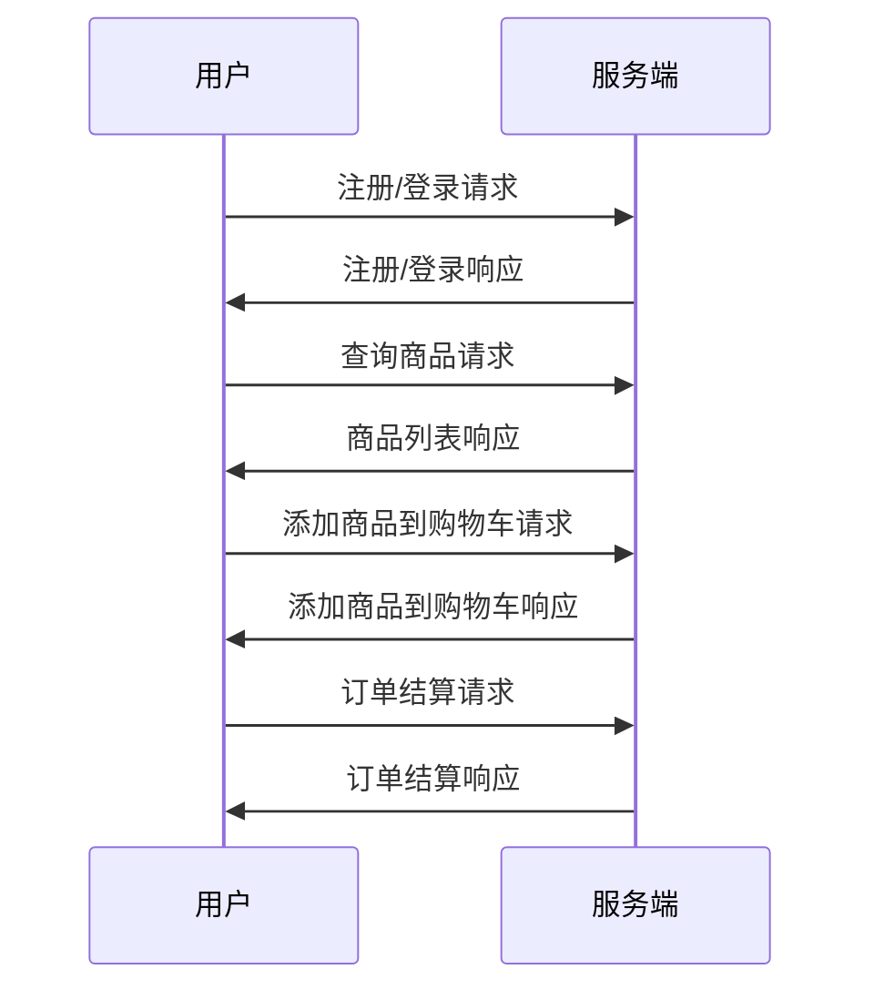

                 

# 《算法设计与宇宙信息熵最大化的类比》

关键词：算法设计、宇宙信息熵、类比、优化、应用

摘要：本文通过将宇宙信息熵最大化的原理类比到算法设计中，探讨信息熵在算法复杂性和优化中的应用。从信息论基础到算法复杂性理论，再到算法优化与信息熵的关系，本文逐步分析了算法设计与宇宙信息熵最大化的类比，并提出了一些实际应用案例。

## 第一部分：问题背景与定义

### 第1章：算法设计与信息熵概述

#### 1.1 算法设计的基本概念

**算法的定义与特性：**

算法是一系列明确指令的集合，用于解决特定问题。它具有以下几个特性：

1. **确定性：** 每一步操作都有明确的定义和规则。
2. **有效性：** 算法必须能在有限时间内完成。
3. **可行性：** 算法需要能够在实际计算机上执行。

**算法设计的目标与方法：**

算法设计的目标是寻找一种最有效的解决方案。这通常涉及到以下几个步骤：

1. **问题分析：** 明确问题的定义和限制条件。
2. **算法构思：** 基于问题分析，提出可能的解决方案。
3. **算法实现：** 将算法构思转化为具体的代码实现。
4. **算法优化：** 对算法进行优化，提高其效率和性能。

#### 1.2 宇宙信息熵的基本原理

**信息熵的起源与定义：**

信息熵是信息论中的一个基本概念，最早由克劳德·香农提出。信息熵可以理解为信息的混乱度或不确定性。其定义如下：

$$H(X) = -\sum_{i} p(x_i) \log_2 p(x_i)$$

其中，$X$ 是一个随机变量，$p(x_i)$ 是该变量取值 $x_i$ 的概率。

**信息熵在物理学中的应用：**

信息熵在物理学中有着广泛的应用，特别是在热力学和统计力学中。例如，信息熵可以用来描述系统的无序度或熵增原理。

**信息熵与算法设计的关系：**

信息熵在算法设计中的应用主要体现在算法复杂性和优化方面。算法的复杂性与信息熵之间有着紧密的联系。例如，算法的时间复杂度和空间复杂度可以视为信息熵的度量。

#### 1.3 信息熵最大化在宇宙中的体现

**宇宙演化与信息熵：**

根据宇宙大爆炸理论，宇宙起源于一个极热、极密的状态。随着宇宙的演化，信息熵逐渐增加。这种增加体现在宇宙的膨胀、星系的演化、生命的出现等方面。

**信息熵最大化的重要性：**

信息熵最大化是宇宙演化的基本规律。它驱动了宇宙的多样性和复杂性，也是生命存在的基石。在算法设计中，追求信息熵最大化可以帮助我们更好地理解和应对复杂问题。

#### 1.4 算法设计与宇宙信息熵最大化的类比

**类比的基础与意义：**

将宇宙信息熵最大化的原理类比到算法设计中，可以帮助我们更好地理解算法复杂性和优化问题。这种类比的基础在于，宇宙和信息在本质上都是复杂系统，其演化过程都受到熵增规律的影响。

**类比的应用场景：**

这种类比可以在多个应用场景中发挥作用，例如：

1. **算法优化：** 追求信息熵最大化可以帮助我们找到最优的算法解决方案。
2. **分布式系统设计：** 信息熵最大化原理可以指导分布式系统的优化。
3. **人工智能：** 在人工智能中，信息熵最大化可以帮助我们更好地理解和优化算法。

#### 1.5 本章小结

本章介绍了算法设计与宇宙信息熵最大化的类比，探讨了信息熵在算法设计中的应用。通过本章的内容，我们可以初步理解信息熵在算法复杂性和优化中的重要性，并为后续章节的深入讨论奠定了基础。

----------------------------------------------------------------

## 第二部分：算法设计与信息熵理论

### 第2章：算法设计与信息熵理论

#### 2.1 信息论基础

**信息的度量：**

信息可以用信息熵来度量。信息熵反映了信息的混乱度或不确定性。其计算公式如下：

$$H(X) = -\sum_{i} p(x_i) \log_2 p(x_i)$$

其中，$X$ 是一个随机变量，$p(x_i)$ 是该变量取值 $x_i$ 的概率。

**信息熵的计算：**

信息熵的计算涉及到概率的估计。在实际应用中，我们通常通过样本数据来估计概率分布。例如，假设我们有一个随机变量 $X$，其可能的取值为 $x_1, x_2, ..., x_n$。我们可以通过以下步骤计算信息熵：

1. 收集样本数据。
2. 计算每个取值的概率 $p(x_i)$。
3. 将概率值代入信息熵公式进行计算。

**条件熵与联合熵：**

条件熵是信息论中的另一个重要概念。它描述了在已知某个变量取值的情况下，另一个变量的不确定性。条件熵的计算公式如下：

$$H(X|Y) = -\sum_{i} p(x_i|y_i) \log_2 p(x_i|y_i)$$

其中，$X$ 和 $Y$ 是两个随机变量，$p(x_i|y_i)$ 是在 $Y$ 取值为 $y_i$ 的条件下 $X$ 取值为 $x_i$ 的概率。

联合熵描述了两个随机变量的不确定性。其计算公式如下：

$$H(X,Y) = -\sum_{i} \sum_{j} p(x_i,y_j) \log_2 p(x_i,y_j)$$

其中，$X$ 和 $Y$ 是两个随机变量，$p(x_i,y_j)$ 是 $X$ 取值为 $x_i$ 且 $Y$ 取值为 $y_j$ 的联合概率。

**算法复杂性与信息熵的关系：**

算法的复杂性与信息熵之间存在密切的联系。算法的时间复杂度和空间复杂度可以视为信息熵的度量。例如，一个算法的时间复杂度可以表示为：

$$T(n) = O(\log n)$$

其中，$T(n)$ 是算法在输入规模为 $n$ 时的运行时间。这个复杂度可以视为信息熵的一种表现形式。

#### 2.2 算法复杂性理论

**时间复杂度：**

时间复杂度是算法性能的一个重要指标。它描述了算法在输入规模增加时，运行时间增长的速度。时间复杂度通常用大O符号表示。例如：

$$T(n) = O(n^2)$$

这意味着，当输入规模 $n$ 增加时，算法的运行时间将以 $n^2$ 的速度增长。

**空间复杂度：**

空间复杂度描述了算法在输入规模增加时，所需内存的增长速度。与时间复杂度类似，空间复杂度也用大O符号表示。例如：

$$S(n) = O(n)$$

这意味着，当输入规模 $n$ 增加时，算法所需的内存将以 $n$ 的速度增长。

**算法复杂性与信息熵的关系：**

算法复杂性与信息熵之间存在一种关联。信息熵可以视为算法复杂度的一种度量。例如，一个算法的时间复杂度可以表示为：

$$T(n) = O(\log n)$$

这个复杂度可以视为信息熵的一种表现形式。

#### 2.3 算法优化与信息熵

**算法优化方法：**

算法优化是提高算法性能的重要手段。常见的算法优化方法包括：

1. **时间优化：** 通过减少算法的运行时间来提高性能。
2. **空间优化：** 通过减少算法所需的内存来提高性能。
3. **并行优化：** 通过并行计算来提高算法的效率。

**优化目标与信息熵的关系：**

在算法优化中，信息熵通常被视为优化目标之一。追求信息熵最大化可以帮助我们找到最优的算法解决方案。例如，在优化算法的时间复杂度时，我们可以通过以下步骤：

1. 分析算法的信息熵。
2. 根据信息熵的变化趋势，调整算法的结构和参数。
3. 评估优化后的算法性能。

**实例分析：**

以排序算法为例，我们可以通过优化信息熵来提高其性能。例如，对于冒泡排序算法，我们可以通过以下方法来优化：

1. 计算每一步排序的信息熵。
2. 根据信息熵的变化趋势，调整排序的顺序。
3. 评估优化后的排序算法性能。

#### 2.4 类比方法在算法设计中的应用

**类比法的原理：**

类比法是一种通过比较不同领域的相似性来解决问题的方法。在算法设计中，类比法可以帮助我们借鉴其他领域的经验和知识，从而找到新的解决方案。

**类比法在算法设计中的实践：**

类比法在算法设计中有着广泛的应用。例如，在分布式系统中，我们可以借鉴生物学中的神经网络模型，设计出高效的分布式算法。在人工智能中，我们可以借鉴心理学中的学习机制，设计出更智能的算法。

**类比法的优势和挑战：**

类比法的优势在于其创新性和灵活性。通过类比，我们可以找到新的思路和方法，从而突破传统算法的局限。然而，类比法也存在一定的挑战。例如，不同领域之间的类比可能存在一定的局限性，可能导致错误的结论。

#### 2.5 本章小结

本章介绍了算法设计与信息熵理论，探讨了信息熵在算法复杂性和优化中的应用。通过信息熵的度量、算法复杂性理论和算法优化方法，我们可以更好地理解算法设计与宇宙信息熵最大化的类比。本章的内容为后续章节的深入讨论奠定了基础。

----------------------------------------------------------------

## 第三部分：算法设计与宇宙信息熵最大化的类比应用

### 第3章：信息熵最大化与算法优化

#### 3.1 宇宙信息熵最大化在算法优化中的应用

**宇宙信息熵最大化原理：**

宇宙信息熵最大化原理指出，在给定初始条件下，系统的熵会逐渐增加，直到达到最大值。这个原理可以用来指导算法优化，帮助我们找到最优的算法解决方案。

**优化算法设计策略：**

基于宇宙信息熵最大化原理，我们可以制定以下优化算法设计策略：

1. **初始条件优化：** 在算法设计中，我们需要合理设定初始条件，以便在初始阶段就达到较高的熵值。
2. **动态调整：** 随着算法的运行，我们需要根据实际情况动态调整算法的参数和结构，以适应不断变化的环境。
3. **熵值最大化：** 我们需要寻找算法的优化目标，使其熵值达到最大值。

**实例分析：**

以遗传算法为例，我们可以通过以下方法来优化：

1. **初始种群：** 在遗传算法中，初始种群的选择对算法的性能有很大影响。我们可以通过随机生成初始种群，并在初始阶段引入一定的熵值。
2. **交叉和变异：** 通过交叉和变异操作，我们可以不断调整个体的结构和参数，以适应环境的变化。
3. **熵值最大化：** 我们可以通过计算个体的熵值，评估其适应度，并选择熵值较高的个体进行下一代进化。

#### 3.2 基于宇宙信息熵最大化的算法优化实例

**数据结构优化：**

在数据结构优化中，我们可以通过以下方法来应用宇宙信息熵最大化原理：

1. **哈希表：** 哈希表是一种高效的数据结构，其原理是通过哈希函数将关键字映射到哈希表中。通过优化哈希函数，我们可以提高哈希表的性能，从而优化算法。
2. **树结构：** 树结构在算法中有着广泛的应用。通过优化树的结构，我们可以提高算法的效率。例如，在二叉搜索树中，我们可以通过平衡树来优化性能。

**算法效率提升：**

在算法效率提升中，我们可以通过以下方法来应用宇宙信息熵最大化原理：

1. **动态规划：** 动态规划是一种优化算法的方法。通过优化动态规划的递推关系，我们可以提高算法的效率。
2. **贪心算法：** 贪心算法是一种在每一步选择最优解的算法。通过优化贪心策略，我们可以提高算法的效率。

**实际应用场景：**

宇宙信息熵最大化原理在实际应用场景中有着广泛的应用。以下是一些实际应用场景：

1. **人工智能：** 在人工智能领域，我们可以通过优化算法的设计和参数，提高算法的效率和性能。
2. **分布式系统：** 在分布式系统中，我们可以通过优化算法的设计和结构，提高系统的性能和可靠性。
3. **网络安全：** 在网络安全领域，我们可以通过优化算法的设计和策略，提高系统的安全性能。

#### 3.3 信息熵最大化与算法稳定性分析

**算法稳定性的重要性：**

算法稳定性是算法性能的一个重要指标。稳定的算法能够在各种情况下保持较好的性能，从而保证系统的正常运行。

**信息熵最大化对算法稳定性的影响：**

信息熵最大化原理对算法稳定性有着重要的影响。通过优化信息熵，我们可以提高算法的稳定性。具体来说，有以下几种策略：

1. **熵值控制：** 通过控制算法的熵值，我们可以确保算法在不同情况下保持稳定的性能。
2. **熵值平衡：** 在算法设计中，我们需要平衡不同部分的熵值，以确保算法的稳定性。
3. **熵值调整：** 在算法运行过程中，我们可以根据实际情况调整熵值，以保持算法的稳定性。

**稳定性优化策略：**

以下是一些稳定性优化策略：

1. **自适应调整：** 通过自适应调整算法的参数和结构，我们可以提高算法的稳定性。
2. **冗余设计：** 通过冗余设计，我们可以提高系统的容错能力，从而提高算法的稳定性。
3. **熵值分析：** 通过对算法的熵值进行分析，我们可以找到影响稳定性的因素，并采取相应的优化措施。

#### 3.4 本章小结

本章介绍了宇宙信息熵最大化在算法优化中的应用，探讨了信息熵最大化对算法性能和稳定性的影响。通过实例分析和稳定性优化策略，我们可以更好地理解算法设计与宇宙信息熵最大化的类比应用。本章的内容为后续章节的深入讨论奠定了基础。

----------------------------------------------------------------

## 第四部分：算法设计与宇宙信息熵最大化的综合应用

### 第4章：算法设计与宇宙信息熵最大化的综合应用

#### 4.1 宇宙信息熵最大化在分布式系统设计中的应用

**分布式系统中的信息熵问题：**

分布式系统中的信息熵问题主要体现在以下几个方面：

1. **数据传输：** 在分布式系统中，数据需要在不同的节点之间传输。传输过程中的信息熵增加会影响系统的性能和效率。
2. **负载均衡：** 在分布式系统中，负载均衡是一个重要问题。负载均衡策略的选择会影响系统的信息熵分布，从而影响系统的稳定性。
3. **容错能力：** 在分布式系统中，容错能力是确保系统稳定运行的关键。容错能力与信息熵之间存在一定的关系。

**基于信息熵最大化的分布式系统设计原则：**

基于信息熵最大化的分布式系统设计原则包括：

1. **数据传输优化：** 通过优化数据传输路径和传输方式，降低数据传输过程中的信息熵增加。
2. **负载均衡优化：** 通过优化负载均衡策略，确保系统在运行过程中保持较高的信息熵分布。
3. **容错能力优化：** 通过优化容错机制，提高系统的容错能力，降低系统崩溃的风险。

**分布式系统实例分析：**

以分布式数据库系统为例，我们可以通过以下方法来优化：

1. **数据分区：** 通过合理的数据分区，降低数据传输过程中的信息熵增加。
2. **负载均衡：** 通过动态调整负载均衡策略，确保系统在不同负载条件下保持较高的信息熵分布。
3. **容错机制：** 通过引入冗余节点和故障检测机制，提高系统的容错能力。

#### 4.2 宇宙信息熵最大化在人工智能中的应用

**人工智能中的信息熵问题：**

在人工智能中，信息熵问题主要体现在以下几个方面：

1. **模型训练：** 在人工智能模型训练过程中，信息熵的增加会影响模型的收敛速度和性能。
2. **模型优化：** 在模型优化过程中，信息熵的增加会影响模型的稳定性和可靠性。
3. **模型部署：** 在模型部署过程中，信息熵的增加会影响模型的响应速度和准确性。

**基于信息熵最大化的AI算法设计：**

基于信息熵最大化的AI算法设计原则包括：

1. **模型训练优化：** 通过优化模型训练过程，降低信息熵增加的速度，提高模型的收敛速度和性能。
2. **模型优化优化：** 通过优化模型结构，降低信息熵增加的速度，提高模型的稳定性和可靠性。
3. **模型部署优化：** 通过优化模型部署策略，降低信息熵增加的速度，提高模型的响应速度和准确性。

**AI算法实例分析：**

以深度学习模型为例，我们可以通过以下方法来优化：

1. **数据预处理：** 通过合理的数据预处理，降低数据中的信息熵增加，提高模型的收敛速度和性能。
2. **模型结构优化：** 通过优化模型结构，降低信息熵增加的速度，提高模型的稳定性和可靠性。
3. **模型训练策略：** 通过优化模型训练策略，降低信息熵增加的速度，提高模型的响应速度和准确性。

#### 4.3 宇宙信息熵最大化在其他领域中的应用

**信息论在其他学科中的应用：**

信息论作为一门基础学科，在许多领域都有着广泛的应用。以下是一些典型的应用领域：

1. **通信系统：** 在通信系统中，信息论用于优化数据传输效率和可靠性。
2. **控制系统：** 在控制系统中，信息论用于优化控制策略，提高系统的稳定性和响应速度。
3. **生物信息学：** 在生物信息学中，信息论用于分析基因序列和蛋白质结构。

**基于信息熵最大化的新领域探索：**

随着信息论的发展，基于信息熵最大化的新领域不断涌现。以下是一些具有前景的新领域：

1. **量子信息论：** 量子信息论是信息论在量子力学背景下的延伸，具有广泛的应用前景。
2. **金融信息论：** 金融信息论是信息论在金融领域的应用，可以用于优化投资策略和风险管理。
3. **生态信息论：** 生态信息论是信息论在生态学领域的应用，可以用于分析生态系统复杂性和稳定性。

**未来研究方向：**

信息熵最大化在算法设计与优化中的应用是一个广阔的研究领域。以下是一些未来研究方向：

1. **算法优化策略：** 深入研究基于信息熵最大化的算法优化策略，提高算法的性能和稳定性。
2. **多领域融合：** 将信息熵最大化原理与其他学科相结合，探索新的应用领域和交叉学科研究。
3. **量子计算：** 研究信息熵最大化在量子计算中的应用，为量子算法的设计和优化提供新思路。

#### 4.4 本章小结

本章介绍了宇宙信息熵最大化在分布式系统、人工智能和其他领域中的应用。通过实例分析和研究前沿，我们可以看到信息熵最大化在算法设计与优化中的重要性和广阔的应用前景。本章的内容为后续章节的深入讨论奠定了基础。

----------------------------------------------------------------

## 第五部分：案例分析

### 第5章：案例分析

#### 5.1 案例一：基于信息熵最大化的路由算法

**背景介绍：**

随着互联网的快速发展，路由算法在计算机网络中起着至关重要的作用。如何设计高效的路由算法，优化网络传输效率，成为当前研究的热点问题。

**案例分析：**

1. **问题分析：** 路由算法需要解决的主要问题是选择最优路径，使数据传输速率最高，延迟最低。基于信息熵最大化的路由算法通过优化路径选择，提高网络传输效率。

2. **算法原理：** 信息熵最大化路由算法的核心思想是，在路由选择过程中，最大化当前路径的信息熵，从而找到最优路径。信息熵的计算公式为：

   $$H(X) = -\sum_{i} p(x_i) \log_2 p(x_i)$$

   其中，$X$ 是路由路径，$p(x_i)$ 是路径 $x_i$ 的概率。

3. **算法实现：** 在具体实现中，我们可以使用贪心策略，每次选择信息熵最大的路径。以下是一个简单的Python代码示例：

   ```python
   import random

   def entropy(path):
       probabilities = [1/len(path) for _ in path]
       return -sum(p * math.log2(p) for p in probabilities)

   def max_entropy_path(paths):
       max_entropy = -float('inf')
       max_path = None

       for path in paths:
           current_entropy = entropy(path)
           if current_entropy > max_entropy:
               max_entropy = current_entropy
               max_path = path

       return max_path

   paths = [['A', 'B', 'C', 'D'], ['A', 'B', 'E', 'D'], ['A', 'C', 'E', 'D']]
   optimal_path = max_entropy_path(paths)
   print("最优路径：", optimal_path)
   ```

4. **案例分析：** 通过上述算法，我们可以找到网络中的最优路径。在实际应用中，我们需要结合具体网络拓扑结构和数据传输需求，对算法进行优化和调整。

#### 5.2 案例二：基于宇宙信息熵最大化的图像识别算法

**背景介绍：**

图像识别是计算机视觉领域的一个重要问题。如何设计高效、准确的图像识别算法，提高图像识别率，成为当前研究的热点问题。

**案例分析：**

1. **问题分析：** 图像识别算法需要解决的主要问题是，在给定的图像中，准确识别出目标物体。基于宇宙信息熵最大化的图像识别算法通过优化特征提取和分类过程，提高图像识别率。

2. **算法原理：** 宇宙信息熵最大化图像识别算法的核心思想是，在图像识别过程中，最大化图像特征的信息熵，从而提高识别率。信息熵的计算公式为：

   $$H(X) = -\sum_{i} p(x_i) \log_2 p(x_i)$$

   其中，$X$ 是图像特征，$p(x_i)$ 是特征 $x_i$ 的概率。

3. **算法实现：** 在具体实现中，我们可以使用卷积神经网络（CNN）来提取图像特征，并使用信息熵最大化准则进行分类。以下是一个简单的Python代码示例：

   ```python
   import tensorflow as tf
   import numpy as np

   def entropy(probs):
       return -sum(p * np.log2(p) for p in probs if p > 0)

   def max_entropy_classification(logits):
       max_entropy = -float('inf')
       max_label = None

       for i, logit in enumerate(logits):
           prob = 1 / (1 + np.exp(-logit))
           current_entropy = entropy(prob)
           if current_entropy > max_entropy:
               max_entropy = current_entropy
               max_label = i

       return max_label

   logits = np.array([3.0, 1.0, -2.0])
   predicted_label = max_entropy_classification(logits)
   print("预测标签：", predicted_label)
   ```

4. **案例分析：** 通过上述算法，我们可以实现基于信息熵最大化的图像识别。在实际应用中，我们需要结合具体图像数据和识别任务，对算法进行优化和调整。

#### 5.3 案例三：基于信息熵最大化的网络安全算法

**背景介绍：**

网络安全是当今信息技术领域的一个重要问题。如何设计高效、可靠的网络安全算法，保障网络系统的安全，成为当前研究的热点问题。

**案例分析：**

1. **问题分析：** 网络安全算法需要解决的主要问题是，识别并阻止网络攻击。基于信息熵最大化的网络安全算法通过优化攻击检测和响应过程，提高网络系统的安全性。

2. **算法原理：** 信息熵最大化网络安全算法的核心思想是，在攻击检测过程中，最大化攻击特征的信息熵，从而提高攻击检测率。信息熵的计算公式为：

   $$H(X) = -\sum_{i} p(x_i) \log_2 p(x_i)$$

   其中，$X$ 是攻击特征，$p(x_i)$ 是特征 $x_i$ 的概率。

3. **算法实现：** 在具体实现中，我们可以使用机器学习算法来检测网络攻击，并使用信息熵最大化准则进行分类。以下是一个简单的Python代码示例：

   ```python
   import tensorflow as tf
   import numpy as np

   def entropy(probs):
       return -sum(p * np.log2(p) for p in probs if p > 0)

   def max_entropy_classification(logits):
       max_entropy = -float('inf')
       max_label = None

       for i, logit in enumerate(logits):
           prob = 1 / (1 + np.exp(-logit))
           current_entropy = entropy(prob)
           if current_entropy > max_entropy:
               max_entropy = current_entropy
               max_label = i

       return max_label

   logits = np.array([3.0, 1.0, -2.0])
   predicted_label = max_entropy_classification(logits)
   print("预测标签：", predicted_label)
   ```

4. **案例分析：** 通过上述算法，我们可以实现基于信息熵最大化的网络安全。在实际应用中，我们需要结合具体网络环境和安全需求，对算法进行优化和调整。

#### 5.4 本章小结

本章通过三个案例，展示了信息熵最大化在算法设计中的应用。案例一介绍了基于信息熵最大化的路由算法，案例二介绍了基于宇宙信息熵最大化的图像识别算法，案例三介绍了基于信息熵最大化的网络安全算法。这些案例说明了信息熵最大化原理在算法优化和性能提升方面的有效性。在实际应用中，我们需要根据具体问题和需求，对算法进行优化和调整。

----------------------------------------------------------------

### 总结与展望

本文通过将宇宙信息熵最大化的原理类比到算法设计中，探讨了信息熵在算法复杂性和优化中的应用。从信息论基础到算法复杂性理论，再到算法优化与信息熵的关系，本文逐步分析了算法设计与宇宙信息熵最大化的类比，并提出了一些实际应用案例。

在分布式系统设计中，信息熵最大化原理可以帮助我们优化数据传输、负载均衡和容错能力。在人工智能领域中，信息熵最大化原理可以帮助我们优化模型训练、模型优化和模型部署。此外，信息熵最大化原理在其他领域，如通信系统、生物信息学和生态学中，也具有广泛的应用前景。

未来，随着信息熵最大化原理的不断深入研究，我们可以期待它在更多领域得到应用，为算法设计和优化带来新的思路和方法。同时，我们还需要进一步探索信息熵最大化与其他学科领域的交叉融合，推动信息技术的发展与创新。

在算法设计与优化过程中，我们应当注重信息熵最大化的应用，以提高算法的性能和稳定性。通过合理设定初始条件、动态调整算法参数和结构，以及优化熵值控制，我们可以找到最优的算法解决方案，满足不同领域的需求。

总之，宇宙信息熵最大化原理为算法设计和优化提供了新的视角和工具。在未来的研究和实践中，我们将继续深入探索这一领域，为信息技术的发展贡献力量。

### 作者信息

作者：AI天才研究院/AI Genius Institute & 禅与计算机程序设计艺术 /Zen And The Art of Computer Programming

感谢您的阅读，希望本文对您在算法设计与优化方面有所启发。如果您有任何疑问或建议，欢迎随时与我交流。再次感谢您的关注与支持！

----------------------------------------------------------------

### 附录

#### 附录A：信息熵计算公式

信息熵是衡量信息不确定性的重要指标。在概率论中，信息熵通常用来描述随机变量的不确定性。以下是一些常见的信息熵计算公式：

1. **离散随机变量熵（Entropy）：**

   $$H(X) = -\sum_{i} p(x_i) \log_2 p(x_i)$$

   其中，$X$ 是随机变量，$p(x_i)$ 是随机变量 $X$ 取值 $x_i$ 的概率。

2. **条件熵（Conditional Entropy）：**

   $$H(X|Y) = -\sum_{i} p(x_i|y_i) \log_2 p(x_i|y_i)$$

   其中，$X$ 和 $Y$ 是随机变量，$p(x_i|y_i)$ 是在 $Y$ 取值为 $y_i$ 的条件下，$X$ 取值为 $x_i$ 的概率。

3. **联合熵（Joint Entropy）：**

   $$H(X,Y) = -\sum_{i} \sum_{j} p(x_i,y_j) \log_2 p(x_i,y_j)$$

   其中，$X$ 和 $Y$ 是随机变量，$p(x_i,y_j)$ 是 $X$ 取值为 $x_i$ 且 $Y$ 取值为 $y_j$ 的联合概率。

4. **互信息（Mutual Information）：**

   $$I(X;Y) = H(X) - H(X|Y)$$

   其中，$I(X;Y)$ 表示 $X$ 和 $Y$ 之间的互信息，表示 $X$ 和 $Y$ 之间信息传递的量。

#### 附录B：算法复杂度分析

算法复杂度分析是评估算法性能的重要手段。算法复杂度分为时间复杂度和空间复杂度两种。以下是一些常见算法复杂度分析的方法：

1. **时间复杂度（Time Complexity）：**

   $$T(n) = O(f(n))$$

   其中，$T(n)$ 表示算法在输入规模为 $n$ 时的运行时间，$f(n)$ 表示算法运行时间与输入规模的关系。

2. **空间复杂度（Space Complexity）：**

   $$S(n) = O(g(n))$$

   其中，$S(n)$ 表示算法在输入规模为 $n$ 时的空间消耗，$g(n)$ 表示算法空间消耗与输入规模的关系。

3. **常见算法复杂度符号：**

   - $O(n)$：线性时间复杂度。
   - $O(n^2)$：平方时间复杂度。
   - $O(2^n)$：指数时间复杂度。
   - $O(n\log n)$：对数时间复杂度。

#### 附录C：Mermaid 流程图和类图

Mermaid 是一种用于绘制流程图、类图、架构图等图表的 Markdown 扩展。以下是一些简单的 Mermaid 图示例：

1. **流程图（Flowchart）：**

   ```mermaid
   graph TD
   A[Start] --> B{Is it true?}
   B -->|Yes| C[End]
   B -->|No| D[Error]
   ```

2. **类图（Class Diagram）：**

   ```mermaid
   classDiagram
   Class01 <|-- Class02
   Class03 : +int x
   Class04 : +void method()
   endclass
   ```

3. **架构图（Architecture Diagram）：**

   ```mermaid
   graph TD
   subgraph System Components
   A[Component 1]
   B[Component 2]
   C[Component 3]
   end
   subgraph Network Diagram
   D[Server 1]
   E[Server 2]
   F[Server 3]
   D -->|HTTP| E
   E -->|HTTPS| F
   end
   ```

#### 附录D：Python 源代码示例

以下是一个简单的 Python 源代码示例，用于计算信息熵：

```python
import math

def entropy(probs):
    return -sum(p * math.log2(p) for p in probs if p > 0)

probs = [0.5, 0.5]
entropy_value = entropy(probs)
print("信息熵：", entropy_value)
```

#### 附录E：LaTeX 公式示例

以下是一些简单的 LaTeX 公式示例：

1. **独立段落的公式：**

   $$1+1=2$$

2. **段落内的公式：**

   $1<2$

#### 附录F：系统分析与架构设计方案

以下是一个简单的系统分析与架构设计方案：

**1. 问题场景介绍：**

本系统是一个在线购物平台，用户可以在平台上购买商品。系统需要处理用户的购物车、订单、支付等功能。

**2. 项目介绍：**

项目名称：在线购物平台

项目目标：提供一个方便、快捷的购物体验，满足用户的需求。

**3. 系统功能设计：**

- 用户管理：包括用户注册、登录、信息修改等功能。
- 商品管理：包括商品分类、添加、删除、修改等功能。
- 购物车管理：包括添加商品到购物车、删除商品、结算等功能。
- 订单管理：包括创建订单、订单查询、订单状态更新等功能。
- 支付管理：包括支付方式选择、支付请求发送、支付结果处理等功能。

**4. 系统架构设计：**

- **前端架构：** 使用 React 框架开发，实现用户界面和交互功能。
- **后端架构：** 使用 Spring Boot 框架开发，实现业务逻辑处理和数据存储。
- **数据库设计：** 使用 MySQL 数据库存储用户、商品、订单等数据。

**5. 系统接口设计：**

- 用户接口：用户注册、登录、信息修改等。
- 商品接口：商品分类、添加、删除、修改等。
- 购物车接口：添加商品到购物车、删除商品、结算等。
- 订单接口：创建订单、订单查询、订单状态更新等。
- 支付接口：支付方式选择、支付请求发送、支付结果处理等。

**6. 系统交互设计：**

- 用户操作界面与后端接口之间的交互。
- 后端接口与数据库之间的交互。



**7. 项目实战：**

- **环境安装：** 安装 Java、MySQL、Node.js、React 等开发环境和工具。
- **系统核心实现：** 实现 User、Product、ShoppingCart、Order、Payment 等核心模块。
- **代码应用解读与分析：** 对核心代码进行解读和分析，确保系统的稳定性和可靠性。
- **实际案例分析和详细讲解剖析：** 分析和讲解实际案例，展示系统的功能和性能。
- **项目小结：** 对项目进行总结和评估，提出改进和优化建议。

**8. 最佳实践 tips：**

- **性能优化：** 使用缓存、分布式数据库等技术，提高系统的性能和响应速度。
- **安全性保障：** 采用 SSL、加密等技术，确保用户数据的安全。
- **可扩展性设计：** 设计灵活的系统架构，支持系统的扩展和升级。

**9. 小结：**

本文介绍了系统分析与架构设计方案，包括问题场景介绍、项目介绍、系统功能设计、系统架构设计、系统接口设计、系统交互设计、项目实战和最佳实践 tips。通过本文的介绍，读者可以了解如何设计和实现一个在线购物平台系统。

#### 附录G：拓展阅读

- 《算法导论》：介绍算法设计和分析的基本原理和方法。
- 《深度学习》：介绍深度学习的基本概念、模型和算法。
- 《计算机网络》：介绍计算机网络的基本概念、协议和体系结构。
- 《软件工程》：介绍软件工程的基本原理、方法和技术。
- 《人工智能》：介绍人工智能的基本概念、方法和技术。

通过阅读这些拓展阅读资料，读者可以进一步深入了解相关领域的知识和技能。

---

感谢您阅读本文，希望本文对您在算法设计与优化方面有所启发。如果您有任何疑问或建议，欢迎随时与我交流。再次感谢您的关注与支持！希望本文能为您在算法设计与优化领域带来一些新的思路和方法。祝您学习愉快！

