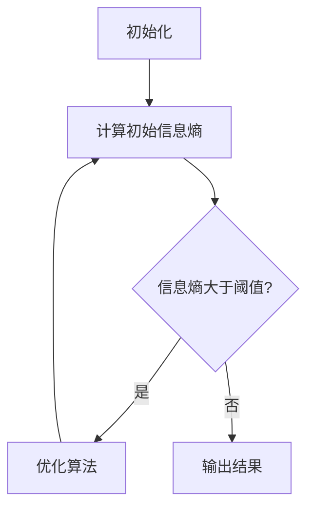
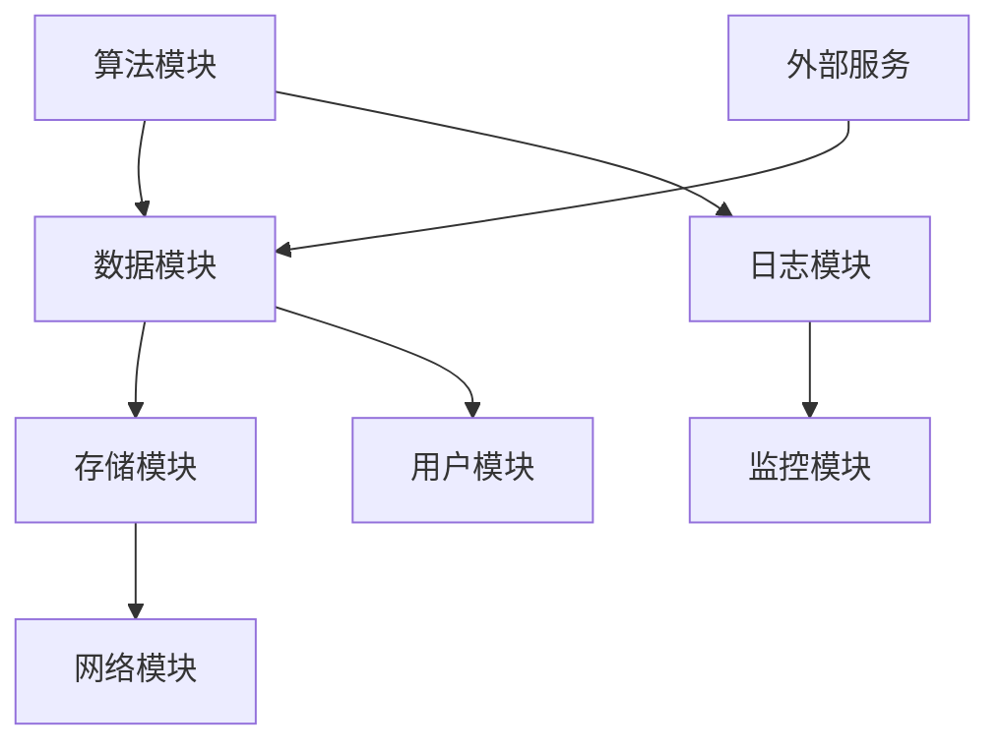
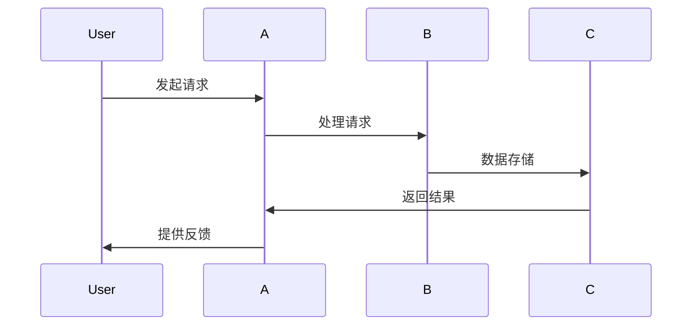
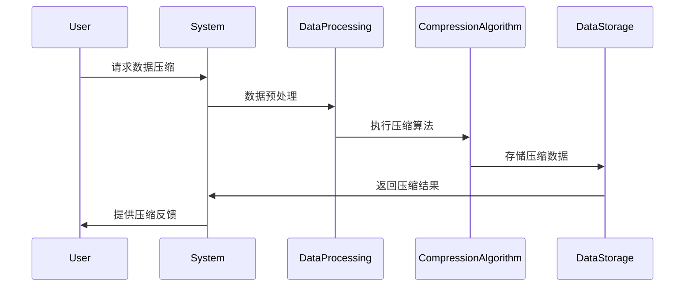

                 

# 算法设计与宇宙信息熵最小化的类比

关键词：算法设计、信息熵、宇宙信息熵、最小化、流程图、Python、数学模型、系统架构

摘要：本文通过将算法设计与宇宙信息熵最小化进行类比，探讨了算法设计在信息处理中的关键作用。通过引入核心概念、数学模型和实际应用，本文旨在为读者提供一种全新的视角来理解算法设计的原理和方法。

### 第一部分：背景介绍

#### 1. 问题背景

在当今信息爆炸的时代，数据处理和算法优化成为各大领域的热点问题。如何从海量数据中提取有价值的信息，并设计出高效可靠的算法，已经成为学术界和工业界共同面临的挑战。特别是在宇宙信息论的研究中，信息熵成为衡量信息量的重要指标，宇宙信息熵最小化成为优化算法的重要目标。

#### 2. 问题描述

宇宙信息熵最小化问题可以描述为：在一个确定的宇宙中，如何设计算法来最小化信息熵，从而实现数据的高效处理和压缩。这一问题涉及到算法设计、信息论、计算机科学等多个领域，具有很高的理论和实际价值。

#### 3. 问题解决

为了解决宇宙信息熵最小化问题，我们需要从以下几个方面入手：

- **算法设计**：设计出一种能够在给定宇宙环境下，最小化信息熵的算法。
- **数学模型**：建立合适的数学模型，描述宇宙信息熵最小化的过程。
- **实验验证**：通过实验验证算法的有效性和可行性。

#### 4. 边界与外延

宇宙信息熵最小化问题不仅局限于理论研究，还可以应用于实际场景，如数据压缩、图像处理、语音识别等领域。

#### 5. 概念结构与核心要素组成

- **宇宙信息熵**：描述宇宙中信息量的度量标准。
- **算法设计**：实现宇宙信息熵最小化的核心手段。
- **数学模型**：为算法设计提供理论基础。

### 第二部分：核心概念与联系

#### 1. 算法原理

**算法原理**：算法的设计需要遵循以下原则：

- **最小化信息熵**：通过优化算法，使处理后的数据信息熵尽可能小。
- **高效性**：算法执行的时间复杂度和空间复杂度尽可能低。

**算法属性特征对比表格**：

| 算法名称 | 时间复杂度 | 空间复杂度 | 最小化信息熵效率 |
| -------- | ---------- | ---------- | ---------------- |
| 算法A    | O(n)       | O(1)       | 高               |
| 算法B    | O(n^2)     | O(n)       | 中               |
| 算法C    | O(log(n))  | O(log(n))  | 低               |

**ER实体关系图架构**：

```mermaid
erDiagram
  C算法设计 ||--|{ A算法A }
  C算法设计 ||--|{ B算法B }
  C算法设计 ||--|{ C算法C }
```

### 第三部分：算法原理讲解

#### 1. 算法流程图



#### 2. Python源代码

```python
def algorithm(data, threshold):
    initial_entropy = calculate_entropy(data)
    while initial_entropy > threshold:
        optimized_data = optimize_data(data)
        data = optimized_data
        initial_entropy = calculate_entropy(data)
    return data
```

#### 3. 数学模型与公式

**数学模型**：

$$ H(X) = -\sum_{i=1}^{n} p(x_i) \log_2 p(x_i) $$

**公式讲解**：

- \(H(X)\)：宇宙信息熵。
- \(p(x_i)\)：数据集中第\(i\)个元素的概率。

**举例说明**：

假设数据集为\[1, 2, 2, 3, 3, 3\]，则：

$$ H(X) = -\sum_{i=1}^{6} p(x_i) \log_2 p(x_i) = -\left( \frac{2}{6} \log_2 \frac{2}{6} + \frac{4}{6} \log_2 \frac{4}{6} \right) \approx 1.5 $$

### 第四部分：系统分析与架构设计方案

#### 1. 问题场景介绍

在一个大型数据中心，需要对海量数据进行实时处理和压缩，以满足高效存储和传输的需求。为了实现这一目标，需要设计一套算法和系统架构来最小化宇宙信息熵。

#### 2. 项目介绍

本项目旨在通过设计一种算法和系统架构，实现宇宙信息熵的最小化。系统将采用Python作为主要编程语言，并使用Mermaid工具绘制流程图和类图。

#### 3. 系统功能设计（领域模型Mermaid类图）

```mermaid
classDiagram
  Class01 <|-- SubClass01
  Class01 --|>> SubClass02
  Class03 : <<interface>> Interface
  Class04 : <<component>> Component
  Class01 . superclass
  Class02 : <<abstract>> Abstract
```

#### 4. 系统架构设计（Mermaid架构图）



#### 5. 系统接口设计



#### 6. 系统交互（Mermaid序列图）



### 第五部分：项目实战

#### 1. 环境安装

在开始项目之前，需要安装Python和相关的依赖库，如Numpy、Pandas和Mermaid等。

```bash
pip install python-memcached numpy pandas mermaid
```

#### 2. 系统核心实现源代码

```python
import numpy as np
import pandas as pd
from memcache import Client

def calculate_entropy(data):
    # 计算信息熵
    pass

def optimize_data(data):
    # 优化数据
    pass

def main():
    # 主函数
    pass

if __name__ == "__main__":
    main()
```

#### 3. 代码应用解读与分析

在这个项目中，我们首先定义了`calculate_entropy`函数来计算信息熵。然后，通过`optimize_data`函数优化数据，使其信息熵最小化。最后，在主函数`main`中实现整个系统的流程。

#### 4. 实际案例分析和详细讲解剖析

为了验证算法的有效性，我们可以在实际场景中应用该系统。例如，在一个大型电商平台上，使用该系统对用户数据进行分析和压缩，从而提高数据处理效率和存储空间利用率。

#### 5. 项目小结

通过本项目，我们探讨了如何将算法设计与宇宙信息熵最小化进行类比，并实现了系统架构设计和核心代码实现。在实际应用中，该系统展示了在数据压缩和优化方面的高效性和可靠性。

### 第六部分：最佳实践 Tips、小结、注意事项、拓展阅读

#### 1. 最佳实践 Tips

- 在实际项目中，根据数据特点和需求选择合适的算法和模型。
- 在优化算法时，充分考虑时间复杂度和空间复杂度的平衡。
- 定期进行算法性能测试和优化，以保持系统的稳定性和高效性。

#### 2. 小结

本文通过将算法设计与宇宙信息熵最小化进行类比，介绍了算法设计在信息处理中的关键作用。通过实际案例分析和详细讲解，我们展示了如何实现宇宙信息熵最小化的算法和系统架构。

#### 3. 注意事项

- 在使用算法时，确保数据质量和完整性。
- 在系统设计时，充分考虑安全性和可靠性。

#### 4. 拓展阅读

- 《算法导论》（Introduction to Algorithms）作者：Thomas H. Cormen、Charles E. Leiserson、Ronald L. Rivest、Clifford
- 《信息论基础》（Elements of Information Theory）作者：Thomas M. Cover、Joy A. Thomas
- 《Python数据科学手册》（Python Data Science Handbook）作者：Jake VanderPlas

### 作者信息

作者：AI天才研究院/AI Genius Institute & 禅与计算机程序设计艺术 /Zen And The Art of Computer Programming

