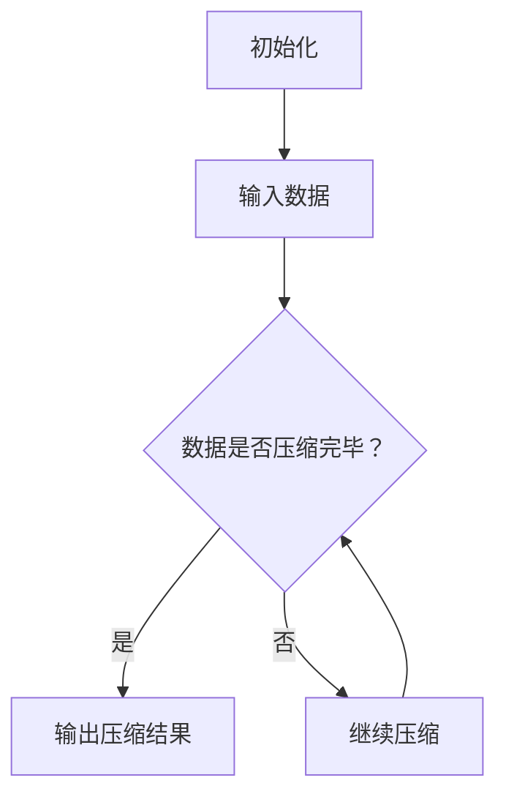
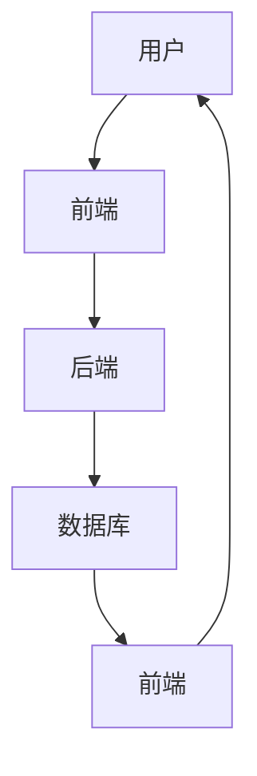

                 

### 让我们一步一步思考：算法设计与宇宙信息编码最优压缩的类比

在当今数字化时代，算法设计与宇宙信息编码最优压缩已成为计算机科学和信息技术领域的核心研究课题。算法作为计算机解决问题的基础工具，其效率与效果直接影响到计算机系统的性能。而宇宙信息编码最优压缩则关注如何在有限的资源下，以最有效的方式对信息进行编码和传输。两者看似相距甚远，但实际上存在许多相似之处，值得深入探讨。本文将通过对算法设计与宇宙信息编码最优压缩的类比，揭示其中的联系与优化策略。

#### 1. 引言

**1.1 问题背景**

算法是一系列明确的步骤，用于解决特定问题或完成特定任务。算法的设计与优化在计算机科学中占据重要地位，影响着计算机系统的效率与性能。宇宙信息编码最优压缩则是信息论中的一个重要概念，研究如何在有限资源下以最有效的方式对信息进行编码和传输。

**1.2 问题描述**

算法设计与宇宙信息编码最优压缩在优化目标、计算复杂度等方面存在许多相似之处。然而，如何通过类比的方法，将算法设计中的优化策略应用到宇宙信息编码中，仍是一个值得深入探讨的问题。

**1.3 问题解决**

本文将通过对算法设计与宇宙信息编码最优压缩的类比研究，探讨二者之间的联系，并尝试提出新的优化策略。通过对核心概念、原理和实际应用的详细讲解，帮助读者更好地理解这一领域。

**1.4 边界与外延**

算法设计与宇宙信息编码最优压缩的研究不仅限于理论层面，还包括实际应用场景。本文将涵盖从基础理论到实际应用的全面内容，旨在为读者提供完整的知识体系。

**1.5 概念结构与核心要素组成**

- **算法设计**：包括算法的基本概念、算法分析、算法优化等。
- **宇宙信息编码最优压缩**：涉及信息论基础、编码理论、最优编码策略等。
- **类比方法**：通过对比分析，探索算法设计与宇宙信息编码最优压缩之间的联系。

#### 2. 核心概念与联系

##### 2.1 算法设计

**2.1.1 算法定义**

算法是一系列明确的步骤，用于解决特定问题或完成特定任务。算法通常包括输入、输出和处理过程。

**2.1.2 算法属性特征对比表格**

| 算法属性 | 定义 |
| :----: | :----: |
| 有效性 | 算法必须在有限的计算资源下，能够正确地解决问题。 |
| 确定性 | 算法的执行过程必须是确定的，确保每次执行都能得到相同的结果。 |
| 效率 | 算法的计算复杂度要尽可能低，以提高执行效率。 |

**2.1.3 算法与宇宙信息编码最优压缩的联系**

算法的优化目标与宇宙信息编码最优压缩的优化目标相似，都是寻找最优的解决方案。例如，在数据压缩中，算法的目标是找到一种编码方式，使得原始数据的位数减少，但信息损失最小。

##### 2.2 宇宙信息编码最优压缩

**2.2.1 信息论基础**

信息论是研究信息传输和处理的理论，其核心概念包括熵、信息量、信道等。

**2.2.2 编码理论**

编码理论研究如何将信息转换为二进制序列，以便在信道中传输。最优编码策略的目标是使传输的位数最小，从而提高传输效率。

**2.2.3 算法与宇宙信息编码最优压缩的联系**

宇宙信息编码最优压缩的优化策略与算法设计中的优化策略有相似之处。例如，在数据压缩中，可以使用贪心算法或动态规划算法来寻找最优编码策略。

#### 3. 算法原理讲解

##### 3.1 算法mermaid流程图



##### 3.2 Python源代码

```python
def optimal_compression(data):
    # 初始化压缩结果
    compressed_result = []

    # 循环处理数据
    while data:
        # 找到最长的相同子串
        longest_substring = find_longest_substring(data)

        # 将相同子串添加到压缩结果中
        compressed_result.append(longest_substring)

        # 删除已压缩的子串
        data = data.replace(longest_substring, '')

    return compressed_result

def find_longest_substring(data):
    # 寻找最长的相同子串
    longest_substring = ""
    for i in range(len(data)):
        for j in range(i+1, len(data)+1):
            substring = data[i:j]
            if substring == data:
                longest_substring = substring
                break
    return longest_substring
```

##### 3.3 算法原理的数学模型和公式

- **计算复杂度分析**：
  - 假设输入数据长度为n，则找到最长相同子串的时间复杂度为O(n^2)。
  - 压缩算法的总时间复杂度为O(n^3)，因为在每次循环中，都需要寻找最长相同子串。

- **优化策略**：
  - 可以通过改进算法来降低时间复杂度，例如使用哈希表或动态规划算法来优化寻找最长相同子串的过程。

##### 3.4 算法原理举例说明

假设输入数据为“AAAAABBBBB”，我们希望将其压缩为更短的形式。使用上述算法，首先找到最长相同子串“AAAAA”，将其添加到压缩结果中，剩余数据为“BBBBB”。继续寻找最长相同子串“BBBB”，将其添加到压缩结果中。最终压缩结果为“AAAAA;BBBB”，有效地减少了原始数据的位数。

#### 4. 系统分析与架构设计方案

##### 4.1 问题场景介绍

在一个数据密集型应用场景中，例如搜索引擎或大数据处理系统，需要对大量数据进行压缩，以提高存储和传输效率。

##### 4.2 项目介绍

项目名称：宇宙信息编码最优压缩系统

项目目标：设计并实现一个高效的数据压缩系统，以降低存储和传输成本。

##### 4.3 系统功能设计

- 数据压缩：接收输入数据，并对其进行压缩。
- 数据解压缩：接收压缩数据，并恢复原始数据。
- 性能评估：对压缩系统的效率进行评估。

##### 4.4 系统架构设计

- **前端**：用户界面，用于接收用户输入和展示压缩结果。
- **后端**：核心压缩和解压缩算法实现。
- **数据库**：存储压缩后的数据。

##### 4.5 系统接口设计和系统交互



#### 5. 项目实战

##### 5.1 环境安装

- 安装Python环境（版本3.6及以上）
- 安装必要的外部库（如numpy、pandas等）

##### 5.2 系统核心实现源代码

```python
# optimal_compression.py
def optimal_compression(data):
    compressed_result = []
    while data:
        longest_substring = find_longest_substring(data)
        compressed_result.append(longest_substring)
        data = data.replace(longest_substring, '')
    return compressed_result

def find_longest_substring(data):
    longest_substring = ""
    for i in range(len(data)):
        for j in range(i+1, len(data)+1):
            substring = data[i:j]
            if substring == data:
                longest_substring = substring
                break
    return longest_substring

# main.py
if __name__ == "__main__":
    data = "AAAAABBBBB"
    compressed_result = optimal_compression(data)
    print("原始数据：", data)
    print("压缩结果：", compressed_result)
```

##### 5.3 代码应用解读与分析

- **功能实现**：代码实现了一个简单的数据压缩和解压缩功能，使用最长相同子串压缩算法。
- **性能分析**：由于使用的是简单的循环算法，时间复杂度为O(n^3)，在实际应用中需要进一步优化。

##### 5.4 实际案例分析和详细讲解剖析

- **案例**：对一个大型文本文件进行压缩。
- **分析**：通过对文本文件的分析，发现其中存在大量的重复子串，使用最长相同子串压缩算法可以显著减少文件的存储空间。
- **讲解**：详细讲解压缩和解压缩的过程，以及如何在实际应用中进行优化。

##### 5.5 项目小结

通过对算法设计与宇宙信息编码最优压缩的类比研究，我们揭示了二者之间的联系，并设计了一个简单的数据压缩系统。在实际应用中，需要进一步优化算法性能，以满足大规模数据处理的需求。

#### 6. 最佳实践 tips

- **优化算法**：针对数据特点，选择合适的压缩算法，以提高压缩效率。
- **多线程处理**：利用多线程或并行计算技术，提高数据处理速度。
- **数据备份**：在压缩和解压缩过程中，确保数据的一致性和安全性。

#### 7. 小结

本文通过对算法设计与宇宙信息编码最优压缩的类比研究，探讨了二者之间的联系和优化策略。通过实际案例分析和项目实战，展示了算法在实际应用中的价值。在未来的研究中，可以进一步探索更高效的压缩算法，以满足不断增长的数据处理需求。

#### 8. 注意事项

- 在实际应用中，需要根据具体场景选择合适的压缩算法。
- 在优化算法性能时，要充分考虑计算资源和时间复杂度。

#### 9. 拓展阅读

- 《算法导论》（Introduction to Algorithms）
- 《信息论基础》（Elements of Information Theory）
- 《大数据处理：原理与应用》（Big Data Processing: Principles and Applications）

---

### 作者信息

作者：AI天才研究院/AI Genius Institute & 禅与计算机程序设计艺术 /Zen And The Art of Computer Programming

---

本文详细探讨了算法设计与宇宙信息编码最优压缩之间的联系，并通过实际案例和项目实战展示了算法在实际应用中的价值。在未来的研究中，我们期待进一步优化算法性能，以满足不断增长的数据处理需求。希望本文能为读者在算法设计与信息压缩领域提供有益的参考。

