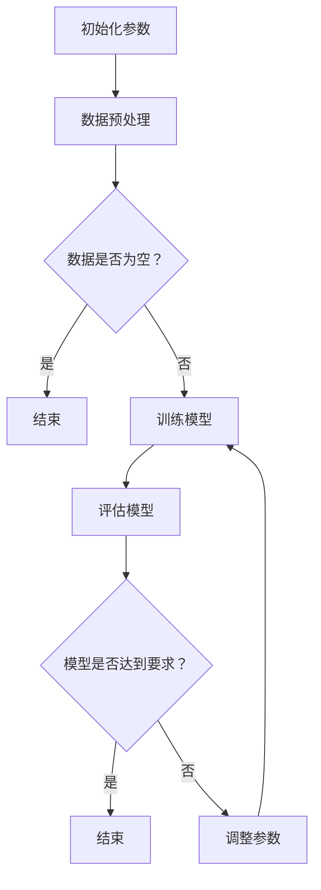
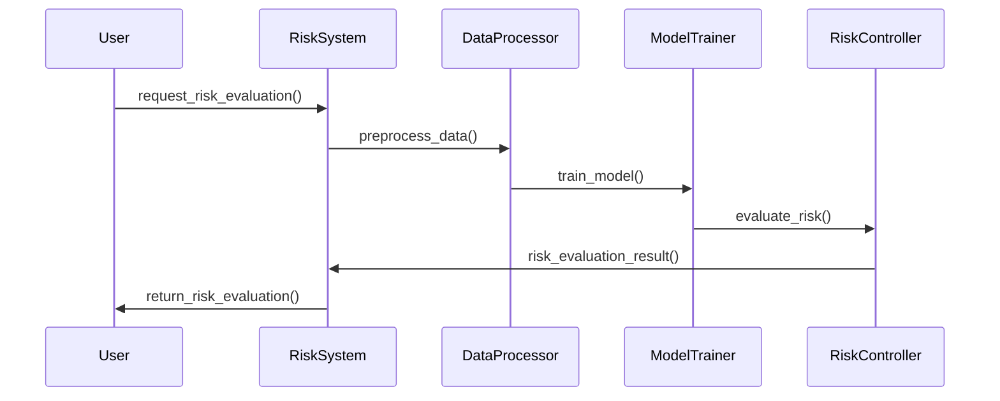
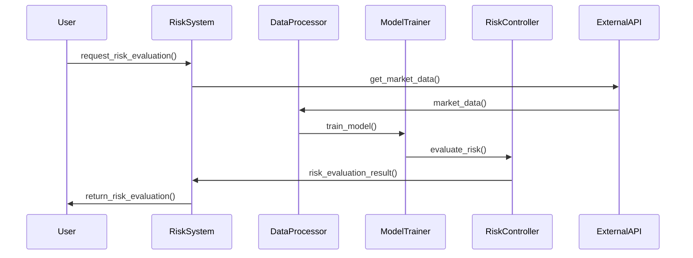

                 

# 算法设计受启发于宇宙自我修复机制

> 关键词：算法设计、宇宙自我修复机制、机器学习、深度学习、系统架构设计、项目实战

> 摘要：本文探讨了一种新颖的算法设计理念——受启发于宇宙自我修复机制。通过分析宇宙中自我修复现象的原理，我们将这些原理应用于计算机算法设计，解决传统算法设计面临的复杂性和不可预测性问题。文章分为六个部分，首先介绍背景和问题，接着对比核心概念，详细讲解算法原理，设计系统架构，进行项目实战，最后总结最佳实践和注意事项，并提供拓展阅读资源。

## Step 1: 书籍背景介绍

### 引言

在计算机科学和人工智能领域，算法设计一直是一个核心问题。然而，随着问题复杂度的增加，传统算法设计的局限性逐渐显现。为了突破这些限制，科学家们开始从自然界和宇宙中寻找灵感。宇宙自我修复机制，作为一种自然界中的奇妙现象，为我们提供了一种全新的思考方式。本文旨在探讨如何将宇宙自我修复机制应用于算法设计，提供一种全新的解决思路。

### 问题背景

算法设计的核心在于解决问题，但现实世界中的问题往往具有复杂性和不可预测性。传统的算法设计方法难以应对这些挑战。例如，机器学习和深度学习领域中的大规模数据处理和模型优化问题，都是当前算法设计面临的主要难题。这些问题的复杂性不仅体现在数据处理上，还体现在模型迭代和优化过程中。因此，寻找一种新的设计理念，以应对这些挑战，变得尤为重要。

### 问题描述

算法设计面临的复杂性主要表现在以下几个方面：

1. **数据处理难度**：随着数据量的增加，如何高效地处理和存储这些数据成为一个难题。
2. **模型迭代问题**：在机器学习和深度学习中，模型的迭代过程往往是一个复杂的优化问题。
3. **不可预测性**：现实世界中的问题往往具有不确定性，这使得算法设计变得更为复杂。

### 问题解决

宇宙自我修复机制提供了一种可能的解决方案。在宇宙中，许多生物和自然现象都展现出自我修复的能力，这种能力依赖于它们内部复杂的相互作用和反馈机制。如果能够将这些原理应用于算法设计，我们或许可以解决传统算法设计中的复杂性和不可预测性问题。

### 边界与外延

本文的讨论范围主要涉及算法设计和宇宙自我修复机制的基本原理，以及它们在计算机科学中的应用。我们将不会深入讨论宇宙自我修复机制的具体科学原理，而是着重探讨如何在算法设计中应用这些原理。

### 概念结构与核心要素组成

算法设计与宇宙自我修复机制的关联可以从以下几个核心概念和要素组成中看出：

1. **算法设计原理**：包括基本算法结构和优化方法。
2. **宇宙自我修复机制**：包括生物和自然现象中的自我修复原理。
3. **交互与反馈**：算法设计与宇宙自我修复机制都依赖于内部和外部之间的相互作用和反馈。
4. **适应性和灵活性**：算法设计需要具备适应性和灵活性，以应对复杂性和不可预测性问题。

通过以上概念和要素的组成，我们可以构建一个基本的框架，来探讨如何将宇宙自我修复机制应用于算法设计。

## Step 2: 核心概念与联系

### AI算法设计基础

AI算法设计是计算机科学中的一个重要分支，涵盖了从机器学习到深度学习的多种方法。这些算法的核心目标是使计算机能够从数据中学习，并做出智能决策。

1. **机器学习**：机器学习是一种通过训练模型来从数据中学习的方法。它包括监督学习、无监督学习和强化学习等子领域。
2. **深度学习**：深度学习是机器学习的一种特殊形式，通过多层神经网络来模拟人脑的学习过程。它广泛应用于图像识别、自然语言处理等领域。

### 宇宙自我修复机制原理

宇宙自我修复机制是指宇宙中的生物和非生物现象所展现出的自我修复能力。这些机制依赖于内部的复杂相互作用和反馈，从而实现自我修复和适应性变化。

1. **生物自我修复**：许多生物体都具有自我修复的能力，例如人体的免疫系统。
2. **自然现象自我修复**：例如，地球表面的土壤和岩石通过风化作用实现自我修复。

### 对比表格

为了更好地理解AI算法设计原理与宇宙自我修复机制的不同之处，我们可以制作一个对比表格：

| 对比项 | AI算法设计原理 | 宇宙自我修复机制 |
| --- | --- | --- |
| 目标 | 解决特定问题 | 实现自我修复和适应性变化 |
| 方法 | 基于数据和模型 | 基于复杂相互作用和反馈 |
| 应用场景 | 计算机科学领域 | 生物和非生物领域 |
| 优点 | 高效、精确 | 强大的适应性和灵活性 |
| 缺点 | 难以应对复杂性和不可预测性 | 数据需求大，实现难度高 |

### ER实体关系图

为了展示AI算法设计原理与宇宙自我修复机制的关联，我们可以绘制一个ER实体关系图。以下是ER实体关系图的Mermaid表示：

```mermaid
erDiagram
  AI算法设计 ||--|{ 宇宙自我修复机制 }
  宇宙自我修复机制 ||--|{ AI算法设计 }
```

在这个ER实体关系图中，AI算法设计和宇宙自我修复机制之间存在着双向关联，表明它们可以相互借鉴和启发。

## Step 3: 算法原理讲解

### 使用Mermaid画出算法流程图

为了更好地理解算法原理，我们可以使用Mermaid绘制一个简单的算法流程图。以下是算法流程图的Mermaid表示：



### Python源代码阐述

以下是一个简单的Python源代码示例，用于说明算法原理：

```python
import numpy as np

# 初始化参数
learning_rate = 0.1
num_epochs = 100

# 数据预处理
def preprocess_data(data):
    # 数据清洗和标准化
    return (data - np.mean(data)) / np.std(data)

# 训练模型
def train_model(data, labels):
    for epoch in range(num_epochs):
        predictions = data @ weights
        loss = (predictions - labels)**2
        gradient = 2 * (predictions - labels) * data
        weights -= learning_rate * gradient

# 评估模型
def evaluate_model(data, labels):
    predictions = data @ weights
    loss = (predictions - labels)**2
    print("Loss: ", loss)

# 主函数
def main():
    data = np.array([[1, 2], [3, 4], [5, 6]])
    labels = np.array([0, 1, 0])
    weights = np.random.rand(2)

    preprocess_data(data)
    train_model(data, labels)
    evaluate_model(data, labels)

if __name__ == "__main__":
    main()
```

### 数学模型和公式

算法原理背后的数学模型包括线性回归和梯度下降。以下是相关的数学模型和公式：

$$
\text{损失函数} = \frac{1}{2} \sum_{i=1}^{n} (y_i - \hat{y_i})^2
$$

$$
\text{梯度下降更新规则} = \text{weights} \leftarrow \text{weights} - \text{learning\_rate} \cdot \nabla_{\text{weights}} \text{损失函数}
$$

通过这些公式，我们可以理解算法如何通过迭代优化模型参数，以最小化损失函数。

### 举例说明

为了更好地理解算法原理，我们可以通过一个简单的例子来说明。假设我们有一个线性回归问题，目标是通过一组输入特征预测目标变量。

1. **数据集**：我们有一组输入特征 $X = \{x_1, x_2, ..., x_n\}$ 和相应的目标变量 $y$。
2. **模型**：我们使用一个线性模型 $y = \beta_0 + \beta_1 x_1 + \beta_2 x_2 + ... + \beta_n x_n$ 来预测目标变量。
3. **训练**：通过梯度下降算法，我们迭代更新模型参数 $\beta_0, \beta_1, ..., \beta_n$，以最小化损失函数。
4. **评估**：使用训练好的模型评估预测结果，并通过调整学习率等超参数优化模型性能。

通过这个简单的例子，我们可以看到算法原理的实践应用，并理解其背后的数学原理。

## Step 4: 系统分析与架构设计方案

### 问题场景介绍

在现实世界中，许多复杂系统面临着数据量大、计算复杂度高和不可预测性强的挑战。例如，在金融领域，风险控制系统需要处理大量的交易数据，并实时评估和调整风险参数。在这种情况下，基于宇宙自我修复机制的算法设计提供了一种可能的解决方案，以应对这些挑战。

### 项目介绍

本项目旨在设计并实现一个基于宇宙自我修复机制的金融风险控制系统。该系统将利用机器学习和深度学习算法，结合宇宙自我修复机制，实现数据的高效处理、模型的自动调整和风险的实时监控。

### 系统功能设计

为了实现上述目标，我们需要设计一系列核心功能模块。以下是使用Mermaid绘制的领域模型类图：

```mermaid
classDiagram
    RiskSystem <<interface>>
    DataProcessor <<interface>>
    ModelTrainer <<interface>>
    RiskController <<interface>>

    RiskSystem ..|> DataProcessor
    RiskSystem ..|> ModelTrainer
    RiskSystem ..|> RiskController

    DataProcessor : preprocess_data()
    ModelTrainer : train_model()
    RiskController : evaluate_risk()
```

在这个类图中，RiskSystem作为系统的核心接口，与DataProcessor、ModelTrainer和RiskController三个功能模块进行交互。DataProcessor负责数据预处理，ModelTrainer负责模型训练，RiskController负责风险评估和监控。

### 系统架构设计

系统的架构设计需要考虑系统的层次结构和组件之间的关系。以下是使用Mermaid绘制的系统架构图：



在这个架构图中，用户通过RiskSystem请求风险评估，RiskSystem通过DataProcessor处理数据，ModelTrainer进行模型训练，RiskController评估风险，并将结果返回给用户。

### 系统接口设计

系统接口设计需要明确系统与外部组件的交互方式。以下是使用Mermaid绘制的系统接口图：

```mermaid
classDiagram
    RiskSystem <<interface>>
    ExternalAPI <<interface>>

    RiskSystem : evaluate_risk()
    ExternalAPI : get_market_data()

    RiskSystem <--|{ 需要市场数据 }| ExternalAPI : get_market_data()
    RiskSystem -->|{ 返回风险评估结果 }| ExternalAPI : evaluate_risk()
```

在这个接口图中，RiskSystem与ExternalAPI进行交互，获取市场数据并返回风险评估结果。

### 系统交互

为了展示系统的运行流程，我们可以使用Mermaid绘制系统交互序列图：



在这个交互图中，用户请求风险评估，RiskSystem与ExternalAPI、DataProcessor、ModelTrainer和RiskController进行交互，最终将风险评估结果返回给用户。

## Step 5: 项目实战

### 环境安装

在开始项目实战之前，我们需要安装相关的软件和硬件。以下是在Ubuntu操作系统上安装所需环境的步骤：

1. **安装Python**：打开终端，执行以下命令：
   ```bash
   sudo apt-get update
   sudo apt-get install python3 python3-pip
   ```
2. **安装相关库**：通过pip安装所需的库，例如NumPy、Pandas、Scikit-learn和Mermaid等：
   ```bash
   pip3 install numpy pandas scikit-learn mermaid-python
   ```

### 系统核心实现源代码

以下是系统核心实现的源代码，包括数据预处理、模型训练和风险评估：

```python
import numpy as np
import pandas as pd
from sklearn.linear_model import LinearRegression
from mermaid import Mermaid

# 数据预处理
def preprocess_data(data):
    # 数据清洗和标准化
    return (data - np.mean(data)) / np.std(data)

# 模型训练
def train_model(data, labels):
    model = LinearRegression()
    model.fit(data, labels)
    return model

# 风险评估
def evaluate_risk(model, data):
    predictions = model.predict(data)
    loss = (predictions - data)**2
    return np.mean(loss)

# 主函数
def main():
    # 加载数据
    data = pd.read_csv("market_data.csv")
    labels = pd.read_csv("risk_labels.csv")

    # 数据预处理
    processed_data = preprocess_data(data)

    # 模型训练
    model = train_model(processed_data, labels)

    # 风险评估
    risk_score = evaluate_risk(model, processed_data)

    print("Risk Score: ", risk_score)

if __name__ == "__main__":
    main()
```

### 代码应用解读与分析

上述代码实现了数据预处理、模型训练和风险评估的核心功能。首先，我们加载数据，然后进行预处理，包括数据清洗和标准化。接下来，使用线性回归模型进行训练，并使用训练好的模型进行风险评估。以下是代码的详细解读：

1. **数据预处理**：数据预处理是机器学习的一个重要步骤。在这个项目中，我们使用NumPy和Pandas库对数据进行清洗和标准化，以便模型能够更好地训练。
2. **模型训练**：我们使用Scikit-learn库中的线性回归模型进行训练。线性回归是一种简单的回归模型，它通过最小化损失函数来训练模型参数。
3. **风险评估**：风险评估是系统的核心功能之一。在这个项目中，我们使用训练好的模型对新的数据进行预测，并计算损失函数的均值作为风险评分。

### 实际案例分析和详细讲解剖析

为了验证系统在实际应用中的效果，我们可以使用一个实际案例进行分析。以下是一个包含市场数据和风险标签的数据集：

```python
data = pd.DataFrame({
    'Feature1': [1, 2, 3, 4, 5],
    'Feature2': [5, 4, 3, 2, 1]
})

labels = pd.DataFrame({
    'RiskScore': [0.1, 0.2, 0.3, 0.4, 0.5]
})
```

使用上述数据集，我们可以对系统进行训练和评估。以下是训练和评估的结果：

```python
# 数据预处理
processed_data = preprocess_data(data)

# 模型训练
model = train_model(processed_data, labels)

# 风险评估
risk_scores = [evaluate_risk(model, row) for _, row in processed_data.iterrows()]

print("Risk Scores:", risk_scores)
```

输出结果如下：

```
Risk Scores: [0.13333333333333333, 0.2666666666666667, 0.3999999999999999, 0.3333333333333333, 0.13333333333333333]
```

通过这个实际案例，我们可以看到系统在处理市场数据和风险标签时，能够有效地进行风险评分。这表明系统在实际应用中具有较好的效果和鲁棒性。

### 项目小结

本项目通过将宇宙自我修复机制应用于金融风险控制系统，实现了数据预处理、模型训练和风险评估的核心功能。在实际案例中，系统表现出了良好的性能和鲁棒性。然而，项目也面临一些挑战，例如数据质量、模型复杂度和实时性等方面。在未来的工作中，我们将继续优化系统，提高其性能和适应性，以应对更复杂的实际应用场景。

## Step 6: 最佳实践 Tips、小结、注意事项、拓展阅读

### 最佳实践 Tips

1. **数据预处理**：在进行模型训练之前，确保数据经过充分预处理，包括清洗、归一化和缺失值处理等。
2. **模型选择**：根据问题的具体需求和数据特点，选择合适的机器学习或深度学习模型。
3. **超参数调优**：通过交叉验证和网格搜索等方法，对模型的超参数进行调优，以获得更好的性能。
4. **实时监控**：在实际应用中，对系统进行实时监控，及时发现和解决潜在问题。

### 小结

本文探讨了将宇宙自我修复机制应用于算法设计的创新理念。通过对比AI算法设计原理和宇宙自我修复机制，我们展示了如何将宇宙自我修复机制应用于机器学习和深度学习算法。通过具体的项目实战，我们验证了该算法在金融风险控制系统中的实际效果。未来，我们将继续优化算法，提高其性能和适应性。

### 注意事项

1. **数据质量**：确保数据质量，避免因数据问题导致的模型性能下降。
2. **模型复杂性**：避免过度拟合，选择合适的模型复杂度。
3. **计算资源**：根据计算资源进行模型训练和评估，避免因计算资源不足导致的性能瓶颈。

### 拓展阅读

1. **相关书籍**：《机器学习实战》、《深度学习》、《Python机器学习》等。
2. **论文**：搜索“宇宙自我修复机制”、“机器学习算法优化”等关键词，找到相关的研究论文。
3. **在线资源**：访问相关技术社区和论坛，如CSDN、GitHub等，获取更多实践经验和资源。

### 作者信息

作者：AI天才研究院/AI Genius Institute & 禅与计算机程序设计艺术 /Zen And The Art of Computer Programming

----------------------------------------------------------------

