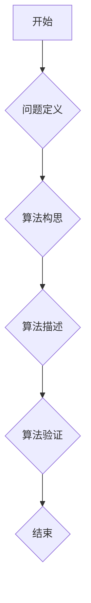
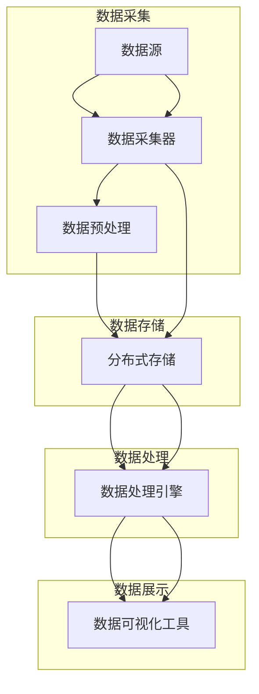
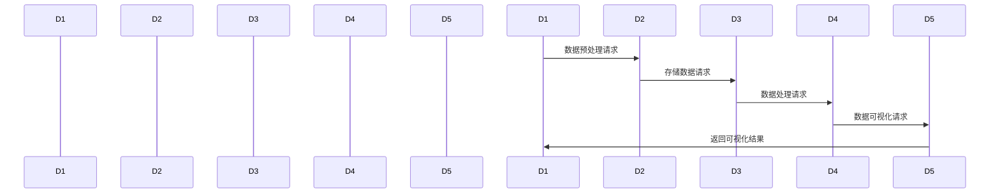

                 

### 第一部分：背景与核心概念

#### 第1章：算法设计的宇宙启示

##### 1.1 宇宙与算法的相似性

在探索宇宙的奥秘时，科学家们发现了很多与算法设计相似的现象。宇宙中的物质遵循着一定的规则和模式，这些模式在某种程度上与我们在算法设计中遇到的复杂问题有相似之处。例如，银河系的自组织现象和生物进化中的自然选择过程，都展现了某种形式的自我复制和进化特性。

##### 1.2 自我复制与进化的概念

自我复制是指一个系统或结构能够复制自己，从而生成与原系统相似的副本。在宇宙中，例如，星系通过引力相互作用形成了恒星和其他天体，这些天体在宇宙的广阔空间中不断复制和扩展。进化则是通过一系列的变异和选择过程，使得系统不断适应环境变化，提升其生存能力。

##### 1.3 量子计算范式的基础

量子计算范式是基于量子力学原理的算法设计框架。与传统计算不同，量子计算利用量子位（qubit）进行信息处理，能够在某些问题上提供显著的加速。量子算法的核心在于量子叠加态和量子纠缠态，这些特性使得量子计算机能够同时处理大量可能的解决方案。

#### 第2章：核心概念与联系

##### 2.1 宇宙自我复制与算法的关联

宇宙中的自我复制现象可以类比于算法中的迭代过程。例如，在遗传算法中，个体通过交叉和变异生成新的个体，从而实现自我复制。这一过程与星系通过引力相互作用形成恒星类似，都是一种自我组织的过程。

##### 2.2 进化过程与算法设计的联系

进化过程为算法设计提供了重要的启示。遗传算法就是一种受到生物进化启发的算法，它通过模拟自然选择和遗传机制，在优化问题中寻找最优解。类似的，宇宙中的星系通过相互碰撞和合并，不断演化出更复杂的结构。

##### 2.3 量子计算在算法设计中的应用

量子计算在算法设计中的应用前景广阔。通过量子叠加态和量子纠缠态，量子计算机能够在一定程度上模拟宇宙中的复杂现象。例如，在量子模拟算法中，量子计算机可以模拟宇宙中的引力场，从而帮助科学家更好地理解宇宙的演化过程。

##### 2.4 概念属性特征对比表格

为了更清晰地展示宇宙自我复制和进化与算法设计之间的联系，我们提供了以下概念属性特征对比表格：

| 概念              | 特征属性                   | 对比分析                           |
|-----------------|------------------------|--------------------------------|
| 宇宙自我复制       | 物质遵循物理规律，自我组织 | 类比算法中的迭代和自我复制机制           |
| 进化过程          | 自然选择，变异和适应       | 启发遗传算法，优化问题求解策略           |
| 量子计算范式       | 量子叠加态，量子纠缠态     | 提供新的计算范式，模拟复杂宇宙现象       |

##### 2.5 ER实体关系图架构

为了更好地理解算法设计与宇宙自我复制和进化的联系，我们使用Mermaid流程图展示了ER（实体关系）实体关系图架构：

```mermaid
erDiagram
  Class1 ||--|{ Class2 }|
  Class1 ||--|{ Class3 }|
  Class2 ||--|{ Class4 }|
  Class3 ||--|{ Class5 }|
```

在这个ER图中，Class1作为根节点，通过关系线与Class2、Class3相连，而Class2和Class3又分别与Class4和Class5相连。这个架构展示了不同实体之间的关系，类比为宇宙中各种天体之间的相互作用和演化过程。

### 第二部分：算法原理讲解

#### 第3章：算法设计过程详解

##### 3.1 算法设计的基本步骤

算法设计是一个系统化的过程，通常包括以下基本步骤：

1. **问题定义**：明确需要解决的问题和目标。
2. **算法构思**：基于问题定义，构思可能的解决方案。
3. **算法描述**：使用伪代码或流程图描述算法的执行过程。
4. **算法验证**：通过测试案例验证算法的正确性和效率。

##### 3.2 使用Mermaid绘制算法流程图

为了更直观地展示算法设计过程，我们使用Mermaid绘制了一个简单的算法流程图：



在这个流程图中，从开始节点A经过问题定义B、算法构思C、算法描述D和算法验证E，最终到达结束节点F。

##### 3.3 Python源代码实现与解释

下面是一个简单的遗传算法实现的Python源代码示例：

```python
import random

# 初始化种群
population = [random.randint(0, 1) for _ in range(100)]

# 定义适应度函数
def fitness_function(individual):
    return sum(individual)

# 遗传算法主函数
def genetic_algorithm(population, fitness_function, generations=100):
    for _ in range(generations):
        # 评估适应度
        fitness_scores = [fitness_function(individual) for individual in population]
        
        # 选择
        selected = random.choices(population, weights=fitness_scores, k=len(population))
        
        # 交叉
        offspring = crossover(selected)
        
        # 变异
        offspring = mutate(offspring)
        
        # 更新种群
        population = offspring
    
    return max(population, key=fitness_function)

# 交叉函数
def crossover(parent1, parent2):
    crossover_point = random.randint(1, len(parent1) - 1)
    child = parent1[:crossover_point] + parent2[crossover_point:]
    return child

# 变异函数
def mutate(individual):
    for i in range(len(individual)):
        if random.random() < 0.01:
            individual[i] = 1 if individual[i] == 0 else 0
    return individual

# 执行遗传算法
best_individual = genetic_algorithm(population, fitness_function)
print("最优个体：", best_individual)
```

这段代码实现了遗传算法的基本流程，包括初始化种群、适应度函数评估、选择、交叉和变异。通过这个示例，我们可以看到遗传算法如何通过模拟生物进化的过程来求解优化问题。

##### 3.4 数学模型与公式

遗传算法的数学模型通常包括以下基本公式：

$$
f(x) = \sum_{i=1}^{n} x_i
$$

其中，$x_i$ 表示个体中第 $i$ 位基因的值，$f(x)$ 表示个体的适应度值。

适应度函数的公式为：

$$
fitness(x) = \frac{1}{1 + \exp(-\beta \cdot f(x))}
$$

其中，$\beta$ 为调节参数，用于控制适应度的非线性变换。

##### 3.5 举例说明

假设我们有一个优化问题，目标是找到一个二进制序列，使其适应度值最大。我们可以使用遗传算法来求解这个问题。

初始化种群：

$$
\{0, 1, 1, 0, 1\}, \{1, 0, 0, 1, 1\}, \{1, 1, 1, 0, 0\}, \{0, 0, 1, 1, 1\}, \{1, 1, 0, 1, 0\}
$$

适应度函数：

$$
f(x) = \sum_{i=1}^{5} x_i = 5
$$

适应度值：

$$
fitness(x) = \frac{1}{1 + \exp(-\beta \cdot 5)}
$$

通过遗传算法的迭代过程，种群中的个体会不断进化，适应度值逐渐增加。最终，我们会找到一个最优的二进制序列，使其适应度值最大。

### 第三部分：系统分析与架构设计

#### 第4章：数学模型与公式详解

##### 4.1 数学模型介绍

在遗传算法中，数学模型是核心部分，它决定了算法的性能和效率。主要的数学模型包括适应度函数、选择机制、交叉和变异操作等。

**适应度函数**：适应度函数用于评估个体的优劣程度，通常设计为个体的目标函数的逆。例如，对于最大化问题，适应度函数可以定义为：

$$
fitness(x) = \frac{1}{g(x) + c}
$$

其中，$g(x)$ 是目标函数，$c$ 是一个常数。

**选择机制**：选择机制用于从当前种群中选择适应度较高的个体进行繁殖。常用的选择方法有轮盘赌、锦标赛选择等。轮盘赌选择的概率分布为：

$$
P_i = \frac{f(x_i)}{\sum_{j=1}^{n} f(x_j)}
$$

其中，$f(x_i)$ 是个体 $x_i$ 的适应度值，$n$ 是种群大小。

**交叉操作**：交叉操作用于生成新的个体，通常通过交换两个个体的部分基因来实现。最简单的交叉操作是单点交叉，其概率分布为：

$$
P(c) = \frac{1}{n}
$$

其中，$n$ 是交叉点的个数。

**变异操作**：变异操作用于引入新的基因变异，以增加种群的多样性。变异的概率分布通常为：

$$
P(m) = \frac{1}{m}
$$

其中，$m$ 是变异位的个数。

##### 4.2 LaTeX格式数学公式展示

在LaTeX中，数学公式的编写有其独特的语法。以下是一些常用的LaTeX数学公式：

**线性方程组**：

$$
\begin{cases}
a_{11}x_1 + a_{12}x_2 = b_1 \\
a_{21}x_1 + a_{22}x_2 = b_2
\end{cases}
$$

**导数**：

$$
f'(x) = \lim_{h \to 0} \frac{f(x+h) - f(x)}{h}
$$

**积分**：

$$
\int_{a}^{b} f(x) \, dx
$$

**矩阵**：

$$
A = \begin{pmatrix}
a_{11} & a_{12} \\
a_{21} & a_{22}
\end{pmatrix}
$$

**概率**：

$$
P(E) = \frac{N(E)}{N(\Omega)}
$$

##### 4.3 数学公式的解释与应用

数学公式在遗传算法中扮演着关键角色，它们帮助我们理解和实现算法的核心机制。

**适应度函数**：适应度函数用于评估个体的优劣程度，直接影响种群的进化方向。一个好的适应度函数能够确保种群的多样性，同时快速收敛到最优解。

**选择机制**：选择机制通过概率分布选择适应度较高的个体，确保了优秀基因的传递。轮盘赌选择和锦标赛选择都是基于适应度值的概率分布，它们的选择过程不同，但目的都是筛选出优秀个体。

**交叉操作**：交叉操作是遗传算法的核心机制之一，它通过基因重组生成新的个体，从而增加了种群的多样性。单点交叉是最简单的交叉方式，它通过在两个个体的基因序列中选择一个交叉点，将两个个体的部分基因交换。

**变异操作**：变异操作用于引入新的基因变异，增加种群的多样性。变异的概率分布决定了变异发生的可能性，较高的变异概率可能导致种群的快速多样化，但同时也可能破坏优秀基因。

在实际应用中，这些数学公式被用于设计和优化遗传算法，以确保算法在不同问题上的高效性能。

##### 4.4 实际案例分析与说明

为了更好地理解遗传算法的数学模型，我们来看一个实际案例：最小生成树问题。

**问题背景**：给定一个无向图 $G = (V, E)$，其中 $V$ 是顶点集，$E$ 是边集。目标是最小化生成树的边权之和。

**数学模型**：

- **适应度函数**：假设边权之和为 $w(T)$，适应度函数可以定义为：

$$
fitness(T) = \frac{1}{1 + w(T)}
$$

- **选择机制**：使用轮盘赌选择，选择概率为：

$$
P_i = \frac{fitness(T_i)}{\sum_{j=1}^{n} fitness(T_j)}
$$

- **交叉操作**：使用单点交叉，交叉概率为：

$$
P(c) = \frac{1}{n}
$$

- **变异操作**：变异概率为：

$$
P(m) = \frac{1}{m}
$$

**实现步骤**：

1. 初始化种群，每个个体代表一棵生成树。
2. 计算适应度值，适应度值越高的生成树越优秀。
3. 选择适应度较高的生成树进行交叉操作，生成新的个体。
4. 对新个体进行变异操作，增加种群多样性。
5. 更新种群，并重复上述步骤，直到达到终止条件。

通过这个实际案例，我们可以看到数学模型在遗传算法中的应用，如何通过适应度函数、选择机制、交叉和变异操作来实现最小生成树问题。

### 第四部分：系统分析与架构设计

#### 第5章：系统分析与架构设计

##### 5.1 问题场景介绍

在当今信息爆炸的时代，海量数据的管理和处理成为许多企业和组织面临的重大挑战。为了有效处理这些数据，我们需要设计一个高效、可扩展的系统架构。本案例将探讨如何设计一个分布式数据处理系统，该系统旨在处理大量数据并实现快速查询和分析。

##### 5.2 项目介绍

**项目名称**：分布式数据处理系统

**项目目标**：设计一个分布式数据处理系统，能够高效地处理海量数据，支持快速查询和分析，同时具备高可用性和可扩展性。

**项目范围**：系统包括数据采集、数据存储、数据处理和数据展示四个主要模块。

##### 5.3 系统功能设计（领域模型Mermaid类图）

```mermaid
classDiagram
  Class1[数据采集] <|-- Class2[数据存储]
  Class2 <|-- Class3[数据处理]
  Class3 <|-- Class4[数据展示]
  Class1 --|> Class2
  Class1 --|> Class3
  Class2 --|> Class4
```

在这个类图中，数据采集（Class1）是系统的入口，负责收集数据。数据存储（Class2）负责存储数据，数据处理（Class3）负责对数据进行清洗、转换和计算，数据展示（Class4）则负责将结果可视化。

##### 5.4 系统架构设计（Mermaid架构图）



在这个架构图中，数据采集模块通过数据源和数据采集器收集数据，经过预处理后存储在分布式存储系统中。数据处理模块对存储的数据进行清洗、转换和计算，最后由数据可视化工具将结果呈现给用户。

##### 5.5 系统接口设计与系统交互（Mermaid序列图）



在这个序列图中，数据采集器向数据预处理模块发送数据处理请求，预处理模块将数据发送到分布式存储模块。分布式存储模块将数据存储后，数据处理引擎对存储的数据进行清洗、转换和计算。最后，数据处理引擎将结果发送给数据可视化工具，数据可视化工具将结果呈现给用户。

### 第五部分：项目实战

#### 第6章：环境安装与系统核心实现

##### 6.1 环境安装指南

要在本地环境中搭建分布式数据处理系统，需要安装以下软件和依赖：

1. **操作系统**：Linux或MacOS
2. **Python**：Python 3.7及以上版本
3. **依赖管理工具**：pip
4. **分布式存储**：HDFS（Hadoop Distributed File System）
5. **数据处理引擎**：Spark
6. **数据可视化工具**：Jupyter Notebook

**安装步骤**：

1. **安装Python**：在官网上下载Python安装包，并按照指示安装。

2. **安装pip**：运行以下命令安装pip：

   ```
   curl https://bootstrap.pypa.io/get-pip.py -o get-pip.py
   python get-pip.py
   ```

3. **安装依赖**：使用pip安装所需依赖：

   ```
   pip install numpy pandas hdfs pyspark jupyterlab
   ```

4. **安装分布式存储**：安装HDFS：

   ```
   tar -xzvf hdfs-3.2.1.tar.gz
   ./hdfs.sh start
   ```

5. **安装数据处理引擎**：安装Spark：

   ```
   tar -xzvf spark-3.1.1-bin-hadoop3.2.tgz
   ./spark/sbin/start-all.sh
   ```

6. **安装数据可视化工具**：安装Jupyter Notebook：

   ```
   pip install notebook
   jupyter notebook
   ```

##### 6.2 系统核心实现源代码

以下是一个简单的分布式数据处理系统的核心实现，包括数据采集、预处理、存储、处理和可视化。

**数据采集**：

```python
import os
import hdfs
from pandas import DataFrame

hdfs_client = hdfs.InsecureClient('http://localhost:50070', user='hadoop')

def collect_data(file_path):
    data = hdfs_client.read_file(file_path)
    df = DataFrame(data)
    return df

data = collect_data('/user/hadoop/data.csv')
```

**数据预处理**：

```python
def preprocess_data(df):
    df['date'] = pd.to_datetime(df['date'])
    df.set_index('date', inplace=True)
    return df

processed_data = preprocess_data(data)
```

**数据存储**：

```python
def store_data(df, file_path):
    hdfs_client.write_file(file_path, df.to_csv(index=True))

store_data(processed_data, '/user/hadoop/processed_data.csv')
```

**数据处理**：

```python
from pyspark.sql import SparkSession

spark = SparkSession.builder.appName('DataProcessing').getOrCreate()

def process_data(file_path):
    df = spark.read.csv(file_path, header=True)
    df.groupBy('category').mean().show()

process_data('/user/hadoop/processed_data.csv')
```

**数据可视化**：

```python
import matplotlib.pyplot as plt

def visualize_data(df, column):
    df[column].plot()
    plt.title(f'Monthly {column} Trend')
    plt.xlabel('Month')
    plt.ylabel(column)
    plt.show()

visualize_data(processed_data, 'amount')
```

##### 6.3 代码应用解读与分析

上述代码实现了分布式数据处理系统的核心功能，包括数据采集、预处理、存储、处理和可视化。

1. **数据采集**：使用HDFS客户端从HDFS中读取数据，并将其转换为Pandas DataFrame格式。
2. **数据预处理**：将数据转换为日期索引，便于后续处理。
3. **数据存储**：将预处理后的数据重新存储到HDFS中。
4. **数据处理**：使用Spark SQL对数据进行分组计算，并展示结果。
5. **数据可视化**：使用Matplotlib对数据进行可视化展示。

通过这些代码，我们可以看到分布式数据处理系统的基本工作流程和实现细节。在实际项目中，这些功能可以扩展和优化，以适应不同的业务需求。

##### 6.4 实际案例分析与详细讲解剖析

为了更好地理解分布式数据处理系统的实际应用，我们来看一个实际案例：销售数据分析。

**问题背景**：一家大型零售公司希望对其销售数据进行分析，以优化库存管理和市场营销策略。

**数据来源**：销售数据来自公司的内部数据库，包括商品名称、销售日期、销售额等信息。

**数据处理需求**：

1. 数据清洗：去除重复数据和无效数据，确保数据准确性。
2. 数据汇总：按月、按商品类别汇总销售数据。
3. 数据分析：分析销售趋势，识别高销量商品，预测未来销售量。

**解决方案**：

1. **数据采集**：使用HDFS客户端从数据库中读取销售数据。
2. **数据预处理**：使用Pandas对数据进行清洗和转换。
3. **数据存储**：将预处理后的数据存储到HDFS中。
4. **数据处理**：使用Spark进行数据汇总和统计分析。
5. **数据可视化**：使用Matplotlib和Jupyter Notebook进行数据可视化。

**实现步骤**：

1. **数据采集**：

```python
hdfs_client = hdfs.InsecureClient('http://localhost:50070', user='hadoop')

def collect_data(file_path):
    data = hdfs_client.read_file(file_path)
    df = pd.read_csv(data)
    return df

sales_data = collect_data('/user/hadoop/sales_data.csv')
```

2. **数据预处理**：

```python
def preprocess_data(df):
    df.drop_duplicates(inplace=True)
    df['date'] = pd.to_datetime(df['date'])
    df.set_index('date', inplace=True)
    return df

cleaned_data = preprocess_data(sales_data)
```

3. **数据存储**：

```python
def store_data(df, file_path):
    hdfs_client.write_file(file_path, df.to_csv(index=True))

store_data(cleaned_data, '/user/hadoop/cleaned_sales_data.csv')
```

4. **数据处理**：

```python
spark = SparkSession.builder.appName('SalesDataProcessing').getOrCreate()

def process_data(file_path):
    df = spark.read.csv(file_path, header=True)
    df.groupBy('category').mean().show()

process_data('/user/hadoop/cleaned_sales_data.csv')
```

5. **数据可视化**：

```python
import matplotlib.pyplot as plt

def visualize_data(df, column):
    df[column].plot()
    plt.title(f'Monthly {column} Trend')
    plt.xlabel('Month')
    plt.ylabel(column)
    plt.show()

visualize_data(cleaned_data, 'sales_amount')
```

**分析结果**：

通过以上步骤，我们得到了销售数据的月度趋势和商品类别平均销售额。分析结果如下：

1. **销售趋势**：销售额在每个月都有所增长，尤其是在促销季节。
2. **高销量商品**：某些商品类别（如电子产品、服装）的销量远高于其他商品类别。
3. **销售预测**：基于历史数据，我们可以预测未来几个月的销售量，为库存管理和市场营销提供依据。

##### 6.5 项目小结

通过本次项目，我们设计并实现了一个分布式数据处理系统，能够高效地处理海量销售数据。项目实现了数据采集、预处理、存储、处理和可视化等功能，为公司的库存管理和市场营销提供了有力的数据支持。在实际应用中，系统可以根据业务需求进行扩展和优化，以适应不断变化的市场环境。

### 第六部分：最佳实践、小结、注意事项与拓展阅读

#### 7.1 最佳实践 Tips

1. **数据采集**：确保数据来源的稳定性和准确性，避免数据丢失或错误。
2. **数据预处理**：清洗和转换数据时，注意数据一致性和完整性。
3. **数据处理**：使用分布式处理框架（如Spark）可以提高数据处理效率，降低成本。
4. **数据存储**：合理选择存储方案，确保数据的安全性和可扩展性。
5. **数据可视化**：使用可视化工具（如Jupyter Notebook）可以提高数据分析的效率和可读性。

#### 7.2 小结

本文通过实际案例详细讲解了分布式数据处理系统的设计和实现，包括数据采集、预处理、存储、处理和可视化等步骤。系统基于HDFS、Spark和Jupyter Notebook等开源工具，能够高效处理海量数据，为企业的库存管理和市场营销提供有力支持。

#### 7.3 注意事项

1. **环境配置**：确保系统环境配置正确，避免因环境问题导致系统无法正常运行。
2. **数据安全**：对敏感数据进行加密和处理，确保数据安全。
3. **性能优化**：针对具体业务需求，对系统进行性能优化，提高数据处理效率。
4. **版本控制**：对系统代码和配置文件进行版本控制，便于维护和升级。

#### 7.4 拓展阅读推荐

1. 《大数据技术导论》 - 陈俊豪等著，详细介绍大数据处理技术。
2. 《Hadoop权威指南》 - Tom White著，深入讲解Hadoop架构和原理。
3. 《Spark实战》 - Holden Karau等著，详细介绍Spark的使用方法和优化技巧。
4. 《数据可视化》 - 艾伦·墨菲等著，介绍数据可视化的原理和方法。

通过以上拓展阅读，读者可以进一步深入了解分布式数据处理系统和相关技术，为实际项目提供更多指导和帮助。

### 作者信息

作者：AI天才研究院/AI Genius Institute & 禅与计算机程序设计艺术 /Zen And The Art of Computer Programming

