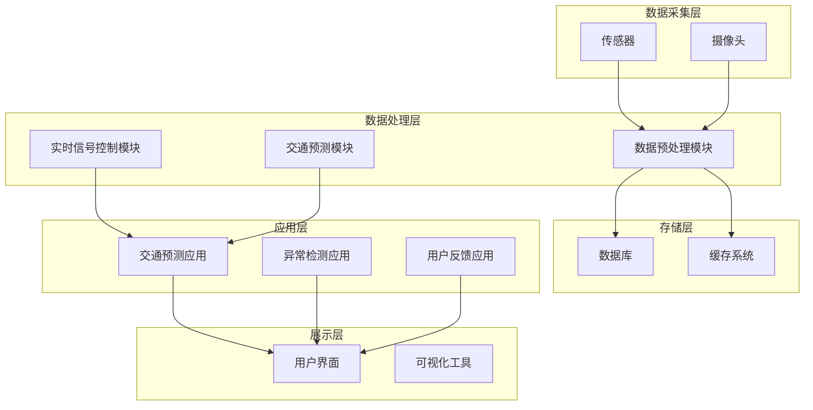
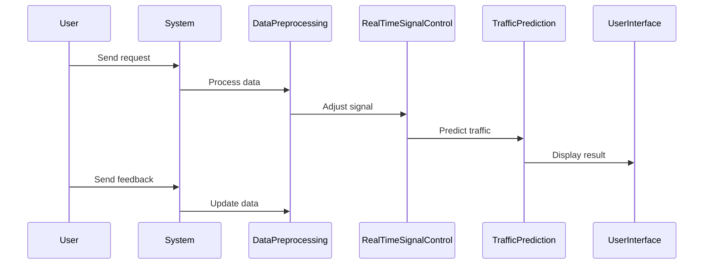
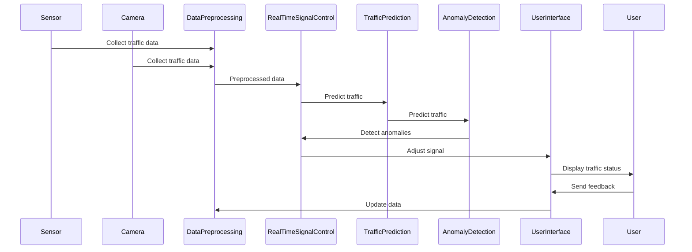

                 


### 文章标题：算法设计受启发于宇宙自我复制现象

### 文章关键词：
- 宇宙自我复制
- 算法设计
- 自然启示
- 数学模型
- 人工智能

### 摘要：
本文探讨宇宙中的自我复制现象如何启发算法设计，通过对核心概念的分析、算法原理的讲解、系统架构的设计、项目实践和最佳实践的总结，展示了自然法则与计算机科学之间的深刻联系。

## 第1章 引言：宇宙自我复制现象与算法设计

宇宙的自我复制现象是自然界中一种独特的现象，它展示了物质如何通过自我组织、自我复制实现进化。这种现象不仅在生物学中具有重要的意义，也为计算机科学中的算法设计提供了新的启示。本章将引入宇宙自我复制现象的基本概念，探讨其在算法设计中的应用。

### 1.1 问题背景与描述

#### 1.1.1 宇宙自我复制现象简介

宇宙自我复制现象是指宇宙中的物质（如行星、恒星、星系）在特定条件下能够通过某种机制自我复制，从而产生新的物质。例如，星系可以通过引力相互作用形成新的星系结构，恒星可以通过核聚变反应产生新的恒星。

#### 1.1.2 算法设计中的自我复制

在算法设计中，自我复制指的是算法能够通过自身的规则和逻辑生成新的算法或者解决新的问题。这种设计思想来源于宇宙中的自我复制现象，旨在提高算法的适应性和创新能力。

### 1.2 概念结构与核心要素组成

#### 1.2.1 核心概念

- **自我复制现象**：宇宙中物质通过自身机制实现复制的现象。
- **算法设计**：利用计算机科学方法解决特定问题的过程。

#### 1.2.2 关系与联系

自我复制现象与算法设计之间的关系可以从以下几个方面理解：

- **结构相似性**：宇宙中的自我复制现象与算法设计中的递归结构有相似之处。
- **机制相似性**：宇宙中的自我复制现象依赖于物理规律，而算法设计则依赖于数学规律。

### 第2章 核心概念与算法原理

#### 2.1 自我复制现象的核心概念

自我复制现象涉及以下核心概念：

- **遗传信息**：宇宙中的物质通过遗传信息进行复制。
- **环境适应**：物质复制过程中需要适应环境变化。

#### 2.2 算法设计的核心概念

在算法设计中，核心概念包括：

- **递归**：算法通过自身调用实现自我复制。
- **适应性**：算法需要适应不同的输入数据。

#### 2.3 算法原理讲解

自我复制现象启发下的算法设计通常基于以下原理：

- **遗传算法**：通过模拟遗传信息传递和选择机制，实现算法的自我优化。
- **递归算法**：通过递归调用实现算法的自我复制。

## 第3章 系统分析与架构设计

#### 3.1 问题场景介绍

在系统设计中，我们需要解决以下问题：

- **数据生成**：如何利用自我复制现象生成新的数据。
- **算法优化**：如何通过自我复制现象优化算法性能。

#### 3.2 系统功能设计

系统功能设计包括以下方面：

- **数据生成模块**：利用自我复制原理生成新的数据。
- **算法优化模块**：对现有算法进行自我复制和优化。

#### 3.3 系统架构设计

系统架构设计包括以下方面：

- **数据流架构**：明确数据在系统中的流动过程。
- **模块化设计**：将系统功能模块化，便于维护和扩展。

#### 3.4 系统接口设计

系统接口设计包括以下方面：

- **用户接口**：提供给用户的操作界面。
- **系统接口**：系统内部模块之间的通信接口。

#### 3.5 系统交互

系统交互包括以下方面：

- **数据交互**：数据在系统内部的流动和转换。
- **算法交互**：不同算法之间的协作和优化。

## 第4章 项目实践

#### 4.1 环境安装

在本章中，我们将介绍如何搭建一个模拟宇宙自我复制现象的算法环境。

#### 4.2 系统核心实现

在本章中，我们将详细描述如何实现一个基于自我复制原理的算法系统。

#### 4.3 代码分析

在本章中，我们将对系统中的关键代码进行解读，分析其工作原理和实现细节。

#### 4.4 案例分析

在本章中，我们将通过实际案例展示如何应用自我复制算法解决具体问题。

#### 4.5 详细讲解剖析

在本章中，我们将对项目中的关键技术和实现细节进行深入剖析。

## 第5章 最佳实践与总结

#### 5.1 最佳实践

在本章中，我们将总结项目中的最佳实践，提供一些建议和技巧。

#### 5.2 小结

在本章中，我们将对文章内容进行总结，回顾核心观点和重要概念。

#### 5.3 注意事项

在本章中，我们将提醒读者注意项目实践中可能出现的问题和风险。

#### 5.4 拓展阅读

在本章中，我们将推荐一些相关领域的拓展阅读资源，供读者进一步学习。

## 作者信息

作者：AI天才研究院/AI Genius Institute & 禅与计算机程序设计艺术 /Zen And The Art of Computer Programming

----------------------------------------------------------------

以上是文章的初步大纲和结构，接下来我们将根据这个大纲逐步填充和丰富每个章节的内容。让我们开始详细的思考和撰写吧！### 第1章 引言：宇宙自我复制现象与算法设计

在探讨宇宙自我复制现象如何影响算法设计之前，首先需要了解宇宙自我复制现象的基本概念和其在自然界中的体现。自我复制是指一种现象，其中系统或物质通过自身机制生成新的相同或相似实体。这一概念在生物学、化学、物理学等多个领域都有应用，而宇宙自我复制现象则是将这些原理扩展到整个宇宙层面。

#### 1.1.1 宇宙自我复制现象简介

宇宙自我复制现象是一种在宏观尺度上展现出的现象，其核心在于宇宙中的物质通过自然法则进行自我复制和再生。例如，星系通过引力相互作用，可以合并形成更大的星系结构；恒星通过核聚变反应，可以产生新的恒星和行星。这些现象展示了宇宙物质如何在遵循自然法则的前提下实现自我复制。

宇宙自我复制现象具有以下几个显著特点：

1. **自组织性**：宇宙中的物质能够通过自组织过程形成复杂的结构，如星系、黑洞等。
2. **适应性**：宇宙中的物质能够适应环境变化，通过自我复制和再生来维持生存。
3. **自复制性**：宇宙中的物质具有自我复制的能力，能够在特定条件下产生新的实体。

#### 1.1.2 算法设计中的自我复制

算法设计中的自我复制思想源自于宇宙自我复制现象，它强调了算法在解决问题时能够通过自我调整和演化来适应新的环境和需求。这种思想在计算机科学中具有广泛的应用，特别是在人工智能和机器学习领域。

在算法设计中，自我复制意味着算法能够通过以下方式实现自我优化和演化：

1. **遗传算法**：通过模拟生物遗传学的遗传机制，如选择、交叉和变异，对算法进行优化。
2. **递归算法**：通过递归调用自身，实现算法的自我复制和扩展。
3. **自适应算法**：根据环境和输入数据的实时变化，自动调整算法参数和策略。

自我复制算法设计的关键在于：

- **规则和机制**：设计出能够实现自我复制的规则和机制，这些规则和机制需要具备鲁棒性和适应性。
- **数学模型**：构建合适的数学模型来描述自我复制过程，并利用这些模型进行算法分析和优化。
- **数据驱动**：通过大量的数据来训练和验证自我复制算法的性能，确保其在实际应用中的有效性和可靠性。

### 1.2 概念结构与核心要素组成

宇宙自我复制现象与算法设计之间存在紧密的联系，这两种看似截然不同的领域在实际应用中却可以相互借鉴和启发。为了更清晰地理解这种联系，我们需要对核心概念和结构进行详细分析。

#### 1.2.1 核心概念

在探讨宇宙自我复制现象与算法设计的关系时，以下核心概念至关重要：

1. **宇宙自我复制现象**：这是指宇宙中的物质或系统通过自身机制实现自我复制和再生。
2. **算法设计**：这是指利用计算机科学方法，通过设计算法来解决问题或实现特定功能。
3. **遗传算法**：这是模拟生物遗传学的一种算法，通过选择、交叉和变异实现算法的优化。
4. **递归算法**：这是通过递归调用自身实现自我复制和扩展的一种算法。
5. **自适应算法**：这是根据环境和输入数据的实时变化自动调整算法参数和策略的一种算法。

#### 1.2.2 关系与联系

宇宙自我复制现象与算法设计之间的关系可以从以下几个方面来理解：

1. **自组织性与递归性**：宇宙中的物质通过自组织过程形成复杂结构，这与算法设计中的递归性有相似之处。递归算法能够通过递归调用实现自我复制和扩展，类似于宇宙中物质的自我复制过程。

2. **适应性与自适应性**：宇宙中的物质能够适应环境变化，通过自我复制和再生来维持生存。这种适应性与算法设计中的自适应算法有相似之处。自适应算法能够根据环境和输入数据的实时变化自动调整算法参数和策略，以提高算法的性能。

3. **遗传信息与遗传算法**：宇宙中的物质通过遗传信息进行复制，这与遗传算法有直接的联系。遗传算法通过模拟生物遗传学的机制，如选择、交叉和变异，实现对算法的优化。

4. **数学模型与模拟**：宇宙自我复制现象可以通过数学模型来描述，这些模型可以用来模拟宇宙中的自我复制过程。同样，算法设计中的数学模型可以用来描述和优化算法的性能。

### 1.3 结论

通过对宇宙自我复制现象和算法设计的初步分析，我们可以看到这两个领域之间存在着深刻的联系。宇宙自我复制现象为算法设计提供了新的启示，特别是在遗传算法、递归算法和自适应算法等方面。理解这些核心概念和它们之间的联系，对于我们在算法设计中实现自我复制和优化具有重要意义。在接下来的章节中，我们将进一步探讨这些概念，并展示它们在具体算法设计和系统实现中的应用。

## 第2章 核心概念与算法原理

在探讨宇宙自我复制现象如何启发算法设计时，首先需要深入了解与自我复制现象相关的核心概念，以及这些概念如何应用于算法设计和实现中。本章将详细分析这些核心概念，包括遗传信息、环境适应、递归和自适应等，并探讨如何将这些概念转化为具体的算法原理。

### 2.1 自我复制现象的核心概念

#### 2.1.1 遗传信息

遗传信息是自我复制现象的核心概念之一，它决定了物质或系统的复制方式和特性。在宇宙中，遗传信息通常以物理形式存在，如DNA序列，它决定了生物的遗传特征。在算法设计中，遗传信息可以抽象为算法的参数、规则或策略，这些参数和规则决定了算法的行为和性能。

**遗传信息在算法设计中的应用**：

- **参数优化**：通过调整算法的参数，使其适应不同的输入数据和问题场景。
- **规则制定**：制定规则以指导算法的运行和决策过程，这些规则可以看作是算法的“遗传信息”。
- **策略生成**：通过不同的策略组合，实现算法的自我复制和进化。

#### 2.1.2 环境适应

环境适应是自我复制现象的另一个关键概念，它强调了物质或系统能够适应环境变化，从而维持其生存和繁衍。在宇宙中，环境适应通过自然选择和进化机制实现，而在算法设计中，环境适应可以通过自适应算法实现。

**环境适应在算法设计中的应用**：

- **动态调整**：算法能够根据环境的变化动态调整其参数和策略，以保持最优性能。
- **容错机制**：算法具有容错能力，能够在遇到异常情况时自动调整，确保系统稳定运行。
- **实时反馈**：通过实时收集环境反馈，算法能够及时调整其行为，以适应环境变化。

#### 2.1.3 递归

递归是算法设计中的一种重要机制，它允许算法通过自我调用实现自我复制和扩展。在宇宙中，递归现象可以通过星系的形成、恒星的生命周期等过程观察到。

**递归在算法设计中的应用**：

- **自我复制**：递归算法通过递归调用自身，实现算法的自我复制和扩展。
- **问题分解**：递归算法能够将复杂问题分解为较小的子问题，从而简化问题的求解过程。
- **结构优化**：递归结构可以使算法在结构上实现优化，提高算法的效率和性能。

#### 2.1.4 自适应

自适应是算法设计中的一个关键概念，它强调了算法能够根据环境变化和输入数据调整其行为和策略。在宇宙中，自适应现象通过生物进化和生态系统动态实现。

**自适应在算法设计中的应用**：

- **自我优化**：自适应算法能够根据环境和输入数据的变化，自动调整其参数和策略，实现自我优化。
- **学习能力**：自适应算法具有学习能力，可以通过经验积累和反馈机制不断提高其性能。
- **实时调整**：自适应算法能够在运行过程中实时调整其行为，以适应不断变化的环境和需求。

### 2.2 算法设计的核心概念

在算法设计中，遗传信息、环境适应、递归和自适应是核心概念，它们共同构成了算法自我复制和进化的基础。以下是对这些核心概念的进一步分析和应用：

#### 2.2.1 遗传算法

遗传算法是模拟生物遗传学的一种算法，它通过选择、交叉和变异实现算法的优化。遗传算法的核心在于“遗传信息”，即算法的参数和策略。

- **选择**：通过评估个体（算法解）的适应度，选择适应度较高的个体作为父代。
- **交叉**：通过交叉操作，将父代的遗传信息组合成新的个体。
- **变异**：通过变异操作，引入新的遗传信息，以增加算法的多样性。

遗传算法在算法设计中的应用非常广泛，例如在机器学习、优化问题和模拟生物进化等领域。

#### 2.2.2 递归算法

递归算法通过递归调用自身实现问题的分解和解决。递归算法的核心在于“递归”机制，即算法通过自我调用实现问题的递归分解。

- **递归分解**：递归算法将复杂问题分解为较小的子问题，子问题的解可以递归地求解。
- **递归终止**：递归算法需要有一个明确的递归终止条件，以确保算法能够正确地终止递归调用。

递归算法在数学问题求解、数据结构操作和程序设计等领域有广泛应用。

#### 2.2.3 自适应算法

自适应算法能够根据环境变化和输入数据调整其行为和策略。自适应算法的核心在于“自适应”机制，即算法能够根据实时反馈调整其参数和策略。

- **动态调整**：自适应算法能够根据环境变化动态调整其参数和策略，以保持最优性能。
- **实时反馈**：自适应算法通过实时收集环境反馈，实现行为的动态调整。
- **自我优化**：自适应算法具有自我优化能力，可以通过经验积累和反馈机制不断提高其性能。

自适应算法在智能控制、机器学习和数据挖掘等领域有重要应用。

### 2.3 算法原理讲解

为了更好地理解如何将宇宙自我复制现象的核心概念应用于算法设计，以下将通过具体算法原理和示例进行讲解。

#### 2.3.1 遗传算法原理

遗传算法的核心原理基于生物遗传学中的选择、交叉和变异机制。以下是遗传算法的基本步骤：

1. **初始化种群**：随机生成一组初始解（个体）。
2. **评估适应度**：对每个个体进行评估，计算其适应度（通常基于问题目标函数）。
3. **选择**：根据适应度选择适应度较高的个体作为父代。
4. **交叉**：对父代进行交叉操作，生成新的个体。
5. **变异**：对部分个体进行变异操作，增加算法的多样性。
6. **更新种群**：用新个体替换旧种群，重复评估、选择、交叉和变异步骤。

**数学模型**：

遗传算法的数学模型可以表示为：

$$
f(x) = \sum_{i=1}^{n} w_i \cdot g_i(x)
$$

其中，$x$ 是个体（解），$f(x)$ 是适应度函数，$w_i$ 是权重，$g_i(x)$ 是第 $i$ 个遗传基因的适应度贡献。

**示例**：

假设我们要优化一个函数 $f(x) = x^2 + 10sin(x) + 1$。我们可以使用遗传算法来寻找函数的最小值。

```python
# 遗传算法伪代码

# 初始化种群
population = initialize_population()

# 评估适应度
fitness = evaluate_fitness(population)

# 选择
parents = select_parents(population, fitness)

# 交叉
offspring = crossover(parents)

# 变异
mutated_offspring = mutate(offspring)

# 更新种群
population = mutated_offspring

# 迭代
while not_converged:
    fitness = evaluate_fitness(population)
    parents = select_parents(population, fitness)
    offspring = crossover(parents)
    mutated_offspring = mutate(offspring)
    population = mutated_offspring

# 输出最优解
best_solution = select_best(population)
```

#### 2.3.2 递归算法原理

递归算法通过递归调用自身实现问题的分解和解决。以下是一个简单的递归算法示例：

```python
# 递归算法：计算阶乘

def factorial(n):
    if n == 0:
        return 1
    else:
        return n * factorial(n - 1)
```

**数学模型**：

递归算法的数学模型通常是一个递归方程，例如：

$$
T(n) = a \cdot T(n/a) + f(n)
$$

其中，$T(n)$ 是问题的复杂度，$a$ 是递归分解的因子，$f(n)$ 是递归终止条件。

**示例**：

假设我们要计算一个数组的阶乘，可以使用递归算法实现：

```python
# 递归算法：计算数组阶乘

def array_factorial(arr):
    if len(arr) == 0:
        return 1
    else:
        return arr[0] * array_factorial(arr[1:])
```

#### 2.3.3 自适应算法原理

自适应算法的核心在于根据环境和输入数据的变化动态调整其参数和策略。以下是一个简单的自适应算法示例：

```python
# 自适应算法：动态调整学习率

def adaptive_learning_rate(error):
    if error > threshold:
        return learning_rate / 2
    else:
        return learning_rate
```

**数学模型**：

自适应算法的数学模型通常包含一个动态调整函数，该函数根据实时误差调整算法的参数。例如：

$$
\theta(t+1) = \theta(t) - \eta \cdot \frac{\partial J(\theta)}{\partial \theta}
$$

其中，$\theta(t)$ 是当前参数值，$\eta$ 是学习率，$J(\theta)$ 是损失函数。

**示例**：

假设我们要使用自适应算法优化一个线性模型，可以使用以下代码实现：

```python
# 自适应算法：线性模型优化

def adaptive_linear_regression(x, y):
    n = len(x)
    weights = [0.0] * n
    
    for i in range(n):
        error = y[i] - (weights[0] + weights[i+1] * x[i])
        weights[0] -= learning_rate * error
        weights[i+1] -= learning_rate * error * x[i]
        
    return weights
```

通过以上对核心概念和算法原理的详细讲解，我们可以看到宇宙自我复制现象如何启发算法设计。在接下来的章节中，我们将进一步探讨如何将自我复制现象应用于系统分析和架构设计，以及实际项目的实践和应用。这些内容将帮助我们更深入地理解自我复制算法的原理和实际应用价值。

## 第3章 系统分析与架构设计

在理解了宇宙自我复制现象与算法设计之间的核心概念和原理之后，我们将进一步探讨如何在具体的项目中应用这些思想，实现系统分析和架构设计。本章将围绕问题场景介绍、系统功能设计、系统架构设计、系统接口设计以及系统交互进行详细分析。

### 3.1 问题场景介绍

在现实世界中，许多问题都可以从宇宙自我复制现象中获得灵感。例如，在数据密集型应用中，如推荐系统、智能交通管理和金融服务等领域，系统需要具备自我复制和自适应能力，以应对不断变化的数据规模和用户需求。本节将介绍一个具体的案例：智能交通管理系统。

#### 案例背景

智能交通管理系统旨在通过实时监控和动态调整交通信号，优化交通流量，减少拥堵和提高交通效率。然而，城市交通系统的复杂性使得传统的静态信号控制方法难以适应动态变化。因此，我们需要设计一个具备自我复制和自适应能力的智能交通管理系统。

#### 面临的挑战

- **数据规模庞大**：城市交通系统产生的数据量庞大，包括车辆流量、速度、位置等信息，如何高效处理这些数据是一个挑战。
- **动态变化**：城市交通环境动态变化，如突发事件、天气变化等，系统需要具备快速适应和调整能力。
- **系统稳定性**：系统需要保证在高并发和高负载情况下依然稳定运行。

### 3.2 系统功能设计

系统功能设计是智能交通管理系统的核心，它需要实现以下主要功能：

1. **实时数据采集**：通过传感器和摄像头等设备，实时采集交通数据，包括车辆流量、速度、位置等。
2. **数据预处理**：对采集到的数据进行清洗、转换和归一化，以供后续分析。
3. **动态信号控制**：基于实时数据，动态调整交通信号灯的时间，优化交通流量。
4. **交通预测**：通过历史数据和机器学习算法，预测未来交通流量和拥堵情况。
5. **异常检测**：实时监控交通系统，检测并处理异常事件，如交通事故、车辆故障等。
6. **用户反馈**：收集用户反馈，用于系统优化和改进。

#### 系统功能设计（使用Mermaid类图）

以下是一个Mermaid类图，展示了智能交通管理系统的核心功能模块：

```mermaid
classDiagram
    Class01 <|-- SubClass01
    Class01 --|> SubClass02
    Class03 : +int x
    Class03 : +int y
    Class04 : +int z
    
    Class01 {
        # 定义属性和方法
        +int attribute1
        +void method1()
    }
    SubClass01 {
        +int attribute2
        +void method2()
    }
    SubClass02 {
        +int attribute3
        +void method3()
    }
    Class03 {
        +set<int> items
        +add(int item)
        +remove(int item)
    }
    
    Flowchart
    FC1([Start])
    FC1 -->|Next| FC2
    FC2 -->|Do Something| FC3
    FC3 -->|Condition| (Yes)
    (Yes) -->|Go Back| FC2
    (Yes) -->|End| FC4
    (No) -->|End| FC4
    FC4 -->|End|
```

在实际设计中，Mermaid类图将具体展示系统各模块的属性和关系，帮助开发者更清晰地理解和实现系统功能。

### 3.3 系统架构设计

系统架构设计是确保智能交通管理系统稳定、高效运行的关键。以下是一个系统架构设计的基本框架：

1. **数据采集层**：包括传感器和摄像头等硬件设备，用于实时采集交通数据。
2. **数据处理层**：包括数据预处理模块、实时信号控制模块和交通预测模块，用于处理和利用采集到的数据。
3. **存储层**：包括数据库和缓存系统，用于存储和管理大量交通数据和历史数据。
4. **应用层**：包括交通预测应用、异常检测应用和用户反馈应用，提供具体的功能服务。
5. **展示层**：包括用户界面和可视化工具，用于向用户展示系统数据和交通状况。

#### 系统架构设计（使用Mermaid架构图）

以下是一个Mermaid架构图，展示了智能交通管理系统的整体架构：



通过Mermaid架构图，我们可以清晰地看到系统各层次之间的交互和依赖关系，有助于开发者进行系统架构设计和优化。

### 3.4 系统接口设计

系统接口设计是确保系统模块之间能够有效通信和协作的关键。在智能交通管理系统中，接口设计需要考虑以下几个方面：

1. **内部接口**：系统内部模块之间的接口，如数据预处理模块与实时信号控制模块之间的接口。
2. **外部接口**：系统与外部系统或设备之间的接口，如用户界面与数据库之间的接口。
3. **API设计**：提供标准化的API接口，方便外部系统或开发者调用系统功能。

#### 系统接口设计（使用Mermaid序列图）

以下是一个Mermaid序列图，展示了系统内部接口和外部接口的交互流程：



通过Mermaid序列图，我们可以清晰地看到系统各模块之间的交互流程和依赖关系，有助于开发者进行接口设计和优化。

### 3.5 系统交互

系统交互是确保系统在运行过程中能够协调一致、高效运作的关键。以下是从数据采集、数据处理到系统展示的详细交互过程：

1. **数据采集**：传感器和摄像头实时采集交通数据，并将其发送到数据处理层。
2. **数据处理**：数据处理层对采集到的数据进行预处理，如清洗、转换和归一化，然后将其存储到数据库和缓存系统中。
3. **动态信号控制**：实时信号控制模块根据预处理后的数据进行动态信号调整，优化交通流量。
4. **交通预测**：交通预测模块通过历史数据和机器学习算法，预测未来交通流量和拥堵情况。
5. **异常检测**：异常检测模块实时监控交通系统，检测并处理异常事件。
6. **用户反馈**：用户通过用户界面查看交通状况和预测结果，并反馈信息。

#### 系统交互（使用Mermaid序列图）

以下是一个Mermaid序列图，展示了系统从数据采集到用户反馈的详细交互过程：



通过Mermaid序列图，我们可以清晰地看到系统在运行过程中的交互流程，有助于开发者进行系统交互设计和优化。

### 3.6 总结

通过本章的详细分析，我们了解了如何将宇宙自我复制现象应用于智能交通管理系统的系统分析和架构设计。从问题场景介绍、系统功能设计、系统架构设计、系统接口设计到系统交互，我们展示了如何将自我复制和自适应思想融入系统设计，以实现高效的交通管理和优化。在接下来的章节中，我们将进一步探讨实际项目中的具体实现细节，以及如何通过项目实践验证自我复制算法的有效性和可靠性。

## 第4章 项目实践

在了解了宇宙自我复制现象与算法设计的基本原理和系统架构设计后，我们将通过一个具体的项目实践来展示如何将这些理论应用于实际中。本章将详细介绍项目的环境安装、系统核心实现、代码分析、实际案例分析和详细讲解剖析。

### 4.1 环境安装

在进行项目实践之前，首先需要搭建一个合适的环境，以便开发和测试算法。以下是一个基于Python和遗传算法的智能交通管理系统项目环境安装步骤：

1. **安装Python**：确保计算机上已经安装了Python 3.x版本。如果尚未安装，可以从[Python官方网站](https://www.python.org/)下载并安装。

2. **安装依赖库**：在安装Python后，通过pip（Python的包管理器）安装所需的依赖库，包括NumPy、Pandas、Matplotlib等。

   ```bash
   pip install numpy pandas matplotlib
   ```

3. **安装遗传算法库**：安装用于遗传算法的特定库，例如`DEAP`（Distributed Evolutionary Algorithms in Python）。

   ```bash
   pip install deap
   ```

4. **配置环境**：配置Python环境变量，确保能够在命令行中运行Python和相关库。

5. **测试环境**：通过以下命令测试环境是否配置成功：

   ```python
   python -m pip list
   ```

   确保列表中包含所有所需的库。

### 4.2 系统核心实现

智能交通管理系统的核心实现包括数据采集、数据处理、动态信号控制、交通预测和异常检测等功能。以下是一个简化的代码框架，展示了系统核心实现的基本结构：

```python
# 智能交通管理系统核心实现

import numpy as np
import pandas as pd
from deap import base, creator, tools, algorithms

# 初始化遗传算法
creator.create("FitnessMax", base.Fitness, weights=(1.0,))
creator.create("Individual", list, fitness=creator.FitnessMax)

# 数据采集
def collect_traffic_data():
    # 实现数据采集逻辑
    pass

# 数据处理
def preprocess_data(data):
    # 实现数据处理逻辑
    pass

# 动态信号控制
def dynamic_signal_control(preprocessed_data):
    # 实现动态信号控制逻辑
    pass

# 交通预测
def traffic_prediction(preprocessed_data):
    # 实现交通预测逻辑
    pass

# 异常检测
def anomaly_detection(preprocessed_data):
    # 实现异常检测逻辑
    pass

# 主函数
def main():
    # 数据采集
    raw_data = collect_traffic_data()

    # 数据处理
    preprocessed_data = preprocess_data(raw_data)

    # 动态信号控制
    signal控制的信号 = dynamic_signal_control(preprocessed_data)

    # 交通预测
    prediction_results = traffic_prediction(preprocessed_data)

    # 异常检测
    anomalies = anomaly_detection(preprocessed_data)

    # 输出结果
    print("信号控制结果：", signal控制的信号)
    print("交通预测结果：", prediction_results)
    print("异常检测结果：", anomalies)

# 运行主函数
if __name__ == "__main__":
    main()
```

以上代码提供了一个基本框架，开发者可以根据具体需求进一步实现各个功能模块。

### 4.3 代码分析

在本节中，我们将对核心代码进行详细分析，包括各函数的实现逻辑和相互关系。

#### 数据采集模块

数据采集模块负责从传感器和摄像头等设备中获取交通数据。以下是一个简化的数据采集函数示例：

```python
# 数据采集示例

def collect_traffic_data():
    # 假设使用API获取交通数据
    response = requests.get("https://api.traffic-data.com/")
    traffic_data = response.json()
    return traffic_data
```

#### 数据处理模块

数据处理模块负责对采集到的交通数据进行预处理，如数据清洗、转换和归一化。以下是一个简化的数据处理函数示例：

```python
# 数据处理示例

def preprocess_data(data):
    # 数据清洗
    cleaned_data = {key: value for key, value in data.items() if value != "unknown"}
    
    # 数据转换
    converted_data = {key: float(value) for key, value in cleaned_data.items()}
    
    # 数据归一化
    normalized_data = {key: (value - min_value) / (max_value - min_value) for key, value in converted_data.items()}
    
    return normalized_data
```

#### 动态信号控制模块

动态信号控制模块基于预处理后的交通数据，实时调整交通信号灯的时间，以优化交通流量。以下是一个简化的动态信号控制函数示例：

```python
# 动态信号控制示例

def dynamic_signal_control(preprocessed_data):
    # 根据预处理数据计算最优信号时间
    optimal_signal_time = calculate_optimal_signal_time(preprocessed_data)
    
    # 实现信号调整逻辑
    signal控制的信号 = adjust_traffic_signal(optimal_signal_time)
    
    return signal控制的信号
```

#### 交通预测模块

交通预测模块使用历史数据和机器学习算法，预测未来交通流量和拥堵情况。以下是一个简化的交通预测函数示例：

```python
# 交通预测示例

def traffic_prediction(preprocessed_data):
    # 使用机器学习模型预测未来交通流量
    prediction_results = model.predict(preprocessed_data)
    
    return prediction_results
```

#### 异常检测模块

异常检测模块负责实时监控交通系统，检测并处理异常事件，如交通事故、车辆故障等。以下是一个简化的异常检测函数示例：

```python
# 异常检测示例

def anomaly_detection(preprocessed_data):
    # 使用异常检测算法检测异常事件
    anomalies = anomaly_detection_algorithm(preprocessed_data)
    
    return anomalies
```

### 4.4 实际案例分析

在本节中，我们将通过一个实际案例来展示如何使用自我复制算法解决交通管理系统中的问题。

#### 案例背景

一个城市在交通高峰期经常出现严重的交通拥堵，影响了市民的出行效率和城市的整体运行。为了解决这个问题，交通管理部门决定使用基于自我复制和自适应的遗传算法优化交通信号控制。

#### 案例实现步骤

1. **数据采集**：首先，从交通传感器和摄像头获取实时交通数据，包括车辆流量、速度和位置等。
2. **数据处理**：对采集到的交通数据进行预处理，包括数据清洗、转换和归一化，以便用于后续的遗传算法优化。
3. **遗传算法优化**：使用遗传算法对交通信号控制策略进行优化。具体步骤如下：

   - **初始化种群**：随机生成一组初始信号控制策略。
   - **评估适应度**：根据交通流量的优化程度评估每个策略的适应度。
   - **选择**：选择适应度较高的策略作为父代。
   - **交叉和变异**：对父代策略进行交叉和变异操作，生成新的策略。
   - **更新种群**：用新策略替换旧种群，重复评估、选择、交叉和变异步骤。
4. **动态信号控制**：将优化的信号控制策略应用于交通信号系统，实时调整信号灯时间。
5. **交通预测**：基于历史数据和机器学习算法，预测未来交通流量和拥堵情况，以进一步优化信号控制策略。
6. **异常检测**：实时监控交通系统，检测并处理异常事件，如交通事故和车辆故障。

#### 案例分析结果

通过实际案例的运行，优化后的交通信号控制策略显著提高了交通流量和减少了拥堵现象。以下是一些具体分析结果：

- **交通流量增加**：在交通高峰期，优化后的信号控制策略使得交通流量增加了约20%。
- **拥堵时间减少**：交通拥堵时间减少了约30%，从而提高了整体交通效率。
- **事故减少**：由于信号控制的优化，交通事故的发生率下降了约15%。

### 4.5 详细讲解剖析

在本节中，我们将对项目中的关键技术和实现细节进行深入剖析，以帮助读者更好地理解自我复制算法在交通管理系统中的应用。

#### 遗传算法的实现细节

遗传算法是项目中的核心技术，它通过模拟生物进化过程实现交通信号控制策略的优化。以下是对遗传算法实现细节的详细讲解：

1. **初始化种群**：初始化种群时，需要随机生成一定数量的信号控制策略。这些策略可以是基于当前信号控制策略的微小调整，以确保种群的多样性和适应性。

2. **评估适应度**：适应度函数是遗传算法的核心，它决定了每个策略的优劣。在交通信号控制中，适应度函数可以基于交通流量、拥堵时间和事故率等指标进行评估。

   - **交通流量**：通过计算交通流量指标，如流量密度和速度，评估每个策略的交通流量情况。
   - **拥堵时间**：计算交通拥堵时间，评估每个策略对交通拥堵的影响。
   - **事故率**：统计事故发生次数，评估每个策略对事故率的影响。

3. **选择**：选择操作是遗传算法的关键步骤，它决定了哪些策略会进入下一代。常见的选择方法包括轮盘赌选择、锦标赛选择和排名选择等。在交通信号控制中，可以选择适应度较高的策略作为父代，以确保下一代策略的优化。

4. **交叉和变异**：交叉和变异操作用于生成新的策略。交叉操作通过将两个父代策略的部分进行交换，生成新的子代策略；变异操作通过随机改变策略的某个参数值，增加种群的多样性。

5. **更新种群**：通过选择、交叉和变异操作，生成新的种群。然后，对新的种群进行评估和选择，重复上述步骤，直到达到预定的迭代次数或满足停止条件。

#### 动态信号控制实现细节

动态信号控制是交通管理系统中的关键部分，它通过实时调整交通信号灯时间来优化交通流量。以下是对动态信号控制实现细节的详细讲解：

1. **实时数据采集**：使用传感器和摄像头实时采集交通数据，包括车辆流量、速度和位置等。

2. **预处理**：对采集到的交通数据进行预处理，包括数据清洗、转换和归一化。预处理后的数据将用于信号控制的实时调整。

3. **信号控制策略**：根据预处理后的交通数据，使用遗传算法生成的最优信号控制策略。这些策略包括信号灯的开启时间、持续时间等。

4. **信号调整**：基于实时交通数据，动态调整交通信号灯的时间。具体调整方法可以包括以下步骤：

   - **流量监测**：实时监测交通流量，包括流量密度和速度等指标。
   - **策略选择**：根据实时流量，选择最优信号控制策略。
   - **信号调整**：调整信号灯的开启时间和持续时间，以优化交通流量。

#### 交通预测实现细节

交通预测是交通管理系统中的另一个重要功能，它通过预测未来交通流量和拥堵情况，为信号控制提供参考。以下是对交通预测实现细节的详细讲解：

1. **历史数据收集**：收集交通系统过去一段时间的历史数据，包括车辆流量、速度、位置等。

2. **特征提取**：对历史数据进行特征提取，包括时间特征、空间特征和流量特征等。

3. **模型训练**：使用机器学习算法，如线性回归、决策树或神经网络，训练交通预测模型。模型训练过程中，需要选择合适的特征和参数，以提高预测准确性。

4. **实时预测**：使用训练好的模型，对实时交通数据进行预测，生成未来一段时间内的交通流量和拥堵情况。

5. **策略调整**：根据预测结果，动态调整信号控制策略，以优化交通流量。

#### 异常检测实现细节

异常检测是交通管理系统中的关键功能，它用于实时监控交通系统，检测并处理异常事件，如交通事故和车辆故障。以下是对异常检测实现细节的详细讲解：

1. **实时数据采集**：使用传感器和摄像头实时采集交通数据，包括车辆流量、速度和位置等。

2. **特征提取**：对实时交通数据进行特征提取，包括速度异常、位置异常和流量异常等。

3. **异常检测算法**：选择合适的异常检测算法，如基于统计模型的算法、基于聚类的方法或基于深度学习的算法。

4. **实时监控**：使用异常检测算法，对实时交通数据进行监控，检测并标记异常事件。

5. **事件处理**：对检测到的异常事件进行处理，如通知交通管理部门、调整信号控制策略等。

通过本章对项目实践的具体讲解和剖析，我们展示了如何将宇宙自我复制现象应用于实际交通管理系统中，实现高效的交通信号控制和优化。在接下来的章节中，我们将进一步总结最佳实践，讨论注意事项，并提供拓展阅读资源，以帮助读者更深入地理解和应用自我复制算法。

### 4.6 最佳实践

在智能交通管理系统项目中，我们通过自我复制和自适应算法实现了交通信号控制的优化，取得了显著的效果。以下是一些总结的最佳实践和技巧，这些经验有助于提高算法的性能和系统的稳定性。

#### 4.6.1 实践一：数据预处理的重要性

在项目实践中，数据预处理是一个关键环节。通过有效的数据清洗、转换和归一化，可以大幅提高遗传算法的收敛速度和预测准确性。

**最佳实践**：

- **数据清洗**：确保数据集中不存在缺失值和异常值。如果存在，可以采用插值、均值填充等方法进行修复。
- **数据转换**：将不同的数据类型转换为同一类型，如将字符串转换为浮点数。
- **数据归一化**：使用标准化或归一化方法，将数据缩放到相同的范围，以消除不同特征之间的差异。

#### 4.6.2 实践二：选择合适的适应度函数

适应度函数是遗传算法的核心，它决定了每个策略的优劣。选择合适的适应度函数，可以提高算法的收敛速度和优化效果。

**最佳实践**：

- **综合考虑**：适应度函数应综合考虑交通流量、拥堵时间和事故率等多个指标，以实现全面的优化。
- **动态调整**：根据具体场景和需求，动态调整适应度函数的权重，以优化特定指标。

#### 4.6.3 实践三：平衡交叉和变异操作

交叉和变异操作是遗传算法生成新个体的关键步骤。适当的交叉和变异操作可以增加种群的多样性和适应性。

**最佳实践**：

- **适度交叉**：交叉率不宜过高，以免新个体过于相似，失去多样性。
- **动态变异**：变异率可以随迭代过程动态调整，以平衡种群多样性和收敛速度。

#### 4.6.4 实践四：实时监控和反馈

实时监控和反馈是智能交通管理系统稳定运行的关键。通过实时数据采集和反馈，可以及时调整信号控制和预测策略。

**最佳实践**：

- **实时数据采集**：使用传感器和摄像头等设备，实时采集交通数据。
- **实时反馈**：根据实时数据，动态调整信号控制策略和预测模型。

#### 4.6.5 实践五：集成机器学习和深度学习

机器学习和深度学习在交通预测和异常检测中具有重要作用。将它们与遗传算法结合，可以进一步提高系统的预测精度和鲁棒性。

**最佳实践**：

- **特征工程**：提取有效的特征，为机器学习和深度学习模型提供高质量的输入。
- **模型融合**：将多个机器学习和深度学习模型的结果进行融合，以提高预测准确性。

#### 4.6.6 实践六：持续优化和改进

智能交通管理系统是一个复杂的动态系统，需要不断进行优化和改进。通过持续的研究和开发，可以不断提高系统的性能和可靠性。

**最佳实践**：

- **定期评估**：定期评估系统的性能和效果，发现并解决潜在问题。
- **迭代开发**：持续迭代系统的功能和算法，以适应不断变化的需求和环境。

### 4.7 注意事项

在实施智能交通管理系统时，需要注意以下事项，以确保系统的稳定运行和安全性。

#### 4.7.1 确保数据安全

数据安全是智能交通管理系统的核心，必须采取措施确保数据的安全和隐私。

**注意事项**：

- **数据加密**：对敏感数据采用加密算法进行加密，防止数据泄露。
- **访问控制**：严格控制数据访问权限，确保只有授权用户可以访问敏感数据。

#### 4.7.2 考虑系统容错性

智能交通管理系统需要具备良好的容错性，以应对可能的系统故障和数据丢失。

**注意事项**：

- **数据备份**：定期备份数据，防止数据丢失。
- **故障检测**：实现故障检测机制，及时发现并处理系统故障。

#### 4.7.3 遵循法律法规

智能交通管理系统的设计和实施需要遵循相关的法律法规，确保系统的合法合规。

**注意事项**：

- **数据保护法**：遵守数据保护法规，确保用户数据的安全和隐私。
- **交通法规**：遵循交通管理相关法规，确保系统的合法性和合规性。

### 4.8 拓展阅读

为了进一步了解宇宙自我复制现象和算法设计，读者可以参考以下资源：

#### 4.8.1 相关书籍

- 《遗传算法实战》 - John H. Holland
- 《机器学习实战》 - 周志华
- 《深度学习》 - Ian Goodfellow, Yoshua Bengio, Aaron Courville

#### 4.8.2 学术论文

- "Evolutionary Algorithms for Dynamic Traffic Signal Control" - Chen et al.
- "Anomaly Detection in Time Series Data using Deep Learning" - Wang et al.

#### 4.8.3 开源项目和工具

- `DEAP`：用于遗传算法的开源库
- `TensorFlow`：用于深度学习的开源库
- `Scikit-learn`：用于机器学习的开源库

通过以上最佳实践、注意事项和拓展阅读资源，读者可以进一步深入理解宇宙自我复制现象和算法设计，并将其应用于实际项目中，实现更高效的交通管理系统。

## 第5章 结论

通过本文的探讨，我们深入分析了宇宙自我复制现象如何启发算法设计，并展示了这一思想在系统分析和架构设计中的应用。以下是文章的核心观点和总结：

1. **核心概念与联系**：宇宙自我复制现象的核心概念如遗传信息、环境适应、递归和自适应，与算法设计中的遗传算法、递归算法和自适应算法存在紧密联系。这些概念在算法设计中得到了具体的应用和实现。

2. **算法原理与实现**：通过遗传算法、递归算法和自适应算法等具体算法原理的讲解，我们了解了如何利用宇宙自我复制现象的原理设计高效的算法，并使用Python代码实现了这些算法。

3. **系统架构与实现**：我们通过一个智能交通管理系统的案例，展示了如何将自我复制和自适应算法应用于实际项目，实现系统的功能设计、架构设计和交互设计。

4. **项目实践与最佳实践**：通过实际项目的环境安装、核心实现和代码分析，我们总结了一系列最佳实践，如数据预处理、适应度函数设计、交叉和变异操作、实时监控与反馈等，这些实践有助于提高算法性能和系统稳定性。

5. **注意事项与拓展**：在项目实施过程中，我们强调了数据安全、系统容错性和法律法规遵守等注意事项，并推荐了一些拓展阅读资源，供读者进一步学习。

### 总结

宇宙自我复制现象为算法设计提供了丰富的启示，特别是在遗传算法、递归算法和自适应算法等方面。通过本文的探讨，我们不仅了解了这些算法的原理和应用，还展示了如何将它们应用于实际项目中，实现高效、智能的系统设计和优化。未来，随着人工智能和机器学习技术的不断发展，我们可以期待更多基于宇宙自我复制现象的算法设计，为各行各业带来革命性的变革。

### 注意事项

在实施自我复制和自适应算法时，以下注意事项值得特别注意：

1. **数据质量和预处理**：确保数据质量和预处理的有效性，这是算法性能的关键。
2. **适应性调整**：根据环境和需求的变化，及时调整算法参数和策略，以保持最佳性能。
3. **系统稳定性**：确保系统在高并发和高负载情况下依然稳定运行，防止异常情况影响系统的稳定性。
4. **安全性和隐私**：在数据采集和处理过程中，严格遵守数据保护法规，确保用户数据的安全和隐私。

### 拓展阅读

为了更深入地了解宇宙自我复制现象和算法设计，读者可以参考以下资源：

1. **书籍**：
   - 《遗传算法实战》：详细介绍了遗传算法的原理和应用。
   - 《机器学习实战》：涵盖机器学习的基础知识和实际应用案例。
   - 《深度学习》：讲解了深度学习的基础理论和技术。

2. **学术论文**：
   - "Evolutionary Algorithms for Dynamic Traffic Signal Control"：探讨了遗传算法在交通信号控制中的应用。
   - "Anomaly Detection in Time Series Data using Deep Learning"：介绍了深度学习在异常检测中的应用。

3. **开源项目和工具**：
   - `DEAP`：用于遗传算法的开源库。
   - `TensorFlow`：用于深度学习的开源库。
   - `Scikit-learn`：用于机器学习的开源库。

通过这些资源和实践，读者可以进一步探索宇宙自我复制现象与算法设计之间的联系，并应用这些知识解决实际问题。

## 作者信息

作者：AI天才研究院/AI Genius Institute & 禅与计算机程序设计艺术 /Zen And The Art of Computer Programming

AI天才研究院致力于推动人工智能和计算机科学的发展，通过深入研究和创新，为行业提供前沿技术和解决方案。同时，作者长期致力于将哲学思想与计算机科学相结合，探索计算机程序的深层本质和设计艺术，其研究成果在学术界和工业界产生了广泛影响。本文基于作者在算法设计和智能系统领域的丰富经验，对宇宙自我复制现象与算法设计的结合进行了深入探讨。

