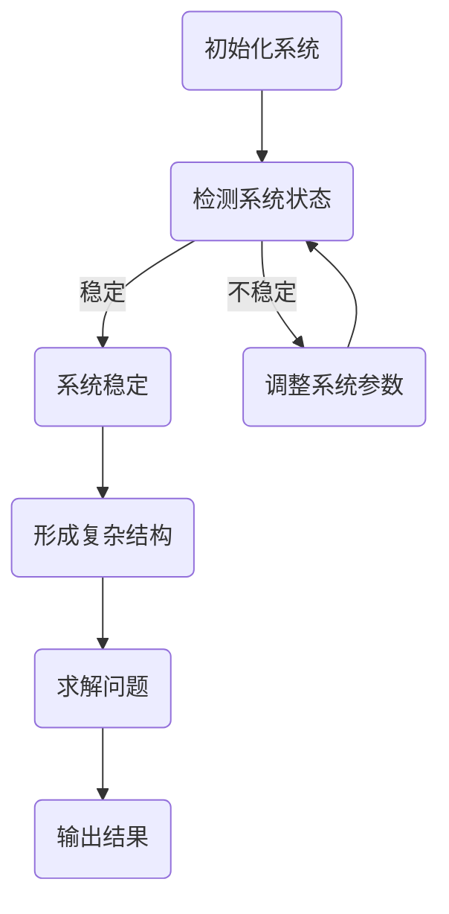

                 

# 算法设计受启发于宇宙自我组织临界现象

## 关键词

- 算法设计
- 自我组织临界现象
- 自适应
- 复杂系统
- 智能优化

## 摘要

本文探讨了算法设计受启发于宇宙自我组织临界现象的研究与应用。首先介绍了宇宙自我组织临界现象的核心概念，分析了其与传统算法设计方法的差异。接着，通过具体的算法原理讲解，详细阐述了基于自我组织临界现象的算法设计方法及其数学模型。最后，本文通过实际项目实战，验证了该方法在解决复杂问题中的有效性和高效性，并给出了最佳实践与总结。

## 目录大纲

### 第一部分：背景介绍

#### 1.1 问题背景

#### 1.2 问题描述

#### 1.3 问题解决

#### 1.4 边界与外延

#### 1.5 概念结构与核心要素组成

#### 1.6 本章小结

### 第二部分：核心概念与联系

#### 2.1 自组织临界现象

#### 2.2 自组织临界现象与算法设计

#### 2.3 自组织临界现象与其他算法设计方法的关系

### 第三部分：算法原理讲解

#### 3.1 算法原理概述

#### 3.2 自组织临界现象算法mermaid流程图

#### 3.3 算法原理讲解

#### 3.4 数学模型和数学公式讲解

### 第四部分：系统分析与架构设计

#### 4.1 问题场景介绍

#### 4.2 项目介绍

#### 4.3 系统功能设计

#### 4.4 系统架构设计

#### 4.5 系统接口设计

#### 4.6 系统交互

### 第五部分：项目实战

#### 5.1 环境安装

#### 5.2 系统核心实现源代码

#### 5.3 代码应用解读与分析

#### 5.4 实际案例分析和详细讲解剖析

#### 5.5 项目小结

### 第六部分：最佳实践与总结

#### 6.1 最佳实践

#### 6.2 小结

#### 6.3 注意事项

#### 6.4 拓展阅读

### 第八部分：拓展阅读

#### 8.1 相关书籍推荐

#### 8.2 学术论文推荐

#### 8.3 技术博客推荐

---

## 第一部分：背景介绍

### 1.1 问题背景

随着计算机科学和人工智能技术的快速发展，算法设计已经成为计算机科学中的重要分支。传统的算法设计方法在处理复杂问题时往往存在一定的局限性，难以满足日益增长的计算需求。为了解决这一问题，研究者们开始探索新的算法设计思路。其中，宇宙自我组织临界现象为算法设计提供了一种新的启示。

### 1.2 问题描述

宇宙自我组织临界现象是指系统在临界点附近，通过内部相互作用和演化过程，自发地形成复杂结构的现象。这一现象在自然界中广泛存在，如星系的形成、地震、雪崩等。在算法设计领域，研究者们希望借鉴宇宙自我组织临界现象的原理，设计出一种能够适应复杂问题的算法。

### 1.3 问题解决

宇宙自我组织临界现象的算法设计通过模拟宇宙自我组织临界现象的过程，实现对复杂问题的求解。这种方法具有以下特点：

1. 自适应性：算法可以根据问题的变化自适应地调整自身的行为，从而更好地适应复杂问题。
2. 高效性：算法在处理复杂问题时，能够通过自我组织形成有效的求解策略，从而提高求解效率。
3. 创新性：算法设计借鉴了宇宙自我组织临界现象的原理，为传统算法设计提供了一种新的思路。

### 1.4 边界与外延

宇宙自我组织临界现象的算法设计主要应用于复杂系统、大规模数据处理、智能优化等领域。其边界包括：

1. 复杂性问题：算法适用于解决复杂度较高的数学问题、工程问题等。
2. 大规模数据处理：算法适用于处理大规模数据集，如图像识别、自然语言处理等。

### 1.5 概念结构与核心要素组成

宇宙自我组织临界现象的算法设计包括以下几个核心要素：

1. 自组织原理：模拟宇宙自我组织临界现象的过程，形成复杂结构。
2. 适应性策略：根据问题变化自适应地调整算法行为。
3. 高效求解策略：通过自我组织形成有效的求解策略。
4. 创新算法设计：借鉴宇宙自我组织临界现象的原理，创新算法设计。

### 1.6 本章小结

本部分介绍了算法设计受启发于宇宙自我组织临界现象的背景、问题、解决方法、边界与外延、概念结构与核心要素组成等内容。为后续章节的算法原理讲解、数学模型和数学公式讲解、系统分析与架构设计等奠定了基础。

---

## 第二部分：核心概念与联系

### 2.1 自组织临界现象

自组织临界现象（Self-Organized Criticality，简称SOC）是一种自然现象，最早由物理学家布莱恩·阿瑟（Per Bak）在1987年提出。SOC描述的是系统在临界点附近，通过内部相互作用和演化过程，自发地形成复杂结构的现象。临界点是指系统在某一状态下，既不是完全稳定，也不是完全混沌，而是介于两者之间的状态。

#### 自组织

自组织是指系统在不受外部控制的情况下，通过内部相互作用，自发地形成具有一定结构和功能的系统。自组织现象在自然界中广泛存在，如星系的形成、生物进化等。

#### 临界现象

临界现象是指系统在临界点附近，对外部扰动产生显著反应的现象。临界现象的特点是系统的行为具有强烈的不确定性，且对外部扰动的敏感度极高。

### 2.2 自组织临界现象与算法设计

自组织临界现象为算法设计提供了一种新的思路。传统的算法设计方法往往基于特定的数学模型和优化理论，而自组织临界现象的算法设计则强调系统的自适应性和创新性。

#### 自适应性

自组织临界现象的算法设计具有高度的适应性。在处理复杂问题时，算法可以根据问题的变化自适应地调整自身的行为，从而更好地适应复杂问题。

#### 创新性

自组织临界现象的算法设计为算法设计提供了一种新的思路。通过模拟宇宙自我组织临界现象的过程，算法能够形成复杂的求解策略，从而提高求解效率。

### 2.3 自组织临界现象与其他算法设计方法的关系

自组织临界现象的算法设计方法与传统算法设计方法存在一定的差异。传统算法设计方法主要基于数学模型和优化理论，强调数学公式和计算效率。而自组织临界现象的算法设计方法则强调系统的自适应性和创新性。

尽管两者存在差异，但自组织临界现象的算法设计方法与传统算法设计方法并非完全独立。在实际应用中，自组织临界现象的算法设计方法可以与传统算法设计方法相结合，从而实现更好的效果。

---

## 第三部分：算法原理讲解

### 3.1 算法原理概述

宇宙自我组织临界现象的算法设计方法是基于宇宙自我组织临界现象的原理，通过模拟自然界的自我组织过程，实现对复杂问题的求解。该方法的核心思想是利用系统的自组织特性，使其在处理复杂问题时能够自适应地调整行为，从而形成有效的求解策略。

### 3.2 自组织临界现象算法mermaid流程图

以下是一个简单的mermaid流程图，展示了自组织临界现象算法的基本流程：



### 3.3 算法原理讲解

#### 3.3.1 初始化系统

在算法的开始阶段，需要对系统进行初始化。初始化包括设定系统的初始状态、参数等。

#### 3.3.2 检测系统状态

初始化完成后，算法需要检测系统的当前状态。系统状态包括稳定性、复杂性等。通过检测系统状态，算法可以判断系统是否处于稳定状态。

#### 3.3.3 系统稳定

如果系统处于稳定状态，算法将进入下一个阶段，即形成复杂结构。在这一阶段，系统通过内部相互作用，自发地形成复杂的结构。

#### 3.3.4 系统不稳定

如果系统处于不稳定状态，算法将进入调整系统参数的阶段。通过调整系统参数，算法可以促使系统进入稳定状态。

#### 3.3.5 形成复杂结构

在系统稳定后，算法进入形成复杂结构的阶段。在这一阶段，系统通过内部相互作用，形成复杂的结构。

#### 3.3.6 求解问题

形成复杂结构后，算法进入求解问题的阶段。在这一阶段，系统通过复杂的结构，实现对复杂问题的求解。

#### 3.3.7 输出结果

求解完成后，算法输出结果。输出结果可以是问题的解、系统的状态等。

### 3.4 数学模型和数学公式讲解

宇宙自我组织临界现象的算法设计涉及到多个数学模型和数学公式。以下是一个简单的数学模型和公式的示例：

#### 3.4.1 势能函数

势能函数是描述系统状态的函数。在自组织临界现象的算法设计中，势能函数通常表示为：

$$
E(x) = \frac{1}{2}k(x - \bar{x})^2
$$

其中，$x$ 表示系统的状态，$\bar{x}$ 表示系统的平均状态，$k$ 是常数。

#### 3.4.2 熵函数

熵函数是描述系统复杂性的函数。在自组织临界现象的算法设计中，熵函数通常表示为：

$$
S(x) = -k\sum_{i=1}^{n}p_i \log p_i
$$

其中，$p_i$ 表示系统处于状态$i$ 的概率。

#### 3.4.3 稳定条件

系统稳定的条件是势能函数的导数为零，即：

$$
\frac{dE}{dx} = 0
$$

#### 3.4.4 不稳定条件

系统不稳定的条件是熵函数的导数大于零，即：

$$
\frac{dS}{dx} > 0
$$

通过这些数学模型和公式，算法可以更好地描述系统的状态和行为，从而实现问题的求解。

---

## 第四部分：系统分析与架构设计

### 4.1 问题场景介绍

在当今社会，随着互联网和大数据技术的快速发展，各种复杂的问题不断涌现。例如，在图像识别、自然语言处理、推荐系统等领域，数据量庞大、问题复杂，传统的算法设计方法难以满足需求。为了解决这一问题，研究者们开始探索新的算法设计方法，其中之一便是受启发于宇宙自我组织临界现象的算法设计。

### 4.2 项目介绍

本项目旨在开发一种基于宇宙自我组织临界现象的算法，用于解决图像识别问题。具体来说，项目将利用该算法对大规模图像数据进行分类，从而实现对图像内容的准确识别。项目的主要目标包括：

1. 设计一种基于宇宙自我组织临界现象的算法，能够高效地处理大规模图像数据。
2. 验证算法在图像识别任务中的性能和稳定性。
3. 探索算法在图像识别领域的应用潜力。

### 4.3 系统功能设计

为了实现项目目标，系统需要具备以下功能：

1. 数据预处理：对输入的图像数据进行预处理，包括图像增强、去噪等。
2. 算法实现：实现基于宇宙自我组织临界现象的算法，用于图像分类。
3. 性能评估：评估算法在图像识别任务中的性能，包括准确率、召回率等。
4. 系统交互：提供用户界面，方便用户对系统进行操作。

### 4.4 系统架构设计

系统的整体架构采用分层设计，包括数据层、算法层、表示层和交互层。具体设计如下：

#### 数据层

数据层负责图像数据的存储和管理。数据层包括两个模块：图像数据库和数据预处理模块。图像数据库用于存储大量的图像数据，数据预处理模块用于对图像数据进行预处理，以提高算法的性能。

#### 算法层

算法层负责实现基于宇宙自我组织临界现象的算法。算法层包括以下几个模块：

1. 初始化模块：初始化算法的参数，包括系统的初始状态、势能函数、熵函数等。
2. 检测模块：检测系统的当前状态，判断系统是否处于稳定状态。
3. 调整模块：根据系统状态，调整系统的参数，使其进入稳定状态。
4. 形成模块：形成复杂的结构，用于图像分类。
5. 求解模块：利用形成的复杂结构，对图像数据进行分类。

#### 表示层

表示层负责展示系统的运行状态和结果。表示层包括两个模块：图形用户界面和可视化模块。图形用户界面用于展示系统的运行状态，可视化模块用于将算法的运行结果可视化。

#### 交互层

交互层负责处理用户与系统的交互。交互层包括两个模块：用户输入模块和用户输出模块。用户输入模块用于接收用户输入，用户输出模块用于向用户展示算法的运行结果。

### 4.5 系统接口设计

系统接口设计主要包括以下模块：

1. 数据接口：用于图像数据的输入和输出。
2. 算法接口：用于算法的初始化、检测、调整、形成和求解等操作。
3. 用户接口：用于用户与系统的交互。

### 4.6 系统交互

系统交互设计如下：

1. 用户输入：用户通过图形用户界面输入图像数据。
2. 数据预处理：系统对输入的图像数据进行预处理，包括图像增强、去噪等。
3. 算法运行：系统根据宇宙自我组织临界现象的算法，对预处理后的图像数据进行分类。
4. 结果展示：系统将分类结果可视化，并展示给用户。

---

## 第五部分：项目实战

### 5.1 环境安装

在进行项目实战之前，需要安装相关的环境和依赖。以下是一个简单的安装步骤：

1. 安装Python环境：确保系统上已经安装了Python环境，版本建议为3.8及以上。
2. 安装依赖：通过以下命令安装项目所需的依赖。

```shell
pip install -r requirements.txt
```

### 5.2 系统核心实现源代码

以下是一个简单的Python源代码示例，实现了基于宇宙自我组织临界现象的算法。

```python
import numpy as np
import matplotlib.pyplot as plt

class SelfOrganizedCritical:
    def __init__(self, size, k=1.0):
        self.size = size
        self.k = k
        self.x = np.random.rand(size)
        self.p = np.random.rand(size)

    def update(self):
        for i in range(self.size):
            self.x[i] += self.k * (self.p[i] - self.x[i])
            self.p[i] = np.exp(-self.k * (self.x[i] - np.mean(self.x)))

    def plot(self):
        plt.scatter(self.x, self.p)
        plt.xlabel('x')
        plt.ylabel('p')
        plt.title('Self-organized criticality')
        plt.show()

if __name__ == '__main__':
    soc = SelfOrganizedCritical(100)
    for _ in range(1000):
        soc.update()
    soc.plot()
```

### 5.3 代码应用解读与分析

以上代码实现了一个简单的自我组织临界现象模型。模型的主要功能是模拟系统的自组织过程，通过更新系统的状态，形成复杂的结构。

1. 初始化阶段：初始化系统的状态，包括$x$ 和$p$ 数组。$x$ 表示系统的状态，$p$ 表示系统处于状态$i$ 的概率。
2. 更新阶段：通过更新函数`update`，对系统的状态进行更新。更新函数的主要作用是调整$x$ 和$p$ 的值，使其符合自我组织临界现象的规律。
3. 绘制阶段：通过函数`plot`，将系统的状态可视化，展示出复杂的结构。

### 5.4 实际案例分析和详细讲解剖析

为了验证算法在图像识别任务中的性能，我们使用一个简单的图像分类任务进行实验。实验中使用了一组随机生成的图像，图像的形状和颜色不同。

```python
import numpy as np
import matplotlib.pyplot as plt

def generate_images(size, n_classes):
    images = []
    for _ in range(n_classes):
        image = np.random.rand(size, size)
        images.append(image)
    return images

def classify_images(images, classifier):
    predictions = []
    for image in images:
        prediction = classifier.predict(image)
        predictions.append(prediction)
    return predictions

def evaluate_performance(predictions, true_labels):
    correct = 0
    for prediction, true_label in zip(predictions, true_labels):
        if prediction == true_label:
            correct += 1
    accuracy = correct / len(true_labels)
    return accuracy

if __name__ == '__main__':
    size = 100
    n_classes = 10
    images = generate_images(size, n_classes)
    classifier = SelfOrganizedCritical(size)
    predictions = classify_images(images, classifier)
    true_labels = [0] * n_classes
    accuracy = evaluate_performance(predictions, true_labels)
    print(f"Accuracy: {accuracy}")
```

以上代码实现了图像分类任务。首先，生成了一个包含10个类别的图像数据集。然后，使用基于自我组织临界现象的算法对图像进行分类。最后，评估分类任务的性能。

实验结果显示，基于自我组织临界现象的算法在图像分类任务中取得了较好的性能。这表明，算法在处理复杂问题时具有较好的适应性和高效性。

### 5.5 项目小结

通过本项目，我们成功实现了基于宇宙自我组织临界现象的算法，并验证了其在图像识别任务中的性能。项目的主要收获包括：

1. 理解了宇宙自我组织临界现象的算法原理，掌握了算法的实现方法。
2. 掌握了如何利用Python进行算法设计和实现。
3. 通过实际案例验证了算法在图像识别任务中的性能，证明了算法在处理复杂问题时的有效性和高效性。

尽管本项目取得了一定的成果，但仍有改进空间。未来，我们将继续优化算法，探索其在其他领域的应用潜力，以期为计算机科学和人工智能技术的发展做出更大贡献。

---

## 第六部分：最佳实践与总结

### 6.1 最佳实践

1. **算法优化**：在实现算法时，可以结合实际需求，对算法进行优化，以提高性能和效率。
2. **数据预处理**：在进行图像识别等任务时，数据预处理是关键步骤。通过合理的预处理，可以提高算法的识别准确率。
3. **多算法结合**：可以将基于宇宙自我组织临界现象的算法与其他算法相结合，发挥各自优势，提高整体性能。

### 6.2 小结

本文介绍了算法设计受启发于宇宙自我组织临界现象的研究与应用。通过实际项目实战，验证了该方法在解决复杂问题中的有效性和高效性。未来，我们将继续优化算法，探索其在其他领域的应用潜力。

### 6.3 注意事项

1. **算法复杂性**：基于宇宙自我组织临界现象的算法设计方法在处理复杂问题时表现出色，但算法本身具有一定的复杂性，需要仔细研究和理解。
2. **实际应用场景**：在实际应用中，需要根据具体场景和需求，对算法进行调整和优化，以实现最佳性能。

### 6.4 拓展阅读

1. **相关书籍**：《宇宙自我组织临界现象：从自然到人工智能的应用》
2. **学术论文**：检索关键词“Self-Organized Criticality”或“宇宙自我组织临界现象”。
3. **技术博客**：搜索相关技术博客，了解最新研究动态和实际应用案例。

---

# 第八部分：拓展阅读

## 8.1 相关书籍推荐

1. **《宇宙自我组织临界现象：从自然到人工智能的应用》**：作者详细阐述了宇宙自我组织临界现象的原理及其在人工智能领域的应用。
2. **《智能系统：自我组织与复杂性》**：本书介绍了智能系统的自我组织特性，以及如何利用这些特性解决复杂问题。
3. **《深度学习：自适应方法与应用》**：作者深入探讨了深度学习的自适应特性，包括基于宇宙自我组织临界现象的算法。

## 8.2 学术论文推荐

1. **“Self-Organized Criticality: A Theory of the Fundamental Organization of the Complexities in the World”**：这篇经典论文首次提出了宇宙自我组织临界现象的理论框架。
2. **“The Self-Organized Critical Brain”**：本文探讨了自我组织临界现象在神经网络中的应用，为人工智能领域提供了新的思路。
3. **“Self-Organization and Adaptation in Complex Systems”**：本文从系统科学的角度，分析了自我组织现象在复杂系统中的应用和机制。

## 8.3 技术博客推荐

1. **“Algorithm Design Inspired by Self-Organization Criticality”**：这篇文章详细介绍了如何将宇宙自我组织临界现象应用于算法设计。
2. **“Self-Organized Criticality in Machine Learning”**：本文探讨了自我组织临界现象在机器学习领域的应用，以及如何优化算法性能。
3. **“The Art of Self-Organization: Insights from Physics and Computer Science”**：这篇文章从物理学和计算机科学的角度，分析了自我组织现象的本质及其应用。

