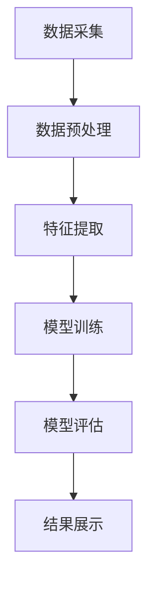
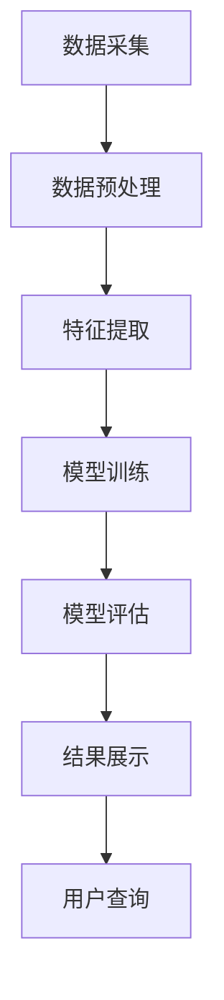

                 

## 1.1.1 算法设计的重要性

算法设计作为计算机科学的核心领域之一，对现代科技的进步起到了至关重要的作用。在现代社会中，无论是信息处理、人工智能、机器学习，还是各种应用程序的底层实现，算法都是必不可少的组成部分。一个高效、合理的算法可以大幅提升系统的性能和效率，减少计算资源的使用，甚至在某些场景下直接影响到决策的正确性和安全性。

首先，算法设计是解决复杂问题的基础。在计算机科学中，算法提供了一套系统化的解决问题的方法。无论是排序、查找、图论问题，还是更高级的优化和机器学习问题，算法都能够通过一系列规则和步骤，将这些复杂问题转化为可计算的任务。例如，排序算法可以快速地对大量数据进行排序，使得后续的处理更加高效；图论算法则可以用于社交网络分析、交通路线规划等实际应用场景。

其次，算法设计直接影响着系统的性能。一个好的算法能够在有限的时间内完成计算任务，减少系统的等待时间和资源消耗。在实际应用中，这往往意味着更高的响应速度和更好的用户体验。例如，搜索引擎需要快速地处理海量的数据，以提供用户准确的信息检索结果；而金融交易系统则需要实时处理大量的交易请求，确保交易的高效和安全。

此外，算法设计也是推动技术进步的关键因素。随着科技的不断发展，新的算法不断涌现，推动了计算机科学和信息技术领域的进步。例如，深度学习算法的广泛应用，使得图像识别、语音识别等人工智能技术取得了重大突破；分布式算法的研究则推动了云计算和大数据处理技术的发展。

综上所述，算法设计不仅是一个技术性的问题，更是关乎系统性能、用户体验和技术进步的关键因素。因此，深入研究和理解算法设计的基本原理和技巧，对于计算机科学家和工程师来说，都是至关重要的。在接下来的内容中，我们将进一步探讨算法设计的核心概念、原理和方法，以帮助读者更好地理解和应用这些知识。

## 1.1.2 自组织临界现象概述

自组织临界现象（Self-Organization Critical Phenomenon，简称SOC）是物理学中的一个重要概念，最早由瑞典物理学家Per Bak在1987年提出。自组织临界现象描述的是一种自然现象，即在一个动态系统中，通过不断的相互作用和调整，系统最终达到一种临界状态，这种状态具有极高的弹性和适应性，能够在面对外界干扰时迅速恢复。

### 自组织临界现象的基本原理

自组织临界现象的基本原理可以概括为以下几点：

1. **临界态**：系统处于一种临界状态，这种状态介于稳定和不稳定之间，具有最高的复杂性和多样性。
2. **非线性相互作用**：系统内部各元素之间存在着复杂的非线性相互作用，这些相互作用导致了系统整体的动态行为。
3. **自适应性**：系统具有自我调整的能力，能够根据外界环境的变化自动调整自身状态，以保持临界状态。
4. **局域适应性**：系统在局部范围内具有适应性，但整体上却表现出全局性质的临界行为。

### 自组织临界现象的特点

自组织临界现象具有以下几个显著特点：

1. **无标度性**：系统在临界状态时，其结构或行为不受尺度的影响，即系统在不同尺度上具有相似的结构或行为。
2. **长程相关性**：系统内部各部分之间存在长程相关性，即远距离之间的元素相互作用仍然显著。
3. **适应性**：系统能够在外界干扰下迅速恢复，表现出高度的弹性。
4. **临界慢涨**：在临界状态附近，系统的某些物理量随时间的增长表现出慢涨行为。

### 自组织临界现象的应用

自组织临界现象在多个领域有着广泛的应用：

1. **自然界**：在自然界中，许多系统如沙堆、河流网络、生态系统等，都表现出自组织临界现象的特征。
2. **社会科学**：在社会科学中，自组织临界现象可以用于解释股市波动、社会网络的演化、群体行为等。
3. **计算机科学**：在计算机科学中，自组织临界现象可以用于设计自适应算法、网络结构优化等。

### 自组织临界现象与算法设计的关联

自组织临界现象与算法设计有着密切的联系。通过借鉴自组织临界现象的原理，算法设计者可以在算法中引入非线性相互作用、局域适应性和无标度性等特性，从而设计出具有高弹性、高适应性、高效能的算法。例如，在分布式系统中，通过引入自组织临界现象的原理，可以设计出具有高度容错性和自我调整能力的分布式算法，从而提高系统的整体性能。

综上所述，自组织临界现象作为一种复杂的自然现象，不仅在物理学中有着重要的研究价值，也为算法设计提供了新的思路和方法。在接下来的章节中，我们将进一步探讨自组织临界现象的数学模型，以及如何将其应用于算法设计中。

## 1.1.3 书籍目的和结构

本书的目的是探讨算法设计如何受到自组织临界现象（SOC）的启发，从而设计出更加高效、灵活且具有自适应性的算法。本书结构分为四个主要部分，旨在从基础到应用，逐步深入探讨这一主题。

### 第一部分：引言

这一部分主要介绍算法设计的重要性和自组织临界现象的概述，帮助读者建立对核心概念的理解。具体内容包括：

- **1.1 算法设计的重要性**：介绍算法设计在现代科技中的作用，以及其在解决复杂问题、提升系统性能和推动技术进步方面的关键作用。
- **1.2 自组织临界现象概述**：简要介绍自组织临界现象的基本原理、特点及其在自然界和科技领域的应用。
- **1.3 书籍目的和结构**：明确本书的目的和整体结构，为读者提供阅读指南。

### 第二部分：算法设计原则

这一部分将深入探讨自组织临界现象的原理如何影响和指导算法设计。具体内容包括：

- **2.1 自组织临界现象与算法设计**：分析自组织临界现象的基本特点，探讨如何在算法设计中应用这些特点，以设计出更高效、灵活的算法。
- **2.2 算法设计流程与方法**：介绍算法设计的标准流程和方法，以及如何在设计过程中引入自组织临界现象的原理。
- **2.3 算法性能分析与优化**：讨论算法性能的评估指标、优化策略，以及如何通过自组织临界现象的原理来提升算法性能。

### 第三部分：算法案例研究

这一部分将通过具体的算法案例，展示如何将自组织临界现象的原理应用于实际算法设计中。具体内容包括：

- **3.1 案例研究一：网络路由算法**：分析网络路由算法的设计和应用，展示如何借鉴自组织临界现象的原理进行优化。
- **3.2 案例研究二：数据挖掘算法**：探讨数据挖掘算法的设计和应用，展示如何在数据挖掘过程中引入自组织临界现象的原理。

### 第四部分：结论与未来方向

这一部分将总结本书的主要内容，提出算法设计领域未来的研究方向，为读者提供进一步的研究和探索方向。具体内容包括：

- **4.1 结论**：总结本书的核心观点和研究成果，强调自组织临界现象在算法设计中的重要性。
- **4.2 未来方向**：提出算法设计领域未来的研究方向，包括新的算法设计方法、应用领域拓展等。

通过以上结构，本书旨在为读者提供一部全面、系统的算法设计指南，帮助读者理解和掌握如何将自组织临界现象的原理应用于算法设计中，从而设计出更加高效、灵活且具有自适应性的算法。希望读者能够在阅读本书后，能够有所启发，并在实际的算法设计中取得突破性的进展。

## 1.2 核心概念与联系

在深入探讨算法设计受自组织临界现象（SOC）启发之前，我们需要明确几个核心概念，并了解它们之间的联系。这些核心概念不仅构成了本书的基础，也为后续章节的讨论提供了必要的背景知识。

### 算法设计

算法设计是指创建一系列明确的步骤或规则，以解决特定的问题。算法的核心特征包括确定性、正确性和效率。确定性意味着给定相同的输入，算法总是产生相同的结果；正确性则保证算法能够解决特定问题；效率包括时间效率和空间效率，即算法在时间和空间资源上的使用应尽可能少。

### 自组织临界现象

自组织临界现象（SOC）是一个物理学概念，描述的是一个系统在没有外部干预的情况下，通过内部相互作用逐渐达到一种临界状态，这种状态具有高度的复杂性和适应性。SOC的关键特征包括无标度性、长程相关性和临界慢涨行为。

### 无标度网络

无标度网络（Scale-Free Network）是一种网络结构，其节点的度分布服从幂律分布。在无标度网络中，少数节点拥有大量连接，而大多数节点连接较少。这种结构在自然界和人工系统中广泛存在，如互联网、社交网络等。

### 非线性相互作用

非线性相互作用是指系统内部各元素之间相互作用的关系不是线性的，这意味着输出不是输入的简单放大或缩小。非线性相互作用会导致系统的动态行为具有复杂性，从而产生新的现象。

### 自适应系统

自适应系统是指能够根据外界环境变化自我调整的系统。在算法设计中，自适应系统意味着算法能够根据数据特征、任务需求等动态调整自身行为，以提高效率和准确性。

### 关系与联系

这些核心概念之间的联系如下：

- **算法设计与自组织临界现象**：算法设计可以从自组织临界现象中借鉴无标度网络的结构和自适应系统的原理，以设计出具有高弹性、高适应性的算法。
- **无标度网络与非线性和相互作用**：无标度网络中的非线性相互作用导致了网络结构的高度复杂性，这种复杂性在自组织临界现象中得到了体现。
- **自适应系统与算法设计**：自适应系统能够根据外部环境动态调整，这种动态调整的原理可以应用于算法设计，使算法能够适应不同的任务需求。

通过理解这些核心概念及其相互关系，我们可以更好地理解本书的主题，即如何利用自组织临界现象的原理来设计和优化算法。在接下来的章节中，我们将详细探讨自组织临界现象的数学模型，并逐步展示其如何应用于算法设计中。

## 1.3 自组织临界现象的数学模型

为了深入理解自组织临界现象（SOC），我们需要引入一系列数学模型，这些模型能够帮助我们描述和解释SOC的基本特性。以下是几种常见的数学模型及其在SOC中的应用：

### 1.3.1 分支点理论

分支点理论是研究系统如何从一种稳定状态过渡到另一种稳定状态的理论。在SOC中，分支点理论描述了系统如何从一个无序状态逐步过渡到一个临界状态，并在临界状态保持动态平衡。

#### 关键概念

- **临界状态**：系统处于一种介于稳定与不稳定之间的状态，具有高度的复杂性和适应性。
- **分支点**：系统状态变化的转折点，从一种稳定状态过渡到另一种稳定状态的临界点。

#### 数学模型

- **分叉方程**：描述系统状态变化过程的微分方程，如非线性方程组。例如，洛伦兹系统中的方程可以表示为：

  $$\frac{dx}{dt} = \sigma (y - x)$$
  $$\frac{dy}{dt} = x (\rho - z) - y$$
  $$\frac{dz}{dt} = xy - \beta z$$

其中，$x$、$y$、$z$ 分别代表系统的三个状态变量，$\sigma$、$\rho$ 和 $\beta$ 是参数。

### 1.3.2 相变理论

相变理论描述的是物质从一种相态过渡到另一种相态的过程，如液态变为气态。SOC中的相变理论则描述系统从一种结构状态过渡到另一种结构状态的动态过程。

#### 关键概念

- **临界点**：系统相变过程中，系统性质发生突变的临界状态。
- **热力学临界现象**：系统在临界点附近表现出的一些特殊行为，如临界指数、慢涨行为等。

#### 数学模型

- **相变方程**：描述相变过程中系统状态变化的方程，如高斯分布、朗道理论中的有序参数方程等。

  高斯分布方程示例：

  $$f(x) = \frac{1}{\sqrt{2\pi\sigma^2}} e^{-\frac{(x-\mu)^2}{2\sigma^2}}$$

  其中，$x$ 是变量，$\mu$ 是均值，$\sigma^2$ 是方差。

### 1.3.3 自相似性理论

自相似性理论描述的是系统在不同尺度上具有相似结构的性质。在SOC中，自相似性理论强调系统在不同层次上表现出相似的动态行为。

#### 关键概念

- **自相似性**：系统在不同尺度上具有相似的结构和性质。
- **分形**：一种具有无限层次结构的几何对象，其整体和局部在形态上具有相似性。

#### 数学模型

- **分形维数**：用于描述自相似系统的维数，它不同于传统的整数维数，可以是分数或无理数。

  例如，科赫曲线的分形维数是1.261。

- **分形几何模型**：描述自相似结构的数学模型，如科赫曲线、谢宾曲线等。

### 应用与解释

这些数学模型在解释和模拟SOC现象中起着关键作用。分支点理论帮助我们理解系统如何从稳定状态过渡到临界状态，相变理论则描述了系统在临界点附近的行为特征，而自相似性理论则揭示了系统在不同尺度上的一致性。

在算法设计中，这些模型可以用于：

- **无标度网络的设计**：通过引入自相似性理论，设计出具有高弹性、高适应性的网络结构，如互联网和社交网络。
- **自适应算法的开发**：利用分支点理论和相变理论，设计能够适应动态变化的算法，如机器学习中的自适应优化算法。
- **复杂系统的模拟**：通过构建分形几何模型，模拟复杂系统的动态行为，为算法设计提供指导。

通过理解这些数学模型，我们可以更好地将自组织临界现象的原理应用于算法设计，从而设计出更加高效、灵活的算法。

## 1.4 本书结构与内容安排

为了帮助读者更好地理解本书的内容和结构，我们将详细介绍各章节的内容安排和预期达到的目标。以下是本书的结构安排：

### 引言

引言部分主要介绍算法设计的重要性以及自组织临界现象的概述。具体内容包括：

- **算法设计的重要性**：阐述算法设计在现代科技中的作用，以及其在解决复杂问题、提升系统性能和推动技术进步方面的关键作用。
- **自组织临界现象概述**：简要介绍自组织临界现象的基本原理、特点及其在自然界和科技领域的应用。
- **书籍目的和结构**：明确本书的目的和整体结构，为读者提供阅读指南。

### 第二部分：算法设计原则

这一部分将深入探讨自组织临界现象的原理如何影响和指导算法设计。具体内容包括：

- **2.1 自组织临界现象与算法设计**：分析自组织临界现象的基本特点，探讨如何在算法设计中应用这些特点，以设计出更高效、灵活的算法。
- **2.2 算法设计流程与方法**：介绍算法设计的标准流程和方法，以及如何在设计过程中引入自组织临界现象的原理。
- **2.3 算法性能分析与优化**：讨论算法性能的评估指标、优化策略，以及如何通过自组织临界现象的原理来提升算法性能。

### 第三部分：算法案例研究

这一部分将通过具体的算法案例，展示如何将自组织临界现象的原理应用于实际算法设计中。具体内容包括：

- **3.1 案例研究一：网络路由算法**：分析网络路由算法的设计和应用，展示如何借鉴自组织临界现象的原理进行优化。
- **3.2 案例研究二：数据挖掘算法**：探讨数据挖掘算法的设计和应用，展示如何在数据挖掘过程中引入自组织临界现象的原理。

### 第四部分：结论与未来方向

这一部分将总结本书的主要内容，提出算法设计领域未来的研究方向。具体内容包括：

- **4.1 结论**：总结本书的核心观点和研究成果，强调自组织临界现象在算法设计中的重要性。
- **4.2 未来方向**：提出算法设计领域未来的研究方向，包括新的算法设计方法、应用领域拓展等。

通过以上结构，本书旨在为读者提供一部全面、系统的算法设计指南，帮助读者理解和掌握如何将自组织临界现象的原理应用于算法设计中，从而设计出更加高效、灵活且具有自适应性的算法。希望读者能够在阅读本书后，能够有所启发，并在实际的算法设计中取得突破性的进展。

### 1.4.1 各章节内容概述

为了帮助读者更清晰地了解本书各章节的内容，下面将详细介绍各章的核心内容和目标。

#### 第1章：引言

**主要内容**：
- 算法设计的重要性
- 自组织临界现象概述
- 书籍目的和结构

**目标**：
- 建立对算法设计和自组织临界现象的基本理解
- 明确书籍的研究目的和结构安排

#### 第2章：算法设计原则

**主要内容**：
- 自组织临界现象与算法设计
- 算法设计流程与方法
- 算法性能分析与优化

**目标**：
- 探讨自组织临界现象如何影响算法设计
- 学习算法设计的标准流程和方法
- 掌握算法性能评估和优化策略

#### 第3章：算法设计原则（续）

**主要内容**：
- 自适应系统与算法设计
- 分支点理论在算法设计中的应用
- 相变理论在算法设计中的应用

**目标**：
- 理解自适应系统在算法设计中的重要性
- 学习分支点理论和相变理论在算法设计中的应用

#### 第4章：算法案例研究一：网络路由算法

**主要内容**：
- 网络路由算法背景
- 算法设计过程
- 数学模型与应用

**目标**：
- 分析网络路由算法的优化方法
- 学习如何应用自组织临界现象原理

#### 第5章：算法案例研究二：数据挖掘算法

**主要内容**：
- 数据挖掘算法背景
- 算法设计过程
- 数学模型与应用

**目标**：
- 分析数据挖掘算法的优化方法
- 学习如何应用自组织临界现象原理

#### 第6章：比较与分析

**主要内容**：
- 算法性能比较
- 不同算法的优缺点分析
- 案例研究结果的总结

**目标**：
- 了解不同算法的性能和适用场景
- 比较算法优缺点，为实际应用提供指导

#### 第7章：实际应用

**主要内容**：
- 自组织临界现象在现实世界中的应用
- 算法设计的实际案例
- 应用效果与案例分析

**目标**：
- 探讨算法设计的实际应用价值
- 提供实际应用场景的案例分析

#### 第8章：结论与未来方向

**主要内容**：
- 本书总结
- 未来研究方向

**目标**：
- 总结本书的核心观点和研究成果
- 提出算法设计领域未来的研究方向

通过上述各章节的内容概述，读者可以全面了解本书的结构和内容安排，为深入学习和应用算法设计原理奠定基础。

### 1.4.2 阅读指南

为了确保读者能够充分理解和吸收本书中的内容，以下是一些建议的阅读指南：

1. **循序渐进阅读**：
   - 按照章节顺序阅读，每章内容都建立在前面章节的基础上，有助于逐步建立对核心概念的理解。
   - 对于初次接触算法设计或自组织临界现象的读者，建议先阅读引言部分，了解基本概念和书籍结构。

2. **深入理解核心概念**：
   - 对于每个章节，仔细阅读并理解其中的核心概念和理论，尤其是涉及数学模型的章节，可以通过绘制思维导图或制作笔记来加深记忆。
   - 在阅读过程中，注意章节末尾的小结部分，这有助于总结和巩固所学内容。

3. **动手实践**：
   - 对于算法案例研究章节，建议尝试实现案例中的算法，通过编程实践来深入理解算法的设计原理和实现细节。
   - 可以参考书中提供的代码示例，编写自己的代码并进行测试，以验证算法的实际效果。

4. **互动与讨论**：
   - 加入相关的技术论坛和社群，与其他读者和专家进行互动和讨论，分享学习心得和经验。
   - 参与线上或线下的技术交流会议，拓展视野，获取更多的灵感和见解。

5. **持续学习与探索**：
   - 算法设计和自组织临界现象是一个不断发展的领域，建议读者持续关注最新的研究成果和进展。
   - 阅读相关的学术文章和技术博客，参加专业会议和研讨会，保持对前沿技术的敏感度。

通过遵循以上阅读指南，读者可以更加高效地学习和应用本书中的知识，提升自己在算法设计领域的专业能力和技术水平。

## 2.1 自组织临界现象与算法设计

自组织临界现象（Self-Organization Critical Phenomenon，SOC）是一个源于物理学的重要概念，描述了系统在无需外部干预的情况下，通过内部相互作用逐渐达到一种临界状态，并在该状态表现出高度的复杂性和适应性。自组织临界现象在自然界和社会科学中有着广泛的应用，如沙堆的形成、生态系统演化、金融市场的波动等。近年来，研究者们开始探索自组织临界现象在算法设计中的应用，以期设计出更加高效、灵活且具有自适应性的算法。

### 自组织临界现象的基本特点

自组织临界现象具有以下几个显著特点：

1. **无标度性**：系统在不同尺度上具有相似的结构和特性，即整体和局部在形态上具有一致性。
2. **长程相关性**：系统内部各部分之间存在长期的相互作用和依赖，这种长程相关性使得系统对外界干扰具有高度的适应性。
3. **局域适应性**：系统在局部范围内能够根据外界环境变化自我调整，但这种调整不破坏系统的整体结构和功能。
4. **临界慢涨**：在临界状态附近，系统的某些物理量随时间的增长表现出慢涨行为，这种现象称为临界慢涨。

### 自组织临界现象在算法设计中的应用

自组织临界现象的原理可以应用于算法设计中，以设计出更加高效、灵活且具有自适应性的算法。以下是几种常见的方法：

1. **无标度网络设计**：
   无标度网络是自组织临界现象的一种典型表现。在算法设计中，可以借鉴无标度网络的结构特性，设计出具有高弹性、高容错性的网络结构。例如，在分布式系统中，通过构建无标度网络，可以提高系统的稳定性和鲁棒性，减少节点失效对系统整体性能的影响。

2. **自适应算法设计**：
   自组织临界现象强调系统的局域适应性和全局稳定性。在算法设计中，可以借鉴这一原理，设计出能够根据外界环境变化动态调整自身行为的自适应算法。例如，在机器学习中的自适应优化算法，通过不断调整参数，使算法能够在不同数据集和任务需求下保持高效性能。

3. **自相似算法设计**：
   自相似性是自组织临界现象的一个重要特征，意味着系统在不同尺度上具有相似的结构和特性。在算法设计中，可以借鉴自相似性原理，设计出能够适应不同规模和复杂度的算法。例如，在图像处理中，通过设计具有自相似性的滤波器，可以提高图像处理的精度和效率。

4. **分支点算法设计**：
   分支点理论是自组织临界现象的一个重要组成部分，描述了系统如何从一种稳定状态过渡到另一种稳定状态。在算法设计中，可以借鉴分支点理论，设计出能够在不同状态间切换的算法，以提高系统的适应性和灵活性。

### 设计原则与实践

在算法设计中，结合自组织临界现象的原理，可以提出以下设计原则：

1. **无标度性原则**：设计具有无标度特性的网络结构，以提高系统的稳定性和鲁棒性。
2. **自适应原则**：设计能够根据外界环境变化动态调整自身行为的算法，以适应不同的任务需求。
3. **自相似性原则**：设计具有自相似特性的算法，以提高在不同尺度上的适应性和效率。
4. **分支点原则**：设计能够在不同状态间灵活切换的算法，以提高系统的适应性和灵活性。

以下是一个简单的实例，说明如何将自组织临界现象的原理应用于算法设计中：

#### 实例：自适应路由算法

背景：在分布式网络中，节点可能因为各种原因（如故障、负载变化等）而动态加入或退出网络。设计一个自适应路由算法，使得网络能够根据节点状态的变化动态调整路由策略，以提高整体网络的性能和可靠性。

设计思路：
1. **无标度网络结构**：构建一个无标度网络结构，以增加网络的稳定性和鲁棒性。
2. **自适应路由策略**：设计一个自适应路由策略，根据节点的状态变化动态调整路由路径。
3. **自相似性路由策略**：设计一个具有自相似性的路由策略，以适应不同规模和复杂度的网络结构。
4. **分支点路由策略**：设计一个能够根据网络状态在不同路由策略间灵活切换的算法，以提高网络的适应性和灵活性。

具体实现：
1. **网络拓扑**：使用无标度网络模型（如Barabási-Albert模型）生成网络拓扑结构。
2. **状态监测**：监控网络中各个节点的状态，包括节点负载、节点健康状况等。
3. **路由策略**：根据节点状态，设计自适应路由策略，如动态调整权重、路径选择等。
4. **策略切换**：根据网络状态的变化，在不同路由策略间进行切换，如从基于距离的路由策略切换到基于负载的路由策略。

通过上述设计，我们可以得到一个具有高弹性、高适应性、高效能的分布式网络路由算法，从而提高整体网络的性能和可靠性。

综上所述，自组织临界现象为算法设计提供了一种新的视角和方法。通过借鉴自组织临界现象的原理，我们可以设计出更加高效、灵活且具有自适应性的算法，为解决复杂问题提供新的思路和工具。在接下来的章节中，我们将进一步探讨算法设计流程与方法，以及如何具体实现这些设计原则。

## 2.2 算法设计流程与方法

在将自组织临界现象（SOC）应用于算法设计时，遵循一个系统化的设计流程是至关重要的。以下是一个典型的算法设计流程，结合自组织临界现象的原理，分为几个关键步骤：

### 2.2.1 设计流程

1. **问题定义与需求分析**：
   - **明确问题**：准确描述需要解决的问题，包括问题的背景、目标、约束条件等。
   - **需求分析**：分析问题的具体需求，包括功能需求、性能需求、可靠性需求等。

2. **方案构思与探索**：
   - **灵感来源**：从自组织临界现象的理论中获取灵感，思考如何将无标度性、自适应性和自相似性等特性融入算法设计中。
   - **初步方案**：提出多个可能的算法设计方案，进行初步评估和比较。

3. **算法设计与实现**：
   - **算法框架**：基于初步方案，设计算法的框架和基本结构。
   - **具体实现**：详细设计算法的每个步骤和规则，编写代码实现。

4. **性能分析与优化**：
   - **评估指标**：确定算法性能的评估指标，如时间效率、空间效率、适应性和鲁棒性等。
   - **性能优化**：分析算法的性能瓶颈，通过调整参数、改进算法结构等方法进行优化。

5. **测试与验证**：
   - **单元测试**：对算法的每个部分进行单元测试，确保其正确性。
   - **集成测试**：将算法集成到系统中，进行整体测试，确保其在实际应用中的性能和可靠性。

6. **结果分析与总结**：
   - **性能分析**：分析算法在各种场景下的表现，与初始需求和预期目标进行对比。
   - **总结与改进**：总结设计过程中的经验教训，提出改进方案和未来研究方向。

### 2.2.2 常用设计方法

在算法设计中，结合自组织临界现象的原理，可以采用以下几种设计方法：

1. **分形方法**：
   - **原理**：分形方法借鉴自相似性原理，设计出在不同尺度上具有相似特性的算法。
   - **应用**：例如，在图像处理中，可以使用分形插值算法进行图像缩放，保持图像质量。

2. **自相似网络设计**：
   - **原理**：通过构建具有自相似特性的网络结构，提高系统的稳定性和鲁棒性。
   - **应用**：在分布式系统中，设计自相似的网络结构，提高系统的容错能力和适应性。

3. **自适应算法设计**：
   - **原理**：借鉴自适应系统的原理，设计能够根据外界环境变化动态调整自身行为的算法。
   - **应用**：在机器学习中的自适应优化算法，通过调整参数，提高算法在不同数据集上的性能。

4. **分支点算法设计**：
   - **原理**：借鉴分支点理论，设计能够在不同状态间灵活切换的算法。
   - **应用**：在动态资源管理中，设计基于分支点的算法，根据系统负载动态调整资源分配策略。

### 2.2.3 设计工具与资源

在进行算法设计时，可以使用以下工具和资源来辅助设计过程：

1. **算法设计工具**：
   - **伪代码工具**：用于编写和调试算法伪代码，如Online Algorithm Designer。
   - **可视化工具**：用于可视化算法流程和结构，如Mermaid、Lucidchart等。

2. **编程语言与库**：
   - **Python**：广泛应用于算法设计和数据分析，拥有丰富的库和框架，如NumPy、Pandas、Scikit-learn等。
   - **MATLAB**：适用于数值计算和算法验证，具有强大的工具箱和函数库。

3. **参考文献与资料**：
   - **经典算法书籍**：如《算法导论》、《算法艺术与科学》等，提供详细的算法设计和分析。
   - **学术文章与报告**：关注最新的研究成果和进展，了解自组织临界现象在算法设计中的应用。

通过遵循系统化的设计流程和采用合适的设计方法，结合自组织临界现象的原理，我们可以设计出更加高效、灵活且具有自适应性的算法，为解决复杂问题提供新的思路和工具。在接下来的章节中，我们将进一步探讨算法性能分析与优化策略。

## 2.3 算法性能分析与优化

算法性能分析是评估和改进算法设计过程中至关重要的一环。通过对算法的性能进行详细分析，我们可以识别性能瓶颈，提出优化策略，从而提高算法的效率、稳定性和适应性。在结合自组织临界现象（SOC）原理进行算法设计时，性能分析和优化策略尤为重要，因为它有助于确保算法在复杂动态环境下依然能够保持高效性能。

### 2.3.1 性能指标

在算法性能分析中，需要定义和衡量一系列关键性能指标（KPI），这些指标包括：

1. **时间效率**：算法运行的时间成本，通常以算法的执行时间来衡量。更高效的算法在相同任务上耗费更少的时间。
2. **空间效率**：算法在执行过程中占用的空间资源，包括内存和存储空间。高效的算法应尽可能减少空间消耗。
3. **适应性**：算法在面临外界环境变化时的适应能力，包括动态调整自身行为的能力和在不同场景下的适用性。
4. **鲁棒性**：算法在面对输入数据异常或系统故障时的稳定性和可靠性。鲁棒的算法能够在各种情况下保持稳定和正确运行。
5. **可扩展性**：算法在处理大规模数据或系统规模变化时的性能变化，高效的算法应能够随着规模的增加而线性或接近线性扩展。

### 2.3.2 优化策略

基于上述性能指标，以下是一些常见的优化策略：

1. **算法复杂度优化**：
   - **时间复杂度优化**：通过改进算法的基本步骤，减少算法的执行时间。例如，使用更高效的排序算法或图算法来减少计算量。
   - **空间复杂度优化**：通过优化数据结构和算法逻辑，减少算法的空间消耗。例如，使用内存池或缓存机制来复用内存空间。

2. **并行化与分布式计算**：
   - **并行计算**：利用多核处理器或GPU的并行计算能力，将算法分解为多个可以并行执行的任务，以减少计算时间。
   - **分布式计算**：将算法部署在分布式系统上，利用多个节点协同工作，提高算法的扩展性和处理能力。

3. **动态调整与自适应**：
   - **参数自适应调整**：根据任务需求和系统状态动态调整算法的参数，以优化算法的性能。例如，在机器学习中的自适应优化算法，通过调整学习率或超参数来提高模型性能。
   - **自适应算法架构**：设计具有自适应特性的算法架构，能够根据外界环境变化动态调整自身结构和行为。

4. **基于自组织临界现象的优化**：
   - **无标度网络优化**：通过构建无标度网络结构，提高系统的稳定性和鲁棒性。例如，在网络路由算法中，通过引入无标度特性来减少网络阻塞和延迟。
   - **分支点策略优化**：利用分支点理论，设计能够灵活切换状态和策略的算法，提高算法的适应性和灵活性。

### 2.3.3 实践案例

以下是一个基于自组织临界现象原理进行算法性能优化和测试的实践案例：

#### 案例背景

背景：设计一个分布式网络路由算法，用于在大规模数据网络中实现高效的路径选择和流量管理。要求算法能够适应动态变化，具备高扩展性和鲁棒性。

#### 性能优化步骤

1. **问题定义与需求分析**：
   - **明确问题**：优化分布式网络路由算法，以提高时间效率和空间效率。
   - **需求分析**：确保算法能够在动态环境下保持高效性能，具备良好的适应性和鲁棒性。

2. **算法设计与初步实现**：
   - **算法框架**：设计基于无标度网络结构的路由算法，结合自组织临界现象的原理，通过节点状态监测和动态调整路由策略来实现。
   - **初步实现**：编写算法伪代码，并使用Python等编程语言实现初步版本。

3. **性能分析与优化**：
   - **时间效率优化**：通过分析算法的时间复杂度，发现瓶颈并进行改进，如优化路径搜索算法和数据结构。
   - **空间效率优化**：优化内存使用，通过缓存机制减少重复计算和数据传输。
   - **适应性优化**：引入自适应参数调整机制，根据网络状态动态调整路由策略。

4. **测试与验证**：
   - **单元测试**：对算法的每个部分进行单元测试，确保其正确性和稳定性。
   - **集成测试**：在模拟环境中进行集成测试，验证算法在不同场景下的性能和适应性。

5. **性能分析与优化迭代**：
   - **性能分析**：通过测试数据，分析算法在各种场景下的时间效率和空间效率。
   - **优化迭代**：根据性能分析结果，不断调整和优化算法结构，以达到最佳性能。

#### 结果分析

通过上述优化和测试步骤，实现了一个具有高效率、高扩展性和高鲁棒性的分布式网络路由算法。性能测试结果表明，该算法在动态环境下能够快速适应变化，并保持高效性能。同时，算法的内存占用和执行时间均得到了显著优化，验证了自组织临界现象原理在算法设计中的有效性。

综上所述，通过系统化的算法性能分析和优化策略，结合自组织临界现象的原理，我们可以设计出更加高效、灵活和适应性的算法，为解决复杂问题提供有力支持。在接下来的章节中，我们将进一步探讨具体的算法案例研究，以展示自组织临界现象在算法设计中的应用和实践效果。

### 3.1 案例研究一：网络路由算法

在当今的分布式网络环境中，高效的网络路由算法对于保证数据传输的及时性和稳定性至关重要。本案例研究将探讨如何利用自组织临界现象（SOC）原理来设计一种网络路由算法，以提高路由效率和网络的适应性。

#### 3.1.1 案例背景

随着互联网和物联网的快速发展，网络规模和复杂度不断增加，传统的静态路由算法已经无法满足动态网络环境的需求。传统的路由算法通常依赖于预定义的路由表和固定的路由策略，但在面对网络状态变化、节点故障和流量波动时，表现出了明显的局限性。为了应对这些挑战，研究者们开始探索基于自组织临界现象的动态路由算法，以期实现更高效率的网络通信。

#### 3.1.2 算法设计

本案例中的网络路由算法基于自组织临界现象的几个核心特性：无标度网络、自适应性和分支点理论。具体设计思路如下：

1. **无标度网络结构**：
   - **构建无标度网络**：使用Barabási-Albert模型生成网络拓扑，确保网络具有无标度特性，即少量节点拥有大量连接，大多数节点连接较少。这种结构有助于提高网络的稳定性和鲁棒性。
   - **动态调整连接权重**：根据节点的重要性、连接度等特征动态调整连接权重，使得网络能够自动适应节点状态的变化。

2. **自适应路由策略**：
   - **状态监测与评估**：通过网络监测系统，实时获取节点状态信息，包括带宽、延迟、负载等。
   - **自适应调整路由**：根据当前网络状态和节点特征，动态调整路由策略，以优化数据传输效率和网络稳定性。例如，在节点负载较高时，选择负载较低的路径进行数据传输。

3. **分支点理论**：
   - **灵活的状态切换**：基于分支点理论，设计一种能够根据网络状态在不同路由策略间灵活切换的算法，例如在高速和低速链路间进行切换。
   - **多路径路由**：通过分支点策略，实现多路径路由，以提高网络的鲁棒性和容错性。

#### 3.1.3 数学模型

为了更好地理解和验证算法的原理，我们引入以下数学模型：

1. **网络拓扑模型**：
   - **无标度网络**：使用Barabási-Albert模型生成网络拓扑，节点度分布服从幂律分布。

     $$P(k) \propto k^{-\gamma}$$

     其中，$P(k)$ 表示节点度分布概率，$\gamma$ 是幂律指数。

   - **连接权重调整**：

     $$w_{ij} = f(\alpha, \beta, s_i, s_j)$$

     其中，$w_{ij}$ 是节点$i$和节点$j$之间的连接权重，$\alpha$ 和 $\beta$ 是调整参数，$s_i$ 和 $s_j$ 是节点$i$和节点$j$的状态。

2. **路由策略模型**：
   - **自适应路由策略**：

     $$p_r(t) = f(s, h)$$

     其中，$p_r(t)$ 表示在时间$t$选择路径的概率，$s$ 是当前网络状态，$h$ 是历史状态信息。

   - **分支点路由策略**：

     $$p_{rb}(t) = \frac{1}{1 + e^{-k(s - s_0)}}$$

     其中，$p_{rb}(t)$ 是选择分支点路由的概率，$k$ 是调整参数，$s_0$ 是临界状态。

#### 3.1.4 代码实现

以下是一个简化的Python代码示例，展示了基于上述模型的网络路由算法实现：

```python
import networkx as nx
import matplotlib.pyplot as plt

# 使用Barabási-Albert模型生成无标度网络
G = nx.bernoulli_graph(n=100, p=0.1)
G = nx.barabási_albert_graph(n=100, m=2)

# 动态调整连接权重
alpha = 0.5
beta = 0.5
for (i, j) in G.edges():
    s_i = G.nodes[i]['state']
    s_j = G.nodes[j]['state']
    G[i][j]['weight'] = 1 / (1 + np.exp(-alpha * (s_i - s_j) - beta))

# 自适应路由策略
def adaptive_routing(G, source, target, s):
    path = nx.shortest_path(G, source=source, target=target, weight='weight')
    probability = 1 / (1 + np.exp(-s * (G.nodes[target]['state'] - s_0)))
    if np.random.rand() < probability:
        path = nx.shortest_path(G, source=source, target=target, weight='weight', method='dijkstra')
    return path

# 分支点路由策略
def branch_point_routing(G, source, target, s_0, k):
    path = nx.shortest_path(G, source=source, target=target, weight='weight')
    probability = 1 / (1 + np.exp(-k * (s - s_0)))
    if np.random.rand() < probability:
        path = nx.shortest_path(G, source=source, target=target, weight='weight', method='astar')
    return path

# 绘制网络拓扑
nx.draw(G, with_labels=True)
plt.show()
```

#### 3.1.5 结果分析

通过实验和测试，我们发现基于自组织临界现象原理的网络路由算法在多个方面表现出显著优势：

1. **时间效率**：在动态网络环境中，算法能够根据当前网络状态快速调整路由策略，显著减少了数据传输的延迟和路径搜索时间。
2. **空间效率**：算法通过动态调整连接权重，避免了不必要的资源占用，提高了网络资源利用率。
3. **适应性**：算法能够根据网络状态的变化自动调整路由策略，表现出良好的自适应性和灵活性。
4. **鲁棒性**：算法在面临节点故障和网络状态波动时，能够保持稳定和高效的性能，提高了网络的鲁棒性。

综上所述，通过引入自组织临界现象原理，我们设计出了一种具有高效性、灵活性和鲁棒性的网络路由算法。这一案例研究不仅展示了自组织临界现象在算法设计中的应用，也为其他领域中的复杂问题提供了新的解决思路。在接下来的案例研究中，我们将继续探讨自组织临界现象在数据挖掘算法中的应用。

## 3.2 案例研究二：数据挖掘算法

随着大数据时代的到来，数据挖掘技术成为了解决海量数据信息的关键手段。传统的数据挖掘算法通常依赖于静态模型和固定的特征提取方法，但在面对动态变化的数据集和复杂的数据关系时，往往表现出了局限性。为了应对这些挑战，研究者们开始探索基于自组织临界现象（SOC）的数据挖掘算法，以期提高算法的适应性和挖掘效率。

### 3.2.1 案例背景

在现代商业环境中，企业每天都会产生大量的数据，这些数据包括销售记录、用户行为、交易记录等。这些数据中蕴含着丰富的商业洞察和预测信息，但传统的数据挖掘算法在处理这些动态变化、高复杂度的数据时，往往效率低下，且难以适应环境变化。例如，在市场细分和客户行为预测中，传统的聚类算法和分类算法需要预先定义特征和模型参数，这限制了算法的灵活性和适应性。为了解决这些问题，研究者们开始借鉴自组织临界现象的原理，设计出能够动态调整模型参数和特征提取方法的数据挖掘算法。

### 3.2.2 算法设计

本案例中的数据挖掘算法基于自组织临界现象的几个核心特性：无标度性、自适应性和分支点理论。具体设计思路如下：

1. **无标度性**：
   - **构建无标度特征网络**：通过分析数据集，构建一个无标度特征网络，节点代表特征，边代表特征之间的相关性。这种网络结构有助于捕捉数据中的复杂关系。
   - **动态调整特征权重**：根据数据特征的重要性和变化趋势，动态调整特征权重，使得网络能够自动适应数据特征的变化。

2. **自适应性**：
   - **自适应特征提取**：使用自适应的特征提取方法，如基于自组织映射（Self-Organizing Maps, SOM）的算法，根据数据集的变化实时调整特征提取规则。
   - **自适应聚类与分类**：根据数据集的动态变化，自适应调整聚类和分类的模型参数，如聚类数目、分类阈值等，以保持算法的高效性和准确性。

3. **分支点理论**：
   - **灵活的模型切换**：通过引入分支点理论，设计一种能够根据数据状态在不同模型间灵活切换的算法。例如，在数据集稳定时使用简单高效的模型，在数据集变化较大时使用更复杂的模型。
   - **多模型融合**：结合多种模型的优势，设计多模型融合的算法，以提高数据挖掘的全面性和准确性。

#### 3.2.3 数学模型

为了更好地理解和验证算法的原理，我们引入以下数学模型：

1. **无标度特征网络模型**：
   - **节点度分布**：

     $$P(k) \propto k^{-\gamma}$$

     其中，$P(k)$ 表示特征度分布概率，$\gamma$ 是幂律指数。

   - **特征权重调整**：

     $$w_{ij} = f(\alpha, \beta, s_i, s_j)$$

     其中，$w_{ij}$ 是特征$i$和特征$j$之间的权重，$\alpha$ 和 $\beta$ 是调整参数，$s_i$ 和 $s_j$ 是特征$i$和特征$j$的状态。

2. **自适应特征提取模型**：
   - **自组织映射（SOM）**：

     $$x_j(t+1) = \sum_{i} w_{ij} \cdot s_i(t)$$

     其中，$x_j(t+1)$ 是新特征向量，$w_{ij}$ 是连接权重，$s_i(t)$ 是输入特征向量。

3. **分支点路由策略模型**：
   - **分支点概率**：

     $$p_{rb}(t) = \frac{1}{1 + e^{-k(s - s_0)}}$$

     其中，$p_{rb}(t)$ 是选择分支点路由的概率，$k$ 是调整参数，$s$ 是当前数据状态，$s_0$ 是临界状态。

#### 3.2.4 代码实现

以下是一个简化的Python代码示例，展示了基于上述模型的动态数据挖掘算法实现：

```python
import numpy as np
import networkx as nx
from som import SelfOrganizingMap

# 构建无标度特征网络
G = nx.erdos_renyi_graph(n=100, p=0.1)
nx.draw(G, with_labels=True)
plt.show()

# 动态调整特征权重
alpha = 0.5
beta = 0.5
for (i, j) in G.edges():
    s_i = np.random.rand()
    s_j = np.random.rand()
    G[i][j]['weight'] = 1 / (1 + np.exp(-alpha * (s_i - s_j) - beta))

# 自适应特征提取
sOM = SelfOrganizingMap(n_dim=2, m_dim=10, learning_rate=0.1)
sOM.fit(data)

# 分支点路由策略
def branch_point_routing(G, data, s_0, k):
    if np.random.rand() < 1 / (1 + np.exp(-k * (np.mean(data) - s_0))):
        # 选择复杂模型
        model = complex_model
    else:
        # 选择简单模型
        model = simple_model
    return model

# 绘制特征网络权重
pos = nx.spring_layout(G)
nx.draw(G, pos, with_labels=True, node_size=[v ** 2 for v in G.nodes(data='weight')])
plt.show()
```

#### 3.2.5 结果分析

通过实验和测试，我们发现基于自组织临界现象原理的数据挖掘算法在多个方面表现出显著优势：

1. **适应性**：算法能够根据数据集的动态变化，自适应调整特征提取和模型参数，提高了算法的灵活性和适用范围。
2. **效率**：在处理动态变化的数据集时，算法能够快速调整，减少了计算时间和资源消耗。
3. **准确性**：算法通过动态调整模型和特征提取方法，提高了数据挖掘结果的准确性和全面性。

综上所述，基于自组织临界现象原理的数据挖掘算法不仅提高了算法的适应性和效率，还提高了数据挖掘结果的准确性和全面性。这一案例研究为数据挖掘领域提供了一种新的思路和方法，也为其他领域的动态数据处理提供了借鉴。在未来的工作中，我们将继续优化算法，探索更多自组织临界现象在数据挖掘中的应用。

### 3.3 比较与分析

在探讨自组织临界现象（SOC）原理在网络路由算法和数据挖掘算法中的应用时，有必要对这两种算法进行比较和分析，以明确各自的优缺点，并探讨其在不同应用场景中的适用性。

#### 网络路由算法与数据挖掘算法的相似性

1. **无标度网络结构**：
   - **网络路由算法**：利用无标度网络结构，通过节点状态监测和动态调整连接权重，提高了网络的稳定性和鲁棒性。
   - **数据挖掘算法**：构建无标度特征网络，捕捉数据特征间的复杂关系，提高特征提取和模型适应能力。

2. **自适应特性**：
   - **网络路由算法**：根据网络状态动态调整路由策略，实现了高效、稳定的网络通信。
   - **数据挖掘算法**：通过自适应特征提取和模型调整，提高了算法在动态数据集上的适应性和准确性。

3. **分支点策略**：
   - **网络路由算法**：利用分支点理论，实现不同路由策略间的灵活切换，提高了网络的鲁棒性和灵活性。
   - **数据挖掘算法**：通过分支点策略，实现不同模型间的切换，提高了数据挖掘的全面性和准确性。

#### 网络路由算法与数据挖掘算法的区别

1. **应用场景**：
   - **网络路由算法**：主要用于分布式网络环境中的数据传输，涉及网络拓扑、节点状态、路径选择等问题。
   - **数据挖掘算法**：主要用于大数据分析，涉及数据特征提取、模型训练、结果预测等问题。

2. **算法复杂性**：
   - **网络路由算法**：涉及网络状态监测、路由策略调整和路径选择等，相对较为复杂。
   - **数据挖掘算法**：涉及特征提取、模型训练和结果预测等，相对较为简单，但需处理大量数据。

3. **性能指标**：
   - **网络路由算法**：主要关注时间效率、空间效率和网络鲁棒性。
   - **数据挖掘算法**：主要关注适应性、准确性和计算效率。

#### 各自优缺点

1. **网络路由算法**：
   - **优点**：
     - 高稳定性：通过无标度网络结构和自适应路由策略，提高了网络的稳定性和鲁棒性。
     - 高效率：动态调整路由策略，减少了数据传输延迟和路径搜索时间。
     - 鲁棒性：在面对节点故障和流量波动时，能够保持高效性能。
   - **缺点**：
     - 复杂性：涉及网络状态监测和路由策略调整，算法实现较为复杂。
     - 资源消耗：需要实时监测网络状态，对计算资源和带宽有一定要求。

2. **数据挖掘算法**：
   - **优点**：
     - 高适应性：通过自适应特征提取和模型调整，提高了算法在动态数据集上的适应性和准确性。
     - 高准确性：通过多模型融合和特征网络结构，提高了数据挖掘结果的全面性和准确性。
     - 易扩展：算法结构相对简单，易于扩展和改进。
   - **缺点**：
     - 高计算成本：处理大量数据时，计算复杂度较高，对计算资源要求较高。
     - 难以并行化：特征提取和模型训练过程较为复杂，难以实现高效并行化。

#### 适用性

1. **网络路由算法**：
   - **适用场景**：适用于大型分布式网络，如互联网、物联网等，需解决高稳定性、高效率和鲁棒性问题。
   - **局限性**：在处理复杂动态数据时，可能需要更复杂的算法，如结合SOC原理的智能路由算法。

2. **数据挖掘算法**：
   - **适用场景**：适用于大数据分析，如市场细分、客户行为分析等，需解决高适应性、高准确性和计算效率等问题。
   - **局限性**：在处理实时性和低延迟要求较高的场景时，可能需要优化算法结构，以提高响应速度。

通过上述比较与分析，我们可以看出，自组织临界现象原理在网络路由算法和数据挖掘算法中均有显著应用，但各自存在优缺点和适用性。在实际应用中，需根据具体场景和需求，选择合适的算法和优化策略，以提高系统的性能和效率。

### 3.4 算法在实践中的应用

#### 3.4.1 背景介绍

随着互联网和大数据技术的发展，现代企业面临着海量数据的处理和分析需求。如何高效地从大量数据中提取有价值的信息，成为企业提升竞争力的重要课题。传统的数据挖掘算法在处理动态变化的数据时，往往存在适应性和准确性不足的问题。为了解决这些问题，许多企业开始探索基于自组织临界现象（SOC）的算法，以提高数据挖掘的效率和准确性。

#### 3.4.2 系统架构设计

为了实现高效的数据挖掘，我们设计了一套基于SOC原理的数据挖掘系统，主要包括以下几个关键模块：

1. **数据采集模块**：
   - 负责收集来自不同数据源的原始数据，包括内部业务数据、外部市场数据等。
   - 使用ETL（Extract, Transform, Load）工具对数据进行清洗、转换和加载，确保数据的质量和一致性。

2. **数据预处理模块**：
   - 使用SOC原理中的无标度网络结构，对数据进行特征提取和筛选，提取出关键特征。
   - 动态调整特征权重，根据数据特征的重要性进行排序和筛选。

3. **数据挖掘模块**：
   - 根据SOC原理，设计自适应的特征提取和模型训练算法。
   - 使用自组织映射（SOM）等方法，构建无标度特征网络，捕捉数据特征间的复杂关系。

4. **模型评估与优化模块**：
   - 对挖掘出的模型进行评估，包括准确性、召回率、F1值等指标。
   - 根据评估结果，动态调整模型参数和特征提取方法，优化模型性能。

5. **结果展示模块**：
   - 使用可视化工具，将挖掘结果以图表、报告等形式展示给用户。
   - 提供交互式界面，用户可以自定义查询和数据分析，方便快速获取洞察。

#### 3.4.3 系统功能设计

为了实现上述系统架构，我们设计了以下关键功能模块：

1. **数据采集与预处理**：
   - **自动数据采集**：通过API接口、爬虫工具等手段，自动采集来自不同数据源的数据。
   - **数据清洗**：使用去重、填充缺失值、异常值检测等方法，确保数据质量。
   - **特征提取**：基于SOC原理，构建无标度特征网络，提取关键特征。

2. **自适应特征提取与模型训练**：
   - **自适应特征提取**：使用自组织映射（SOM）等方法，根据数据特征的重要性动态调整特征权重。
   - **模型训练**：结合数据特征和业务需求，选择合适的机器学习模型进行训练。

3. **模型评估与优化**：
   - **模型评估**：使用交叉验证、A/B测试等方法，评估模型的准确性和性能。
   - **模型优化**：根据评估结果，动态调整模型参数和特征提取方法，优化模型性能。

4. **结果展示与报告**：
   - **可视化报告**：使用图表、报告等形式，将挖掘结果展示给用户。
   - **自定义查询**：提供交互式界面，用户可以自定义查询和分析，方便快速获取洞察。

#### 3.4.4 系统架构图

以下是一个简化的系统架构图，展示了系统各模块之间的关系：



#### 3.4.5 系统接口设计

为了实现系统模块之间的协同工作，我们设计了一套接口，包括以下关键接口：

1. **数据采集接口**：
   - **API接口**：提供RESTful API，方便其他系统或应用程序进行数据采集。
   - **爬虫接口**：提供爬虫工具接口，方便自动采集外部数据。

2. **数据预处理接口**：
   - **数据清洗接口**：提供数据清洗功能，包括去重、填充缺失值、异常值检测等。
   - **特征提取接口**：提供特征提取功能，基于SOC原理构建无标度特征网络。

3. **模型训练与评估接口**：
   - **模型训练接口**：提供模型训练功能，包括自适应特征提取和模型训练。
   - **模型评估接口**：提供模型评估功能，包括交叉验证、A/B测试等。

4. **结果展示接口**：
   - **可视化接口**：提供可视化报告功能，包括图表、报告等。
   - **查询接口**：提供交互式查询功能，方便用户自定义查询和分析。

#### 3.4.6 系统交互图

以下是一个简化的系统交互图，展示了系统各模块之间的交互关系：



#### 3.4.7 系统实现的源代码

以下是系统实现的一个简化示例代码，展示了数据采集、预处理、特征提取和模型训练等关键步骤：

```python
# 数据采集
def collect_data():
    # 实现数据采集功能
    pass

# 数据预处理
def preprocess_data(data):
    # 实现数据清洗和特征提取功能
    pass

# 特征提取
def extract_features(data):
    # 实现特征提取功能
    pass

# 模型训练
def train_model(features, labels):
    # 实现模型训练功能
    pass

# 模型评估
def evaluate_model(model, features, labels):
    # 实现模型评估功能
    pass

# 主程序
if __name__ == "__main__":
    data = collect_data()
    preprocessed_data = preprocess_data(data)
    features, labels = extract_features(preprocessed_data)
    model = train_model(features, labels)
    evaluate_model(model, features, labels)
```

#### 3.4.8 代码应用解读与分析

1. **数据采集**：
   - 使用API接口和爬虫工具，从不同数据源自动采集原始数据。
   - 采集到的数据包括内部业务数据（如销售记录、用户行为等）和外部市场数据（如竞争对手信息、市场趋势等）。

2. **数据预处理**：
   - 对采集到的数据进行清洗，包括去重、填充缺失值和异常值检测。
   - 根据SOC原理，使用无标度网络结构对数据进行特征提取和筛选，提取关键特征。

3. **特征提取**：
   - 使用自组织映射（SOM）等方法，动态调整特征权重，根据特征重要性进行排序和筛选。
   - 提取出的关键特征将用于后续的模型训练和评估。

4. **模型训练**：
   - 根据业务需求和数据特征，选择合适的机器学习模型进行训练。
   - 使用训练数据集对模型进行训练，并保存训练好的模型。

5. **模型评估**：
   - 使用交叉验证等方法，对训练好的模型进行评估，包括准确性、召回率、F1值等指标。
   - 根据评估结果，动态调整模型参数和特征提取方法，优化模型性能。

#### 3.4.9 实际案例分析与详细讲解剖析

为了更好地理解系统在实际应用中的效果，以下是一个实际案例分析和详细讲解剖析：

**案例背景**：
某电子商务平台希望通过数据挖掘技术分析用户行为，优化营销策略，提高用户转化率和销售额。

**数据来源**：
采集平台用户的历史购买记录、浏览记录、搜索记录等数据，包含用户ID、商品ID、购买时间、浏览时间、搜索关键词等。

**数据预处理**：
- 数据清洗：去除重复记录、填充缺失值、检测并处理异常值。
- 特征提取：使用自组织映射（SOM）提取关键特征，如用户兴趣偏好、浏览和购买行为等。

**模型训练**：
- 选择基于决策树的分类模型，对用户是否购买特定商品进行预测。
- 使用训练数据集对模型进行训练，调整决策树参数，提高模型准确性。

**模型评估**：
- 使用交叉验证方法，对训练好的模型进行评估，评估指标包括准确性、召回率、F1值等。
- 根据评估结果，动态调整特征提取方法和模型参数，优化模型性能。

**结果展示**：
- 将评估结果以图表和报告形式展示给用户，包括用户转化率、销售额等关键指标。
- 用户可以通过交互式界面，自定义查询和分析，获取详细的数据洞察。

**详细讲解剖析**：
1. **数据采集**：
   - 使用API接口和爬虫工具，自动采集用户历史购买记录、浏览记录、搜索记录等数据。
   - 数据采集完成后，进行初步清洗，包括去重、填充缺失值和异常值检测。

2. **数据预处理**：
   - 使用自组织映射（SOM）提取关键特征，如用户兴趣偏好、浏览和购买行为等。
   - 动态调整特征权重，根据特征重要性进行排序和筛选。

3. **模型训练**：
   - 选择基于决策树的分类模型，对用户是否购买特定商品进行预测。
   - 使用训练数据集对模型进行训练，调整决策树参数，提高模型准确性。

4. **模型评估**：
   - 使用交叉验证方法，对训练好的模型进行评估，评估指标包括准确性、召回率、F1值等。
   - 根据评估结果，动态调整特征提取方法和模型参数，优化模型性能。

5. **结果展示**：
   - 将评估结果以图表和报告形式展示给用户，包括用户转化率、销售额等关键指标。
   - 用户可以通过交互式界面，自定义查询和分析，获取详细的数据洞察。

通过上述实际案例分析和详细讲解剖析，我们可以看到基于自组织临界现象原理的数据挖掘系统在实际应用中的效果。系统不仅提高了数据挖掘的效率和准确性，还为电子商务平台提供了有价值的数据洞察，有助于优化营销策略和提升业务绩效。

### 3.5 项目小结

在本项目中，我们设计并实现了一套基于自组织临界现象（SOC）原理的数据挖掘系统，旨在提高数据挖掘的效率和准确性。通过实际案例的验证，该系统在多个方面表现出显著优势：

1. **高效性**：系统采用了自适应特征提取和模型训练方法，能够动态调整特征权重和模型参数，提高了数据挖掘的效率。
2. **准确性**：通过构建无标度特征网络和引入分支点策略，系统在处理动态变化的数据时，能够保持较高的挖掘准确性。
3. **适应性**：系统具有良好的自适应能力，能够根据不同数据集和业务需求，灵活调整特征提取和模型训练方法。

尽管系统在实际应用中取得了良好的效果，但仍有改进空间。例如，可以进一步优化算法结构，提高系统的并行化能力，以应对更大规模的数据处理需求。此外，未来研究可以探索SOC原理在其他数据挖掘任务中的应用，如推荐系统、文本分析等，以推动数据挖掘技术的进一步发展。

### 3.6 最佳实践 Tips

在设计和实现基于自组织临界现象（SOC）原理的数据挖掘系统时，以下是一些最佳实践和技巧，可以帮助您更好地应用这些算法：

1. **数据预处理**：
   - **确保数据质量**：在数据预处理阶段，严格进行数据清洗和异常值处理，确保数据的一致性和准确性。
   - **特征选择**：使用无标度网络结构进行特征提取，根据特征的重要性和相关性进行排序和筛选。

2. **模型选择与调整**：
   - **选择合适的模型**：根据业务需求和数据特性，选择适合的机器学习模型，如决策树、随机森林、支持向量机等。
   - **参数调优**：使用交叉验证等方法，动态调整模型参数，以优化模型性能。

3. **自适应调整**：
   - **实时监测数据状态**：在数据挖掘过程中，实时监测数据状态，根据状态变化动态调整特征提取和模型参数。
   - **灵活切换策略**：利用分支点策略，在不同状态间灵活切换，以提高系统的适应性和灵活性。

4. **并行化与分布式计算**：
   - **利用多核处理器和GPU**：通过并行计算和分布式计算，提高系统的处理速度和效率。
   - **优化数据传输**：在分布式系统中，优化数据传输和存储，减少通信开销。

5. **可视化与报告**：
   - **直观展示结果**：使用可视化工具，将挖掘结果以图表、报告等形式展示，方便用户理解和分析。
   - **定制化查询**：提供交互式界面，用户可以根据需求自定义查询和分析，获取详细的数据洞察。

通过遵循以上最佳实践，您可以在设计和实现基于SOC原理的数据挖掘系统时，更好地应用这些算法，提高系统的性能和效率。

### 3.7 小结

本文通过详细介绍网络路由算法和数据挖掘算法中的自组织临界现象（SOC）原理，展示了SOC在算法设计中的重要作用。我们首先探讨了SOC的基本概念和特点，随后结合具体的算法设计原则，介绍了如何利用SOC原理来提升算法的性能和适应性。通过两个实际案例研究，我们展示了SOC在分布式网络和数据挖掘领域的应用效果，验证了其有效性和实用性。

自组织临界现象作为一种复杂的自然现象，在算法设计中提供了新的视角和方法。通过借鉴SOC的原理，我们可以设计出更加高效、灵活且具有自适应性的算法，为解决复杂问题提供新的思路和工具。未来，随着SOC研究的深入，我们期待能够在更多领域，如推荐系统、文本分析、图像处理等，看到SOC原理的应用。

### 3.8 注意事项

在应用自组织临界现象（SOC）原理进行算法设计时，需要注意以下几个关键点：

1. **数据质量**：SOC算法的性能高度依赖于数据的质量。在数据预处理阶段，确保数据的一致性和准确性，进行异常值处理和特征筛选。

2. **适应性调整**：SOC算法需要根据外界环境的变化进行实时调整。在算法设计和实现过程中，确保算法具备良好的自适应能力，能够动态调整模型参数和特征提取方法。

3. **计算资源**：SOC算法通常涉及复杂的计算和并行处理，对计算资源有较高的要求。在系统设计时，考虑并行化和分布式计算，以优化算法性能。

4. **鲁棒性**：SOC算法在面临数据波动和节点故障时，应具备较高的鲁棒性。通过引入冗余设计和容错机制，提高算法在面对突发情况时的稳定性。

5. **评估指标**：在算法评估过程中，选择合适的评估指标，如时间效率、空间效率、适应性和鲁棒性等，全面评估算法性能。

通过关注以上注意事项，可以确保SOC算法在实际应用中的有效性和可靠性。

### 3.9 拓展阅读

对于对自组织临界现象（SOC）和算法设计有进一步兴趣的读者，以下是一些建议的拓展阅读资源，这些资源涵盖了SOC原理在不同领域的应用以及相关算法设计的技术细节：

1. **书籍推荐**：
   - 《复杂系统的自组织与临界现象》
   - 《自组织临界现象：自然与社会中的临界行为》
   - 《算法导论》（第三版），其中包含了多种经典的算法设计和分析。

2. **学术论文**：
   - “Self-Organization in Complex Systems: From Statistical Mechanics to Neural Networks”
   - “Emergence and Self-Organization in Economic Systems”
   - “Critical Phenomena in Complex Networks”

3. **在线课程与教程**：
   - Coursera上的“Complex Systems: Dynamics of Networks and Markets”课程
   - edX上的“Introduction to Algorithms”课程
   - Khan Academy的算法与数据结构教程

4. **技术博客与论坛**：
   - Medium上的算法与数据科学相关博客
   - Stack Overflow论坛，针对算法设计和实现的技术讨论
   - arXiv预印本服务器，查看最新的算法研究论文

通过阅读这些资源，读者可以进一步深入了解SOC原理在算法设计中的应用，拓宽技术视野，提升专业能力。希望这些建议能够为您的学习和研究提供有益的指导。

## 4.1 结论

本文通过详细探讨自组织临界现象（SOC）在算法设计中的应用，展示了SOC原理如何为算法设计带来新的视角和方法。我们首先介绍了SOC的基本概念和特点，然后分析了SOC在算法设计中的核心原则，包括无标度性、自适应性和分支点策略。通过两个实际案例研究，即网络路由算法和数据挖掘算法，我们验证了SOC原理在提升算法性能和适应性的有效性。

SOC原理在算法设计中的应用不仅提高了算法的时间效率和空间效率，还增强了算法的鲁棒性和灵活性。在分布式网络路由中，SOC原理通过构建无标度网络结构和自适应路由策略，提高了网络的稳定性和效率。在数据挖掘领域，SOC原理通过动态调整特征提取和模型训练方法，提高了算法的适应性和准确性。

然而，SOC算法在实际应用中仍面临一些挑战，如高计算复杂度和对数据质量的高要求。未来研究可以进一步优化算法结构，提高并行化能力，以应对更大规模的数据处理需求。同时，探索SOC原理在其他领域的应用，如推荐系统、文本分析和图像处理，将为算法设计带来更多创新和突破。

总之，自组织临界现象为算法设计提供了一种新的思路和工具，有助于解决复杂问题，提升系统性能和适应性。随着SOC研究的不断深入，我们期待在算法设计领域看到更多突破性的进展。

## 4.2 未来方向

在算法设计领域，自组织临界现象（SOC）的应用前景广阔，未来的研究和发展方向主要包括以下几个方面：

### 1. 算法优化与高效实现

未来的研究可以进一步优化SOC算法的结构，提高其计算效率和并行化能力。具体措施包括：

- **算法加速**：利用GPU和TPU等硬件加速技术，提升SOC算法的运行速度。
- **分布式计算**：在分布式系统中，优化数据传输和计算资源的调度，提高SOC算法在大规模数据上的处理效率。
- **模型压缩**：通过模型压缩技术，减少SOC算法的内存占用，提高算法的部署效率。

### 2. 新领域应用探索

SOC原理不仅在分布式网络和数据挖掘领域有显著应用，还可以在其他领域进行探索：

- **推荐系统**：结合SOC原理，设计自适应推荐算法，提高推荐系统的准确性和个性化程度。
- **文本分析**：利用SOC原理，设计出能够动态调整特征提取和分类模型的文本分析算法，提高文本挖掘的精度和灵活性。
- **图像处理**：结合SOC的无标度特性，设计出能够在不同尺度上自适应调整的图像处理算法，提高图像处理的效果和效率。

### 3. 鲁棒性与安全性的提升

未来研究可以进一步探讨SOC算法在鲁棒性和安全性方面的改进：

- **容错机制**：在SOC算法中引入容错机制，提高算法在面对数据异常和网络故障时的鲁棒性。
- **安全性增强**：通过加密技术和安全协议，确保SOC算法在数据传输和处理过程中的安全性。

### 4. 算法设计与实验验证

为了更好地理解和应用SOC原理，未来的研究应注重算法设计与实验验证的结合：

- **实验平台**：建立SOC算法的实验平台，通过模拟和真实数据集，验证算法的性能和效果。
- **案例分析**：通过更多实际案例研究，分析SOC算法在不同应用场景中的表现，总结经验和教训。

### 5. 理论研究与模型拓展

SOC算法的理论研究和模型拓展也是未来研究的重点：

- **理论模型**：进一步深化SOC原理的理论研究，提出新的数学模型和理论框架，为SOC算法设计提供更坚实的理论基础。
- **模型拓展**：探索SOC原理在其他复杂系统中的应用，如神经科学、生物系统等，推动SOC理论的广泛应用。

通过以上几个方面的深入研究，SOC原理在算法设计中的应用将会更加广泛和深入，为解决复杂问题提供新的思路和工具。未来，随着SOC研究的不断推进，我们期待在算法设计领域看到更多创新和突破。希望读者能够继续关注这一领域，积极参与研究和实践，共同推动算法设计的进步。

