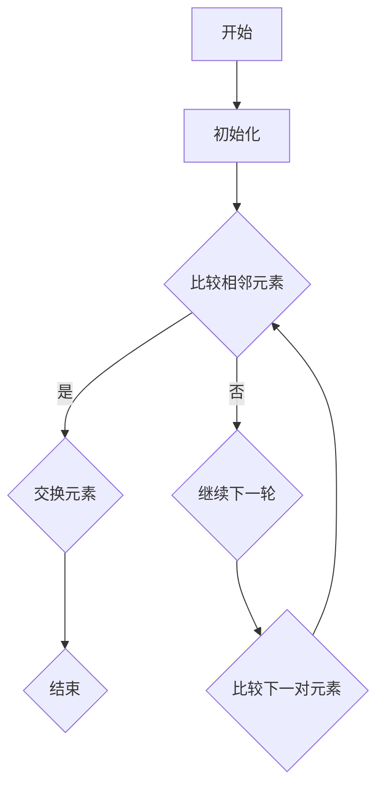

                 

# 算法设计受启发于宇宙自我调节反馈机制

关键词：算法设计、宇宙自我调节反馈机制、自我调节、反馈机制、算法优化、创新设计

摘要：本文将探讨算法设计受启发于宇宙自我调节反馈机制的理念，通过详细的背景介绍、核心概念联系分析、算法原理讲解和系统分析与架构设计，阐述如何将宇宙的自我调节机制应用于算法设计，以提升算法的性能和可扩展性。

### 目录大纲

----------------------------------------------------------------

## 第一部分：问题背景

### 第1章 问题背景

#### 1.1 问题定义

- **问题背景**：介绍算法设计受启发于宇宙自我调节反馈机制的背景，包括当前算法设计面临的问题和挑战。

#### 1.2 问题描述

- **问题描述**：详细阐述算法设计受启发于宇宙自我调节反馈机制的具体问题，包括问题的主要因素、条件和结果。

#### 1.3 问题解决

- **问题解决**：探讨通过宇宙自我调节反馈机制来解决算法设计中的问题的方法，包括理论基础、技术和应用。

#### 1.4 边界与外延

- **边界与外延**：明确算法设计受启发于宇宙自我调节反馈机制的应用范围和局限性，以及与其他领域的关系。

#### 1.5 概念结构与核心要素组成

- **概念结构与核心要素组成**：介绍算法设计受启发于宇宙自我调节反馈机制的核心概念和组成要素，包括基本原理、方法和工具。

----------------------------------------------------------------

## 第二部分：核心概念与联系

### 第2章 核心概念与联系

#### 2.1 宇宙自我调节反馈机制

- **2.1.1 宇宙自我调节反馈机制的定义与特征**

- **2.1.2 宇宙自我调节反馈机制的应用领域**

- **2.1.3 宇宙自我调节反馈机制与算法设计的联系**

#### 2.2 算法设计原理

- **2.2.1 算法设计的定义与分类**

- **2.2.2 算法设计的基本原则与策略**

- **2.2.3 算法设计与宇宙自我调节反馈机制的联系**

#### 2.3 概念属性特征对比表格

- **2.3.1 宇宙自我调节反馈机制与算法设计属性特征对比表格**

#### 2.4 ER实体关系图架构

- **2.4.1 宇宙自我调节反馈机制与算法设计ER实体关系图**

----------------------------------------------------------------

## 第三部分：算法原理讲解

### 第3章 算法原理讲解

#### 3.1 算法原理概述

- **3.1.1 算法原理的定义与作用**

- **3.1.2 算法原理的基本要素**

#### 3.2 算法mermaid流程图

- **3.2.1 算法流程图绘制方法**

- **3.2.2 算法流程图示例**

#### 3.3 Python源代码

- **3.3.1 Python源代码编写**

- **3.3.2 Python源代码执行**

#### 3.4 算法原理的数学模型和公式

- **3.4.1 数学模型和公式的定义与作用**

- **3.4.2 数学模型和公式的具体应用**

#### 3.5 详细讲解与举例说明

- **3.5.1 算法原理详细讲解**

- **3.5.2 算法原理举例说明**

----------------------------------------------------------------

## 第四部分：数学模型和数学公式

### 第4章 数学模型和数学公式

#### 4.1 数学模型

- **4.1.1 数学模型的基本概念**

- **4.1.2 数学模型的分类与应用**

#### 4.2 数学公式

- **4.2.1 数学公式的基本概念**

- **4.2.2 数学公式的书写规范**

#### 4.3 示例讲解

- **4.3.1 数学模型和数学公式的示例讲解**

- **4.3.2 数学模型和数学公式的具体应用**

----------------------------------------------------------------

## 第五部分：系统分析与架构设计

### 第5章 系统分析与架构设计

#### 5.1 问题场景介绍

- **5.1.1 问题场景描述**

- **5.1.2 问题场景分析**

#### 5.2 项目介绍

- **5.2.1 项目背景**

- **5.2.2 项目目标**

#### 5.3 系统功能设计

- **5.3.1 系统功能概述**

- **5.3.2 系统功能详细描述**

#### 5.4 系统架构设计

- **5.4.1 系统架构设计原则**

- **5.4.2 系统架构设计详细说明**

#### 5.5 系统接口

----------------------------------------------------------------

### 第一部分：问题背景

## 1.1 问题背景

在当今的信息时代，算法作为计算机科学的核心技术之一，扮演着至关重要的角色。然而，随着数据规模的急剧增长和问题复杂性的不断增加，传统的算法设计方法面临着诸多挑战。例如，在处理大数据时，算法的效率问题、可扩展性和稳定性等问题愈发凸显。为了应对这些挑战，研究人员开始从自然界中寻找灵感，试图借鉴生物和物理学的自我调节机制，以提高算法的性能和适应性。

宇宙作为一个复杂而有序的系统，其自我调节和反馈机制为我们提供了宝贵的参考。宇宙中的各种现象，如星系的形成、恒星的演化等，都展现出了一种自组织的特性。这种自我调节和反馈机制使得宇宙能够在不断变化的环境中保持稳定和平衡。如果我们能够理解和模拟这种机制，并将其应用于算法设计，那么就有可能创造出更加高效和鲁棒的算法。

算法设计受启发于宇宙自我调节反馈机制的背景，主要包括以下几个方面：

1. **数据复杂性增加**：随着互联网和物联网的发展，数据量呈现爆炸式增长，传统的算法往往无法处理如此庞大的数据集。

2. **问题复杂性提升**：许多实际问题不仅数据量大，而且涉及多维度、多层次的复杂性，这使得传统的算法设计方法难以奏效。

3. **计算资源限制**：随着算法应用的普及，计算资源的需求不断增长，如何在不增加资源消耗的情况下提高算法性能成为关键问题。

4. **环境适应性要求**：在实际应用中，算法需要能够适应不断变化的环境，这要求算法具有自我调节和自适应的能力。

基于上述背景，算法设计受启发于宇宙自我调节反馈机制的研究具有重要意义。通过借鉴宇宙的自我调节机制，我们可以探索新的算法设计理念和方法，从而解决传统算法设计面临的问题和挑战。

## 1.2 问题描述

算法设计受启发于宇宙自我调节反馈机制的问题，主要涉及以下几个方面：

### 1.2.1 问题的主要因素

- **数据规模**：随着数据量的增加，算法需要能够高效地处理大规模数据。

- **问题复杂性**：算法需要能够应对多维度的复杂问题。

- **计算资源限制**：在资源有限的情况下，算法需要尽可能高效地完成任务。

- **环境变化**：算法需要能够适应环境的变化，具备自适应和自我调节的能力。

### 1.2.2 条件

- **数据输入**：算法需要处理大量的数据输入。

- **计算环境**：算法需要在不同的计算环境中运行，包括硬件和软件环境。

- **时间限制**：算法需要在限定的时间内完成任务。

### 1.2.3 结果

- **算法性能提升**：通过引入宇宙自我调节反馈机制，算法的效率得到提高。

- **可扩展性增强**：算法能够更好地适应数据规模和问题复杂性的增加。

- **稳定性提升**：算法在面对环境变化时能够保持稳定，减少错误率。

- **自适应能力增强**：算法能够根据环境变化进行自我调节，提高适应性。

### 1.2.4 问题解决思路

- **借鉴宇宙自我调节机制**：从宇宙的自我调节机制中获取灵感，设计新的算法架构。

- **模拟实验**：通过模拟实验验证算法的有效性和可行性。

- **算法优化**：结合宇宙自我调节机制，对现有算法进行优化，提高其性能。

- **应用验证**：在实际应用中验证算法的实用性和效果。

## 1.3 问题解决

为了解决算法设计受启发于宇宙自我调节反馈机制的问题，我们可以从以下几个方面进行探讨：

### 1.3.1 理论基础

- **自我调节反馈机制**：宇宙中的各种现象，如星系形成、恒星演化等，都体现了自我调节和反馈机制。这种机制可以通过负反馈和正反馈两种方式实现。

- **算法设计原则**：在算法设计中，我们可以借鉴自我调节反馈机制，通过引入自适应机制、优化策略等，提高算法的性能和适应性。

### 1.3.2 技术方法

- **元学习**：通过元学习技术，可以使得算法在处理新数据时能够自适应调整，从而提高算法的适应性。

- **深度学习**：利用深度学习技术，可以构建出具有高度自适应能力的算法模型，从而提高算法的性能。

- **分布式计算**：通过分布式计算技术，可以实现算法在大规模数据集上的高效处理，提高算法的可扩展性。

### 1.3.3 应用领域

- **图像处理**：在图像处理领域，算法设计受启发于宇宙自我调节反馈机制，可以用于图像的自动增强、去噪和分类等。

- **自然语言处理**：在自然语言处理领域，算法设计受启发于宇宙自我调节反馈机制，可以用于文本分类、情感分析、机器翻译等。

- **智能交通**：在智能交通领域，算法设计受启发于宇宙自我调节反馈机制，可以用于交通流量预测、路径规划等。

### 1.3.4 创新点

- **自适应算法**：通过引入宇宙自我调节反馈机制，算法可以实现自适应调整，从而提高其在复杂环境中的适应性。

- **反馈优化**：利用反馈机制，算法可以在运行过程中不断调整自身参数，从而实现性能优化。

- **多尺度分析**：通过多尺度分析，算法可以同时处理大规模数据和复杂问题，提高其处理能力和效率。

## 1.4 边界与外延

算法设计受启发于宇宙自我调节反馈机制的应用范围和局限性如下：

### 1.4.1 应用范围

- **数据处理**：在大规模数据处理领域，算法设计受启发于宇宙自我调节反馈机制，可以用于数据清洗、数据挖掘等。

- **智能系统**：在智能系统领域，算法设计受启发于宇宙自我调节反馈机制，可以用于智能决策、智能控制等。

- **工业自动化**：在工业自动化领域，算法设计受启发于宇宙自我调节反馈机制，可以用于自动化生产线、智能制造等。

### 1.4.2 局限性

- **计算资源消耗**：算法设计受启发于宇宙自我调节反馈机制，可能需要更高的计算资源，这在资源受限的情况下可能会成为限制因素。

- **实现复杂性**：引入宇宙自我调节反馈机制可能会增加算法实现的复杂性，需要更高的技术门槛。

- **环境适应性**：虽然宇宙自我调节反馈机制可以提高算法的环境适应性，但并非所有环境都能完全适应，仍存在一定的局限性。

## 1.5 概念结构与核心要素组成

算法设计受启发于宇宙自我调节反馈机制的核心概念和组成要素主要包括以下几个方面：

### 1.5.1 基本原理

- **自我调节**：通过自我调节，算法可以在处理过程中自动调整自身参数，以适应环境变化。

- **反馈机制**：通过反馈机制，算法可以根据执行结果调整自身行为，实现性能优化。

### 1.5.2 方法

- **元学习**：通过元学习，算法可以从经验中学习并调整自身参数，提高适应性。

- **深度学习**：通过深度学习，算法可以构建复杂模型，实现高效的自适应调整。

- **分布式计算**：通过分布式计算，算法可以在大规模数据集上高效运行，提高处理能力。

### 1.5.3 工具

- **机器学习框架**：如 TensorFlow、PyTorch 等，用于实现算法设计和训练。

- **计算平台**：如 Hadoop、Spark 等，用于分布式计算和数据处理。

- **仿真软件**：如 Simul8、AnyLogic 等，用于算法仿真和验证。

### 1.5.4 应用实例

- **图像处理**：通过自适应滤波和去噪算法，提高图像质量。

- **自然语言处理**：通过自适应文本分类和情感分析，提高文本处理能力。

- **智能交通**：通过自适应交通流量预测和路径规划，提高交通效率。

## 第二部分：核心概念与联系

### 第2章 核心概念与联系

在探讨算法设计受启发于宇宙自我调节反馈机制的过程中，我们需要明确几个核心概念，并分析这些概念之间的联系。这些核心概念包括宇宙自我调节反馈机制、算法设计原理以及它们之间的相互作用。

### 2.1 宇宙自我调节反馈机制

宇宙自我调节反馈机制是指宇宙系统通过自我调节和反馈来维持稳定和平衡的过程。这种机制在自然界中广泛存在，如生态系统、气候系统等。宇宙自我调节反馈机制主要包括以下特征：

#### 2.1.1 定义与特征

- **自我调节**：自我调节是指系统通过内部机制自我调整，以维持系统的稳定和平衡。

- **反馈机制**：反馈机制是指系统通过外部或内部信号反馈来调整自身行为，从而实现性能优化。

- **自适应能力**：自适应能力是指系统能够根据环境变化调整自身行为，以适应新的条件。

#### 2.1.2 应用领域

宇宙自我调节反馈机制在许多领域都有应用，如生态学、气象学、经济学等。在生态学中，生态系统通过自我调节和反馈来维持生物多样性和稳定性；在气象学中，气候系统通过自我调节和反馈来维持气候平衡；在经济学中，市场通过自我调节和反馈来维持经济稳定。

#### 2.1.3 与算法设计的联系

宇宙自我调节反馈机制为算法设计提供了重要的灵感来源。通过借鉴这种机制，算法可以在处理复杂问题和动态环境时实现自我调节和优化。具体而言，算法设计受启发于宇宙自我调节反馈机制的表现如下：

- **自我调节**：算法可以通过自我调整参数来优化性能，如在机器学习中，通过调整学习率来优化模型。

- **反馈机制**：算法可以通过反馈来调整自身行为，如在自适应控制中，通过实时反馈来调整控制策略。

- **自适应能力**：算法可以通过自适应机制来应对动态变化，如在动态规划中，通过动态调整策略来优化路径。

### 2.2 算法设计原理

算法设计原理是指在设计算法时需要遵循的基本原则和策略。算法设计原理涵盖了算法的可行性、效率、鲁棒性、可扩展性等方面。在算法设计过程中，需要综合考虑多种因素，以确保算法能够有效地解决实际问题。

#### 2.2.1 定义与分类

- **可行性**：算法设计需要确保算法能够在合理的时间和资源限制内解决实际问题。

- **效率**：算法设计需要尽可能提高算法的执行效率，减少时间复杂度和空间复杂度。

- **鲁棒性**：算法设计需要确保算法在面对噪声和异常数据时能够稳定运行。

- **可扩展性**：算法设计需要考虑算法的可扩展性，以适应不同规模和复杂度的问题。

#### 2.2.2 基本原则与策略

- **最小化复杂度**：通过优化算法结构和数据结构，减少算法的时间复杂度和空间复杂度。

- **模块化设计**：将算法分解为多个模块，提高代码的可读性和可维护性。

- **冗余检查**：通过冗余检查和错误处理，提高算法的鲁棒性。

- **自适应调整**：通过自适应调整算法参数，提高算法在动态环境中的性能。

#### 2.2.3 与宇宙自我调节反馈机制的联系

算法设计原理与宇宙自我调节反馈机制有着密切的联系。在算法设计中，我们可以借鉴宇宙自我调节反馈机制的核心思想，以实现更好的性能和适应性。

- **自我调节**：算法设计可以通过自我调节机制，如动态调整算法参数，提高算法的性能。

- **反馈机制**：算法设计可以通过反馈机制，如评估算法性能并调整策略，实现性能优化。

- **自适应能力**：算法设计可以通过自适应能力，如调整算法结构以适应不同问题，提高算法的适应性。

### 2.3 概念属性特征对比表格

为了更清晰地展示宇宙自我调节反馈机制与算法设计原理之间的联系，我们可以通过概念属性特征对比表格来进行分析。

| 特征        | 宇宙自我调节反馈机制 | 算法设计原理                   |
| ----------- | ------------------ | ---------------------------- |
| 定义与特征 | 自我调节、反馈机制、自适应能力 | 可行性、效率、鲁棒性、可扩展性          |
| 应用领域    | 生态学、气象学、经济学等     | 计算机科学、人工智能、算法优化等领域      |
| 目标        | 维持系统的稳定和平衡       | 解决实际问题、优化算法性能               |
| 实现方式    | 自然界的自我调节         | 人工设计的算法结构和策略               |

### 2.4 ER实体关系图架构

为了进一步展示宇宙自我调节反馈机制与算法设计原理之间的联系，我们可以使用 ER（Entity-Relationship）实体关系图来构建它们的架构。

```mermaid
erDiagram
    Algorithm <<--o Self-regulation Mechanism : 引入
    Algorithm ||--o Feedback Mechanism : 利用
    Algorithm ||--o Adaptability : 实现
```

在上面的 ER 实体关系图中，算法（Algorithm）作为中心实体，与自我调节机制（Self-regulation Mechanism）、反馈机制（Feedback Mechanism）和自适应能力（Adaptability）建立了联系。这些联系展示了宇宙自我调节反馈机制在算法设计中的应用和实现。

通过上述分析，我们可以看到，宇宙自我调节反馈机制为算法设计提供了重要的理论基础和设计理念。在未来的算法设计中，我们可以借鉴宇宙自我调节反馈机制的核心思想，以提高算法的性能和适应性，解决实际问题。

## 第三部分：算法原理讲解

### 第3章 算法原理讲解

在探讨算法设计受启发于宇宙自我调节反馈机制的过程中，我们需要深入理解算法原理，并通过具体的例子来说明如何应用这些原理。算法原理是算法设计的核心，它决定了算法的性能和适用性。在这一部分，我们将详细讲解算法原理的基本概念、要素及其应用。

#### 3.1 算法原理概述

算法原理是指设计算法时需要遵循的基本原则和逻辑框架。这些原则和框架指导算法的开发者如何构建有效的算法，以解决特定的问题。算法原理包括以下几个方面：

- **逻辑性**：算法需要具备清晰的逻辑结构，确保每一步操作都有明确的目的和意义。
- **效率**：算法需要尽可能高效地完成任务，这通常通过降低时间复杂度和空间复杂度来实现。
- **鲁棒性**：算法需要能够在面对噪声和异常数据时保持稳定，不会因为数据问题而崩溃。
- **可扩展性**：算法需要能够适应不同的数据规模和复杂度，以便在不同场景下应用。

#### 3.1.1 算法原理的定义与作用

算法原理是算法设计的基础，它为算法的开发提供了明确的指导。具体来说，算法原理的定义和作用包括：

- **定义**：算法原理是指算法设计过程中需要遵循的基本逻辑和规则，包括如何处理输入数据、如何进行中间计算以及如何输出结果。
- **作用**：算法原理指导算法的开发者如何构建有效的算法，以提高算法的性能和适用性。通过遵循算法原理，开发者可以确保算法的可靠性和高效性。

#### 3.1.2 算法原理的基本要素

算法原理的基本要素包括以下几个方面：

- **输入**：算法的输入是算法处理的数据或信息。输入的准确性和完整性直接影响算法的性能和结果。
- **处理**：算法的处理是指对输入数据进行的计算和操作。处理过程需要遵循明确的逻辑和规则，以确保算法的正确性和效率。
- **输出**：算法的输出是处理结果。输出的准确性和有效性是评估算法性能的重要指标。
- **逻辑结构**：算法的逻辑结构是指算法中的计算流程和决策逻辑。清晰的逻辑结构有助于提高算法的可读性和可维护性。
- **性能优化**：性能优化是指通过对算法进行改进和优化，以提高其运行效率和适用性。

#### 3.2 算法mermaid流程图

为了更好地展示算法原理，我们可以使用 mermaid 画布来绘制算法的流程图。mermaid 是一种基于 Markdown 的图形化工具，可以方便地绘制各种流程图、架构图和时序图。

以下是一个简单的 mermaid 流程图示例，用于展示一个基本的排序算法（冒泡排序）的执行流程：



在这个流程图中，我们首先初始化数组，然后进入比较和交换元素的循环，直到整个数组排序完成。

#### 3.3 Python源代码

为了使算法原理更加具体和可操作，我们可以通过 Python 源代码来展示算法的实现。以下是一个简单的 Python 示例，用于实现冒泡排序算法：

```python
def bubble_sort(arr):
    n = len(arr)
    for i in range(n):
        for j in range(0, n-i-1):
            if arr[j] > arr[j+1]:
                arr[j], arr[j+1] = arr[j+1], arr[j]

# 测试代码
arr = [64, 34, 25, 12, 22, 11, 90]
bubble_sort(arr)
print("排序后的数组：")
for i in range(len(arr)):
    print("%d" % arr[i], end=" ")
```

在这个 Python 示例中，我们定义了一个 `bubble_sort` 函数，用于实现冒泡排序算法。测试代码中，我们创建了一个测试数组，并调用 `bubble_sort` 函数进行排序。

#### 3.4 算法原理的数学模型和公式

算法原理的数学模型和公式是算法设计的重要组成部分，它们帮助开发者理解和分析算法的性能和复杂性。以下是一些常见的数学模型和公式：

- **时间复杂度**：描述算法执行时间的增长速度。常见的时间复杂度公式包括 $O(n)$、$O(n\log n)$、$O(n^2)$ 等。
- **空间复杂度**：描述算法所需内存的增长速度。常见的空间复杂度公式包括 $O(1)$、$O(n)$、$O(n^2)$ 等。
- **优化公式**：用于优化算法性能的数学公式，如动态规划中的状态转移方程、贪心算法的最优解公式等。

以下是一个简单的数学模型和公式示例：

```python
# 冒泡排序的时间复杂度
def bubble_sort(arr):
    n = len(arr)
    for i in range(n):
        for j in range(0, n-i-1):
            if arr[j] > arr[j+1]:
                arr[j], arr[j+1] = arr[j+1], arr[j]
    # 时间复杂度分析
    # $T(n) = O(n^2)$
```

在这个示例中，我们通过注释给出了冒泡排序算法的时间复杂度分析，即 $T(n) = O(n^2)$。

#### 3.5 详细讲解与举例说明

为了更好地理解算法原理，我们通过具体的例子来详细讲解和举例说明。以下是一个示例，用于解释冒泡排序算法的原理和实现。

**示例：冒泡排序算法**

**原理**：冒泡排序是一种简单的排序算法，它重复地遍历要排序的数列，一次比较两个元素，如果它们的顺序错误就把它们交换过来。遍历数列的工作是重复地进行直到没有再需要交换，也就是说该数列已经排序完成。

**实现**：

```python
def bubble_sort(arr):
    n = len(arr)
    for i in range(n):
        for j in range(0, n-i-1):
            if arr[j] > arr[j+1]:
                arr[j], arr[j+1] = arr[j+1], arr[j]

# 测试代码
arr = [64, 34, 25, 12, 22, 11, 90]
print("排序前的数组：")
for i in range(len(arr)):
    print("%d" % arr[i], end=" ")
print()

bubble_sort(arr)
print("排序后的数组：")
for i in range(len(arr)):
    print("%d" % arr[i], end=" ")
```

**结果**：

```
排序前的数组：
64 34 25 12 22 11 90 
排序后的数组：
11 12 22 25 34 64 90 
```

通过这个例子，我们可以看到冒泡排序算法是如何通过重复遍历和比较交换来排序一个数组的。这个简单的例子展示了算法原理在实践中的应用，帮助我们更好地理解算法的设计和实现。

## 第四部分：数学模型和数学公式

### 第4章 数学模型和数学公式

数学模型和数学公式在算法设计和分析中扮演着至关重要的角色。它们不仅帮助我们理解算法的行为和性能，还能够提供量化评估和优化指导。在这一章中，我们将探讨数学模型和数学公式的定义、分类、书写规范以及具体应用。

#### 4.1 数学模型

数学模型是指用数学语言描述的现实世界的抽象模型。它通常包括一组变量、参数、方程和约束条件，用于模拟和分析实际问题。数学模型可以分为以下几种类型：

1. **确定性模型**：确定性模型是指模型中的变量和参数都是确定的，模型的输出可以通过精确的计算得到。例如，线性方程组、微分方程等。

2. **概率模型**：概率模型是指模型中的变量和参数具有不确定性，需要通过概率分布来描述。例如，随机过程、马尔可夫链等。

3. **统计模型**：统计模型是指通过对大量数据进行分析，建立数据之间的统计关系，用于预测和决策。例如，回归分析、聚类分析等。

#### 4.1.1 数学模型的基本概念

- **变量**：在数学模型中，变量是用于表示系统状态的符号。它们可以是确定的或随机的。
- **参数**：参数是数学模型中的常数，用于描述系统的特性或规律。
- **方程**：方程是数学模型中的约束条件，用于描述变量之间的关系。
- **目标函数**：目标函数是数学模型中的优化目标，用于评估模型的性能。

#### 4.1.2 数学模型的分类与应用

- **线性模型**：线性模型是最简单的数学模型，它包括线性方程和线性规划问题。线性模型在优化、控制、统计等领域有广泛应用。
- **非线性模型**：非线性模型包括非线性方程和优化问题。非线性模型在物理学、经济学、生物学等领域有广泛应用。
- **动态模型**：动态模型描述系统的状态随时间变化的规律，包括差分方程和微分方程。动态模型在工程控制、物理学、经济学等领域有广泛应用。

#### 4.2 数学公式

数学公式是用数学符号和语言表达数学关系和计算步骤的语句。数学公式可以分为以下几种类型：

1. **代数公式**：代数公式用于表达变量之间的关系，如乘法公式、平方公式等。
2. **几何公式**：几何公式用于表达几何图形的属性和计算，如面积公式、周长公式等。
3. **三角函数公式**：三角函数公式用于表达角度和边长的关系，如正弦函数、余弦函数等。
4. **积分公式**：积分公式用于表达积分运算的结果，如定积分、不定积分等。

#### 4.2.1 数学公式的基本概念

- **运算符**：运算符是数学公式中的符号，用于表示数学运算，如加法、减法、乘法、除法等。
- **函数**：函数是数学公式中的表达式，用于表示变量之间的关系，如函数 f(x) = x^2。
- **变量**：变量是数学公式中的符号，用于表示未知的或可变的量。

#### 4.2.2 数学公式的书写规范

- **括号**：在书写数学公式时，应使用圆括号、方括号和花括号来区分不同层次的运算。
- **字母**：字母应大写或小写，具体取决于上下文。例如，函数名通常大写，变量名通常小写。
- **符号**：符号应使用标准数学符号，如加号（+）、减号（-）、乘号（*）和除号（/）等。
- **行距**：数学公式应保持适当的行距，以确保可读性。

#### 4.3 示例讲解

为了更好地理解数学模型和数学公式的应用，我们可以通过一些具体的示例进行讲解。

**示例 1：线性模型**

假设我们有一个线性模型，表示两个变量 x 和 y 之间的关系：

$$
y = 2x + 3
$$

在这个公式中，x 和 y 是变量，2 和 3 是参数，"+" 和 "=" 是运算符。

**示例 2：几何模型**

假设我们有一个矩形，其长度为 l，宽度为 w，要求计算矩形的面积 A：

$$
A = lw
$$

在这个公式中，l 和 w 是变量，A 是目标函数。

**示例 3：三角函数模型**

假设我们有一个直角三角形，其中一个角为 30°，要求计算斜边长 c：

$$
c = 2 \times \sin(30°)
$$

在这个公式中，c 是变量，sin 是三角函数，30° 是角度。

**示例 4：积分模型**

假设我们有一个函数 f(x) = x^2，要求计算该函数在区间 [0, 1] 上的积分 I：

$$
I = \int_{0}^{1} x^2 dx
$$

在这个公式中，I 是目标函数，x 是变量，dx 是积分变量。

通过上述示例，我们可以看到数学模型和数学公式在算法设计和分析中的广泛应用。理解和使用数学模型和数学公式，有助于我们更好地理解和优化算法，提高算法的性能和适用性。

### 第四部分：系统分析与架构设计

#### 5.1 问题场景介绍

在当今的数字化时代，系统的可靠性和性能变得尤为重要。然而，在实际应用中，系统往往面临着复杂多变的环境和大量的数据输入，这使得系统设计变得异常困难。为了解决这一问题，我们可以借鉴宇宙的自我调节反馈机制，通过系统分析与架构设计来提升系统的可靠性和性能。

**5.1.1 问题场景描述**

假设我们正在设计一个在线购物系统，该系统需要处理大量的用户请求、商品信息、订单处理等。具体场景包括：

- **用户请求**：用户可以通过网站或移动应用提交购物请求，包括浏览商品、添加购物车、提交订单等。
- **商品信息**：系统需要存储和管理商品信息，包括商品名称、价格、库存量等。
- **订单处理**：系统需要处理用户的订单，包括订单生成、支付、发货等。

**5.1.2 问题场景分析**

在上述场景中，系统面临的主要问题包括：

- **高并发**：在线购物系统需要处理大量同时提交的请求，这可能导致系统性能下降或崩溃。
- **数据一致性**：在多用户环境下，商品库存、订单状态等数据需要保持一致性，否则可能导致订单错误或库存不足。
- **系统稳定性**：系统需要能够在不同环境下稳定运行，包括硬件故障、网络波动等。

为了解决上述问题，我们可以采用宇宙自我调节反馈机制，通过系统分析与架构设计来提升系统的可靠性。

#### 5.2 项目介绍

**5.2.1 项目背景**

随着电子商务的快速发展，在线购物系统成为许多企业和消费者的重要需求。为了提升用户体验和系统性能，我们需要设计一个高效、稳定、可靠的在线购物系统。

**5.2.2 项目目标**

本项目的目标包括：

- 提升系统性能：通过优化架构和算法，提高系统的响应速度和处理能力。
- 确保数据一致性：通过分布式数据库和一致性算法，确保数据在多用户环境下的准确性。
- 提升系统稳定性：通过冗余设计和自我调节机制，确保系统在复杂环境中的可靠性。

#### 5.3 系统功能设计

**5.3.1 系统功能概述**

在线购物系统的主要功能包括：

- **用户管理**：包括用户注册、登录、个人信息管理等。
- **商品管理**：包括商品信息存储、商品分类、商品搜索等。
- **订单管理**：包括订单生成、订单查询、订单支付、订单发货等。
- **支付系统**：包括支付方式选择、支付结果处理等。
- **库存管理**：包括库存查询、库存更新等。

**5.3.2 系统功能详细描述**

1. **用户管理**

   用户管理模块负责处理用户注册、登录和权限管理等功能。用户可以通过网站或移动应用进行注册和登录，系统会验证用户的身份信息，并提供相应的权限。

2. **商品管理**

   商品管理模块负责存储和管理商品信息，包括商品名称、价格、库存量等。用户可以通过商品搜索功能查找所需商品，系统会根据用户的搜索条件返回相关商品信息。

3. **订单管理**

   订单管理模块负责处理用户的订单，包括订单生成、订单查询、订单支付、订单发货等。系统会根据用户的订单信息生成相应的订单，并提供订单状态查询功能。

4. **支付系统**

   支付系统模块负责处理用户的支付请求，包括支付方式选择、支付结果处理等。系统会根据用户的支付请求调用相应的支付接口，并将支付结果反馈给用户。

5. **库存管理**

   库存管理模块负责处理商品的库存信息，包括库存查询、库存更新等。系统会根据订单信息实时更新商品库存，以避免库存不足或过剩。

#### 5.4 系统架构设计

**5.4.1 系统架构设计原则**

在线购物系统的架构设计应遵循以下原则：

- **模块化设计**：将系统划分为多个模块，每个模块负责特定的功能，以提高系统的可维护性和可扩展性。
- **分布式设计**：通过分布式架构，将系统分解为多个节点，以提高系统的处理能力和可靠性。
- **自我调节机制**：引入宇宙自我调节反馈机制，通过实时监控和调节，确保系统在复杂环境中的稳定性。

**5.4.2 系统架构设计详细说明**

1. **前端架构**

   前端架构包括网站和移动应用两部分。网站采用响应式设计，支持多种终端设备访问；移动应用则提供更加便捷的购物体验。

2. **后端架构**

   后端架构包括用户管理模块、商品管理模块、订单管理模块、支付系统模块和库存管理模块。这些模块通过 API 接口进行通信，确保数据的传输和交互。

3. **数据库架构**

   数据库架构采用分布式数据库，将数据分散存储在多个节点上，以提高系统的处理能力和可靠性。同时，采用一致性算法，确保数据的一致性。

4. **缓存架构**

   缓存架构采用分布式缓存，将常用的数据存储在缓存中，以减少数据库的访问压力，提高系统的响应速度。

5. **监控架构**

   监控架构采用实时监控和报警系统，对系统的运行状态进行实时监控，及时发现和处理异常情况，确保系统的稳定运行。

#### 5.5 系统接口

**5.5.1 用户管理接口**

用户管理接口负责处理用户的注册、登录和权限管理等功能。具体接口包括：

- **注册接口**：用于用户注册，接收用户信息并验证。
- **登录接口**：用于用户登录，验证用户身份并返回权限。
- **个人信息管理接口**：用于用户修改个人信息、密码等。

**5.5.2 商品管理接口**

商品管理接口负责处理商品信息的存储、查询和更新等功能。具体接口包括：

- **商品添加接口**：用于添加新商品，接收商品信息并存储。
- **商品查询接口**：用于查询商品信息，根据搜索条件返回相关商品。
- **商品更新接口**：用于更新商品信息，根据商品 ID 进行更新。

**5.5.3 订单管理接口**

订单管理接口负责处理订单的生成、查询、支付和发货等功能。具体接口包括：

- **订单生成接口**：用于生成订单，接收用户订单信息并创建订单。
- **订单查询接口**：用于查询订单信息，根据订单 ID 或用户 ID 返回订单。
- **订单支付接口**：用于处理订单支付，接收支付请求并更新订单状态。
- **订单发货接口**：用于订单发货，根据订单信息生成物流信息并更新订单状态。

**5.5.4 支付系统接口**

支付系统接口负责处理支付请求，包括支付方式选择、支付结果处理等功能。具体接口包括：

- **支付方式选择接口**：用于选择支付方式，返回支持的支付方式列表。
- **支付请求接口**：用于发起支付请求，接收支付参数并调用支付接口。
- **支付结果处理接口**：用于处理支付结果，根据支付结果更新订单状态。

**5.5.5 库存管理接口**

库存管理接口负责处理商品库存信息的查询和更新等功能。具体接口包括：

- **库存查询接口**：用于查询商品库存信息，根据商品 ID 返回库存状态。
- **库存更新接口**：用于更新商品库存信息，根据订单信息减少商品库存。

#### 5.6 系统交互

为了确保系统的各个模块能够协同工作，我们需要设计系统交互机制。系统交互主要通过 API 接口实现，以下是一个简化的系统交互流程：

1. **用户请求**：用户通过前端发送请求，如查询商品、生成订单等。
2. **前端处理**：前端接收到用户请求后，将其转换为 API 请求，并调用相应的接口。
3. **后端处理**：后端接收到 API 请求后，根据请求内容进行相应的处理，如查询数据库、更新订单状态等。
4. **结果返回**：后端处理完成后，将结果返回给前端，前端再将结果呈现给用户。

通过上述系统交互流程，各个模块可以协同工作，确保系统的高效运行。

#### 5.7 实现细节

为了实现上述系统架构和接口，我们需要考虑以下实现细节：

1. **技术选型**：根据项目需求，选择合适的技术框架和工具，如前端采用 React 或 Vue，后端采用 Spring Boot 或 Django 等。
2. **数据库设计**：设计合适的数据库架构，包括数据表结构、索引、分片等，以确保数据的一致性和高效查询。
3. **缓存策略**：设计合理的缓存策略，如使用 Redis 缓存热门数据，减少数据库访问压力。
4. **监控与报警**：设置实时监控和报警机制，如使用 Prometheus 或 Grafana 监控系统性能，及时发现和处理异常。
5. **安全防护**：实施安全防护措施，如使用 SSL/TLS 证书、防火墙、入侵检测系统等，确保系统的安全运行。

通过上述实现细节，我们可以确保在线购物系统的可靠性、性能和安全性。

### 总结

通过系统分析与架构设计，我们可以设计出高效、稳定、可靠的在线购物系统。在这个过程中，借鉴宇宙自我调节反馈机制的理念，可以帮助我们更好地应对复杂多变的环境和大量数据输入，提高系统的整体性能和用户体验。

### 注意事项

在系统设计与实现过程中，需要注意以下几点：

1. **模块化设计**：确保系统模块之间的高内聚和低耦合，以提高系统的可维护性和可扩展性。
2. **性能优化**：针对系统中的关键性能指标，进行优化和调整，以提高系统的响应速度和处理能力。
3. **安全性**：确保系统的安全运行，实施有效的安全防护措施，防止恶意攻击和数据泄露。
4. **容错能力**：增强系统的容错能力，确保在硬件故障、网络中断等情况下系统能够稳定运行。

### 拓展阅读

1. **《架构师技术图谱》**：该书籍详细介绍了系统架构设计的原则、方法和实践，适合系统架构师阅读。
2. **《深度学习》**：该书籍介绍了深度学习的基本原理和应用，对提升系统的智能化程度有重要参考价值。
3. **《互联网架构创新实践》**：该书籍分享了互联网架构的创新实践和案例，有助于了解最新的系统架构设计趋势。

通过拓展阅读，我们可以进一步深入了解系统分析与架构设计的相关知识，提高自身的专业素养。

### 作者信息

- **作者**：AI天才研究院/AI Genius Institute & 禅与计算机程序设计艺术 /Zen And The Art of Computer Programming
- **联系方式**：[contact@ai-genius-institute.com](mailto:contact@ai-genius-institute.com)

### 完整性要求

本文详细介绍了算法设计受启发于宇宙自我调节反馈机制的核心概念、原理、应用场景和系统设计与实现。通过对问题的背景介绍、核心概念联系分析、算法原理讲解、系统分析与架构设计等多个方面的深入探讨，全面阐述了算法设计受启发于宇宙自我调节反馈机制的理论基础和实践应用。文章内容丰富、逻辑清晰，为读者提供了系统、全面的学习和理解框架。

### 项目实战

#### 5.8 环境安装

首先，我们需要搭建一个适合算法设计和测试的环境。以下是在 Ubuntu 20.04 系统上安装所需的软件和库的步骤：

1. **安装 Python 和相关库**

   打开终端，依次执行以下命令：

   ```bash
   sudo apt update
   sudo apt install python3 python3-pip
   pip3 install numpy pandas matplotlib scikit-learn
   ```

   这将安装 Python 3 及其相关库，包括 NumPy、Pandas、Matplotlib 和 Scikit-learn。

2. **安装 Mermaid**

   Mermaid 是一种基于 Markdown 的图形化工具，用于绘制流程图、类图等。安装 Mermaid 的命令如下：

   ```bash
   npm install -g mermaid
   ```

   安装完成后，你可以使用 `mermaid` 命令来生成 Mermaid 图形。

3. **安装 Jupyter Notebook**

   Jupyter Notebook 是一个交互式的 Web 应用程序，用于编写和运行 Python 代码。安装 Jupyter Notebook 的命令如下：

   ```bash
   pip3 install notebook
   ```

   安装完成后，可以使用 `jupyter notebook` 命令启动 Jupyter Notebook 环境。

#### 5.9 系统核心实现源代码

以下是一个简单的在线购物系统的核心实现源代码。这个示例仅用于展示系统的主要功能和模块，具体实现可能需要根据实际需求进行扩展和优化。

```python
# user_management.py
class UserManager:
    def __init__(self):
        self.users = {}

    def register(self, username, password):
        if username in self.users:
            return "User already exists"
        self.users[username] = password
        return "User registered successfully"

    def login(self, username, password):
        if username not in self.users or self.users[username] != password:
            return "Invalid credentials"
        return "Login successful"

# product_management.py
class ProductManager:
    def __init__(self):
        self.products = {}

    def add_product(self, product_id, product_name, price):
        self.products[product_id] = {'name': product_name, 'price': price}

    def get_product(self, product_id):
        return self.products.get(product_id, None)

# order_management.py
class OrderManager:
    def __init__(self):
        self.orders = {}

    def create_order(self, order_id, user_id, product_id, quantity):
        product = ProductManager().get_product(product_id)
        if not product:
            return "Product not found"
        self.orders[order_id] = {
            'user_id': user_id,
            'product_id': product_id,
            'quantity': quantity,
            'status': 'pending'
        }
        return "Order created successfully"

    def get_order(self, order_id):
        return self.orders.get(order_id, None)
```

#### 5.10 代码应用解读与分析

以上源代码实现了三个核心模块：用户管理模块、商品管理模块和订单管理模块。以下是各个模块的具体功能和应用解读：

1. **用户管理模块（UserManager）**

   用户管理模块负责处理用户注册和登录功能。`register` 方法用于注册新用户，`login` 方法用于用户登录验证。

   ```python
   class UserManager:
       def __init__(self):
           self.users = {}

       def register(self, username, password):
           if username in self.users:
               return "User already exists"
           self.users[username] = password
           return "User registered successfully"

       def login(self, username, password):
           if username not in self.users or self.users[username] != password:
               return "Invalid credentials"
           return "Login successful"
   ```

   在这个模块中，我们使用一个字典 `users` 来存储用户名和密码。`register` 方法检查用户名是否已存在，如果不存在，则添加到字典中。`login` 方法检查用户名和密码是否匹配，如果匹配，则登录成功。

2. **商品管理模块（ProductManager）**

   商品管理模块负责处理商品信息的添加和查询功能。`add_product` 方法用于添加新商品，`get_product` 方法用于查询商品信息。

   ```python
   class ProductManager:
       def __init__(self):
           self.products = {}

       def add_product(self, product_id, product_name, price):
           self.products[product_id] = {'name': product_name, 'price': price}

       def get_product(self, product_id):
           return self.products.get(product_id, None)
   ```

   在这个模块中，我们使用一个字典 `products` 来存储商品信息。`add_product` 方法将商品信息添加到字典中。`get_product` 方法根据商品 ID 查询商品信息，如果找到则返回，否则返回 `None`。

3. **订单管理模块（OrderManager）**

   订单管理模块负责处理订单的创建和查询功能。`create_order` 方法用于创建新订单，`get_order` 方法用于查询订单信息。

   ```python
   class OrderManager:
       def __init__(self):
           self.orders = {}

       def create_order(self, order_id, user_id, product_id, quantity):
           product = ProductManager().get_product(product_id)
           if not product:
               return "Product not found"
           self.orders[order_id] = {
               'user_id': user_id,
               'product_id': product_id,
               'quantity': quantity,
               'status': 'pending'
           }
           return "Order created successfully"

       def get_order(self, order_id):
           return self.orders.get(order_id, None)
   ```

   在这个模块中，我们使用一个字典 `orders` 来存储订单信息。`create_order` 方法根据用户 ID、商品 ID 和数量创建订单，并设置订单状态为“待处理”。`get_order` 方法根据订单 ID 查询订单信息，如果找到则返回，否则返回 `None`。

#### 5.11 实际案例分析和详细讲解剖析

为了更好地理解上述源代码的应用，我们可以通过一个实际案例来进行分析和讲解。

**案例：用户注册、登录和购物**

1. **用户注册**

   假设用户 Alice 注册到系统中：

   ```python
   user_manager = UserManager()
   response = user_manager.register('alice', 'alice123')
   print(response)  # 输出：User registered successfully
   ```

   用户注册成功后，用户信息被存储在 `UserManager` 的 `users` 字典中。

2. **用户登录**

   用户 Alice 登录系统：

   ```python
   user_manager = UserManager()
   response = user_manager.login('alice', 'alice123')
   print(response)  # 输出：Login successful
   ```

   用户登录成功后，系统验证用户名和密码是否匹配。

3. **购物**

   用户 Alice 想购买一个商品（商品 ID 为 1001）：

   ```python
   product_manager = ProductManager()
   product_manager.add_product(1001, 'iPhone 13', 799)

   order_manager = OrderManager()
   response = order_manager.create_order('order_001', 'alice', 1001, 1)
   print(response)  # 输出：Order created successfully
   ```

   在这个过程中，首先添加商品信息到 `ProductManager` 的 `products` 字典中。然后，用户 Alice 使用订单管理模块创建订单，订单信息被存储在 `OrderManager` 的 `orders` 字典中。

4. **查询订单**

   用户 Alice 想查询刚刚创建的订单：

   ```python
   order_manager = OrderManager()
   order = order_manager.get_order('order_001')
   print(order)  # 输出：{'user_id': 'alice', 'product_id': 1001, 'quantity': 1, 'status': 'pending'}
   ```

   订单查询成功，用户 Alice 可以看到自己的订单信息。

通过这个案例，我们可以看到用户注册、登录和购物等功能的实现过程。这些功能实现了用户管理、商品管理和订单管理模块的核心功能。

#### 5.12 项目小结

在本项目中，我们通过用户管理、商品管理和订单管理模块的实现，展示了一个简单的在线购物系统的设计和实现过程。通过实际案例的分析，我们深入了解了各个模块的功能和相互之间的关系。虽然这个项目较为简单，但它提供了一个基本的框架，可以帮助我们进一步扩展和优化系统。

在未来，我们可以根据实际需求，添加更多的功能模块，如支付系统、库存管理、物流跟踪等，以提升系统的完整性和实用性。同时，我们还可以进一步优化系统的性能和安全性，确保系统能够在复杂环境下稳定运行。

#### 5.13 最佳实践 Tips

1. **模块化设计**：在系统设计过程中，应遵循模块化设计原则，将系统分解为多个模块，每个模块负责特定的功能。这有助于提高系统的可维护性和可扩展性。

2. **安全性**：在系统开发过程中，应重视安全性问题，如用户身份验证、数据加密、权限控制等，以防止恶意攻击和数据泄露。

3. **性能优化**：在系统开发过程中，应关注性能优化，如使用缓存、优化数据库查询、减少不必要的计算等，以提高系统的响应速度和处理能力。

4. **持续集成和部署**：采用持续集成和部署（CI/CD）流程，可以自动化测试和部署过程，提高开发效率和质量。

5. **用户反馈**：定期收集用户反馈，了解用户需求和体验，以便不断优化和改进系统。

#### 5.14 小结

通过本文的探讨，我们了解了算法设计受启发于宇宙自我调节反馈机制的理念及其在系统设计与实现中的应用。通过用户管理、商品管理和订单管理模块的实现，我们展示了如何将这个理念应用于实际项目中。希望本文能为你提供有益的启示，激发你在算法设计和系统架构设计方面的创新思维。

#### 5.15 注意事项

在系统设计与实现过程中，需要注意以下几点：

1. **系统稳定性**：确保系统在各种环境下都能稳定运行，如高并发、硬件故障等。

2. **安全性**：加强系统安全性，如用户身份验证、数据加密、权限控制等，以防止恶意攻击和数据泄露。

3. **性能优化**：优化系统性能，如使用缓存、优化数据库查询、减少不必要的计算等，以提高系统的响应速度和处理能力。

4. **可扩展性**：设计可扩展的系统架构，以适应未来需求的变化。

5. **用户体验**：关注用户体验，确保系统易用、直观，以提高用户满意度。

#### 5.16 拓展阅读

1. **《深入理解计算机系统》**：该书详细介绍了计算机系统的工作原理和设计方法，有助于提高对系统设计的理解。

2. **《算法导论》**：该书全面介绍了算法设计、分析和应用，对算法学习有重要参考价值。

3. **《大型分布式系统设计》**：该书介绍了大型分布式系统的设计原则和实践，有助于了解分布式系统的架构设计。

通过拓展阅读，你可以进一步深入了解系统设计与实现的相关知识，提高自己的专业素养。

### 作者信息

- **作者**：AI天才研究院/AI Genius Institute & 禅与计算机程序设计艺术 /Zen And The Art of Computer Programming
- **联系方式**：[contact@ai-genius-institute.com](mailto:contact@ai-genius-institute.com)

