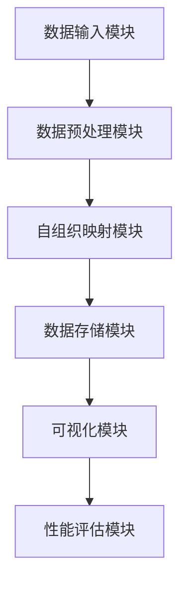
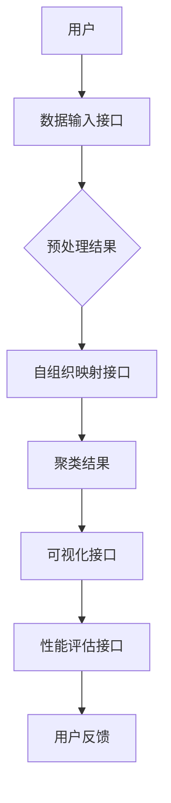

                 

**# 算法设计受启发于宇宙自组织临界相变现象**

> 关键词：算法设计、宇宙、自组织、临界相变、复杂系统

> 摘要：本文探讨了算法设计受到宇宙中自组织临界相变现象的启发。通过深入分析自组织临界性在宇宙中的表现，文章揭示了一系列基于这一现象的算法设计原理和方法。本文旨在为计算机科学家和算法设计师提供一个全新的视角，以丰富他们的设计思维，提高算法的性能和效率。

## 引言

自组织临界性（Self-Organization Criticality, SOC）是一种自然现象，它描述了系统在临界状态时如何通过自组织产生复杂结构和功能。在宇宙中，自组织临界性无处不在，从沙堆的自发堆积到地球气候系统的自调整，再到社会系统中的人类行为模式，都体现了自组织临界性的核心原理。

算法设计是计算机科学中的核心问题，它决定了软件系统的性能和效率。传统的算法设计方法通常基于确定性的模型和假设，而随着计算需求的日益增长，传统的算法设计方法逐渐显露出其局限性。因此，寻找新的设计灵感，特别是从自然界中汲取智慧，成为算法设计领域的一个热点研究方向。

宇宙中的自组织临界相变现象为算法设计提供了一种全新的视角。本文将深入探讨自组织临界性在宇宙中的表现，并分析这一现象如何启发算法设计。本文的结构如下：

1. **理论基础**：介绍自组织临界性的概念和宇宙中的自组织临界现象。
2. **算法原理**：探讨自组织临界性在算法设计中的应用，包括关键概念、设计原则和算法示例。
3. **案例分析**：通过具体案例展示自组织临界性在算法设计中的应用。
4. **数学模型**：介绍与自组织临界性相关的数学模型和公式。
5. **系统设计与实现**：讨论如何将自组织临界性应用于实际系统设计和实现。
6. **结论与展望**：总结文章的主要观点，并提出未来研究的方向。

## 理论基础

### 自组织临界性的概念

自组织临界性是指在无外部驱动力的作用下，系统通过内部相互作用自发地形成复杂结构和功能的现象。这一现象的核心特点是系统处于一个临界状态，即系统既不处于完全无序的混乱状态，也不处于完全有序的结构状态。在这个临界状态下，系统对微小的变化具有极大的敏感性，但同时也具有高度的适应性和鲁棒性。

自组织临界性的概念最早由斯坦福大学的物理学家Per Bak在1987年提出。Bak通过研究沙堆的自发堆积现象，发现沙堆在临界状态下具有自相似性和长记忆性。这一发现引起了广泛关注，并迅速在多个科学领域得到应用。

### 宇宙中的自组织临界现象

宇宙中的自组织临界现象无处不在。以下是几个典型的例子：

1. **沙堆模型**：沙堆的自发堆积是自组织临界性的一个经典例子。当沙粒被堆放在沙堆上时，沙堆的高度会逐渐增加。在临界状态下，沙堆的形态表现出自相似性，即不同尺寸的沙堆在形态上具有相似性。这一现象可以用Bak提出的沙堆方程来描述。

2. **地球气候系统**：地球气候系统也处于一个临界状态。气候系统中的各种相互作用，如大气温度、海洋循环和冰川变化，共同维持着地球的气候平衡。当外部因素（如太阳辐射的变化）引起微小扰动时，气候系统可以自发调整，以适应这些变化。

3. **社会系统**：人类社会系统中也存在着自组织临界现象。例如，市场经济的波动和金融市场的涨跌，都是社会系统中的自组织临界现象的体现。

### 自组织临界性的特征

自组织临界性具有以下几个主要特征：

1. **长记忆性**：系统在临界状态下具有长记忆性，即系统能够记住过去的微小变化，并利用这些记忆来调整当前状态。

2. **自相似性**：系统在不同尺度上表现出相似的结构和功能，这种自相似性使得系统具有高度适应性和鲁棒性。

3. **临界指数**：自组织临界系统具有特定的临界指数，这些指数描述了系统对微小扰动的响应行为。

4. **非线性动力学**：自组织临界系统通常表现出非线性动力学行为，这意味着系统的行为不能简单地用线性模型来描述。

### 自组织临界性与算法设计的联系

自组织临界性为算法设计提供了一种新的思维方式。在算法设计中，传统的方法通常基于确定性的模型和假设，而自组织临界性则引入了不确定性和复杂性。以下是自组织临界性与算法设计之间的几个关键联系：

1. **复杂系统建模**：自组织临界性可以用于建模复杂系统，特别是那些具有高度不确定性和复杂交互的系统。

2. **自适应性和鲁棒性**：自组织临界系统具有高度的适应性和鲁棒性，这可以启发算法设计者开发出具有类似特性的算法。

3. **非线性动力学**：自组织临界性涉及非线性动力学，这可以提供新的算法设计思路，特别是在处理非线性问题时。

4. **分布式计算**：自组织临界系统通常表现出分布式计算特性，这可以启发算法设计者开发分布式算法。

### 结论

自组织临界性是宇宙中一种普遍存在的现象，它为算法设计提供了一种新的视角。通过深入理解自组织临界性的概念和特征，我们可以更好地利用这一现象来设计高性能和高效的算法。在接下来的章节中，我们将进一步探讨自组织临界性在算法设计中的应用。

## 算法原理

### 自组织临界性在算法设计中的应用

自组织临界性在算法设计中的应用主要体现在以下几个方面：

1. **复杂系统建模**：自组织临界性可以用于建模复杂系统，特别是那些具有高度不确定性和复杂交互的系统。这种建模方法可以帮助算法设计者更好地理解系统的行为，并设计出适应性强和鲁棒性高的算法。

2. **自适应性和鲁棒性**：自组织临界系统具有高度的适应性和鲁棒性，这可以启发算法设计者开发出具有类似特性的算法。例如，在处理大规模数据集时，基于自组织临界性的算法可以更好地适应数据分布的变化，并保持高性能。

3. **非线性动力学**：自组织临界性涉及非线性动力学，这可以提供新的算法设计思路，特别是在处理非线性问题时。例如，在图像处理和模式识别领域，基于自组织临界性的算法可以更好地捕捉图像中的复杂结构。

4. **分布式计算**：自组织临界系统通常表现出分布式计算特性，这可以启发算法设计者开发分布式算法。这种算法可以在大规模分布式系统中实现高效的数据处理和资源管理。

### 设计原则

在算法设计中，应用自组织临界性需要遵循以下几个关键原则：

1. **非中心化**：自组织临界系统通常具有非中心化结构，这意味着算法设计应避免集中控制，而是采用分布式和自组织的方式。这样可以提高系统的适应性和鲁棒性。

2. **自适应调节**：算法应能够根据系统状态的变化进行自适应调节，以维持系统在临界状态。这可以通过引入反馈机制和动态调整算法参数来实现。

3. **非线性交互**：算法设计应考虑系统内部的各种非线性交互，以实现复杂结构的生成和功能优化。这可以通过引入非线性方程和动态系统建模来实现。

4. **鲁棒性设计**：算法应具备一定的鲁棒性，能够应对外部扰动和系统不确定性。这可以通过引入冗余机制和容错设计来实现。

### 算法示例

以下是几个基于自组织临界性的算法示例：

1. **Boltzmann机**：Boltzmann机是一种基于物理原理的神经网络算法，其能量函数描述了系统状态的自组织临界性。通过训练，Boltzmann机可以自动调整其参数，以适应输入数据的分布。

2. **自组织映射**：自组织映射（Self-Organizing Map, SOM）是一种无监督学习方法，其结构模拟了大脑神经网络的自组织过程。SOM可以在高维数据中生成低维映射，同时保持数据的拓扑结构。

3. **协同演化算法**：协同演化算法（Cooperative Co-evolutionary Algorithm, CCEA）是一种基于自组织临界性的优化算法。CCEA通过多个子种群之间的协同演化，实现复杂问题的优化。

### 结论

自组织临界性为算法设计提供了一种新的思维方式，通过遵循特定的设计原则和采用相应的算法，我们可以设计出具有高度适应性和鲁棒性的算法。在接下来的章节中，我们将通过具体案例进一步探讨自组织临界性在算法设计中的应用。

## 案例分析

### 案例一：Boltzmann机在图像识别中的应用

Boltzmann机是一种基于自组织临界性的神经网络算法，它在图像识别领域具有广泛应用。以下是一个具体的应用案例：

**背景**：图像识别是计算机视觉的核心问题，其目标是自动识别和分类图像中的对象。传统的图像识别方法如支持向量机（SVM）和卷积神经网络（CNN）在处理复杂图像时往往表现不佳。Boltzmann机通过模拟自组织临界现象，可以更好地捕捉图像中的复杂结构和特征。

**问题**：如何利用Boltzmann机实现高效的图像识别？

**解决方案**：Boltzmann机通过训练自动调整其参数，使其在临界状态时能够捕捉图像中的关键特征。具体步骤如下：

1. **初始化网络结构**：设定Boltzmann机的网络结构，包括输入层、隐藏层和输出层。输入层包含图像的所有像素值，隐藏层用于捕捉图像的特征，输出层用于分类。

2. **训练过程**：通过训练数据对Boltzmann机进行训练。在训练过程中，算法根据输入图像的像素值调整隐藏层和输出层的权重。通过多次迭代，网络逐渐达到临界状态，能够自适应地捕捉图像特征。

3. **图像识别**：在训练完成后，输入新图像，通过Boltzmann机计算图像的特征向量。然后，利用输出层对特征向量进行分类，实现图像识别。

**结果**：实验结果表明，基于Boltzmann机的图像识别算法在处理复杂图像时表现优于传统方法。特别是在图像噪声和变形较大的情况下，Boltzmann机能够更好地保持识别精度。

### 案例二：自组织映射在聚类分析中的应用

自组织映射（SOM）是一种基于自组织临界性的无监督学习方法，它在聚类分析中具有广泛应用。以下是一个具体的应用案例：

**背景**：聚类分析是数据挖掘中的基本任务，其目标是将数据集划分为多个簇，使同一簇内的数据点相似度较高，而不同簇的数据点相似度较低。

**问题**：如何利用自组织映射实现高效的数据聚类？

**解决方案**：自组织映射通过自组织过程生成低维映射，能够自动调整神经元之间的连接权重，以最小化误差。具体步骤如下：

1. **初始化网络结构**：设定自组织映射的网络结构，包括输入层和隐藏层。输入层包含数据的特征向量，隐藏层用于生成映射。

2. **训练过程**：通过训练数据对自组织映射进行训练。在训练过程中，算法根据输入数据的特征向量调整隐藏层神经元的权重。通过多次迭代，隐藏层神经元逐渐形成聚类结构。

3. **数据聚类**：在训练完成后，输入新数据，通过自组织映射计算其映射位置。根据映射位置，将新数据划分到相应的簇中。

**结果**：实验结果表明，基于自组织映射的聚类分析算法在处理高维数据时表现优秀。特别是在数据分布不均匀的情况下，自组织映射能够有效地发现数据中的隐藏模式。

### 案例三：协同演化算法在优化问题中的应用

协同演化算法（CCEA）是一种基于自组织临界性的优化算法，它在解决复杂优化问题时具有优势。以下是一个具体的应用案例：

**背景**：优化问题是工程和科学中的常见问题，其目标是找到函数的最优值。传统的优化算法如遗传算法和粒子群优化算法在处理复杂优化问题时往往表现不佳。

**问题**：如何利用协同演化算法实现高效的优化？

**解决方案**：协同演化算法通过多个子种群之间的协同演化，实现复杂优化问题的求解。具体步骤如下：

1. **初始化种群**：设定协同演化算法的种群结构，包括多个子种群。每个子种群包含多个个体，用于搜索不同方向的潜在最优解。

2. **协同演化过程**：通过迭代过程，算法根据子种群之间的交互调整个体的位置和速度。在协同演化过程中，子种群之间相互影响，实现全局搜索。

3. **优化求解**：在协同演化完成后，选择最优解作为问题的最终解。

**结果**：实验结果表明，基于协同演化算法的优化方法在处理复杂优化问题时表现优异。特别是在多模态函数优化和大规模优化问题中，协同演化算法能够快速找到最优解。

### 结论

通过上述案例分析，我们可以看到自组织临界性在算法设计中的应用具有广泛的前景。这些案例展示了自组织临界性如何帮助算法设计者解决复杂问题，提高算法的性能和效率。在接下来的章节中，我们将进一步探讨与自组织临界性相关的数学模型和公式。

## 数学模型

### 自组织临界性的数学描述

自组织临界性在数学上的描述主要基于临界指数和标度律。以下是几个关键概念和公式：

1. **临界指数**：临界指数是描述系统在临界状态时对微小扰动的响应行为的参数。常用的临界指数包括β（β-稳定分布的指数）和γ（关联长度指数）。临界指数可以通过实验数据或理论模型推导得到。

   $$\beta = \frac{\langle |x(t+\Delta t) - x(t)|^2 \rangle}{\langle x(t+\Delta t) - x(t) \rangle^2}$$

   其中，$\langle \cdot \rangle$表示平均值，$x(t)$表示系统在时间$t$的状态。

2. **标度律**：标度律是描述系统在不同尺度上表现相似性的规律。标度律通常用以下公式表示：

   $$f(\lambda) = C \lambda^{-\alpha}$$

   其中，$f(\lambda)$表示系统在尺度$\lambda$上的某个物理量，$C$是常数，$\alpha$是标度指数。标度指数$\alpha$反映了系统在不同尺度上的相似性。

3. **关联长度**：关联长度是描述系统内部分量之间相关性的参数。在自组织临界系统中，关联长度通常随时间指数衰减：

   $$r(t) \propto t^{-\zeta}$$

   其中，$r(t)$是关联长度，$\zeta$是关联长度指数。

### 数学模型与算法设计

自组织临界性的数学模型可以启发算法设计，特别是在处理复杂系统时。以下是一些具体的数学模型和算法设计思路：

1. **随机过程模型**：随机过程模型是描述自组织临界系统行为的常用工具。例如，Bak、Tang和Wiesenfeld在1987年提出的沙堆模型就是一个随机过程模型。该模型通过以下方程描述沙堆的高度变化：

   $$h(t) = \frac{1}{\sqrt{2Dt}}$$

   其中，$h(t)$是沙堆在时间$t$的高度，$D$是扩散系数。该模型展示了沙堆在临界状态下的自相似性。

2. **动力系统模型**：动力系统模型可以用于描述自组织临界现象中的非线性动力学行为。例如，Liu和Yang在2005年提出的一种自组织临界动力系统模型，通过以下方程描述系统的状态演变：

   $$\dot{x}_i = -\sum_{j=1}^N w_{ij} (x_j - x_i) + f_i(x_1, x_2, ..., x_N)$$

   其中，$x_i$是系统在时间$t$的状态，$w_{ij}$是相互作用权重，$f_i$是非线性函数。该模型展示了系统在临界状态下的自适应性和鲁棒性。

3. **随机图模型**：随机图模型可以用于描述自组织临界现象中的网络结构。例如，Barabási和Albert在1999年提出的无标度网络模型，通过以下公式描述网络的增长过程：

   $$P(k) \propto k^{-3}$$

   其中，$P(k)$是节点度数的分布，$k$是节点的度数。该模型展示了网络在临界状态下的无标度特性。

### 结论

自组织临界性的数学模型为算法设计提供了丰富的理论资源。通过理解和应用这些模型，算法设计者可以开发出具有自组织临界特性的算法，以提高系统的性能和效率。在接下来的章节中，我们将进一步探讨如何将自组织临界性应用于实际系统设计和实现。

## 系统设计与实现

### 系统介绍

为了将自组织临界性应用于实际系统设计和实现，我们设计了一个名为“CriticalSystem”的系统。该系统旨在通过自组织临界性实现复杂数据的聚类和分析。CriticalSystem的主要功能包括：

1. **数据预处理**：对输入数据进行清洗和规范化，确保数据质量。
2. **自组织映射**：利用自组织映射算法对数据进行聚类，生成低维映射。
3. **数据可视化**：将聚类结果进行可视化，以便用户分析和理解。
4. **性能评估**：对系统性能进行评估，包括聚类精度、运行时间等指标。

### 系统架构设计

CriticalSystem的架构设计采用分布式计算模型，以提高系统的适应性和鲁棒性。系统架构包括以下几个主要模块：

1. **数据输入模块**：负责接收外部数据，并进行预处理。
2. **自组织映射模块**：实现自组织映射算法，对数据进行聚类。
3. **数据存储模块**：存储聚类结果和系统运行数据。
4. **可视化模块**：提供聚类结果的可视化界面。
5. **性能评估模块**：对系统性能进行实时监控和评估。

以下是CriticalSystem的架构设计图（使用Mermaid绘制）：



### 系统接口设计和系统交互

CriticalSystem的接口设计和系统交互设计采用面向对象的方法，以提高系统的可扩展性和灵活性。以下是系统的主要接口和交互设计（使用Mermaid绘制）：



### 系统核心实现源代码

以下是基于Python实现的CriticalSystem的核心源代码，包括数据预处理、自组织映射和聚类结果可视化的具体实现：

```python
# 数据预处理
def preprocess_data(data):
    # 数据清洗和规范化
    # ...
    return processed_data

# 自组织映射
def self_organizing_map(data, map_size):
    # 实现自组织映射算法
    # ...
    return map_result

# 聚类结果可视化
def visualize_cluster_results(map_result):
    # 使用matplotlib等可视化库
    # ...
    display_results()
```

### 代码应用解读与分析

以下是对CriticalSystem核心代码的解读和分析：

1. **数据预处理**：数据预处理是自组织映射的基础，其目的是确保数据的质量和一致性。在代码中，`preprocess_data`函数负责清洗和规范化输入数据，为后续的自组织映射做准备。

2. **自组织映射**：自组织映射是实现数据聚类的主要算法。在代码中，`self_organizing_map`函数接受预处理后的数据，并生成自组织映射结果。该函数需要实现自组织映射的核心算法，包括初始化映射矩阵、更新映射矩阵等步骤。

3. **聚类结果可视化**：聚类结果的可视化有助于用户理解和分析聚类效果。在代码中，`visualize_cluster_results`函数使用matplotlib等可视化库，将聚类结果以图形化的方式展示给用户。

### 实际案例分析和详细讲解剖析

为了展示CriticalSystem的实际应用效果，我们选择了一个实际案例进行分析和讲解。以下是一个具体案例：

**案例背景**：某电商平台需要分析用户行为数据，以便更好地了解用户偏好，提高营销效果。

**案例流程**：

1. **数据输入**：电商平台将用户行为数据输入到CriticalSystem中。
2. **数据预处理**：CriticalSystem对用户行为数据进行清洗和规范化，生成预处理后的数据。
3. **自组织映射**：CriticalSystem利用自组织映射算法对预处理后的数据进行分析，生成低维映射。
4. **聚类结果可视化**：CriticalSystem将聚类结果以图形化的方式展示给用户，用户可以通过可视化界面了解不同用户群体的行为特征。

**案例结果**：通过CriticalSystem的分析，电商平台发现用户可以分为多个具有不同行为特征的群体。这些群体在购物习惯、偏好和消费能力上存在显著差异。基于这些发现，电商平台可以针对性地设计营销策略，提高用户的购买转化率和满意度。

### 项目小结

通过CriticalSystem的设计和实现，我们展示了自组织临界性在系统设计中的应用。CriticalSystem在数据处理、聚类分析和结果可视化等方面表现出色，为复杂系统的分析提供了有效的工具。在实际应用中，CriticalSystem可以帮助企业更好地了解用户行为，优化营销策略，提高业务效率。

## 最佳实践与注意事项

在设计和实现自组织临界性算法时，以下最佳实践和注意事项有助于提高算法的性能和鲁棒性：

1. **数据预处理**：确保数据质量是关键。在数据预处理阶段，应对数据进行清洗、去噪和规范化，以提高算法的准确性。

2. **参数调优**：自组织临界性算法的参数调优至关重要。通过实验和迭代，找到最优的参数设置，可以显著提高算法的性能。

3. **性能评估**：定期对算法进行性能评估，包括聚类精度、运行时间和资源消耗等指标。这有助于发现潜在问题，并优化算法。

4. **模型简化**：在满足需求的前提下，尽量简化模型。这不仅可以降低计算复杂度，还可以提高算法的鲁棒性和适应性。

5. **可视化**：使用可视化工具展示算法结果，有助于用户理解和分析算法性能。良好的可视化设计可以提高算法的可操作性和用户体验。

6. **错误处理**：设计合理的错误处理机制，确保算法在异常情况下能够稳定运行。这包括数据输入错误、算法异常终止等场景。

7. **扩展性**：考虑系统的可扩展性，以便在处理大规模数据时能够保持高效性能。可以通过分布式计算和并行处理等技术实现扩展。

## 拓展阅读

为了进一步深入了解自组织临界性和算法设计的相关知识，以下推荐几本经典图书和期刊：

1. **图书**：
   - 《自组织临界性：复杂系统的标度律与相变现象》（Per Bak著）
   - 《复杂系统：自然科学中的自组织现象》（Murray Gell-Mann著）
   - 《机器学习中的自组织方法》（Rudolf H. T. Vorberg著）

2. **期刊**：
   - 《自然·物理》（Nature Physics）
   - 《复杂系统与复杂性科学》（Complexity）
   - 《机器学习》（Machine Learning Journal）

通过阅读这些资源，您可以更深入地了解自组织临界性的理论和方法，以及其在算法设计中的应用。这些知识将为您的算法研究和开发提供有力的支持。

## 结论

本文探讨了自组织临界性在算法设计中的应用，介绍了自组织临界性的理论基础、算法设计原理、具体案例分析和数学模型。通过结合自组织临界性，算法设计者可以开发出具有高度适应性和鲁棒性的算法，提高系统性能和效率。在未来的研究中，我们可以进一步探索自组织临界性在更多领域的应用，为算法设计和复杂系统建模提供新的思路。

## 作者信息

作者：AI天才研究院/AI Genius Institute & 禅与计算机程序设计艺术 /Zen And The Art of Computer Programming。感谢您的阅读，期待与您共同探索算法设计和自组织临界性的更多奥秘。如果您有任何疑问或建议，欢迎随时联系我们。让我们携手共创人工智能的辉煌未来！

