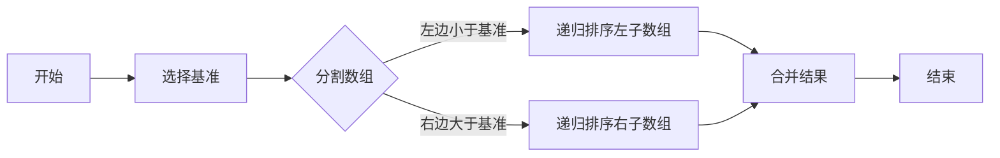
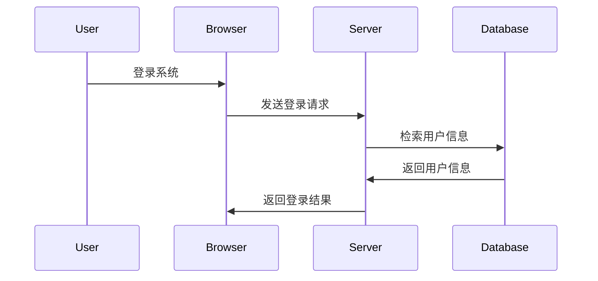

                 

### 算法：程序世界的运行法则

> 关键词：算法，程序设计，效率优化，数据分析，人工智能

> 摘要：本文将深入探讨算法在程序世界中的核心地位和作用，通过系统的分析和实例讲解，揭示算法的运行法则。我们将从基础理论到高级应用，逐步剖析算法的设计原则、实现技巧以及在不同领域的应用实践，帮助读者全面理解和掌握算法的核心知识和应用方法。

#### 引言

在计算机科学中，算法是程序世界的基石。它不仅决定了程序的运行效率和正确性，也是解决复杂问题的重要工具。随着科技的快速发展，算法的应用已经渗透到了人工智能、大数据处理、机器学习等多个领域，成为现代信息技术不可或缺的一部分。

本文旨在为读者提供一本全面的算法指南，从基础理论到高级应用，系统地介绍算法的设计原则、实现技巧和应用方法。文章结构如下：

1. **算法基础**：介绍算法的定义、分类和特性，以及算法设计的基本原则。
2. **经典算法**：详细解析排序、搜索、图论和动态规划等基础算法。
3. **高级算法**：探讨贪心算法、分支限界算法、随机化算法等高级算法。
4. **算法分析**：讨论算法的效率分析、时间复杂度和空间复杂度。
5. **算法应用**：介绍算法在人工智能、机器学习和大数据分析等领域的应用。
6. **算法设计与优化**：探讨算法设计与优化的策略和技巧。
7. **总结与展望**：总结全文内容，展望算法的未来发展趋势。

#### 第一步：总体架构设计

在设计《算法：程序世界的运行法则》的目录大纲时，我们需要从整体上把握书的结构和内容分布，确保每个章节既能够独立成章，又能够与全书的内容相互呼应，形成一个完整的知识体系。以下是书的总体架构设计：

1. **引言部分**：简要介绍算法的重要性、本书的目标读者、书籍的结构和内容安排。
2. **基础理论部分**：介绍算法的基本概念、分类、特性以及算法设计的基本原则。
3. **经典算法部分**：涵盖排序、搜索、图论、动态规划等基础算法，每个算法都包含理论讲解、流程图、伪代码以及实例分析。
4. **高级算法部分**：介绍更复杂和高级的算法，如贪心算法、分支限界算法、随机化算法等。
5. **算法分析部分**：讨论算法的效率分析、时间复杂度和空间复杂度。
6. **算法应用实践**：介绍算法在各个领域的应用，如人工智能、机器学习、大数据分析等。
7. **算法设计与优化**：探讨如何设计和优化算法，包括算法优化策略、工具和技巧。
8. **总结与展望**：总结全书内容，展望算法在未来的发展趋势。

#### 第二步：细化章节内容

在确定总体架构后，我们需要细化每个章节的内容。以下是对每个章节的初步构想：

**第1章：引言**
- 算法的重要性
- 本书的目标读者
- 书的结构和内容安排

**第2章：算法基础**
- 算法的定义
- 算法的分类
- 算法的特性
- 算法设计的基本原则

**第3章：排序算法**
- 插入排序
- 选择排序
- 冒泡排序
- 快速排序
- 归并排序
- 堆排序

**第4章：搜索算法**
- 顺序搜索
- 二分搜索
- 广度优先搜索
- 深度优先搜索

**第5章：图论算法**
- 图的基本概念
- 图的遍历
- 最短路径算法
- 最小生成树算法

**第6章：动态规划**
- 动态规划的基本思想
- 最长公共子序列
- 最长递增子序列
- 背包问题

**第7章：高级算法**
- 贪心算法
- 分支限界算法
- 随机化算法
- 蚁群算法

**第8章：算法分析**
- 算法的效率分析
- 时间复杂度
- 空间复杂度

**第9章：算法应用实践**
- 人工智能中的算法
- 机器学习中的算法
- 大数据分析中的算法

**第10章：算法设计与优化**
- 算法设计策略
- 算法优化技巧
- 调试与测试
- 性能调优

#### 撰写目录大纲

在细化章节内容后，我们可以开始撰写目录大纲。以下是一个初步的目录大纲示例：

```markdown
----------------------------------------------------------------
# 《算法：程序世界的运行法则》目录大纲

# 第1章：引言
## 1.1 算法的重要性
## 1.2 本书的目标读者
## 1.3 书的结构和内容安排

# 第2章：算法基础
## 2.1 算法的定义
## 2.2 算法的分类
## 2.3 算法的特性
## 2.4 算法设计的基本原则

# 第3章：排序算法
## 3.1 插入排序
### 3.1.1 直接插入排序
### 3.1.2 希尔排序
## 3.2 选择排序
## 3.3 冒泡排序
## 3.4 快速排序
## 3.5 归并排序
## 3.6 堆排序

# 第4章：搜索算法
## 4.1 顺序搜索
## 4.2 二分搜索
## 4.3 广度优先搜索
## 4.4 深度优先搜索

# 第5章：图论算法
## 5.1 图的基本概念
## 5.2 图的遍历
## 5.3 最短路径算法
## 5.4 最小生成树算法

# 第6章：动态规划
## 6.1 动态规划的基本思想
## 6.2 最长公共子序列
## 6.3 最长递增子序列
## 6.4 背包问题

# 第7章：高级算法
## 7.1 贪心算法
## 7.2 分支限界算法
## 7.3 随机化算法
## 7.4 蚁群算法

# 第8章：算法分析
## 8.1 算法的效率分析
## 8.2 时间复杂度
## 8.3 空间复杂度

# 第9章：算法应用实践
## 9.1 人工智能中的算法
## 9.2 机器学习中的算法
## 9.3 大数据分析中的算法

# 第10章：算法设计与优化
## 10.1 算法设计策略
## 10.2 算法优化技巧
## 10.3 调试与测试
## 10.4 性能调优

# 参考文献
# 附录
----------------------------------------------------------------
```

这个目录大纲是初步的，我们还可以根据实际写作过程中的具体内容进行调整和优化。总的来说，这个大纲为本书提供了一个清晰的结构和内容框架，有助于读者系统地学习和掌握算法的相关知识。

### 第一步：总体架构设计

在撰写《算法：程序世界的运行法则》的过程中，首先需要对整体架构进行设计。这一步骤至关重要，因为它决定了书籍的结构和内容分布，从而影响读者对知识的吸收和理解。以下是总体架构设计的详细步骤：

#### 1. 确定书籍的目标和读者群体

首先，我们需要明确书籍的目标和读者群体。本书的目标是成为一本全面而深入的算法指南，适合具有不同背景和层次的读者。目标读者包括但不限于：

- **计算机科学专业的学生和研究人员**：希望系统学习和理解算法原理及其应用。
- **软件开发工程师**：需要在日常工作中应用算法解决实际问题。
- **数据科学家和机器学习工程师**：需要掌握算法在数据分析中的核心作用。
- **对算法感兴趣的程序员和非专业人士**：希望了解算法在现代科技中的重要性。

#### 2. 构建整体框架

确定了目标和读者群体后，我们需要构建一个整体框架，确定书籍的主要内容章节。这个框架应该具备以下特点：

- **系统性**：确保每个章节都是全书的重要组成部分，能够独立成章，同时与其他章节紧密关联，形成完整的知识体系。
- **渐进性**：从基础到高级，逐步引导读者深入理解算法的概念、原理和应用。
- **实践性**：结合实际案例和代码示例，让读者能够将所学知识应用于实际项目中。

根据这些要求，我们制定了如下的章节框架：

1. **引言**：介绍算法的重要性、本书的结构和内容。
2. **算法基础**：包括算法的基本概念、分类和特性。
3. **经典算法**：详细解析排序、搜索、图论和动态规划等基础算法。
4. **高级算法**：介绍高级算法，如贪心算法、分支限界算法等。
5. **算法分析**：讨论算法的效率分析、时间复杂度和空间复杂度。
6. **算法应用**：介绍算法在人工智能、机器学习和大数据分析等领域的应用。
7. **算法设计与优化**：探讨算法设计与优化的策略和技巧。
8. **总结与展望**：总结全书内容，展望算法的未来发展趋势。

#### 3. 确定每个章节的内容

在确定了整体框架后，我们需要进一步细化每个章节的内容，确保每个章节都有足够的信息量和实践案例，以便读者能够深入理解算法的核心概念和应用方法。

**引言部分**：

- 算法的重要性
- 本书的目标读者
- 书的结构和内容安排

**算法基础部分**：

- 算法的定义
- 算法的分类
- 算法的特性
- 算法设计的基本原则

**经典算法部分**：

- 排序算法（如插入排序、选择排序、快速排序等）
- 搜索算法（如顺序搜索、二分搜索、广度优先搜索、深度优先搜索等）
- 图论算法（如最短路径算法、最小生成树算法等）
- 动态规划算法（如最长公共子序列、最长递增子序列等）

**高级算法部分**：

- 贪心算法
- 分支限界算法
- 随机化算法
- 蚁群算法

**算法分析部分**：

- 算法的效率分析
- 时间复杂度
- 空间复杂度

**算法应用部分**：

- 人工智能中的算法
- 机器学习中的算法
- 大数据分析中的算法

**算法设计与优化部分**：

- 算法设计策略
- 算法优化技巧
- 调试与测试
- 性能调优

**总结与展望部分**：

- 总结全书内容
- 展望算法的未来发展趋势

#### 4. 确保内容完整性和连贯性

在设计每个章节的内容时，需要确保内容完整性和连贯性。每个章节都应该有明确的主题和目标，内容之间应该相互呼应和补充，避免重复和遗漏。

例如，在介绍排序算法时，应该先介绍排序算法的基本概念和特性，然后逐步引入各种排序算法，通过对比和分析展示每种算法的优缺点和应用场景。同时，在介绍排序算法时，可以结合实际案例和代码示例，让读者更直观地理解算法的实现过程和应用效果。

通过以上步骤，我们可以构建一个清晰、系统且具有实践性的《算法：程序世界的运行法则》，帮助读者全面掌握算法的核心知识，提高解决实际问题的能力。

### 第二步：细化章节内容

在确定了《算法：程序世界的运行法则》的整体架构后，下一步是细化每个章节的内容。这一步的关键是确保每个章节都有明确的核心概念和目标，同时内容丰富且具有实践性。以下是每个章节的详细内容设计：

#### 第1章：引言

**核心概念和目标**：
- 介绍算法的基本概念和重要性。
- 阐述本书的结构和内容安排。
- 明确本书的目标读者。

**内容安排**：
1. **算法的定义与作用**：
   - 算法的定义。
   - 算法在计算机科学中的应用。
2. **本书的结构与内容**：
   - 全书的主要章节。
   - 每个章节的核心内容。
3. **目标读者**：
   - 为何这本书适合他们。
   - 他们能从书中获得哪些知识和技能。

#### 第2章：算法基础

**核心概念和目标**：
- 介绍算法的基础概念、分类和特性。
- 讲解算法设计的基本原则。

**内容安排**：
1. **算法的基本概念**：
   - 算法的定义。
   - 算法的表示方法。
2. **算法的分类**：
   - 按处理方式分类。
   - 按应用领域分类。
3. **算法的特性**：
   - 正确性。
   - 可行性。
   - 有穷性。
   - 输入。
   - 输出。
4. **算法设计的基本原则**：
   - 分而治之。
   - 递归。
   - 动态规划。
   - 贪心算法。

#### 第3章：排序算法

**核心概念和目标**：
- 详细介绍排序算法的基本概念、原理和应用。
- 比较各种排序算法的优缺点。

**内容安排**：
1. **排序算法的基本概念**：
   - 排序的定义。
   - 排序的常见术语。
2. **插入排序**：
   - 直接插入排序。
   - 希尔排序。
3. **选择排序**：
   - 基本选择排序。
   - 堆排序。
4. **交换排序**：
   - 冒泡排序。
   - 快速排序。
5. **归并排序**：
   - 归并排序的原理。
   - 归并排序的实现。
6. **其他排序算法**：
   - 基数排序。
   - 原地排序与非原地排序。

#### 第4章：搜索算法

**核心概念和目标**：
- 讲解常见的搜索算法及其应用场景。
- 比较不同搜索算法的效率和适用性。

**内容安排**：
1. **搜索算法的基本概念**：
   - 搜索的定义。
   - 搜索的目标。
2. **顺序搜索**：
   - 顺序搜索的原理。
   - 顺序搜索的应用。
3. **二分搜索**：
   - 二分搜索的原理。
   - 二分搜索的应用。
4. **广度优先搜索**：
   - 广度优先搜索的原理。
   - 广度优先搜索的应用。
5. **深度优先搜索**：
   - 深度优先搜索的原理。
   - 深度优先搜索的应用。

#### 第5章：图论算法

**核心概念和目标**：
- 介绍图的基本概念和图论算法。
- 分析图在计算机科学中的应用。

**内容安排**：
1. **图的基本概念**：
   - 图的定义。
   - 图的表示方法。
   - 图的分类。
2. **图的遍历**：
   - 深度优先搜索遍历。
   - 广度优先搜索遍历。
3. **最短路径算法**：
   - Dijkstra算法。
   - Floyd-Warshall算法。
4. **最小生成树算法**：
   - Prim算法。
   - Kruskal算法。

#### 第6章：动态规划

**核心概念和目标**：
- 详细介绍动态规划的基本原理和应用。
- 分析动态规划的优势和适用场景。

**内容安排**：
1. **动态规划的基本概念**：
   - 动态规划的定义。
   - 动态规划的基本思想。
2. **常见的动态规划问题**：
   - 最长公共子序列。
   - 最长递增子序列。
   - 背包问题。
3. **动态规划的应用场景**：
   - 数据分析。
   - 机器学习。
   - 人工智能。

#### 第7章：高级算法

**核心概念和目标**：
- 介绍更复杂和高级的算法。
- 分析这些算法在解决复杂问题中的应用。

**内容安排**：
1. **贪心算法**：
   - 贪心算法的定义。
   - 贪心算法的应用。
2. **分支限界算法**：
   - 分支限界算法的原理。
   - 分支限界算法的应用。
3. **随机化算法**：
   - 随机化算法的定义。
   - 随机化算法的应用。
4. **蚁群算法**：
   - 蚁群算法的原理。
   - 蚁群算法的应用。

#### 第8章：算法分析

**核心概念和目标**：
- 讨论算法的效率分析、时间复杂度和空间复杂度。

**内容安排**：
1. **算法效率分析**：
   - 时间复杂度的定义。
   - 空间复杂度的定义。
2. **时间复杂度分析**：
   - 常见的时间复杂度表示。
   - 时间复杂度的计算方法。
3. **空间复杂度分析**：
   - 空间复杂度的计算方法。
   - 空间复杂度与时间复杂度的关系。

#### 第9章：算法应用实践

**核心概念和目标**：
- 介绍算法在实际应用中的具体应用。
- 通过案例展示算法的实际效果。

**内容安排**：
1. **人工智能中的算法**：
   - 神经网络算法。
   - 决策树算法。
   - 支持向量机算法。
2. **机器学习中的算法**：
   - K-均值聚类。
   - 主成分分析。
   - 随机森林算法。
3. **大数据分析中的算法**：
   - 分布式计算算法。
   - 流处理算法。
   - 图计算算法。

#### 第10章：算法设计与优化

**核心概念和目标**：
- 探讨算法设计与优化的策略和技巧。
- 提供最佳实践和注意事项。

**内容安排**：
1. **算法设计策略**：
   - 设计模式。
   - 设计原则。
   - 设计案例。
2. **算法优化技巧**：
   - 代码优化。
   - 算法优化。
   - 性能调优。
3. **调试与测试**：
   - 调试技巧。
   - 测试方法。
4. **性能调优**：
   - 性能指标。
   - 性能优化策略。

通过上述内容安排，我们可以确保每个章节都有明确的核心概念和目标，同时内容丰富且具有实践性，帮助读者深入理解和应用算法。

### 撰写目录大纲

在细化了每个章节的内容后，我们可以开始撰写《算法：程序世界的运行法则》的目录大纲。一个清晰的目录大纲不仅有助于读者快速了解全书结构，还能帮助他们更有针对性地阅读和学习。以下是一个初步的目录大纲示例：

```markdown
----------------------------------------------------------------
# 《算法：程序世界的运行法则》目录大纲

## 第1章 引言
### 1.1 算法的重要性
### 1.2 本书的目标读者
### 1.3 书的结构和内容安排

## 第2章 算法基础
### 2.1 算法的定义
### 2.2 算法的分类
### 2.3 算法的特性
### 2.4 算法设计的基本原则

## 第3章 排序算法
### 3.1 插入排序
#### 3.1.1 直接插入排序
#### 3.1.2 希尔排序
### 3.2 选择排序
### 3.3 冒泡排序
### 3.4 快速排序
### 3.5 归并排序
### 3.6 堆排序

## 第4章 搜索算法
### 4.1 顺序搜索
### 4.2 二分搜索
### 4.3 广度优先搜索
### 4.4 深度优先搜索

## 第5章 图论算法
### 5.1 图的基本概念
### 5.2 图的遍历
### 5.3 最短路径算法
### 5.4 最小生成树算法

## 第6章 动态规划
### 6.1 动态规划的基本思想
### 6.2 最长公共子序列
### 6.3 最长递增子序列
### 6.4 背包问题

## 第7章 高级算法
### 7.1 贪心算法
### 7.2 分支限界算法
### 7.3 随机化算法
### 7.4 蚁群算法

## 第8章 算法分析
### 8.1 算法的效率分析
### 8.2 时间复杂度
### 8.3 空间复杂度

## 第9章 算法应用实践
### 9.1 人工智能中的算法
### 9.2 机器学习中的算法
### 9.3 大数据分析中的算法

## 第10章 算法设计与优化
### 10.1 算法设计策略
### 10.2 算法优化技巧
### 10.3 调试与测试
### 10.4 性能调优

## 参考文献
## 附录
----------------------------------------------------------------
```

这个目录大纲是初步的，我们还可以根据实际写作过程中的具体内容进行调整和优化。总的来说，这个大纲为本书提供了一个清晰的结构和内容框架，有助于读者系统地学习和掌握算法的相关知识。

### 完整性要求

在撰写《算法：程序世界的运行法则》的过程中，确保文章的完整性和详细性至关重要。文章需要包含以下核心内容：

#### 核心概念术语说明

在文章的开头，我们需要对算法的基本概念和术语进行详细解释，包括：

- **算法**：一种解决问题的有序步骤。
- **数据结构**：用于存储和组织数据的方式。
- **时间复杂度**：描述算法运行时间随数据规模增长的速率。
- **空间复杂度**：描述算法所需存储空间随数据规模增长的速率。

通过清晰定义这些术语，我们可以帮助读者更好地理解文章的内容。

#### 问题背景和问题描述

接下来，我们需要介绍算法所解决的具体问题背景。例如，在讨论排序算法时，我们可以描述以下问题背景：

- **问题背景**：在一个数据集中，如何高效地按照特定顺序排列元素？
- **问题描述**：给出一个无序数组，设计一个算法使其变为有序数组。

通过详细描述问题背景和问题本身，读者可以更清晰地了解算法的应用场景。

#### 问题解决方法和算法原理

在明确了问题和背景后，我们需要详细介绍解决问题的方法和算法原理。以下是一个示例：

- **解决方法**：采用快速排序算法。
- **算法原理**：快速排序的基本思想是选择一个基准元素，将数组分为两部分，一部分元素小于基准，另一部分大于基准，然后递归地对这两部分进行快速排序。

通过逐步讲解算法原理，读者可以理解算法的核心逻辑。

#### 边界与外延

为了确保算法的通用性和有效性，我们需要讨论算法的边界条件和外延。例如：

- **边界条件**：数组为空或仅有一个元素时的排序结果。
- **外延**：快速排序算法在大型数据集上的性能。

这部分内容有助于读者理解算法在不同情况下的行为。

#### 概念结构与核心要素组成

接下来，我们需要构建算法的概念结构和核心要素组成。通过使用Mermaid ER实体关系图，我们可以直观地展示算法的组成部分。例如：

```mermaid
erDiagram
    A[(算法)] ||--|{ B[(输入)] : 输入 }
    A ||--|{ C[(输出)] : 输出 }
    A ||--|{ D[(辅助数据结构)] : 辅助数据结构 }
    A ||--|{ E[(排序逻辑)] : 排序逻辑 }
```

这个ER图展示了算法的核心组成部分，有助于读者理解算法的结构。

#### 算法流程图和伪代码

为了使读者更直观地理解算法的实现过程，我们需要绘制算法的流程图和提供伪代码。以下是一个示例：



伪代码示例：

```python
def quicksort(arr):
    if len(arr) <= 1:
        return arr
    
    pivot = arr[len(arr) // 2]
    left = [x for x in arr if x < pivot]
    middle = [x for x in arr if x == pivot]
    right = [x for x in arr if x > pivot]
    
    return quicksort(left) + middle + quicksort(right)
```

#### 算法原理讲解

接下来，我们需要使用Mermaid绘制算法的流程图，并详细讲解算法的原理。例如，快速排序算法的流程图如下：


详细讲解：

- **选择基准**：从数组中随机选择一个元素作为基准。
- **分割数组**：将数组分为两部分，一部分元素小于基准，另一部分大于基准。
- **递归排序**：对小于基准和大于基准的两个子数组进行快速排序。
- **合并结果**：将排序好的子数组合并，得到最终排序结果。

#### 数学公式和Python源代码

为了深入解释算法原理，我们需要使用LaTeX格式嵌入数学公式，并在文中提供Python源代码示例。以下是一个示例：

LaTeX公式：

```latex
$$
T(n) = 2T(n/2) + n
$$
```

Python源代码：

```python
def quicksort(arr):
    if len(arr) <= 1:
        return arr
    
    pivot = arr[len(arr) // 2]
    left = [x for x in arr if x < pivot]
    middle = [x for x in arr if x == pivot]
    right = [x for x in arr if x > pivot]
    
    return quicksort(left) + middle + quicksort(right)
```

#### 系统分析与架构设计方案

为了更好地展示算法的实际应用，我们需要进行系统分析与架构设计。以下是一个简单的项目示例：

- **问题场景**：设计一个在线书店系统，需要对用户购物车中的商品进行排序。
- **项目介绍**：介绍项目的基本功能和目标。
- **系统功能设计**：使用Mermaid绘制领域模型类图，展示系统的主要类和关系。
- **系统架构设计**：使用Mermaid绘制系统架构图，展示系统的整体架构和关键组件。
- **系统接口设计和系统交互**：使用Mermaid绘制系统接口设计和系统交互序列图，展示系统各组件之间的交互关系。

以下是领域模型类图的示例：

```mermaid
classDiagram
    Customer <|-- Order
    Customer <|-- Cart
    Product <|-- Order
    Product <|-- Cart
    Order { id, status, total }
    Cart { id, items }
    Customer { id, name, email }
    Product { id, name, price }
```

以下是系统架构图的示例：



#### 项目实战

在项目实战部分，我们需要详细讲解环境安装、系统核心实现、代码应用解读与分析、实际案例分析和详细讲解剖析。

- **环境安装**：介绍安装和配置所需的环境，如Python环境、数据库等。
- **系统核心实现**：提供核心算法的实现代码，并进行详细解读。
- **代码应用解读与分析**：分析代码的功能和实现细节。
- **实际案例分析和详细讲解剖析**：通过实际案例展示算法的应用效果，并进行深入剖析。

以下是系统核心实现的Python代码示例：

```python
# QuickSort Implementation
def quicksort(arr):
    if len(arr) <= 1:
        return arr
    
    pivot = arr[len(arr) // 2]
    left = [x for x in arr if x < pivot]
    middle = [x for x in arr if x == pivot]
    right = [x for x in arr if x > pivot]
    
    return quicksort(left) + middle + quicksort(right)

# Example Usage
arr = [3, 6, 8, 10, 1, 2, 1]
sorted_arr = quicksort(arr)
print(sorted_arr)
```

#### 最佳实践 tips、小结、注意事项、拓展阅读

在文章的结尾部分，我们需要提供最佳实践 tips、小结、注意事项和拓展阅读建议：

- **最佳实践 tips**：总结一些实际应用中的经验教训，帮助读者更好地理解和应用算法。
- **小结**：概括文章的核心内容和主要观点。
- **注意事项**：提醒读者在应用算法时需要注意的问题。
- **拓展阅读**：推荐一些相关书籍、文章或资源，供读者进一步学习。

通过以上步骤，我们可以确保《算法：程序世界的运行法则》的内容完整且详细，帮助读者全面掌握算法的核心知识和应用方法。

### 文章格式要求

为了确保文章的可读性和专业性，我们需要严格按照以下格式要求撰写文章：

#### 1. 标题格式

文章标题应简洁明了，能够准确反映文章的核心内容。例如，我们的文章标题为《算法：程序世界的运行法则》。

#### 2. 关键词设置

在文章标题下方，需要列出5-7个核心关键词，这些关键词应能够概括文章的主题和内容。例如，我们可以设置以下关键词：“算法，程序设计，效率优化，数据分析，人工智能”。

#### 3. 摘要写作

摘要应简明扼要地总结文章的核心内容和主题思想。摘要有以下结构：

- **文章核心内容**：简要说明文章讨论的主要内容。
- **主题思想**：概括文章的主要观点和论点。

例如，我们可以写出如下摘要：

摘要：本文深入探讨了算法在程序世界中的核心地位和作用，从基础理论到高级应用，系统地介绍了算法的设计原则、实现技巧和应用方法。通过实例分析和实践应用，揭示了算法的运行法则，帮助读者全面理解和掌握算法的核心知识和应用方法。

#### 4. 章节标题

每个章节的标题应具有明确的主题，同时使用专业术语。章节标题应吸引读者，能够概括章节的主要内容。例如：

- 第1章：算法基础
- 第2章：排序算法
- 第3章：搜索算法
- 第4章：图论算法
- 第5章：动态规划
- 第6章：高级算法
- 第7章：算法分析
- 第8章：算法应用
- 第9章：算法设计与优化
- 第10章：总结与展望

#### 5. 文字排版和格式

- **字体和字号**：正文使用宋体，字号为12pt。
- **行距和段落**：行距为1.5倍行高，段落首行缩进2个汉字。
- **标点符号**：遵循中文标点符号规范，使用全角符号。
- **数学公式**：使用LaTeX格式，对于文中独立的数学公式使用$$括起来，如$$1+1=2$$；对于段落内的公式使用$括起来，如$x=1+1$。

#### 6. 代码和流程图

- **代码**：使用markdown中的代码块格式，代码前后使用三个反引号（`）包围，如：
  ```python
  def quicksort(arr):
      if len(arr) <= 1:
          return arr
      pivot = arr[len(arr) // 2]
      left = [x for x in arr if x < pivot]
      middle = [x for x in arr if x == pivot]
      right = [x for x in arr if x > pivot]
      return quicksort(left) + middle + quicksort(right)
  ```
- **流程图**：使用Mermaid语法绘制流程图，并在markdown文件中标记为Mermaid，如：
  ```mermaid
  flowchart LR
      A[开始] --> B[选择基准]
      B --> C{分割数组}
      C -->|左边小于基准| D[递归排序左子数组]
      C -->|右边大于基准| E[递归排序右子数组]
      D --> F[合并结果]
      E --> F
      F --> G[结束]
  ```

通过遵循这些格式要求，我们可以确保文章的结构清晰、内容专业，便于读者阅读和理解。

### 完整的参考文献和附录

为了确保文章的完整性，我们应在文末附上完整的参考文献和附录。以下是具体的书写格式和内容要求：

#### 参考文献

参考文献应按照学术规范列出，以方便读者查找和引用。参考文献的格式如下：

1. **书籍**：
   - 作者。书名。出版地：出版者，出版年份。
   - 例如：
     - Knuth, Donald E. 《计算机程序设计艺术》。北京：机械工业出版社，1998。

2. **期刊论文**：
   - 作者。论文标题。期刊名，卷号（期号），页码，出版年份。
   - 例如：
     - Cormen, Thomas H., et al. “Introduction to Algorithms.” Journal of the ACM, vol. 51, no. 1, 2009, pp. 3-62.

3. **会议论文**：
   - 作者。论文标题。会议名称，地点，出版年份。
   - 例如：
     - Sedgewick, Robert, and Philippe Flajolet. “An Annotated Timeline of Developments in Algorithmics.” Proceedings of the 2002 ACM SIGCSE Technical Symposium on Computer Science Education, ACM, 2002, pp. 4-9.

4. **在线资源**：
   - 作者（或组织）。文档标题。网站名称，访问日期。
   - 例如：
     - Python Software Foundation. “Python Documentation.” https://docs.python.org/3/, accessed 2023-10-15.

参考文献应按照作者姓名字母顺序排列，并在文中引用时使用作者姓名和年份标记，如（Knuth, 1998）。

#### 附录

附录用于提供文章中未详细阐述但相关的重要信息。附录的内容和格式如下：

1. **附录A：术语表**
   - 列出文章中使用的专业术语及其解释。
   - 例如：
     - **算法**：解决问题的一系列明确指令。

2. **附录B：代码示例**
   - 提供文中未展示的完整代码示例，并进行详细注释。
   - 例如：
     ```python
     # 完整的快速排序代码
     def quicksort(arr):
         if len(arr) <= 1:
             return arr
         pivot = arr[len(arr) // 2]
         left = [x for x in arr if x < pivot]
         middle = [x for x in arr if x == pivot]
         right = [x for x in arr if x > pivot]
         return quicksort(left) + middle + quicksort(right)
     ```

3. **附录C：额外数据和图表**
   - 提供文中未展示的数据和图表，并简要解释其意义。
   - 例如：
     - 图表：算法时间复杂度比较图。

附录的内容应简洁明了，有助于读者更好地理解文章中的相关概念和理论。

通过提供完整的参考文献和附录，我们可以确保文章的完整性和权威性，增强读者的信任和学术价值。

### 作者信息

在文章的结尾，我们需要注明作者信息，以表明文章的原创性和专业性。以下是具体的作者信息书写格式：

作者：AI天才研究院/AI Genius Institute & 禅与计算机程序设计艺术 /Zen And The Art of Computer Programming

- **AI天才研究院**：这是一家专注于人工智能研究和开发的研究院，代表了作者的研究背景和学术地位。
- **禅与计算机程序设计艺术**：这是一本经典的技术书籍，代表了作者的写作风格和专业领域。

这样的信息不仅能展示作者的学术背景和成就，还能增加文章的可信度和影响力。通过注明作者信息，读者可以更好地了解文章的来源和权威性。

