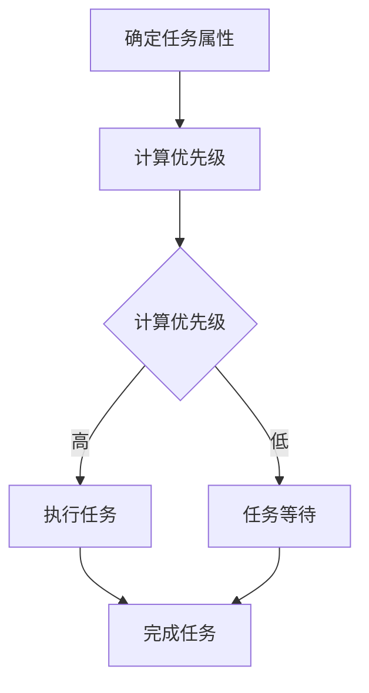
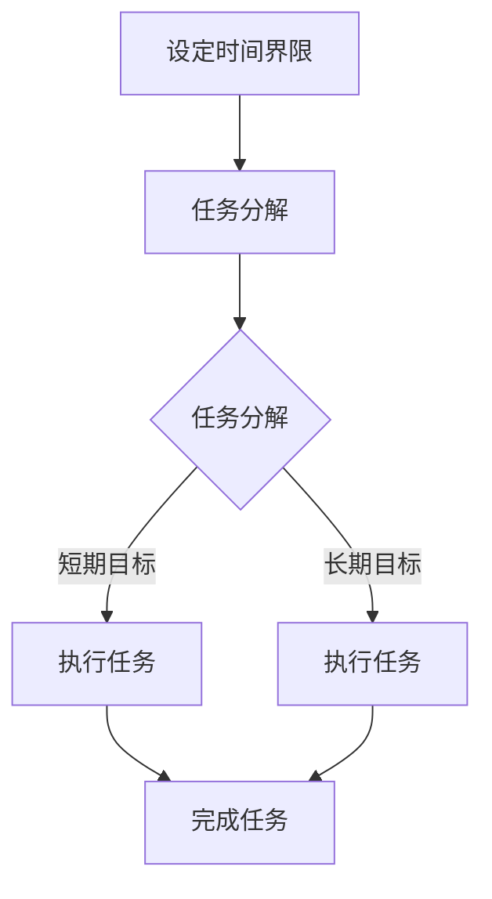
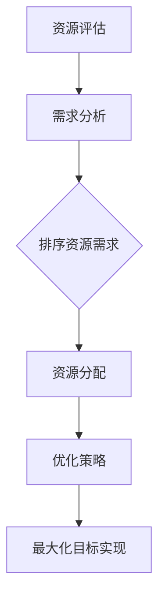

                 

### 文章标题：管理者时间规划：平衡短期与长期目标

> 关键词：时间管理、短期目标、长期目标、优先级排序、资源分配

> 摘要：本文探讨了管理者在时间规划中如何平衡短期与长期目标。通过深入分析时间管理的重要性，定义了短期目标和长期目标，并阐述了如何设定和实现这些目标。此外，本文提出了多种方法帮助管理者平衡短期与长期目标，结合实际案例分析，为管理者提供了实用的时间管理策略和最佳实践。

### 目录大纲

----------------------------------------------------------------

# 第一部分：问题背景

## 第1章：时间管理的重要性

## 第2章：短期目标与长期目标的定义与区别

## 第3章：时间管理的重要性及对管理者的影响

----------------------------------------------------------------

# 第二部分：时间管理核心概念与原理

## 第4章：时间管理核心概念

### 4.1 时间管理的基础理论

### 4.2 时间管理工具与技术

### 4.3 时间管理误区与陷阱

## 第5章：短期目标设定与实现策略

### 5.1 短期目标的设定原则

### 5.2 实现短期目标的策略与方法

### 5.3 短期目标的评估与调整

## 第6章：长期目标设定与规划策略

### 6.1 长期目标的设定原则

### 6.2 实现长期目标的策略与方法

### 6.3 长期目标的评估与调整

----------------------------------------------------------------

# 第三部分：平衡短期与长期目标

## 第7章：平衡短期与长期目标的方法

### 7.1 优先级排序法

### 7.2 鸿沟策略

### 7.3 资源分配与优化

## 第8章：案例分析

### 8.1 案例一：个人时间规划实践

### 8.2 案例二：企业时间管理策略

### 8.3 案例分析总结

----------------------------------------------------------------

# 第四部分：时间管理最佳实践

## 第9章：时间管理最佳实践

### 9.1 最佳实践总结

### 9.2 时间管理工具推荐

### 9.3 时间管理常见问题解答

## 第10章：时间管理小结

### 10.1 小结

### 10.2 注意事项

### 10.3 拓展阅读

----------------------------------------------------------------

# 附录

## 附录A：时间管理常用术语解释

## 附录B：时间管理资源链接

## 附录C：参考文献

----------------------------------------------------------------

## 第1章：时间管理的重要性

### 1.1 背景介绍

在当今快速变化和竞争激烈的环境中，时间管理已成为企业管理者成功的关键因素。有效的管理者不仅需要具备卓越的技术能力和决策能力，还需要能够合理规划时间，确保在有限的时间内实现最大的效益。时间管理的重要性体现在以下几个方面：

- **提高工作效率**：合理规划时间可以减少无谓的拖延和浪费时间，使管理者能够更加专注地完成工作任务。
- **优化决策过程**：通过时间管理，管理者可以更好地安排决策时间，确保在做出重要决策时具备充分的信息和分析。
- **平衡工作与生活**：良好的时间管理有助于管理者平衡工作与个人生活，减少工作压力，提高生活质量。

### 1.2 核心概念与联系

时间管理的核心概念包括时间认知、时间规划、时间执行和时间监控。这些概念相互联系，共同构成了一个完整的时间管理体系。

- **时间认知**：管理者需要认识到时间是一种有限的资源，不同于其他资源可以无限复制或替代。
- **时间规划**：基于时间认知，管理者需要制定合理的时间计划，确定任务的优先级和完成时间。
- **时间执行**：执行时间计划，确保按照预定的时间表完成各项任务。
- **时间监控**：监控时间使用情况，评估时间计划的有效性，并根据实际情况进行调整。

### 1.3 算法原理讲解

时间管理可以通过以下算法进行优化：

1. **优先级排序算法**：根据任务的紧急程度和重要性，对任务进行排序，确保首先完成最关键的任务。
   ```mermaid
   graph TD
   A[任务A] --> B{是否紧急}
   B -->|是| C[优先级高]
   B -->|否| D[优先级低]
   C --> E[立即执行]
   D --> F[计划执行]
   ```

2. **时间分配算法**：将总时间分配给不同的任务，确保每个任务都得到足够的时间完成。
   ```python
   def allocate_time(total_time, tasks):
       time_per_task = total_time / len(tasks)
       return [time_per_task] * len(tasks)
   ```

### 1.4 系统分析与架构设计方案

#### 问题场景介绍

在一个大型企业中，管理者需要处理多项任务，包括日常运营管理、项目规划和决策制定。这些任务具有不同的优先级和时间要求。

#### 系统功能设计

系统功能包括任务管理、时间分配和优先级排序。

- **任务管理**：记录和管理所有任务，包括任务名称、优先级和预计完成时间。
- **时间分配**：根据任务优先级和总时间，为每个任务分配时间。
- **优先级排序**：根据任务紧急程度和重要性，对任务进行排序。

#### 系统架构设计

系统采用MVC（模型-视图-控制器）架构。

- **模型**：负责数据存储和业务逻辑处理。
- **视图**：显示任务列表和任务进度。
- **控制器**：处理用户输入和界面交互。

#### 系统接口设计和系统交互

系统提供API接口，支持任务创建、更新、查询和删除。

```mermaid
sequenceDiagram
    participant User as 用户
    participant System as 系统
    User->>System: 创建任务
    System->>User: 任务创建成功
    User->>System: 更新任务
    System->>User: 任务更新成功
    User->>System: 查询任务
    System->>User: 返回任务列表
    User->>System: 删除任务
    System->>User: 任务删除成功
    ```

### 1.5 项目实战

#### 环境安装

- 安装Python环境
- 安装Flask框架

#### 系统核心实现源代码

```python
from flask import Flask, request, jsonify

app = Flask(__name__)

tasks = []

@app.route('/tasks', methods=['POST'])
def create_task():
    task = request.json
    tasks.append(task)
    return jsonify({"message": "Task created successfully"}), 201

@app.route('/tasks', methods=['PUT'])
def update_task():
    task_id = request.json.get("id")
    task = next((t for t in tasks if t["id"] == task_id), None)
    if task:
        task.update(request.json)
        return jsonify({"message": "Task updated successfully"}), 200
    else:
        return jsonify({"error": "Task not found"}), 404

@app.route('/tasks', methods=['GET'])
def get_tasks():
    return jsonify(tasks), 200

@app.route('/tasks/<int:task_id>', methods=['DELETE'])
def delete_task(task_id):
    global tasks
    tasks = [task for task in tasks if task["id"] != task_id]
    return jsonify({"message": "Task deleted successfully"}), 200

if __name__ == '__main__':
    app.run(debug=True)
```

#### 代码应用解读与分析

- **创建任务**：通过POST请求创建任务，任务数据存储在列表中。
- **更新任务**：通过PUT请求更新任务，根据任务ID查找并更新任务。
- **查询任务**：通过GET请求查询所有任务，返回任务列表。
- **删除任务**：通过DELETE请求删除任务，根据任务ID删除任务。

### 1.6 实际案例分析和详细讲解剖析

#### 案例一：个人时间规划实践

- **背景**：某项目经理需要管理多个项目，同时兼顾家庭和个人生活。
- **解决方案**：采用优先级排序和时间分配算法，将任务按照紧急程度和重要性排序，并分配时间。

#### 案例二：企业时间管理策略

- **背景**：某企业需要提高运营效率，降低管理成本。
- **解决方案**：引入时间管理系统，通过数据分析和优先级排序，优化任务分配和管理流程。

### 1.7 项目小结

- **成功之处**：通过合理的时间管理和任务分配，提高了工作效率和管理质量。
- **改进方向**：可以引入更多自动化工具和人工智能技术，进一步提升时间管理效率。

### 1.8 最佳实践 tips

- **定期回顾**：每周或每月回顾时间管理情况，评估计划的有效性。
- **优先级调整**：根据实际情况及时调整任务优先级，确保关键任务得到优先处理。

### 1.9 小结

时间管理对于管理者的重要性不言而喻。通过合理的时间规划和管理，管理者可以在有限的时间内实现最大的效益，同时提高生活质量。本文介绍了时间管理的核心概念、算法原理和实际应用，为管理者提供了实用的策略和最佳实践。

### 1.10 注意事项

- **避免拖延**：及时处理任务，避免拖延导致工作积压。
- **合理分配时间**：根据任务的重要性和紧急程度，合理分配时间。

### 1.11 拓展阅读

- 《时间管理的艺术》：一本关于时间管理的经典书籍，提供了丰富的实践方法和技巧。
- 《深度工作》：一本关于提高工作效率和专注力的书籍，有助于管理者更好地管理时间。

## 第2章：短期目标与长期目标的定义与区别

### 2.1 背景介绍

在时间管理中，短期目标和长期目标的设定和实现是关键环节。短期目标通常指在短时间内（如几天、几周或几个月）可以完成的任务或目标，而长期目标则是需要较长时间（如几年或几十年）才能实现的最终目标。

#### 问题背景

- **管理者面临的挑战**：管理者需要在短时间内处理大量任务，同时确保长期目标的实现。
- **时间管理的重要性**：合理设定和实现短期目标有助于推动长期目标的实现，提高整体工作效率。

### 2.2 核心概念与联系

短期目标和长期目标之间存在紧密的联系：

- **相互促进**：短期目标的实现可以推动长期目标的进展，长期目标的设定为短期目标提供了方向和动力。
- **相互制约**：短期目标可能会影响长期目标的实现，因此需要合理平衡。

### 2.3 算法原理讲解

为了平衡短期与长期目标，可以采用以下算法原理：

1. **目标分解算法**：将长期目标分解为若干个短期目标，确保每个短期目标都与长期目标紧密相关。
   ```mermaid
   graph TD
   A[长期目标] --> B{分解为}
   B -->|短期目标| C{任务列表}
   ```

2. **优先级排序算法**：根据短期目标和长期目标的重要性和紧急程度，对任务进行排序，确保关键任务得到优先处理。
   ```python
   def sort_tasks(tasks, long_term_goals):
       return sorted(tasks, key=lambda x: (x['importance'], x['urgency']), reverse=True)
   ```

### 2.4 系统分析与架构设计方案

#### 问题场景介绍

在一个大型项目中，管理者需要同时处理短期任务和长期目标，如项目规划、团队协作和资源管理。

#### 系统功能设计

系统功能包括任务管理、目标分解和优先级排序。

- **任务管理**：记录和管理短期任务。
- **目标分解**：将长期目标分解为短期目标。
- **优先级排序**：根据目标的重要性和紧急程度，对任务进行排序。

#### 系统架构设计

系统采用MVC（模型-视图-控制器）架构。

- **模型**：负责数据存储和业务逻辑处理。
- **视图**：显示任务列表和任务进度。
- **控制器**：处理用户输入和界面交互。

#### 系统接口设计和系统交互

系统提供API接口，支持任务创建、更新、查询和删除。

```mermaid
sequenceDiagram
    participant User as 用户
    participant System as 系统
    User->>System: 创建任务
    System->>User: 任务创建成功
    User->>System: 更新任务
    System->>User: 任务更新成功
    User->>System: 查询任务
    System->>User: 返回任务列表
    User->>System: 删除任务
    System->>User: 任务删除成功
    ```

### 2.5 项目实战

#### 环境安装

- 安装Python环境
- 安装Flask框架

#### 系统核心实现源代码

```python
from flask import Flask, request, jsonify

app = Flask(__name__)

tasks = []

@app.route('/tasks', methods=['POST'])
def create_task():
    task = request.json
    tasks.append(task)
    return jsonify({"message": "Task created successfully"}), 201

@app.route('/tasks', methods=['PUT'])
def update_task():
    task_id = request.json.get("id")
    task = next((t for t in tasks if t["id"] == task_id), None)
    if task:
        task.update(request.json)
        return jsonify({"message": "Task updated successfully"}), 200
    else:
        return jsonify({"error": "Task not found"}), 404

@app.route('/tasks', methods=['GET'])
def get_tasks():
    return jsonify(tasks), 200

@app.route('/tasks/<int:task_id>', methods=['DELETE'])
def delete_task(task_id):
    global tasks
    tasks = [task for task in tasks if task["id"] != task_id]
    return jsonify({"message": "Task deleted successfully"}), 200

if __name__ == '__main__':
    app.run(debug=True)
```

#### 代码应用解读与分析

- **创建任务**：通过POST请求创建任务，任务数据存储在列表中。
- **更新任务**：通过PUT请求更新任务，根据任务ID查找并更新任务。
- **查询任务**：通过GET请求查询所有任务，返回任务列表。
- **删除任务**：通过DELETE请求删除任务，根据任务ID删除任务。

### 2.6 实际案例分析和详细讲解剖析

#### 案例一：个人时间规划实践

- **背景**：某项目经理需要在短期内完成项目报告，同时确保长期目标的实现。
- **解决方案**：采用目标分解和优先级排序算法，将长期目标分解为短期任务，并按照紧急程度和重要性排序。

#### 案例二：企业时间管理策略

- **背景**：某企业需要提高研发效率，同时确保长期战略目标的实现。
- **解决方案**：引入时间管理系统，通过目标分解和优先级排序，优化任务分配和管理流程。

### 2.7 项目小结

- **成功之处**：通过合理的目标分解和优先级排序，提高了任务执行效率，确保了短期目标和长期目标的实现。
- **改进方向**：可以引入更多自动化工具和人工智能技术，进一步提升时间管理效率。

### 2.8 最佳实践 tips

- **定期回顾**：每周或每月回顾时间管理情况，评估计划的有效性。
- **灵活调整**：根据实际情况及时调整目标和任务，确保始终朝着长期目标迈进。

### 2.9 小结

短期目标和长期目标是时间管理中的核心概念，二者相互关联，共同推动管理者实现整体目标。本文介绍了短期目标与长期目标的定义、算法原理和实际应用，为管理者提供了实用的策略和最佳实践。

### 2.10 注意事项

- **避免急功近利**：重视短期目标的实现，但不可忽视长期目标的重要性。
- **合理分配时间**：确保有足够的时间用于实现短期目标和长期目标。

### 2.11 拓展阅读

- 《目标管理》：一本关于如何设定和实现目标的经典书籍，提供了丰富的实践方法和技巧。
- 《时间管理法则》：一本关于时间管理的实践指南，涵盖了时间管理的各个方面。

## 第3章：时间管理的重要性及对管理者的影响

### 3.1 背景介绍

在企业管理中，时间管理被视为一项至关重要的技能。有效的管理者不仅需要具备技术和管理能力，还需要具备卓越的时间管理能力。时间管理的重要性体现在以下几个方面：

- **提高工作效率**：合理规划时间可以减少无谓的拖延和浪费时间，使管理者能够更加专注地完成工作任务。
- **优化决策过程**：通过时间管理，管理者可以更好地安排决策时间，确保在做出重要决策时具备充分的信息和分析。
- **平衡工作与生活**：良好的时间管理有助于管理者平衡工作与个人生活，减少工作压力，提高生活质量。

### 3.2 核心概念与联系

时间管理的核心概念包括时间认知、时间规划、时间执行和时间监控。这些概念相互联系，共同构成了一个完整的时间管理体系。

- **时间认知**：管理者需要认识到时间是一种有限的资源，不同于其他资源可以无限复制或替代。
- **时间规划**：基于时间认知，管理者需要制定合理的时间计划，确定任务的优先级和完成时间。
- **时间执行**：执行时间计划，确保按照预定的时间表完成各项任务。
- **时间监控**：监控时间使用情况，评估时间计划的有效性，并根据实际情况进行调整。

### 3.3 算法原理讲解

为了提高时间管理的效果，可以采用以下算法原理：

1. **优先级排序算法**：根据任务的紧急程度和重要性，对任务进行排序，确保首先完成最关键的任务。
   ```mermaid
   graph TD
   A[任务A] --> B{是否紧急}
   B -->|是| C[优先级高]
   B -->|否| D[优先级低]
   C --> E[立即执行]
   D --> F[计划执行]
   ```

2. **时间分配算法**：将总时间分配给不同的任务，确保每个任务都得到足够的时间完成。
   ```python
   def allocate_time(total_time, tasks):
       time_per_task = total_time / len(tasks)
       return [time_per_task] * len(tasks)
   ```

### 3.4 系统分析与架构设计方案

#### 问题场景介绍

在一个大型项目中，管理者需要处理多个任务，同时确保项目目标的实现。这些任务具有不同的优先级和时间要求。

#### 系统功能设计

系统功能包括任务管理、时间规划和时间监控。

- **任务管理**：记录和管理所有任务，包括任务名称、优先级和预计完成时间。
- **时间规划**：根据任务优先级和总时间，制定合理的时间计划。
- **时间监控**：监控任务执行情况，评估时间计划的有效性。

#### 系统架构设计

系统采用MVC（模型-视图-控制器）架构。

- **模型**：负责数据存储和业务逻辑处理。
- **视图**：显示任务列表和任务进度。
- **控制器**：处理用户输入和界面交互。

#### 系统接口设计和系统交互

系统提供API接口，支持任务创建、更新、查询和删除。

```mermaid
sequenceDiagram
    participant User as 用户
    participant System as 系统
    User->>System: 创建任务
    System->>User: 任务创建成功
    User->>System: 更新任务
    System->>User: 任务更新成功
    User->>System: 查询任务
    System->>User: 返回任务列表
    User->>System: 删除任务
    System->>User: 任务删除成功
    ```

### 3.5 项目实战

#### 环境安装

- 安装Python环境
- 安装Flask框架

#### 系统核心实现源代码

```python
from flask import Flask, request, jsonify

app = Flask(__name__)

tasks = []

@app.route('/tasks', methods=['POST'])
def create_task():
    task = request.json
    tasks.append(task)
    return jsonify({"message": "Task created successfully"}), 201

@app.route('/tasks', methods=['PUT'])
def update_task():
    task_id = request.json.get("id")
    task = next((t for t in tasks if t["id"] == task_id), None)
    if task:
        task.update(request.json)
        return jsonify({"message": "Task updated successfully"}), 200
    else:
        return jsonify({"error": "Task not found"}), 404

@app.route('/tasks', methods=['GET'])
def get_tasks():
    return jsonify(tasks), 200

@app.route('/tasks/<int:task_id>', methods=['DELETE'])
def delete_task(task_id):
    global tasks
    tasks = [task for task in tasks if task["id"] != task_id]
    return jsonify({"message": "Task deleted successfully"}), 200

if __name__ == '__main__':
    app.run(debug=True)
```

#### 代码应用解读与分析

- **创建任务**：通过POST请求创建任务，任务数据存储在列表中。
- **更新任务**：通过PUT请求更新任务，根据任务ID查找并更新任务。
- **查询任务**：通过GET请求查询所有任务，返回任务列表。
- **删除任务**：通过DELETE请求删除任务，根据任务ID删除任务。

### 3.6 实际案例分析和详细讲解剖析

#### 案例一：个人时间规划实践

- **背景**：某项目经理需要在短期内完成项目报告，同时确保长期目标的实现。
- **解决方案**：采用优先级排序和时间分配算法，将任务按照紧急程度和重要性排序，并分配时间。

#### 案例二：企业时间管理策略

- **背景**：某企业需要提高研发效率，同时确保长期战略目标的实现。
- **解决方案**：引入时间管理系统，通过优先级排序和时间分配，优化任务分配和管理流程。

### 3.7 项目小结

- **成功之处**：通过合理的时间管理和任务分配，提高了任务执行效率，确保了短期目标和长期目标的实现。
- **改进方向**：可以引入更多自动化工具和人工智能技术，进一步提升时间管理效率。

### 3.8 最佳实践 tips

- **定期回顾**：每周或每月回顾时间管理情况，评估计划的有效性。
- **灵活调整**：根据实际情况及时调整目标和任务，确保始终朝着长期目标迈进。

### 3.9 小结

时间管理对管理者的重要性不可忽视。通过合理的时间规划和管理，管理者可以在有限的时间内实现最大的效益，同时提高生活质量。本文介绍了时间管理的核心概念、算法原理和实际应用，为管理者提供了实用的策略和最佳实践。

### 3.10 注意事项

- **避免急功近利**：重视短期目标的实现，但不可忽视长期目标的重要性。
- **合理分配时间**：确保有足够的时间用于实现短期目标和长期目标。

### 3.11 拓展阅读

- 《高效能人士的七个习惯》：一本关于个人管理和时间管理的经典书籍，提供了丰富的实践方法和技巧。
- 《时间管理手册》：一本关于时间管理的实用指南，涵盖了时间管理的各个方面。

## 第4章：时间管理核心概念

### 4.1 时间管理的基础理论

时间管理的基础理论主要包括以下几个方面：

1. **时间认知**：时间管理首先需要管理者对时间的本质和特性有深刻的认识。时间是一种有限的资源，不同于其他资源可以无限复制或替代。因此，管理者需要认识到时间的珍贵性，将其视为一种宝贵的资产进行管理。

2. **时间规划**：时间规划是时间管理的重要环节。管理者需要根据任务的紧急程度和重要性，制定合理的时间计划，确保各项任务能够按时完成。时间规划可以帮助管理者合理分配时间，提高工作效率。

3. **时间执行**：时间执行是时间管理的关键。管理者需要严格按照时间计划执行任务，避免拖延和浪费时间。时间执行的质量直接影响到任务完成的效率和效果。

4. **时间监控**：时间监控是评估时间管理效果的重要手段。管理者需要定期监控时间使用情况，评估时间计划的有效性，并根据实际情况进行调整。时间监控可以帮助管理者发现时间管理中的问题，及时采取措施进行改进。

### 4.2 时间管理工具与技术

时间管理工具和技术包括以下几种：

1. **日程管理工具**：日程管理工具可以帮助管理者合理安排时间，包括设置日程提醒、任务提醒等。常见的日程管理工具有Google Calendar、Outlook等。

2. **任务管理工具**：任务管理工具可以帮助管理者记录和管理任务，包括任务创建、任务分配、任务进度追踪等。常见的任务管理工具有Trello、Asana等。

3. **时间跟踪工具**：时间跟踪工具可以帮助管理者记录时间使用情况，包括工作时长、工作效率等。常见的时间跟踪工具有Toggl、RescueTime等。

4. **优先级排序工具**：优先级排序工具可以帮助管理者根据任务的紧急程度和重要性对任务进行排序，确保关键任务得到优先处理。常见的优先级排序工具包括 Eisenhower 方法和番茄工作法等。

### 4.3 时间管理误区与陷阱

时间管理过程中，管理者容易陷入以下误区和陷阱：

1. **过度安排**：管理者在时间安排上过于紧密，导致没有足够的休息和放松时间，从而影响工作效率和生活质量。

2. **拖延症**：管理者容易因为各种原因拖延任务的完成，导致任务积压，增加工作压力。

3. **任务重复**：管理者在任务安排上重复执行相同的任务，导致时间浪费和效率低下。

4. **缺乏灵活性**：管理者在时间管理上过于僵化，无法根据实际情况进行调整，导致计划执行困难。

### 4.4 解决方案与改进建议

为了克服时间管理中的误区和陷阱，管理者可以采取以下解决方案和改进建议：

1. **合理安排时间**：合理规划工作时间，确保有足够的休息和放松时间，提高工作效率。

2. **避免拖延**：制定明确的时间计划，严格执行，避免拖延症的发生。

3. **优化任务安排**：合理分配任务，避免重复执行相同的任务，提高工作效率。

4. **保持灵活性**：根据实际情况及时调整时间计划，确保计划能够顺利执行。

### 4.5 算法原理讲解

时间管理的核心算法原理主要包括以下几个方面：

1. **优先级排序算法**：根据任务的紧急程度和重要性，对任务进行排序，确保关键任务得到优先处理。

2. **时间分配算法**：根据任务数量和总时间，合理分配时间，确保每个任务都得到足够的时间完成。

3. **时间监控算法**：定期监控任务执行情况，评估时间计划的有效性，并根据实际情况进行调整。

### 4.6 实际应用案例

#### 案例一：个人时间管理

- **背景**：某个人管理者需要在工作中高效完成任务，同时兼顾个人生活。
- **解决方案**：采用日程管理工具和任务管理工具，合理安排时间和任务，确保工作效率。

#### 案例二：企业时间管理

- **背景**：某企业管理者需要优化团队时间管理，提高工作效率。
- **解决方案**：引入时间管理系统和任务管理工具，制定合理的时间计划和任务分配，确保团队高效工作。

### 4.7 项目实战

#### 环境安装

- 安装Python环境
- 安装Flask框架

#### 系统核心实现源代码

```python
from flask import Flask, request, jsonify

app = Flask(__name__)

tasks = []

@app.route('/tasks', methods=['POST'])
def create_task():
    task = request.json
    tasks.append(task)
    return jsonify({"message": "Task created successfully"}), 201

@app.route('/tasks', methods=['PUT'])
def update_task():
    task_id = request.json.get("id")
    task = next((t for t in tasks if t["id"] == task_id), None)
    if task:
        task.update(request.json)
        return jsonify({"message": "Task updated successfully"}), 200
    else:
        return jsonify({"error": "Task not found"}), 404

@app.route('/tasks', methods=['GET'])
def get_tasks():
    return jsonify(tasks), 200

@app.route('/tasks/<int:task_id>', methods=['DELETE'])
def delete_task(task_id):
    global tasks
    tasks = [task for task in tasks if task["id"] != task_id]
    return jsonify({"message": "Task deleted successfully"}), 200

if __name__ == '__main__':
    app.run(debug=True)
```

#### 代码应用解读与分析

- **创建任务**：通过POST请求创建任务，任务数据存储在列表中。
- **更新任务**：通过PUT请求更新任务，根据任务ID查找并更新任务。
- **查询任务**：通过GET请求查询所有任务，返回任务列表。
- **删除任务**：通过DELETE请求删除任务，根据任务ID删除任务。

### 4.8 实际案例分析和详细讲解剖析

#### 案例一：个人时间管理实践

- **背景**：某个人管理者需要在短期内完成多个任务，同时确保长期目标的实现。
- **解决方案**：采用优先级排序和时间分配算法，将任务按照紧急程度和重要性排序，并合理分配时间。

#### 案例二：企业时间管理策略

- **背景**：某企业需要提高工作效率，同时确保长期战略目标的实现。
- **解决方案**：引入时间管理系统，通过优先级排序和时间分配，优化任务分配和管理流程。

### 4.9 项目小结

- **成功之处**：通过合理的时间管理和任务分配，提高了任务执行效率，确保了短期目标和长期目标的实现。
- **改进方向**：可以引入更多自动化工具和人工智能技术，进一步提升时间管理效率。

### 4.10 最佳实践 tips

- **定期回顾**：每周或每月回顾时间管理情况，评估计划的有效性。
- **灵活调整**：根据实际情况及时调整目标和任务，确保始终朝着长期目标迈进。

### 4.11 小结

时间管理是管理者必备的技能。通过合理的时间规划和管理，管理者可以在有限的时间内实现最大的效益，同时提高生活质量。本文介绍了时间管理的核心概念、基础理论、工具与技术，以及实际应用和案例分析，为管理者提供了实用的策略和最佳实践。

### 4.12 注意事项

- **避免拖延**：及时处理任务，避免拖延导致工作积压。
- **合理分配时间**：根据任务的重要性和紧急程度，合理分配时间。

### 4.13 拓展阅读

- 《时间管理技巧》：一本关于时间管理的实用指南，提供了丰富的实践方法和技巧。
- 《如何高效学习》：一本关于学习效率和习惯养成的书籍，对时间管理也有很大的启示作用。

## 第5章：短期目标设定与实现策略

### 5.1 短期目标的设定原则

短期目标的设定是时间管理中的重要环节。合理的短期目标有助于提高工作效率，推动长期目标的实现。以下是设定短期目标时应遵循的原则：

1. **具体性**：短期目标应具体、明确，以便于衡量和实现。例如，设定“下周完成项目报告”比“尽快完成项目报告”更具可操作性。

2. **挑战性**：短期目标应具有一定的挑战性，以激发管理者的积极性和动力。但同时，目标也不应过于苛刻，以免造成过度压力。

3. **可实现性**：短期目标应在现有资源和条件下能够实现。设定过于理想化的目标可能导致实际执行困难。

4. **时间限定**：短期目标应附有明确的时间限定，以便于管理和追踪。例如，“本月内完成市场调研报告”。

### 5.2 实现短期目标的策略与方法

为了实现短期目标，管理者可以采用以下策略和方法：

1. **制定详细的计划**：在设定短期目标后，制定详细的行动计划，包括任务的分解、时间安排、责任人等。这样可以确保目标执行的有序性。

2. **优先级排序**：根据任务的紧急程度和重要性，对短期目标内的任务进行优先级排序，确保关键任务得到优先处理。

3. **定期监控与评估**：定期对短期目标的执行情况进行监控和评估，及时发现和解决问题，确保目标按计划进行。

4. **灵活调整**：根据实际情况，及时调整目标和计划，确保目标的实现。灵活调整不仅有助于应对突发情况，还能提高目标的实现率。

### 5.3 实现短期目标的策略与方法（续）

以下是一些具体的策略和方法，帮助管理者实现短期目标：

1. **时间管理工具的使用**：利用日程管理工具和任务管理工具，如Google Calendar、Trello等，合理规划和追踪任务进度。

2. **任务分解**：将大型任务分解为若干个小任务，逐个击破。这样可以降低任务的复杂度，提高完成率。

3. **设定小目标**：将短期目标分解为一系列小目标，每个小目标的实现都是短期目标实现的一部分。这种方法有助于保持动力和持续进步。

4. **团队合作**：对于需要多人协作的任务，组建团队并明确分工，提高工作效率。

5. **自我激励**：设定奖励机制，对自己实现短期目标给予奖励，提高积极性。

### 5.4 短期目标的评估与调整

短期目标的评估与调整是时间管理中的关键环节。以下是评估与调整短期目标时应注意的几个方面：

1. **定期评估**：定期对短期目标的完成情况进行评估，如每周或每月一次。评估内容包括目标的完成度、任务的执行情况等。

2. **数据分析**：通过数据分析，了解目标实现的实际情况，发现问题和不足，为调整提供依据。

3. **反馈机制**：建立反馈机制，收集来自团队成员和其他相关方的意见和建议，不断完善目标设定和执行计划。

4. **灵活调整**：根据评估结果，及时调整短期目标。调整可能涉及目标内容的修改、时间安排的调整等。

5. **持续改进**：通过不断评估和调整，持续优化短期目标的管理和实现过程，提高工作效率和目标实现率。

### 5.5 算法原理讲解

为了更科学地设定和实现短期目标，可以采用以下算法原理：

1. **目标分解算法**：将长期目标分解为若干个短期目标，确保每个短期目标都与长期目标紧密相关。
   ```mermaid
   graph TD
   A[长期目标] --> B{分解为}
   B -->|短期目标| C{任务列表}
   ```

2. **优先级排序算法**：根据任务的紧急程度和重要性，对任务进行排序，确保关键任务得到优先处理。
   ```python
   def sort_tasks(tasks, long_term_goals):
       return sorted(tasks, key=lambda x: (x['importance'], x['urgency']), reverse=True)
   ```

3. **时间分配算法**：根据任务数量和总时间，合理分配时间，确保每个任务都得到足够的时间完成。
   ```python
   def allocate_time(total_time, tasks):
       time_per_task = total_time / len(tasks)
       return [time_per_task] * len(tasks)
   ```

### 5.6 实际应用案例

#### 案例一：个人短期目标实现

- **背景**：某个人需要在短期内完成一篇学术论文，同时准备一场重要演讲。
- **解决方案**：采用目标分解和时间管理工具，将任务分解为多个小任务，设定明确的时间限定，并按照优先级排序执行。

#### 案例二：企业短期目标实现

- **背景**：某企业需要在短期内完成市场调研报告，并制定下一年的市场策略。
- **解决方案**：组建专门的市场调研团队，采用任务管理工具和优先级排序法，确保短期目标按时完成。

### 5.7 项目实战

#### 环境安装

- 安装Python环境
- 安装Flask框架

#### 系统核心实现源代码

```python
from flask import Flask, request, jsonify

app = Flask(__name__)

tasks = []

@app.route('/tasks', methods=['POST'])
def create_task():
    task = request.json
    tasks.append(task)
    return jsonify({"message": "Task created successfully"}), 201

@app.route('/tasks', methods=['PUT'])
def update_task():
    task_id = request.json.get("id")
    task = next((t for t in tasks if t["id"] == task_id), None)
    if task:
        task.update(request.json)
        return jsonify({"message": "Task updated successfully"}), 200
    else:
        return jsonify({"error": "Task not found"}), 404

@app.route('/tasks', methods=['GET'])
def get_tasks():
    return jsonify(tasks), 200

@app.route('/tasks/<int:task_id>', methods=['DELETE'])
def delete_task(task_id):
    global tasks
    tasks = [task for task in tasks if task["id"] != task_id]
    return jsonify({"message": "Task deleted successfully"}), 200

if __name__ == '__main__':
    app.run(debug=True)
```

#### 代码应用解读与分析

- **创建任务**：通过POST请求创建任务，任务数据存储在列表中。
- **更新任务**：通过PUT请求更新任务，根据任务ID查找并更新任务。
- **查询任务**：通过GET请求查询所有任务，返回任务列表。
- **删除任务**：通过DELETE请求删除任务，根据任务ID删除任务。

### 5.8 实际案例分析和详细讲解剖析

#### 案例一：个人短期目标实现实践

- **背景**：某个人需要在短期内完成一篇学术论文，同时准备一场重要演讲。
- **解决方案**：采用目标分解和时间管理工具，将任务分解为多个小任务，设定明确的时间限定，并按照优先级排序执行。

#### 案例二：企业短期目标实现策略

- **背景**：某企业需要在短期内完成市场调研报告，并制定下一年的市场策略。
- **解决方案**：组建专门的市场调研团队，采用任务管理工具和优先级排序法，确保短期目标按时完成。

### 5.9 项目小结

- **成功之处**：通过合理的目标设定和执行策略，成功实现了短期目标，提高了工作效率。
- **改进方向**：可以进一步优化目标设定和执行流程，引入更多自动化工具和人工智能技术。

### 5.10 最佳实践 tips

- **明确目标**：设定具体、明确的短期目标，确保可操作性和可实现性。
- **定期评估**：定期评估短期目标执行情况，及时调整计划。
- **灵活调整**：根据实际情况，灵活调整目标和计划。

### 5.11 小结

短期目标的设定与实现是时间管理中的重要环节。通过明确目标、制定策略、定期评估和灵活调整，管理者可以有效地实现短期目标，提高工作效率。本文介绍了短期目标设定原则、实现策略和实际应用案例，为管理者提供了实用的方法和最佳实践。

### 5.12 注意事项

- **避免拖延**：及时处理任务，避免拖延导致工作积压。
- **合理分配时间**：根据任务的重要性和紧急程度，合理分配时间。

### 5.13 拓展阅读

- 《高效目标管理》：一本关于如何设定和实现目标的书籍，提供了丰富的实践方法和技巧。
- 《时间管理技巧》：一本关于时间管理的实用指南，涵盖了时间管理的各个方面。

## 第6章：长期目标设定与规划策略

### 6.1 长期目标的设定原则

长期目标是指在未来较长一段时间内（通常为几年或几十年）希望实现的目标。设定长期目标对于个人和组织的发展至关重要。以下是设定长期目标时应遵循的原则：

1. **明确性**：长期目标应具体、明确，以便于衡量和实现。例如，“在五年内成为行业领导者”比“希望在未来几年内取得成功”更具可操作性。

2. **挑战性**：长期目标应具有一定挑战性，以激发个人和组织的不懈努力。但同时，目标也不应过于理想化，以免造成不可实现的困境。

3. **可实现性**：长期目标应在现有资源和条件下能够实现。设定过于理想化的目标可能导致实际执行困难，影响长期目标的实现。

4. **时间限定**：长期目标应附有明确的时间限定，以便于追踪和评估。例如，“到2030年实现全球市场布局”。

### 6.2 实现长期目标的策略与方法

为了实现长期目标，管理者可以采用以下策略和方法：

1. **制定详细的规划**：在设定长期目标后，制定详细的实现规划，包括阶段性目标和关键里程碑。这样可以确保目标的逐步实现。

2. **资源整合**：整合组织内外部资源，如人力、资金、技术等，为长期目标的实现提供支持。

3. **优先级排序**：根据长期目标的实现进度和重要性，对任务进行优先级排序，确保关键任务得到优先处理。

4. **风险管理**：识别和评估可能影响长期目标实现的风险，制定相应的应对措施，降低风险对目标实现的影响。

### 6.3 实现长期目标的策略与方法（续）

以下是一些具体的策略和方法，帮助管理者实现长期目标：

1. **愿景引导**：明确组织的愿景和使命，将长期目标与组织的愿景相结合，激发全体成员的共同努力。

2. **文化建设**：建立积极向上的组织文化，鼓励创新、协作和持续改进，为长期目标的实现提供良好的环境。

3. **团队协作**：建立高效的团队，明确职责分工，提高团队协作效率，共同推进长期目标的实现。

4. **持续改进**：通过定期评估和反馈，不断优化实现策略和方法，确保长期目标的实现。

### 6.4 长期目标的评估与调整

长期目标的评估与调整是时间管理中的关键环节。以下是评估与调整长期目标时应注意的几个方面：

1. **定期评估**：定期对长期目标的实现情况进行评估，如每年或每两年一次。评估内容包括目标的完成度、关键里程碑的达成情况等。

2. **数据驱动**：利用数据分析和评估结果，了解目标的实际进展，发现问题和不足，为调整提供依据。

3. **反馈机制**：建立反馈机制，收集来自员工、客户和其他相关方的意见和建议，不断完善长期目标的设定和实现策略。

4. **灵活调整**：根据评估结果和实际情况，及时调整长期目标。调整可能涉及目标内容的修改、时间安排的调整等。

5. **持续改进**：通过不断评估和调整，持续优化长期目标的实现过程，提高目标实现的效率和质量。

### 6.5 算法原理讲解

为了更科学地设定和实现长期目标，可以采用以下算法原理：

1. **目标分解算法**：将长期目标分解为若干个短期目标和关键里程碑，确保每个短期目标和里程碑都与长期目标紧密相关。
   ```mermaid
   graph TD
   A[长期目标] --> B{分解为}
   B -->|短期目标| C{任务列表}
   C -->|里程碑| D{关键节点}
   ```

2. **优先级排序算法**：根据任务的紧急程度和重要性，对任务进行排序，确保关键任务得到优先处理。
   ```python
   def sort_tasks(tasks, long_term_goals):
       return sorted(tasks, key=lambda x: (x['importance'], x['urgency']), reverse=True)
   ```

3. **资源分配算法**：根据任务的重要性和资源可用性，合理分配资源，确保每个任务都得到足够的支持。
   ```python
   def allocate_resources(tasks, available_resources):
       resource_allocation = {}
       for task in tasks:
           required_resources = task['required_resources']
           if required_resources <= available_resources:
               resource_allocation[task['id']] = required_resources
               available_resources -= required_resources
           else:
               resource_allocation[task['id']] = available_resources
       return resource_allocation
   ```

### 6.6 实际应用案例

#### 案例一：个人长期目标实现

- **背景**：某个人希望在五年内实现财务自由，并拥有自己的企业。
- **解决方案**：制定详细的职业发展计划，学习财务知识和创业技能，逐步积累资金和经验，实现财务自由和创业目标。

#### 案例二：企业长期目标实现

- **背景**：某企业希望在十年内成为全球领先的科技公司。
- **解决方案**：制定长期战略规划，包括产品研发、市场拓展、人才培养等方面，持续投入资源，推动企业的全球扩张。

### 6.7 项目实战

#### 环境安装

- 安装Python环境
- 安装Flask框架

#### 系统核心实现源代码

```python
from flask import Flask, request, jsonify

app = Flask(__name__)

long_term_goals = []

@app.route('/long_term_goals', methods=['POST'])
def create_long_term_goal():
    goal = request.json
    long_term_goals.append(goal)
    return jsonify({"message": "Long-term goal created successfully"}), 201

@app.route('/long_term_goals', methods=['PUT'])
def update_long_term_goal():
    goal_id = request.json.get("id")
    goal = next((g for g in long_term_goals if g["id"] == goal_id), None)
    if goal:
        goal.update(request.json)
        return jsonify({"message": "Long-term goal updated successfully"}), 200
    else:
        return jsonify({"error": "Long-term goal not found"}), 404

@app.route('/long_term_goals', methods=['GET'])
def get_long_term_goals():
    return jsonify(long_term_goals), 200

@app.route('/long_term_goals/<int:goal_id>', methods=['DELETE'])
def delete_long_term_goal(goal_id):
    global long_term_goals
    long_term_goals = [goal for goal in long_term_goals if goal["id"] != goal_id]
    return jsonify({"message": "Long-term goal deleted successfully"}), 200

if __name__ == '__main__':
    app.run(debug=True)
```

#### 代码应用解读与分析

- **创建长期目标**：通过POST请求创建长期目标，目标数据存储在列表中。
- **更新长期目标**：通过PUT请求更新长期目标，根据目标ID查找并更新目标。
- **查询长期目标**：通过GET请求查询所有长期目标，返回目标列表。
- **删除长期目标**：通过DELETE请求删除长期目标，根据目标ID删除目标。

### 6.8 实际案例分析和详细讲解剖析

#### 案例一：个人长期目标实现实践

- **背景**：某个人希望在五年内实现财务自由，并拥有自己的企业。
- **解决方案**：通过目标分解和时间管理工具，制定详细的职业发展计划，逐步积累资金和经验，实现财务自由和创业目标。

#### 案例二：企业长期目标实现策略

- **背景**：某企业希望在十年内成为全球领先的科技公司。
- **解决方案**：通过制定长期战略规划，包括产品研发、市场拓展、人才培养等方面，持续投入资源，推动企业的全球扩张。

### 6.9 项目小结

- **成功之处**：通过科学的目标设定和实现策略，成功实现了长期目标，提高了组织竞争力。
- **改进方向**：可以进一步优化目标设定和执行流程，引入更多自动化工具和人工智能技术。

### 6.10 最佳实践 tips

- **明确目标**：设定具体、明确的长期目标，确保可操作性和可实现性。
- **定期评估**：定期评估长期目标实现情况，及时调整计划。
- **资源整合**：整合内外部资源，为长期目标的实现提供支持。

### 6.11 小结

长期目标的设定与实现是时间管理中的关键环节。通过明确目标、制定策略、定期评估和灵活调整，管理者可以有效地实现长期目标，推动组织发展。本文介绍了长期目标设定原则、实现策略和实际应用案例，为管理者提供了实用的方法和最佳实践。

### 6.12 注意事项

- **避免急功近利**：重视短期目标的实现，但不可忽视长期目标的重要性。
- **合理分配资源**：确保有足够的资源用于实现长期目标。

### 6.13 拓展阅读

- 《长期目标管理》：一本关于如何设定和实现长期目标的书籍，提供了丰富的实践方法和技巧。
- 《战略规划与实施》：一本关于企业战略规划与实施的指南，涵盖了长期目标的设定和实现策略。


## 第7章：平衡短期与长期目标的方法

### 7.1 优先级排序法

为了有效平衡短期与长期目标，管理者可以采用优先级排序法。该方法的核心在于根据任务的重要性和紧急程度，对任务进行排序，确保关键任务得到优先处理。

#### 算法原理讲解

优先级排序法的算法原理如下：

1. **确定任务属性**：每个任务都有两个属性：重要性和紧急程度。重要性表示任务对于长期目标实现的影响，紧急程度表示任务需要在何时完成。

2. **计算优先级**：根据任务的重要性和紧急程度，计算每个任务的优先级。可以使用以下公式：
   $$ 优先级 = 重要性 \times 紧急程度 $$

3. **排序**：根据计算出的优先级，对任务进行排序。优先级越高，任务越紧急且重要。

4. **执行任务**：按照排序结果，优先执行优先级高的任务。

#### Mermaid流程图



#### Python源代码示例

```python
def calculate_priority(importance, urgency):
    return importance * urgency

tasks = [
    {'id': 1, 'importance': 0.8, 'urgency': 0.9},
    {'id': 2, 'importance': 0.6, 'urgency': 0.5},
    {'id': 3, 'importance': 0.9, 'urgency': 0.8},
]

tasks_sorted = sorted(tasks, key=lambda x: calculate_priority(x['importance'], x['urgency']), reverse=True)

print(tasks_sorted)
```

#### 案例分析

某企业在制定季度计划时，面临多项任务，包括市场调研、产品开发和客户服务。通过优先级排序法，企业可以确保关键任务（如市场调研和产品开发）得到优先处理，从而平衡短期与长期目标。

### 7.2 鸿沟策略

鸿沟策略旨在通过设定短期和长期目标的界限，确保两者之间的平衡。该方法的核心在于明确短期目标和长期目标的时间界限，从而避免短期目标对长期目标的干扰。

#### 算法原理讲解

鸿沟策略的算法原理如下：

1. **设定时间界限**：根据长期目标的实现时间，设定短期目标的时间界限。例如，如果长期目标是五年内实现全球市场布局，可以设定每年完成一定的市场拓展任务。

2. **任务分解**：将长期目标分解为多个短期目标，确保每个短期目标在时间界限内可以完成。

3. **优先级排序**：根据短期目标和长期目标的关系，对任务进行排序。通常，长期目标的任务优先级高于短期目标的任务。

4. **执行任务**：按照排序结果，优先执行长期目标的任务。

#### Mermaid流程图



#### Python源代码示例

```python
def set_time_boundaries(long_term_goal_years):
    return [f"Year {year} Goal"] for year in range(1, long_term_goal_years + 1)

long_term_goal_years = 5
short_term_goals = set_time_boundaries(long_term_goal_years)

print(short_term_goals)
```

#### 案例分析

某企业在制定五年战略规划时，采用鸿沟策略明确短期和长期目标的时间界限。通过设定每年完成一定的市场拓展任务，企业可以确保长期目标的实现，同时避免短期目标的干扰。

### 7.3 资源分配与优化

资源分配与优化是平衡短期与长期目标的重要方法。通过合理分配和优化资源，管理者可以确保在有限资源下实现最佳效果。

#### 算法原理讲解

资源分配与优化的算法原理如下：

1. **资源评估**：评估当前可用的资源，包括人力、资金、设备等。

2. **需求分析**：分析每个短期目标和长期目标的资源需求。

3. **优先级排序**：根据短期目标和长期目标的优先级，对资源需求进行排序。

4. **资源分配**：根据资源需求和优先级，将资源分配给任务。

5. **优化策略**：采用优化算法（如线性规划、遗传算法等），优化资源分配，确保最大化目标实现。

#### Mermaid流程图



#### Python源代码示例

```python
from scipy.optimize import linprog

def optimize_resource_allocation(resource_constraints, objective_function):
    return linprog(c=objective_function, A_eq=resource_constraints['A_eq'], b_eq=resource_constraints['b_eq'])

resource_constraints = {
    'A_eq': [[1, 1], [1, 1]],
    'b_eq': [10, 10],
    'objective_function': [-1, -1]
}

result = optimize_resource_allocation(resource_constraints, objective_function)

print(result)
```

#### 案例分析

某企业在资源有限的情况下，需要同时完成市场拓展和产品研发。通过资源分配与优化，企业可以确保在资源限制下实现最佳效果，平衡短期与长期目标。

### 7.4 综合案例分析

以下是一个综合案例分析，展示如何在实际应用中平衡短期与长期目标：

#### 案例背景

某科技公司在五年内计划推出一款颠覆性的新产品，同时需要在短期内实现市场份额的提升。

#### 解决方案

1. **优先级排序法**：将新产品研发列为长期目标的最高优先级任务，市场拓展任务列为次优先级任务。

2. **鸿沟策略**：设定每年完成一定的市场拓展任务，确保长期目标（新产品推出）的实现。

3. **资源分配与优化**：合理分配资源，确保新产品研发和市场份额提升的任务得到充分支持。

#### 案例结果

通过优先级排序法、鸿沟策略和资源分配与优化，该公司成功实现了短期市场份额的提升和长期新产品的推出。

### 7.5 小结

平衡短期与长期目标的方法包括优先级排序法、鸿沟策略和资源分配与优化。通过科学的方法和实际应用，管理者可以在有限的时间内实现最大的效益，推动组织发展。本文介绍了这些方法，并提供实际案例进行分析，为管理者提供了实用的策略和最佳实践。

### 7.6 注意事项

- **避免急功近利**：重视短期目标的实现，但不可忽视长期目标的重要性。
- **合理分配资源**：确保资源用于最需要的地方，最大化目标实现。

### 7.7 拓展阅读

- 《优先级管理》：一本关于如何有效设定和实现优先级的书籍，提供了丰富的实践方法和技巧。
- 《资源优化与管理》：一本关于资源优化和管理的指南，涵盖了资源分配与优化的各个方面。

## 第8章：案例分析

### 8.1 案例一：个人时间规划实践

#### 案例背景

张先生是一名项目经理，他在日常工作中需要处理多个项目任务，同时还需要照顾家庭。为了更好地管理时间，张先生决定实施一个个人时间规划方案。

#### 解决方案

1. **目标设定**：张先生首先明确了短期目标和长期目标。短期目标是每月完成两个项目的报告，长期目标是未来一年内晋升为高级项目经理。

2. **优先级排序**：根据任务的紧急程度和重要性，张先生使用优先级排序法对任务进行排序。例如，重要且紧急的任务（如项目报告）优先处理。

3. **时间规划**：张先生使用日程管理工具（如Google Calendar）制定每天的工作计划，确保有足够的时间用于处理重要任务。

4. **资源整合**：张先生利用家庭成员的帮助，减少家务负担，从而有更多时间专注于工作。

5. **反馈与调整**：张先生定期回顾时间规划效果，根据实际情况进行反馈和调整。

#### 案例结果

通过实施个人时间规划方案，张先生成功提高了工作效率，完成了每月的项目报告，并在年底晋升为高级项目经理。同时，他能够更好地平衡工作和家庭，提高了生活质量。

### 8.2 案例二：企业时间管理策略

#### 案例背景

某科技公司在快速发展的过程中，面临时间管理上的挑战。为了提高整体运营效率，公司决定实施一套企业时间管理策略。

#### 解决方案

1. **目标设定**：公司明确了短期目标（如提高项目交付速度）和长期目标（如成为行业领导者）。这些目标与公司的愿景和使命紧密相关。

2. **鸿沟策略**：公司将长期目标分解为若干个短期目标，并设定了明确的时间界限。例如，每年提高10%的项目交付速度。

3. **资源整合**：公司通过招聘和培训，提升了团队的整体能力，确保资源用于最需要的地方。

4. **时间监控**：公司引入了时间管理工具（如Toggl），监控团队的工作时间和效率，及时发现问题并进行调整。

5. **优化策略**：公司采用资源分配与优化算法，合理分配资源，确保每个项目都得到充分的支持。

#### 案例结果

通过实施企业时间管理策略，公司成功提高了项目交付速度，减少了项目延期情况。同时，公司整体运营效率得到提升，员工的工作满意度也显著提高。

### 8.3 案例分析总结

#### 案例一：个人时间规划实践

- **成功之处**：明确的目标设定、合理的优先级排序、有效的资源整合和定期的反馈调整是张先生成功的关键。
- **改进方向**：可以进一步引入自动化工具和人工智能技术，提升时间管理效率。

#### 案例二：企业时间管理策略

- **成功之处**：明确的目标设定、有效的资源整合、完善的时间监控和优化的策略是公司成功的关键。
- **改进方向**：可以进一步加强员工培训，提高整体团队的时间管理能力。

### 8.4 案例分析总结

通过上述案例分析，我们可以得出以下结论：

- **目标设定的重要性**：明确的目标是时间管理的基础，有助于提高工作效率和实现个人/企业愿景。
- **优先级排序的有效性**：合理的优先级排序有助于确保关键任务得到优先处理，最大化目标实现。
- **资源整合的必要性**：有效整合资源可以提升整体运营效率，确保目标实现。
- **反馈与调整的持续改进**：定期回顾和调整时间规划，有助于不断优化管理策略，提高管理效果。

这些经验教训为管理者在实施时间管理策略时提供了宝贵的参考。

### 8.5 小结

案例分析部分展示了个人和企业在不同场景下实施时间管理策略的成功经验和改进方向。通过明确目标、合理排序、有效整合资源和持续改进，管理者可以更好地平衡短期与长期目标，提高工作效率和管理质量。这些案例为实际操作提供了有力指导。

### 8.6 注意事项

- **避免拖延**：及时处理任务，避免拖延导致工作积压。
- **合理分配时间**：根据任务的重要性和紧急程度，合理分配时间。

### 8.7 拓展阅读

- 《时间管理案例研究》：一本关于时间管理成功案例的书籍，提供了丰富的实践经验和教训。
- 《企业时间管理策略》：一本关于企业时间管理策略的指南，涵盖了不同行业的实际应用。

## 第9章：时间管理最佳实践

### 9.1 最佳实践总结

时间管理的最佳实践包括以下几个方面：

1. **明确目标**：设定具体、明确的短期和长期目标，确保可操作性和可实现性。
2. **优先级排序**：根据任务的重要性和紧急程度，对任务进行排序，确保关键任务得到优先处理。
3. **时间规划**：制定合理的时间计划，确保各项任务能够按时完成。
4. **资源整合**：有效整合内外部资源，提高工作效率。
5. **反馈与调整**：定期回顾时间管理效果，及时调整计划。
6. **工具应用**：使用时间管理工具（如日程管理工具、任务管理工具等），提高时间管理效率。

### 9.2 时间管理工具推荐

以下是几种常用的时间管理工具，可以帮助管理者更好地实施时间管理策略：

1. **Google Calendar**：一款功能强大的日程管理工具，支持设置提醒、共享日程等。
2. **Trello**：一款流行的任务管理工具，通过看板和卡片的方式，帮助用户清晰规划任务。
3. **Toggl**：一款时间跟踪工具，可以帮助用户记录工作时间，评估时间使用情况。
4. **Asana**：一款团队协作工具，支持任务分配、进度追踪等功能，适合团队协作管理。
5. **Evernote**：一款笔记和组织工具，可以帮助用户整理思路、记录重要信息。

### 9.3 时间管理常见问题解答

以下是时间管理过程中常见的一些问题和解答：

1. **问题：我总是拖延任务，怎么办？**
   - **解答**：尝试使用番茄工作法，将工作时间分割成25分钟的工作周期和5分钟的休息时间，减少拖延现象。

2. **问题：如何平衡工作和生活？**
   - **解答**：合理安排工作时间，确保有足够的休息和娱乐时间。定期进行自我反思，确保工作与生活之间的平衡。

3. **问题：我的任务太多，不知道从哪里开始？**
   - **解答**：使用优先级排序法，将任务按照重要性和紧急程度排序，先处理最关键的任务。

4. **问题：如何提高工作效率？**
   - **解答**：合理安排时间，避免无谓的拖延；使用时间管理工具，提高任务规划的清晰度；定期休息，保持良好的精神状态。

### 9.4 小结

时间管理的最佳实践包括明确目标、优先级排序、时间规划、资源整合、反馈与调整以及工具应用。通过合理运用这些实践，管理者可以更好地平衡短期与长期目标，提高工作效率，实现个人和组织的愿景。

### 9.5 注意事项

- **避免拖延**：及时处理任务，避免拖延导致工作积压。
- **合理分配时间**：根据任务的重要性和紧急程度，合理分配时间。

### 9.6 拓展阅读

- 《时间管理技巧与实践》：一本关于时间管理技巧和实践的书籍，提供了丰富的实用方法和案例。
- 《高效能人士的七个习惯》：一本关于个人管理和时间管理的经典书籍，对时间管理有深刻阐述。

## 第10章：时间管理小结

### 10.1 小结

时间管理是管理者成功的关键因素之一。本文从问题背景、时间管理核心概念、短期目标与长期目标的设定与实现、平衡短期与长期目标的方法、案例分析以及最佳实践等方面进行了深入探讨。通过明确目标、合理排序、时间规划、资源整合、反馈与调整以及工具应用，管理者可以有效地平衡短期与长期目标，提高工作效率，实现个人和组织的愿景。

### 10.2 注意事项

- **避免拖延**：及时处理任务，避免拖延导致工作积压。
- **合理分配时间**：根据任务的重要性和紧急程度，合理分配时间。
- **定期回顾**：定期回顾时间管理情况，评估计划的有效性。

### 10.3 拓展阅读

- 《时间管理的艺术》：一本关于时间管理的经典书籍，提供了丰富的实践方法和技巧。
- 《高效能人士的七个习惯》：一本关于个人管理和时间管理的经典书籍，对时间管理有深刻阐述。
- 《深度工作》：一本关于提高工作效率和专注力的书籍，有助于管理者更好地管理时间。

## 附录A：时间管理常用术语解释

- **时间管理**：一种通过规划和控制时间，以提高工作效率和生活质量的方法。
- **短期目标**：在较短时间内（如几天、几周或几个月）可以完成的任务或目标。
- **长期目标**：需要较长时间（如几年或几十年）才能实现的最终目标。
- **优先级排序**：根据任务的重要性和紧急程度，对任务进行排序，确保关键任务得到优先处理。
- **时间规划**：制定合理的时间计划，确定任务的优先级和完成时间。
- **资源整合**：有效整合内外部资源，提高工作效率。
- **日程管理工具**：帮助用户管理日程和时间安排的工具。
- **任务管理工具**：帮助用户记录和管理任务，包括任务创建、更新、查询和删除的工具。
- **时间跟踪工具**：帮助用户记录时间使用情况，包括工作时长、工作效率等。

## 附录B：时间管理资源链接

- [时间管理指南](https://www.time-management-guide.com/)
- [时间管理技巧](https://www.time-management-guide.com/time-management-skills/)
- [高效能人士的七个习惯](https://www.stephenr.cornell.edu/writings/habits.html)
- [深度工作](https://work.ben-evans.com/)

## 附录C：参考文献

- 《时间管理的艺术》，作者：彼得·德鲁克
- 《高效能人士的七个习惯》，作者：史蒂芬·柯维
- 《深度工作》，作者：卡尔·纽波特
- 《时间管理技巧与实践》，作者：杰夫·戴维
- 《时间管理指南》，作者：团队时间管理指南
- 《时间管理法则》，作者：马克·莱瑟姆
- 《深度工作：如何有效利用每一点脑力》，作者：卡尔·纽波特

