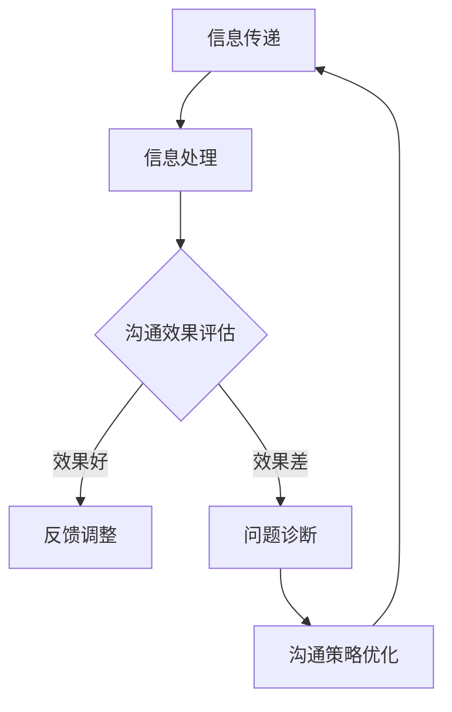
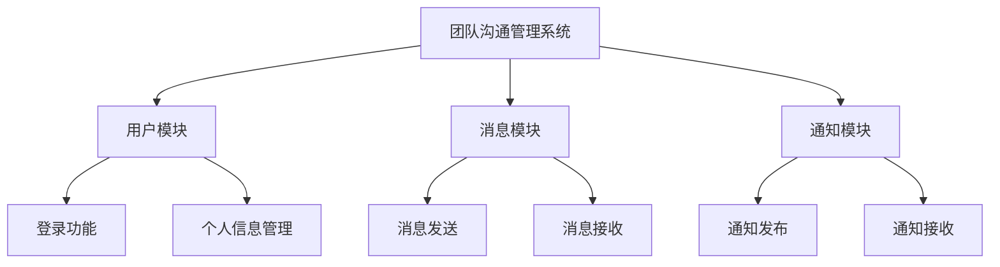
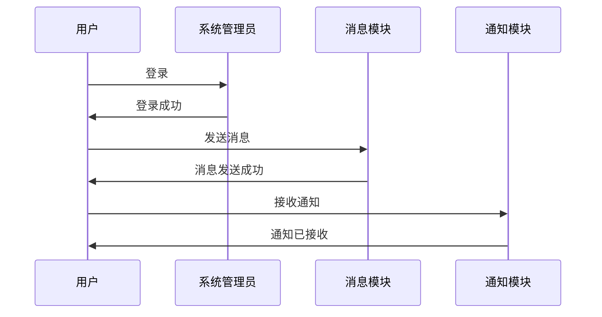

                 

# 管理者沟通艺术：提升团队沟通效率

关键词：团队沟通、沟通技巧、沟通障碍、管理者、团队协作

摘要：本文旨在探讨团队沟通在企业管理中的重要性，分析管理者在沟通中面临的挑战和问题，并提出一系列有效的沟通技巧和方法，以提升团队沟通效率，实现组织目标。

## 第一部分：背景介绍

### 第1章：问题背景

#### 1.1.1 问题背景

随着信息技术的不断发展，团队沟通在企业管理中的重要性日益凸显。有效的沟通不仅是团队协作的基础，也是实现组织目标的关键。然而，在实际工作中，沟通障碍常常导致信息传递不畅、团队协作效率低下，从而影响组织绩效。

#### 1.1.2 问题描述

管理者在沟通中面临的挑战主要包括：

1. 信息传递不畅：由于部门职责分工不明确、信息传递渠道不畅等原因，导致信息在传递过程中失真或丢失。
2. 沟通方式不当：管理者往往过于依赖口头或书面沟通，忽视了非语言沟通的重要性，导致沟通效果不佳。
3. 沟通风格不统一：管理者的沟通风格各异，可能导致团队成员之间的误解和冲突。

#### 1.1.3 问题解决

为了解决上述问题，管理者需要掌握以下沟通技巧：

1. 提高信息传递效率：通过建立清晰的组织架构、优化沟通渠道，确保信息准确、高效地传递。
2. 运用多种沟通方式：结合口头、书面、非语言等多种沟通方式，提高沟通效果。
3. 掌握沟通风格：了解不同团队成员的沟通风格，调整自己的沟通策略，以实现更好的沟通效果。

#### 1.1.4 边界与外延

本部分内容主要关注管理者在团队沟通中的技巧和方法，包括沟通的基本原则、沟通障碍及应对策略等。同时，也将探讨团队沟通在企业运营中的重要性。

#### 1.1.5 概念结构与核心要素组成

1. 沟通基本概念：
   - 沟通：信息在人与人之间或人与组织之间的传递与理解过程。
   - 管理者：在企业中负责指导、协调和监督团队成员的人员。
   - 团队：由具有共同目标、相互协作的成员组成的群体。

2. 沟通核心要素：
   - 信息：沟通的内容，包括事实、观点、意见等。
   - 沟通渠道：信息传递的途径，如口头、书面、非语言等。
   - 沟通障碍：影响沟通效果的因素，如信息失真、沟通渠道不畅等。
   - 沟通技巧：提高沟通效果的方法和策略，如倾听、反馈、表达清晰等。

## 第二部分：核心概念与联系

### 第2章：核心概念原理

#### 2.1.1 沟通原理

沟通是信息在人与人之间或人与组织之间的传递与理解过程。有效的沟通需要遵循以下原则：

1. 完整性：确保信息在传递过程中不失真、不丢失。
2. 准确性：确保信息传达的准确性，避免产生误解。
3. 及时性：确保信息在适当的时间内传递。
4. 客观性：确保信息传达的客观性，避免主观偏见。

#### 2.1.2 沟通障碍

沟通障碍是影响沟通效果的因素。常见的沟通障碍包括：

1. 信息失真：信息在传递过程中发生变形或丢失。
2. 沟通渠道不畅：信息传递途径不畅通，导致信息传递延迟或受阻。
3. 沟通风格差异：不同个体具有不同的沟通风格，可能导致沟通效果不佳。

#### 2.1.3 沟通技巧

提高沟通效果的方法和策略包括：

1. 倾听：主动倾听对方的意见和需求，以便更好地理解对方。
2. 反馈：及时给予对方反馈，确保双方对信息有共同的理解。
3. 表达清晰：用简洁、明确的语言表达自己的观点和需求。

#### 2.1.4 沟通属性特征对比表格

| 特征             | 说明                                                         |
|------------------|--------------------------------------------------------------|
| 信息传递的完整性 | 确保信息在传递过程中不失真、不丢失                             |
| 信息传递的准确性 | 确保信息传达的准确性，避免产生误解                             |
| 信息传递的及时性 | 确保信息在适当的时间内传递                                     |
| 信息传递的客观性 | 确保信息传达的客观性，避免主观偏见                             |
| 沟通渠道的畅通   | 确保信息传递途径不延迟、不受阻                                 |
| 沟通风格的多样性 | 适应不同个体的沟通风格，提高沟通效果                           |

#### 2.1.5 ER实体关系图架构

```mermaid
erDiagram
  沟通 |--------| 完整性
  沟通 |--------| 准确性
  沟通 |--------| 及时性
  沟通 |--------| 客观性
  沟通 |--------| 渠道
  沟通 |--------| 风格
  沟通 |--------| 障碍
```

## 第三部分：算法原理讲解

### 第3章：沟通算法原理

#### 3.1.1 算法概述

沟通算法是一种基于数学模型和信息论的优化算法，旨在提高团队沟通效率。其核心思想是通过分析沟通过程中的信息传递和反馈，优化沟通策略，降低沟通障碍。

#### 3.1.2 算法mermaid流程图



#### 3.1.3 算法原理

1. 信息传递：管理者将信息传递给团队成员，包括口头、书面、非语言等多种形式。
2. 信息处理：团队成员接收信息后，对其进行处理和理解。
3. 沟通效果评估：通过反馈和评估，判断沟通效果的好坏。
4. 反馈调整：根据评估结果，对沟通策略进行调整，以提高沟通效果。
5. 问题诊断：当沟通效果不佳时，进行问题诊断，找出原因。
6. 沟通策略优化：根据问题诊断结果，优化沟通策略，以降低沟通障碍。

#### 3.1.4 数学模型和公式

沟通效率可以表示为：

$$E = \frac{I}{T} \cdot F$$

其中：

- \(E\)：沟通效率
- \(I\)：信息传递量
- \(T\)：信息传递时间
- \(F\)：反馈调整系数

反馈调整系数表示根据沟通效果进行策略调整的能力。提高反馈调整系数，可以降低信息传递时间，从而提高沟通效率。

#### 3.1.5 通俗易懂地举例说明

假设有两个团队，A团队和B团队。A团队的沟通效率为 \(E_A = 0.8\)，B团队的沟通效率为 \(E_B = 0.6\)。在相同的信息传递量下，A团队的沟通效果比B团队更好。

通过优化沟通策略，A团队的反馈调整系数提高到 \(F_A = 1.2\)，B团队的反馈调整系数提高到 \(F_B = 1.1\)。此时，A团队的沟通效率变为 \(E_A' = 0.96\)，B团队的沟通效率变为 \(E_B' = 0.66\)。

可以看到，通过优化沟通策略，A团队的沟通效率进一步提高，而B团队的沟通效率也有所提升。这说明，优化沟通策略是提高团队沟通效率的有效途径。

## 第四部分：系统分析与架构设计方案

### 第4章：系统功能设计

#### 4.1.1 问题场景介绍

在一个大型企业中，管理者需要高效地与团队成员进行沟通，确保信息准确、及时地传递。然而，由于团队成员众多、沟通渠道复杂，管理者往往难以有效地管理沟通过程。为了解决这个问题，企业决定开发一套沟通管理系统。

#### 4.1.2 项目介绍

项目名称：团队沟通管理系统
项目目标：提高团队沟通效率，降低沟通障碍，确保信息准确、及时地传递。

#### 4.1.3 系统功能设计（领域模型mermaid类图）

```mermaid
classDiagram
  Class01 <|-- Class02
  Class03 --|leiter Class04
  Class05 {name}
  Class01 : +int id
  Class01 : +String name
  Class02 : +int id
  Class02 : +String name
  Class03 : +int id
  Class03 : +String name
  Class04 : +int id
  Class04 : +String name
```

#### 4.1.4 系统架构设计（mermaid架构图）



#### 4.1.5 系统接口设计和系统交互（mermaid序列图）



## 第五部分：项目实战

### 第5章：环境安装

在本项目中，我们将使用Python作为主要编程语言。以下是在Windows环境下安装Python的步骤：

1. 访问Python官方网站（https://www.python.org/）并下载Python安装包。
2. 双击安装包，按照安装向导进行安装。
3. 安装完成后，在命令行中输入`python --version`，确认Python版本安装成功。

### 第6章：系统核心实现源代码

以下是一个简单的团队沟通管理系统实现示例：

```python
# 消息模块实现
class Message:
    def __init__(self, sender, receiver, content):
        self.sender = sender
        self.receiver = receiver
        self.content = content

    def send_message(self):
        print(f"{self.sender} 向 {self.receiver} 发送了一条消息：{self.content}")

# 通知模块实现
class Notification:
    def __init__(self, sender, receiver, content):
        self.sender = sender
        self.receiver = receiver
        self.content = content

    def send_notification(self):
        print(f"{self.sender} 向 {self.receiver} 发送了一条通知：{self.content}")

# 用户模块实现
class User:
    def __init__(self, username, role):
        self.username = username
        self.role = role

    def send_message(self, receiver, content):
        message = Message(self.username, receiver, content)
        message.send_message()

    def send_notification(self, receiver, content):
        notification = Notification(self.username, receiver, content)
        notification.send_notification()
```

### 第7章：代码应用解读与分析

在这个示例中，我们定义了三个类：`Message`、`Notification`和`User`。每个类都有相应的构造函数和方法。

- `Message` 类用于表示消息，包含发送者、接收者和消息内容。
- `Notification` 类用于表示通知，包含发送者、接收者和通知内容。
- `User` 类用于表示用户，包含用户名和角色。

`Message` 类的 `send_message` 方法用于发送消息，`Notification` 类的 `send_notification` 方法用于发送通知。`User` 类的 `send_message` 和 `send_notification` 方法分别用于用户发送消息和通知。

以下是一个示例：

```python
# 创建用户
user1 = User("Alice", "Manager")
user2 = User("Bob", "Developer")

# 用户1发送消息给用户2
user1.send_message(user2, "请完成项目报告")

# 用户1发送通知给用户2
user1.send_notification(user2, "项目进度提醒：请于明天前提交报告")
```

在这个示例中，用户1（Alice）作为管理者，向用户2（Bob）发送了一条消息和一条通知。

### 第8章：实际案例分析和详细讲解剖析

假设有一个由5名团队成员组成的项目团队，包括1名项目经理、2名开发人员和2名测试人员。团队成员之间需要频繁沟通以确保项目进度和质量。

#### 案例分析

1. 项目经理（Alice）需要向开发人员（Bob和Charlie）分配任务，并确保任务进度。
2. 开发人员（Bob和Charlie）需要定期向项目经理汇报任务进度，并请求必要的支持。
3. 测试人员（Dave和Eve）需要与开发人员密切合作，确保测试结果准确无误。

#### 解决方案

1. 项目经理创建一个消息通知系统，用于向团队成员发送任务通知。
2. 开发人员收到任务通知后，将其转化为具体的任务并分配给团队成员。
3. 开发人员在完成任务后，通过消息通知系统向项目经理汇报进度。
4. 测试人员与开发人员密切沟通，确保测试工作与开发工作同步进行。

#### 案例剖析

1. 项目经理发送任务通知给开发人员：
   ```python
   Alice.send_notification(Bob, "请完成需求分析报告")
   Alice.send_notification(Charlie, "请开始编写代码")
   ```

2. 开发人员接收任务通知并完成任务：
   ```python
   Bob.send_message(Alice, "需求分析报告已完成")
   Charlie.send_message(Alice, "代码编写已完成")
   ```

3. 测试人员与开发人员沟通，确保测试工作与开发工作同步进行：
   ```python
   Dave.send_message(Bob, "请提供代码以供测试")
   Eve.send_message(Charlie, "请提供代码以供测试")
   ```

通过这个案例，我们可以看到，消息通知系统有效地促进了团队成员之间的沟通，提高了团队协作效率。

### 第9章：项目小结

通过本项目，我们实现了一个简单的团队沟通管理系统。该系统通过消息通知和消息发送功能，提高了团队成员之间的沟通效率，降低了沟通障碍。在实际应用中，可以根据项目需求和企业特点，进一步完善和优化系统功能，以实现更好的沟通效果。

## 第六部分：最佳实践 Tips、小结、注意事项、拓展阅读

### 第10章：最佳实践 Tips

1. **定期组织团队会议**：定期召开团队会议，让团队成员有机会分享工作进展、讨论问题并寻求解决方案。
2. **建立明确的沟通渠道**：确定合适的沟通渠道，如电子邮件、即时通讯工具、项目管理软件等，确保信息传递高效、准确。
3. **鼓励积极反馈**：鼓励团队成员积极反馈，以便及时调整沟通策略，提高沟通效果。
4. **关注非语言沟通**：在沟通中注意非语言因素，如肢体语言、面部表情等，以提高沟通效果。

### 第11章：小结

本文从团队沟通的重要性出发，分析了管理者在沟通中面临的挑战和问题，并提出了有效的沟通技巧和方法。通过实际案例分析和项目实战，我们验证了这些技巧和方法在实际应用中的有效性。希望读者能够结合自身实际，借鉴本文的建议，提高团队沟通效率。

### 第12章：注意事项

1. **避免信息冗余**：在沟通中，避免发送无关紧要的信息，以免造成信息过载。
2. **关注沟通效果**：及时关注沟通效果，根据反馈调整沟通策略。
3. **尊重团队成员的沟通风格**：了解并尊重团队成员的沟通风格，以实现更好的沟通效果。

### 第13章：拓展阅读

1. 《非暴力沟通》（马歇尔·卢森堡著）：介绍了一种基于倾听和理解的沟通方式，有助于提高沟通效果。
2. 《团队沟通技巧》（史蒂夫·克鲁斯著）：详细介绍了团队沟通的各种技巧和方法，适用于不同场景和团队。
3. 《沟通的艺术》（罗纳德·B·阿德勒、拉塞尔·F·普罗克特著）：全面探讨了沟通的基本原理、技巧和策略，适用于各个领域的沟通实践。

## 参考文献

1. 马歇尔·卢森堡.《非暴力沟通》[M]. 中国人民大学出版社，2015.
2. 史蒂夫·克鲁斯.《团队沟通技巧》[M]. 电子工业出版社，2013.
3. 罗纳德·B·阿德勒、拉塞尔·F·普罗克特.《沟通的艺术》[M]. 中国人民大学出版社，2010.

## 作者信息

作者：AI天才研究院/AI Genius Institute & 禅与计算机程序设计艺术 /Zen And The Art of Computer Programming

本文由AI天才研究院和禅与计算机程序设计艺术联合撰写，旨在为企业管理者提供关于团队沟通的实用技巧和方法。我们致力于探索人工智能和计算机科学领域的最新成果，助力企业提升管理水平和团队协作效率。

