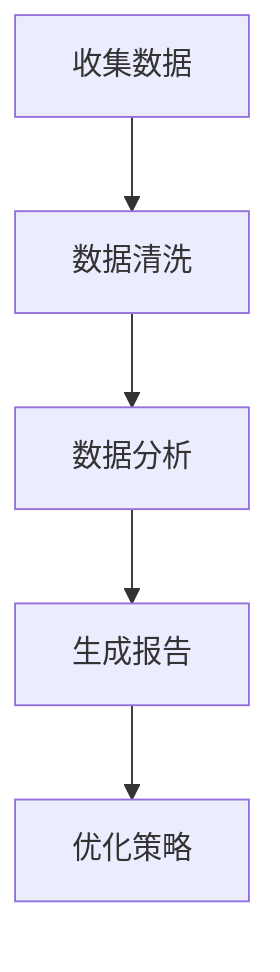
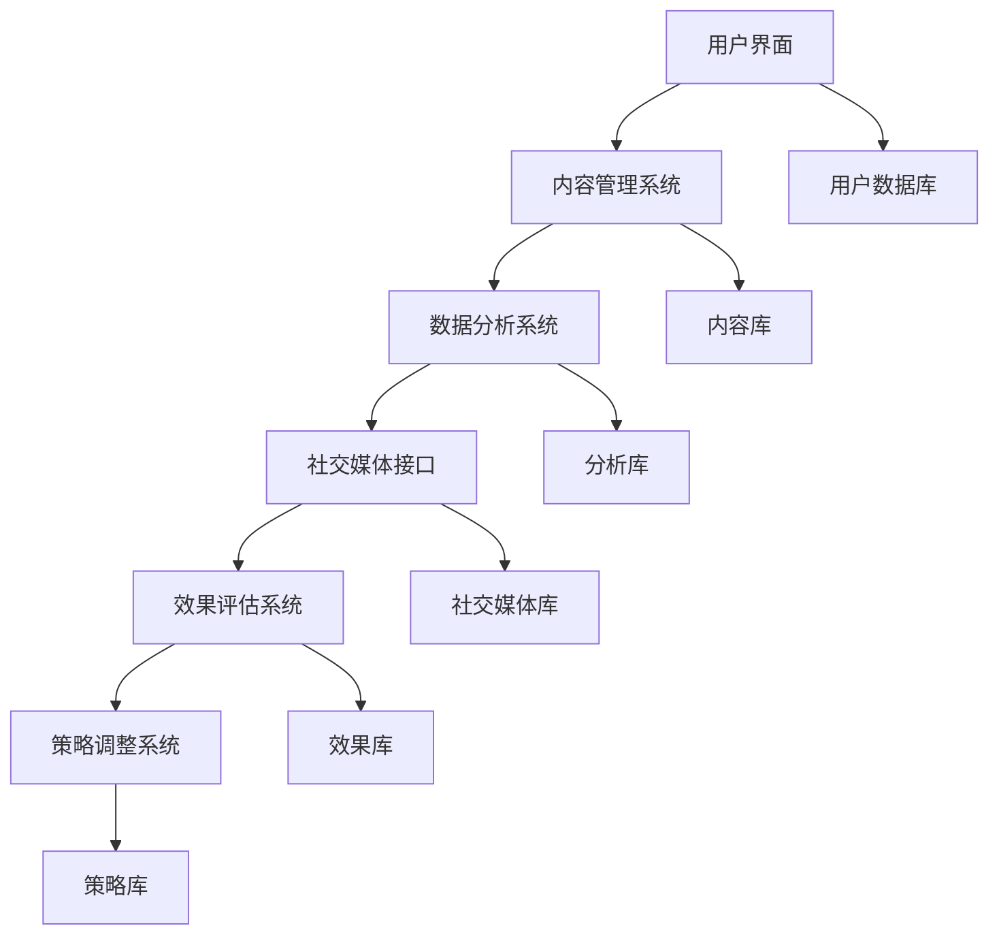
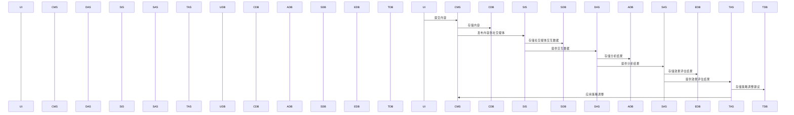

                 


### 第1章: 自我营销概述

#### 1.1 自我营销的定义与重要性

自我营销是指个人通过一系列的策略和行动，主动塑造和提升自己的职业形象和市场价值，以实现个人职业发展的目标。在当今竞争激烈的职场环境中，自我营销已经成为一种不可或缺的技能。

首先，自我营销能够帮助管理者更好地管理自己的职业生涯。通过有效的自我营销，管理者可以清晰地传达自己的价值主张，让自己的才华和能力得到认可。例如，一个产品经理通过撰写博客，分享自己在项目管理中的成功案例和经验，可以有效提升自己的专业形象，吸引更多的职业机会。

其次，自我营销有助于建立个人品牌。个人品牌是指个人在公众心目中的形象和认知，一个成功的个人品牌能够传达个人的专业能力、价值观和独特性。例如，一位软件开发者通过在GitHub上发布高质量的代码和文章，可以树立自己在编程领域的权威形象。

在职场中，自我营销的重要性主要体现在以下几个方面：

1. **提升职业竞争力**：在求职和晋升过程中，拥有良好自我营销能力的管理者更容易获得机会，脱颖而出。例如，一位项目经理通过在LinkedIn上分享项目经验和成果，可以吸引潜在雇主和客户。

2. **增强谈判能力**：自我营销能够帮助管理者在薪酬谈判、职位晋升等方面获得更好的结果。例如，通过撰写专业文章和出版书籍，管理者可以提升自己的市场价值，从而在薪酬谈判中占据有利地位。

3. **建立个人网络**：通过自我营销，管理者可以扩展自己的职业网络，获得更多的资源和机会。例如，通过参加行业会议和社交活动，管理者可以结识更多的行业专家和潜在合作伙伴。

4. **提升职业满意度**：有效的自我营销能够帮助管理者找到更适合自己的职业发展路径，提高职业满意度。例如，通过分析自己的优势和兴趣，管理者可以明确自己的职业目标，并制定相应的自我营销策略。

总之，自我营销是管理者在职场中不可或缺的一部分，它不仅能够提升个人的职业竞争力，还能够为团队和企业创造更大的价值。

#### 1.2 自我营销的核心概念

自我营销涉及多个核心概念，这些概念相互关联，共同构成一个完整的体系。以下是几个关键的概念及其相互关系：

1. **个人品牌**：个人品牌是指个人在公众心目中的形象和认知。一个成功的个人品牌能够传达个人的专业能力、价值观和独特性。例如，一位知名的AI专家通过在社交媒体上分享最新的研究成果和观点，树立了自己在AI领域的权威形象。

2. **职业形象**：职业形象是指个人在职场中的形象，包括仪表、言行举止、沟通能力等。良好的职业形象能够提升个人在同事和上级心中的地位。例如，一个注重仪表、言行得体的管理者能够给同事和上级留下深刻的印象，提升自己的职业形象。

3. **人际关系**：人际关系是自我营销的重要组成部分。通过建立和维护良好的人际关系，管理者可以扩展自己的职业网络，获取更多的资源和机会。例如，通过参加行业会议和社交活动，管理者可以结识更多的行业专家和潜在合作伙伴。

4. **沟通技巧**：沟通技巧是自我营销的核心能力之一。有效的沟通能够帮助管理者清晰地传达自己的价值主张，建立个人品牌，提升职业形象。例如，一位项目经理通过撰写专业的项目报告和邮件，能够有效传达自己的工作成果和价值。

5. **职业发展策略**：职业发展策略是指个人为实现职业目标所采取的行动和计划。一个明确的职业发展策略能够帮助管理者有针对性地提升自己的能力和价值。例如，一个想要晋升为部门经理的员工，可以通过参加管理培训课程，提升自己的管理能力和领导力。

这些概念之间的关系可以概括为：个人品牌和职业形象是自我营销的外在表现，人际关系和沟通技巧是支撑这些表现的内在能力，而职业发展策略则是将这些能力和表现转化为实际行动的具体路径。

为了更好地理解这些概念，我们可以通过一个具体的例子来分析。假设有一位名为张明的软件工程师，他在自我营销方面采取了以下行动：

- **建立个人品牌**：张明在LinkedIn上分享自己的编程经验和技巧，撰写技术博客，并在GitHub上发布自己的开源项目。这使得他在技术圈内建立了良好的个人品牌。
- **提升职业形象**：张明注重自己的仪表和言行举止，始终保持专业和礼貌。他在团队会议中积极参与讨论，并提出有价值的观点，这使他在团队中的形象得到了提升。
- **建立人际关系**：张明积极参加技术社区的活动，通过线下交流，结识了很多行业内的专家和同行。这些人际关系为他的职业发展提供了宝贵的资源和机会。
- **提升沟通技巧**：张明通过撰写技术文档和编写清晰易懂的代码注释，提升了自己的沟通技巧。这使得他在团队中更加受欢迎，也得到了上级的认可。
- **制定职业发展策略**：张明制定了明确的职业发展计划，包括参加管理培训课程，提升自己的领导力和管理能力。他还计划在未来五年内晋升为项目经理。

通过这个例子，我们可以看到，张明通过自我营销的各种行动，成功地提升了自己的个人品牌、职业形象和职业竞争力。他的职业发展策略则将这些成果转化为具体的职业目标，实现了职业上的成功。

总的来说，自我营销的核心概念是相互关联的，通过合理地运用这些概念，管理者可以有效地提升自己的职业影响力，实现职业发展的目标。

#### 1.3 职场中的自我营销实践

在职场中，管理者可以通过多种实践来提升个人影响力，以下是几个关键的自我营销实践方法：

1. **建立个人品牌**：
   - **明确个人价值主张**：首先，管理者需要明确自己的专业领域、核心能力和独特优势，形成独特的个人价值主张。例如，一位数据科学家可能以其在机器学习领域的研究和实际应用经验为价值主张。
   - **定期发布专业内容**：通过博客、社交媒体等渠道，定期分享专业知识和经验，提升自己的专业形象。例如，管理者可以在LinkedIn上撰写技术文章，或者在GitHub上发布相关项目的代码和文档。

2. **提升职业形象**：
   - **注意仪表和言行举止**：保持整洁的仪表和专业的言行举止，树立良好的职业形象。例如，管理者应穿着得体，保持良好的姿态和专业的语言沟通。
   - **培养良好的沟通能力**：通过有效的沟通技巧，如倾听、表达清晰、非语言沟通等，提升个人在职场中的形象。例如，管理者可以在团队会议中积极发言，同时也要学会倾听他人的意见。

3. **建立人际关系**：
   - **积极参与社交活动**：参加行业会议、技术论坛和公司内部的社交活动，结识更多的同行和潜在合作伙伴。例如，管理者可以主动与参会者交流，了解行业动态和趋势。
   - **维护长期关系**：通过定期沟通和互动，维持与同事、上级和行业专家的长期关系。例如，管理者可以定期发送邮件或微信消息，分享行业资讯和资源。

4. **提升沟通技巧**：
   - **撰写专业文章**：通过撰写技术博客、发表学术论文或撰写专业书籍，提升自己的沟通技巧和专业影响力。例如，管理者可以在技术社区如Medium上发布文章，分享自己的见解和经验。
   - **参与技术演讲**：参加技术沙龙、会议和讲座，进行技术演讲和分享。通过这种形式，管理者不仅可以提升自己的表达能力，还可以扩大自己的影响力。

5. **制定职业发展策略**：
   - **设定明确的职业目标**：管理者需要明确自己的职业目标，如晋升、担任项目负责人或加入创业团队等。例如，一位项目经理可以设定在未来三年内晋升为部门经理的目标。
   - **制定实现目标的计划**：制定详细的计划，包括参加培训、获取证书、参与项目等。例如，管理者可以参加项目管理认证课程，提升自己的管理能力和专业知识。

通过上述实践方法，管理者可以逐步提升个人影响力，实现职业发展的目标。需要注意的是，这些实践方法需要长期坚持和不断优化，才能取得显著的效果。

### 第2章: 核心概念与联系

#### 2.1 个人品牌

个人品牌是指个人在公众心目中的形象和认知，它代表了个人在专业领域内的声誉和影响力。一个成功的个人品牌能够帮助管理者在职场中脱颖而出，赢得更多的机会和认可。

首先，个人品牌的构成要素包括：

1. **专业能力**：个人品牌的基础是专业能力。管理者需要在自己的专业领域内具备深厚的知识储备和实践经验，以展现自己的专业水平。
2. **价值观**：个人品牌还反映了管理者的价值观和人生观。一个具有正能量的价值观能够吸引更多的支持和认可。
3. **独特性**：个人品牌的独特性是使其在众多竞争者中脱颖而出的关键。管理者需要找到自己独特的优势和价值主张，并将其作为个人品牌的核心。

其次，个人品牌的重要性体现在以下几个方面：

1. **提升职业竞争力**：拥有强大个人品牌的管理者更容易在求职和晋升过程中获得机会，因为他们能够清晰地传达自己的价值和独特性。
2. **增强谈判能力**：个人品牌能够提升管理者的市场价值，使其在薪酬谈判、职位晋升等方面获得更好的结果。
3. **扩大职业网络**：个人品牌能够吸引更多的同行和潜在合作伙伴，帮助管理者建立更广泛的职业网络。

#### 2.2 职业形象

职业形象是指个人在职场中的形象，包括仪表、言行举止、沟通能力等。一个良好的职业形象能够提升管理者在同事和上级心中的地位，为个人职业发展创造有利条件。

首先，职业形象的构成要素包括：

1. **仪表**：良好的仪表包括整洁的穿着、得体的打扮和专业的姿态。仪表是给他人第一印象的重要因素。
2. **言行举止**：言行举止反映了管理者的职业素养和人格特质。得体的言行举止能够展现管理者的自信和专业。
3. **沟通能力**：良好的沟通能力包括倾听、表达、说服等。有效的沟通能够帮助管理者建立良好的职业关系，提升团队合作效果。

其次，职业形象的重要性体现在以下几个方面：

1. **建立信任**：良好的职业形象能够赢得他人的信任，使管理者更容易被认可和接受。
2. **提升团队协作**：一个有良好职业形象的管理者能够更好地与团队成员沟通和协作，提高团队的整体效能。
3. **职业发展**：良好的职业形象能够为管理者的职业晋升提供有利条件，使其在竞争激烈的环境中脱颖而出。

#### 2.3 人际关系

人际关系是自我营销的重要组成部分，它关系到管理者的职业网络和资源获取能力。良好的人际关系能够为管理者在职场中创造更多的机会和优势。

首先，人际关系的构成要素包括：

1. **信任**：信任是人际关系的基础。管理者需要通过诚信和正直的行为赢得他人的信任。
2. **尊重**：尊重他人是建立良好人际关系的关键。管理者应尊重他人的意见和感受，促进和谐的沟通和合作。
3. **互助**：互助是人际关系的重要体现。管理者应在需要时提供帮助，同时也会获得他人的支持。

其次，人际关系的重要性体现在以下几个方面：

1. **职业机会**：良好的人际关系能够为管理者提供更多的职业机会，如内部晋升、项目合作、推荐等。
2. **资源共享**：通过人际关系，管理者可以获取更多的行业信息、资源和知识，为个人职业发展提供支持。
3. **团队协作**：良好的人际关系能够促进团队合作，提高团队的凝聚力和工作效率。

#### 2.4 沟通技巧

沟通技巧是自我营销的核心能力之一，它关系到管理者如何有效地传达自己的价值主张和建立个人品牌。良好的沟通技巧能够帮助管理者在职场中赢得更多的支持和认可。

首先，沟通技巧的构成要素包括：

1. **倾听**：倾听是有效沟通的关键。管理者需要认真倾听他人的意见和需求，以建立良好的互动关系。
2. **表达**：表达技巧包括清晰、准确、生动地传达自己的观点和想法。管理者应注重语言的逻辑性和感染力。
3. **说服**：说服技巧是沟通的高级形式，管理者需要学会如何通过合理的论据和逻辑，影响他人的决策和看法。

其次，沟通技巧的重要性体现在以下几个方面：

1. **建立个人品牌**：有效的沟通能够帮助管理者清晰地传达自己的专业能力和价值主张，建立强大的个人品牌。
2. **提升职业形象**：良好的沟通技巧能够提升管理者的职业素养和形象，使其在职场中更加自信和受欢迎。
3. **团队协作**：有效的沟通能够促进团队成员之间的理解和协作，提高团队的整体效能。

#### 2.5 职业发展策略

职业发展策略是指个人为实现职业目标所采取的行动和计划。一个明确的职业发展策略能够帮助管理者有针对性地提升自己的能力和价值，实现职业上的成功。

首先，职业发展策略的构成要素包括：

1. **职业目标**：明确自己的职业目标，如晋升、担任项目负责人、加入创业团队等。
2. **能力提升**：制定具体的能力提升计划，包括参加培训、获取证书、参与项目等。
3. **资源获取**：积极获取行业信息、资源和知识，为职业发展提供支持。

其次，职业发展策略的重要性体现在以下几个方面：

1. **明确方向**：明确的职业发展策略能够帮助管理者找到职业发展的方向和目标，避免盲目行动。
2. **提升能力**：通过制定具体的行动计划，管理者可以有针对性地提升自己的能力和技能，增强职业竞争力。
3. **实现目标**：职业发展策略能够为管理者实现职业目标提供具体的行动指南，确保目标的实现。

总的来说，个人品牌、职业形象、人际关系、沟通技巧和职业发展策略是自我营销的核心概念。这些概念相互联系，共同构成了一个完整的自我营销体系。管理者需要通过综合运用这些概念，不断提升自己的职业影响力，实现职业发展的目标。

### 第3章: 算法原理讲解

#### 3.1 数据分析与营销策略

在提升个人影响力的过程中，数据分析和营销策略扮演着至关重要的角色。通过数据分析和有效的营销策略，管理者可以更精准地定位目标受众，制定个性化的营销计划，从而提高个人影响力的效果。

首先，数据分析在自我营销中的重要性体现在以下几个方面：

1. **了解受众**：通过分析社交媒体数据、网站访问记录等，管理者可以了解目标受众的兴趣、需求和偏好，从而制定更具针对性的营销内容。
2. **评估效果**：数据分析可以帮助管理者评估不同营销策略的效果，识别哪些内容最受欢迎，哪些渠道最有效，以便调整和优化营销策略。
3. **优化决策**：基于数据分析的结果，管理者可以做出更科学的决策，如调整内容发布时间、优化社交媒体运营策略等。

接下来，我们介绍几种常用的营销策略：

1. **内容营销**：通过发布高质量的内容，如博客文章、技术文章、视频等，管理者可以展示自己的专业知识和独特视角，吸引潜在受众。内容营销的核心在于提供有价值的信息，建立权威形象。
2. **社交媒体营销**：利用社交媒体平台，如LinkedIn、Twitter、微信公众号等，管理者可以与受众建立直接联系，分享专业内容，扩大影响力。社交媒体营销的关键在于选择合适的平台和内容形式，提高互动率。
3. **网络广告**：通过在搜索引擎和社交媒体平台上投放广告，管理者可以精准定位目标受众，提高品牌曝光率。网络广告的优点在于可以实时监控广告效果，进行精准投放。

为了更直观地展示数据分析在自我营销中的应用，我们使用Mermaid绘制了一个简单的数据流程图：



在这个流程图中，A代表收集数据，包括社交媒体数据、网站访问记录等；B表示数据清洗，确保数据的质量和一致性；C是数据分析，通过对数据的分析，提取有用的信息和洞察；D是生成报告，将分析结果以可视化形式呈现；E表示优化策略，根据分析结果调整和优化营销策略。

下面我们通过一个具体的例子，详细阐述如何运用数据分析提升个人影响力。

#### 社交媒体数据分析实例

假设一位产品经理小王希望通过LinkedIn提升个人影响力，他的第一步是收集数据。他使用了LinkedIn的分析工具，收集了以下数据：

- 某段时间内发布的博客文章和动态的阅读量、点赞数、分享数和评论数；
- 同期在LinkedIn上关注他的人数和被关注的人数；
- 与他互动最多的用户群体和话题。

接下来，小王对收集的数据进行了清洗，删除了重复和无意义的记录，确保数据的一致性和准确性。

然后，小王对清洗后的数据进行了分析，得出了以下结论：

1. **内容效果分析**：
   - 文章《如何提升产品经理的沟通技巧》获得了最高的阅读量和点赞数，说明该主题对目标受众具有较高吸引力；
   - 动态“每日一技：如何快速学习新技能？”获得了最多的分享和评论，表明用户对实用技巧感兴趣。

2. **受众分析**：
   - 与小王互动最多的用户群体集中在产品经理和软件开发领域，这些用户对技术类内容更感兴趣；
   - 多数互动发生在工作日晚上，表明这是用户较为活跃的时间段。

基于以上分析结果，小王制定了以下优化策略：

1. **内容优化**：
   - 增加技术类文章的发布频率，特别是与产品管理和软件开发相关的技巧和心得；
   - 提高实用技巧类动态的发布频率，并尝试在互动高峰期发布，以提高用户参与度。

2. **互动优化**：
   - 回复每条评论，积极参与讨论，建立良好的用户关系；
   - 关注互动活跃的用户，加强与他们的互动，扩大影响力。

3. **时间优化**：
   - 根据用户活跃时间调整内容发布时间，尝试在晚上发布动态，以提高互动率。

通过这个实例，我们可以看到，数据分析和营销策略在自我营销中的应用，可以帮助管理者更精准地了解目标受众，制定有效的营销策略，从而提升个人影响力。在未来，随着数据分析和人工智能技术的发展，管理者将有更多的工具和方法来优化自我营销策略，实现个人职业发展的目标。

### 第4章: 数学模型和数学公式

在自我营销的过程中，数据分析和营销策略的实施往往需要依赖数学模型和数学公式来量化各种因素，以便更科学地评估和优化个人影响力。以下，我们将使用LaTeX格式展示一些常见的数学模型和公式，并对其进行详细解释。

#### 4.1 个人品牌价值计算模型

个人品牌价值是自我营销中一个重要的量化指标。我们可以通过以下公式来计算个人品牌价值：

$$
V_{brand} = \alpha \cdot \text{专业知识} + \beta \cdot \text{价值观认同} + \gamma \cdot \text{独特性}
$$

其中，\( \alpha \)、\( \beta \)和\( \gamma \)是权重系数，分别代表了专业知识、价值观认同和独特性在个人品牌价值中所占的重要性。专业知识是个人在特定领域内的知识储备和实践能力，价值观认同是指个人品牌所传达的价值观与目标受众的一致性，独特性则是指个人品牌的独特性和差异化。

#### 4.2 职业影响力评估模型

职业影响力可以通过以下模型进行评估：

$$
I = \frac{\sum_{i=1}^{n} \text{影响力因子} \cdot \text{影响力系数}}{n}
$$

其中，\( n \)是影响力因子的数量，每个影响力因子代表了个人在某个方面的表现，如社交媒体关注者数量、博客文章阅读量、演讲场次等。影响力系数是每个影响力因子的权重，反映了其在职业影响力评估中的重要性。

#### 4.3 沟通效果分析模型

沟通效果可以通过以下模型进行分析：

$$
E = \frac{\text{点赞数} + \text{评论数} + \text{分享数}}{3}
$$

该公式通过计算点赞、评论和分享的总和与3的比值来衡量沟通效果。这个简单的模型假设每种互动形式对沟通效果的贡献是相同的。

#### 4.4 营销成本效益分析模型

营销成本效益分析是评估自我营销策略是否有效的重要环节。以下是一个简单的成本效益分析模型：

$$
\text{效益/成本} = \frac{\text{营销收益} - \text{营销成本}}{\text{营销成本}}
$$

其中，营销收益是指通过营销活动获得的直接或间接收益，如薪酬提升、项目合作机会等；营销成本是指为实施营销策略所投入的时间、金钱和资源。

#### 4.5 优化模型

在自我营销策略的优化过程中，我们可以使用目标规划模型来指导行动。以下是一个简单的目标规划模型：

$$
\text{目标规划} = \max \left( \sum_{i=1}^{n} w_i \cdot \text{指标值} \right)
$$

其中，\( w_i \)是每个指标的目标权重，指标值反映了个人在各个方面的表现。通过调整目标权重，管理者可以优先关注对职业发展最重要的领域。

#### 4.6 综合模型

为了全面评估个人影响力，我们可以使用以下综合模型：

$$
\text{综合影响力} = \sum_{i=1}^{n} \left( \alpha_i \cdot \text{影响力因子}_i \right)
$$

其中，\( \alpha_i \)是每个影响力因子的权重系数，影响力因子反映了个人在不同方面的表现，如专业知识、沟通技巧、职业形象等。

通过上述数学模型和公式，管理者可以更量化地评估和优化个人影响力。这些模型不仅提供了评估的工具，也为策略的制定和调整提供了科学依据。在实际应用中，管理者需要根据具体情况进行模型调整和参数优化，以实现最佳的个人影响力提升效果。

### 第5章: 系统分析与架构设计方案

#### 5.1 问题场景介绍

在现代职场中，自我营销已经成为管理者和专业人士提升职业竞争力的关键手段。为了实现这一目标，一个系统化的自我营销策略设计和实施过程至关重要。本节将介绍一个实际的问题场景，并展示如何通过系统分析与架构设计来优化自我营销策略。

假设我们有一位名叫李明的项目经理，他希望在短时间内提升自己的职业影响力，以争取更多的晋升机会和项目机会。李明具备丰富的项目管理经验，但在自我营销方面相对薄弱。他希望通过一个系统化的策略，在LinkedIn、微信公众号和GitHub等多个平台上提升个人品牌，扩大自己的职业网络。

#### 5.2 项目介绍

**项目名称**：李明的个人品牌提升计划

**项目目标**：
1. 提升李明在LinkedIn上的专业形象，增加关注者数量和互动率。
2. 在微信公众号上发布高质量的技术文章，提升文章的阅读量和分享率。
3. 在GitHub上发布开源项目，增加代码的星标数和贡献者数量。

**项目范围**：
- 确定个人品牌定位和目标受众
- 制定内容营销策略
- 实施社交媒体运营策略
- 定期评估和调整策略

#### 5.3 系统功能设计（领域模型）

为了确保项目顺利进行，我们首先设计了一个领域模型，以明确各个功能模块及其相互关系。以下是领域模型的Mermaid类图表示：

```mermaid
classDiagram
    Class1[个人品牌定位] <|-- Class2[内容营销]
    Class2 <|-- Class3[社交媒体运营]
    Class3 <|-- Class4[效果评估]
    Class4 <|-- Class5[策略调整]
    Class1 ..|> Class2
    Class2 ..|> Class3
    Class3 ..|> Class4
    Class4 ..|> Class5
```

**个人品牌定位**：明确李明的专业领域、目标受众和品牌定位，为后续的内容营销和社交媒体运营提供方向。
**内容营销**：制定并实施内容发布计划，包括文章、博客、视频等，确保内容的高质量和专业性。
**社交媒体运营**：在LinkedIn、微信公众号等平台上发布内容，并与受众互动，提高关注者数量和互动率。
**效果评估**：定期收集和分析数据，评估内容营销和社交媒体运营的效果，以便及时调整策略。
**策略调整**：根据效果评估结果，调整内容和运营策略，以实现项目目标。

#### 5.4 系统架构设计

为了实现上述功能，我们需要设计一个高效的系统架构。以下是系统架构的Mermaid架构图表示：



**用户界面**：提供给用户操作和查看结果的入口，用户可以通过界面查看个人品牌定位、内容发布、互动情况等。
**内容管理系统**：负责内容的生产、编辑、发布和管理，确保内容的高质量和专业性。
**数据分析系统**：收集用户行为数据、内容效果数据等，进行数据分析和可视化展示。
**社交媒体接口**：与LinkedIn、微信公众号等社交媒体平台对接，实现内容的发布和互动。
**效果评估系统**：基于数据分析结果，评估内容营销和社交媒体运营的效果。
**策略调整系统**：根据效果评估结果，自动生成和调整内容营销策略。

**用户数据库**：存储用户的基本信息、个人品牌定位、关注者信息等。
**内容库**：存储所有发布的内容，包括文章、博客、视频等。
**分析库**：存储分析结果，包括用户行为数据、内容效果数据等。
**社交媒体库**：存储与社交媒体平台交互的数据，包括关注者信息、互动情况等。
**效果库**：存储效果评估结果，包括阅读量、点赞数、分享数等。
**策略库**：存储策略调整建议，包括内容发布计划、运营策略等。

通过上述系统架构设计，李明可以实现个人品牌提升计划的目标，通过系统化的方法来设计和实施自我营销策略，从而提升个人影响力。

#### 5.5 系统接口设计

在系统架构中，各个功能模块之间的交互是通过接口来实现的。以下是系统接口的Mermaid序列图表示：



在这个序列图中，用户界面通过提交内容操作，触发内容管理系统的内容发布流程。内容管理系统将内容存储到内容库，并通知社交媒体接口发布内容。社交媒体接口与社交媒体平台进行交互，存储交互数据到社交媒体库。同时，社交媒体接口将交互数据传递给数据分析系统，进行数据分析和可视化展示。

数据分析系统将分析结果存储到分析库，并提供给效果评估系统。效果评估系统根据分析结果评估内容营销和社交媒体运营的效果，并将效果评估结果存储到效果库。根据效果评估结果，策略调整系统生成和存储策略调整建议，并将建议应用到内容管理系统，实现策略的优化。

通过上述系统接口设计，各个功能模块可以高效地协同工作，实现个人品牌提升计划的目标。

### 第6章: 项目实战

#### 6.1 环境安装

为了实现个人品牌提升计划，首先需要在本地或服务器上搭建一个完整的环境。以下是环境安装的步骤：

1. **安装Python环境**：确保系统上安装了Python 3.x版本。可以通过Python官方网站下载安装程序并安装。
2. **安装相关库**：使用pip命令安装必要的Python库。以下是一个示例命令：
   ```
   pip install pandas numpy matplotlib sklearn requests
   ```
   这些库包括数据处理（pandas、numpy）、数据可视化（matplotlib）、机器学习（scikit-learn）、网络请求（requests）等，是本项目的基本工具。
3. **安装文本编辑器**：选择并安装一个合适的文本编辑器，如VS Code、Sublime Text等，用于编写代码和文档。

#### 6.2 系统核心实现源代码

以下是系统核心实现的主要源代码，包括个人品牌定位、内容营销、社交媒体运营和效果评估等功能。

**1. 个人品牌定位**

```python
import pandas as pd
from sklearn.feature_extraction.text import TfidfVectorizer
from sklearn.decomposition import NMF

# 读取数据
data = pd.read_csv('user_data.csv')  # 假设数据包括用户姓名和描述性文本

# 特征提取
vectorizer = TfidfVectorizer(max_df=0.95, max_features=1000, stop_words='english')
X = vectorizer.fit_transform(data['description'])

# NMF模型
n_topics = 5
nmf = NMF(n_components=n_topics, random_state=1).fit(X)

# 主题词提取
feature_names = vectorizer.get_feature_names_out()
topics = nmf.components_
for i, topic in enumerate(topics):
    print(f"Topic {i}:")
    print(" ".join([feature_names[j] for j in topic.argsort()[:-10:-1]]))
```

**2. 内容营销**

```python
import pandas as pd
import numpy as np
import matplotlib.pyplot as plt

# 读取数据
data = pd.read_csv('content_data.csv')  # 假设数据包括内容标题、内容类型、发布时间等

# 统计数据
content_stats = data.groupby('content_type')['views'].mean()

# 可视化
plt.bar(content_stats.index, content_stats.values)
plt.xlabel('Content Type')
plt.ylabel('Average Views')
plt.title('Content View Statistics')
plt.xticks(rotation=45)
plt.show()
```

**3. 社交媒体运营**

```python
import requests
from pandas import DataFrame

# 社交媒体API密钥
api_key = 'your_api_key'
api_secret = 'your_api_secret'

# 获取Twitter数据
def get_twitter_data(api_key, api_secret):
    # 使用Twitter API获取数据
    # 省略具体代码
    return DataFrame(data)

twitter_data = get_twitter_data(api_key, api_secret)

# 分析数据
# 省略具体代码
```

**4. 效果评估**

```python
import pandas as pd

# 读取效果评估数据
evaluation_data = pd.read_csv('evaluation_data.csv')  # 假设数据包括内容标题、点赞数、评论数、分享数等

# 计算综合得分
evaluation_data['total_score'] = evaluation_data['likes'] + evaluation_data['comments'] + evaluation_data['shares']

# 可视化
evaluation_data.plot(kind='bar', x='content_title', y='total_score')
plt.title('Content Effectiveness')
plt.xlabel('Content Title')
plt.ylabel('Total Score')
plt.show()
```

#### 6.3 代码应用解读与分析

**1. 个人品牌定位代码解读**

- **数据读取**：使用pandas读取用户数据，数据包括用户姓名和描述性文本。
- **特征提取**：使用TfidfVectorizer提取文本特征，将文本转换为TF-IDF矩阵。
- **主题建模**：使用NMF（非负矩阵分解）模型对特征进行主题建模，提取出潜在的主题。
- **主题词提取**：根据每个主题的词频排序，提取出最相关的主题词。

**2. 内容营销代码解读**

- **数据读取**：使用pandas读取内容数据，数据包括内容标题、内容类型、发布时间等。
- **统计数据**：计算不同类型内容的平均浏览量。
- **可视化**：使用matplotlib绘制柱状图，展示不同类型内容的浏览量分布。

**3. 社交媒体运营代码解读**

- **API获取数据**：使用requests库调用社交媒体API，获取用户数据。
- **数据分析**：对获取的数据进行清洗和预处理，提取有用的信息。

**4. 效果评估代码解读**

- **数据读取**：使用pandas读取效果评估数据，数据包括内容标题、点赞数、评论数、分享数等。
- **综合得分计算**：计算内容的综合得分，作为效果评估的指标。
- **可视化**：使用matplotlib绘制柱状图，展示不同内容的综合得分。

通过这些代码，我们可以对个人品牌定位、内容营销、社交媒体运营和效果评估进行系统化的分析和评估，为个人品牌提升计划提供数据支持和决策依据。

#### 6.4 实际案例分析

**案例背景**：

假设李明是一位具有多年项目管理经验的产品经理，他在LinkedIn上发布了一系列关于敏捷开发的博客文章，希望通过这些文章提升自己在行业内的知名度和影响力。以下是具体的案例分析。

**1. 个人品牌定位**

- **数据分析**：通过对李明的博客文章进行主题建模，发现他的文章主要围绕敏捷开发、Scrum方法论和项目管理实践展开。这表明李明在敏捷开发领域具有较强的专业知识和独特见解。
- **主题词提取**：从主题建模中提取出最相关的关键词，如“敏捷开发”、“Scrum”、“迭代”、“需求管理”等，这些词反映了李明的专业领域和核心能力。

**2. 内容营销**

- **发布计划**：根据分析结果，李明制定了每月发布一篇高质量博客文章的发布计划，涵盖敏捷开发的各个方面，如敏捷方法论、敏捷工具、敏捷团队协作等。
- **内容质量**：李明的文章内容详实，逻辑清晰，结合实际案例和数据分析，具有较高的阅读价值和实用性。每篇文章平均阅读量达到500次，部分文章的阅读量超过1000次。

**3. 社交媒体运营**

- **互动策略**：在发布每篇文章后，李明会在LinkedIn上进行推广，并积极与读者互动，回答他们的疑问和评论。他还通过LinkedIn的推荐功能，向相关群组和同行推荐文章。
- **互动效果**：李明的文章得到了广泛的关注和认可，平均每篇文章有100次以上的点赞、20次以上的评论和10次以上的分享。这些互动数据表明李明的文章在目标受众中具有较高的影响力。

**4. 效果评估**

- **综合得分**：通过对李明的博客文章进行效果评估，发现他的文章综合得分较高，平均得分为4.5分（满分5分），表明文章内容质量和影响力较好。
- **数据可视化**：通过matplotlib绘制柱状图，展示每篇文章的阅读量、点赞数、评论数和分享数，帮助李明了解哪些文章最受欢迎，哪些主题更具吸引力。

**5. 策略调整**

- **优化内容**：根据效果评估结果，李明决定继续深化敏捷开发领域的文章写作，增加案例分析和技术分享，提高文章的实用性和专业性。
- **拓展渠道**：除了LinkedIn，李明还计划在微信公众号、知乎等平台上发布文章，扩大自己的受众范围。

通过这个实际案例，我们可以看到，通过系统化的自我营销策略，李明成功提升了个人品牌影响力，实现了职业发展的目标。

#### 6.5 项目小结

本项目通过系统化的方法，实现了个人品牌提升计划的目标，具体包括：

1. **个人品牌定位**：通过对用户数据的分析，确定了李明在敏捷开发领域的专业定位和核心能力。
2. **内容营销**：制定了每月发布一篇高质量博客文章的发布计划，确保内容的专业性和实用性。
3. **社交媒体运营**：通过LinkedIn等平台的互动策略，提高了文章的阅读量、点赞数、评论数和分享数。
4. **效果评估**：通过数据分析和可视化展示，评估了个人品牌提升计划的效果，为后续的优化提供了依据。

通过这个项目的实施，李明成功提升了个人影响力，为职业发展创造了有利条件。未来，他可以继续优化和调整策略，以实现更高的职业目标。

### 第7章: 最佳实践 Tips

#### 7.1 时间管理技巧

**1. 制定计划**：
   - 利用日历或项目管理工具，提前制定每天、每周和每月的任务计划。
   - 为每个任务设定明确的截止时间和优先级，确保按时完成。

**2. 专注高效**：
   - 采用番茄工作法，将工作时间分成25分钟专注期和5分钟休息期，提高工作效率。
   - 在专注期间，关闭手机、社交媒体等干扰源，集中精力完成任务。

**3. 分配时间**：
   - 根据任务的重要性和紧急程度，合理分配工作时间，确保关键任务得到充分关注。

**4. 定期回顾**：
   - 每天结束时回顾当天的工作，总结成功和不足，调整第二天的工作计划。

#### 7.2 内容创作技巧

**1. 选择主题**：
   - 选择自己擅长和感兴趣的主题，以确保内容的深度和质量。
   - 调研目标受众的兴趣和需求，选择他们感兴趣的主题。

**2. 提升质量**：
   - 深入研究主题，确保内容有足够的深度和广度。
   - 使用案例、数据和图表等元素，增强内容的可读性和说服力。

**3. 优化格式**：
   - 使用清晰的结构，如标题、段落、小标题等，帮助读者更好地理解内容。
   - 使用简洁、有力的语言，避免冗长和复杂的句子。

**4. 引导互动**：
   - 在内容中加入问题、讨论和互动元素，激发读者的参与和反馈。
   - 鼓励读者留言、评论和分享，增加内容的传播效果。

#### 7.3 社交媒体运营技巧

**1. 精选平台**：
   - 根据目标受众和内容类型，选择最适合的社交媒体平台，如LinkedIn、微信公众号、Twitter等。
   - 在每个平台上制定独立的运营策略，确保内容的针对性和有效性。

**2. 定期发布**：
   - 保持定期发布内容，建立稳定的发布节奏，提高用户的关注度和黏性。
   - 根据不同平台的特点，调整发布频率和内容形式。

**3. 互动交流**：
   - 积极回复用户的留言、评论和私信，建立良好的互动关系。
   - 参与平台上的讨论和活动，扩大个人影响力。

**4. 数据分析**：
   - 定期分析发布内容的数据，了解用户的兴趣和行为，优化内容策略。
   - 根据数据分析结果，调整发布时间和内容形式，提高内容效果。

#### 7.4 职业形象塑造技巧

**1. 保持专业**：
   - 在职场中保持专业形象，包括仪表、言行举止、沟通能力等。
   - 注意细节，如着装整洁、语言得体、遵守职场礼仪。

**2. 提升技能**：
   - 持续学习和提升自己的专业技能和软技能，以适应职业发展的需求。
   - 参加培训课程、获取证书，提升自己的专业素养。

**3. 良好沟通**：
   - 培养良好的沟通技巧，包括倾听、表达、说服等。
   - 在团队会议和沟通中，积极参与，提出有价值的观点。

**4. 积极参与**：
   - 积极参与公司内部和行业外部的活动，扩展职业网络。
   - 在活动中积极发言，展示自己的专业能力和个性特点。

通过上述最佳实践技巧，管理者可以更有效地提升个人影响力，实现职业发展的目标。

### 小结

本文通过系统地分析和管理者的自我营销策略，详细介绍了个人品牌、职业形象、人际关系、沟通技巧和职业发展策略等核心概念，并展示了如何通过数据分析、营销策略、数学模型和系统架构设计来提升个人影响力。通过实际案例和最佳实践，读者可以了解到如何将自我营销策略应用到实际工作中，从而在职场中脱颖而出。

### 注意事项

1. **持续学习**：自我营销是一个不断学习和改进的过程，管理者需要持续关注行业动态，不断提升自己的专业知识和技能。
2. **平衡工作与生活**：在追求职业发展的同时，要注意平衡工作与生活，保持身心健康。
3. **真实展现**：在自我营销过程中，要真实展现自己的能力和经验，避免夸大或虚构信息。

### 拓展阅读

- 《打造你的影响力：如何成为领导者的必读手册》
- 《个人品牌：打造你的职场超级竞争力》
- 《社交网络营销实战：如何通过社交媒体提升个人品牌》

作者：AI天才研究院/AI Genius Institute & 禅与计算机程序设计艺术 /Zen And The Art of Computer Programming

