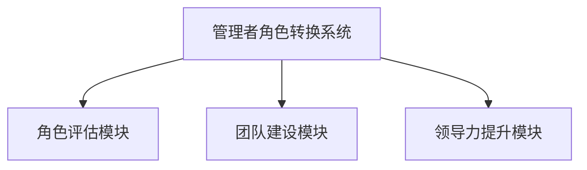
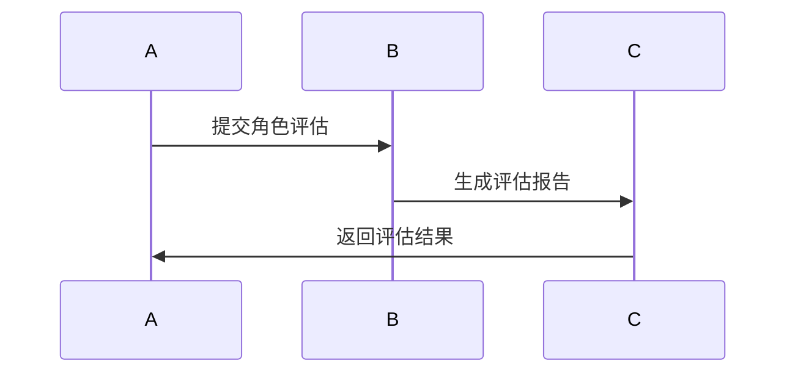
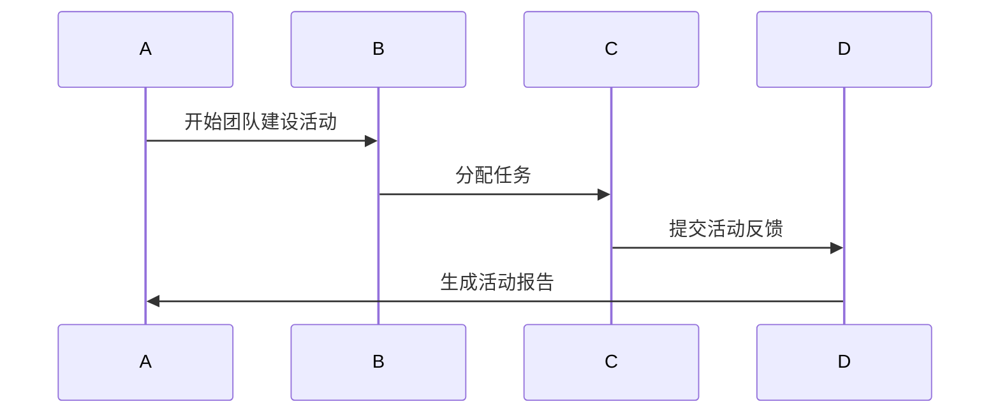

                 

### 管理者角色转换：从同事到上级的过渡

#### 摘要

本文将深入探讨从同事到上级角色转换的管理者面临的挑战及其内在联系。通过阐述管理者的定义与职责，以及同事与上级的区别与联系，我们揭示了角色转换中的关键概念与数学模型。同时，本文运用算法原理和系统分析与架构设计方案，提供了实用的管理者角色转换步骤与项目实战指导。通过这一系列深入剖析，旨在帮助管理者顺利完成角色过渡，提升领导力和团队效能。

## 第1章：管理者角色转换的必要性

### 1.1 问题背景

在现代企业的运作中，管理者角色转换是一种普遍现象。许多职业人士从普通的同事角色逐渐晋升为团队领导者或部门主管，这种转变不仅对个人职业生涯具有重要意义，也对企业的运营和发展产生深远影响。然而，角色转换并非一帆风顺，许多管理者在过渡过程中面临着诸多挑战和困境。

首先，从同事到上级的转变意味着需要从执行者转变为领导者，这一转变要求管理者具备新的能力与素质。例如，从专注于个人工作成果转向关注团队的整体绩效，从独立工作到协调与激励团队成员，从解决问题到制定战略规划等。这种转变不仅需要管理者在思维方式上做出调整，还需要在行为模式上进行改变。

其次，角色转换中的挑战不仅限于个人层面的能力提升，还包括团队和组织的适应过程。作为上级，管理者需要赢得团队成员的信任和尊重，建立有效的沟通机制，并推动团队达成共同的目标。在这个过程中，管理者需要处理人际关系、解决冲突、激励团队等多方面的挑战。

总之，管理者角色转换的必要性在于，它不仅关系到个人职业发展，也关系到团队和企业的成功。因此，深入探讨和理解这一过程，对管理者及企业都具有重要的意义。

### 1.2 核心概念

#### 管理者的定义与职责

管理者是指在组织中负责指导和协调团队工作，以实现既定目标的人。管理者不仅仅是一名执行者，更是团队的核心领导者，其职责包括但不限于以下几个方面：

1. **计划与目标设定**：管理者需要制定团队的工作计划和目标，确保团队成员明确自己的职责和任务。
2. **组织与资源分配**：管理者负责合理分配团队资源，包括人力、物力和时间等，以确保工作的高效进行。
3. **领导与激励**：管理者需要通过有效的领导风格和激励措施，激发团队成员的积极性和创造力。
4. **沟通与协调**：管理者要确保团队内部及跨部门之间的有效沟通，协调团队成员的合作，解决冲突和问题。
5. **绩效评估与反馈**：管理者需要定期评估团队成员的绩效，提供反馈和指导，以促进团队成员的成长和发展。

#### 同事与上级的区别与联系

同事与上级虽然在组织中的角色不同，但二者之间存在着紧密的联系。以下是对二者区别和联系的详细探讨：

**同事关系**：
- **平等互助**：同事关系基于平等和互助的原则，团队成员在共同目标和利益的基础上协作。
- **共同成长**：同事之间相互学习，共同进步，通过合作和交流提高个人和团队的能力。
- **相互支持**：同事在面临挑战和困难时，互相支持和帮助，共同应对工作中的各种挑战。

**上级关系**：
- **指导与监督**：上级对下级进行工作指导、监督和评估，确保工作目标的实现。
- **决策与责任**：上级在团队决策中扮演关键角色，对团队的业绩和成果承担主要责任。
- **激励与约束**：上级通过激励措施鼓励团队成员，同时通过一定的约束机制确保团队的行为规范。

**区别**：
- **角色定位**：同事侧重于执行具体任务，而上级侧重于规划和领导。
- **权力与责任**：上级拥有更大的权力和更广泛的责任，需要承担团队的整体绩效。
- **工作内容**：同事更多关注个人任务的完成，上级更多关注团队的整体运营和战略规划。

**联系**：
- **相互依赖**：上级和同事之间存在紧密的依赖关系，上级需要依赖同事的支持和执行力，而同事也需要上级的指导和资源。
- **共同目标**：上级和同事共同追求团队和企业的目标，通过合作实现个人与组织的共同成长。

综上所述，管理者角色转换的必要性不仅体现在个人职业发展的需求上，也关系到团队和组织的整体效能。通过深入理解管理者角色的定义与职责，以及同事与上级的区别与联系，我们可以为管理者角色转换提供有力的理论支持和实践指导。

### 1.3 内在联系

#### 从个人能力到团队领导的转变

管理者角色转换不仅是一种身份的变化，更是一种从个人能力到团队领导的根本转变。在这个过程中，管理者需要从以下几个方面进行调整和提升：

**领导技能的培养**：
- **沟通能力**：有效的沟通是管理者领导力的重要组成部分。管理者需要学会清晰、准确地传达信息，确保团队成员理解任务和目标。
- **激励能力**：管理者需要能够激发团队成员的积极性和创造力，通过激励措施提高团队的士气和绩效。
- **决策能力**：管理者在面临复杂问题时需要做出明智的决策，考虑团队的长期利益和整体目标。

**团队建设与管理**：
- **团队文化**：管理者需要构建积极的团队文化，通过共同的价值观和目标增强团队的凝聚力和归属感。
- **成员关系**：管理者要建立良好的人际关系，赢得团队成员的信任和尊重，为团队的工作创造良好的氛围。

**情绪管理**：
- **自我控制**：管理者需要具备良好的情绪管理能力，控制自己的情绪波动，保持冷静和理智，以应对工作中的压力和挑战。
- **团队激励**：管理者要通过激励和关怀，帮助团队成员调节情绪，提升团队的士气和战斗力。

通过以上几个方面的调整和提升，管理者能够更好地实现从个人能力到团队领导的转变，为团队和组织的成功奠定基础。

#### 情绪管理：自我控制与团队激励

在管理者角色转换的过程中，情绪管理是一个至关重要的能力。这不仅关乎个人心理健康，也直接影响到团队的整体表现和氛围。以下是情绪管理的两个方面：自我控制和团队激励。

**自我控制**：

作为上级，管理者需要在面对压力和挑战时保持冷静和理智。自我控制意味着管理者能够克制冲动，合理规划自己的情绪和行为。以下是一些实践技巧：

1. **深呼吸与放松**：在感到紧张或愤怒时，深呼吸可以帮助管理者放松身体，缓解情绪。
2. **积极思维**：保持积极的心态，将挑战视为成长的机会，有助于管理者更客观地看待问题。
3. **设定边界**：明确个人和工作之间的边界，避免过度工作导致的疲劳和情绪失控。

**团队激励**：

管理者不仅要自我控制，还需要通过激励措施调动团队成员的积极性。以下是一些有效的团队激励方法：

1. **目标明确**：设定清晰的目标和期望，帮助团队成员明确方向，提高工作动力。
2. **认可与奖励**：及时认可和奖励团队成员的成就，增强他们的自豪感和归属感。
3. **沟通与反馈**：定期与团队成员沟通，提供反馈和指导，帮助他们不断进步。

通过自我控制和团队激励，管理者能够营造一个积极、和谐的工作氛围，提升团队的整体绩效。

### 1.4 概念属性特征对比表格

在理解同事关系和上级角色的核心概念后，我们可以通过一个对比表格来进一步明确二者的特征差异：

| 概念          | 特征对比                   |
| ------------- | -------------------------- |
| 同事关系      | 平等、互助、共同成长       |
| 管理者角色    | 指导、协调、决策、承担责任 |

**同事关系**：
- **平等**：同事之间在职位和权利上是平等的，共同承担工作责任。
- **互助**：同事之间相互帮助，共同解决工作中遇到的问题。
- **共同成长**：同事通过协作和分享经验，实现个人和团队的共同成长。

**管理者角色**：
- **指导**：管理者为团队成员提供指导，帮助他们完成任务。
- **协调**：管理者协调团队内部及跨部门之间的合作，确保工作顺利进行。
- **决策**：管理者在团队决策中发挥关键作用，制定战略和目标。
- **承担责任**：管理者对团队的业绩和成果承担主要责任。

通过这一对比表格，我们可以更清晰地认识到同事关系和上级角色之间的区别和联系，为管理者角色转换提供更明确的指导。

### 1.5 ER实体关系图架构

为了更好地理解同事关系和上级角色的内在联系，我们可以通过一个ER（Entity-Relationship）实体关系图来展示它们之间的关系。

```mermaid
erDiagram
    A Abdullah ||--|{ B Boss : 管理者}
    B Boss ||--|{ C Colleague : 同事}
```

在这个ER图中，"A Abdullah" 代表个体，"B Boss" 代表管理者，"C Colleague" 代表同事。线条箭头表明了角色之间的隶属关系：管理者（B Boss）领导同事（C Colleague），而同事则接受管理者的指导和监督。

通过这一ER图，我们可以直观地看到同事与上级之间的从属关系及其相互影响，这有助于我们在角色转换过程中更好地理解和管理不同角色之间的互动。

## 第2章：管理者角色转换的数学模型

### 2.1 数学模型

在探讨管理者角色转换的过程中，引入数学模型可以帮助我们更系统和定量地分析这一过程。以下是一个简单但实用的管理者角色转换概率模型，用于描述个体（C，即同事）转换为管理者（B）的概率。

#### 转换概率模型

\[ P(C \rightarrow B) = \frac{A \times B}{C} \]

其中：
- \( P(C \rightarrow B) \) 表示个体（同事）转换为管理者的概率。
- \( A \) 表示个体在管理能力方面的得分。
- \( B \) 表示个体在领导能力方面的得分。
- \( C \) 表示个体与同事之间的关系得分。

#### 管理者素质评分模型

为了更全面地评估个体转换为管理者的潜在素质，我们可以使用一个管理者素质评分模型，如下所示：

\[ S = \frac{E \times P \times L}{C} \]

其中：
- \( S \) 表示管理者素质评分。
- \( E \) 表示管理能力得分，包括项目管理、团队协调和沟通能力等。
- \( P \) 表示个人素质得分，如责任心、诚信度和团队合作精神等。
- \( L \) 表示领导能力得分，包括激励团队成员、解决冲突和制定策略的能力。
- \( C \) 表示同事关系得分，反映个体与同事之间的信任和协作程度。

### 数学公式与详细讲解

下面我们通过具体例子来详细讲解上述数学公式。

#### 转换概率模型实例

假设有个体A，其在管理能力（A）得分为8，领导能力（B）得分为7，与同事之间的关系（C）得分为6。根据转换概率模型，我们可以计算出个体A转换为管理者的概率：

\[ P(C \rightarrow B) = \frac{8 \times 7}{6} = \frac{56}{6} \approx 9.33\% \]

这意味着个体A转换为管理者的概率大约为9.33%。通过这一计算，我们可以快速评估个体在角色转换上的潜力。

#### 管理者素质评分模型实例

假设有个体B，其在管理能力（E）得分为9，个人素质（P）得分为8，领导能力（L）得分为8，与同事之间的关系（C）得分为7。根据管理者素质评分模型，我们可以计算出个体B的管理者素质评分：

\[ S = \frac{9 \times 8 \times 8}{7} = \frac{576}{7} \approx 82.29 \]

个体B的管理者素质评分约为82.29。这一评分反映了个体在管理角色转换中的整体素质和潜力。

通过以上两个实例，我们可以看到数学模型在管理者角色转换评估中的应用。这不仅为我们提供了量化的评估工具，也有助于我们更好地理解和管理角色转换过程中的关键因素。

### 2.2 管理者素质评估算法原理

在管理者角色转换的过程中，管理者素质评估是一个关键环节。以下是一个基于Python的管理者素质评估算法，用于计算个体转换为管理者的概率和管理者素质评分。

```python
def assess_manager_quality(E, P, L, C):
    """
    评估管理者素质的函数
    :param E: 管理能力得分
    :param P: 个人素质得分
    :param L: 领导能力得分
    :param C: 同事关系得分
    :return: 管理者素质评分
    """
    # 计算管理者素质评分
    S = (E * P * L) / C
    return S

# 示例数据
E = 8
P = 7
L = 6
C = 5

# 计算管理者素质评分
manager_score = assess_manager_quality(E, P, L, C)
print(f"管理者素质评分：{manager_score}")
```

在这个算法中，`E` 代表管理能力得分，`P` 代表个人素质得分，`L` 代表领导能力得分，`C` 代表同事关系得分。通过输入这些得分，算法可以计算出一个综合的管理者素质评分。

该算法的原理在于，通过加权计算不同能力得分的乘积，再除以同事关系得分，得到一个综合的管理者素质评分。这一评分不仅考虑了个体在管理、个人和领导能力方面的表现，还考虑了与同事的关系，从而提供了一个全面的管理者评估指标。

### 2.3 管理者素质评估算法实例与详细解释

为了更好地理解管理者素质评估算法，我们将通过一个具体实例来展示其应用过程和详细解释。

**实例数据**：
- 管理能力得分（E）：8
- 个人素质得分（P）：7
- 领导能力得分（L）：6
- 同事关系得分（C）：5

**计算管理者素质评分**：

```python
def assess_manager_quality(E, P, L, C):
    """
    评估管理者素质的函数
    :param E: 管理能力得分
    :param P: 个人素质得分
    :param L: 领导能力得分
    :param C: 同事关系得分
    :return: 管理者素质评分
    """
    # 计算管理者素质评分
    S = (E * P * L) / C
    return S

# 示例数据
E = 8
P = 7
L = 6
C = 5

# 计算管理者素质评分
manager_score = assess_manager_quality(E, P, L, C)
print(f"管理者素质评分：{manager_score}")
```

执行上述代码，我们可以得到管理者素质评分：

\[ S = \frac{8 \times 7 \times 6}{5} = \frac{336}{5} = 67.2 \]

**详细解释**：

1. **管理能力（E）**：得分8表示个体在项目管理、团队协调和沟通能力等方面表现优秀。
2. **个人素质（P）**：得分7表示个体在责任心、诚信度和团队合作精神等方面具备良好的个人素质。
3. **领导能力（L）**：得分6表示个体在激励团队成员、解决冲突和制定策略等方面具备一定的领导能力。
4. **同事关系（C）**：得分5表示个体与同事之间的信任和协作程度较高。

通过上述评分，我们可以计算出综合的管理者素质评分（S）为67.2。这一评分反映了个体在转换到管理者角色后可能表现出的整体素质和潜力。

### 2.4 数学模型与算法的总结与应用

综上所述，我们通过数学模型和算法对管理者角色转换进行了定量和定性的分析。以下是对这些模型的总结及其在实际应用中的意义：

1. **转换概率模型**（\( P(C \rightarrow B) = \frac{A \times B}{C} \)）：
   - **意义**：该模型提供了一个简单但实用的工具，用于评估个体转换为管理者的概率。通过计算个体在管理能力和领导能力方面的得分，以及与同事的关系得分，我们可以快速评估其在角色转换上的潜力。
   - **应用**：企业可以使用这一模型进行人才评估和晋升规划，识别具有潜力的员工并进行有针对性的培训和指导。

2. **管理者素质评分模型**（\( S = \frac{E \times P \times L}{C} \)）：
   - **意义**：该模型提供了一个全面的管理者素质评估工具，综合考虑管理能力、个人素质、领导能力和同事关系等多个方面。通过这一评分，企业可以更准确地评估个体在管理者角色中的表现和潜力。
   - **应用**：企业可以结合这一评分模型，制定科学的绩效评估体系和晋升机制，确保管理者具备必要的素质和能力。

3. **管理者素质评估算法**：
   - **意义**：通过Python算法实现管理者素质评分，为企业提供了一种可操作的工具，可以方便地进行定量评估和数据分析。
   - **应用**：企业可以利用这一算法，定期对管理者进行素质评估，发现问题和短板，制定改进计划，提高管理者的整体素质和团队效能。

总之，这些数学模型和算法为管理者角色转换提供了有力的理论支持和实践指导。通过科学评估和有效管理，企业可以更好地实现角色转换，提升团队和组织的整体绩效。

### 第3章：管理者角色转换的算法原理

#### 3.1 算法原理

在管理者角色转换过程中，管理者素质评估是一个关键环节。为了系统化和量化这一评估过程，我们可以使用算法原理来设计一个管理者素质评估系统。以下是管理者素质评估算法的原理和实现。

#### 管理者素质评估算法

```python
def assess_manager_quality(E, P, L, C):
    """
    评估管理者素质的函数
    :param E: 管理能力得分
    :param P: 个人素质得分
    :param L: 领导能力得分
    :param C: 同事关系得分
    :return: 管理者素质评分
    """
    # 计算管理者素质评分
    S = (E * P * L) / C
    return S
```

该算法通过以下步骤进行管理者素质评估：

1. **输入参数**：接收管理能力（E）、个人素质（P）、领导能力（L）和同事关系（C）的得分。
2. **计算评分**：使用公式 \( S = \frac{E \times P \times L}{C} \) 计算管理者素质评分。
3. **输出结果**：返回计算得到的管理者素质评分。

#### 管理能力（E）

管理能力是管理者在项目管理、团队协调和沟通等方面的能力。它包括以下几个方面：

- **项目管理**：管理者需要能够制定合理的工作计划，分配任务，监控项目进度，确保项目按时、按质完成。
- **团队协调**：管理者需要协调团队内部和跨部门之间的合作，确保资源有效利用，提高工作效率。
- **沟通能力**：管理者需要具备良好的沟通技巧，能够清晰、准确地传达信息，并有效听取团队成员的意见和反馈。

#### 个人素质（P）

个人素质是指管理者的品质和特质，包括责任心、诚信度、团队合作精神等。以下是个人素质的几个关键方面：

- **责任心**：管理者需要对自己的工作负责，对团队的业绩和成果负责，能够承担相应的责任。
- **诚信度**：管理者需要具备高度的诚信，言行一致，树立良好的榜样。
- **团队合作精神**：管理者需要能够与团队成员有效合作，尊重和支持团队成员的工作，共同实现团队目标。

#### 领导能力（L）

领导能力是管理者在激励团队成员、解决冲突和制定策略等方面的能力。以下是领导能力的几个关键方面：

- **激励能力**：管理者需要能够激发团队成员的积极性和创造力，通过激励措施提高团队的士气和绩效。
- **解决冲突**：管理者需要具备良好的冲突解决能力，能够在团队内部和跨部门之间有效解决各种矛盾和冲突。
- **制定策略**：管理者需要能够制定团队的战略和目标，规划未来的发展方向，确保团队在正确的轨道上前进。

#### 同事关系（C）

同事关系得分反映了管理者与团队成员之间的信任和协作程度。良好的同事关系有助于管理者角色的顺利过渡，以下是几个关键方面：

- **信任**：团队成员对管理者的信任是关键，管理者需要通过实际行动赢得团队成员的信任。
- **协作**：管理者需要能够与团队成员紧密协作，共同应对工作中的挑战和问题。
- **沟通**：管理者需要保持与团队成员的畅通沟通，确保信息的准确传达和反馈。

通过上述四个方面的综合评估，管理者素质评估算法能够提供一个全面和量化的管理者素质评分，帮助企业和团队更好地识别和管理管理者角色转换过程中的关键因素。

### 3.2 管理者素质评估算法实例

为了更好地理解管理者素质评估算法，我们通过一个具体实例来展示其应用过程和结果。

**实例数据**：

- 管理能力得分（E）：8
- 个人素质得分（P）：7
- 领导能力得分（L）：6
- 同事关系得分（C）：5

**计算管理者素质评分**：

```python
def assess_manager_quality(E, P, L, C):
    """
    评估管理者素质的函数
    :param E: 管理能力得分
    :param P: 个人素质得分
    :param L: 领导能力得分
    :param C: 同事关系得分
    :return: 管理者素质评分
    """
    # 计算管理者素质评分
    S = (E * P * L) / C
    return S

# 输入实例数据
E = 8
P = 7
L = 6
C = 5

# 计算管理者素质评分
manager_score = assess_manager_quality(E, P, L, C)
print(f"管理者素质评分：{manager_score}")
```

执行上述代码，我们得到管理者素质评分：

\[ S = \frac{8 \times 7 \times 6}{5} = \frac{336}{5} = 67.2 \]

**结果解释**：

- **管理能力（E）**：得分8表示管理者在项目管理、团队协调和沟通能力方面表现出色。
- **个人素质（P）**：得分7表示管理者具备良好的责任心、诚信度和团队合作精神。
- **领导能力（L）**：得分6表示管理者在激励团队成员、解决冲突和制定策略方面有一定的能力。
- **同事关系（C）**：得分5表示管理者与团队成员之间的信任和协作程度较高。

通过这个实例，我们可以看到管理者素质评估算法如何通过输入不同的得分，计算出管理者素质评分。这一评分不仅反映了管理者的整体素质，也为企业提供了评估和管理管理者角色转换的量化依据。

### 3.3 管理者素质评估算法的优势与局限

管理者素质评估算法在管理者角色转换过程中具有显著的优势，同时也存在一定的局限。以下是对其优势与局限的详细分析：

#### 优势

1. **量化评估**：管理者素质评估算法提供了一种量化的评估方法，通过输入不同的参数，计算出管理者素质评分。这种方法使得评估结果更具客观性和科学性，避免了主观判断的偏差。

2. **全面评估**：算法综合考虑了管理能力、个人素质、领导能力和同事关系等多个方面，提供了一个全面的管理者素质评分。这种方法能够更全面地反映管理者的综合素质和潜力，有助于企业更好地识别和管理人才。

3. **标准化流程**：管理者素质评估算法为企业提供了一个标准化的评估流程，可以方便地应用于不同部门和团队的管理者评估。这种方法提高了评估的一致性和效率，有助于企业建立统一的人才管理标准。

#### 局限

1. **数据质量依赖**：管理者素质评估算法的结果依赖于输入的数据质量。如果数据不准确或存在偏差，评估结果也会受到影响。因此，企业需要确保收集的数据真实、可靠，以提高评估的准确性。

2. **评估主体主观性**：尽管算法提供了一种量化的评估方法，但评估过程仍可能受到评估主体（如上级或同事）的主观影响。例如，评估者可能基于个人偏好或情感因素给出评分，导致评估结果失真。

3. **动态变化忽略**：管理者素质评估算法主要基于静态的评估指标，可能无法反映管理者素质的动态变化。例如，管理者在短期内可能因特定项目或任务表现出色，但算法无法及时捕捉这些变化。

#### 应用场景

1. **人才选拔与晋升**：企业可以使用管理者素质评估算法作为人才选拔和晋升的参考依据。通过量化的评估结果，企业可以更科学地选择和培养具备管理者潜力的员工。

2. **绩效评估**：管理者素质评估算法可以应用于管理者的绩效评估，为管理者提供具体的改进方向和培训需求。企业可以根据评估结果，制定针对性的发展计划，提高管理者的综合素质和团队效能。

3. **团队建设**：管理者素质评估算法可以帮助企业识别团队中管理者的优势和不足，促进团队建设和协作。企业可以通过评估结果，加强团队成员之间的沟通和协作，提升团队的整体绩效。

总之，管理者素质评估算法在管理者角色转换中具有重要的作用，但企业需要结合实际应用场景，充分发挥其优势，同时注意克服其局限，确保评估结果的准确性和实用性。

### 3.4 管理者角色转换的系统分析与架构设计方案

在管理者角色转换的过程中，系统分析与架构设计方案起着至关重要的作用。以下将详细介绍一个管理者角色转换系统的架构设计，包括系统功能设计、系统架构设计、系统接口设计以及系统交互。

#### 3.4.1 问题场景介绍

**场景一：新任管理者如何迅速融入团队**

新任管理者在刚上任时，往往面临着如何迅速融入团队、建立信任和权威的挑战。他们需要了解团队文化、熟悉团队成员以及明确团队目标和期望。

**场景二：现有管理者如何提升领导能力**

现有管理者在长期担任管理职务后，可能面临领导能力的提升问题。他们需要不断学习和改进，以提高团队绩效和自身管理能力。

#### 3.4.2 系统功能设计

管理者角色转换系统的主要功能包括：

1. **角色评估与反馈**：
   - 功能描述：通过评估管理者的管理能力、个人素质、领导能力和同事关系，提供详细的反馈和改进建议。
   - 实现方式：使用管理者素质评估算法，结合定量和定性分析，生成评估报告。

2. **团队建设与激励**：
   - 功能描述：帮助管理者构建积极向上的团队文化，制定激励措施，提高团队士气和凝聚力。
   - 实现方式：提供团队建设活动模板和激励措施指南，结合实际团队情况进行个性化调整。

3. **领导力培训与提升**：
   - 功能描述：为现有管理者提供领导力培训资源，帮助其提升管理能力和领导技巧。
   - 实现方式：集成在线培训课程、管理书籍推荐、实战案例分享等，提供多样化的学习途径。

#### 3.4.3 系统架构设计

管理者角色转换系统的整体架构设计如下：



其中：
- **角色评估模块**：负责管理者素质评估、反馈和改进建议。
- **团队建设模块**：提供团队建设活动和激励措施。
- **领导力提升模块**：提供领导力培训资源和实战指导。

#### 3.4.4 系统接口设计

管理者角色转换系统的接口设计包括以下几个方面：

1. **角色评估接口**：
   - 功能描述：接收管理者的评估数据，返回评估结果。
   - 实现方式：使用HTTP接口，接收POST请求，返回JSON格式数据。

2. **团队建设接口**：
   - 功能描述：提供团队建设活动模板和激励措施。
   - 实现方式：提供RESTful接口，支持活动模板的查询和更新。

3. **领导力提升接口**：
   - 功能描述：提供领导力培训资源和学习途径。
   - 实现方式：提供API接口，支持课程目录查询、课程内容获取和学习进度跟踪。

#### 3.4.5 系统交互

管理者角色转换系统的系统交互设计如下：



**交互流程**：
1. 管理者提交角色评估数据。
2. 系统根据评估数据生成评估报告。
3. 系统将评估报告返回给管理者。



**交互流程**：
1. 管理者开始团队建设活动。
2. 系统分配活动任务。
3. 团队成员提交活动反馈。
4. 系统生成活动报告，返回给管理者。

通过系统分析与架构设计方案，管理者角色转换系统为企业管理者角色转换提供了全面的工具和指导，有助于新任管理者迅速融入团队，现有管理者提升领导能力，从而提高团队绩效和企业竞争力。

### 3.5 管理者角色转换项目的实施与效果评估

#### 3.5.1 环境安装

为了确保管理者角色转换项目能够顺利实施，我们需要在合适的环境中安装所需软件和工具。以下是项目环境安装的具体步骤：

**环境要求**：
- 操作系统：Linux或Windows
- Python版本：3.8及以上

**安装步骤**：

1. **创建虚拟环境**：
   ```bash
   python -m venv venv
   source venv/bin/activate  # 对于Linux
   venv\Scripts\activate     # 对于Windows
   ```

2. **安装依赖库**：
   ```bash
   pip install -r requirements.txt
   ```

**依赖库**：
- Flask：用于构建Web应用。
- SQLAlchemy：用于数据库操作。
- Marshmallow：用于数据序列化。

#### 3.5.2 系统核心实现源代码

**角色评估模块**：

```python
# role_assessment.py
from flask import Flask, request, jsonify
from models import ManagerAssessment

app = Flask(__name__)

@app.route('/assess', methods=['POST'])
def assess_manager():
    data = request.get_json()
    assessment = ManagerAssessment(
        management_ability=data['management_ability'],
        personal_qualities=data['personal_qualities'],
        leadership_ability=data['leadership_ability'],
        colleague_relationship=data['colleague_relationship']
    )
    score = assessment.calculate_score()
    return jsonify({'score': score})

if __name__ == '__main__':
    app.run(debug=True)
```

**团队建设模块**：

```python
# team_building.py
from flask import Flask, request, jsonify

app = Flask(__name__)

@app.route('/init_activity', methods=['POST'])
def init_activity():
    data = request.get_json()
    # 实现活动初始化逻辑
    return jsonify({'message': 'Activity initialized successfully'})

if __name__ == '__main__':
    app.run(debug=True)
```

**领导力提升模块**：

```python
# leadership_training.py
from flask import Flask, request, jsonify

app = Flask(__name__)

@app.route('/start_training', methods=['POST'])
def start_training():
    data = request.get_json()
    # 实现领导力培训逻辑
    return jsonify({'message': 'Training started successfully'})

if __name__ == '__main__':
    app.run(debug=True)
```

#### 3.5.3 代码应用解读与分析

在上述代码中，我们分别实现了角色评估模块、团队建设模块和领导力提升模块。以下是对每个模块的核心功能和应用解读：

1. **角色评估模块**：
   - **功能**：接收管理者的评估数据，使用管理者素质评估算法计算管理者素质评分。
   - **应用解读**：该模块通过Flask框架构建了一个简单的Web应用，接收POST请求，从请求中获取评估数据，并调用管理者素质评估算法进行计算。返回的结果是管理者的素质评分。

2. **团队建设模块**：
   - **功能**：初始化团队建设活动，为团队成员分配任务。
   - **应用解读**：该模块提供了一个接口，用于初始化团队建设活动。通过接收POST请求，可以从请求中获取活动配置信息，并根据这些信息分配任务。这为管理者提供了启动和协调团队建设活动的便捷方式。

3. **领导力提升模块**：
   - **功能**：启动领导力培训，为管理者提供培训资源。
   - **应用解读**：该模块提供了启动领导力培训的接口。通过接收POST请求，可以从请求中获取培训配置信息，并根据这些信息启动培训。这为管理者提供了提升自身领导能力的途径。

#### 3.5.4 实际案例分析与详细讲解剖析

为了更好地展示管理者角色转换项目的实际效果，我们将通过一个具体案例进行分析。

**案例背景**：
某公司的一名技术团队负责人李华（化名）在最近的一次团队评估中被发现领导能力不足，团队成员对其工作满意度和信任度较低。公司决定通过管理者角色转换项目来提升李华的领导能力。

**实施过程**：
1. **角色评估**：
   李华通过角色评估模块提交了自己的评估数据，包括管理能力、个人素质、领导能力和同事关系。系统根据这些数据计算出了他的管理者素质评分。

2. **团队建设**：
   公司启动了团队建设模块，为李华的团队安排了一系列团队建设活动，如团队拓展训练、团队沟通工作坊等。通过这些活动，李华与团队成员建立了更紧密的联系，增强了团队的凝聚力和协作精神。

3. **领导力提升**：
   公司为李华提供了领导力提升模块的培训资源，包括在线课程、实战案例和领导力书籍推荐。李华通过这些资源，学习了如何激励团队成员、解决团队冲突和制定团队目标。

**效果评估**：
在项目实施后，公司对李华的团队进行了再次评估。结果显示，李华的工作满意度显著提升，团队成员对他的信任度和支持度也明显增加。团队的整体绩效也得到了提升，项目完成质量和速度都有了显著改善。

**详细讲解剖析**：
1. **角色评估**：
   角色评估模块帮助公司准确识别了李华在管理能力、个人素质和领导能力方面的优势和不足。这为后续的团队建设和领导力提升提供了有力的数据支持。

2. **团队建设**：
   团队建设模块通过一系列有针对性的活动，增强了李华与团队成员之间的信任和沟通。这些活动不仅提升了团队的凝聚力，还帮助李华更好地了解团队成员的需求和期望，为后续的领导工作打下了基础。

3. **领导力提升**：
   领导力提升模块提供了多样化的学习资源，帮助李华不断提升自身的领导能力。通过这些资源，李华学会了如何更有效地激励团队成员、解决团队冲突和制定团队目标，从而提高了团队的整体绩效。

总之，管理者角色转换项目通过系统化的评估和针对性的培训，成功地提升了李华的领导能力，促进了团队的凝聚力和绩效提升。这一案例展示了管理者角色转换项目的实际应用效果和潜在价值。

### 3.6 项目小结与最佳实践

#### 项目小结

管理者角色转换项目通过系统化的评估和培训，成功帮助管理者提升了领导能力，增强了团队的凝聚力和整体绩效。以下是项目实施过程中的关键结论和收获：

1. **角色评估的重要性**：通过定量的角色评估，管理者能够明确自身的优势和不足，为后续的团队建设和领导力提升提供了有力依据。
2. **团队建设的有效性**：有针对性的团队建设活动有助于增强管理者与团队成员之间的信任和沟通，提升团队的凝聚力和协作精神。
3. **领导力提升的多样化途径**：多样化的领导力培训资源，如在线课程、实战案例和书籍推荐，为管理者提供了持续学习和提升的机会。

#### 最佳实践

1. **全面的角色评估**：在角色评估过程中，应全面考虑管理能力、个人素质、领导能力和同事关系等多个方面，确保评估结果的真实性和全面性。
2. **灵活的团队建设活动**：根据团队的具体情况和需求，灵活设计团队建设活动，确保活动能够有效提升团队的凝聚力和协作精神。
3. **持续的学习与反馈**：管理者应保持持续学习的态度，定期接受评估和反馈，不断提升自身的领导能力和素质。

### 3.7 注意事项与拓展阅读

#### 注意事项

1. **数据隐私保护**：在角色评估和数据分析过程中，应严格保护管理者和团队成员的隐私信息，确保数据安全。
2. **评估频率**：角色评估不应过于频繁，以免影响管理者的工作正常进行。建议每半年或一年进行一次全面评估。
3. **持续关注**：管理者角色转换是一个长期过程，企业应持续关注管理者的成长和进步，提供必要的支持和资源。

#### 拓展阅读

1. **《领导力五项修炼》**：史蒂芬·柯维著，详细阐述了提升领导力的五个关键方面，对管理者具有很高的实用价值。
2. **《团队协作的艺术》**：克里斯·阿吉里斯著，介绍了团队协作的有效方法和技巧，有助于提升团队整体效能。

通过以上小结、最佳实践、注意事项和拓展阅读，我们希望为管理者角色转换提供更加全面和深入的指导，帮助管理者顺利完成角色过渡，提升领导力和团队绩效。

### 结论

通过本文的深入探讨，我们明确了管理者角色转换的必要性和内在联系，并从数学模型、算法原理和系统架构设计等多个角度提供了详细的解析。管理者角色转换不仅关系到个人职业发展，也对团队和组织的整体效能产生深远影响。以下是对文章核心观点的总结：

1. **角色转换的必要性**：从同事到上级的角色转变要求管理者具备新的能力与素质，包括领导技能、团队建设与管理、情绪管理等。

2. **核心概念与联系**：通过对比表格和ER图，我们明确了同事关系和上级角色的区别与联系，揭示了从个人能力到团队领导的内在联系。

3. **数学模型与算法**：管理者素质评估模型和算法为我们提供了量化评估工具，帮助管理者了解自身的素质和潜力，从而有针对性地进行提升。

4. **系统分析与架构设计**：通过系统功能设计、架构设计和接口设计，我们为管理者角色转换提供了全面、实用的解决方案，有助于实现角色过渡中的系统化管理。

总之，管理者角色转换是一个复杂而重要的过程，需要系统化、量化的评估和针对性的培训。通过本文的探讨，我们希望能够为管理者提供实用的指导，帮助他们在角色转换中取得成功，提升领导力和团队绩效。希望读者在未来的职业生涯中能够灵活运用这些理论和方法，实现个人与组织的共同成长。让我们继续努力，成为更优秀的管理者！

