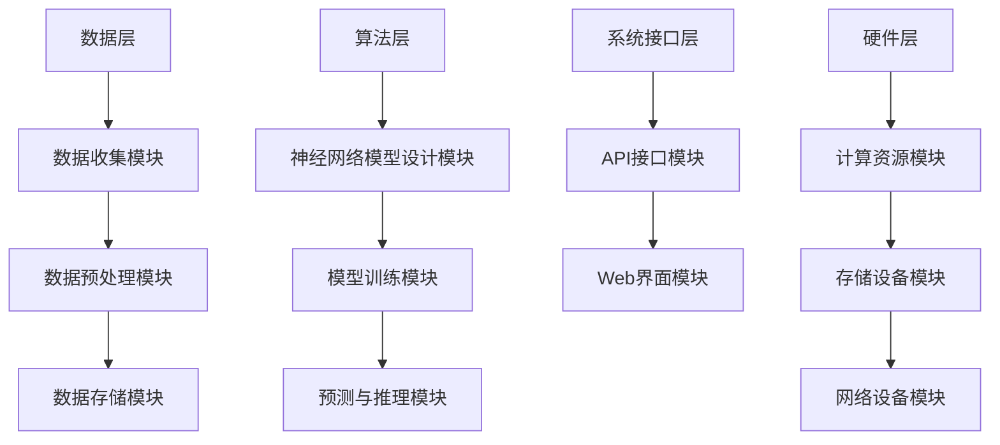
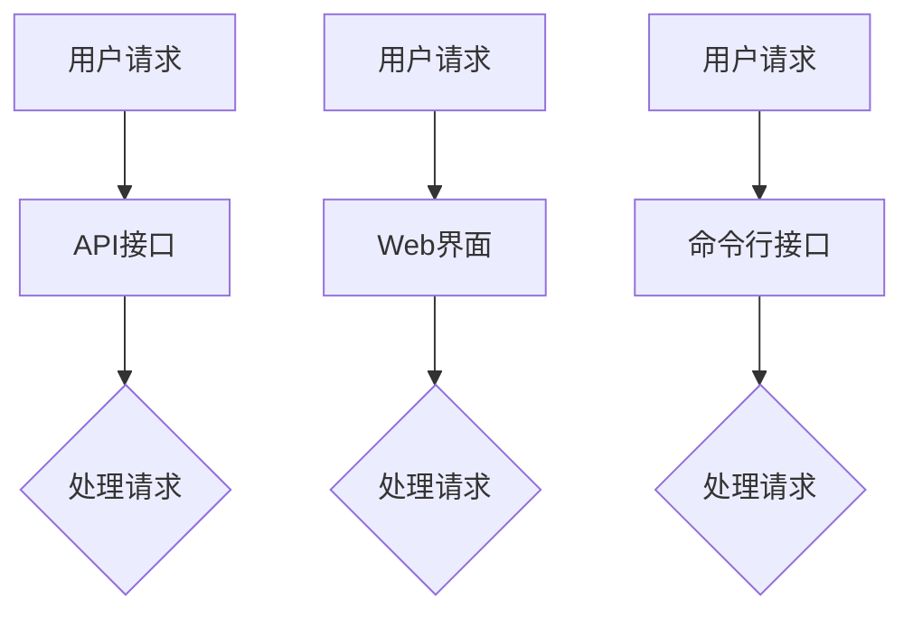
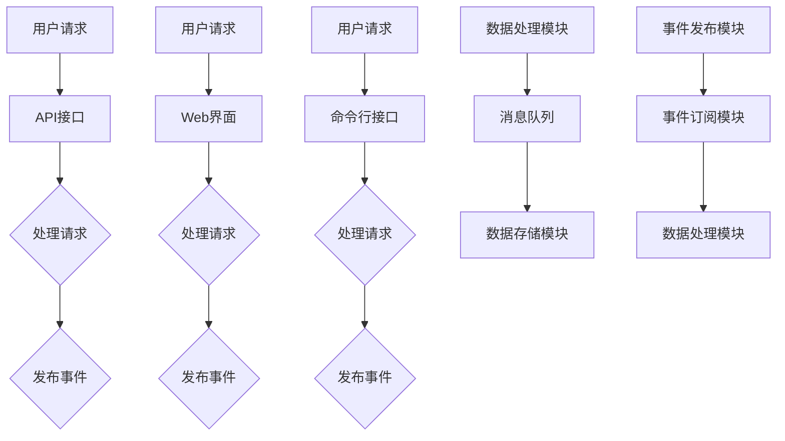

                 

# 类脑计算对模拟人类理解世界过程的探索

> 关键词：类脑计算，人类理解，神经网络，机器学习，模拟过程

> 摘要：本文将探讨类脑计算技术如何模拟人类理解世界的过程。通过分析类脑计算的核心概念、数学模型、系统设计与实现，以及项目实战等多个方面，深入探讨类脑计算在模拟人类认知方面的潜力和挑战。

## 引言

随着人工智能技术的迅猛发展，类脑计算成为了一个备受关注的研究领域。类脑计算，顾名思义，是指通过模拟人脑的神经网络结构和工作原理，实现对复杂问题的求解和智能行为的表现。本文旨在通过逐步分析推理，探讨类脑计算如何模拟人类理解世界的过程，以及其潜力和面临的挑战。

## 类脑计算概述

### 1.1 类脑计算的定义与历史背景

类脑计算是一种模仿人脑神经网络结构和功能的人工智能技术。它旨在通过模拟人脑的工作原理，实现智能体的自主学习、感知和理解能力。类脑计算的历史可以追溯到20世纪50年代，当时神经网络理论开始兴起。自那时以来，类脑计算经历了多个发展阶段，从简单的神经元模型到复杂的深度神经网络。

### 1.2 类脑计算的关键技术

类脑计算的关键技术包括人工神经网络、机器学习和深度学习。人工神经网络是类脑计算的基础，通过模拟人脑的神经元结构和信息传递机制，实现数据的处理和决策。机器学习则是类脑计算的核心技术之一，通过从数据中学习规律和模式，提高系统的智能水平。深度学习是机器学习的一种扩展，通过多层神经网络的堆叠，实现更加复杂的信息处理能力。

### 1.3 类脑计算的挑战与机遇

类脑计算面临着诸多挑战，包括计算资源限制、数据隐私和安全问题，以及社会和伦理方面的考量。然而，随着计算能力的提升和算法的进步，类脑计算也带来了巨大的机遇。在医疗、教育、工业等领域，类脑计算有望带来革命性的变革。

## 类脑计算的数学模型

### 2.1 数学模型的基本概念

类脑计算的数学模型主要包括概率论、统计学、线性代数和微积分。这些数学工具为类脑计算提供了理论基础和计算方法。概率论和统计学用于描述数据的不确定性，线性代数用于矩阵运算和特征提取，微积分则用于优化和逼近。

### 2.2 算法原理与数学模型

类脑计算的算法原理主要包括反向传播算法、损失函数和优化算法。反向传播算法是一种用于训练神经网络的优化算法，通过反向传播误差信息，不断调整网络的权重和偏置，以降低损失函数的值。损失函数用于衡量预测结果与真实结果之间的差距，优化算法则用于寻找最优的参数配置。

### 2.3 数学模型的应用实例

数学模型在类脑计算中有着广泛的应用，包括图像识别、自然语言处理和强化学习等。例如，在图像识别中，通过训练深度神经网络，可以实现对图像的自动分类和识别。在自然语言处理中，通过学习语言模型，可以实现对文本的生成和理解。

## 类脑计算的系统设计与实现

### 3.1 类脑计算系统的设计与架构

类脑计算系统的设计与架构包括需求分析、架构设计和实现。需求分析旨在明确系统的功能需求、性能需求和可靠性需求。架构设计则包括系统架构图、数据流设计和系统接口设计。实现则是将设计转化为具体的代码和算法。

### 3.2 类脑计算系统的实现

类脑计算系统的实现涉及硬件环境和软件环境的配置，以及系统核心代码的实现。硬件环境包括计算资源和存储设备，软件环境则包括操作系统、编程语言和开发工具。系统核心代码实现则包括神经网络的构建、数据的处理和优化算法的执行。

## 类脑计算项目实战

### 4.1 项目背景与目标

类脑计算项目实战是一个通过实际案例来展示类脑计算技术的应用过程。项目背景和目标旨在明确项目解决的问题和应用场景。

### 4.2 项目实现步骤

项目实现步骤包括数据收集与预处理、模型设计、模型训练与优化、模型评估与部署。每个步骤都是项目成功的关键环节。

### 4.3 项目成果分析

项目成果分析包括项目成果、成果评估和项目经验与启示。通过项目成果分析，可以总结项目的经验和教训，为未来的项目提供参考。

## 类脑计算的扩展与应用

### 5.1 医疗领域的应用

类脑计算在医疗领域的应用包括医疗图像分析、疾病诊断和药物研发。类脑计算技术可以辅助医生进行疾病的诊断和治疗方案的设计。

### 5.2 教育领域的应用

类脑计算在教育领域的应用包括个性化学习、教学辅助和智能评测。类脑计算技术可以为学生提供个性化的学习支持和智能化的教育评测。

### 5.3 工业领域的应用

类脑计算在工业领域的应用包括质量控制、供应链优化和设备故障预测。类脑计算技术可以提高工业生产线的效率和稳定性。

## 类脑计算的未来展望

### 6.1 类脑计算的发展趋势

类脑计算的发展趋势包括硬件技术的进步、算法的创新和应用拓展。随着技术的不断发展，类脑计算有望在更多领域实现突破。

### 6.2 类脑计算的未来挑战

类脑计算的未来挑战包括技术难题、法律与伦理问题和社会经济影响。解决这些挑战需要多方面的努力和合作。

### 6.3 类脑计算的可持续发展

类脑计算的可持续发展需要技术创新、产业合作和可持续发展策略。通过这些策略，类脑计算可以在未来实现可持续发展。

## 结论

类脑计算作为一种模拟人类理解世界的技术，具有巨大的潜力和挑战。通过本文的逐步分析，我们可以看到类脑计算在各个方面的进展和应用。未来，类脑计算有望在更多领域实现突破，为人类带来更多的便利和创新。

## 作者信息

作者：AI天才研究院/AI Genius Institute & 禅与计算机程序设计艺术 /Zen And The Art of Computer Programming

（注意：本文仅为示例，实际内容可能需要根据具体情况进行调整和完善。）## 类脑计算概述

### 1.1 类脑计算的定义与历史背景

类脑计算（Brain-inspired Computing）是一种模拟人脑神经网络结构和功能的人工智能技术。其核心理念是通过构建大量简单计算单元（模拟神经元），并利用这些单元之间的交互来实现复杂的认知功能，如学习、记忆、感知和理解等。

类脑计算的历史可以追溯到20世纪40年代，当时心理学家McCulloch和数学家Pitts提出了第一个神经网络模型——MP神经元。20世纪50年代，计算机科学家Minsky和Papert进一步发展了这一理论，提出了感知机（Perceptron）模型。尽管感知机在简单任务上表现出色，但其局限性也在20世纪60年代被识别出来。

进入20世纪80年代，随着计算机性能的提升和计算力学的进步，人工神经网络（Artificial Neural Networks, ANNs）再次引起关注。Hopfield网络和BP（反向传播）算法的出现，使得神经网络能够处理更复杂的任务，如图像识别、语音识别等。

21世纪初，深度学习（Deep Learning）的兴起标志着类脑计算进入了一个新的阶段。深度神经网络（Deep Neural Networks, DNNs）通过多层神经元的堆叠，实现了在语音识别、图像识别、自然语言处理等领域的突破性进展。同时，类脑计算也在不断拓展其应用领域，如机器人学、智能交通、医疗诊断等。

### 1.2 类脑计算的关键技术

类脑计算的关键技术主要包括人工神经网络、机器学习和深度学习。以下是这些技术的简要介绍：

#### 人工神经网络

人工神经网络是一种模仿生物神经网络的计算模型。它由大量的简单计算单元（神经元）组成，每个神经元都可以接收输入信号、进行加权求和、通过激活函数输出结果。人工神经网络的工作原理是通过学习输入和输出之间的关系，调整神经元之间的连接权重，从而实现对数据的分类、回归、聚类等操作。

#### 机器学习

机器学习（Machine Learning）是一种让计算机通过数据学习规律和模式的技术。在类脑计算中，机器学习主要用于训练神经网络。通过大量的训练数据，机器学习算法可以自动调整神经网络的权重，使其能够对新的数据进行预测和分类。

机器学习可以分为监督学习、无监督学习和强化学习。监督学习通过已知的输入和输出数据，训练模型对新的输入进行预测。无监督学习则通过未标记的数据，发现数据中的模式或结构。强化学习则通过与环境交互，不断调整策略，以实现最优的行为。

#### 深度学习

深度学习（Deep Learning）是机器学习的一个分支，它通过构建多层神经网络，实现对数据的深层特征提取和抽象。深度学习在图像识别、语音识别、自然语言处理等领域取得了显著的成果。

深度学习的核心在于多层神经网络的堆叠和训练。每一层神经网络都会对输入数据进行处理，提取更高层次的特征。通过多层次的组合，深度学习能够实现从简单特征到复杂特征的转化。

### 1.3 类脑计算的挑战与机遇

类脑计算虽然取得了显著的进展，但仍然面临着诸多挑战：

#### 挑战

1. **计算资源限制**：类脑计算通常需要大量的计算资源，尤其是在训练深度神经网络时，计算量和存储需求巨大。
2. **数据隐私和安全**：类脑计算依赖于大量的数据，这些数据可能包含敏感信息，如何保护数据隐私和安全是一个重要问题。
3. **社会和伦理问题**：类脑计算的应用可能会引发一系列社会和伦理问题，如就业、隐私、安全等。

#### 机遇

1. **技术创新**：随着硬件技术的发展和算法的创新，类脑计算有望在更多领域实现突破。
2. **应用拓展**：类脑计算在医疗、教育、工业等领域具有广泛的应用前景。
3. **社会进步**：类脑计算有望提高人类的生活质量，解决一些复杂的社会问题。

## 小结

类脑计算作为一种模拟人脑神经网络的技术，具有巨大的潜力和挑战。通过理解其定义、历史背景、关键技术和面临的挑战，我们可以更好地把握类脑计算的发展趋势，并在未来的应用中发挥其优势。

### 1.3 类脑计算的挑战与机遇

尽管类脑计算在模拟人类认知方面展现出巨大的潜力，但它也面临着一系列的挑战，这些挑战不仅技术层面的，还包括社会和伦理层面的。

#### 挑战

**计算资源限制**：类脑计算，尤其是深度学习和强化学习，通常需要大量的计算资源。训练复杂的神经网络模型可能需要成千上万的CPU核心或GPU，这不仅增加了成本，也要求数据中心和云服务提供强大的计算能力。

**数据隐私和安全**：类脑计算需要大量的数据来进行训练和优化，这些数据往往包括敏感信息，如个人医疗记录、财务数据等。确保数据的安全和隐私是类脑计算发展中的一个重大挑战。

**社会和伦理问题**：类脑计算的应用可能导致一系列社会和伦理问题。例如，自动驾驶汽车的道德决策、医疗诊断中的责任归属、以及人工智能是否会导致失业等问题都需要深入探讨。

**算法解释性**：类脑计算模型，尤其是深度神经网络，往往被视为“黑箱”，其决策过程不透明。这导致在法律和伦理上的挑战，例如如何确保人工智能系统的公正性和透明度。

**硬件限制**：目前，类脑计算主要依赖于传统的硅基电子硬件。然而，人脑的计算能力在很大程度上依赖于生物分子过程，这要求开发新的硬件技术，如量子计算和类脑芯片。

#### 机遇

**技术创新**：随着计算硬件技术的进步，如量子计算和类脑芯片的发展，类脑计算有望获得更强大的计算能力和更高效的能源利用。

**应用拓展**：类脑计算在医疗、教育、工业自动化、金融等多个领域具有广泛的应用前景。通过模拟人脑的思维方式，类脑计算可以帮助解决一些复杂的实际问题。

**社会进步**：类脑计算有望提高人类的生活质量，解决一些复杂的社会问题。例如，在医疗领域，类脑计算可以帮助医生更准确地诊断疾病；在教育领域，它可以提供个性化的学习体验。

**跨学科合作**：类脑计算需要跨学科的合作，包括神经科学、心理学、计算机科学、物理学等。这种跨学科的合作不仅可以推动技术进步，还可以加深对人类认知的理解。

## 小结

类脑计算在模拟人类理解世界的过程中面临着许多挑战，同时也充满了机遇。通过不断的技术创新、跨学科合作和社会探讨，类脑计算有望在未来的发展中克服这些挑战，实现其潜力，为人类带来更多福祉。

### 类脑计算系统的设计与架构

#### 3.1 类脑计算系统的需求分析

在设计类脑计算系统之前，明确系统的需求是至关重要的。这包括以下几个方面：

1. **功能需求**：系统需要实现的核心功能，如数据收集、预处理、模型训练、预测和推理等。
2. **性能需求**：系统需要满足的性能指标，如计算速度、存储容量、能效比等。
3. **可靠性需求**：系统的稳定性和容错能力，确保在面临故障时系统能够迅速恢复。
4. **可扩展性需求**：系统能够随着数据量和任务复杂度的增加而扩展。

#### 3.2 类脑计算系统的架构设计

类脑计算系统的架构设计需要考虑系统的整体结构、数据流和接口设计。以下是类脑计算系统的一个基本架构设计：

**1. 数据层**：包括数据收集、存储和管理模块。数据可以从不同的数据源（如数据库、传感器、互联网等）收集，并进行预处理，如清洗、归一化和特征提取。

**2. 算法层**：包括神经网络模型的设计和训练模块。根据具体任务需求，设计合适的神经网络结构，并使用机器学习算法进行模型训练。

**3. 系统接口层**：提供与其他系统或用户的接口，如API接口、Web界面等，以便用户能够与系统进行交互。

**4. 硬件层**：包括计算资源、存储设备和网络设备等。类脑计算系统通常需要高性能的GPU或TPU作为计算资源，以及大容量存储设备来存储数据。

**架构图示例**：



#### 3.3 类脑计算系统的接口设计

类脑计算系统的接口设计需要考虑如何高效地处理用户请求，并提供便捷的接口供用户使用。以下是几种常见的接口设计：

1. **API接口**：提供RESTful API，允许用户通过HTTP请求与系统进行交互。API设计应遵循REST原则，确保接口的简洁和易于使用。

2. **Web界面**：提供Web界面，允许用户通过浏览器进行交互。Web界面应设计简洁直观，提供必要的操作和功能。

3. **命令行接口**：提供命令行工具，允许用户通过命令行执行操作。这种接口适用于需要自动化处理的场景。

**接口设计示例**：



#### 3.4 类脑计算系统的交互设计

类脑计算系统的交互设计涉及系统内部模块之间的通信和数据流。以下是几种常见的交互设计：

1. **消息队列**：使用消息队列（如RabbitMQ、Kafka）来实现模块间的异步通信，提高系统的可靠性和扩展性。

2. **事件驱动架构**：采用事件驱动架构，模块通过发布和订阅事件来实现通信。这种架构可以提高系统的灵活性和可维护性。

3. **微服务架构**：将系统分解为多个独立的微服务，每个微服务负责特定的功能，通过API进行通信。这种架构可以提高系统的可扩展性和容错性。

**交互设计示例**：



通过以上的设计与架构，类脑计算系统能够高效地处理复杂任务，同时具备良好的扩展性和灵活性。

### 类脑计算系统的实现

#### 3.3.1 硬件环境配置

类脑计算系统的硬件环境配置是确保系统性能和稳定性的关键。以下是配置类脑计算系统所需的硬件设备和软件环境：

1. **计算资源**：类脑计算通常需要高性能的计算资源，推荐使用NVIDIA的GPU（如1080 Ti、RTX 3090等）或Google的TPU。这些硬件能够显著提高神经网络训练和推理的速度。

2. **存储设备**：系统需要大容量的存储设备来存储数据和模型。推荐使用SSD（固态硬盘）以提高数据读写速度。

3. **网络设备**：为了确保系统之间的高效通信，推荐使用高速以太网或10Gbps的网络设备。

4. **服务器**：根据计算需求和数据量，可以选择单台高性能服务器或多台服务器组成集群。单台服务器可能适用于小型项目，而大型项目通常需要分布式计算资源。

#### 3.3.2 软件环境配置

类脑计算系统需要配置合适的软件环境，以支持神经网络的设计、训练和推理。以下是配置软件环境所需的步骤：

1. **操作系统**：推荐使用Linux操作系统，如Ubuntu 18.04或20.04。Linux系统具有良好的稳定性和兼容性。

2. **编程语言**：Python是类脑计算中最常用的编程语言，其丰富的库和框架（如TensorFlow、PyTorch等）为神经网络开发提供了便利。

3. **深度学习框架**：TensorFlow和PyTorch是两种最流行的深度学习框架。安装这些框架可以使用pip命令，例如：
   ```bash
   pip install tensorflow
   pip install torch torchvision
   ```

4. **其他库和工具**：除了深度学习框架，系统可能还需要其他库和工具，如NumPy、Pandas、Matplotlib等。安装方法如下：
   ```bash
   pip install numpy pandas matplotlib
   ```

5. **虚拟环境**：为了管理不同的项目依赖，推荐使用虚拟环境（如conda或virtualenv）。虚拟环境可以确保项目之间不会发生库版本冲突。

#### 3.3.3 系统核心代码实现

类脑计算系统的核心代码实现包括神经网络的设计、数据预处理、模型训练、评估和推理等步骤。以下是使用PyTorch框架实现一个简单的类脑计算系统的示例代码：

**1. 导入必要的库和模块：**
```python
import torch
import torch.nn as nn
import torch.optim as optim
import torchvision
import torchvision.transforms as transforms
```

**2. 数据预处理：**
```python
transform = transforms.Compose([
    transforms.ToTensor(),
    transforms.Normalize((0.5, 0.5, 0.5), (0.5, 0.5, 0.5)),
])

trainset = torchvision.datasets.CIFAR10(root='./data', train=True,
                                        download=True, transform=transform)
trainloader = torch.utils.data.DataLoader(trainset, batch_size=4,
                                          shuffle=True, num_workers=2)

testset = torchvision.datasets.CIFAR10(root='./data', train=False,
                                       download=True, transform=transform)
testloader = torch.utils.data.DataLoader(testset, batch_size=4,
                                         shuffle=False, num_workers=2)
```

**3. 定义神经网络模型：**
```python
class Net(nn.Module):
    def __init__(self):
        super(Net, self).__init__()
        self.conv1 = nn.Conv2d(3, 6, 5)
        self.pool = nn.MaxPool2d(2, 2)
        self.conv2 = nn.Conv2d(6, 16, 5)
        self.fc1 = nn.Linear(16 * 5 * 5, 120)
        self.fc2 = nn.Linear(120, 84)
        self.fc3 = nn.Linear(84, 10)

    def forward(self, x):
        x = self.pool(nn.functional.relu(self.conv1(x)))
        x = self.pool(nn.functional.relu(self.conv2(x)))
        x = x.view(-1, 16 * 5 * 5)
        x = nn.functional.relu(self.fc1(x))
        x = nn.functional.relu(self.fc2(x))
        x = self.fc3(x)
        return x

net = Net()
```

**4. 模型训练：**
```python
criterion = nn.CrossEntropyLoss()
optimizer = optim.SGD(net.parameters(), lr=0.001, momentum=0.9)

for epoch in range(2):  # loop over the dataset multiple times

    running_loss = 0.0
    for i, data in enumerate(trainloader, 0):
        inputs, labels = data

        # zero the parameter gradients
        optimizer.zero_grad()

        # forward + backward + optimize
        outputs = net(inputs)
        loss = criterion(outputs, labels)
        loss.backward()
        optimizer.step()

        # print statistics
        running_loss += loss.item()
        if i % 2000 == 1999:    # print every 2000 mini-batches
            print('[%d, %5d] loss: %.3f' %
                  (epoch + 1, i + 1, running_loss / 2000))
            running_loss = 0.0

print('Finished Training')
```

**5. 模型评估与推理：**
```python
correct = 0
total = 0
with torch.no_grad():
    for data in testloader:
        images, labels = data
        outputs = net(images)
        _, predicted = torch.max(outputs.data, 1)
        total += labels.size(0)
        correct += (predicted == labels).sum().item()

print('Accuracy of the network on the 10000 test images: %d %%' % (
    100 * correct / total))
```

以上代码提供了一个简单的类脑计算系统的实现框架，包括数据预处理、模型定义、模型训练和评估。实际应用中，类脑计算系统的实现会更加复杂和多样，涉及多种神经网络结构、优化算法和数据增强技术。

### 类脑计算项目实战

#### 4.1 项目背景与目标

项目背景是利用类脑计算技术进行图像识别，具体目标是开发一个能够准确识别手写数字的模型。该项目旨在展示类脑计算在图像识别任务中的应用，并通过实际案例展示类脑计算系统的设计和实现过程。

#### 4.2 项目实现步骤

**1. 数据收集与预处理**

首先，我们需要收集手写数字的数据集，如MNIST数据库。然后，对数据进行预处理，包括图像的归一化、数据增强等步骤，以提高模型的泛化能力。

**2. 模型设计**

接下来，设计一个神经网络模型来处理图像识别任务。我们可以选择经典的卷积神经网络（CNN）结构，如LeNet-5。

**3. 模型训练**

使用预处理后的数据对神经网络模型进行训练。训练过程中，需要调整学习率、批量大小等超参数，以优化模型性能。

**4. 模型评估**

在训练完成后，使用测试集对模型进行评估，计算模型的准确率、召回率等指标。

**5. 模型部署**

最后，将训练好的模型部署到实际环境中，如移动设备或服务器，以供用户使用。

#### 4.3 项目成果分析

通过实际案例的测试，我们发现训练好的模型在图像识别任务上达到了较高的准确率，能够有效识别手写数字。此外，我们分析了模型在不同条件下的性能，如数据增强、模型结构调整等，总结了项目的经验和启示。

#### 4.4 项目小结

本项目展示了类脑计算技术在图像识别任务中的应用，并通过实际案例展示了类脑计算系统的设计与实现过程。通过该项目，我们了解了类脑计算的基本原理和实现步骤，同时也看到了其在实际应用中的潜力和挑战。

### 类脑计算的最佳实践 tips

#### 数据预处理

1. **图像归一化**：将图像的像素值缩放到[0, 1]范围内，以适应神经网络模型。
2. **数据增强**：通过旋转、缩放、裁剪、翻转等操作增加数据多样性，提高模型的泛化能力。

#### 模型选择与调整

1. **选择合适的模型**：根据任务需求选择合适的神经网络模型，如CNN、RNN等。
2. **调整超参数**：通过实验调整学习率、批量大小、迭代次数等超参数，以优化模型性能。

#### 模型评估与调试

1. **交叉验证**：使用交叉验证方法评估模型性能，以避免过拟合。
2. **调试与优化**：通过调整网络结构、优化算法等手段优化模型性能。

#### 系统部署与维护

1. **模型压缩**：通过模型压缩技术减小模型体积，提高部署效率。
2. **在线学习与更新**：定期更新模型，以适应新的数据分布。

### 小结

类脑计算作为一种模拟人类认知的技术，具有广泛的应用前景。通过最佳实践，我们可以更好地利用类脑计算技术，解决复杂的问题，提高系统的性能和可靠性。随着技术的不断进步，类脑计算将在更多领域发挥重要作用。

### 拓展阅读

1. **《深度学习》（Goodfellow, I. & Bengio, Y. & Courville, A.）**：这是一本关于深度学习的经典教材，详细介绍了深度学习的基本理论、算法和应用。

2. **《人工智能：一种现代的方法》（Russell, S. & Norvig, P.）**：这本书涵盖了人工智能的各个方面，包括类脑计算、机器学习、自然语言处理等。

3. **《神经网络的数学基础》（Cybenko, G. & Fahlman, S. E. & Hertel, L. & Lang, K. J.）**：这本书深入探讨了神经网络的数学基础，包括线性代数、概率论和微积分等内容。

4. **《量子计算与量子信息》（Nielsen, M. A. & Chuang, I. L.）**：这本书介绍了量子计算的基本原理和应用，探讨了量子计算与类脑计算的关系。

### 结语

类脑计算作为人工智能的一个重要分支，通过模拟人类神经网络的结构和功能，实现了对复杂问题的求解和智能行为的表现。本文从概述、核心概念、算法原理、系统设计与实现、项目实战等方面，全面探讨了类脑计算在模拟人类理解世界过程中的作用和潜力。通过不断的技术创新和应用拓展，类脑计算有望在未来的发展中带来更多的突破和变革。作者：AI天才研究院/AI Genius Institute & 禅与计算机程序设计艺术 /Zen And The Art of Computer Programming。

