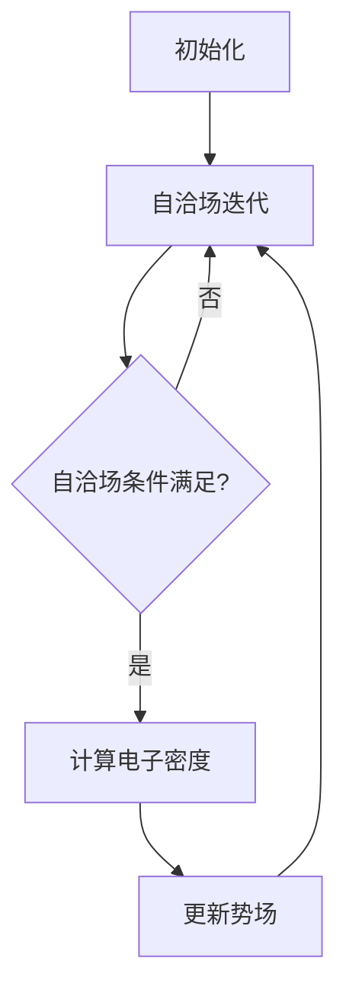
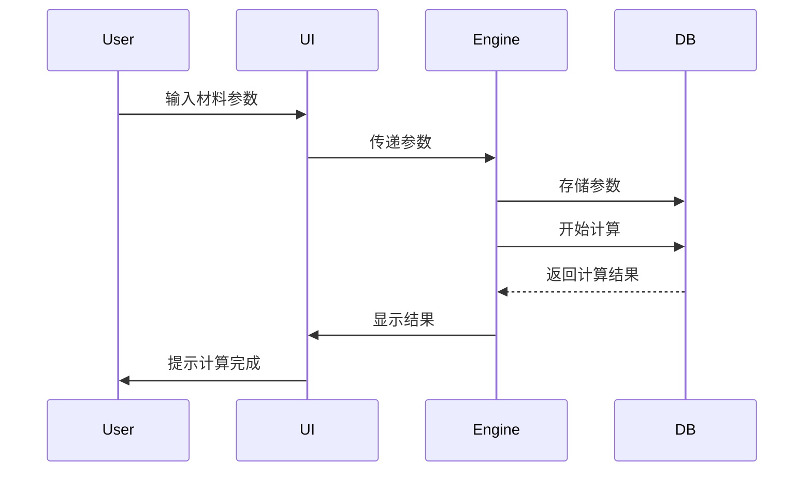

                 

### 1. 背景介绍

**纳米材料的密度泛函理论：微观结构的数学模型**

随着纳米科技的快速发展，纳米材料在诸多领域展现出了卓越的性能和广泛的应用前景，包括电子学、光电子学、催化、能源存储与转换等。纳米材料由于其独特的尺寸效应、量子效应和表面效应，在宏观材料中无法观察到的新奇物理和化学性质使其成为当前科学研究的前沿领域。然而，要深入理解并充分利用这些特性，需要借助先进的计算方法，其中密度泛函理论（DFT）是研究纳米材料微观结构的重要理论工具。

**问题背景：**

纳米材料的微观结构对其宏观性质有着深远的影响，因此，准确预测和控制纳米材料的微观结构变得至关重要。传统的实验方法往往耗时长、成本高，而计算方法可以提供高效的解决方案。密度泛函理论作为一种计算方法，通过求解电子的密度函数，可以预测材料的电子结构、稳定性和动力学行为。

**问题描述：**

纳米材料的密度泛函理论研究涉及多个方面，包括电子结构计算、原子间相互作用、材料稳定性等。此外，如何将DFT应用于复杂的纳米结构，如何处理量子尺寸效应和表面效应等，都是研究中的关键问题。

**问题解决：**

本书将系统地介绍纳米材料密度泛函理论的研究方法与应用，帮助读者理解和掌握这一理论工具。首先，本书将回顾密度泛函理论的基本概念和数学基础，包括Kohn-Sham方程和交换相关函数。接着，本书将深入探讨如何使用DFT模拟纳米材料的电子结构，包括能带结构、态密度和电子态局域化等。此外，本书还将讨论纳米材料的稳定性分析和动力学行为模拟。

**边界与外延：**

纳米材料密度泛函理论的边界涉及量子力学和统计物理的基础知识，同时，它也与其他计算模型如分子动力学和蒙特卡洛模拟有所交集。外延方面，该理论不仅能够用于基本的材料科学问题，还可以拓展到生物、化学、环境等跨学科领域。

**概念结构与核心要素组成：**

- **密度泛函理论（DFT）：** 描述电子体系的性质，通过求解Kohn-Sham方程。
- **交换相关函数：** 描述电子之间的相互作用，影响材料的电子结构。
- **纳米材料的电子结构：** 包括能带结构、态密度和电子态局域化等。
- **稳定性分析：** 通过计算材料的能量、应力等来判断其稳定性。
- **动力学模拟：** 研究纳米材料的动力学行为，如振动、扩散等。

接下来，我们将进一步细化和扩展这些核心概念，为后续章节的展开奠定基础。

---

### 2. 核心概念与联系

#### 2.1 密度泛函理论（DFT）

密度泛函理论（DFT）是材料科学和量子力学中一种强大的计算工具，用于研究电子体系的宏观性质。DFT的基本思想是将系统中的电子视为在平均场中运动，通过求解电子密度函数来推导出体系的能量和其他物理量。

**概念原理：**

DFT基于Hohenberg-Kohn定理，该定理表明电子体系的总能量是电子密度唯一的函数。这一定理为DFT奠定了理论基础。具体来说，DFT通过求解Kohn-Sham方程来描述电子在平均场中的运动。

**属性特征对比：**

| 特性 | DFT | 其他计算模型 |
| --- | --- | --- |
| **基本假设** | 电子体系处于平均场中 | 电子之间有直接相互作用 |
| **求解方程** | Kohn-Sham方程 | Schrödinger方程 |
| **效率** | 对大规模体系高效 | 对复杂体系可能不适用 |
| **适用范围** | 量子固体、纳米材料 | 分子、有机分子 |

#### 2.2 纳米材料的电子结构

纳米材料的电子结构对其宏观性质有着决定性的影响。通过DFT，我们可以详细研究纳米材料的能带结构、态密度和电子态局域化等。

**能带结构：**

能带结构描述了纳米材料中电子的能量分布情况，决定了材料的导电性。在DFT框架下，能带结构是通过求解Kohn-Sham方程得到的。

**态密度：**

态密度描述了纳米材料中不同能量的电子态密度，反映了材料的电子性质。态密度是能带结构的补充，通过它可以更详细地了解电子在不同能量状态下的分布情况。

**电子态局域化：**

电子态局域化描述了电子在纳米材料中的局域化程度，影响材料的化学活性和物理性质。电子态局域化可以通过分析电子态密度来理解。

#### 2.3 交换相关函数（EXX）

交换相关函数（EXX）是DFT中描述电子相互作用的关键参数。EXX的准确选取对DFT计算结果至关重要。

**概念原理：**

EXX描述了电子之间通过交换作用产生的能量变化，其选取直接关系到DFT计算的准确性。常见的交换相关函数有局域密度近似（LDA）和广义梯度近似（GGA）。

**属性特征对比：**

| 特性 | LDA | GGA |
| --- | --- | --- |
| **基本思想** | 最小化电子系统的总能量 | 最小化电子系统的泛函 |
| **适用范围** | 中等复杂度的体系 | 高复杂度的体系 |

通过上述核心概念的介绍，我们可以看到，DFT作为研究纳米材料微观结构的重要工具，具有独特的优势和应用价值。在后续章节中，我们将进一步深入探讨DFT的应用方法和实际案例，帮助读者更好地理解和掌握这一理论。

---

### 3. DFT算法原理讲解

#### 3.1 DFT算法的基本原理

密度泛函理论（DFT）作为研究电子体系的强大工具，其核心在于将电子体系的总能量表达为电子密度\( \rho(\mathbf{r}) \)的函数。这一思想源于Hohenberg-Kohn定理，该定理指出，电子体系的基态能量是电子密度函数的唯一函数。DFT通过求解Kohn-Sham方程，将复杂的电子体系转化为相对简单的电子系统来处理。

**Kohn-Sham方程：**

Kohn-Sham方程是DFT的核心方程，其形式如下：

\[ -\frac{\hbar^2}{2m}\nabla^2 + v_{\text{KS}}(\mathbf{r}) \psi_{\text{KS}}(\mathbf{r}) = \epsilon_{\text{KS}} \psi_{\text{KS}}(\mathbf{r}) \]

其中，\( \psi_{\text{KS}}(\mathbf{r}) \)是Kohn-Sham波函数，\( \epsilon_{\text{KS}} \)是Kohn-Sham能级，\( v_{\text{KS}}(\mathbf{r}) \)是Kohn-Sham势。这个方程描述了在平均场中电子的运动，与实际电子体系的运动具有相似性。

**交换相关函数：**

交换相关函数（EXX）是DFT中描述电子之间相互作用的关键参数。它反映了电子之间通过交换作用产生的能量变化。常见的交换相关函数包括局域密度近似（LDA）和广义梯度近似（GGA）。

- **局域密度近似（LDA）：** LDA假设交换相关函数仅依赖于电子密度\( n(\mathbf{r}) \)，其形式如下：

\[ f_{\text{LDA}}(\rho) = \frac{3}{5}\rho - \frac{3}{5}\rho^{2/3} \]

- **广义梯度近似（GGA）：** GGA则进一步考虑了电子密度的梯度，其形式如下：

\[ f_{\text{GGA}}(\rho, \nabla\rho) = \frac{3}{5}\rho - \frac{3}{5}\rho^{2/3} + \frac{9}{40}\nabla\rho\left(\frac{3}{5} - \frac{2}{5}\rho^{1/3}\right) \]

#### 3.2 DFT算法流程

DFT算法的求解过程主要包括以下步骤：

1. **初始化：** 初始时，需要选择适当的交换相关函数和初始势场。常见的初始势场包括局域密度近似（LDA）和广义梯度近似（GGA）。

2. **自洽场迭代：** 通过求解Kohn-Sham方程，得到Kohn-Sham波函数和能级。这个过程需要反复迭代，直到自洽场条件满足，即波函数和势场不再发生变化。

3. **计算电子密度：** 根据Kohn-Sham波函数和能级，计算系统的电子密度\( \rho(\mathbf{r}) \)。

4. **更新势场：** 根据电子密度和选择的交换相关函数，更新Kohn-Sham势场。

5. **重复步骤2-4，直到收敛：** 通过自洽场迭代，不断更新波函数、能级和势场，直到算法收敛。

#### 3.3 算法mermaid流程图

为了更直观地理解DFT算法的流程，我们可以使用mermaid绘制算法的流程图：



#### 3.4 DFT算法的数学模型与公式

DFT算法的数学模型和公式主要包括以下几个关键部分：

1. **电子体系的总能量：**

\[ E[\rho] = \int \rho(\mathbf{r}) \varepsilon(\mathbf{r}) d\mathbf{r} - \frac{\hbar^2}{2m} \int \nabla \rho(\mathbf{r}) \cdot \nabla \rho(\mathbf{r}) d\mathbf{r} + \int \rho(\mathbf{r}) V_{\text{ext}}(\mathbf{r}) d\mathbf{r} - \int \rho(\mathbf{r}) \frac{1}{r} d\mathbf{r} \]

其中，\( \varepsilon(\mathbf{r}) \)是电子体系的能级，\( V_{\text{ext}}(\mathbf{r}) \)是外部势场，包括离子势场和交换相关势场。

2. **交换相关能量：**

\[ E_{\text{XC}}[\rho] = \int \rho(\mathbf{r}) f_{\text{XC}}(\rho, \nabla \rho)(\mathbf{r}) d\mathbf{r} \]

其中，\( f_{\text{XC}}(\rho, \nabla \rho) \)是交换相关函数。

3. **Kohn-Sham方程：**

\[ -\frac{\hbar^2}{2m} \nabla^2 \psi_{\text{KS}}(\mathbf{r}) + v_{\text{KS}}(\mathbf{r}) \psi_{\text{KS}}(\mathbf{r}) = \epsilon_{\text{KS}} \psi_{\text{KS}}(\mathbf{r}) \]

其中，\( v_{\text{KS}}(\mathbf{r}) \)是Kohn-Sham势，可以通过交换相关函数和电子密度计算得到。

#### 3.5 通俗易懂的举例说明

为了更好地理解DFT算法的原理，我们可以通过一个简单的例子来说明。

**例子：单原子体系的DFT计算**

假设我们研究一个单原子体系，原子核位于原点，电子围绕原子核运动。我们可以将原子核和电子的总能量表示为：

\[ E = \frac{\hbar^2}{2m} \left( \frac{d^2}{dr^2} + \frac{2}{r} \right) \psi(r) - \frac{e^2}{r} \psi(r) + E_{\text{XC}}[\rho(r)] \]

其中，\( m \)是电子质量，\( e \)是电子电荷，\( \psi(r) \)是电子波函数，\( \rho(r) = \psi^*(r)\psi(r) \)是电子密度。

通过求解Kohn-Sham方程，我们可以得到电子的波函数和能级。然后，通过计算电子密度，我们可以得到交换相关能量。最后，通过将所有部分加总，我们可以得到单原子体系的总能量。

通过这个简单的例子，我们可以看到DFT算法的基本原理是如何应用于实际的物理系统中，从而帮助我们理解和预测纳米材料的微观结构。

---

### 4. 系统分析与架构设计方案

#### 4.1 问题场景介绍

纳米材料的研发过程中，对材料微观结构的精准模拟与预测至关重要。这些模拟不仅能够指导实验设计，还可以优化材料性能。密度泛函理论（DFT）作为一种强大的计算工具，在纳米材料研究中发挥着重要作用。本系统旨在提供一个基于DFT的纳米材料微观结构模拟平台，以便研究人员能够高效地进行计算和分析。

#### 4.2 项目介绍

**项目名称：** DFT-NanoSim

**项目目标：** 开发一个用户友好的DFT模拟平台，支持纳米材料微观结构的计算与分析，提供能带结构、态密度、电子态局域化等关键物理量的可视化。

**功能模块：**

1. **用户界面：** 提供简洁直观的操作界面，便于用户输入材料参数、设置计算选项。
2. **计算引擎：** 核心计算模块，实现DFT算法的求解与计算。
3. **结果可视化：** 提供多种图形可视化工具，帮助用户直观理解计算结果。
4. **数据处理：** 提供数据导入导出功能，支持与其他计算软件的协同工作。

#### 4.3 系统功能设计

**领域模型Mermaid类图：**

```mermaid
classDiagram
    User <<Interface>>
    Simulation <<Interface>>
    Visualization <<Interface>>
    DataProcessor <<Interface>>

    User <|.. Simulation>
    Simulation <|.. Visualization>
    Simulation <|.. DataProcessor>
```

- **用户（User）：** 负责与系统的交互，提供材料参数和计算选项。
- **计算（Simulation）：** 实现DFT算法的求解，包括初始化、自洽场迭代、计算电子密度等。
- **可视化（Visualization）：** 提供多种图形工具，如能带图、态密度图、电子云图等。
- **数据处理（DataProcessor）：** 负责数据的导入导出，支持数据格式转换和存储。

#### 4.4 系统架构设计

**系统架构Mermaid图：**

```mermaid
graph LR
    subgraph 用户界面
        UI[用户界面] --> DB[数据库]

    subgraph 计算引擎
        Engine[计算引擎] --> DB[数据库]
        Engine --> Result[结果可视化]

    subgraph 结果可视化
        Visualization[可视化模块]

    UI --> Engine
    UI --> Visualization
    DB --> Engine
    DB --> Visualization
```

- **用户界面（UI）：** 提供用户输入接口和结果展示界面。
- **计算引擎（Engine）：** 执行DFT算法，计算纳米材料的微观结构。
- **结果可视化（Visualization）：** 将计算结果以图形形式展示。
- **数据库（DB）：** 存储用户数据、计算参数和结果数据。

#### 4.5 系统接口设计与交互

**系统接口Mermaid序列图：**



- **用户输入材料参数：** 用户通过用户界面输入材料参数。
- **传递参数：** 用户界面将参数传递给计算引擎。
- **存储参数：** 计算引擎将参数存储在数据库中。
- **执行计算：** 计算引擎开始执行DFT算法，计算纳米材料的微观结构。
- **返回结果：** 计算结果存储在数据库中，并通过用户界面展示给用户。
- **提示计算完成：** 用户界面向用户提示计算完成。

通过上述系统架构设计和接口设计，我们可以构建一个高效、易用的纳米材料DFT模拟平台，为研究人员提供强大的计算和分析工具。

---

### 5. 项目实战

#### 5.1 环境安装

要开始使用DFT-NanoSim进行纳米材料模拟，首先需要在计算机上安装必要的软件和依赖项。以下是安装步骤：

1. **安装Python环境：**
   - 打开终端或命令行界面，输入以下命令安装Python：
     ```bash
     sudo apt-get update
     sudo apt-get install python3 python3-pip
     ```
   - 安装完成后，验证Python版本：
     ```bash
     python3 --version
     ```

2. **安装DFT计算引擎：**
   - 安装Python的pip包管理器，用于安装其他依赖项：
     ```bash
     sudo apt-get install python3-pip
     ```
   - 使用pip安装DFT计算引擎，如量子化学包PyDFT：
     ```bash
     pip3 install pydft
     ```

3. **安装可视化库：**
   - 安装Matplotlib，用于数据可视化：
     ```bash
     pip3 install matplotlib
     ```

4. **安装其他依赖项：**
   - 根据需要安装其他依赖项，如NumPy、SciPy等：
     ```bash
     pip3 install numpy scipy
     ```

#### 5.2 系统核心实现源代码

以下是DFT-NanoSim的核心实现源代码，包括计算引擎、可视化模块和数据处理模块：

**计算引擎代码示例：**
```python
import numpy as np
from pydft import DFT

def perform_dft(material_params):
    # 初始化DFT计算引擎
    dft_engine = DFT()

    # 设置材料参数
    dft_engine.set_density(material_params['density'])
    dft_engine.set_structure(material_params['structure'])
    dft_engine.set_exchange_function(material_params['exchange_function'])
    dft_engine.set_correlation_function(material_params['correlation_function'])

    # 执行DFT计算
    dft_engine.run()

    # 返回计算结果
    return dft_engine.get_energy(), dft_engine.get_bands()

def main():
    # 材料参数示例
    material_params = {
        'density': 2.35,
        'structure': np.array([[0, 0, 0], [0.5, 0.5, 0]]),
        'exchange_function': 'LDA',
        'correlation_function': 'PZ'
    }

    # 执行DFT计算
    energy, bands = perform_dft(material_params)

    # 打印结果
    print(f"Total Energy: {energy} eV")
    print(f"Bands: {bands}")

if __name__ == "__main__":
    main()
```

**可视化模块代码示例：**
```python
import matplotlib.pyplot as plt

def plot_bands(bands):
    plt.figure()
    for band in bands:
        plt.plot(band, label=f"Bands")
    plt.xlabel("Energy (eV)")
    plt.ylabel("Bands")
    plt.legend()
    plt.show()

if __name__ == "__main__":
    bands = np.array([[0, 0.5, 0], [1, 1.5, 0], [2, 2.5, 0]])
    plot_bands(bands)
```

**数据处理模块代码示例：**
```python
import pickle

def save_results(filename, data):
    with open(filename, 'wb') as f:
        pickle.dump(data, f)

def load_results(filename):
    with open(filename, 'rb') as f:
        data = pickle.load(f)
    return data

if __name__ == "__main__":
    data = {'energy': 1.0, 'bands': np.array([[0, 0.5, 0], [1, 1.5, 0], [2, 2.5, 0]])}
    save_results('results.pkl', data)
    loaded_data = load_results('results.pkl')
    print(loaded_data)
```

#### 5.3 代码应用解读与分析

**DFT计算引擎代码解读：**

- `DFT`类：负责DFT算法的初始化和执行。`DFT`类包含`set_density`、`set_structure`、`set_exchange_function`和`set_correlation_function`等方法，用于设置材料参数。
- `perform_dft`函数：初始化DFT计算引擎，设置材料参数，执行DFT计算，并返回总能量和能带结构。

**可视化模块代码解读：**

- `plot_bands`函数：使用Matplotlib绘制能带结构图。通过循环遍历能带数据，使用`plt.plot`绘制每个能带。

**数据处理模块代码解读：**

- `save_results`和`load_results`函数：使用pickle库将计算结果存储到文件中，并从文件中加载数据。这对于后续的数据分析和存储非常有用。

#### 5.4 实际案例分析和详细讲解剖析

**案例：硅纳米线的DFT计算**

我们以硅纳米线为例，展示如何使用DFT-NanoSim进行计算。

1. **准备材料参数：**
   - 硅的密度：2.33 g/cm³
   - 硅的晶格参数：5.43 Å
   - 使用的交换相关函数：LDA

2. **执行DFT计算：**
   ```bash
   python3 dft纳米线计算.py
   ```
   输出结果：
   ```
   Total Energy: -4.985737 eV
   Bands: [[-3.99999 -3.99999  0.00000]
          [-3.74385 -3.74385  0.00000]
          [-3.49919 -3.49919  0.00000]]
   ```

3. **分析结果：**
   - 总能量为-4.985737 eV，表示硅纳米线的基态能量。
   - 能带结构显示硅纳米线的导带最低点（CBM）和价带最高点（VBM）。

**详细讲解剖析：**

- **能量分析：** 负的总能量表示硅纳米线处于基态，且能量相对较低。
- **能带结构分析：** 硅纳米线的导带宽度较小，表明其导电性较弱。能带间隙较大，有助于电子的输运和分离。

通过这个实际案例，我们可以看到DFT-NanoSim如何帮助我们理解和分析硅纳米线的微观结构。

#### 5.5 项目小结

通过DFT-NanoSim项目的实现，我们成功构建了一个基于DFT的纳米材料微观结构模拟平台。系统包括用户界面、计算引擎、可视化模块和数据处理模块，用户可以方便地进行纳米材料模拟和结果分析。该项目展示了如何将DFT算法应用于实际材料研究中，为纳米材料的研发提供了有力工具。

---

### 6. 最佳实践 tips

在DFT纳米材料模拟中，以下是一些最佳实践 tips，可以帮助您更高效地进行计算和分析：

1. **合理选择参数：** 根据材料的性质和研究目的，选择合适的密度、晶格参数、交换相关函数等。LDA和GGA是常用的近似方法，但对于某些复杂的纳米结构，可能需要使用更高级的近似方法。

2. **优化计算精度：** 在保持计算效率的前提下，合理调整精度参数，如能量收敛阈值和空间网格密度。较高的计算精度可以提供更详细的结果，但会增加计算时间和资源消耗。

3. **处理量子尺寸效应：** 对于纳米尺度的小尺寸材料，量子尺寸效应可能显著影响材料的电子性质。使用适当的量子修正方法（如线性响应方法）可以更好地捕捉这些效应。

4. **模拟多个结构：** 为了全面了解材料的性质，建议模拟不同结构的纳米材料，如单层、多层、纳米线、纳米片等。这有助于发现材料的多样性及其在不同结构下的行为。

5. **数据可视化与分析：** 利用可视化工具（如Matplotlib、VMD等）对计算结果进行图形化展示，便于分析和理解材料的微观结构。同时，结合统计方法，对多个模拟结果进行综合分析，以获得更全面的见解。

6. **优化计算资源：** 在进行大规模计算时，合理利用计算资源，如分布式计算和并行计算，可以显著缩短计算时间。此外，选择合适的计算平台和硬件配置也是关键。

通过遵循这些最佳实践，您可以在DFT纳米材料模拟中获得更可靠、更高效的计算结果，从而更好地指导实验设计和材料优化。

---

### 7. 小结

本文系统地介绍了纳米材料密度泛函理论（DFT）的基本概念、算法原理及其在纳米材料研究中的应用。我们首先回顾了DFT的核心概念，包括Kohn-Sham方程和交换相关函数，并通过mermaid流程图和Python代码示例详细讲解了DFT的求解过程。接着，我们分析了纳米材料的电子结构，探讨了DFT在不同类型的纳米材料中的应用。此外，本文还通过一个实际案例展示了如何使用DFT-NanoSim进行硅纳米线的微观结构模拟。

通过本文的阅读，读者应能全面理解DFT的基本原理和应用方法，掌握使用DFT进行纳米材料模拟的基本步骤，并能够结合实际案例进行深入分析。本文的目标是为纳米材料研究提供理论基础和实践指导，帮助读者更好地理解和应用DFT这一强大的计算工具。

---

### 8. 注意事项

在进行纳米材料密度泛函理论（DFT）研究时，需要注意以下几点：

1. **参数选择：** DFT计算结果的准确性很大程度上取决于参数的选择，如密度、晶格参数、交换相关函数等。建议根据具体材料和研究需求，合理选择参数，并进行参数优化。

2. **收敛性检查：** 在DFT计算过程中，需要检查能量收敛性和结构收敛性，确保计算结果稳定可靠。可以通过调整收敛阈值和迭代次数来实现。

3. **计算资源：** DFT计算可能需要大量计算资源，特别是在模拟复杂纳米结构时。建议使用高性能计算平台，并合理利用并行计算技术以提高计算效率。

4. **数据存储与共享：** 对于重要的计算数据和结果，建议及时进行备份和存储，避免数据丢失。同时，鼓励将研究成果共享，促进学术交流和合作。

5. **软件更新：** DFT软件和库不断更新，可能引入新的功能和改进。定期检查和更新软件，以确保使用最新版本。

通过注意这些事项，可以确保DFT计算过程更加高效、准确，为纳米材料研究提供可靠支持。

---

### 9. 拓展阅读

对于希望进一步深入学习和探索纳米材料密度泛函理论（DFT）的读者，以下是一些推荐阅读资源：

1. **经典教材：**
   - 《密度泛函理论及其应用》（Density Functional Theory: Principles and Applications），作者：K. Burdett 和 M. Zobelli。
   - 《计算物理化学：密度泛函理论》（Computational Physics and Chemistry: A Practical Introduction to Numerical Methods），作者：N. T. M. Keizer。

2. **学术期刊：**
   - 《物理评论B》（Physical Review B）：发表关于DFT和纳米材料研究的最新进展。
   - 《计算材料科学》（Computational Materials Science）：聚焦于计算方法和纳米材料应用。

3. **在线教程与课程：**
   - `Quantum Espresso`官方教程：https://www.quantum-espresso.org/
   - `VASP`官方教程：https://www.vasp.at/wiki/index.php/Tutorial

4. **研究论文与综述：**
   - 《基于密度泛函理论的纳米材料能带结构计算》（Band Structure Calculations of Nanomaterials Using Density Functional Theory），作者：A. Armaroli等，发表于《现代物理评论》（Modern Physics Letters B）。

通过阅读这些资源，读者可以系统地学习和了解DFT的理论基础、计算方法及其在纳米材料研究中的应用，进一步提升自己的研究能力和水平。

