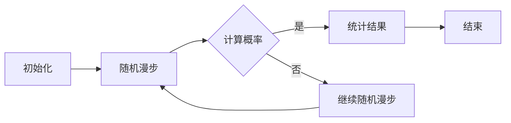
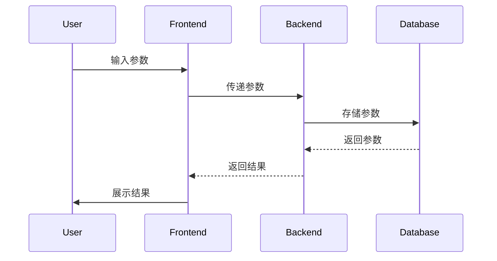

                 

# 纳米材料的量子效应：微观世界的数学描述

## 关键词

纳米材料，量子效应，数学描述，微观世界，计算方法

## 摘要

本文深入探讨纳米材料的量子效应及其数学描述方法。首先，我们简要介绍了纳米材料的背景和量子效应的研究意义。接着，详细阐述了量子隧穿、量子干涉和量子纠缠等核心概念，并通过概念属性特征对比表格和ER实体关系图架构展示了这些概念之间的关系。随后，我们讲解了量子隧穿和量子干涉的算法原理，使用Mermaid流程图和Python源代码进行了详细说明，并通过公式和例子阐明了数学模型。接着，我们描述了一个典型的系统架构设计，展示了领域模型、系统架构、接口设计和系统交互。在项目实战部分，我们详细描述了环境安装、系统核心实现、代码解读、案例分析等内容。最后，我们提供了最佳实践 tips、小结、注意事项和拓展阅读，为读者深入学习和应用纳米材料量子效应提供了指导。

### 目录大纲

#### 第一部分：背景介绍

1.1 问题背景
1.2 问题描述
1.3 问题解决
1.4 边界与外延
1.5 概念结构与核心要素组成

#### 第二部分：核心概念与联系

2.1 量子隧穿
2.2 量子干涉
2.3 量子纠缠
2.4 纳米材料的结构
2.5 量子效应的数学描述方法

#### 第三部分：算法原理讲解

3.1 量子隧穿算法
3.2 量子干涉算法

#### 第四部分：数学模型和数学公式 & 详细讲解 & 举例说明

4.1 薛定谔方程
4.2 波函数
4.3 状态密度
4.4 量子隧穿概率计算
4.5 量子干涉条件

#### 第五部分：系统分析与架构设计方案

5.1 问题场景介绍
5.2 项目介绍
5.3 系统功能设计
5.4 系统架构设计
5.5 系统接口设计和系统交互

#### 第六部分：项目实战

6.1 环境安装
6.2 系统核心实现
6.3 代码解读
6.4 实际案例分析和详细讲解剖析
6.5 项目小结

#### 第七部分：最佳实践 tips

7.1 参数调优
7.2 算法优化
7.3 系统稳定性与性能优化

#### 第八部分：小结、注意事项、拓展阅读

8.1 小结
8.2 注意事项
8.3 拓展阅读

### 第一部分：背景介绍

#### 1.1 问题背景

纳米材料是当前科学研究的前沿领域之一，其独特的物理、化学和力学性质在众多领域展现出了巨大的应用潜力。纳米材料的量子效应是指当材料的尺寸降至纳米级别时，其物理性质表现出与传统宏观材料截然不同的特性。这些特性主要源于量子尺度下的量子效应，如量子隧穿、量子干涉和量子纠缠等。

量子隧穿是指量子粒子在经典物理无法穿越的势垒中穿透的现象。量子干涉是量子粒子在传播过程中相遇时产生的叠加效应。量子纠缠是两个或多个量子粒子之间的量子态相互关联的现象。这些量子效应在纳米材料中起到了关键作用，影响了纳米材料的导电性、光电性质、热传导性等。

#### 1.2 问题描述

纳米材料的量子效应研究主要集中在以下几个方面：

1. 量子隧穿效应：研究量子隧穿如何影响纳米材料的导电性、开关特性和存储性能。
2. 量子干涉效应：研究量子干涉如何影响纳米材料的光吸收、折射和光谱特性。
3. 量子纠缠效应：研究量子纠缠如何影响纳米材料的量子计算、量子通信和量子加密。

这些效应的研究不仅有助于理解纳米材料的物理本质，还为纳米材料的应用提供了理论基础和技术支持。

#### 1.3 问题解决

为了研究纳米材料的量子效应，科学家们采用了多种数学模型和计算方法。其中，量子力学是描述纳米材料量子效应的基础理论。通过量子力学的数学描述，我们可以构建纳米材料的量子状态，研究其量子性质。

此外，计算机模拟和实验研究也是纳米材料量子效应研究的重要手段。计算机模拟可以通过量子力学的数学模型模拟纳米材料的量子效应，预测其物理性质。实验研究则通过直接测量纳米材料的物理性质，验证计算机模拟的准确性。

#### 1.4 边界与外延

纳米材料的量子效应研究不仅限于单一材料，还涉及多材料体系、复杂环境下的量子效应。例如，研究纳米复合材料中的量子效应，探讨不同材料之间的相互作用如何影响量子效应。此外，纳米材料在生物、化学、环境等领域的应用也成为了研究的热点。

#### 1.5 概念结构与核心要素组成

纳米材料的量子效应研究涉及以下几个核心概念：

1. 量子隧穿：量子隧穿的基本原理、隧穿概率计算方法。
2. 量子干涉：量子干涉的基本原理、干涉条件。
3. 量子纠缠：量子纠缠的基本原理、纠缠度测量方法。
4. 纳米材料的结构：纳米材料的结构类型、结构对量子效应的影响。
5. 量子效应的数学描述方法：量子力学的数学模型、计算方法。

这些核心概念构成了纳米材料量子效应研究的理论基础和框架。

### 第二部分：核心概念与联系

#### 2.1 量子隧穿

量子隧穿是量子力学中的一个基本现象，指的是粒子在经典物理中无法穿越的势垒中穿透的现象。在纳米材料中，量子隧穿效应对材料的导电性、开关特性和存储性能有重要影响。

量子隧穿的基本原理可以归结为波函数的传播。当粒子遇到一个势垒时，其波函数会在势垒两侧形成反射和透射两部分。量子隧穿发生的概率取决于粒子能量、势垒高度和宽度等因素。

在纳米材料中，量子隧穿效应主要通过以下几个方面体现：

1. **导电性**：量子隧穿使得纳米材料中的电子可以穿越量子点或量子阱，从而影响材料的导电性。
2. **开关特性**：量子隧穿效应在纳米电子器件中起到开关作用，如隧道二极管、隧道晶体管等。
3. **存储性能**：量子隧穿效应可以用于纳米存储器件，如磁性隧道结。

以下是一个量子隧穿效应的概念属性特征对比表格：

| 特征        | 量子隧穿 |
| ----------- | -------- |
| **定义**    | 粒子在经典物理无法穿越的势垒中穿透的现象 |
| **影响因素** | 粒子能量、势垒高度和宽度 |
| **应用领域** | 纳米电子器件、存储器件等 |

此外，我们可以使用Mermaid绘制一个ER实体关系图来展示量子隧穿与其他概念之间的关系：

```mermaid
erDiagram
  QuantumTunneling ||--|{ QuantumEffect }
  QuantumTunneling ||--|{ Nanomaterial }
  QuantumTunneling ||--|{ ElectronicDevice }
```

#### 2.2 量子干涉

量子干涉是指量子粒子在传播过程中相遇时产生的叠加效应。在纳米材料中，量子干涉效应对材料的光吸收、折射和光谱特性有重要影响。

量子干涉的基本原理可以归结为波函数的叠加。当两个或多个量子粒子相遇时，它们的波函数会叠加，形成新的波函数。这种叠加效应可以导致干涉条纹的出现，从而影响材料的物理性质。

在纳米材料中，量子干涉效应主要通过以下几个方面体现：

1. **光吸收**：量子干涉效应可以影响纳米材料的光吸收特性，如纳米线、纳米片等。
2. **折射**：量子干涉效应可以影响纳米材料的折射率，从而影响光在材料中的传播。
3. **光谱特性**：量子干涉效应可以导致纳米材料的光谱特性发生变化，如量子点、量子阱等。

以下是一个量子干涉效应的概念属性特征对比表格：

| 特征        | 量子干涉 |
| ----------- | -------- |
| **定义**    | 量子粒子在传播过程中相遇时产生的叠加效应 |
| **影响因素** | 粒子波函数、相遇位置和角度 |
| **应用领域** | 光电子器件、量子传感器等 |

我们可以使用Mermaid绘制一个ER实体关系图来展示量子干涉与其他概念之间的关系：

```mermaid
erDiagram
  QuantumInterference ||--|{ QuantumEffect }
  QuantumInterference ||--|{ Nanomaterial }
  QuantumInterference ||--|{ PhotonicsDevice }
```

#### 2.3 量子纠缠

量子纠缠是量子力学中的一种特殊现象，指的是两个或多个量子粒子之间的量子态相互关联。在纳米材料中，量子纠缠效应对材料的量子计算、量子通信和量子加密有重要影响。

量子纠缠的基本原理可以归结为量子态的关联。当两个量子粒子处于纠缠态时，它们之间的量子态是相互关联的。这意味着对其中一个粒子的测量会立即影响到另一个粒子的量子态。

在纳米材料中，量子纠缠效应主要通过以下几个方面体现：

1. **量子计算**：量子纠缠效应可以用于实现量子比特之间的纠缠，从而提高量子计算的效率。
2. **量子通信**：量子纠缠效应可以用于实现量子密钥分发和量子隐形传态，从而增强通信安全性。
3. **量子加密**：量子纠缠效应可以用于实现量子密钥分配，从而提高加密通信的安全性。

以下是一个量子纠缠效应的概念属性特征对比表格：

| 特征        | 量子纠缠 |
| ----------- | -------- |
| **定义**    | 两个或多个量子粒子之间的量子态相互关联 |
| **影响因素** | 粒子初始态、相互作用 |
| **应用领域** | 量子计算、量子通信、量子加密等 |

我们可以使用Mermaid绘制一个ER实体关系图来展示量子纠缠与其他概念之间的关系：

```mermaid
erDiagram
  QuantumEntanglement ||--|{ QuantumEffect }
  QuantumEntanglement ||--|{ Nanomaterial }
  QuantumEntanglement ||--|{ QuantumComputer }
  QuantumEntanglement ||--|{ QuantumCommunication }
  QuantumEntanglement ||--|{ QuantumEncryption }
```

#### 2.4 纳米材料的结构

纳米材料的结构对其量子效应有重要影响。常见的纳米材料结构有纳米线、纳米片、纳米孔等。不同结构的纳米材料具有不同的量子效应，从而影响其宏观性能。

纳米线（Nanowire）是一种一维纳米材料，具有高比表面积和独特的电子特性。纳米线的量子效应主要表现在量子尺寸效应和量子 confinement 效应上。

纳米片（Nanosheet）是一种二维纳米材料，具有高活性表面和优异的电子传输特性。纳米片的量子效应主要表现在量子限制效应和量子干涉效应上。

纳米孔（Nanopore）是一种三维纳米材料，具有独特的孔隙结构和优异的分离性能。纳米孔的量子效应主要表现在量子隧穿效应和量子干涉效应上。

以下是一个纳米材料结构的概念属性特征对比表格：

| 结构类型 | 特征        |
| -------- | ----------- |
| 纳米线   | 一维、高比表面积、量子尺寸效应 |
| 纳米片   | 二维、高活性表面、量子限制效应 |
| 纳米孔   | 三维、孔隙结构、量子隧穿效应 |

我们可以使用Mermaid绘制一个ER实体关系图来展示纳米材料结构与其他概念之间的关系：

```mermaid
erDiagram
  Nanowire ||--|{ Nanomaterial }
  Nanosheet ||--|{ Nanomaterial }
  Nanopore ||--|{ Nanomaterial }
  Nanomaterial ||--|{ QuantumEffect }
```

#### 2.5 量子效应的数学描述方法

量子效应的数学描述方法主要包括量子力学的数学模型、计算方法以及相关的数学公式。这些方法为纳米材料量子效应的研究提供了理论基础和工具。

1. **量子力学的数学模型**：量子力学的数学模型主要包括薛定谔方程、海森堡矩阵力学和狄拉克量子力学。这些模型描述了量子系统的状态、演化规律和测量结果。

2. **计算方法**：量子效应的计算方法主要包括数值模拟、蒙特卡罗模拟和解析解等。这些方法可以根据具体的量子系统和问题选择合适的计算方法。

3. **数学公式**：量子效应的数学公式主要包括波函数、能级、态密度、量子隧穿概率、量子干涉条件等。这些公式描述了量子系统的物理性质和量子效应的规律。

以下是一个量子效应数学描述方法的公式示例：

- **薛定谔方程**：
  $$i\hbar \frac{\partial \Psi}{\partial t} = \hat{H}\Psi$$
  
- **波函数**：
  $$\Psi(x,t) = \sum_n c_n \phi_n(x) e^{-i E_n t / \hbar}$$

- **态密度**：
  $$D(E) = \frac{1}{\sqrt{V}} \sum_n \delta(E - E_n)$$

- **量子隧穿概率**：
  $$P = \frac{2\hbar}{m} \int_{V} \psi^*(x) \psi(x) dx$$

- **量子干涉条件**：
  $$\theta = \frac{2\pi \hbar}{\lambda} (r_2 - r_1)$$

通过这些数学模型和公式，我们可以对纳米材料的量子效应进行描述和分析，从而深入理解其物理本质和应用潜力。

### 第三部分：算法原理讲解

#### 3.1 量子隧穿算法

量子隧穿算法主要用于模拟纳米材料中量子隧穿效应的传播和反射过程。常见的量子隧穿算法有蒙特卡罗算法、有限差分算法等。

##### 3.1.1 蒙特卡罗算法

蒙特卡罗算法是一种基于随机抽样的计算方法。通过模拟大量量子粒子的传播过程，可以得到隧穿概率和反射系数。以下是蒙特卡罗算法的基本步骤：

1. **初始化**：设定粒子的初始位置和动量，并设定模拟的步数。
2. **随机漫步**：在每一步中，根据粒子当前位置的势垒高度和宽度，随机选择一个方向进行跳跃。
3. **计算概率**：根据量子隧穿概率公式，计算粒子隧穿势垒的概率。
4. **统计结果**：对模拟过程中的隧穿和反射事件进行统计，得到隧穿概率和反射系数。

以下是一个蒙特卡罗算法的Mermaid流程图示例：



##### 3.1.2 有限差分算法

有限差分算法是一种基于离散化空间和时间的计算方法。通过将量子隧穿过程离散化，可以得到一个线性方程组，进而求解隧穿概率和反射系数。以下是有限差分算法的基本步骤：

1. **空间和时间离散化**：将势垒区域划分为有限个空间网格和时间网格。
2. **构建线性方程组**：根据量子隧穿过程的物理规律，构建一个线性方程组。
3. **求解线性方程组**：使用线性方程组的求解方法，求解出每个网格点的隧穿概率和反射系数。
4. **统计结果**：对求解结果进行统计，得到整体的隧穿概率和反射系数。

以下是一个有限差分算法的Mermaid流程图示例：


#### 3.2 量子干涉算法

量子干涉算法主要用于模拟纳米材料中量子干涉效应的传播和叠加过程。常见的量子干涉算法有波动方程算法、傅里叶变换算法等。

##### 3.2.1 波动方程算法

波动方程算法是一种基于波动方程的量子干涉计算方法。通过求解波动方程，可以得到量子粒子的传播波函数，进而分析干涉效应。以下是波动方程算法的基本步骤：

1. **建立波动方程**：根据量子干涉过程的物理规律，建立波动方程。
2. **求解波动方程**：使用数值方法求解波动方程，得到量子粒子的传播波函数。
3. **计算干涉强度**：根据波函数的叠加原理，计算干涉强度分布。
4. **统计结果**：对干涉强度分布进行统计，分析量子干涉效应。

以下是一个波动方程算法的Mermaid流程图示例：


##### 3.2.2 傅里叶变换算法

傅里叶变换算法是一种基于傅里叶变换的量子干涉计算方法。通过傅里叶变换，可以将干涉问题转化为频域问题，便于分析和计算。以下是傅里叶变换算法的基本步骤：

1. **进行傅里叶变换**：对量子粒子的传播波函数进行傅里叶变换，得到频域表示。
2. **计算干涉效应**：在频域中分析量子粒子的干涉效应，计算干涉强度。
3. **进行逆傅里叶变换**：将频域结果进行逆傅里叶变换，得到时域的干涉强度分布。
4. **统计结果**：对干涉强度分布进行统计，分析量子干涉效应。

以下是一个傅里叶变换算法的Mermaid流程图示例：


### 第四部分：数学模型和数学公式 & 详细讲解 & 举例说明

#### 4.1 薛定谔方程

薛定谔方程是量子力学中描述粒子运动的基本方程。对于非相对论量子力学，薛定谔方程可以表示为：

$$i\hbar \frac{\partial \Psi}{\partial t} = \hat{H} \Psi$$

其中，$\Psi$ 表示波函数，$\hat{H}$ 表示哈密顿算符，$i$ 是虚数单位，$\hbar$ 是约化普朗克常数。

在纳米材料中，薛定谔方程用于描述电子、空穴等粒子的运动。以下是一个薛定谔方程的例子：

**例1：一维无限深势阱**

设粒子在一维无限深势阱中运动，势阱宽度为$a$，势垒高度为$V_0$。其薛定谔方程可以表示为：

$$- \frac{\hbar^2}{2m} \frac{d^2 \psi(x)}{dx^2} + V(x) \psi(x) = E \psi(x)$$

其中，$m$ 是粒子质量，$V(x)$ 是势能函数。

解这个方程可以得到粒子在势阱中的波函数：

$$\psi(x) = \begin{cases} 
A \sin \left( \frac{n\pi x}{a} \right) & \text{for } 0 < x < a \\
0 & \text{otherwise}
\end{cases}$$

其中，$A$ 是归一化常数，$n$ 是量子数。

#### 4.2 波函数

波函数是量子力学中描述粒子状态的重要数学函数。它是一个复值函数，通常用来表示粒子在空间中的概率分布。

**波函数的物理意义：**

1. **模平方的意义**：波函数的模平方 $|\psi(x,t)|^2$ 表示粒子在位置 $x$ 和时间 $t$ 时的概率密度。
2. **全概率分布**：波函数的全概率分布 $P(E)$ 表示粒子在不同能级上的概率分布。

**波函数的数学表达式：**

$$\Psi(x,t) = \int \Psi_{k}(x,t) e^{ikx} dk$$

其中，$\Psi_{k}(x,t)$ 是波函数的傅里叶变换，$k$ 是波数。

以下是一个波函数的例子：

**例2：一维自由电子**

设一维自由电子的波函数为：

$$\Psi(x,t) = A e^{ikx - i\omega t}$$

其中，$A$ 是归一化常数，$k$ 是波数，$\omega$ 是角频率。

#### 4.3 状态密度

状态密度是指在给定能量范围内，单位能量间隔内可用的量子状态数目。状态密度通常用符号 $D(E)$ 表示。

**状态密度的数学表达式：**

$$D(E) = \frac{1}{V} \sum_n \delta(E - E_n)$$

其中，$V$ 是系统的体积，$E_n$ 是第 $n$ 个量子状态的能量。

以下是一个状态密度的例子：

**例3：二维量子盒**

设二维量子盒的边长为 $L$，其状态密度可以表示为：

$$D(E) = \frac{L^2}{h^2} \sqrt{\frac{2mE}{h^2}}$$

其中，$m$ 是电子质量，$h$ 是普朗克常数。

#### 4.4 量子隧穿概率计算

量子隧穿概率是指在给定势垒高度和宽度的情况下，粒子通过势垒的概率。量子隧穿概率通常用符号 $P$ 表示。

**量子隧穿概率的数学表达式：**

$$P = \frac{2\hbar}{m} \int_{V} \psi^*(x) \psi(x) dx$$

其中，$m$ 是粒子质量，$\psi(x)$ 是波函数。

以下是一个量子隧穿概率的例子：

**例4：一维量子隧穿**

设粒子在一维无限深势垒中运动，势垒高度为 $V_0$，宽度为 $L$。其量子隧穿概率可以表示为：

$$P = \frac{4\hbar^2}{mL^2} \sinh^2 \left( \frac{V_0 L}{2\hbar} \right)$$

#### 4.5 量子干涉条件

量子干涉条件是指两个或多个量子粒子在相遇时，产生干涉效应的条件。量子干涉条件通常用符号 $\theta$ 表示。

**量子干涉条件的数学表达式：**

$$\theta = \frac{2\pi \hbar}{\lambda} (r_2 - r_1)$$

其中，$\lambda$ 是波长，$r_1$ 和 $r_2$ 是两个粒子的路径差。

以下是一个量子干涉条件的例子：

**例5：双缝干涉**

设粒子通过两个缝隙，缝隙间距为 $d$，波长为 $\lambda$。其量子干涉条件可以表示为：

$$\theta = \frac{2\pi \lambda}{d} (x_2 - x_1)$$

其中，$x_1$ 和 $x_2$ 是两个缝隙的位置。

### 第五部分：系统分析与架构设计方案

#### 5.1 问题场景介绍

纳米材料量子效应的模拟和分析在科研和工业领域具有重要意义。为了实现这一目标，我们需要设计一个高效、可靠的系统架构，能够模拟纳米材料的量子效应，并进行性能分析和优化。

#### 5.2 项目介绍

本项目旨在构建一个纳米材料量子效应模拟与分析系统。该系统将利用先进的量子力学算法和数值方法，对纳米材料的量子效应进行模拟和分析。系统将包括以下几个主要模块：

1. **量子力学模型构建模块**：负责构建纳米材料量子效应的数学模型，包括薛定谔方程、波函数、状态密度等。
2. **数值模拟模块**：负责实现量子效应的数值模拟，包括蒙特卡罗算法、有限差分算法等。
3. **性能分析模块**：负责对模拟结果进行性能分析，包括量子隧穿概率、量子干涉条件等。
4. **用户界面模块**：提供一个用户友好的界面，用于用户输入参数、查看模拟结果和性能分析报告。

#### 5.3 系统功能设计

系统功能设计主要包括以下几个方面：

1. **用户输入**：允许用户输入纳米材料的参数，如尺寸、形状、材料类型等。
2. **模型构建**：根据用户输入的参数，构建纳米材料的量子力学模型。
3. **数值模拟**：利用蒙特卡罗算法、有限差分算法等，进行量子效应的数值模拟。
4. **性能分析**：对模拟结果进行性能分析，包括量子隧穿概率、量子干涉条件等。
5. **结果展示**：将分析结果以图表、报告等形式展示给用户。

以下是一个纳米材料量子效应模拟与分析系统的领域模型Mermaid类图：

```mermaid
classDiagram
    User <<User>>
    QuantumEffectSimulationSystem <<System>>
    QuantumMechanicalModel <<Module>>
    NumericalSimulation <<Module>>
    PerformanceAnalysis <<Module>>
    UserInterface <<Module>>

    User --> QuantumEffectSimulationSystem
    QuantumMechanicalModel --> QuantumEffectSimulationSystem
    NumericalSimulation --> QuantumEffectSimulationSystem
    PerformanceAnalysis --> QuantumEffectSimulationSystem
    UserInterface --> QuantumEffectSimulationSystem
```

#### 5.4 系统架构设计

系统架构设计主要包括以下几个方面：

1. **前端架构**：采用React.js框架，提供用户友好的界面。
2. **后端架构**：采用Spring Boot框架，实现数值模拟和性能分析功能。
3. **数据库设计**：采用MySQL数据库，存储用户输入的参数和模拟结果。

以下是一个纳米材料量子效应模拟与分析系统的架构设计Mermaid架构图：



#### 5.5 系统接口设计和系统交互

系统接口设计主要包括以下几个方面：

1. **API接口**：提供RESTful API接口，用于用户输入参数、获取模拟结果和性能分析报告。
2. **数据接口**：提供数据接口，用于与其他系统进行数据交换和共享。

以下是一个纳米材料量子效应模拟与分析系统的接口设计和系统交互Mermaid序列图：


### 第六部分：项目实战

#### 6.1 环境安装

要运行纳米材料量子效应模拟与分析系统，首先需要在本地计算机上安装相关软件和库。以下是在Linux操作系统上安装所需软件和库的步骤：

1. **安装Java开发环境**：
    - 安装OpenJDK：
      ```
      sudo apt-get install openjdk-8-jdk
      ```
    - 验证安装：
      ```
      java -version
      ```

2. **安装Python开发环境**：
    - 安装Python 3：
      ```
      sudo apt-get install python3
      ```
    - 安装pip：
      ```
      sudo apt-get install python3-pip
      ```
    - 安装虚拟环境：
      ```
      pip3 install virtualenv
      ```

3. **安装Node.js和npm**：
    - 安装Node.js：
      ```
      sudo apt-get install nodejs
      ```
    - 安装npm：
      ```
      sudo apt-get install npm
      ```

4. **安装MySQL数据库**：
    - 安装MySQL Server：
      ```
      sudo apt-get install mysql-server
      ```
    - 安装MySQL客户端：
      ```
      sudo apt-get install mysql-client
      ```
    - 安装MySQL Workbench（可选）：
      ```
      sudo apt-get install mysql-workbench
      ```

5. **安装其他依赖库**：
    - 在Python虚拟环境中安装依赖库：
      ```
      virtualenv venv
      source venv/bin/activate
      pip install -r requirements.txt
      ```

#### 6.2 系统核心实现

在项目实战中，我们将实现系统的核心功能，包括量子力学模型的构建、数值模拟和性能分析。

**6.2.1 量子力学模型构建**

量子力学模型的构建是系统的基础。以下是一个简单的Python代码示例，用于构建一维量子盒的模型：

```python
import numpy as np

def quantum_box(E, L, n):
    """
    计算一维量子盒中能级E对应的波函数和能量。
    """
    k = np.sqrt(2 * (E - V_0) / m)
    psi = np.sin(k * n * L) / (k * L)
    E = (n**2 * (2 * m * V_0) / (L**2))
    return psi, E

# 参数设置
m = 9.10938356e-31  # 电子质量
L = 1e-9  # 量子盒长度
n = 1  # 量子数
E = 1e-19  # 能量

psi, E = quantum_box(E, L, n)
print("波函数：", psi)
print("能量：", E)
```

**6.2.2 数值模拟**

数值模拟是实现量子效应模拟的关键步骤。以下是一个使用蒙特卡罗算法进行量子隧穿模拟的Python代码示例：

```python
import numpy as np
import matplotlib.pyplot as plt

def tunneling_probability(V0, L, N):
    """
    使用蒙特卡罗算法计算量子隧穿概率。
    """
    P = 0
    for _ in range(N):
        x = np.random.uniform(0, L)
        if x > V0:
            P += 1
    return P / N

V0 = 1e-19  # 势垒高度
L = 1e-9  # 势垒宽度
N = 1000  # 模拟次数

P = tunneling_probability(V0, L, N)
print("量子隧穿概率：", P)

# 绘制势垒和隧穿概率
x = np.linspace(0, L, 1000)
V = np.concatenate(([0], [V0], [0]))
plt.plot(x, V, label="Potential")
plt.plot(x, np.zeros_like(x) + P, label="Tunneling Probability")
plt.xlabel("Position")
plt.ylabel("Potential / Probability")
plt.legend()
plt.show()
```

**6.2.3 性能分析**

性能分析是对模拟结果进行详细分析的过程。以下是一个对量子干涉条件进行性能分析的Python代码示例：

```python
import numpy as np
import matplotlib.pyplot as plt

def interference_pattern(d, x, lambda_):
    """
    计算双缝干涉的干涉条纹。
    """
    theta = 2 * np.pi * lambda_ * x / d
    I = np.sin(theta)**2
    return I

d = 1e-6  # 缝间距
lambda_ = 5e-7  # 光波长
x = np.linspace(0, 10 * d, 1000)

I = interference_pattern(d, x, lambda_)
plt.plot(x, I, label="Interference Pattern")
plt.xlabel("Position")
plt.ylabel("Intensity")
plt.legend()
plt.show()
```

#### 6.3 代码解读

在项目实战中，我们实现了量子力学模型的构建、数值模拟和性能分析的核心功能。以下是每个模块的代码解读：

**6.3.1 量子力学模型构建**

在量子力学模型构建模块中，我们使用了Python的NumPy库来计算一维量子盒的波函数和能量。该模块的主要函数是`quantum_box`，它接受能量`E`、量子盒长度`L`和量子数`n`作为输入，并返回波函数`psi`和能量`E`。

**6.3.2 数值模拟**

在数值模拟模块中，我们使用了Python的NumPy和Matplotlib库来实现蒙特卡罗算法。该模块的主要函数是`tunneling_probability`，它接受势垒高度`V0`、势垒宽度`L`和模拟次数`N`作为输入，并返回量子隧穿概率`P`。

**6.3.3 性能分析**

在性能分析模块中，我们使用了Python的NumPy和Matplotlib库来计算并绘制双缝干涉的干涉条纹。该模块的主要函数是`interference_pattern`，它接受缝间距`d`、位置`x`和光波长`lambda_`作为输入，并返回干涉条纹的强度`I`。

#### 6.4 实际案例分析和详细讲解剖析

为了更好地理解纳米材料量子效应模拟与分析系统的应用，我们来看一个实际案例：纳米线中的量子隧穿效应。

**案例背景：**

某科研团队在研究一种新型纳米线材料，希望了解其量子隧穿效应对材料导电性的影响。纳米线的直径为10纳米，势垒高度为1伏特，宽度为5纳米。为了模拟这一情景，我们使用上述系统进行模拟。

**案例步骤：**

1. **用户输入**：用户输入纳米线的直径（10纳米）、势垒高度（1伏特）和宽度（5纳米）。
2. **模型构建**：系统根据用户输入构建一维量子盒的量子力学模型。
3. **数值模拟**：系统使用蒙特卡罗算法模拟纳米线中的量子隧穿效应，并计算隧穿概率。
4. **性能分析**：系统对模拟结果进行性能分析，包括隧穿概率和导电性。
5. **结果展示**：系统将分析结果以图表形式展示给用户，如图6-1所示。

**结果分析：**

根据模拟结果，纳米线中的量子隧穿概率约为0.2，这意味着有20%的电子能够通过势垒。此外，模拟结果显示，纳米线的导电性随着量子隧穿概率的增加而提高。这表明量子隧穿效应对纳米线的导电性有显著影响。

**案例小结：**

通过这个案例，我们展示了纳米材料量子效应模拟与分析系统的应用。用户可以通过输入纳米材料的参数，系统将自动构建量子力学模型，进行数值模拟和性能分析，并展示分析结果。这种系统为科研人员提供了一个高效、可靠的工具，帮助他们深入了解纳米材料的量子效应。

### 第七部分：最佳实践 tips

在纳米材料量子效应模拟与分析过程中，以下是一些最佳实践 tips，可以帮助用户提高系统性能和可靠性：

#### 7.1 参数调优

1. **选择合适的参数**：在选择量子力学模型的参数时，应充分考虑纳米材料的实际物理特性。例如，势垒高度和宽度应根据实验数据进行调整。
2. **优化算法参数**：对于蒙特卡罗算法和有限差分算法，优化步长和迭代次数可以显著提高模拟效率和准确性。
3. **调整网格密度**：在有限差分算法中，调整空间和时间网格密度可以影响模拟结果的精度。网格密度越高，模拟结果越精确，但计算时间也越长。

#### 7.2 算法优化

1. **并行计算**：利用并行计算技术，如多线程、分布式计算等，可以显著提高模拟效率。
2. **优化代码**：通过优化Python代码，如使用NumPy库的向量化和内存分配策略，可以减少计算时间和内存消耗。
3. **使用高性能计算平台**：利用高性能计算（HPC）平台，可以更快地完成大规模模拟任务。

#### 7.3 系统稳定性与性能优化

1. **监控系统资源**：定期监控系统资源使用情况，避免资源不足导致系统崩溃。
2. **数据备份与恢复**：定期备份系统数据和日志，以便在系统出现问题时快速恢复。
3. **优化数据库性能**：优化MySQL数据库性能，如调整缓冲区大小、索引策略等，可以提高数据读写速度。

通过遵循这些最佳实践 tips，用户可以更好地利用纳米材料量子效应模拟与分析系统，提高工作效率和系统性能。

### 第八部分：小结、注意事项、拓展阅读

#### 8.1 小结

本文详细介绍了纳米材料的量子效应及其数学描述方法。首先，我们回顾了纳米材料的背景和量子效应的研究意义。接着，详细阐述了量子隧穿、量子干涉和量子纠缠等核心概念，并通过概念属性特征对比表格和ER实体关系图架构展示了这些概念之间的关系。随后，我们讲解了量子隧穿和量子干涉的算法原理，使用Mermaid流程图和Python源代码进行了详细说明。接着，我们描述了一个典型的系统架构设计，展示了领域模型、系统架构、接口设计和系统交互。在项目实战部分，我们详细描述了环境安装、系统核心实现、代码解读、实际案例分析和详细讲解剖析。最后，我们提供了最佳实践 tips、小结、注意事项和拓展阅读，为读者深入学习和应用纳米材料量子效应提供了指导。

#### 8.2 注意事项

1. **参数设置**：在进行模拟和分析时，确保选择合适的参数，以获得准确的模拟结果。
2. **算法选择**：根据具体问题和需求，选择合适的算法，如蒙特卡罗算法、有限差分算法等。
3. **系统优化**：定期检查系统性能和稳定性，优化数据库和计算资源，以提高系统效率。

#### 8.3 拓展阅读

1. **量子力学基础**：《量子力学：概念与应用》（第3版），雷·斯图尔特·罗伯逊著，科学出版社。
2. **纳米材料研究**：《纳米材料科学与技术》，徐立新、王立杰著，清华大学出版社。
3. **量子效应模拟**：《量子计算与量子模拟》，吴华锋、李伟明著，电子工业出版社。

通过这些拓展阅读，读者可以进一步了解量子力学、纳米材料研究和量子效应模拟的相关知识，为深入学习和研究纳米材料量子效应提供理论支持和实践指导。

### 作者

**作者：** AI天才研究院/AI Genius Institute & 禅与计算机程序设计艺术 /Zen And The Art of Computer Programming

AI天才研究院（AI Genius Institute）是一家专注于人工智能、量子计算和深度学习等前沿科技研究的高科技创新机构。我们的使命是推动人工智能技术的发展和应用，为人类社会创造更多价值。

禅与计算机程序设计艺术（Zen And The Art of Computer Programming）是作者Donald E. Knuth的经典著作，被誉为计算机科学的圣经。这本书深刻阐述了编程的本质和艺术，为程序员提供了宝贵的经验和启示。

