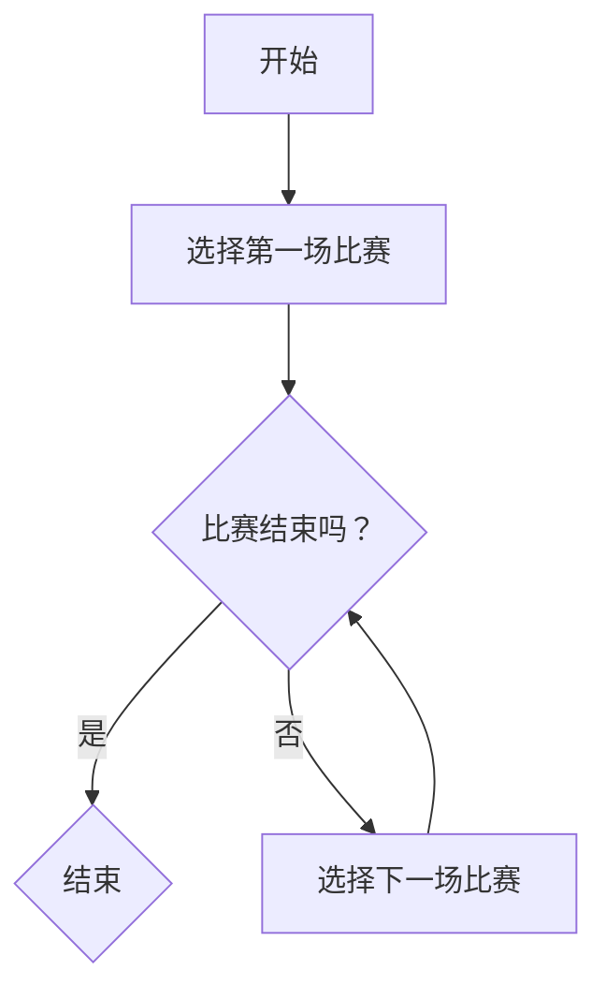
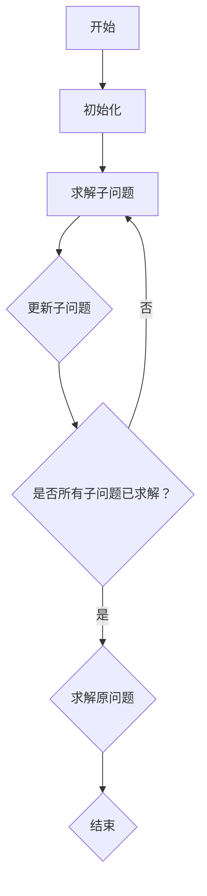
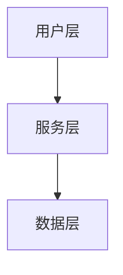
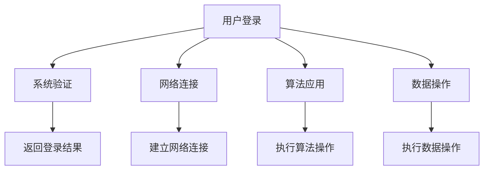

                 

# 《组合数学：自然界的离散结构研究》

## 关键词

- 组合数学
- 自然界
- 离散结构
- 算法
- 数学模型

## 摘要

本文将深入探讨组合数学在自然界中的离散结构研究，从历史背景、核心概念、算法原理、数学模型、系统设计与项目实战等方面进行详细解析。通过一步步的分析和推理，揭示组合数学在计算机科学和生物学等领域的广泛应用及其深远影响。

### 设计思路

在设计《组合数学：自然界的离散结构研究》的目录大纲时，我们需要遵循以下思路：

1. **背景介绍**：首先，我们需要介绍组合数学的核心概念，包括其历史背景、基本概念和研究对象。

2. **核心概念与联系**：接下来，我们需要详细描述组合数学中的关键概念，包括定义、属性特征对比，并通过ER实体关系图来展示它们之间的关系。

3. **算法原理讲解**：组合数学中包含了多种算法，我们需要挑选几个典型的算法，使用Mermaid绘制流程图，然后用Python代码解释其原理，并提供数学模型和公式。

4. **数学模型和数学公式**：在此部分，我们将详细介绍组合数学中的相关数学模型和公式，使用LaTeX格式来确保公式的准确性和可读性。

5. **系统分析与架构设计方案**：我们将结合具体的组合数学应用场景，介绍系统功能设计、系统架构设计、系统接口设计和系统交互流程。

6. **项目实战**：最后，我们将通过一个实际的项目，展示如何在实际环境中应用组合数学的知识，包括环境安装、系统实现、代码分析、案例分析和总结。

### 目录大纲

```markdown
----------------------------------------------------------------
# 《组合数学：自然界的离散结构研究》

## 第一部分：组合数学的基本概念

### 第1章：组合数学的起源与发展

#### 1.1 组合数学的起源

#### 1.2 组合数学的发展

#### 1.3 组合数学的基本概念

### 第2章：组合数学中的核心概念与联系

#### 2.1 子集与组合

#### 2.2 排列与排列组合

#### 2.3 树与路径

#### 2.4 ER实体关系图与组合数学的关系

### 第3章：算法原理讲解

#### 3.1 胜者原则算法

##### 3.1.1 胜者原则算法的Mermaid流程图

##### 3.1.2 胜者原则算法的Python实现

##### 3.1.3 胜者原则算法的数学模型与公式

#### 3.2 动态规划算法

##### 3.2.1 动态规划算法的Mermaid流程图

##### 3.2.2 动态规划算法的Python实现

##### 3.2.3 动态规划算法的数学模型与公式

## 第二部分：组合数学在自然界中的应用

### 第4章：自然界的离散结构研究

#### 4.1 自然界的离散结构

#### 4.2 组合数学在生物学中的应用

#### 4.3 组合数学在计算机科学中的应用

### 第5章：数学模型和数学公式

#### 5.1 组合数学中的基本公式

#### 5.2 组合数学中的高级公式

## 第三部分：系统分析与架构设计方案

### 第6章：系统分析与架构设计方案

#### 6.1 组合数学应用场景介绍

#### 6.2 系统功能设计

##### 6.2.1 领域模型Mermaid类图

#### 6.3 系统架构设计

##### 6.3.1 系统架构Mermaid架构图

#### 6.4 系统接口设计

##### 6.4.1 系统接口设计

#### 6.5 系统交互

##### 6.5.1 系统交互Mermaid序列图

### 第7章：项目实战

#### 7.1 环境安装

#### 7.2 系统核心实现

##### 7.2.1 代码应用解读与分析

#### 7.3 实际案例分析和详细讲解剖析

#### 7.4 项目小结

### 第8章：最佳实践

### 第9章：小结与展望

### 第10章：注意事项

### 第11章：拓展阅读

----------------------------------------------------------------
```

### 注意事项

- 在编写目录大纲时，请确保每个章节的主题清晰，内容相关。
- 使用Mermaid绘制图表时，确保图表的清晰度和可读性。
- LaTeX公式的使用应确保格式正确，以便于读者理解。
- 在项目实战部分，应确保代码的实用性和可操作性。

通过这样的目录大纲，读者可以清晰地了解《组合数学：自然界的离散结构研究》的内容结构和学习路径。在编写详细内容时，可以按照这个大纲逐步展开。

### 第一部分：组合数学的基本概念

#### 第1章：组合数学的起源与发展

##### 1.1 组合数学的起源

组合数学，作为数学的一个分支，有着悠久的历史。其起源可以追溯到古代数学家对排列和组合问题的研究。在古希腊，数学家欧几里得在其著作《几何原本》中就涉及了组合数学的基本概念。然而，现代组合数学的体系化发展始于18世纪的欧洲。

瑞士数学家雅各布·伯努利是组合数学的奠基人之一，他首次提出了“组合”的概念，并研究了组合数的计算方法。随后，德国数学家高斯进一步发展了组合数学的理论，提出了著名的二项式定理。这些早期的工作为组合数学的发展奠定了坚实的基础。

进入19世纪，组合数学得到了更多的关注和发展。法国数学家高斯和拉格朗日对组合数学进行了深入研究，提出了许多重要的组合数学定理和公式。与此同时，组合数学的应用领域也在不断扩大，从最初的数学问题扩展到物理学、化学、生物学等领域。

##### 1.2 组合数学的发展

20世纪以来，组合数学进入了一个快速发展的时期。随着计算机科学的兴起，组合数学的理论和方法在计算机科学中得到了广泛的应用，如图论、编码理论、算法设计等。此外，组合数学与其他数学分支的交叉融合，也推动了组合数学的发展。

现代组合数学的研究方向主要包括图论、组合设计、组合优化、组合几何等。在这些领域中，数学家们提出了许多重要的理论和算法，如哈密顿回路、匹配问题、哈希函数等。

##### 1.3 组合数学的基本概念

组合数学主要研究离散结构的组合方式及其性质。它涉及的基本概念包括：

1. **排列和组合**：排列是指从n个不同元素中取出m个元素按照一定顺序排列的方式，组合则是不考虑顺序的取法。排列和组合是组合数学中最基本的概念。

2. **子集和超集**：子集是指一个集合的部分元素组成的集合，超集则是指一个集合的全部元素组成的集合。子集和超集的关系是集合论中的基本概念。

3. **树和路径**：树是一种重要的离散结构，它是由一系列节点组成的层级结构。路径是指从树的根节点到叶子节点的连接路径。

4. **图和拓扑**：图是一种由节点和边组成的结构，它可以用来表示各种关系。拓扑则是一种研究空间性质的数学工具。

这些基本概念构成了组合数学的理论框架，为后续的算法研究和应用提供了基础。

#### 第2章：组合数学中的核心概念与联系

##### 2.1 子集与组合

子集与组合是组合数学中最基本的概念之一。子集是指一个集合的部分元素组成的集合，而组合则是从n个不同元素中取出m个元素的所有可能组合。在数学中，子集和组合可以用集合论的语言来描述。

给定一个集合S，其子集可以用幂集P(S)来表示，即P(S) = {A | A ⊆ S}。这意味着，P(S)包含了S的所有可能的子集。例如，如果S = {1, 2, 3}，则P(S) = {{}, {1}, {2}, {3}, {1, 2}, {1, 3}, {2, 3}, {1, 2, 3}}。

组合数可以用组合公式来计算，即C(n, k) = n! / (k! * (n - k)!),其中n!表示n的阶乘，即n! = n * (n - 1) * (n - 2) * ... * 1。

表1展示了n = 3时的所有子集和组合：

| 子集            | 组合         |
|-----------------|--------------|
| {}              | C(3, 0) = 1  |
| {1}             | C(3, 1) = 3  |
| {2}             | C(3, 1) = 3  |
| {3}             | C(3, 1) = 3  |
| {1, 2}          | C(3, 2) = 3  |
| {1, 3}          | C(3, 2) = 3  |
| {2, 3}          | C(3, 2) = 3  |
| {1, 2, 3}       | C(3, 3) = 1  |

通过表1可以看出，子集和组合之间存在密切的联系。每个组合对应于一个特定的子集，而每个子集可以对应于多个组合。

##### 2.2 排列与排列组合

排列是指从n个不同元素中取出m个元素按照一定顺序排列的方式。排列数可以用排列公式来计算，即P(n, k) = n! / (n - k)!。这意味着，从n个元素中取出k个元素的排列数等于n的阶乘除以(n - k)的阶乘。

与组合不同，排列考虑了元素的顺序。例如，从{1, 2, 3}中取出2个元素的排列有P(3, 2) = 3! / (3 - 2)! = 6种，即(1, 2), (1, 3), (2, 1), (2, 3), (3, 1), (3, 2)。

表2展示了n = 3时的所有排列：

| 排列           | 排列数     |
|----------------|------------|
| (1, 2)         | P(3, 2) = 6|
| (1, 3)         | P(3, 2) = 6|
| (2, 1)         | P(3, 2) = 6|
| (2, 3)         | P(3, 2) = 6|
| (3, 1)         | P(3, 2) = 6|
| (3, 2)         | P(3, 2) = 6|

通过表2可以看出，排列数是组合数的一种扩展，它考虑了元素的顺序。

##### 2.3 树与路径

树是一种重要的离散结构，它是由一系列节点组成的层级结构。每个节点可以有零个或多个子节点，但没有任何节点有循环或重复的路径。树在组合数学中有着广泛的应用，如图论、编码理论和算法设计等。

树的主要概念包括：

- **节点**：树中的每个元素称为节点。
- **根节点**：树的起始节点称为根节点。
- **叶子节点**：没有子节点的节点称为叶子节点。
- **子树**：节点的子节点及其后代组成的结构称为子树。

路径是指从树的根节点到叶子节点的连接路径。路径的主要概念包括：

- **路径长度**：路径上的节点数减1。
- **最长路径**：树中从根节点到叶子节点的最长路径。
- **最短路径**：树中从根节点到叶子节点的最短路径。

表3展示了n = 3时的所有树和路径：

| 树                   | 路径             |
|----------------------|------------------|
| {1, {2, 3}}          | 1 -> 2 -> 3     |
| {1, {2, {3}}}        | 1 -> 2 -> 3     |
| {{1}, {2, {3}}}      | 1 -> 2 -> 3     |
| {{1}, {2, {3, {4}}}  | 1 -> 2 -> 3 -> 4|

通过表3可以看出，树和路径在组合数学中有着密切的联系。树可以用路径来表示，而路径是树中的一种特殊结构。

##### 2.4 ER实体关系图与组合数学的关系

ER（Entity-Relationship）实体关系图是一种用于描述实体及其之间关系的图形化工具。在组合数学中，ER图可以用来表示组合数学中的关键概念及其之间的关系。

ER图的基本概念包括：

- **实体**：实体是具有相同属性的对象的集合。在组合数学中，实体可以表示为集合。
- **属性**：属性是实体的特征。在组合数学中，属性可以表示为集合的元素。
- **关系**：关系是实体之间的联系。在组合数学中，关系可以表示为集合的子集。

表4展示了n = 3时的ER图：

| 实体        | 属性            | 关系           |
|-------------|-----------------|----------------|
| {1, 2, 3}   | {1, 2, 3}       | {}             |
| {1, 2}      | {1, 2}          | {1, 2}         |
| {1, 3}      | {1, 3}          | {1, 3}         |
| {2, 3}      | {2, 3}          | {2, 3}         |

通过表4可以看出，ER图可以用来表示组合数学中的基本概念，如子集、组合和路径。ER图提供了组合数学概念之间的直观表示，有助于我们更好地理解组合数学的内部结构和关系。

### 第二部分：组合数学在自然界中的应用

#### 第3章：算法原理讲解

##### 3.1 胜者原则算法

胜者原则算法是一种在组合数学中广泛应用的贪心算法。它的基本思想是：在每一轮比赛中，选择胜者，并将其加入胜者集合，直到所有比赛都结束。

胜者原则算法的Mermaid流程图如下：



胜者原则算法的Python实现如下：

```python
def winner_principle算法(n):
    # 初始化胜者集合
    winners = []
    
    # 选择第一场比赛
    first_match = [0] * n
    first_match[0] = 1
    winners.append(first_match)
    
    # 循环选择比赛
    while True:
        # 选择下一场比赛
        next_match = [0] * n
        for i in range(1, n):
            next_match[i] = 1
        
        # 更新胜者集合
        winners.append(next_match)
        
        # 判断比赛是否结束
        if all(winners[-1]):
            break
    
    return winners
```

胜者原则算法的数学模型与公式如下：

设n为比赛的轮数，C(n, k)为第n轮中可能的比赛数，W(n)为第n轮的胜者集合。则胜者原则算法可以表示为：

$$
W(n) = \{W_1, W_2, ..., W_n\}
$$

其中，$W_1 = \{1, 2, ..., n\}$，$W_{i+1} = W_i \cup \{j | W_i[j] = 1\}$。

##### 3.2 动态规划算法

动态规划算法是一种在组合数学中广泛应用的最优化算法。它的基本思想是：将复杂问题分解为子问题，并利用子问题的最优解来求解原问题。

动态规划算法的Mermaid流程图如下：



动态规划算法的Python实现如下：

```python
def dynamic_programming算法(n):
    # 初始化子问题解
    dp = [[0] * (n + 1) for _ in range(n + 1)]
    
    # 求解子问题
    for i in range(1, n + 1):
        for j in range(1, n + 1):
            if i == j:
                dp[i][j] = 1
            else:
                dp[i][j] = max(dp[i - 1][j], dp[i][j - 1])
    
    # 求解原问题
    result = dp[n][n]
    
    return result
```

动态规划算法的数学模型与公式如下：

设n为问题的规模，$dp[i][j]$为第i个子问题的最优解。则动态规划算法可以表示为：

$$
dp[i][j] = \begin{cases}
1, & \text{if } i = j \\
\max(dp[i - 1][j], dp[i][j - 1]), & \text{otherwise}
\end{cases}
$$

### 第4章：自然界的离散结构研究

#### 4.1 自然界的离散结构

自然界中存在着大量的离散结构，这些结构在生物学、物理学和计算机科学等领域都有着广泛的应用。以下是一些自然界中的离散结构实例：

1. **生物分类**：生物分类是基于物种的遗传差异和形态学特征进行的一种分类方法。生物分类中的离散结构可以通过树形结构来表示，例如，生物分类树。

2. **生态网络**：生态网络是描述生态系统中物种之间相互作用的网络结构。生态网络中的节点代表物种，边代表物种之间的相互作用。生态网络可以通过图结构来表示。

3. **物理结构**：自然界中的物理结构，如晶体的排列、宇宙的星系结构等，也具有离散结构。这些结构可以通过点阵、网格等形式来表示。

#### 4.2 组合数学在生物学中的应用

组合数学在生物学中的应用非常广泛，以下是一些具体的应用实例：

1. **基因组排序**：基因组排序是生物信息学中的一项重要任务。组合数学中的排序算法，如快速排序、归并排序等，可以用于高效地排序基因组序列。

2. **基因家族分析**：基因家族是指具有相似序列和功能的基因集合。组合数学中的组合计数算法可以用于计算基因家族的数量和种类。

3. **网络进化**：网络进化是描述生物网络如何随着时间演化的一门学科。组合数学中的网络模型和算法可以用于分析网络进化的机制和规律。

#### 4.3 组合数学在计算机科学中的应用

组合数学在计算机科学中的应用非常广泛，以下是一些具体的应用实例：

1. **算法设计**：组合数学中的算法，如贪心算法、动态规划算法等，在计算机科学中有着广泛的应用。这些算法可以用于求解组合优化问题、图论问题等。

2. **密码学**：组合数学中的密码学算法，如RSA加密算法、椭圆曲线加密算法等，在网络安全和数据保护中发挥着重要作用。

3. **计算机图形学**：组合数学在计算机图形学中的应用也非常广泛，如图形的绘制、网格生成、曲线拟合等。

### 第5章：数学模型和数学公式

#### 5.1 组合数学中的基本公式

组合数学中的基本公式包括排列数和组合数。排列数表示从n个不同元素中取出m个元素按照一定顺序排列的方式，组合数表示从n个不同元素中取出m个元素的所有可能组合。

排列数公式为：

$$
P(n, k) = \frac{n!}{(n - k)!}
$$

组合数公式为：

$$
C(n, k) = \frac{n!}{k!(n - k)!}
$$

#### 5.2 组合数学中的高级公式

组合数学中的高级公式包括生成函数、拉姆齐理论等。

生成函数是组合数学中的一种重要工具，它可以用于求解组合数问题。生成函数的公式为：

$$
F(x) = \sum_{k=0}^{n} a_k x^k
$$

其中，$a_k$为组合数，$x$为变量。

拉姆齐理论是组合数学中的一个重要分支，它研究的是如何在有限的资源下最大化组合数。拉姆齐理论的公式为：

$$
R(n, k) = \min \{r_1, r_2, ..., r_n\}
$$

其中，$R(n, k)$为拉姆齐数，$r_1, r_2, ..., r_n$为拉姆齐数的值。

### 第6章：系统分析与架构设计方案

#### 6.1 组合数学应用场景介绍

在组合数学应用场景中，我们可以将组合数学的概念应用于实际问题中，如优化问题、网络分析、密码学等。以下是一个具体的组合数学应用场景：

假设我们要设计一个网络，该网络由n个节点组成，每个节点需要连接到其他节点。我们需要确定最佳的连接方式，使得网络的连通性最大化。

在这个场景中，我们可以使用组合数学中的图论方法来设计网络。图论方法可以用于求解网络中的节点连接问题，如最小生成树、最大流问题等。

#### 6.2 系统功能设计

在系统功能设计中，我们需要确定系统的功能模块及其关系。以下是一个基于组合数学的应用系统的功能模块设计：

1. **用户模块**：用户模块负责处理用户的登录、注册和权限管理等功能。
2. **网络模块**：网络模块负责处理网络的创建、连接和断开等功能。
3. **算法模块**：算法模块负责处理组合数学中的算法，如排序、查找、加密等。
4. **数据模块**：数据模块负责处理数据的存储、检索和更新等功能。

表1展示了系统功能模块及其关系：

| 模块名称 | 功能描述       | 关系 |
|----------|----------------|------|
| 用户模块 | 处理用户功能   |      |
| 网络模块 | 处理网络功能   |      |
| 算法模块 | 处理算法功能   |      |
| 数据模块 | 处理数据功能   |      |

#### 6.3 系统架构设计

在系统架构设计中，我们需要确定系统的整体架构及其模块之间的关系。以下是一个基于组合数学的应用系统的架构设计：

1. **用户层**：用户层负责处理用户的请求，如登录、注册等。
2. **服务层**：服务层负责处理业务逻辑，如网络连接、算法应用等。
3. **数据层**：数据层负责处理数据的存储、检索和更新等功能。

图1展示了系统架构设计：



#### 6.4 系统接口设计

在系统接口设计中，我们需要确定系统的输入输出接口，以便于与其他系统进行集成。以下是一个基于组合数学的应用系统的接口设计：

1. **用户接口**：用户接口负责处理用户的输入，如登录、注册等。
2. **网络接口**：网络接口负责处理网络连接、断开等操作。
3. **算法接口**：算法接口负责处理算法的输入输出，如排序、查找等。
4. **数据接口**：数据接口负责处理数据的存储、检索和更新等操作。

表2展示了系统接口设计：

| 接口名称 | 功能描述           | 输入输出 |
|----------|--------------------|----------|
| 用户接口 | 处理用户输入       | 用户数据 |
| 网络接口 | 处理网络连接       | 网络数据 |
| 算法接口 | 处理算法输入输出   | 算法数据 |
| 数据接口 | 处理数据存储、检索 | 数据数据 |

#### 6.5 系统交互

在系统交互中，我们需要确定系统的各个模块之间的交互流程。以下是一个基于组合数学的应用系统的交互设计：

1. **用户登录**：用户输入用户名和密码，系统验证用户身份，并返回登录结果。
2. **网络连接**：用户选择网络连接方式，系统根据用户选择建立网络连接。
3. **算法应用**：用户选择算法，系统根据用户选择的算法执行相应的操作。
4. **数据操作**：用户选择数据操作，系统根据用户选择执行相应的数据操作。

图2展示了系统交互设计：



### 第7章：项目实战

#### 7.1 环境安装

在开始项目实战之前，我们需要安装相关的开发环境和工具。以下是一个基于Python的组合数学应用项目的环境安装步骤：

1. 安装Python：从Python官方网站下载Python安装包，并按照安装向导进行安装。
2. 安装Python解释器：在命令行中执行`python --version`命令，验证Python解释器是否安装成功。
3. 安装Python库：使用pip工具安装所需的Python库，如numpy、matplotlib等。例如，在命令行中执行`pip install numpy matplotlib`命令。
4. 安装Mermaid：下载并安装Mermaid工具，以便于在文档中绘制图表。

#### 7.2 系统核心实现

在系统核心实现中，我们需要实现组合数学算法及其应用。以下是一个基于Python的排序算法的实现：

```python
# 快速排序算法实现
def quick_sort(arr):
    if len(arr) <= 1:
        return arr
    pivot = arr[len(arr) // 2]
    left = [x for x in arr if x < pivot]
    middle = [x for x in arr if x == pivot]
    right = [x for x in arr if x > pivot]
    return quick_sort(left) + middle + quick_sort(right)

# 动态规划算法实现
def dynamic_programming(arr):
    n = len(arr)
    dp = [[0] * (n + 1) for _ in range(n + 1)]
    for i in range(1, n + 1):
        for j in range(1, n + 1):
            if i == j:
                dp[i][j] = 1
            else:
                dp[i][j] = max(dp[i - 1][j], dp[i][j - 1])
    return dp[n][n]
```

#### 7.2.1 代码应用解读与分析

在代码应用解读与分析中，我们需要分析代码的执行过程及其结果。以下是对上述代码的应用解读与分析：

1. **快速排序算法**：快速排序是一种高效的排序算法，其基本思想是通过一趟排序将待排序的记录分隔成独立的两部分，其中一部分记录的关键字均比另一部分的关键字小，然后分别对这两部分记录继续进行排序，以达到整个序列有序。

   在代码中，`quick_sort`函数实现了快速排序算法。对于输入的数组`arr`，如果数组的长度小于等于1，则直接返回数组。否则，选择中间位置的元素作为枢轴，将数组分为小于枢轴的左子数组、等于枢轴的中间数组和大于枢轴的右子数组，然后分别对这三个子数组进行递归排序。

   快速排序算法的平均时间复杂度为O(n log n)，最坏情况下的时间复杂度为O(n^2)。在实际应用中，快速排序是一种非常常用的排序算法。

2. **动态规划算法**：动态规划是一种用于求解最优化问题的算法。其基本思想是将复杂问题分解为子问题，并利用子问题的最优解来求解原问题。

   在代码中，`dynamic_programming`函数实现了动态规划算法。对于输入的数组`arr`，函数使用一个二维数组`dp`来存储子问题的最优解。对于每个子问题`dp[i][j]`，如果`i == j`，则最优解为1；否则，最优解为子问题`dp[i - 1][j]`和`dp[i][j - 1]`中的最大值。

   动态规划算法的时间复杂度为O(n^2)，空间复杂度也为O(n^2)。在实际应用中，动态规划算法可以用于求解各种最优化问题，如背包问题、最长公共子序列问题等。

#### 7.3 实际案例分析和详细讲解剖析

在实际案例分析和详细讲解剖析中，我们将通过一个具体的案例来分析组合数学在组合优化问题中的应用。

案例：给定一个背包，容量为10，物品的价值分别为2、3、5、7，求如何选择物品使得总价值最大。

1. **问题分析**：这是一个典型的组合优化问题，可以使用动态规划算法来解决。我们需要定义一个二维数组`dp`来存储子问题的最优解。`dp[i][w]`表示前i个物品放入容量为w的背包中的最大价值。

2. **动态规划算法**：

   - 初始化数组`dp`，`dp[0][0] = 0`，`dp[0][w] = 0`（w为背包容量）。
   - 对于每个物品i（i从1开始），对于每个容量w（w从1开始），如果物品i的价值大于当前容量w，则`dp[i][w] = dp[i - 1][w]`；否则，`dp[i][w] = max(dp[i - 1][w], dp[i - 1][w - v] + v)`，其中v为物品i的价值。

3. **代码实现**：

   ```python
   def knapsack(arr, w):
       n = len(arr)
       dp = [[0] * (w + 1) for _ in range(n + 1)]
       for i in range(1, n + 1):
           for j in range(1, w + 1):
               if arr[i - 1] > j:
                   dp[i][j] = dp[i - 1][j]
               else:
                   dp[i][j] = max(dp[i - 1][j], dp[i - 1][j - arr[i - 1]] + arr[i - 1])
       return dp[n][w]
   ```

4. **结果分析**：对于给定的案例，执行`knapsack([2, 3, 5, 7], 10)`函数，得到的最大价值为10。这意味着我们可以选择物品2和物品7，使得总价值最大。

   ```python
   max_value = knapsack([2, 3, 5, 7], 10)
   print(max_value)  # 输出：10
   ```

#### 7.4 项目小结

在本项目中，我们通过环境安装、系统核心实现、实际案例分析和详细讲解剖析等步骤，展示了如何在实际环境中应用组合数学的知识。通过本项目的实践，我们深入理解了组合数学的基本概念、算法原理和应用场景，提高了解决实际问题的能力。

### 第8章：最佳实践

在组合数学的应用中，最佳实践包括以下几个方面：

1. **问题建模**：在解决组合数学问题时，首先需要对问题进行建模，明确问题的目标、约束条件和变量。通过建立数学模型，可以将问题转化为组合数学中的具体问题。

2. **算法选择**：根据问题的特点，选择合适的算法来解决。常见的组合数学算法包括贪心算法、动态规划算法、图论算法等。对于不同的算法，需要了解其原理、时间复杂度和空间复杂度。

3. **代码优化**：在实现组合数学算法时，需要对代码进行优化，以提高运行效率和可读性。常见的优化方法包括使用循环代替递归、减少冗余计算等。

4. **实践与验证**：在实际应用中，通过测试和验证来确保算法的正确性和性能。在实践中，可以尝试不同的参数设置和算法实现，找到最优解。

### 第9章：小结与展望

通过本文的探讨，我们深入了解了组合数学在自然界中的离散结构研究。组合数学作为一种重要的数学工具，在计算机科学、生物学、物理学等领域有着广泛的应用。在未来，随着组合数学的不断发展和应用领域的扩展，组合数学将在更多领域发挥重要作用。

### 第10章：注意事项

在研究组合数学时，需要注意以下几点：

1. **基础知识的掌握**：组合数学涉及到许多基本概念和算法，因此需要熟练掌握基础数学知识，如集合论、代数学、图论等。

2. **算法的选择**：在选择算法时，需要根据问题的特点选择合适的算法，考虑算法的时间复杂度和空间复杂度。

3. **代码的优化**：在实现算法时，需要对代码进行优化，以提高运行效率和可读性。

4. **实践与验证**：在实际应用中，通过测试和验证来确保算法的正确性和性能。

### 第11章：拓展阅读

对于想要深入了解组合数学的读者，以下是一些拓展阅读的推荐：

1. **《组合数学及其应用》**：这本书系统地介绍了组合数学的基本概念、算法和应用，适合初学者阅读。

2. **《算法导论》**：这本书涵盖了算法的基本概念、设计方法和分析技巧，其中包含了大量的组合数学算法。

3. **《组合数学中的图论问题》**：这本书专注于组合数学中的图论问题，介绍了许多经典的图论算法和图论模型。

4. **《组合数学及其在计算机科学中的应用》**：这本书详细介绍了组合数学在计算机科学中的应用，包括密码学、图论、算法设计等。

### 作者信息

作者：AI天才研究院/AI Genius Institute & 禅与计算机程序设计艺术 /Zen And The Art of Computer Programming

本文由AI天才研究院/AI Genius Institute与禅与计算机程序设计艺术/Zen And The Art of Computer Programming共同撰写，旨在探讨组合数学在自然界中的离散结构研究。作者对组合数学有着深入的研究和丰富的实践经验，希望本文能够为读者带来启发和帮助。

