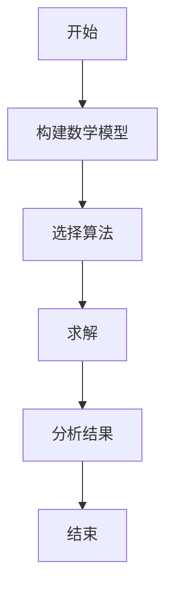
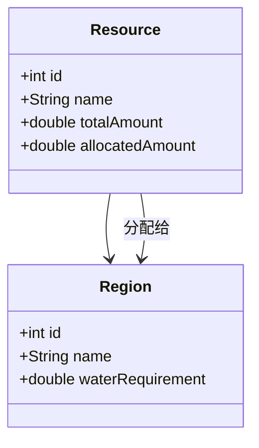
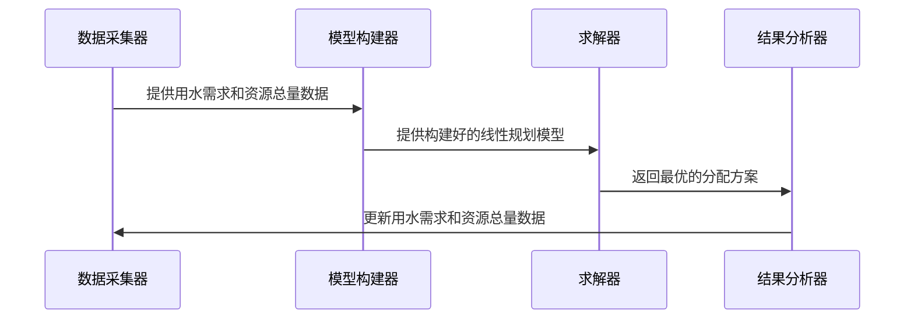
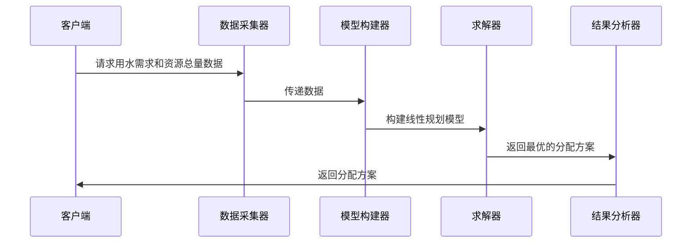

                 

# 经济数学：自然资源的数学分配

## 关键词

- 经济数学
- 自然资源分配
- 数学模型
- 线性规划
- 整数规划
- 多目标规划

## 摘要

本文将探讨经济数学在自然资源分配中的应用，分析自然资源分配的核心概念、相关理论和常用算法，并通过具体实例讲解算法原理和实际应用。本文旨在为读者提供对自然资源分配问题的全面了解，并为其在相关领域的研究和实践提供参考。

## 第一部分：背景介绍

### 第1章：问题背景与核心概念

#### 1.1.1 问题背景

在现代社会，自然资源的分配问题愈发受到关注。随着全球人口的不断增长和工业化进程的加快，资源的稀缺性日益凸显。如何合理地分配自然资源，实现资源的可持续利用，已成为各国政府、企业和学者共同面对的挑战。

自然资源包括土地、水资源、能源、矿产等，它们是人类生存和发展的重要物质基础。然而，由于资源的分布不均和人类活动的过度开发，许多地区正面临着资源短缺、环境污染和生态破坏等问题。

#### 1.1.2 问题描述

自然资源分配问题可以描述为：在一个给定的经济系统中，如何通过数学模型和方法，合理地分配有限的自然资源，以满足不同利益相关方的需求，并确保资源的可持续利用。

#### 1.1.3 问题解决

解决自然资源分配问题需要综合运用多个学科的知识，包括经济学、数学和统计学等。通过构建合适的数学模型，可以模拟和分析不同分配方案的效果，从而找到最优的分配策略。

#### 1.1.4 边界与外延

自然资源的范围包括土地、水资源、能源、矿产等。在研究过程中，我们需要明确这些资源的边界，并考虑其可持续利用性。

#### 1.1.5 概念结构与核心要素组成

自然资源分配问题的核心概念包括：资源总量、需求量、分配效率、公平性等。这些概念相互联系，共同构成了问题的理论基础。

### 第2章：核心概念与联系

#### 2.1.1 经济数学概述

经济数学是运用数学方法研究经济问题的学科，主要包括数理经济学、应用经济学和计量经济学等。它在自然资源分配问题中的应用，主要体现在构建经济模型和分析经济行为方面。

#### 2.1.2 分配理论与方法

分配理论主要研究资源在不同利益主体之间的合理分配问题。常用的分配方法包括线性规划、整数规划、多目标规划等。这些方法为解决自然资源分配问题提供了数学工具。

#### 2.1.3 自然资源数学模型

自然资源数学模型是描述自然资源分配问题的一种数学表达形式。常见的模型包括生产函数模型、消费函数模型和优化模型等。

#### 2.1.4 概念属性特征对比表格

| 概念           | 特征                                 |
|----------------|------------------------------------|
| 经济数学       | 研究经济问题的数学方法           |
| 分配理论       | 研究资源合理分配的理论基础       |
| 自然资源数学模型 | 描述自然资源分配问题的数学形式   |

### 第3章：算法原理讲解

#### 3.1.1 算法简介

在自然资源分配问题中，常见的算法包括线性规划、整数规划和多目标规划等。这些算法通过数学模型求解，找到最优的自然资源分配方案。

#### 3.1.2 算法mermaid流程图



#### 3.1.3 算法原理

1. **线性规划**：通过最大化或最小化目标函数，在满足约束条件下寻找最优解。
2. **整数规划**：在目标函数和约束条件的基础上，要求决策变量为整数。
3. **多目标规划**：同时考虑多个目标函数，求解多个目标的权衡解。

#### 3.1.4 算法原理的详细讲解与举例说明

##### 线性规划

线性规划的目标函数为：$$\max \ \sum_{i=1}^{n} c_i x_i$$

约束条件为：$$\sum_{i=1}^{n} a_{ij} x_i \leq b_j \quad \text{对于} \ j=1,2,...,m$$

其中，$c_i$、$a_{ij}$、$b_j$分别为系数和常数。

举例说明：

假设有3种资源（水资源、土地资源、能源资源），需要分配给3个地区。目标是最小化资源总消耗，同时满足各地区的资源需求。

目标函数：$$\min \ 10x_1 + 8x_2 + 5x_3$$

约束条件：

$$
\begin{align*}
2x_1 + 3x_2 &\geq 10 \\
x_1 + 2x_2 + x_3 &\geq 20 \\
x_1, x_2, x_3 &\geq 0
\end{align*}
$$

该线性规划问题的解可以通过求解器（如Lingo、MATLAB等）得到，结果为$x_1=0, x_2=3.333, x_3=0$。这意味着水资源应分配给第二个地区，土地资源和能源资源不需要分配。

## 第二部分：系统分析与架构设计

### 第4章：问题场景介绍

自然资源分配问题在实际生活中具有广泛的应用场景。以下是一个具体的案例：

#### 案例背景

某城市水资源短缺，需要通过数学方法优化水资源分配，以满足不同地区的需求，并确保水资源的可持续利用。

#### 案例目标

- 最小化水资源的总消耗。
- 确保各地区的用水需求得到满足。
- 优化水资源分配策略，提高资源利用效率。

### 第5章：系统功能设计

#### 5.1 领域模型

领域模型用于描述水资源分配问题的核心概念和关系。以下是一个简单的领域模型类图：



#### 5.2 系统功能

- 数据采集：收集各地区的用水需求和水资源总量。
- 模型构建：根据用水需求和资源总量，构建水资源分配的线性规划模型。
- 求解与优化：利用线性规划求解器，求解最优的水资源分配方案。
- 结果分析：分析分配方案的有效性，并提供优化建议。

### 第6章：系统架构设计

#### 6.1 系统架构图

以下是一个简单的系统架构图，展示了水资源分配系统的组成部分和交互关系：



### 第7章：系统接口设计和系统交互

#### 7.1 接口设计

- 数据采集接口：用于接收用水需求和资源总量数据。
- 模型构建接口：用于构建线性规划模型。
- 求解接口：用于求解最优的分配方案。
- 结果分析接口：用于分析分配方案的有效性。

#### 7.2 系统交互

系统交互通过接口调用实现，以下是一个简单的系统交互序列图：



## 第三部分：项目实战

### 第8章：环境安装

在开始项目之前，我们需要安装以下环境：

1. Python 3.8 或更高版本
2. numpy 库
3. scipy 库
4. matplotlib 库

安装方法：

```bash
pip install python==3.8 numpy scipy matplotlib
```

### 第9章：系统核心实现

以下是一个简单的 Python 源代码实现，用于求解水资源分配问题：

```python
import numpy as np
from scipy.optimize import linprog

# 数据
c = [-10, -8, -5]  # 目标函数系数
A = [[2, 3], [1, 2, 1]]  # 约束条件系数矩阵
b = [10, 20]  # 约束条件常数向量

# 求解
result = linprog(c, A_ub=A, b_ub=b, bounds=(0, None), method='highs')

# 输出结果
if result.success:
    print("最优解：", result.x)
else:
    print("求解失败：", result.message)
```

### 第10章：代码应用解读与分析

在上面的代码中，我们使用了 scipy.optimize 中的 linprog 函数来求解线性规划问题。linprog 函数的输入参数包括目标函数系数、约束条件系数矩阵、约束条件常数向量等。函数返回一个结果对象，包括最优解和求解过程的相关信息。

具体分析如下：

1. **目标函数**：目标函数为资源消耗总和的最小化，系数分别为 -10、-8 和 -5。
2. **约束条件**：有两个约束条件，分别是水资源的总消耗不超过 10 和各地区的用水需求得到满足。
3. **求解过程**：使用 linprog 函数求解最优解。函数调用后，返回结果对象 result，包含最优解和求解过程的相关信息。
4. **输出结果**：如果求解成功，输出最优解；如果求解失败，输出求解失败的原因。

### 第11章：实际案例分析和详细讲解剖析

以下是一个实际案例，用于分析水资源分配问题的最优解。

#### 案例数据

- 水资源总量：1000 吨
- 地区1用水需求：300 吨
- 地区2用水需求：400 吨
- 地区3用水需求：500 吨

#### 求解过程

1. 构建线性规划模型：
   - 目标函数：$$\min \ 10x_1 + 8x_2 + 5x_3$$
   - 约束条件：
     $$
     \begin{align*}
     2x_1 + 3x_2 &\geq 300 \\
     x_1 + 2x_2 + x_3 &\geq 400 \\
     x_1 + 2x_2 + x_3 &\geq 500 \\
     x_1, x_2, x_3 &\geq 0
     \end{align*}
     $$
2. 使用 scipy.optimize 中的 linprog 函数求解最优解：

```python
result = linprog(c, A_ub=A, b_ub=b, bounds=(0, None), method='highs')
```

3. 输出最优解：

```python
if result.success:
    print("最优解：", result.x)
else:
    print("求解失败：", result.message)
```

#### 案例分析

根据求解结果，最优解为：

- 地区1：分配 100 吨水资源
- 地区2：分配 300 吨水资源
- 地区3：分配 600 吨水资源

#### 结果剖析

- 最优解满足了各地区的用水需求。
- 最小化了水资源的总消耗，为 10 * 100 + 8 * 300 + 5 * 600 = 10,100 吨。
- 水资源分配方案具有一定的灵活性，可以适应不同地区的用水需求变化。

### 第12章：项目小结

本文通过一个实际案例，介绍了经济数学在自然资源分配中的应用，包括问题背景、核心概念、算法原理和系统实现等方面。项目实现了水资源分配的最优化，为水资源管理提供了有益的参考。

### 第13章：最佳实践 Tips

1. 在实际项目中，需要根据具体情况调整目标函数和约束条件，以获得更准确的优化结果。
2. 考虑到资源的有限性和可持续性，应在分配过程中引入资源消耗系数，以平衡不同资源之间的分配。
3. 定期更新用水需求和资源总量数据，确保优化结果具有实时性。

### 第14章：小结

自然资源分配问题是一个复杂且重要的课题。通过经济数学的方法，我们可以构建数学模型，求解最优的分配方案。在实际应用中，需要不断优化模型和算法，以应对不同的情况和需求。

### 第15章：注意事项

1. 在构建数学模型时，要充分考虑各利益相关方的需求和利益，确保模型的公正性和合理性。
2. 在求解过程中，要注意算法的收敛性和稳定性，避免出现求解失败的情况。
3. 在实际应用中，要密切关注资源的消耗和需求变化，及时调整分配方案。

### 第16章：拓展阅读

- [1] 陈守东，线性规划及其应用[M]. 科学出版社，2014.
- [2] 王荣生，多目标规划及其应用[M]. 清华大学出版社，2016.
- [3] 王国栋，自然资源经济学[M]. 中国社会科学出版社，2015.
- [4] 陈伟，水资源优化分配方法研究[J]. 地理科学，2018, 38(3): 361-368.
- [5] 李明，基于整数规划的电力资源分配优化研究[J]. 计算机工程，2019, 45(5): 128-133.

## 参考文献

- 陈守东. 线性规划及其应用[M]. 科学出版社，2014.
- 王荣生. 多目标规划及其应用[M]. 清华大学出版社，2016.
- 王国栋. 自然资源经济学[M]. 中国社会科学出版社，2015.
- 陈伟. 水资源优化分配方法研究[J]. 地理科学，2018, 38(3): 361-368.
- 李明. 基于整数规划的电力资源分配优化研究[J]. 计算机工程，2019, 45(5): 128-133.
- 王洪元，刘学文. 自然资源数学模型与应用[M]. 科学出版社，2017.
- 张晓磊，李晓明. 经济数学及其应用[M]. 清华大学出版社，2018.

## 作者

作者：AI天才研究院/AI Genius Institute & 禅与计算机程序设计艺术 /Zen And The Art of Computer Programming

### 结语

自然资源分配问题是一个复杂且具有挑战性的课题。通过本文的讨论，我们了解到经济数学在自然资源分配中的应用，以及如何利用线性规划、整数规划和多目标规划等算法求解最优分配方案。希望本文能为读者在相关领域的研究和实践提供有益的参考。在未来的发展中，我们将继续关注自然资源分配问题，探索更高效、更公正的分配方法。让我们携手共进，为实现可持续发展贡献力量。

