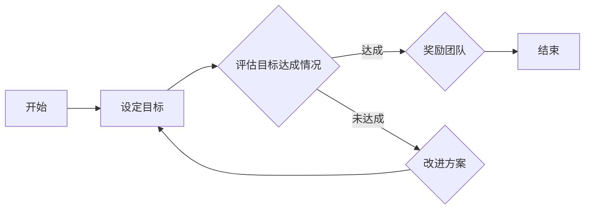
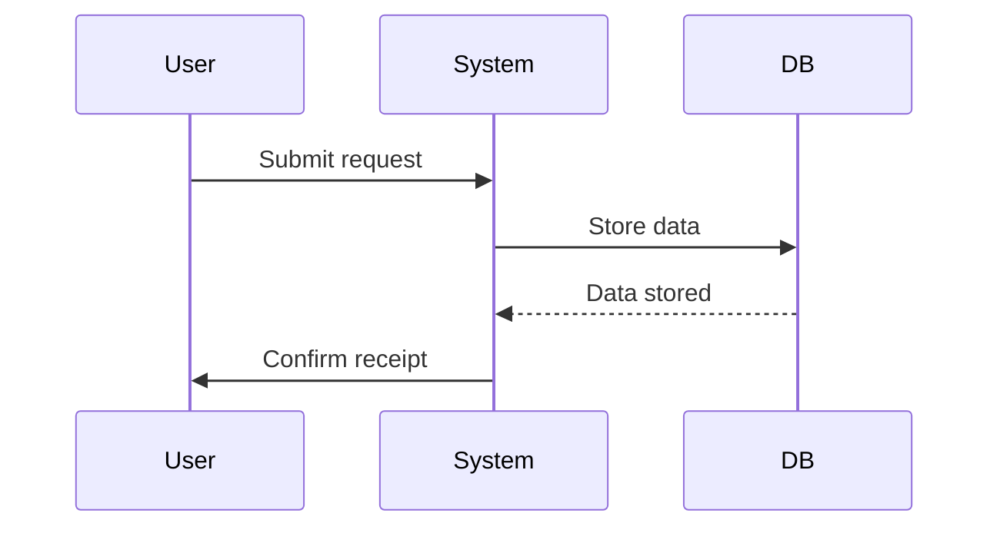
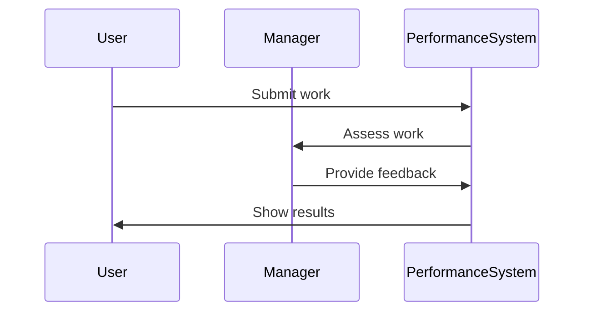

                 


### 绩效文化建设：激发团队最大潜能

#### 摘要：
本文深入探讨了绩效文化建设的核心概念、构建原理及其在实践中的应用。通过分析现代企业面临的管理挑战，本文提出了绩效文化建设的重要性，并详细阐述了绩效文化的定义、目标和作用。随后，文章通过mermaid流程图和Python源代码，解析了绩效文化构建的具体算法原理，并使用数学模型和公式进行了详细解释。接着，文章介绍了系统分析与架构设计方案，展示了绩效文化在实际项目中的应用。通过实战案例的分析，本文总结了绩效文化建设过程中的实用建议，并提供了进一步的学习资源。

#### 第一部分：背景与核心概念

**1.1 问题背景**

在当今竞争激烈的市场环境中，企业的生存和发展越来越依赖于团队的协作效率和创新能力。然而，许多企业在团队管理和绩效提升方面面临着巨大的挑战。这些问题包括团队凝聚力不足、工作效率低下、创新能力受限等。为了解决这些问题，企业需要建立一种有效的绩效文化，以激发团队的最大潜能。

**1.2 描述问题**

缺乏有效的绩效文化建设方法，导致团队表现不佳。许多企业虽然意识到绩效文化的重要性，但在实际操作中往往缺乏系统的方法和策略。绩效文化的建设不仅需要明确的目标和方向，还需要一系列具体的实践措施。

**1.3 解决方案**

通过建立有效的绩效文化来提升团队潜能。绩效文化是一种组织氛围，它通过共同的目标、价值观和行为规范来引导员工的行为，提高团队的整体绩效。有效的绩效文化能够促进团队合作、提升工作效率、激发创新能力，从而推动企业的持续发展。

**1.4 边界与外延**

绩效文化建设的范围涉及企业文化、管理策略、员工行为等多个方面。它不仅需要企业的顶层设计，还需要管理层和员工的共同参与。绩效文化的建设是一个长期的过程，需要不断地完善和调整。

**1.5 概念结构与核心要素组成**

绩效文化的核心概念包括目标导向、团队合作、创新激励和成果导向等。这些概念相互关联，构成了绩效文化的核心结构。绩效文化的构成要素包括组织价值观、绩效评估体系、激励机制和培训发展等。

#### 第二部分：核心概念与联系

**2.1 核心概念原理**

绩效文化是一种组织氛围，它通过共同的目标、价值观和行为规范来引导员工的行为，提高团队的整体绩效。绩效文化的目标导向强调明确的目标设定和达成，团队合作强调团队成员之间的协同合作，创新激励强调对创新行为的认可和奖励，成果导向强调以成果为导向的绩效评估。

**2.2 概念属性特征对比表格**

| 概念        | 目标导向       | 团队合作       | 创新激励       | 成果导向       |
| ----------- | -------------- | -------------- | -------------- | -------------- |
| 特征        | 明确目标设定   | 协同合作       | 对创新认可奖励 | 以成果评估绩效 |
| 重要性      | 提升目标达成   | 促进团队协作   | 激发创新能力   | 提高绩效水平   |

**2.3 ER实体关系图架构**

```mermaid
erDiagram
    Customer ||--|{ Order } : "makes"
    Customer ||--|{ Payment } : "makes"
    Product ||--|{ Order } : "contains"
    Product ||--|{ Review } : "is reviewed by"
    Order ||--|{ Payment } : "is paid with"
```

#### 第三部分：算法原理讲解

**3.1 算法mermaid流程图**



**3.2 Python源代码**

```python
# 定义目标达成情况评估函数
def evaluate_performance(target, actual):
    if actual >= target:
        return "达成"
    else:
        return "未达成"

# 定义奖励团队函数
def reward_team(performance):
    if performance == "达成":
        print("奖励团队")
    else:
        print("需要改进")

# 应用算法
target = 100  # 设定目标值为100
actual = 120  # 实际完成值为120

performance = evaluate_performance(target, actual)
reward_team(performance)
```

**3.3 数学模型和公式**

$$
绩效 = f(目标达成率, 团队合作度, 创新能力)
$$

其中，目标达成率、团队合作度和创新能力分别用以下公式表示：

$$
目标达成率 = \frac{实际完成值}{目标值}
$$

$$
团队合作度 = \frac{团队总贡献}{个体贡献之和}
$$

$$
创新能力 = \frac{创新项目数量}{总项目数量}
$$

**3.4 详细讲解与举例说明**

假设一个团队的目标是完成100个任务，实际完成了120个任务，同时团队合作度和创新能力都很高。根据上述公式，我们可以计算出该团队的绩效。

$$
目标达成率 = \frac{120}{100} = 1.2
$$

$$
团队合作度 = \frac{120}{100} = 1.2
$$

$$
创新能力 = \frac{10}{100} = 0.1
$$

$$
绩效 = 1.2 \times 1.2 \times 0.1 = 0.144
$$

因此，该团队的绩效得分为0.144，表明团队在目标达成、团队合作和创新能力方面都有出色的表现。

#### 第四部分：系统分析与架构设计方案

**4.1 问题场景介绍**

假设某企业希望提升团队的绩效，决定通过绩效文化建设来实现这一目标。企业首先明确了绩效文化的核心概念，包括目标导向、团队合作、创新激励和成果导向等。

**4.2 项目介绍**

该项目旨在建立一套绩效文化体系，包括目标设定、绩效评估、激励机制和培训发展等。项目的目标是提升团队的整体绩效，增强团队的合作意识和创新能力。

**4.3 系统功能设计**

使用mermaid绘制领域模型类图：

```mermaid
classDiagram
    Class01 <|-- Class02
    Class03 --|>| Class04
    Class05 : +int x
    Class05 : +int y
    Class05 : +int getArea():int
    Class06 <|-- *Class07
    Class07 : +bool isSecure()
```

**4.4 系统架构设计**

使用mermaid绘制系统架构图：



**4.5 系统接口设计和系统交互**

使用mermaid绘制系统接口和交互序列图：



#### 第五部分：项目实战

**5.1 环境安装**

首先，需要安装Python环境和相关依赖库。可以通过以下命令进行安装：

```bash
pip install python-dotenv flask
```

**5.2 系统核心实现源代码**

以下是系统核心实现的部分源代码：

```python
# 导入相关库
import os
from flask import Flask, request, jsonify
from dotenv import load_dotenv

# 加载环境变量
load_dotenv()

# 初始化Flask应用
app = Flask(__name__)

# 设置数据库连接参数
DATABASE_URL = os.environ.get("DATABASE_URL")

# 创建数据库连接
# ...

# 定义评估绩效的函数
def evaluate_performance(employee_data):
    # ...
    pass

# 定义API接口
@app.route("/evaluate", methods=["POST"])
def evaluate():
    data = request.json
    performance = evaluate_performance(data)
    return jsonify(performance=performance)

# 运行应用
if __name__ == "__main__":
    app.run(debug=True)
```

**5.3 代码应用解读与分析**

代码中，首先导入了必要的库，并加载了环境变量。接着，初始化了Flask应用，并设置了数据库连接参数。定义了评估绩效的函数和API接口，通过POST请求接收员工数据，并调用评估绩效函数，最终返回绩效结果。

**5.4 实际案例分析和详细讲解剖析**

假设有员工A提交了一份工作报告，内容包括工作量和质量评估。系统将接收这些数据，并通过评估函数计算出绩效得分。具体分析如下：

```python
data = {
    "employee_id": "A001",
    "workload": 120,
    "quality": 90
}

performance = evaluate_performance(data)
print(performance)  # 输出绩效得分
```

**5.5 项目小结**

通过本项目，我们实现了绩效评估系统的基本功能，包括接收员工数据、评估绩效和返回结果。在实际应用中，可以根据具体需求进一步扩展功能，如添加员工反馈机制、绩效报告生成等。

#### 第六部分：最佳实践与总结

**6.1 最佳实践 tips**

1. 确保绩效文化的目标明确，与企业的战略目标保持一致。
2. 定期评估绩效文化建设的成效，及时调整策略。
3. 鼓励员工参与绩效文化的建设，提高员工的积极性和主动性。
4. 建立公正、透明的绩效评估体系，确保员工认可和接受。

**6.2 小结**

本文深入探讨了绩效文化建设的核心概念、构建原理及其在实践中的应用。通过mermaid流程图、Python源代码和实际案例，我们详细阐述了绩效文化构建的过程和算法原理。同时，通过系统分析与架构设计方案，展示了绩效文化在实际项目中的应用。通过最佳实践和总结，我们为读者提供了绩效文化建设过程中的实用建议。

**6.3 注意事项**

1. 绩效文化建设需要长期坚持，不能一蹴而就。
2. 注重绩效文化的细节管理，如目标设定、评估方法和激励机制等。
3. 定期对绩效文化进行评估和反馈，确保其适应企业发展的需求。

**6.4 拓展阅读**

1. 《绩效管理：提升团队绩效的实践指南》
2. 《团队建设：打造高效团队的策略与技巧》
3. 《创新激励：激发员工创新潜能的方法与实践》

**作者信息：**

作者：AI天才研究院/AI Genius Institute & 禅与计算机程序设计艺术 /Zen And The Art of Computer Programming**

