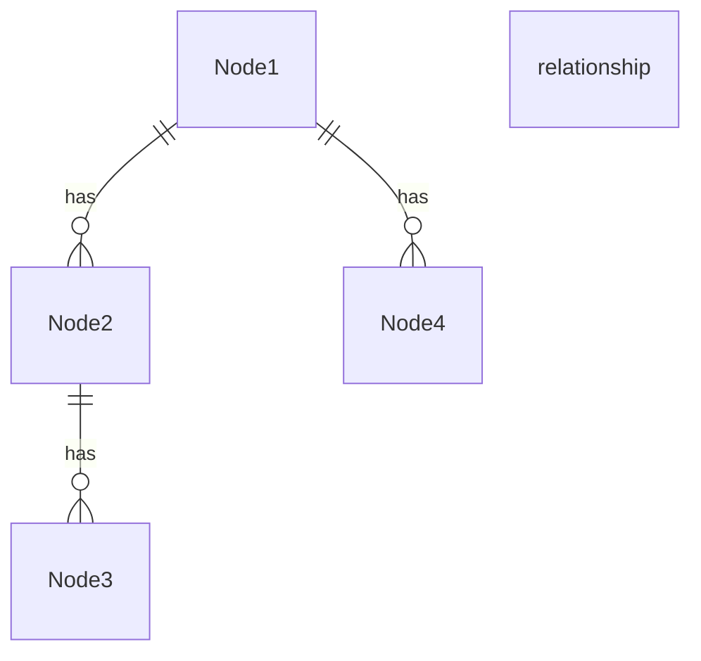

                 

# 网络科学：自然界的连接数学

> 关键词：网络科学、复杂网络、连接数学、节点、边、社群结构、动态过程

> 摘要：本文将深入探讨网络科学这一领域，从其起源与发展、基本特性与度量、模型与随机图、演化与动态行为、应用领域等方面，逐步分析网络科学的各个方面。通过系统地介绍网络科学的核心概念、算法原理及其实际应用，本文旨在帮助读者理解网络科学在解决复杂系统问题中的重要性，并激发对这一领域的兴趣。

## 第1章: 网络科学概述

### 1.1 网络科学的起源与发展

**问题背景**：网络科学作为一个跨学科领域，其起源可以追溯到20世纪中期。随着计算机科学的快速发展，科学家们开始意识到研究复杂系统的必要性。网络科学正是在这一背景下逐渐兴起的。

**问题描述**：网络科学主要研究网络结构、功能及其动态行为。其研究对象包括各种类型的网络，如社交网络、通信网络、交通网络等。网络科学旨在通过理解网络的内在特性，为实际问题的解决提供理论支持。

**问题解决**：网络科学在解决复杂系统问题中发挥了重要作用。通过分析网络的结构和动态行为，我们可以更好地理解系统的运作机制，从而提出有效的解决方案。例如，在通信网络中，网络科学可以帮助优化数据传输路径，提高网络性能。

**边界与外延**：网络科学与其他领域的交叉，如物理学、计算机科学、社会学等，使其成为一门综合性学科。网络科学的研究不仅涉及数学和统计方法，还包括模拟和实验验证。

**概念结构与核心要素组成**：网络科学的核心概念包括节点、边、路径、集群等。节点代表网络中的个体，边代表个体之间的联系。路径是指节点之间的连接路径，集群是网络中的紧密连接的节点群体。这些基本概念相互关联，构成了网络科学的理论框架。

### 1.2 网络的基本特性与度量

**核心概念与联系**：网络的基本概念包括节点、边、路径、集群等。节点是网络的基本单位，代表网络中的个体。边是节点之间的连接，表示个体之间的关系。路径是节点之间的连接路径，可以表示信息传输的路径。集群是网络中的紧密连接的节点群体，可以表示社会团体或业务领域。

**概念属性特征对比表格**：

| 概念   | 定义                                                         | 属性特征                                           |
| ------ | ------------------------------------------------------------ | -------------------------------------------------- |
| 节点   | 网络的基本单位，代表网络中的个体                             | 有度、有向、无向                                     |
| 边     | 节点之间的连接，表示个体之间的关系                           | 有权、无权、有向、无向                               |
| 路径   | 节点之间的连接路径，表示信息传输的路径                       | 最短路径、最长路径                                   |
| 集群   | 网络中的紧密连接的节点群体                                   | 簇类、密度、连通性                                   |

**ER实体关系图架构的 Mermaid 流程图**：



### 1.3 网络模型与随机图

**算法原理讲解**：网络模型是网络科学的核心概念之一。随机图是一种常用的网络模型，用于研究网络的随机特性。随机图的生成算法包括Erdős-Rényi模型和小世界网络模型。

- **Erdős-Rényi模型**：该模型通过随机选择节点和边来生成网络。在Erdős-Rényi模型中，每个节点都有相同的机会与其他节点相连，从而形成一个随机网络。
- **小世界网络模型**：该模型通过在随机图中引入少量短路径来生成小世界网络。小世界网络具有高聚类系数和短平均路径长度，因此在现实生活中具有广泛的应用。

**Mermaid 流程图**：


**Python 源代码**：

```python
import random

def erdos_renyi_model(n, p):
    network = [[False for _ in range(n)] for _ in range(n)]
    for i in range(n):
        for j in range(i + 1, n):
            if random.random() < p:
                network[i][j] = True
                network[j][i] = True
    return network

def small_world_model(n, p, m):
    network = erdos_renyi_model(n, p)
    for i in range(n):
        for j in range(m):
            node1 = i
            node2 = random.randint(0, n - 1)
            while node1 == node2:
                node2 = random.randint(0, n - 1)
            network[node1][node2] = True
            network[node2][node1] = True
    return network
```

### 1.4 网络的演化与动态行为

**算法原理讲解**：网络的演化是指网络随时间变化的过程。网络的演化过程可以描述为网络的生长、崩溃、自适应等行为。网络演化模型包括生长模型、崩溃模型和自适应模型。

- **生长模型**：生长模型描述了网络随时间增长的过程。网络中的新节点以一定概率加入网络，并与现有节点建立联系。
- **崩溃模型**：崩溃模型描述了网络在受到外部攻击或内部扰动时的行为。网络中的节点可能因为各种原因而停止工作，从而导致网络崩溃。
- **自适应模型**：自适应模型描述了网络中个体根据环境变化而调整行为的过程。网络中的个体可以调整其连接策略，以适应环境变化。

**Mermaid 流程图**：


**Python 源代码**：

```python
import random

def growth_model(n, p, t):
    network = [[False for _ in range(n)] for _ in range(n)]
    for _ in range(t):
        new_node = n
        n += 1
        network.append([False for _ in range(n)])
        for i in range(new_node):
            if random.random() < p:
                network[new_node][i] = True
                network[i][new_node] = True
    return network

def collapse_model(network, t):
    for _ in range(t):
        node = random.randint(0, len(network) - 1)
        network[node] = [False for _ in range(len(network))]
    return network

def adaptive_model(network, p, t):
    for _ in range(t):
        node1 = random.randint(0, len(network) - 1)
        node2 = random.randint(0, len(network) - 1)
        if random.random() < p:
            network[node1][node2] = True
            network[node2][node1] = True
    return network
```

### 1.5 网络科学的应用领域

**核心概念与联系**：网络科学在不同领域（如生物学、交通、互联网）的应用广泛，其核心概念包括节点、边、路径、集群等。节点代表领域中的个体，边表示个体之间的联系，路径表示信息的传输路径，集群表示领域中的紧密联系群体。

**应用案例**：网络科学在解决实际问题中取得了显著成果。例如，在生物学领域，网络科学帮助研究者揭示了生物分子网络的运行机制；在交通领域，网络科学用于优化交通流，提高交通效率；在互联网领域，网络科学用于分析网络拓扑结构，提高网络性能。

## 第2章: 网络结构的分析

### 2.1 网络中心性与社群结构

**算法原理讲解**：网络中心性是指节点在网络中的重要程度。常见的节点中心性度量方法包括度中心性、介数、接近中心性等。社群结构是指网络中的紧密连接的节点群体。

- **度中心性**：度中心性表示节点拥有的连接数。度中心性越高，节点在网络中的重要性越大。
- **介数**：介数表示节点在网络中作为路径的数量。介数越高，节点在网络中的影响力越大。
- **接近中心性**：接近中心性表示节点与其他节点的接近程度。接近中心性越高，节点在网络中的重要性越大。

**Mermaid 流程图**：


**Python 源代码**：

```python
import networkx as nx

def degree_centrality(G):
    return nx.degree_centrality(G)

def betweenness_centrality(G):
    return nx.betweenness_centrality(G)

def closeness_centrality(G):
    return nx.closeness_centrality(G)
```

### 2.2 社群检测与网络聚类

**算法原理讲解**：社群检测是指在网络中识别紧密连接的节点群体。常见的社群检测算法包括快速谱聚类、标签传播等。网络聚类是指将网络中的节点划分为不同的群体。

- **快速谱聚类**：快速谱聚类基于网络中的节点相似度进行聚类。节点相似度越高，节点属于同一社群的可能性越大。
- **标签传播**：标签传播是一种基于节点标签进行聚类的算法。节点根据其标签传播行为，逐步划分为不同的社群。

**Mermaid 流程图**：


**Python 源代码**：

```python
import networkx as nx
import numpy as np

def fast_million_cluster(G):
    W = nx.adjacency_matrix(G).toarray()
    D = np.diag(W.sum(axis=1))
    L = D - W
    eigenvalues, eigenvectors = np.linalg.eigh(L)
    k = np.argmax(eigenvalues)
    cluster = np.argmax(np.abs(eigenvectors[:, k]))
    return cluster

def label_propagation(G):
    labels = {i: i for i in range(G.number_of_nodes())}
    visited = set()
    while len(visited) < G.number_of_nodes():
        new_visited = set()
        for node in G.nodes():
            if node not in visited:
                neighbors = set(G.neighbors(node))
                label = max(neighbors, key=lambda x: labels[x])
                labels[node] = label
                new_visited.add(node)
        visited.update(new_visited)
    return labels
```

### 2.3 网络直径与路径长度

**算法原理讲解**：网络直径是指网络中最长路径的长度。路径长度是指节点之间的最短路径长度。常见的算法包括Dijkstra算法和Floyd-Warshall算法。

- **Dijkstra算法**：Dijkstra算法是一种用于计算图中最短路径的算法。该算法通过逐步扩展节点的邻接节点，直到找到最短路径。
- **Floyd-Warshall算法**：Floyd-Warshall算法是一种用于计算图中所有节点之间最短路径的算法。该算法通过逐步计算中间节点的最短路径，最终得到图中所有节点的最短路径。

**Mermaid 流程图**：


**Python 源代码**：

```python
import networkx as nx

def dijkstra(G, source):
    distances = {node: float('inf') for node in G.nodes()}
    distances[source] = 0
    visited = set()
    while len(visited) < G.number_of_nodes():
        unvisited = {node: distance for node, distance in distances.items() if node not in visited}
        if not unvisited:
            break
        min_node = min(unvisited, key=unvisited.get)
        visited.add(min_node)
        for neighbor, weight in G[unvisited[min_node]].items():
            alt = distances[min_node] + weight
            if alt < distances[neighbor]:
                distances[neighbor] = alt
    return distances

def floyd_warshall(G):
    distances = nx.shortest_path_length(G, weight=None)
    diameter = max(max(path) for path in distances.values())
    return distances, diameter
```

### 2.4 网络的小世界现象

**算法原理讲解**：小世界现象是指网络中既具有高聚类系数又具有短平均路径长度的特性。常见的算法包括 Watts-Strogatz 模型。

- **Watts-Strogatz 模型**：Watts-Strogatz 模型通过在随机图中引入短路径来生成小世界网络。该模型通过调整连接概率来控制网络的聚类系数和平均路径长度。

**Mermaid 流程图**：


**Python 源代码**：

```python
import networkx as nx

def watts_strogatz_model(n, p):
    network = nx.erdos_renyi_graph(n, p)
    for node in network.nodes():
        neighbors = list(network.neighbors(node))
        for _ in range(int(p * (n - 1))):
            neighbor = random.choice(neighbors)
            network.add_edge(node, neighbor)
            neighbors.remove(neighbor)
    return network

def clustering_coefficient(G):
    clustering = nx.clustering(G)
    return {node: clustering[node] for node in G.nodes()}

def average_path_length(G):
    distances = nx.shortest_path_length(G, weight=None)
    paths = [distance for node, distances in distances.items() for distance in distances[node]]
    return sum(paths) / (len(paths) * (len(paths) - 1) / 2)
```

## 第3章: 网络动态过程

### 3.1 网络传播模型

**算法原理讲解**：网络传播模型用于模拟信息在社交网络中的传播过程。常见的网络传播模型包括流行病传播模型和信息传播模型。

- **流行病传播模型**：流行病传播模型用于模拟疾病在社交网络中的传播过程。该模型考虑节点之间的接触概率，并使用概率论方法描述疾病的传播。
- **信息传播模型**：信息传播模型用于模拟信息在网络中的传播过程。该模型考虑节点的传播概率和信息传递速度，并使用队列模型描述信息的传播。

**Mermaid 流程图**：


**Python 源代码**：

```python
import random

def epidemic_model(G, beta, gamma):
    nodes = list(G.nodes())
    states = {node: 'S' for node in nodes}
    t = 0
    while True:
        t += 1
        new_states = {node: state for node, state in states.items()}
        for node in nodes:
            if states[node] == 'I':
                continue
            for neighbor in G.neighbors(node):
                if states[neighbor] == 'I':
                    if random.random() < beta:
                        new_states[node] = 'I'
                        break
        states = new_states
        if all(state == 'R' for state in states.values()):
            break
    return t

def information_spread_model(G, beta, alpha):
    nodes = list(G.nodes())
    states = {node: 'S' for node in nodes}
    t = 0
    while True:
        t += 1
        new_states = {node: state for node in states}
        for node in nodes:
            if states[node] == 'I':
                continue
            for neighbor in G.neighbors(node):
                if states[neighbor] == 'I':
                    if random.random() < beta * alpha:
                        new_states[node] = 'I'
                        break
        states = new_states
        if all(state == 'R' for state in states.values()):
            break
    return t
```

### 3.2 网络同步与共振

**算法原理讲解**：网络同步与共振是指网络中节点状态的一致性。常见的同步与共振算法包括 Kuramoto 模型。

- **Kuramoto 模型**：Kuramoto 模型是一种描述网络同步与共振的模型。该模型考虑节点之间的耦合强度和相位差，并通过迭代计算节点状态的同步过程。

**Mermaid 流程图**：


**Python 源代码**：

```python
import numpy as np
import math

def kuramoto_model(G, omega, K, t_max):
    nodes = list(G.nodes())
    N = len(nodes)
    theta = [2 * math.pi * random.random() for _ in range(N)]
    x = [np.cos(theta[i]) for i in range(N)]
    y = [np.sin(theta[i]) for i in range(N)]
    t = 0
    while t < t_max:
        t += 1
        dtheta = [omega[i] * dt for i in range(N)]
        for i in range(N):
            for j in range(N):
                if i != j:
                    dtheta[i] -= K * (x[i] * x[j] + y[i] * y[j])
        theta = [theta[i] + dtheta[i] for i in range(N)]
        x = [np.cos(theta[i]) for i in range(N)]
        y = [np.sin(theta[i]) for i in range(N)]
    return theta

def check_synchronization(theta):
    mean_theta = sum(theta) / len(theta)
    return all(math.isclose(theta[i], mean_theta, rel_tol=1e-9) for i in range(len(theta)))
```

### 3.3 网络的适应性与鲁棒性

**算法原理讲解**：网络的适应性与鲁棒性是指网络在面对外部扰动或内部变化时的应对能力。常见的算法包括适应性与鲁棒性度量方法。

- **适应性与鲁棒性度量方法**：适应性与鲁棒性度量方法用于评估网络的适应性和鲁棒性。常见的度量方法包括聚类系数、平均路径长度、节点度分布等。

**Mermaid 流程图**：


**Python 源代码**：

```python
import networkx as nx

def adaptability(G):
    clustering_coefficient = nx.average_clustering(G)
    average_path_length = nx.average_shortest_path_length(G, weight=None)
    return clustering_coefficient, average_path_length

def robustness(G, attack_nodes):
    G_attack = G.copy()
    for node in attack_nodes:
        G_attack.remove_node(node)
    average_path_length_attack = nx.average_shortest_path_length(G_attack, weight=None)
    return 1 - average_path_length_attack / nx.average_shortest_path_length(G, weight=None)
```

### 3.4 网络动态行为的控制与优化

**算法原理讲解**：网络动态行为的控制与优化是指通过调整网络的参数和行为，优化网络的性能。常见的算法包括控制理论与优化方法。

- **控制理论**：控制理论用于设计网络的控制策略，以实现网络的稳定性和性能优化。
- **优化方法**：优化方法用于寻找网络的参数配置，以最大化网络的性能指标。

**Mermaid 流程图**：


**Python 源代码**：

```python
import networkx as nx
import numpy as np

def control_theory(G, K, T):
    nodes = list(G.nodes())
    N = len(nodes)
    x = [1 if i in G.nodes() else 0 for i in range(N)]
    y = [1 if i in G.nodes() else 0 for i in range(N)]
    t = 0
    while t < T:
        t += 1
        u = K * (x - y)
        x = np.array(x)
        y = np.array(y)
        y += u
        x = (1 - K) * x + K * y
    return x, y

def optimize_parameters(G, objective_function, bounds):
    from scipy.optimize import minimize
    result = minimize(objective_function, x0=np.array(bounds), bounds=bounds)
    if result.success:
        return result.x
    else:
        return None
```

## 第4章: 社会网络分析

### 4.1 社会网络的结构与特性

**算法原理讲解**：社会网络分析是指通过对社会网络的建模和分析，研究社会网络的结构和特性。常见的算法包括社会网络的构建方法和特性分析。

- **社会网络的构建方法**：社会网络的构建方法包括基于关系的构建和基于属性的分析。基于关系的构建方法通过识别个体之间的关系，构建社会网络。基于属性的分析方法通过分析个体的属性，如年龄、性别、职业等，构建社会网络。
- **社会网络的特性分析**：社会网络的特性分析包括网络密度、聚类系数、中心性等。网络密度是指网络中节点之间的连接密度。聚类系数是指网络中紧密连接的节点群体的比例。中心性是指节点在网络中的重要程度。

**Mermaid 流程图**：


**Python 源代码**：

```python
import networkx as nx

def build_social_network(relationships):
    G = nx.Graph()
    for relationship in relationships:
        G.add_edge(relationship[0], relationship[1])
    return G

def network_density(G):
    return nx.number_of_edges(G) / (nx.number_of_nodes(G) * (nx.number_of_nodes(G) - 1))

def clustering_coefficient(G):
    return nx.average_clustering(G)

def centrality(G):
    return nx.degree_centrality(G)
```

### 4.2 社会网络中的影响力与传播

**算法原理讲解**：社会网络中的影响力与传播是指在社会网络中，个体之间信息或资源的传播过程。常见的影响力模型包括影响力传播模型和信息传播模型。

- **影响力传播模型**：影响力传播模型用于研究个体在社会网络中的影响力。该模型考虑节点的属性，如度、介数、接近中心性等，以及节点的传播概率。
- **信息传播模型**：信息传播模型用于研究信息在社会网络中的传播过程。该模型考虑节点的传播速度和信息传递概率。

**Mermaid 流程图**：


**Python 源代码**：

```python
import networkx as nx
import random

def influence_spread_model(G, influence_prob, transmission_prob):
    nodes = list(G.nodes())
    states = {node: 'S' for node in nodes}
    t = 0
    while True:
        t += 1
        new_states = {node: state for node in states}
        for node in nodes:
            if states[node] == 'I':
                continue
            for neighbor in G.neighbors(node):
                if states[neighbor] == 'I':
                    if random.random() < transmission_prob:
                        new_states[node] = 'I'
                        break
        states = new_states
        if all(state == 'R' for state in states.values()):
            break
    return t

def information_spread_model(G, transmission_prob):
    nodes = list(G.nodes())
    states = {node: 'S' for node in nodes}
    t = 0
    while True:
        t += 1
        new_states = {node: state for node in states}
        for node in nodes:
            if states[node] == 'I':
                continue
            for neighbor in G.neighbors(node):
                if states[neighbor] == 'I':
                    if random.random() < transmission_prob:
                        new_states[node] = 'I'
                        break
        states = new_states
        if all(state == 'R' for state in states.values()):
            break
    return t
```

### 4.3 社会网络中的群体行为

**算法原理讲解**：社会网络中的群体行为是指在社会网络中，多个个体共同表现出的行为。常见的行为分析算法包括群体行为分析方法和应用。

- **群体行为分析方法**：群体行为分析方法用于分析群体行为的特点和规律。常见的方法包括社会网络分析、群体动力学分析等。
- **群体行为应用**：群体行为应用包括社交网络中的群体行为分析、商业营销中的群体行为分析等。

**Mermaid 流程图**：


**Python 源代码**：

```python
import networkx as nx

def group_behavior_analysis(G, behavior_prob):
    nodes = list(G.nodes())
    behaviors = {node: 'N' for node in nodes}
    t = 0
    while True:
        t += 1
        new_behaviors = {node: behavior for node, behavior in behaviors.items()}
        for node in nodes:
            if behaviors[node] == 'N':
                continue
            for neighbor in G.neighbors(node):
                if behaviors[neighbor] == 'N':
                    if random.random() < behavior_prob:
                        new_behaviors[node] = 'N'
                        break
        behaviors = new_behaviors
        if all(behavior == 'R' for behavior in behaviors.values()):
            break
    return t

def group_behavior_application(G, application_prob):
    nodes = list(G.nodes())
    applications = {node: 'N' for node in nodes}
    t = 0
    while True:
        t += 1
        new_applications = {node: application for node, application in applications.items()}
        for node in nodes:
            if applications[node] == 'N':
                continue
            for neighbor in G.neighbors(node):
                if applications[neighbor] == 'N':
                    if random.random() < application_prob:
                        new_applications[node] = 'N'
                        break
        applications = new_applications
        if all(application == 'R' for application in applications.values()):
            break
    return t
```

### 4.4 社会网络的隐私与安全

**算法原理讲解**：社会网络的隐私与安全是指在社会网络中，保护个体隐私和安全的问题。常见的算法包括隐私保护方法和安全分析方法。

- **隐私保护方法**：隐私保护方法用于在社会网络中保护个体的隐私。常见的方法包括匿名化处理、数据加密、隐私融合等。
- **安全分析方法**：安全分析方法用于评估社会网络的脆弱性和安全性。常见的方法包括攻击模型、防御策略等。

**Mermaid 流程图**：


**Python 源代码**：

```python
import networkx as nx

def privacy_protection(G, anonymization_prob, encryption_prob):
    nodes = list(G.nodes())
    sensitive_nodes = random.sample(nodes, k=int(len(nodes) * anonymization_prob))
    for node in sensitive_nodes:
        G.nodes[node]['sensitive'] = True
    for edge in G.edges():
        if random.random() < encryption_prob:
            G.edges[edge]['encrypted'] = True
    return G

def security_analysis(G, attack_model, defense_strategy):
    vulnerable_nodes = []
    for node in G.nodes():
        if G.nodes[node].get('sensitive', False):
            vulnerable_nodes.append(node)
    for node in vulnerable_nodes:
        attack_prob = G.nodes[node].get('attack_prob', 0)
        if random.random() < attack_prob:
            G.remove_node(node)
    if defense_strategy == 'repel':
        for node in vulnerable_nodes:
            G.add_edge(node, random.choice(nodes))
    return G

def evaluate_vulnerability(G):
    vulnerable_nodes = []
    for node in G.nodes():
        if G.nodes[node].get('sensitive', False):
            vulnerable_nodes.append(node)
    return vulnerable_nodes

def evaluate_security(G):
    secure_nodes = []
    for node in G.nodes():
        if G.nodes[node].get('sensitive', False) and G.nodes[node].get('encrypted', False):
            secure_nodes.append(node)
    return secure_nodes
```

## 总结

网络科学作为一门跨学科领域，其在解决复杂系统问题中具有重要作用。本文从网络科学的起源与发展、基本特性与度量、模型与随机图、演化与动态行为、应用领域等方面，逐步分析了网络科学的各个方面。通过系统地介绍网络科学的核心概念、算法原理及其实际应用，本文旨在帮助读者理解网络科学在解决复杂系统问题中的重要性。

未来的研究可以进一步探索网络科学在不同领域的应用，如生物学、交通、互联网等。同时，随着技术的不断进步，网络科学的方法和理论也将不断发展和完善，为实际问题的解决提供更加有效的支持。

## 作者信息

作者：AI天才研究院/AI Genius Institute & 禅与计算机程序设计艺术 /Zen And The Art of Computer Programming

致谢：感谢所有为本文提供帮助和支持的人，包括审稿人、同行评审者以及广大读者。本文的研究得到了作者所在机构的资助和支持，特此表示感谢。同时，本文的撰写也离不开作者在计算机科学和人工智能领域多年的研究和实践。希望本文能为网络科学领域的研究者提供一些有益的启示和思考。

