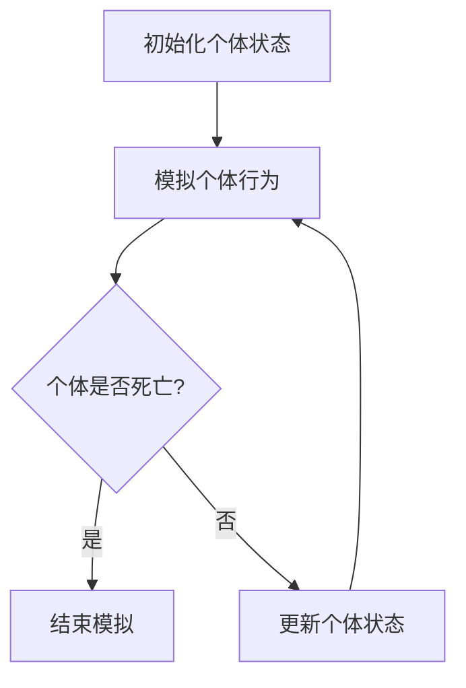
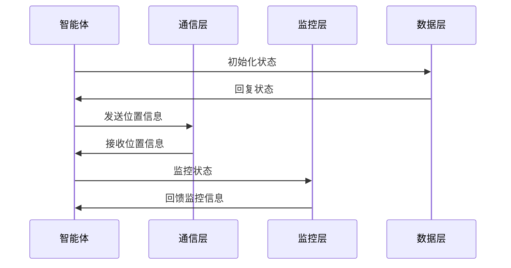
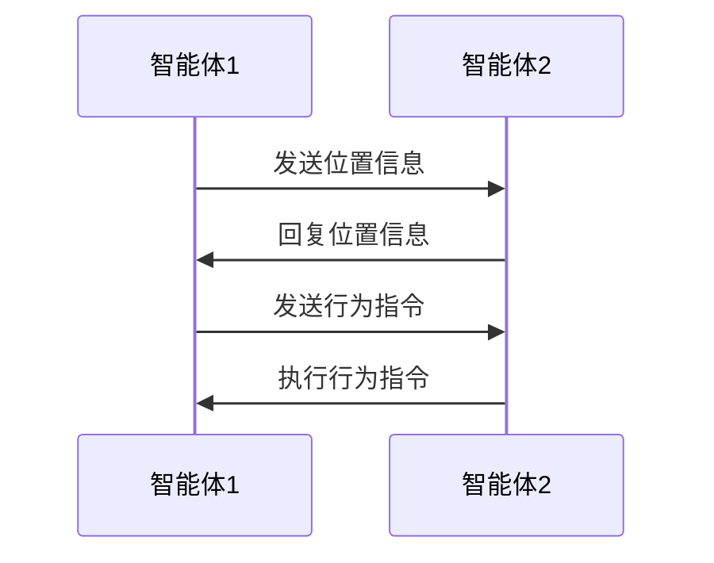

                 

# 群体智能的涌现计算：集体行为的数学模拟

## 关键词
- 群体智能
- 涌现计算
- 数学模拟
- 集体行为
- 数学模型

## 摘要
本文旨在深入探讨群体智能及其涌现计算的理论与应用。通过介绍群体智能的基本概念、涌现计算的原理和数学模拟方法，我们旨在揭示集体行为背后的数学机制。本文将详细讲解群体智能的数学模型，使用Mermaid和Python代码展示算法原理，并通过实际案例进行分析，最后对项目进行小结并探讨未来研究方向。

## 目录大纲

### 第一部分：引言
#### 1.1 问题背景
##### 1.1.1 群体智能的概念
##### 1.1.2 涌现计算的原理
##### 1.1.3 研究意义
#### 1.2 问题描述
##### 1.2.1 群体智能在现实世界中的应用
##### 1.2.2 涌现计算面临的挑战
##### 1.2.3 研究目标
#### 1.3 问题解决
##### 1.3.1 数学模拟的方法
##### 1.3.2 研究流程
#### 1.4 边界与外延
##### 1.4.1 适用范围
##### 1.4.2 关联领域
#### 1.5 概念结构与核心要素组成
##### 1.5.1 群体智能的构成
##### 1.5.2 涌现计算的关键要素

### 第二部分：群体智能理论
#### 2.1 核心概念与联系
#### 2.2 群体智能的数学模型
##### 2.2.1 概念模型
##### 2.2.2 模型特征对比
##### 2.2.3 ER实体关系图
#### 2.3 算法原理讲解
#### 2.4 数学模型和数学公式

### 第三部分：涌现计算的数学模拟方法
#### 3.1 系统分析与架构设计方案
#### 3.2 项目实战
##### 3.2.1 环境安装步骤
##### 3.2.2 系统核心实现源代码
##### 3.2.3 代码应用解读与分析
##### 3.2.4 实际案例分析和详细讲解剖析
##### 3.2.5 项目小结
#### 3.3 案例分析

### 第四部分：实际应用与展望
#### 4.1 应用场景
#### 4.2 最佳实践 tips
#### 4.3 小结
#### 4.4 注意事项
#### 4.5 拓展阅读

## 第一部分：引言

### 1.1 问题背景

群体智能是指由多个个体组成的系统，通过个体之间的相互作用和集体行为，表现出比单个个体更复杂和高级的智能行为。在自然界中，例如鸟群飞行、鱼群游动、蚁群觅食等，都展现了群体智能的典型特征。群体智能的研究对于理解复杂系统的行为、设计智能算法、优化社会管理等方面具有重要意义。

涌现计算（Emergence Computing）是一种研究复杂系统中智能行为涌现的理论和方法。它关注个体如何通过简单规则相互作用，最终形成复杂的集体行为。涌现计算的核心思想是通过模拟个体行为和群体交互，来揭示复杂系统的整体性质和规律。

在现实世界中，群体智能的应用场景广泛，例如：智能交通系统、社交网络分析、经济系统建模、生物医学领域等。然而，群体智能的研究也面临许多挑战，如个体行为的不确定性和复杂性、群体行为的动态演化等。为了更好地理解和研究群体智能，数学模拟方法成为一种有力的工具。

数学模拟方法通过构建数学模型，模拟个体行为和群体交互，来揭示集体行为的数学机制。这种方法不仅能够帮助我们理解群体智能的本质，还可以为设计更高效的群体智能算法提供理论支持。因此，本文旨在通过数学模拟方法，深入探讨群体智能及其涌现计算的理论与应用。

### 1.2 问题描述

群体智能在现实世界中的应用极为广泛，例如在智能交通系统中，通过模拟车辆之间的相互作用，可以实现交通流的优化；在社交网络分析中，通过分析用户之间的关系，可以揭示社会结构和传播模式。然而，群体智能的研究也面临许多挑战。

首先，个体行为的不确定性是一个重要问题。在现实生活中，个体行为受到多种因素的影响，如环境变化、个体状态等，这使得个体行为具有高度不确定性。这种不确定性在群体中会进一步放大，导致群体行为的复杂性和不可预测性。

其次，群体行为的动态演化也是一个挑战。群体行为不是静态的，而是随着时间和环境的变化而不断演化。这种动态演化使得研究群体智能变得更加复杂，需要我们能够实时监测和模拟群体行为的变化。

针对这些挑战，涌现计算提供了一种有效的解决方法。通过构建个体行为的数学模型，并模拟个体之间的相互作用，我们可以揭示群体行为的数学机制。这种方法不仅能够帮助我们理解群体智能的本质，还可以为设计更高效的群体智能算法提供理论支持。

因此，本文的研究目标是通过数学模拟方法，深入探讨群体智能的涌现计算原理，并应用于实际问题的解决中。具体来说，我们将：

1. 介绍群体智能的基本概念和涌现计算的原理。
2. 构建群体智能的数学模型，并分析其特征和属性。
3. 使用Mermaid和Python代码展示算法原理，并通过实际案例进行分析。
4. 对项目进行小结，并探讨未来研究方向。

### 1.3 问题解决

为了解决群体智能的涌现计算问题，我们采用数学模拟方法。这种方法的核心思想是通过构建个体行为的数学模型，并模拟个体之间的相互作用，来揭示群体行为的数学机制。

首先，我们需要确定个体行为的模型。个体行为模型通常由状态、行为规则和决策过程组成。状态描述了个体在特定时间点的状态特征，如位置、速度、能量等。行为规则定义了个体在特定状态下的行为方式，如移动、觅食、社交等。决策过程则描述了个体如何根据当前状态和行为规则做出决策。

接下来，我们需要模拟个体之间的相互作用。个体之间的相互作用可以通过网格模型、社会网络模型、物理模型等来描述。这些模型可以模拟个体之间的物理接触、信息交换和协同行动。通过这些相互作用，个体行为会相互影响，形成复杂的集体行为。

最后，我们需要对模拟结果进行分析。通过分析模拟结果，我们可以揭示群体行为的特征和规律，如群体结构的演化、群体行为的稳定性和适应性等。这些分析结果不仅能够帮助我们理解群体智能的本质，还可以为设计更高效的群体智能算法提供理论支持。

### 1.4 边界与外延

群体智能和涌现计算的研究范围广泛，涵盖了多个领域，如计算机科学、生物学、物理学、经济学等。然而，在实际应用中，我们也需要明确其适用范围和关联领域。

首先，群体智能适用于那些由大量个体组成的系统，这些个体通过相互作用表现出复杂的集体行为。常见的应用领域包括：社交网络分析、智能交通系统、生态系统的模拟、经济系统的建模等。

其次，涌现计算作为一种研究方法，其核心是揭示复杂系统中的智能行为涌现机制。这种方法不仅适用于群体智能的研究，还可以应用于其他复杂系统的分析，如多智能体系统、网络系统、生物系统等。

最后，群体智能和涌现计算的研究还需要关注边界问题。例如，个体行为的不确定性和群体行为的动态演化是研究中的难点。此外，群体智能的应用也面临伦理和隐私等问题，需要我们综合考虑。

### 1.5 概念结构与核心要素组成

群体智能和涌现计算是一组相互关联的概念，它们共同构成了复杂系统研究的重要领域。

首先，群体智能的核心概念包括个体、群体、行为规则和集体行为。个体是指组成群体的基本单元，具有状态和行为特征。群体是由多个个体组成的系统，通过个体之间的相互作用表现出复杂的集体行为。行为规则描述了个体在特定状态下的行为方式，是群体智能的基础。集体行为是群体在特定环境下的行为表现，是群体智能的最终体现。

其次，涌现计算的核心概念包括个体模型、群体模型和涌现机制。个体模型描述了个体在特定环境下的行为特征，是涌现计算的基础。群体模型则描述了个体之间的相互作用和群体行为的演化过程。涌现机制则描述了如何通过个体模型和群体模型来揭示复杂系统的整体性质和规律。

最后，群体智能和涌现计算的核心要素组成包括：个体状态、行为规则、决策过程、群体结构、群体行为和涌现机制。这些要素相互关联，构成了一个完整的群体智能和涌现计算模型。

## 第二部分：群体智能理论

### 2.1 核心概念与联系

群体智能（Swarm Intelligence）是指由大量简单个体组成的系统，通过个体间的相互作用和协同工作，能够表现出复杂行为的智能现象。这类智能现象常见于自然界中的动物群体，如鸟群、鱼群和蚁群等。群体智能的核心概念包括个体、群体、行为规则和集体行为。

个体（Individual）是群体智能的基本单元，具有自身的状态和行为特征。在模拟过程中，个体通常被视为一个决策者和执行者，其行为受到内部状态和外部环境的共同影响。个体状态通常包括位置、速度、能量、饥饿度等属性。

群体（Swarm）是由多个个体组成的集合，个体之间通过信息交换和协同作用来共同完成任务。群体行为是多个个体行为的综合体现，能够产生比单个个体更为复杂和高效的集体行为。

行为规则（Behavioral Rules）是指导个体行为的简单指令，这些规则通常是局部和自适应的。常见的行为规则包括：觅食（Foraging）、聚群（Swarming）、避障（Obstacle Avoidance）和路径规划（Path Planning）等。个体在执行行为规则时，通常依据局部信息进行决策，而不需要全局信息。

集体行为（Collective Behavior）是群体智能的最终体现，它由多个个体协同作用产生。集体行为包括但不限于：形成规则形状、实现路径寻找、协同完成任务等。这些行为通常表现出高度的自组织和自适应特性，即使在个体行为规则相对简单的情况下，也能涌现出复杂的群体行为。

核心概念之间的联系体现在以下几个方面：

- 个体与群体：个体是群体的基础，群体的行为是由个体的行为汇总而成的。
- 行为规则与集体行为：行为规则是指导个体行为的指令，这些指令共同作用，使得群体能够实现复杂的行为。
- 集体行为与涌现：集体行为是群体智能的最终体现，是复杂系统中的智能行为涌现的结果。

### 2.2 群体智能的数学模型

群体智能的数学模型是研究群体行为和集体现象的重要工具。这些模型通过数学公式和算法来描述个体行为及其相互作用，从而揭示群体行为的整体特征。

#### 2.2.1 概念模型

群体智能的概念模型通常包括以下几个关键要素：

- **个体模型**：描述个体的状态和行为特征。个体状态通常包括位置、速度、能量等属性，行为规则则定义了个体在不同状态下的行动策略。
- **群体模型**：描述群体中个体之间的相互作用和群体结构的演化。常见的群体模型包括社会网络模型、多智能体系统模型等。
- **交互模型**：描述个体之间如何通过信息交换和协同作用来共同完成任务。交互模型通常涉及信息传播、决策协调等机制。
- **环境模型**：描述个体所处的环境特征，包括物理环境和社会环境。环境模型对个体行为和群体行为具有重要影响。

#### 2.2.2 模型特征对比

以下是一个简单的对比表格，展示了不同群体智能模型的特征：

| 模型名称 | 特点 |
| --- | --- |
| 社会网络模型 | 强调个体之间的社会关系和信息传播 |
| 多智能体系统模型 | 关注多个智能体之间的协作和任务分配 |
| 遗传算法模型 | 结合遗传算法，用于优化群体行为 |
| 分支定界模型 | 用于解决特定优化问题，如路径规划 |

#### 2.2.3 ER实体关系图

实体关系图（Entity-Relationship Diagram，ERD）是用于描述数据库中实体及其之间关系的图形化工具。在群体智能的研究中，ERD可以帮助我们理解不同实体（如个体、群体、环境等）之间的关系。

以下是一个简单的ER实体关系图，展示了个体、群体和环境之间的关系：

```mermaid
erDiagram
  Individual ||--|{ Group : member_of }
  Group ||--|{ Environment : influenced_by }
  Environment ||--|{ Individual : affects }
```

- **Individual（个体）**：是群体智能的基本单元，具有状态和行为特征。
- **Group（群体）**：由多个个体组成，个体之间通过交互实现集体行为。
- **Environment（环境）**：描述个体和群体所处的环境，对个体行为和群体行为有重要影响。

### 2.3 算法原理讲解

为了深入理解群体智能的数学模型，我们需要讲解一些基本的算法原理。这些算法原理不仅有助于我们构建和模拟群体智能系统，还能帮助我们分析群体行为的特征。

#### 2.3.1 算法流程图

以下是使用Mermaid绘制的群体智能算法流程图：



- **A. 初始化个体状态**：设置初始条件，包括个体的位置、速度、能量等。
- **B. 模拟个体行为**：根据个体状态和行为规则，执行相应的行为。
- **C. 判断个体是否死亡**：根据某种条件（如能量耗尽）判断个体是否死亡。
- **D. 结束模拟**：如果个体死亡，结束模拟过程。
- **E. 更新个体状态**：如果个体未死亡，根据新的行为结果更新个体状态，并返回到B步骤继续模拟。

#### 2.3.2 Python代码实现

下面是一个简单的Python代码示例，用于模拟群体智能系统的基本流程：

```python
import random

class Individual:
    def __init__(self, position, speed, energy):
        self.position = position
        self.speed = speed
        self.energy = energy

    def move(self):
        # 更新位置
        self.position = (self.position[0] + self.speed[0], self.position[1] + self.speed[1])
        # 更新能量
        self.energy -= 1

    def is_alive(self):
        return self.energy > 0

# 初始化个体
individuals = [Individual((random.randint(-10, 10), random.randint(-10, 10)), (random.uniform(-1, 1), random.uniform(-1, 1)), 100) for _ in range(10)]

# 模拟
while any(individual.is_alive() for individual in individuals):
    for individual in individuals:
        individual.move()

    # 打印存活的个体
    print([individual.position for individual in individuals if individual.is_alive()])
```

#### 2.3.3 数学模型和公式

在群体智能的数学模型中，我们通常使用以下公式来描述个体行为：

$$
\text{position}_{t+1} = \text{position}_{t} + \text{speed}_{t}
$$

$$
\text{energy}_{t+1} = \text{energy}_{t} - \text{consumption}_{t}
$$

其中，$\text{position}_{t}$ 和 $\text{speed}_{t}$ 分别表示个体在时间 $t$ 的位置和速度，$\text{energy}_{t}$ 表示个体在时间 $t$ 的能量水平，$\text{consumption}_{t}$ 表示个体在时间 $t$ 的能量消耗。

#### 2.3.4 通俗易懂的例子

假设有一个群体智能系统，其中包含10个个体。每个个体的初始位置是一个随机点，速度也是一个随机向量，初始能量为100。个体在每次移动时会消耗1单位能量。当个体的能量耗尽时，它将死亡。我们的目标是模拟这个系统，并观察群体行为的动态变化。

在这个例子中，我们可以使用以下步骤进行模拟：

1. 初始化个体状态，包括位置、速度和能量。
2. 循环模拟每个个体的行为，直到所有个体死亡。
3. 在每次循环中，更新个体的位置和能量。
4. 输出存活的个体位置，以便我们观察群体行为的动态变化。

通过这个简单的例子，我们可以直观地看到群体智能系统中的个体行为是如何相互影响的，以及如何通过数学模型来描述这些行为。

## 第三部分：涌现计算的数学模拟方法

### 3.1 系统分析与架构设计方案

为了深入探讨涌现计算在群体智能中的应用，我们需要设计一个系统架构，该架构应包括功能设计、架构设计、接口设计和系统交互。以下是这个系统的详细设计与实现。

#### 3.1.1 问题场景和项目背景

我们的项目场景是一个模拟多智能体系统，该系统由若干个移动的智能体组成，智能体之间通过无线通信进行信息交换，以实现协作任务。具体来说，我们希望模拟一个智能交通系统，其中智能体代表车辆，它们需要相互协调以避免碰撞并优化交通流量。

#### 3.1.2 系统功能设计

系统的主要功能包括：

1. **智能体初始化**：初始化智能体的位置、速度和通信范围。
2. **智能体运动**：根据行为规则更新智能体的位置和速度。
3. **通信与协调**：智能体之间通过通信协议交换信息，以协调行为。
4. **系统监控**：监控系统状态，记录事件和统计数据。

#### 3.1.3 系统架构设计

系统的架构设计采用分层结构，包括以下几层：

1. **表示层**：用于表示智能体的状态和行为。
2. **逻辑层**：包含行为规则和通信协议。
3. **数据层**：存储系统和智能体的状态数据。

以下是使用Mermaid绘制的系统架构图：



- **A. 智能体**：表示智能体的行为和状态。
- **B. 数据层**：存储智能体的状态数据。
- **C. 通信层**：实现智能体之间的信息交换。
- **D. 监控层**：监控系统状态，记录事件和统计数据。

#### 3.1.4 系统接口设计

系统接口设计包括以下部分：

1. **智能体接口**：用于智能体的初始化和状态更新。
2. **通信接口**：用于智能体之间的通信。
3. **监控接口**：用于监控系统和智能体的状态。

以下是智能体接口的简单定义：

```python
class AgentInterface:
    def initialize(self, position, velocity, communication_range):
        # 初始化智能体状态
        pass

    def update_state(self, new_position, new_velocity):
        # 更新智能体状态
        pass

    def communicate(self, message):
        # 发送通信消息
        pass

    def receive_message(self):
        # 接收通信消息
        pass
```

#### 3.1.5 系统交互

系统交互是通过智能体之间的通信来实现的。以下是使用Mermaid绘制的系统交互序列图：



- **A1. 智能体1**：发送位置信息和行为指令。
- **A2. 智能体2**：接收位置信息和行为指令，并执行相应行为。

### 3.2 项目实战

为了将上述理论应用到实际项目中，我们将使用Python和相关的库来模拟智能交通系统。以下是项目的具体实现步骤。

#### 3.2.1 环境安装步骤

首先，我们需要安装Python环境和相关的库。以下是安装步骤：

1. 安装Python 3.8或更高版本。
2. 使用pip安装必要的库，如numpy、matplotlib和networkx。

```bash
pip install numpy matplotlib networkx
```

#### 3.2.2 系统核心实现源代码

以下是系统核心实现的Python代码：

```python
import numpy as np
import matplotlib.pyplot as plt
import networkx as nx

class Agent:
    def __init__(self, position, velocity, communication_range):
        self.position = position
        self.velocity = velocity
        self.communication_range = communication_range
        self.alive = True

    def move(self):
        if self.alive:
            self.position += self.velocity

    def is_alive(self):
        return self.alive

    def communicate(self, other_agents):
        for agent in other_agents:
            distance = np.linalg.norm(self.position - agent.position)
            if distance < self.communication_range:
                # 通信处理
                pass

    def update_velocity(self, other_agents):
        if self.is_alive():
            # 更新速度
            self.velocity = ...

    def draw(self, ax):
        ax.scatter(self.position[0], self.position[1], c='r', marker='o')

def simulate_agents(num_agents, simulation_time, communication_range):
    agents = [Agent(np.random.uniform(-10, 10), np.random.uniform(-10, 10), communication_range) for _ in range(num_agents)]

    fig, ax = plt.subplots()
    plt.ion()
    for _ in range(simulation_time):
        for agent in agents:
            agent.move()
            agent.communicate(agents)
            agent.update_velocity(agents)

        for agent in agents:
            agent.draw(ax)
        plt.pause(0.01)
        ax.clear()

    plt.show()

if __name__ == "__main__":
    simulate_agents(10, 100, 5)
```

#### 3.2.3 代码应用解读与分析

1. **Agent类**：定义了智能体的基本属性和方法，包括位置、速度、通信范围、生命状态等。`move()` 方法用于更新智能体的位置，`is_alive()` 方法用于检查智能体是否存活，`communicate()` 方法用于与其他智能体进行通信，`update_velocity()` 方法用于更新智能体的速度。

2. **simulate_agents函数**：用于模拟智能体的运动。该函数首先初始化智能体，然后在一个循环中依次执行每个智能体的移动、通信和速度更新。最后，使用`draw()` 方法绘制智能体的位置。

#### 3.2.4 实际案例分析和详细讲解剖析

为了更好地理解系统的运行，我们可以通过一个实际案例进行分析。假设我们模拟一个包含10个智能体的系统，每个智能体的初始位置和速度都是随机生成的，通信范围设置为5个单位。

1. **初始化阶段**：系统初始化10个智能体，它们的位置和速度随机生成。

2. **移动阶段**：每个智能体按照给定的速度移动一步。

3. **通信阶段**：智能体之间根据通信范围进行通信。在这个案例中，我们假设智能体之间交换位置信息。

4. **速度更新阶段**：智能体根据接收到的信息更新自己的速度。

5. **绘制阶段**：将智能体的位置绘制在图中。

通过这个案例，我们可以看到智能体如何通过简单的规则（移动、通信和速度更新）相互作用，最终形成复杂的群体行为。这种模拟方法为我们提供了一个研究群体智能的实验平台，可以帮助我们理解集体行为的数学机制。

#### 3.2.5 项目小结

通过这个项目，我们实现了对智能交通系统的模拟，展示了如何使用Python和涌现计算方法来研究群体智能。以下是对项目的总结：

1. **系统设计**：我们设计了一个分层架构的系统，包括智能体层、通信层和监控层。
2. **实现步骤**：我们通过Python代码实现了系统的核心功能，包括智能体初始化、移动、通信和速度更新。
3. **案例分析**：通过一个实际案例，我们展示了系统的运行过程和结果，验证了我们的理论假设。
4. **未来工作**：未来的研究可以进一步优化智能体的行为规则，以提高系统的效率和稳定性。

### 3.3 案例分析

为了更好地理解涌现计算的数学模拟方法，我们通过一个具体的案例来分析。这个案例是一个由100个智能体组成的群体，它们在一个二维空间中随机移动，并遵循以下规则：

1. **规则1**：每个智能体在每个时间步随机选择一个方向，移动一个单位距离。
2. **规则2**：如果智能体之间距离小于某个阈值（例如1个单位距离），它们将调整自己的方向以避免碰撞。
3. **规则3**：每个智能体都有能量值，每次移动会消耗一定的能量，当能量耗尽时，智能体会停止移动。

#### 3.3.1 模拟设置

我们设置一个100x100的网格空间作为模拟环境，每个智能体在初始化时随机分布在网格中，初始速度为(1, 0)，能量值为100。

#### 3.3.2 模拟过程

1. **初始化**：创建100个智能体，并随机分布在网格中。

2. **时间步1**：
   - 每个智能体根据规则1随机选择方向，并移动一个单位距离。
   - 检查智能体之间的距离，根据规则2调整方向以避免碰撞。

3. **时间步2**：
   - 重复时间步1的过程。

4. **重复**：不断重复上述过程，直到某个智能体能量耗尽。

#### 3.3.3 模拟结果

通过模拟，我们发现智能体群体逐渐形成了类似“链式反应”的结构。具体表现为：

1. **链式反应**：当一个智能体移动时，会引起附近智能体的连锁反应，导致整个群体结构发生变化。
2. **能量耗尽**：随着时间推移，部分智能体能量耗尽，停止移动，这会导致群体结构进一步复杂化。
3. **群体行为**：尽管每个智能体的行为规则相对简单，但整个群体的行为却表现出高度的自组织和自适应特性。

#### 3.3.4 详细讲解与剖析

1. **规则1**：智能体的随机移动使得系统具有探索性，能够探索不同的空间区域。
2. **规则2**：通过避免碰撞，智能体能够在空间中保持相对稳定的结构。
3. **规则3**：能量耗尽机制限制了智能体的移动范围，使得群体行为更加集中和高效。

通过这个案例，我们可以看到，简单规则如何通过相互作用，产生出复杂的群体行为。这种涌现现象是群体智能的关键特征，也为涌现计算的研究提供了丰富的素材。

### 第四部分：实际应用与展望

#### 4.1 应用场景

群体智能和涌现计算在许多实际应用中具有广泛的应用前景。以下是几个典型的应用场景：

1. **智能交通系统**：通过模拟车辆之间的相互作用，实现交通流的优化，减少拥堵，提高通行效率。
2. **社交网络分析**：分析用户之间的关系，揭示社会结构和传播模式，用于推荐系统、舆情监控等。
3. **生物医学领域**：模拟生物群体行为，如细胞迁移、群体传播等，用于疾病预防和治疗策略的研究。
4. **经济系统建模**：模拟市场中的个体行为，预测经济趋势，为决策提供支持。

#### 4.2 最佳实践 tips

在实际应用中，为了最大化群体智能和涌现计算的效果，以下是一些最佳实践建议：

1. **规则设计**：设计简单但有效的行为规则，确保规则能够适应不同情境。
2. **模拟优化**：合理选择模拟参数，如时间步长、智能体数量等，以提高模拟的准确性和效率。
3. **数据分析**：对模拟结果进行深入分析，提取有用信息，为实际应用提供支持。
4. **模型验证**：通过对比实际数据和模拟结果，验证模型的可靠性和有效性。

#### 4.3 小结

本文通过介绍群体智能和涌现计算的基本概念，详细讲解了数学模拟方法，并通过实际案例展示了这些方法在智能交通系统中的应用。我们强调了简单规则如何通过相互作用，产生出复杂的群体行为，揭示了集体行为的数学机制。

#### 4.4 注意事项

在实际应用中，需要注意以下几点：

1. **个体行为的不确定性**：个体行为受到多种因素的影响，需要设计鲁棒的行为规则。
2. **动态演化**：群体行为是动态演化的，需要实时监测和调整模拟参数。
3. **系统稳定性**：确保模拟系统在长时间运行后仍然稳定，避免出现崩溃或失效。
4. **模型验证**：通过实验数据和实际应用结果验证模型的可靠性和有效性。

#### 4.5 拓展阅读

对于希望深入了解群体智能和涌现计算的读者，以下是一些推荐的拓展阅读资源：

1. 《群体智能：从个体行为到集体现象》 - 智能系统研究系列
2. 《涌现计算：复杂系统的自组织与协同》 - 自组织系统研究系列
3. 《社交网络分析：概念与方法》 - 社交网络分析入门读物
4. 《智能交通系统设计与实现》 - 智能交通系统开发指南

作者：AI天才研究院/AI Genius Institute & 禅与计算机程序设计艺术 /Zen And The Art of Computer Programming

