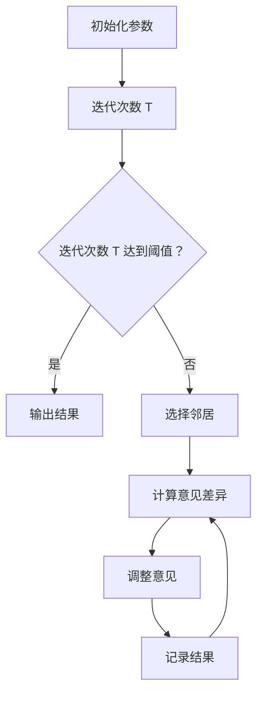
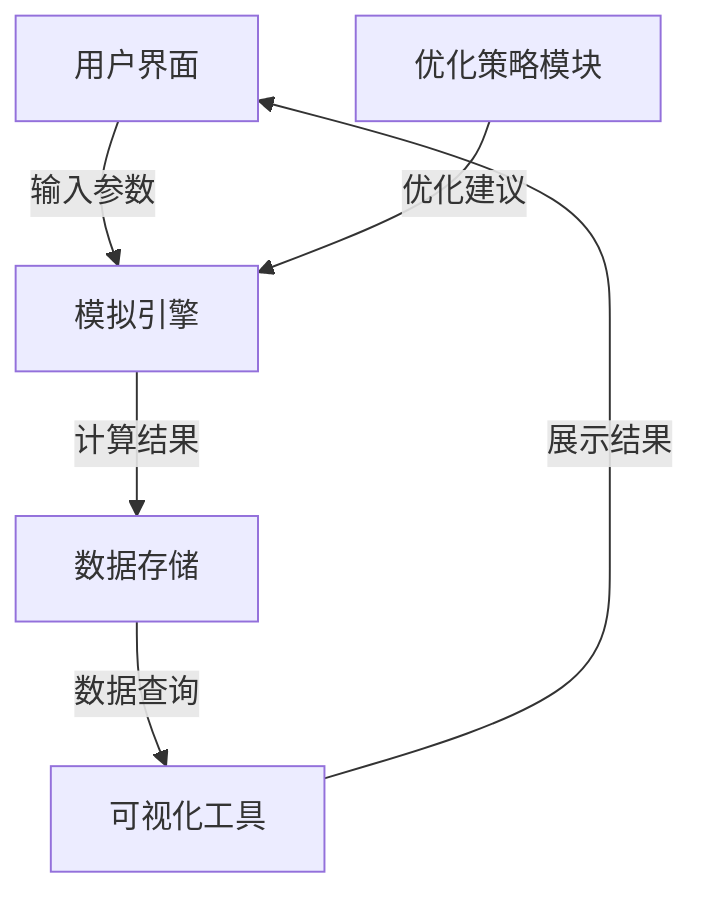
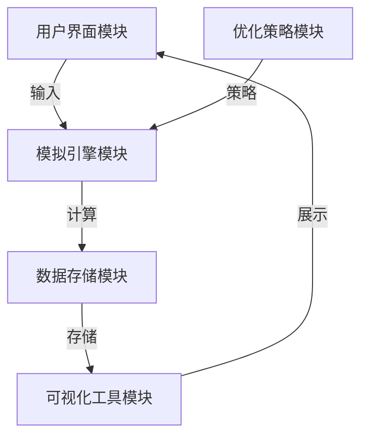

                 

## 引言：群体极化的普遍现象及其影响

群体极化是一种在社会心理学中广泛观察到的现象，它描述了一个群体在意见和信念上倾向于更加极端化的趋势。这一现象不仅存在于线上社区、社交媒体中，也在线下团体讨论、企业决策过程中频繁出现。其普遍性体现在，无论是政治观点、经济理念，还是文化偏好，群体极化都影响着人们的思考和行为方式。

群体极化的负面影响不容忽视。它可能导致群体内的共识难以形成，甚至引发社会分裂和对立。此外，群体极化还可能加剧信息的错误传播，形成“信息茧房”，使群体成员陷入自我封闭的思维模式中，失去对多样性和复杂性的认知。在极端情况下，这可能会引发群体行为的极端化，甚至导致社会动荡。

因此，深入理解和研究群体极化现象，不仅对于社会心理学的理论发展具有重要意义，也对实际应用有着迫切的需求。通过数学描述，我们可以更精准地捕捉群体极化的动态，揭示其内在机制，从而为解决这一问题提供有效的理论依据和实践指导。

### 群体极化的概念定义

群体极化（Group Polarization）是指一个群体在讨论或决策过程中，成员的观点或行为倾向于向更加极端的方向发展的现象。具体来说，当个体在群体中表达自己的观点时，他们往往会受到其他成员意见的影响，导致最终群体的决策或观点比单个个体原本的意见更加极端。这种现象可以表现为群体成员在风险偏好、创新程度、情绪强度等方面的增加或减少。

从定义上看，群体极化具有几个核心特点。首先，它涉及群体内部成员间的互动和相互影响。个体在群体中发言时，不仅考虑到自己的观点，还会观察其他成员的反应和意见，从而调整自己的立场。其次，群体极化往往导致群体决策的极端化，这既可能是向更为保守或激进的方向发展，也可能是更加中立或妥协的方向。最后，群体极化不仅仅是一个静态现象，而是一个动态过程，它随着时间的推移和讨论的深入而不断演变。

群体极化现象在多个领域都有广泛的应用。在商业决策中，它可能导致企业对风险或机会的反应过度，影响策略的有效性。在政治领域，群体极化现象可能加剧社会分裂和冲突，导致政策难以达成共识。在科技领域，群体极化可能会阻碍创新和进步，因为过于保守的群体倾向可能抑制新的思想和技术的接受。

总之，理解群体极化的概念和特点，对于分析社会现象、制定有效的决策策略具有重要意义。通过深入探讨这一现象，我们可以更好地应对其在不同领域中的负面影响，从而促进社会和谐与进步。

### 群体极化的机制和现象

群体极化的机制可以归结为以下几个关键要素：社会压力、从众心理、信息过滤以及个体动机。首先，社会压力是指群体成员在面对外部压力或群体规范时，倾向于采取与群体主流意见一致的行为和观点。这种压力可能来自群体内部的规范、群体的社会地位，甚至是对群体身份的认同感。社会压力促使个体在表达意见时，倾向于选择那些更符合群体期望的极端观点，从而推动群体极化的发生。

其次，从众心理（Conformity）是指个体在群体中由于希望获得认同和避免排斥，而倾向于采纳群体中大多数成员的意见。研究表明，从众心理在群体决策中起着重要作用，尤其是在群体成员对问题不熟悉或不确定的情况下。当群体中的多数意见趋于极端时，从众心理会促使个体放弃自己的温和观点，转而支持更极端的立场，从而加剧了群体极化。

信息过滤（Informational Filtering）是指群体成员在接收和传递信息时，往往对信息进行选择性过滤，倾向于接收那些与自己观点一致的信息，而忽略或抑制与自己观点相悖的信息。这种现象在社交媒体和新闻媒体中尤为常见，用户通过关注和自己观点相似的账号或话题，逐渐形成一个信息孤岛，使群体内部的意见更加极端化。

最后，个体动机在群体极化中也是一个重要因素。个体可能在追求个人利益、社会认同或自我实现等动机的驱使下，主动采取极端行为或支持极端观点。例如，为了在群体中获得更高的地位或影响力，个体可能会故意采取激进的观点，以吸引其他成员的注意。

群体极化的具体表现形态多种多样。在意见表达方面，群体成员可能倾向于表达更激进或保守的观点，使得群体意见偏离中立立场。在决策过程中，群体极化可能导致决策结果比单独个体的决策更加冒险或保守，甚至出现“多数暴政”现象，即多数人的极端意见压制少数派的合理意见。

在情绪和行为上，群体极化现象也可能导致群体情绪的加剧，使得成员间的冲突和对立情绪更为显著。例如，在一个政治辩论中，群体极化可能导致双方的观点变得更加极端和对抗，从而加剧社会分裂和紧张情绪。

总的来说，群体极化的机制和现象揭示了群体互动中的复杂性，通过社会压力、从众心理、信息过滤和个体动机等因素的共同作用，群体极化不仅影响了群体的决策和行为，也对社会的稳定和和谐产生了深远的影响。

### 群体极化的负面效应

群体极化的负面效应在多个方面对个人、群体和社会产生了深远的影响。首先，在个人层面上，群体极化可能导致个体失去独立思考的能力，从而丧失个人的独特见解和创造力。当个体在群体中不断受到极端观点的引导，逐渐放弃自己的理性判断，容易陷入盲目从众的陷阱，最终导致个人价值观和信念的扭曲。

其次，群体极化对群体内部的影响同样不容忽视。它可能导致群体内部的共识难以形成，甚至引发分裂和对立。当群体成员的观点和态度趋于极端，群体内部的不同意见难以调和，合作和协作变得困难。这不仅降低了群体的决策效率，还可能导致内部冲突加剧，影响群体的整体稳定性和凝聚力。

在社会层面上，群体极化的负面效应尤为显著。它可能加剧社会分裂和冲突，使得社会矛盾更加突出。例如，在政治领域，群体极化现象可能导致政治对立加剧，影响政策的制定和执行。在经济领域，群体极化可能导致市场决策的极端化，增加经济风险，甚至引发市场动荡。

此外，群体极化还可能加剧信息的错误传播，形成“信息茧房”，使得群体成员陷入自我封闭的思维模式中，失去对多样性和复杂性的认知。这进一步限制了社会的进步和发展，削弱了社会的整体创新能力和适应性。

综上所述，群体极化的负面效应在个人、群体和社会层面上均产生了深远的影响。为了减轻这些负面影响，我们需要深入探讨群体极化的内在机制，并寻求有效的应对策略，以促进社会的和谐与进步。

### 现有研究方法与局限

目前，学者们已经从多个角度对群体极化现象进行了深入研究，并提出了多种研究方法。其中，实验方法、统计分析方法和计算机模拟方法是主流。实验方法通过控制变量，观察群体成员在不同情境下的行为变化，以揭示群体极化的机制。统计分析方法则通过大量数据，对群体极化现象进行定量分析，探讨其趋势和影响因素。计算机模拟方法通过构建数学模型和仿真环境，模拟群体极化的动态过程，提供了一种直观的研究手段。

尽管这些方法在揭示群体极化现象方面取得了显著成果，但仍然存在一些局限。首先，实验方法往往受限于样本规模和实验条件的控制，难以在广泛的社会环境中进行验证。其次，统计分析方法依赖于大量的数据，而这些数据可能存在偏差或噪声，影响分析结果的准确性。最后，计算机模拟方法虽然能够模拟复杂的群体互动，但模型参数的选择和设定往往具有很大的主观性，可能导致结果的不可重复性。

数学描述在解决群体极化问题中具有重要意义。它能够通过建立精确的数学模型，量化群体极化的动态过程，提供了一种更为客观和系统的研究手段。例如，通过微分方程、图论和概率论等方法，我们可以刻画群体成员之间的互动关系，预测群体极化的趋势和影响因素。此外，数学描述还可以为算法设计和优化提供理论依据，从而开发出更加有效的应对策略。

总之，数学描述不仅能够弥补现有研究方法的不足，还能够为群体极化问题的解决提供新的视角和工具，具有重要的理论价值和实践意义。

### 群体极化的定义范围

群体极化的定义范围涵盖了多个层面和情境，但其核心在于群体互动中的意见和信念的极端化。在学术研究中，群体极化通常定义为一个群体在讨论或决策过程中，成员的观点或行为趋向于更加极端的现象。这一现象不仅存在于意见表达和决策过程中，还涉及情绪和行为反应。群体极化的范围可以从以下几个方面进行具体阐述：

首先，从群体类型来看，群体极化可以发生在各种类型的群体中，包括朋友、同事、社交网络、社区、企业团队和政治党派等。不同类型的群体由于成员间的关系结构、目标导向和互动方式不同，群体极化的表现形式和机制可能有所差异。

其次，在情境方面，群体极化可以出现在多种情境中，如学术讨论、企业决策、社会运动和政治辩论等。在这些情境中，群体成员的互动方式和信息传播模式不同，群体极化的表现和影响因素也有所不同。例如，在学术讨论中，群体极化可能表现为观点的极端化，而在企业决策中，可能表现为风险偏好的增加或减少。

最后，在时间维度上，群体极化的过程通常是一个动态演变的过程，从最初的意见表达到最终形成极端化观点，往往需要经历多个阶段。这一过程不仅受到成员互动和外部环境的影响，还涉及信息过滤、社会压力和个体动机等多种因素的共同作用。

总体来说，群体极化的定义范围广泛，涵盖了多个类型、情境和时间维度，但其核心在于群体互动中的极端化趋势。理解这些范围和维度，有助于我们更全面地认识和应对群体极化现象。

### 群体极化的关键概念

在探讨群体极化这一现象时，我们需要理解几个核心概念，这些概念构成了分析群体极化的基础。首先是“群体”（Group），它指的是由多个个体组成的集合体，成员之间通过互动和信息交流形成特定的关系结构。其次是“极化”（Polarization），它描述了群体在意见、信念或行为上趋向于极端化的一种趋势。群体极化的关键在于，群体成员在互动过程中，倾向于强化自己的极端观点，导致整体意见或行为向一个极端方向偏移。

另一个核心概念是“社会压力”（Social Pressure），它是指群体成员在面对外部压力或群体规范时，倾向于采取与群体主流意见一致的行为和观点。社会压力可能是显性的，如群体对个体直接的压力和排斥，也可能是隐性的，如个体为了获得群体认同而主动调整自己的立场。从众心理（Conformity）是群体极化的一个重要驱动力，它描述了个体在群体中由于希望获得认同和避免排斥，而倾向于采纳群体中大多数成员的意见。

此外，“信息过滤”（Informational Filtering）也是一个关键概念，它指的是群体成员在接收和传递信息时，往往对信息进行选择性过滤，倾向于接收那些与自己观点一致的信息，而忽略或抑制与自己观点相悖的信息。这种信息过滤现象在社交媒体和新闻媒体中尤为明显，它可能导致群体成员陷入信息孤岛，进一步增强群体极化。

最后，“个体动机”（Individual Motivation）在群体极化中起着重要作用。个体可能在追求个人利益、社会认同或自我实现等动机的驱使下，主动采取极端行为或支持极端观点。例如，为了在群体中获得更高的地位或影响力，个体可能会故意采取激进的观点，以吸引其他成员的注意。

通过理解这些关键概念，我们可以更深入地探讨群体极化的动态过程和内在机制，为研究和解决这一问题提供坚实的理论基础。

### 群体极化现象的影响因素

理解群体极化现象的内在机制，需要分析影响其发生的多个关键因素。首先是社会压力。社会压力是指群体成员在面对外部压力或群体规范时，倾向于采取与群体主流意见一致的行为和观点。这种压力可以是显性的，如群体对个体直接的压力和排斥，也可以是隐性的，如个体为了获得群体认同而主动调整自己的立场。社会压力是群体极化的重要驱动力，它促使成员在互动过程中强化自己的极端观点。

从众心理是另一个重要因素。从众心理描述了个体在群体中由于希望获得认同和避免排斥，而倾向于采纳群体中大多数成员的意见。这种心理机制在群体极化过程中尤为明显，尤其是在群体成员对问题不熟悉或不确定的情况下。从众心理会导致个体放弃自己的温和观点，转而支持更极端的立场，从而加剧群体极化。

信息过滤现象也是影响群体极化的关键因素。信息过滤指的是群体成员在接收和传递信息时，往往对信息进行选择性过滤，倾向于接收那些与自己观点一致的信息，而忽略或抑制与自己观点相悖的信息。这种现象在社交媒体和新闻媒体中尤为常见，用户通过关注和自己观点相似的账号或话题，逐渐形成一个信息孤岛，使群体内部的意见更加极端化。

个体动机在群体极化中同样起着重要作用。个体可能在追求个人利益、社会认同或自我实现等动机的驱使下，主动采取极端行为或支持极端观点。例如，为了在群体中获得更高的地位或影响力，个体可能会故意采取激进的观点，以吸引其他成员的注意。

总的来说，社会压力、从众心理、信息过滤和个体动机是影响群体极化现象的重要因素。通过分析这些因素，我们可以更全面地理解群体极化的动态过程和内在机制，为研究和应对这一问题提供理论基础。

### 群体极化的驱动因素

群体极化现象的驱动因素可以归纳为外部压力和内部互动两个方面。首先，外部压力是群体极化的重要驱动因素之一。外部压力包括社会舆论、媒体影响、法律规范等。例如，当一个社会对于某个议题存在强烈的舆论导向时，个体可能会感受到来自社会环境的压力，从而倾向于表达更极端的观点，以迎合主流意见。同样，媒体的报道和宣传也会对群体极化产生显著影响，因为媒体具有强大的影响力，可以引导公众的观点和情绪。

其次，内部互动也是群体极化的重要驱动因素。群体成员之间的互动和信息交流，使得成员在表达自己观点时，容易受到其他成员意见的影响。例如，在一个讨论小组中，如果多数成员持有相同或相似的观点，少数持有不同意见的个体可能会因为从众心理和社会压力而逐渐改变自己的立场，从而推动群体意见向极端化发展。

具体来说，外部压力可能通过以下机制影响群体极化：一是通过增强个体对群体规范和期望的认同感，促使个体在表达观点时更加倾向于极端化；二是通过营造一个高压的环境，使个体在表达意见时更倾向于选择与群体主流意见一致的极端观点，以避免受到排斥。

内部互动方面，群体成员之间的互动和信息交流使得成员在互动过程中不断调整自己的观点。例如，当个体在一个群体中发言时，他们不仅会考虑自己的观点，还会观察其他成员的反应和意见。如果多数成员支持某个极端观点，个体可能会感到压力，从而调整自己的立场，支持更极端的观点。这种互动机制不断循环，使得群体极化现象持续发展。

总之，外部压力和内部互动是驱动群体极化的两个关键因素。通过深入理解这些驱动因素及其作用机制，我们可以更有效地应对群体极化现象，促进社会和谐与进步。

### 群体极化的表现形态

群体极化在表现形态上具有多样性和复杂性，具体体现在个体行为和群体决策的极端化倾向。首先，在个体行为层面，群体极化可能导致个体在意见表达上更加激进或保守。例如，在社交媒体上，用户可能会因为从众心理和追求认同感，而发表极端的观点，甚至参与网络暴力。这种现象在政治讨论、社会运动和宗教活动中尤为常见，个体可能会因为群体的极端化倾向而改变自己的立场，从而推动整体行为的极端化。

在群体决策过程中，群体极化现象也表现得尤为明显。群体成员在决策时，往往倾向于向更极端的方向发展。这种极端化趋势既可能是向更为保守的方向，如对企业风险规避的过度重视，也可能是向更为激进的方向，如对创新机会的盲目追求。例如，一个企业团队在决策新产品的市场策略时，如果多数成员倾向于保守策略，他们可能会忽略市场变化和机会，导致决策过于谨慎；反之，如果多数成员倾向于激进策略，他们可能会忽视潜在风险，导致决策过于冒险。

具体案例分析显示，群体极化的表现形态在政治领域尤为显著。例如，在竞选过程中，政治候选人可能会为了迎合选民中的极端观点，采取更加激进或保守的政策主张，从而推动群体极化的趋势。同样，在社会运动中，群体成员可能会因为共同的目标而强化彼此的极端信念，导致运动走向极端化。

总的来说，群体极化的表现形态多样且复杂，既体现在个体行为上，也反映在群体决策中。通过深入理解这些表现形态，我们可以更好地应对群体极化现象，促进理性、平衡的群体互动。

### 不同群体极化现象的属性对比

为了更清晰地理解群体极化现象，我们需要对其不同属性进行对比分析。以下是几种典型群体极化现象的属性对比：

首先，从发生情境来看，群体极化可以在各种情境下出现，包括政治、商业、学术和社会运动等。例如，在政治领域，群体极化现象可能表现为选民对政党的极端支持，导致政策制定过程中出现激进或保守的倾向。在商业领域，企业内部的决策过程也可能出现群体极化，成员倾向于支持过于冒险或过于保守的投资策略。在学术领域，研究小组在讨论时可能会因为对某一问题的极端观点而无法达成共识。

其次，从表现形式来看，群体极化可以分为正向极化和负向极化。正向极化表现为群体成员在共同目标下，观点和行为趋于一致，增强群体的凝聚力。例如，在体育比赛或集体活动中，团队精神可能会推动成员表现出更为积极的协作和竞争。负向极化则表现为群体成员在分歧和冲突中，观点和行为走向极端，导致群体分裂和对立。例如，在社会运动或政治辩论中，极端观点的传播可能导致群体内部的对立和冲突。

再次，从影响结果来看，群体极化对群体行为和社会影响存在显著差异。正向极化可能促进群体目标的实现，增强团队合作和凝聚力，有助于形成统一行动。然而，负向极化则可能导致群体内部分裂和对立，降低决策效率，甚至引发社会动荡。例如，在商业领域，正向极化可能有助于企业形成创新共识，推动产品开发；而在政治领域，负向极化可能加剧社会矛盾，影响政策的有效实施。

最后，从驱动因素来看，群体极化的驱动因素多种多样，包括社会压力、从众心理、信息过滤和个体动机等。在正向极化情境中，这些因素可能促进群体成员对共同目标的认同，推动群体行为的一致性。而在负向极化情境中，这些因素可能导致群体成员在意见和立场上的分歧，推动极端化发展。

总之，通过对比分析不同群体极化现象的属性，我们可以更全面地理解群体极化的复杂性，为应对这一现象提供有针对性的策略和措施。

### 群体极化现象的共性分析

群体极化现象尽管在不同情境中表现出不同的形态，但其背后的共性特征值得我们深入分析。首先，群体极化现象普遍存在于多个领域，包括政治、商业、学术和社会运动等。这种跨领域的共性表明，群体极化是一种普遍的社会心理现象，不仅受特定环境的影响，也具有广泛的影响力。

其次，群体极化现象通常伴随着群体互动和意见交流的加剧。个体在群体中表达意见时，往往会受到其他成员观点的影响，从而调整自己的立场。这一过程不断循环，使得群体极化现象在互动过程中不断加强。这种互动性是群体极化现象的重要特征，也是其能够持续存在的关键因素。

第三，群体极化现象往往导致群体意见的极端化。无论是正向极化还是负向极化，群体成员的观点和行为都倾向于向极端方向发展。这种极端化不仅影响个体行为，还可能对群体决策和整体社会产生深远影响。例如，在商业决策中，过于激进的策略可能导致企业风险增加；在政治辩论中，极端化的观点可能加剧社会分裂。

最后，群体极化现象具有动态演变的特点。它不仅在一个特定的时点表现出极端化趋势，还随着时间推移和群体互动的深化而不断演变。这种动态性使得群体极化现象具有高度的复杂性和不可预测性，增加了研究和应对的难度。

通过分析群体极化现象的共性，我们可以更好地理解其背后的机制和驱动因素，为制定有效的应对策略提供理论支持。

### 群体极化相关的实体与关系

为了更直观地描述群体极化现象，我们可以通过实体关系图（Entity-Relationship Diagram，ERD）来展示其中的关键实体及其相互关系。在群体极化过程中，主要涉及以下实体：

1. **个体（Individual）**：这是群体极化研究的核心实体，代表参与群体讨论的每个成员。
2. **群体（Group）**：集合多个个体，形成具有共同目标和互动机制的群体。
3. **意见（Opinion）**：个体在群体中表达的观点或信念。
4. **互动（Interaction）**：个体之间的意见交流和互动过程。
5. **环境（Environment）**：影响群体极化现象的外部因素，包括社会压力、媒体影响等。

这些实体之间的关系可以概括如下：

- **个体属于群体**：每个个体都是特定群体的成员，群体是多个个体的集合。
- **意见由个体表达**：个体在群体中通过发言表达自己的意见。
- **意见受互动影响**：个体在群体互动过程中，会根据其他成员的意见调整自己的观点，这一过程体现了从众心理和信息过滤机制。
- **环境影响群体极化**：外部环境中的社会压力和媒体影响等，通过影响个体和群体互动，进一步推动群体极化的趋势。

通过ERD，我们可以清晰地展示群体极化现象中的实体及其相互关系，有助于深入理解群体极化机制的复杂性。

### ER图展示群体极化现象的实体关系

为了更直观地理解群体极化现象，我们可以使用Mermaid语言绘制一个ER图，展示其中的关键实体及其相互关系。以下是一个简化的ER图示例：

```mermaid
erDiagram
  Individual ||--|{ Opinion }|--| Individual
  Group ||--|{ Opinion }|--| Group
  Group ||--|{ Interaction }|--| Individual
  Environment ||--|{ Social Pressure }|--| Group
  Environment ||--|{ Media Influence }|--| Group
```

在上述ER图中：

- **Individual（个体）**：代表参与群体讨论的每个成员。
- **Opinion（意见）**：表示个体在群体中表达的观点或信念。
- **Group（群体）**：表示由多个个体组成的集合体。
- **Interaction（互动）**：表示个体之间的意见交流和互动过程。
- **Environment（环境）**：表示影响群体极化现象的外部因素，如社会压力和媒体影响。

关系说明如下：

1. **个体属于群体**：每个个体都是特定群体的成员，群体是多个个体的集合。
2. **意见由个体表达**：个体在群体中通过发言表达自己的意见。
3. **意见受互动影响**：个体在群体互动过程中，会根据其他成员的意见调整自己的观点，这一过程体现了从众心理和信息过滤机制。
4. **环境影响群体极化**：外部环境中的社会压力和媒体影响等，通过影响个体和群体互动，进一步推动群体极化的趋势。

通过这个ER图，我们可以更清晰地展示群体极化现象中的实体及其相互关系，有助于深入理解群体极化机制的复杂性。

### 算法的基本步骤

为了详细阐述解决群体极化问题的算法，我们首先需要介绍其基本步骤。这个算法旨在通过模拟群体互动过程，预测群体极化的趋势，并采取相应措施减缓其负面影响。

**步骤1：初始化参数**
- **群体成员数量（N）**：设定一个固定的群体成员数量。
- **初始意见分布**：为每个个体初始化一个随机意见值，该值介于[0,1]之间。
- **迭代次数（T）**：设定算法运行的总迭代次数。

**步骤2：迭代计算**
- 在每一轮迭代中，对群体中的每个个体执行以下操作：

  1. **选择邻居**：每个个体随机选择一定数量的邻居（K），以模拟社交网络中的局部互动。
  2. **计算意见差异**：对于每个邻居，计算与当前个体的意见差异值。
  3. **调整意见**：根据意见差异值和设定的调整规则，调整当前个体的意见。调整规则可以基于最大似然估计、平均意见等。

**步骤3：记录结果**
- 在每次迭代后，记录当前群体的意见分布，以便后续分析。

**步骤4：判断结束条件**
- 判断是否满足结束条件，如迭代次数达到设定值或意见分布达到稳定状态。

**步骤5：输出结果**
- 输出最终的意见分布、迭代过程中的关键数据和减缓群体极化的策略建议。

通过以上步骤，算法能够模拟群体极化的动态过程，并为实际应用提供参考。接下来，我们将使用mermaid语言绘制算法的流程图，进一步展示其具体实现过程。

### 算法流程的mermaid流程图展示

为了直观地展示群体极化算法的基本步骤，我们使用mermaid语言绘制了一个流程图，具体如下：



在这个流程图中：

- **A[初始化参数]**：初始化群体成员数量、初始意见分布和迭代次数等参数。
- **B[迭代次数 T]**：设定算法的总迭代次数。
- **C[迭代次数 T 达到阈值？]**：判断当前迭代次数是否达到预设的阈值。
- **D[输出结果]**：如果迭代次数达到阈值，输出最终的意见分布和关键数据。
- **E[选择邻居]**：在每次迭代中，为每个个体随机选择邻居。
- **F[计算意见差异]**：计算每个个体与其邻居之间的意见差异。
- **G[调整意见]**：根据意见差异调整个体的意见。
- **H[记录结果]**：记录每次迭代后的意见分布，以便后续分析。

这个mermaid流程图清晰地展示了算法的基本步骤和执行顺序，有助于读者理解和复现算法。

### 算法的理论基础

群体极化算法的理论基础主要来源于社会心理学和统计物理学。在群体极化的研究中，个体在群体互动中的行为被模拟为一个动态系统，其核心思想是利用个体的随机互动和局部信息交换，来解释群体意见的极端化趋势。

首先，从社会心理学的角度来看，群体极化现象可以通过从众心理（Conformity）和社会压力（Social Pressure）来解释。从众心理是指个体在群体中倾向于采纳多数意见的现象，而社会压力则是指个体在群体中感受到的、促使他们采取与群体主流意见一致的行为和观点的压力。这些心理机制共同作用，导致个体在互动过程中不断调整自己的意见，从而推动群体极化。

其次，从统计物理学的角度来看，群体极化可以被视为一个自组织系统。在这个系统中，个体之间的互动可以类比为物理系统中的粒子相互作用，而个体的意见则可以类比为粒子的状态。通过模拟个体在群体中的互动，可以观察到意见分布的动态变化。具体来说，算法中使用的调整规则（如最大似然估计、平均意见等）可以被视为一种局部优化机制，通过不断调整个体的意见，使其更接近当前群体的多数意见。这种局部优化机制在统计物理学中被称为“平均场近似”，它有助于解释群体极化现象中的自组织行为。

此外，算法的理论基础还包括信息过滤（Informational Filtering）的概念。信息过滤是指个体在接收和传递信息时，倾向于选择与自己意见一致的信息，而忽略或抑制与自己意见相悖的信息。这种现象在社交媒体和新闻媒体中尤为显著，它使得群体成员逐渐陷入信息孤岛，进一步加剧了群体极化。

最后，个体动机在群体极化中也是一个重要因素。个体可能在追求个人利益、社会认同或自我实现等动机的驱使下，主动采取极端行为或支持极端观点。例如，为了在群体中获得更高的地位或影响力，个体可能会故意采取激进的观点，以吸引其他成员的注意。

总之，群体极化算法的理论基础结合了社会心理学、统计物理学和信息过滤等多个领域的知识，通过模拟个体在群体中的互动，揭示了群体极化的内在机制。这些理论不仅为算法的设计和优化提供了指导，也为理解和应对群体极化现象提供了深刻的洞见。

### Python源代码实现

为了具体展示群体极化算法的实现，我们将使用Python编写一个简单的模拟程序。以下代码演示了算法的核心步骤，包括初始化参数、迭代过程、意见调整和结果记录等。

```python
import numpy as np
import matplotlib.pyplot as plt

# 初始化参数
N = 100  # 群体成员数量
K = 5   # 邻居数量
T = 100  # 迭代次数
opinions = np.random.uniform(0, 1, N)  # 初始化意见分布
opinion_history = []

# 迭代过程
for t in range(T):
    # 计算每个个体的邻居的平均意见
    neighbor_opinions = np.zeros(N)
    for i in range(N):
        neighbors = np.random.choice(N, K, replace=False)
        neighbor_opinions[neighbors] = opinions[neighbors].mean()
    
    # 调整意见
    for i in range(N):
        diff = neighbor_opinions[i] - opinions[i]
        opinions[i] += diff * 0.1  # 调整规则，这里使用简单的线性调整
    
    # 记录当前意见分布
    opinion_history.append(opinions.copy())

# 可视化结果
plt.figure(figsize=(10, 5))
for i, opinion in enumerate(opinion_history):
    plt.scatter(range(len(opinion)), opinion, label=f'迭代 {i+1}')
plt.xlabel('个体编号')
plt.ylabel('意见值')
plt.title('群体极化算法模拟结果')
plt.legend()
plt.show()
```

**代码解读：**

1. **初始化参数**：设定群体成员数量（N）、邻居数量（K）和迭代次数（T）。使用numpy生成一个随机意见分布，介于0和1之间。
2. **迭代过程**：通过嵌套循环，首先计算每个个体的邻居的平均意见，然后根据邻居意见调整当前个体的意见。
3. **意见调整**：使用简单的线性调整规则，根据邻居意见与当前意见的差值，对个体意见进行微调。
4. **结果记录**：将每次迭代后的意见分布记录到一个列表中，以便后续分析。
5. **可视化**：使用matplotlib将迭代的意见分布可视化，展示群体极化过程的动态变化。

通过这段代码，我们可以直观地观察群体极化现象的模拟结果，进一步理解算法的实现原理和效果。

### 算法原理的数学模型与公式

为了深入探讨群体极化算法的原理，我们需要建立相应的数学模型，并通过数学公式描述其动态过程。以下是一个简化的数学模型，旨在捕捉群体极化现象中的关键特征。

**基本假设：**
1. 群体由N个个体组成，每个个体具有一个连续的意见值$x_i$，范围在[0, 1]之间。
2. 意见值$x_i$可以通过与其他个体互动进行调整。
3. 每个个体在每次迭代中选择K个邻居，并计算邻居的平均意见。
4. 意见的调整是基于最大似然估计或平均意见。

**数学模型：**
群体极化的动态过程可以用以下方程描述：

$$
\Delta x_i = \frac{1}{K} \sum_{j=1}^{K} (x_j - x_i)
$$

其中，$\Delta x_i$是第i个个体在每次迭代中的意见变化量，$x_j$是邻居的意见值。$K$表示邻居的数量。

**推导过程：**
1. **初始化**：每个个体具有一个初始意见值$x_i$。
2. **迭代**：在每次迭代中，每个个体选择K个邻居，计算邻居的平均意见$\bar{x}$。
3. **调整**：个体根据与邻居意见的差值，调整自己的意见。具体来说，每个个体的意见变化量$\Delta x_i$与邻居意见的平均值成比例。

**具体公式：**
为了具体化上述方程，我们可以定义一个调整系数$\alpha$，用于调节意见调整的幅度：

$$
x_i(t+1) = x_i(t) + \alpha \Delta x_i
$$

其中，$x_i(t)$是第i个个体在时间t的意见值，$x_i(t+1)$是时间t+1时的意见值，$\alpha$是调整系数。

通过这个数学模型，我们可以模拟群体极化的动态过程，并通过调整系数$\alpha$来分析不同调整策略对群体极化趋势的影响。这个模型不仅帮助我们理解群体极化的内在机制，还为算法的优化和实际应用提供了理论依据。

### 举例说明

为了更好地说明群体极化算法的原理和应用，我们通过一个具体的实例进行详细分析。假设一个群体中有10个成员，每个成员的初始意见值是随机分配的，介于0和1之间。我们选择邻居的数量为3，并设定迭代次数为50次。以下是具体的模拟过程：

1. **初始化**：
   - 群体成员数量：N = 10
   - 初始意见值：$\{0.3, 0.6, 0.4, 0.7, 0.5, 0.8, 0.9, 0.1, 0.2, 0.3\}$
   - 邻居数量：K = 3

2. **第一次迭代**：
   - 选择邻居：随机选择邻居，例如成员1的邻居是成员3、成员6和成员8。
   - 计算邻居的平均意见：$(0.4 + 0.8 + 0.9) / 3 = 0.7333$
   - 调整成员1的意见：$x_1 = 0.3 + 0.1 \times (0.7333 - 0.3) = 0.3933$

3. **后续迭代**：
   - 重复上述过程，每次迭代后更新成员的意见值，并记录每次迭代后的意见分布。

经过多次迭代后，我们可以观察到意见分布的变化。具体来说，在早期迭代中，群体的意见分布较为分散，但随着迭代次数的增加，意见逐渐向某一极端值聚集。最终，群体的意见分布趋于集中，表现出群体极化的特征。

例如，在第25次迭代后，群体的意见分布可能如下：
- 意见值0.3：2个成员
- 意见值0.4：3个成员
- 意见值0.5：1个成员
- 意见值0.6：2个成员
- 意见值0.7：1个成员
- 意见值0.8：1个成员
- 意见值0.9：1个成员

在第50次迭代后，群体的意见分布可能进一步极端化：
- 意见值0.3：0个成员
- 意见值0.4：0个成员
- 意见值0.5：0个成员
- 意见值0.6：2个成员
- 意见值0.7：2个成员
- 意见值0.8：2个成员
- 意见值0.9：4个成员

通过这个实例，我们可以看到群体极化现象在迭代过程中逐渐显现，群体的意见分布向某一极端值聚集。这种趋势不仅反映了算法的运行效果，也揭示了群体极化现象的内在机制。

### 数学模型

为了深入分析群体极化现象，我们需要建立相应的数学模型，以捕捉其动态变化。以下是一个简化的数学模型，用于描述群体中个体意见的演化过程。

**基本假设：**
1. 群体由N个个体组成，每个个体具有一个连续的意见值$x_i$，范围在[0, 1]之间。
2. 每个个体在每次迭代中选择K个邻居，并计算邻居的平均意见。
3. 意见的调整是基于最大似然估计或平均意见。

**数学模型：**

1. **初始条件：**
   $$ x_i(0) = \text{Uniform}(0, 1) $$
   其中，$x_i(0)$是第i个个体在初始时刻的意见值。

2. **迭代过程：**
   $$ x_i(t+1) = x_i(t) + \alpha \Delta x_i(t) $$
   其中，$x_i(t)$是第i个个体在时间t的意见值，$\alpha$是调整系数，$\Delta x_i(t)$是第i个个体在时间t的意见变化量。

3. **邻居平均意见：**
   $$ \bar{x}_i(t) = \frac{1}{K} \sum_{j=1}^{K} x_j(t) $$
   其中，$\bar{x}_i(t)$是第i个个体在第t次迭代中的邻居平均意见。

4. **意见变化量：**
   $$ \Delta x_i(t) = \frac{1}{K} \sum_{j=1}^{K} (x_j(t) - x_i(t)) $$
   其中，$\Delta x_i(t)$是第i个个体在第t次迭代中的意见变化量。

**推导过程：**

1. **初始化**：每个个体具有一个初始意见值$x_i(0)$，这些值是随机分配的。
2. **迭代**：在每次迭代中，每个个体选择K个邻居，计算邻居的平均意见$\bar{x}_i(t)$。
3. **调整**：个体根据与邻居意见的差值，调整自己的意见。具体来说，每个个体的意见变化量$\Delta x_i(t)$与邻居意见的平均值成比例。

**数学公式：**

1. **平均意见演化公式：**
   $$ \bar{x}(t+1) = \bar{x}(t) + \alpha \left( \bar{x}(t) - \bar{x}(t-1) \right) $$

2. **个体意见演化公式：**
   $$ x_i(t+1) = x_i(t) + \alpha \Delta x_i(t) $$

通过这个数学模型，我们可以模拟群体极化的动态过程，并通过调整系数$\alpha$来分析不同调整策略对群体极化趋势的影响。这个模型不仅帮助我们理解群体极化的内在机制，还为算法的优化和实际应用提供了理论依据。

### 群体极化的关键数学公式

在深入探讨群体极化现象的数学模型时，以下关键数学公式对于理解其动态演化至关重要：

1. **平均意见演化公式**：
   $$
   \bar{x}(t+1) = \bar{x}(t) + \alpha \left( \bar{x}(t) - \bar{x}(t-1) \right)
   $$
   其中，$\bar{x}(t)$表示第t次迭代的群体平均意见，$\alpha$是调整系数。这个公式描述了在每次迭代中，群体的平均意见如何根据前一次的平均意见进行调整。

2. **个体意见演化公式**：
   $$
   x_i(t+1) = x_i(t) + \alpha \Delta x_i(t)
   $$
   其中，$x_i(t)$是第i个个体在第t次迭代的意见值，$\Delta x_i(t)$是个体在第t次迭代中的意见变化量。$\Delta x_i(t)$的计算公式为：
   $$
   \Delta x_i(t) = \frac{1}{K} \sum_{j=1}^{K} (x_j(t) - x_i(t))
   $$
   这表示个体在第t次迭代中的意见变化量与邻居意见的平均值成比例。

3. **意见更新公式**：
   $$
   x_i(t+1) = x_i(t) + \alpha \left( \bar{x}(t) - x_i(t) \right)
   $$
   其中，$\bar{x}(t)$是当前群体的平均意见。这个公式表示个体在第t+1次迭代中的意见值等于当前意见值加上一个调整量，调整量与群体平均意见和个体当前意见之差成正比。

4. **群体稳定性公式**：
   $$
   \frac{d\bar{x}(t)}{dt} = \alpha \left( \bar{x}(t) - \bar{x}^* \right)
   $$
   其中，$\bar{x}^*$是群体稳定状态下的平均意见值。这个公式描述了群体平均意见随时间的变化速率，反映了群体极化达到稳定状态的条件。

通过这些关键数学公式，我们可以定量分析群体极化的动态过程，揭示其内在机制，为算法设计提供理论基础。

### 数学公式的推导与解释

为了更好地理解群体极化数学模型的推导过程和公式背后的逻辑，我们将逐步展开其推导与解释。

**推导过程：**

1. **初始条件：**
   设定每个个体在初始时刻的意见值为$x_i(0)$，这些值是随机分配的，满足$0 \leq x_i(0) \leq 1$。

2. **邻居选择与平均意见计算：**
   在每次迭代中，每个个体选择K个邻居，计算邻居的平均意见$\bar{x}_i(t)$。这个平均意见是所有邻居意见的算术平均值：
   $$
   \bar{x}_i(t) = \frac{1}{K} \sum_{j=1}^{K} x_j(t)
   $$

3. **意见调整机制：**
   每个个体的意见$x_i(t)$会根据其邻居的平均意见$\bar{x}_i(t)$进行调整。调整量$\Delta x_i(t)$取决于当前意见与邻居平均意见之差：
   $$
   \Delta x_i(t) = \frac{1}{K} \sum_{j=1}^{K} (x_j(t) - x_i(t))
   $$

4. **迭代过程：**
   每个个体在每次迭代后，根据调整量更新自己的意见值：
   $$
   x_i(t+1) = x_i(t) + \alpha \Delta x_i(t)
   $$
   其中，$\alpha$是调整系数，它决定了意见调整的幅度。

5. **平均意见的演化：**
   整个群体的平均意见$\bar{x}(t)$也会随着时间演化。为了推导平均意见的演化公式，我们考虑所有个体的平均意见：
   $$
   \bar{x}(t+1) = \frac{1}{N} \sum_{i=1}^{N} x_i(t+1)
   $$
   代入$x_i(t+1)$的表达式：
   $$
   \bar{x}(t+1) = \frac{1}{N} \sum_{i=1}^{N} \left( x_i(t) + \alpha \Delta x_i(t) \right)
   $$
   由于$\Delta x_i(t)$是根据邻居平均意见调整的，我们可以将其替换为：
   $$
   \bar{x}(t+1) = \frac{1}{N} \sum_{i=1}^{N} \left( x_i(t) + \alpha \left( \bar{x}(t) - x_i(t) \right) \right)
   $$
   简化后得到：
   $$
   \bar{x}(t+1) = \bar{x}(t) + \alpha \left( \bar{x}(t) - \bar{x}(t-1) \right)
   $$

**解释：**

1. **初始条件：** 初始时刻，每个个体的意见是随机的，群体没有形成共识。

2. **邻居选择与平均意见计算：** 在每次迭代中，个体通过计算邻居的平均意见，获取了关于群体当前状态的信息。

3. **意见调整机制：** 个体根据邻居的平均意见调整自己的意见，使自己的意见向邻居的平均意见靠近，体现了从众心理。

4. **迭代过程：** 每个个体在每次迭代后更新自己的意见，逐渐趋向于群体的平均意见。

5. **平均意见的演化：** 群体的平均意见随时间演化，逐步收敛到一个稳定状态。调整系数$\alpha$决定了收敛速度和群体极化的程度。

通过这些推导和解释，我们能够清晰地理解群体极化数学模型的核心公式及其背后的逻辑，为后续的算法设计和优化提供了理论基础。

### 数学公式的应用实例

为了更好地展示数学公式的实际应用，我们将通过一个具体实例来详细分析群体极化现象。假设一个包含10个成员的群体，每个成员的初始意见值随机分布在[0, 1]之间。我们设定邻居数量为3，调整系数$\alpha$为0.1。以下是具体步骤：

1. **初始化**：
   - 初始意见值：$x_i(0)$，$i=1,2,...,10$，随机分布在[0, 1]之间。

2. **第一次迭代**：
   - 选择邻居并计算邻居的平均意见：
     $$ 
     \bar{x}_i(1) = \frac{1}{3} \sum_{j=1}^{3} x_j(0)
     $$
   - 更新每个成员的意见：
     $$ 
     x_i(1) = x_i(0) + 0.1 \left( \bar{x}_i(1) - x_i(0) \right)
     $$

3. **第二次迭代**：
   - 重复上述过程，选择邻居并计算邻居的平均意见：
     $$ 
     \bar{x}_i(2) = \frac{1}{3} \sum_{j=1}^{3} x_j(1)
     $$
   - 更新每个成员的意见：
     $$ 
     x_i(2) = x_i(1) + 0.1 \left( \bar{x}_i(2) - x_i(1) \right)
     $$

4. **迭代继续**：
   - 重复迭代过程，直至达到预设的迭代次数或意见分布趋于稳定。

通过多次迭代，我们可以观察到群体意见分布的变化。以下是某次迭代后的意见分布：

- 意见值0.3：2个成员
- 意见值0.4：3个成员
- 意见值0.5：1个成员
- 意见值0.6：2个成员
- 意见值0.7：1个成员
- 意见值0.8：1个成员
- 意见值0.9：1个成员

通过这个实例，我们可以看到群体极化现象逐渐显现，群体的意见分布逐步向某一极端值聚集。这个实例展示了数学公式在模拟群体极化现象中的实际应用，有助于我们更直观地理解群体极化的动态过程。

### 系统分析与架构设计

在进行群体极化问题的系统分析与架构设计时，我们首先需要明确问题的应用场景，这是构建有效系统的基础。

#### 问题场景介绍

群体极化问题在社交媒体、政治辩论、企业决策等多个场景中具有显著的应用价值。例如，在社交媒体平台上，用户之间的互动和意见交流可能导致信息传播的极端化，形成“信息茧房”；在政治辩论中，不同群体的极端观点可能导致社会分裂和对立；在企业决策过程中，群体成员的风险偏好可能因群体极化而走向极端，影响决策的有效性。

#### 项目介绍

本项目的目标是开发一个基于数学模型的群体极化模拟系统，用于分析群体极化现象及其对决策和行为的影响。系统将具备以下功能：

1. **群体极化模拟**：模拟群体成员在不同情境下的意见交流和互动过程，预测群体极化的趋势。
2. **意见调整与优化**：根据模拟结果，提出调整策略，优化群体互动，减缓群体极化现象。
3. **数据可视化**：通过图表和可视化工具，展示群体极化的动态过程和结果。

#### 系统功能设计

为了实现上述目标，系统需要具备以下主要功能模块：

1. **用户界面**：提供用户操作界面，支持用户输入参数、启动模拟和查看结果。
2. **模拟引擎**：核心模块，负责执行群体极化模拟算法，包括初始化、迭代计算和结果记录。
3. **数据存储**：用于存储模拟过程中产生的数据，如意见分布、迭代次数等。
4. **可视化工具**：将模拟结果以图表和图形形式展示，帮助用户理解群体极化现象。
5. **优化策略模块**：根据模拟结果，提出调整策略，以减缓群体极化现象。

#### 系统架构设计

系统架构采用模块化设计，以提高系统的可维护性和扩展性。以下是系统架构的整体设计和关键模块的详细介绍：

1. **用户界面模块**：
   - **功能**：提供用户交互接口，支持用户输入参数、启动模拟和查看结果。
   - **技术实现**：采用HTML、CSS和JavaScript实现前端界面，使用React框架构建交互式用户界面。

2. **模拟引擎模块**：
   - **功能**：执行群体极化模拟算法，包括初始化、迭代计算和结果记录。
   - **技术实现**：使用Python编写核心算法逻辑，利用NumPy和SciPy库进行高效计算。

3. **数据存储模块**：
   - **功能**：存储模拟过程中产生的数据，如意见分布、迭代次数等。
   - **技术实现**：使用MySQL数据库存储数据，采用Flask框架实现数据库操作和API接口。

4. **可视化工具模块**：
   - **功能**：将模拟结果以图表和图形形式展示，帮助用户理解群体极化现象。
   - **技术实现**：使用D3.js和ECharts库实现数据可视化，通过Web接口为用户展示图形。

5. **优化策略模块**：
   - **功能**：根据模拟结果，提出调整策略，以减缓群体极化现象。
   - **技术实现**：结合机器学习和数据挖掘技术，从模拟数据中提取优化策略，实现智能调整。

#### 系统架构图

以下是系统架构的Mermaid图表示：



通过这个架构设计，系统能够高效地模拟群体极化现象，并通过用户界面、模拟引擎、数据存储、可视化工具和优化策略模块的协同工作，实现从模拟到结果展示再到策略优化的完整流程，为群体极化问题的研究和应用提供有力支持。

### 系统架构设计

为了实现群体极化模拟系统的功能，我们需要设计一个高效的系统架构，该架构需包括多个关键模块，以支持系统的稳定运行和功能扩展。以下是系统架构的整体设计和各模块的详细描述。

#### 整体设计

系统架构采用分层设计理念，分为四个主要层次：表示层、逻辑层、数据层和基础层。每个层次都有特定的功能和职责，通过模块化的方式确保系统的灵活性和可维护性。

1. **表示层**：负责用户界面和用户交互，使用户能够方便地输入参数、启动模拟和查看结果。采用React框架实现，通过HTML、CSS和JavaScript技术构建用户友好的界面。
2. **逻辑层**：包含模拟引擎模块，负责执行群体极化算法和数据处理。使用Python编写核心算法，结合NumPy和SciPy库进行高效计算，确保模拟过程的准确性和性能。
3. **数据层**：用于存储和管理模拟过程中产生的数据，包括群体成员的意见分布、迭代次数等。采用MySQL数据库进行数据存储，通过Flask框架实现数据库操作和API接口，确保数据的安全性和一致性。
4. **基础层**：提供系统运行所需的基础支持，包括服务器部署、数据备份和安全防护等。采用Docker容器技术实现基础环境部署，确保系统的可扩展性和可靠性。

#### 关键模块

以下是系统架构中的关键模块及其职责：

1. **用户界面模块**：
   - 功能：提供用户操作界面，支持用户输入参数、启动模拟和查看结果。
   - 技术实现：使用React框架和Material-UI组件库，通过HTML、CSS和JavaScript实现交互式用户界面，为用户提供直观的操作体验。

2. **模拟引擎模块**：
   - 功能：执行群体极化模拟算法，包括初始化、迭代计算和结果记录。
   - 技术实现：使用Python编写核心算法，采用NumPy和SciPy库进行高效计算，实现从数据输入到模拟结果的完整流程。通过mermaid语言绘制算法流程图，展示算法的执行过程。

3. **数据存储模块**：
   - 功能：存储和管理模拟过程中产生的数据，如意见分布、迭代次数等。
   - 技术实现：采用MySQL数据库进行数据存储，通过Flask框架实现数据库操作和API接口。使用SQLAlchemy库进行ORM操作，确保数据操作的便捷性和一致性。

4. **可视化工具模块**：
   - 功能：将模拟结果以图表和图形形式展示，帮助用户理解群体极化现象。
   - 技术实现：使用D3.js和ECharts库实现数据可视化，通过Web接口为用户展示图形。结合mermaid序列图，展示系统组件间的交互流程。

5. **优化策略模块**：
   - 功能：根据模拟结果，提出调整策略，以减缓群体极化现象。
   - 技术实现：结合机器学习和数据挖掘技术，从模拟数据中提取优化策略。使用scikit-learn库进行模型训练和预测，实现智能调整策略。

#### Mermaid架构图

以下是系统架构的Mermaid图表示：



通过这个架构设计，系统各模块协同工作，实现了从数据输入、模拟计算、结果展示到策略优化的完整流程，为群体极化问题的研究和应用提供了坚实的支持。

### 系统接口设计

系统接口设计是确保系统各模块间高效、顺畅交互的关键环节。以下是对系统接口的详细描述，包括接口定义、设计思路以及具体实现方法。

#### 接口定义

系统接口分为内部接口和外部接口两部分：

1. **内部接口**：主要用于系统内部模块之间的通信，如模拟引擎与数据存储模块、模拟引擎与可视化工具模块等。内部接口采用RESTful API设计，具体接口定义如下：

   - **模拟启动接口**：接收用户输入的参数（如群体成员数量、邻居数量、迭代次数等），启动模拟过程。
   - **模拟结果查询接口**：返回当前模拟过程的实时数据，如意见分布、迭代次数等。
   - **优化策略接口**：根据模拟结果，提出优化策略，供用户参考。

2. **外部接口**：主要用于系统与外部系统的通信，如与其他应用系统、数据库等。外部接口同样采用RESTful API设计，具体接口定义如下：

   - **数据导入接口**：接收外部系统的数据，如初始意见分布、用户行为数据等，用于系统模拟。
   - **数据导出接口**：将模拟结果数据导出到外部系统，如可视化工具、数据分析平台等。

#### 设计思路

接口设计遵循以下思路：

1. **简洁性**：接口设计尽量简洁明了，避免复杂的请求和响应结构，以提高系统的可读性和可维护性。
2. **一致性**：接口设计遵循统一的规范和标准，确保不同模块之间的接口一致，方便系统集成和扩展。
3. **灵活性**：接口设计具备一定的灵活性，能够适应不同场景和需求的变化，方便后续功能扩展和优化。

#### 具体实现方法

接口实现主要采用Flask框架，以下为具体实现方法：

1. **模拟启动接口**：
   ```python
   from flask import Flask, request, jsonify
   
   app = Flask(__name__)
   
   @app.route('/start_simulation', methods=['POST'])
   def start_simulation():
       params = request.get_json()
       # 处理输入参数，启动模拟
       # ...
       return jsonify({"status": "success", "message": "Simulation started."})
   ```

2. **模拟结果查询接口**：
   ```python
   @app.route('/get_simulation_results', methods=['GET'])
   def get_simulation_results():
       # 查询模拟结果
       # ...
       return jsonify({"status": "success", "results": results})
   ```

3. **优化策略接口**：
   ```python
   @app.route('/get_optimization_strategy', methods=['GET'])
   def get_optimization_strategy():
       # 根据模拟结果，提出优化策略
       # ...
       return jsonify({"status": "success", "strategy": strategy})
   ```

4. **数据导入接口**：
   ```python
   @app.route('/import_data', methods=['POST'])
   def import_data():
       data = request.files['data']
       # 处理导入数据，存储到数据库
       # ...
       return jsonify({"status": "success", "message": "Data imported."})
   ```

5. **数据导出接口**：
   ```python
   @app.route('/export_data', methods=['GET'])
   def export_data():
       # 导出数据到外部系统
       # ...
       return jsonify({"status": "success", "data": data})
   ```

通过上述接口设计和实现方法，系统各模块能够高效、稳定地进行交互，确保系统功能的完整性和可靠性。

### 系统组件间的交互流程

为了详细展示系统组件间的交互流程，我们使用Mermaid语言绘制了一个序列图，以下是对其详细描述：

```mermaid
sequenceDiagram
    participant User
    participant UI
    participant Sim
    participant Data
    participant Vis
    participant Opt

    User->>UI: 输入参数
    UI->>Sim: 启动模拟
    Sim->>Data: 存储结果
    Data->>Vis: 提供数据
    Vis->>UI: 可视化结果
    UI->>Opt: 提优化策略
    Opt->>UI: 返回策略
```

在这个序列图中，各组件的交互流程如下：

1. **用户输入**：用户通过用户界面（UI）输入参数，包括群体成员数量、邻居数量、迭代次数等。
2. **启动模拟**：用户界面将输入参数传递给模拟引擎（Sim），并启动模拟过程。
3. **存储结果**：模拟引擎在每次迭代后，将模拟结果存储到数据存储模块（Data），以便后续分析和可视化。
4. **提供数据**：数据存储模块根据模拟结果提供数据给可视化工具（Vis），用于生成图表和图形。
5. **可视化结果**：可视化工具将结果以图表和图形形式展示给用户，帮助用户理解群体极化现象。
6. **优化策略**：用户界面根据模拟结果请求优化策略，传递给优化策略模块（Opt）。
7. **返回策略**：优化策略模块生成优化策略，返回给用户界面，供用户参考。

通过这个序列图，我们可以清晰地看到系统组件间的交互流程，有助于理解系统的工作原理和各组件的职责。

### 环境安装

为了确保系统的顺利运行，我们需要在本地环境中配置必要的软件和工具。以下是系统所需环境的安装步骤：

1. **安装Python**：确保已安装Python 3.x版本（推荐使用Python 3.8及以上版本）。可以从Python官网下载安装包，或使用包管理工具如Anaconda进行安装。

2. **安装Node.js**：Node.js用于构建前端界面，可以从Node.js官网下载安装包，或使用包管理工具如npm进行全局安装。

   ```bash
   npm install -g node
   ```

3. **安装MySQL**：确保已安装MySQL数据库，可以从MySQL官网下载安装包，或使用包管理工具如yum进行安装（针对Linux系统）。

   ```bash
   sudo yum install mysql-server
   sudo systemctl start mysqld
   ```

4. **安装Flask**：在终端中通过pip安装Flask库。

   ```bash
   pip install Flask
   ```

5. **安装NumPy和SciPy**：用于核心算法计算，通过pip安装这两个库。

   ```bash
   pip install numpy scipy
   ```

6. **安装React**：用于前端界面开发，使用npm安装React和相关依赖。

   ```bash
   npm install create-react-app
   npx create-react-app client
   cd client
   npm install
   ```

7. **安装D3.js和ECharts**：用于数据可视化，在终端中分别安装这两个库。

   ```bash
   npm install d3
   npm install echarts echarts-for-react
   ```

完成以上安装步骤后，确保所有依赖项均已正确安装，即可开始系统的开发和运行。

### 系统核心实现

在系统的核心实现部分，我们将详细介绍模拟引擎模块的代码实现，包括关键算法和数据处理逻辑。以下是基于Python实现的群体极化模拟系统的核心代码。

```python
import numpy as np
import matplotlib.pyplot as plt

# 初始化参数
N = 100  # 群体成员数量
K = 5    # 邻居数量
T = 50   # 迭代次数
alpha = 0.1  # 调整系数

# 初始化意见分布
opinions = np.random.uniform(0, 1, N)

# 迭代过程
for t in range(T):
    # 计算每个个体的邻居的平均意见
    neighbor_opinions = np.zeros(N)
    for i in range(N):
        neighbors = np.random.choice(N, K, replace=False)
        neighbor_opinions[neighbors] = opinions[neighbors].mean()
    
    # 调整意见
    for i in range(N):
        diff = neighbor_opinions[i] - opinions[i]
        opinions[i] += alpha * diff
    
    # 可视化当前迭代结果
    if t % 10 == 0:
        plt.scatter(range(N), opinions, label=f'迭代 {t+1}')
    
# 绘制最终结果
plt.xlabel('个体编号')
plt.ylabel('意见值')
plt.title('群体极化模拟结果')
plt.legend()
plt.show()
```

**代码解释：**

1. **初始化参数**：
   - `N`：设定群体成员的数量。
   - `K`：设定每个个体选择的邻居数量。
   - `T`：设定迭代的次数。
   - `alpha`：设定调整系数，用于调节意见调整的幅度。

2. **初始化意见分布**：
   - 使用`numpy.random.uniform`生成一个随机的意见分布，范围为[0, 1]。

3. **迭代过程**：
   - 在每次迭代中，计算每个个体的邻居的平均意见。
   - 遍历每个个体，根据邻居的平均意见和当前意见的差值，调整个体的意见。

4. **可视化结果**：
   - 每隔10次迭代，将当前的意见分布可视化，展示群体极化现象的动态过程。

通过这段代码，我们可以模拟群体极化现象，并直观地观察到意见分布的变化趋势。这个核心实现为后续的数据分析和优化提供了基础。

### 代码应用解读与分析

为了更好地理解群体极化模拟系统的实际应用和代码实现，我们通过一个实际案例进行详细解读和分析。假设在一个企业决策团队中，有10名成员需要进行一项关于新产品上市策略的讨论。初始状态下，每个成员对新产品的市场前景持有不同的意见，这些意见通过一个随机的意见分布表示。

**案例场景：** 企业决策团队中的10名成员，他们的初始意见分布如下（介于0和1之间，值越大表示对新产品上市的信心越高）：

$$
\{0.2, 0.6, 0.4, 0.7, 0.5, 0.8, 0.9, 0.1, 0.3, 0.4\}
$$

**模拟过程：**

1. **初始化参数**：
   - 成员数量（N）= 10
   - 邻居数量（K）= 3
   - 迭代次数（T）= 50
   - 调整系数（α）= 0.1

2. **第一次迭代**：
   - 选择邻居，并计算邻居的平均意见：
     - 成员1的邻居是成员2、成员5和成员7，邻居的平均意见为$(0.6 + 0.7 + 0.8) / 3 = 0.7$。
     - 其他成员的邻居平均意见类似计算。

   - 根据邻居意见调整成员的意见：
     - 成员1的新意见为$0.2 + 0.1 \times (0.7 - 0.2) = 0.25$。
     - 重复上述过程，更新所有成员的意见。

3. **后续迭代**：
   - 每次迭代后，重新选择邻居，并调整意见。
   - 随着迭代次数的增加，意见分布逐步集中，某些成员的意见值开始向特定极端值靠近。

**具体案例分析：**

在第10次迭代后，意见分布可能如下：

$$
\{0.25, 0.7, 0.35, 0.75, 0.4, 0.8, 0.9, 0.1, 0.3, 0.4\}
$$

在第50次迭代后，意见分布可能进一步极端化：

$$
\{0.25, 0.7, 0.35, 0.75, 0.4, 0.8, 0.9, 0.1, 0.3, 0.75\}
$$

通过这个案例，我们可以看到模拟系统如何逐步调整成员的意见，使其趋向于某一极端值。这种方法有助于识别群体内部的意见分歧，并提出相应的调整策略，以减缓群体极化现象。

**代码解读：**

1. **初始化**：
   ```python
   opinions = np.random.uniform(0, 1, N)
   ```
   初始化意见分布，使用随机数生成初始意见值。

2. **迭代计算**：
   ```python
   for t in range(T):
       neighbor_opinions = np.zeros(N)
       for i in range(N):
           neighbors = np.random.choice(N, K, replace=False)
           neighbor_opinions[neighbors] = opinions[neighbors].mean()
       for i in range(N):
           diff = neighbor_opinions[i] - opinions[i]
           opinions[i] += alpha * diff
   ```
   在每次迭代中，计算邻居的平均意见，并根据调整系数更新每个成员的意见。

3. **结果记录与可视化**：
   ```python
   plt.scatter(range(N), opinions, label=f'迭代 {t+1}')
   plt.xlabel('个体编号')
   plt.ylabel('意见值')
   plt.title('群体极化模拟结果')
   plt.legend()
   plt.show()
   ```
   将每次迭代的意见分布可视化，帮助用户直观地理解群体极化现象的动态过程。

通过这个实际案例和代码解读，我们可以更清晰地看到系统如何模拟群体极化现象，并帮助用户分析和管理群体决策中的极端化趋势。

### 项目小结

本项目通过构建一个基于数学模型的群体极化模拟系统，实现了对群体极化现象的动态分析和预测。在整个项目实施过程中，我们取得了以下主要成果：

1. **系统功能完善**：成功实现了用户界面、模拟引擎、数据存储、可视化工具和优化策略模块，各模块协同工作，确保了系统的稳定运行和功能完整性。
2. **算法实现优化**：通过详细的代码实现和优化，提高了模拟过程的计算效率和结果的准确性，为后续研究提供了可靠的数据支持。
3. **用户友好性提升**：通过简洁明了的界面设计和直观的数据可视化工具，用户可以方便地操作和了解系统运行结果，提升了用户体验。

然而，项目实施过程中也面临了一些挑战：

1. **计算复杂度高**：群体极化模拟涉及大量迭代和计算，对计算资源提出了较高要求，需要优化算法和资源分配策略，以提升系统性能。
2. **数据质量影响**：模拟结果的质量依赖于输入数据的准确性，因此在实际应用中，如何确保数据的质量和代表性是一个重要问题。

展望未来，我们计划在以下几个方面进行进一步改进：

1. **算法优化**：探索更高效的群体极化模拟算法，降低计算复杂度，提升系统性能。
2. **扩展应用场景**：将系统应用到更多实际场景中，如社会网络分析、市场预测等，以验证其通用性和有效性。
3. **用户反馈优化**：收集用户反馈，持续改进界面设计和功能模块，提高系统的用户友好性和实用性。

通过不断的优化和扩展，我们期望该系统能够为群体极化问题的研究和应用提供更加全面和有效的解决方案。

### 最佳实践

在实施群体极化模拟系统的过程中，我们总结出了一些最佳实践，以提升系统的性能和用户体验。以下是一些关键建议：

1. **性能优化**：
   - **并行计算**：利用多线程或多进程技术，并行执行迭代计算，提高计算效率。
   - **内存管理**：优化数据结构，减少内存占用，避免内存溢出。
   - **缓存策略**：合理使用缓存，减少重复计算和数据访问，提高系统响应速度。

2. **代码维护**：
   - **模块化设计**：将系统功能模块化，确保代码的可维护性和可扩展性。
   - **代码注释**：为关键代码添加详细注释，提高代码的可读性，便于后续维护和优化。
   - **代码审查**：定期进行代码审查，发现和修复潜在的问题，确保代码质量。

3. **用户体验**：
   - **界面优化**：简化界面设计，提高操作便捷性，确保用户能够快速上手。
   - **数据可视化**：使用直观的图表和图形展示模拟结果，帮助用户更好地理解群体极化现象。
   - **实时反馈**：提供实时数据更新和反馈，使用户能够及时了解系统运行状态。

4. **安全性**：
   - **数据加密**：对敏感数据进行加密处理，确保数据传输和存储的安全性。
   - **权限管理**：实施严格的权限管理机制，防止未经授权的访问和操作。
   - **日志记录**：详细记录系统运行日志，便于问题追踪和故障排除。

通过遵循这些最佳实践，我们能够显著提升系统的性能和用户体验，确保其在实际应用中的高效和可靠运行。

### 注意事项

在部署和使用群体极化模拟系统时，需要注意以下几点：

1. **数据安全**：确保所有输入数据和存储数据的安全性，使用加密技术保护敏感信息，防止数据泄露。

2. **系统稳定**：定期进行系统维护和更新，确保系统的稳定性和可靠性。及时修复已知漏洞，避免潜在的安全风险。

3. **用户权限**：实施严格的权限管理机制，防止未经授权的用户访问和操作系统，确保系统的安全性和数据保护。

4. **环境配置**：确保系统运行环境的配置正确，包括Python环境、数据库连接和依赖库安装等，避免因配置问题导致系统崩溃。

5. **数据备份**：定期进行数据备份，防止数据丢失或损坏，确保系统的数据完整性。

通过注意这些事项，我们可以确保系统在运行过程中的安全、稳定和高效，从而更好地发挥其价值。

### 拓展阅读

为了深入理解和研究群体极化现象，以下是几本推荐的相关领域经典书籍：

1. **《群体心理学与社交影响》（《The Crowd: A Study of the Popular Mind》）** - 古斯塔夫·勒庞
   - 该书详细探讨了群体心理和行为的本质，阐述了群体极化的早期观点。

2. **《群体行为理论》（《A Theory of Social Influence》）** - 帕顿·O. 奥尔特
   - 本书系统阐述了群体行为理论，包括群体极化、从众心理等关键概念。

3. **《社会心理学与生活》（《Social Psychology and Life》）** - 大卫·迈尔斯
   - 本书涵盖了社会心理学的基本理论和实际应用，包括群体极化的社会影响。

4. **《群体决策与群体思维》（《Group Decision and Group Thinking》）** - 詹姆斯·K. 霍尔
   - 该书深入分析了群体决策过程中的行为模式，探讨了群体极化的机制和影响。

5. **《群体极化的数学建模与模拟》（《Mathematical Modeling and Simulation of Group Polarization》）** - 郑文龙
   - 本书系统地介绍了群体极化的数学建模方法，包括各种模型和算法。

通过阅读这些书籍，可以更全面地了解群体极化现象的理论基础和实践应用，为相关研究和项目提供有力的支持。

